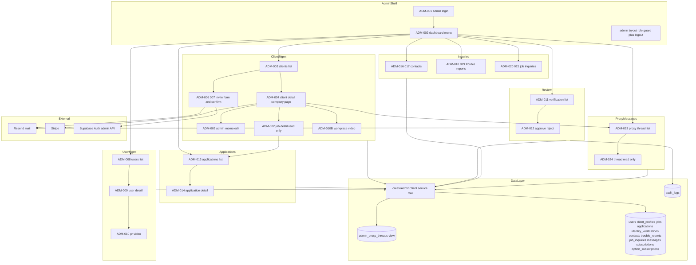
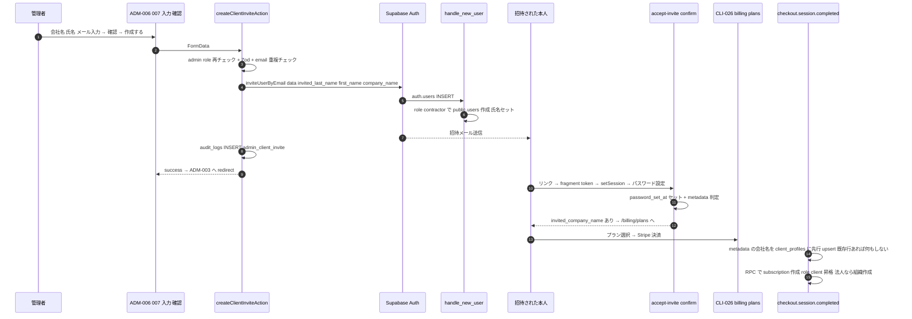
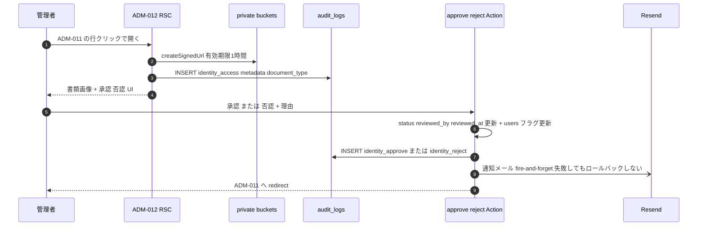

# Technical Design — admin（管理者機能）

## Overview

**Purpose**: サービス運営者（admin）向けの管理機能 全24画面（ADM-001〜024）を完成させる。専用ログイン・ログアウト導線、発注者/ユーザーアカウント管理、本人確認審査、応募履歴（admin 専用8分類）、問い合わせ系3ペアの閲覧、代理メッセージの監督閲覧、運営による発注者アカウント発行（招待フロー）を提供する。

**Users**: 運営のシステム管理者（`users.role = 'admin'`）のみ。一般ユーザー（受注者・発注者・担当者）はアクセス不可。

**Impact**:
- 既存 admin シェル（`src/app/admin/`）を拡張し、新規ルート群を追加。ADM-008/009/010/010B は video-display 由来の最小実装をカンプ準拠に仕上げる
- DB 変更は最小2点: `applications.cancelled_by` カラム新設（バックフィル付き）、`admin_proxy_threads` ビュー新設。既存テーブルの RLS は変更しない（admin は service_role でアクセス）
- 横断変更: middleware（/admin/login 例外）、`acceptInviteAction`（招待後の遷移分岐）、checkout Webhook（会社名反映）、`withdrawAction`（カスケードの共有ヘルパー抽出）、`cancelApplicationAction`（cancelled_by 記録）

### Goals
- 全24画面を「users パターン」（createAdminClient + サーバー側フィルタ + 20件ページング + searchParams SSOT）で統一実装する
- 管理者の全操作（ログイン・書類アクセス・承認/否認・削除・招待・発注取消）を audit_logs に記録する
- 一覧のフィルタ・count・ページネーションを全画面でサーバー側完結にする（post-filter 禁止ルール遵守）
- 削除・評価表示・名前解決は既存資産（withdrawAction / fetchPerItemSummary / fetchClientReputation / resolveParticipantName）を流用し二重実装しない

### Non-Goals
- 問い合わせ系の対応状況管理・返信機能（閲覧のみ。ステータス列も追加しない）
- ADM-024 からのメッセージ送信（閲覧専用。将来の入力欄追加の土台に留める）
- CSV/集計出力 UI・退会理由集計画面・マスタ管理 UI（スコープ外。DB は出力可能な形を維持）
- 管理者アカウント自体の作成・編集・削除 UI（Supabase SQL Editor 直接運用）
- **CLI-021 法人 setup の緩和（仕様変更⑤）は billing spec 側で実施**（本 spec からは前方参照のみ。`.kiro/specs/billing/` で管理）

## Architecture

### Existing Architecture Analysis
- App Router（RSC 直接フェッチ + Server Action）、Supabase + RLS、三重防御（Middleware → UI/Server Action → RLS）。admin 画面のデータアクセスは `createAdminClient()`（service_role、RLS バイパス）で全社横断取得する既存方針
- admin シェルは `src/app/admin/layout.tsx`（role='admin' 再チェックの二重ガード）＋ users パターンの一覧/詳細が稼働済み。本 spec はこのパターンを全ドメインへ水平展開する
- 発注者向け画面（CLI 系）は「自社のみ」の RLS スコープで動くため流用しない（requirements 案B 確定）。admin は閲覧専用の独自画面を持つ

### Architecture Pattern & Boundary Map



**Architecture Integration**:
- Selected pattern: **既存 users パターンの水平展開**。一覧 = RSC + createAdminClient + サーバー側フィルタ + 20件 `.range()` + searchParams SSOT、変更 = Server Action（role 再チェック → Zod → admin client → audit log → revalidate/redirect）
- Domain boundaries: ルートは `/admin/{clients|users|jobs|verifications|applications|contacts|trouble-reports|job-inquiries|messages|login|password}` でドメインごとに分離。各ドメインの Server Action は同ディレクトリの `actions.ts` に閉じる
- Existing patterns preserved: 三重防御、ActionResult 型、ID 集合の積によるフィルタ、`resolveParticipantName()` による発注者名解決、メール失敗時の非ロールバック、`<button type>` 明示
- New components rationale: 新規 DB オブジェクトは `applications.cancelled_by`（8分類の判定材料）と `admin_proxy_threads` ビュー（1000件上限回避）のみ。他はすべて既存資産の組み替え
- Steering compliance: security.md（監査ログ・署名付きURL・メール方針）、authentication.md（admin 分離・招待 implicit flow・password_set_at）、database-schema.md（発注者表示名ルール・org-scoping）

### Technology Stack

| Layer | Choice / Version | Role in Feature | Notes |
|-------|------------------|-----------------|-------|
| Frontend | Next.js 16 App Router（RSC + Client Components）+ shadcn/ui | 全24画面の SSR・フォーム | 新規依存なし。admin 画面はカンプ（ADM-001〜024.png ※存在分）準拠 |
| Backend | Next.js Server Actions | 認証・審査・削除・招待・発注取消 | 既存パターン。全て role='admin' 再チェック |
| Data | Supabase Postgres（service_role）+ 既存 RLS | 全社横断 SELECT、cancelled_by 追加、admin_proxy_threads ビュー | 一般ユーザー向け RLS は不変更 |
| Auth | Supabase Auth（signInWithPassword / inviteUserByEmail / updateUser） | ADM-001/015、ADM-006/007 招待 | implicit flow（既存招待と同パターン） |
| Email | Resend（dev は /tmp フォールバック） | 本人確認 承認/否認 通知 | テンプレ2本新設。fire-and-forget |
| Billing | Stripe SDK | アカウント削除時のサブスクリプション解約 | **解約 API 呼び出し（`stripe.subscriptions.cancel`）は本 spec で新規実装**。既存 withdrawAction の解約処理は TODO スタブ（中身が空）であることをコードで確認済み |

新規外部依存はなし。

## System Flows

### 管理責任者 招待フロー（ADM-006/007 → 本人決済 → 会社名反映）



**Key Decisions**:
- 招待メール送信失敗時は `auth.admin.deleteUser()` でクリーンアップ（幽霊アカウント防止、requirements 既定）
- 氏名は `handle_new_user` トリガーの既存メタデータ規約（`invited_last_name` / `invited_first_name`）で users にセットされる。`invited_role` は付けない → contractor フォールバック（research.md 参照）
- 決済以降は通常の課金フローと完全同一。Webhook への追加は「**RPC より先に** 会社名で client_profiles を ignoreDuplicates upsert」の冪等な1ステップのみ（RPC が display_name を姓名で必ず埋めるため「後から未設定なら反映」では成立しない。詳細は ClientInvitePage の Implementation Notes）

### 本人確認 審査フロー（ADM-012）



### ADM-013 admin 専用8分類（派生分類）

DB の `applications.status` は変更せず、**status＋初回稼働日＋cancelled_by から計算する**。両者の評価が揃うと status が completed/lost に自動遷移する既存実装により、`accepted` 残存行＝評価未完が保証されるため、全分類が WHERE 句で表現できる（research.md 参照）。

| 分類（バッジ表記） | WHERE 条件 |
|------|------|
| 応募中 | `status = 'applied'` |
| 発注済み・初回稼働日前 | `status = 'accepted' AND (first_work_date IS NULL OR first_work_date >= 当日)` |
| 評価未入力 | `status = 'accepted' AND first_work_date < 当日` |
| 取引完了 | `status = 'completed'` |
| 取引不成立（欠席など） | `status = 'lost'` |
| ユーザー側からのキャンセル | `status = 'cancelled' AND (cancelled_by = 'contractor' OR cancelled_by IS NULL)` |
| 運営によるキャンセル | `status = 'cancelled' AND cancelled_by = 'admin'` |
| 発注側からのお断り | `status = 'rejected'` |

- `first_work_date IS NULL` の accepted は「発注済み・初回稼働日前」に含める（稼働日未確定＝経過判定不能のため取消可能側に倒す）
- 行バッジ表示用の `classifyAdminApplication()` とフィルタ用 WHERE 変換は同一モジュールに置き、判定のズレを構造的に防ぐ

## Requirements Traceability

requirements.md の ID 体系（REQ-ADM-NNN、画面 ID と一致）をそのまま用いる。

| Requirement | Summary | Components | Interfaces | Flows |
|-------------|---------|------------|------------|-------|
| REQ-ADM-001 | 専用ログイン | AdminLoginPage, adminLoginAction, Middleware変更 | adminLoginAction, writeAuditLog | — |
| REQ-ADM-002 | トップメニュー＋ログアウト | DashboardPage, AdminShell（layout） | adminLogoutAction | — |
| REQ-ADM-003 | 発注者一覧（人単位・区分/プラン/オプション） | ClientsListPage, ClientRowResolver | buildClientListQuery, resolveContractHolder | — |
| REQ-ADM-004 | 発注者詳細（会社単位1ページ） | ClientDetailPage, deleteClientAccountAction | executeWithdrawal, fetchClientReputation | — |
| REQ-ADM-005 | 管理者メモ編集 | ClientEditPage, updateAdminMemoAction | updateAdminMemoAction | — |
| REQ-ADM-006/007 | 管理責任者 新規作成（招待） | ClientInvitePage, createClientInviteAction, acceptInviteAction拡張, Webhook拡張 | createClientInviteAction | 招待フロー |
| REQ-ADM-022 | 募集現場詳細（閲覧専用） | AdminJobDetailPage | — | — |
| REQ-ADM-008 | ユーザー一覧（対象絞り＋3択フィルタ） | UsersListPage改修 | — | — |
| REQ-ADM-009 | ユーザー詳細（評価刷新・削除/導線） | UserDetailPage改修, deleteUserAccountAction | fetchPerItemSummary, executeWithdrawal | — |
| REQ-ADM-010 | 受注者PR動画投稿 | 既存実装＋audit log 追記 | updateVideoUrlAction | — |
| REQ-ADM-010B | 職場紹介動画投稿（入口移設） | 既存実装＋導線変更＋audit log 追記 | updateWorkplaceVideoUrlAction | — |
| REQ-ADM-011 | 本人確認申請一覧（古い順・種別ラベル） | VerificationsListPage | — | — |
| REQ-ADM-012 | 承認/否認＋監査ログ＋メール | VerificationDetailPage, approve/rejectVerificationAction, getSignedDocumentUrls | approveVerificationAction, rejectVerificationAction | 審査フロー |
| REQ-ADM-013 | 応募履歴一覧（8分類・2軸ソート・横断検索） | ApplicationsListPage, application-status module, cancelled_by migration | classifyAdminApplication | 8分類表 |
| REQ-ADM-014 | 応募詳細（個別評価両方向・発注取消） | ApplicationDetailPage, adminCancelApplicationAction | adminCancelApplicationAction | 8分類表 |
| REQ-ADM-015 | パスワード変更 | AdminPasswordPage, changeAdminPasswordAction | changeAdminPasswordAction | — |
| REQ-ADM-016/017 | お問い合わせ閲覧 | ContactsListPage, ContactDetailPage | getSupportAttachmentUrls | — |
| REQ-ADM-018/019 | トラブル報告閲覧 | TroubleReportsListPage, TroubleReportDetailPage | getSupportAttachmentUrls | — |
| REQ-ADM-020/021 | 求人問い合わせ閲覧 | JobInquiriesListPage, JobInquiryDetailPage | resolveParticipantName | — |
| REQ-ADM-023 | 代理メッセージ一覧 | ProxyThreadsListPage, admin_proxy_threads view | — | — |
| REQ-ADM-024 | メッセージ詳細（閲覧専用） | ProxyThreadDetailPage | — | — |
| 非機能（セキュリティ/データ保護） | 監査ログ・署名付きURL・PII | writeAuditLog共有化, getSignedDocumentUrls | — | — |

## Components and Interfaces

### 概要

| Component | Domain/Layer | Intent | Req Coverage | Key Dependencies | Contracts |
|-----------|--------------|--------|--------------|------------------|-----------|
| AdminShell（layout 拡張） | UI 横断 | ログアウト導線＋ヘッダー統一 | 002 | adminLogoutAction (P0) | — |
| AdminLoginPage + adminLoginAction | Auth | 専用ログイン・列挙防止 | 001 | Supabase Auth (P0), writeAuditLog (P1) | Service |
| Middleware 変更 | Auth | /admin/login 例外・未認証誘導 | 001 | 既存 middleware (P0) | — |
| changeAdminPasswordAction | Auth | パスワード変更 | 015 | Supabase Auth (P0) | Service |
| ClientsListPage | 発注者管理 | 人単位一覧＋区分/プラン/オプション | 003 | resolveContractHolder (P0) | — |
| ClientDetailPage | 発注者管理 | 会社単位詳細（13セクション） | 004, 010B, 022, 023 | fetchClientReputation (P1), executeWithdrawal (P0) | Service |
| ClientEditPage + updateAdminMemoAction | 発注者管理 | admin_memo 編集 | 005 | admin client (P0) | Service |
| ClientInvitePage + createClientInviteAction | 発注者管理 | アカウント発行＋招待 | 006, 007 | Supabase Auth admin API (P0) | Service |
| acceptInviteAction 拡張 / Webhook 拡張 | 横断 | 招待後遷移分岐・会社名反映 | 007 | user_metadata (P0) | Service |
| AdminJobDetailPage | 発注者管理 | 募集現場詳細（閲覧専用） | 022 | admin client (P0) | — |
| UsersListPage 改修 | ユーザー管理 | 対象絞り＋3択フィルタ | 008 | 既存実装 (P0) | — |
| UserDetailPage 改修 + deleteUserAccountAction | ユーザー管理 | 評価刷新・削除/ADM-004導線 | 009 | fetchPerItemSummary (P0), executeWithdrawal (P0) | Service |
| VerificationsListPage | 本人確認 | pending 一覧（古い順） | 011 | admin client (P0) | — |
| VerificationDetailPage + approve/reject Actions | 本人確認 | 審査・監査・通知 | 012 | getSignedDocumentUrls (P0), sendEmail (P1) | Service |
| application-status module + migration | 応募管理 | 8分類の判定とWHERE変換 | 013, 014 | — | Service |
| ApplicationsListPage | 応募管理 | 横断検索・2軸ソート・絞込 | 013 | application-status (P0) | — |
| ApplicationDetailPage + adminCancelApplicationAction | 応募管理 | 個別評価表示・発注取消 | 014 | application-status (P0) | Service |
| Inquiry 3ペア（6画面） | 問い合わせ閲覧 | contacts/trouble/job_inquiries 閲覧 | 016–021 | getSupportAttachmentUrls (P1) | — |
| admin_proxy_threads view + ProxyThreads 2画面 | 代理メッセージ | 監督閲覧（会社絞込） | 023, 024 | admin client (P0) | State |
| 共有ユーティリティ（formatDateTime / writeAuditLog / getSignedDocumentUrls / executeWithdrawal） | Lib | 横断部品 | 全般 | — | Service |

以下、新しい境界を導入するコンポーネントのみ詳細ブロックを記す。一覧系 RSC は users パターンの複製のため Summary＋Implementation Note に留める。

### 共有ユーティリティ（Lib）

#### 共有ヘルパー群

| Field | Detail |
|-------|--------|
| Intent | admin 全画面で使う横断部品。日時表示・監査ログ・署名付きURL・退会カスケード |
| Requirements | 非機能全般, 004, 009, 012, 016–019 |

**Contracts**: ☑ Service

##### Service Interface

```typescript
// src/lib/utils/format-date.ts（追記）
/** ISO文字列 → "2026/06/10 14:30"。**タイムゾーンは Asia/Tokyo を明示して変換する**
 *  （本番サーバーは UTC のため、明示しないと全画面の日時が9時間ズレる。
 *   Intl.DateTimeFormat に timeZone: "Asia/Tokyo" を指定）。null/不正は fallback（既定 "—"） */
export function formatDateTime(iso: string | null | undefined, fallback?: string): string;

// src/lib/audit/log.ts（login/actions.ts の writeAuditLog を抽出・共有化）
export type AuditAction =
  | "auth.login.success" | "auth.login.failure"  // 既存ログインの実値をそのまま維持（変更しない）
  | "identity_access" | "identity_approve" | "identity_reject"  // 値は requirements 指定（'identity_access'）に従う
  | "account_delete" | "admin_client_invite"
  | "application_cancel_admin" | "admin_password_change"
  | "admin_memo_update" | "video_url_update";    // ADM-005 / ADM-010 / ADM-010B（「管理者の全操作を記録」要件のため追加）
export async function writeAuditLog(params: {
  actorId: string | null;
  action: AuditAction;
  targetType: string;
  targetId: string;
  metadata?: Record<string, unknown>;
}): Promise<void>; // 失敗してもthrowしない（本体処理を阻害しない）
// 【必須】INSERT は createAdminClient()（service_role）で行うこと。
// audit_logs の RLS は INSERT ポリシーが無く（server-side only 設計）、
// セッションクライアントからの INSERT は全件サイレント失敗する。
// 既存 login/actions.ts の writeAuditLog は createClient()（セッション）で INSERT しており
// 現在も記録されていない（既存バグ）。本抽出で admin client 化して同時に修正する

// src/lib/admin/signed-urls.ts（新設）
/** private バケットのパス群から署名付きURL（1時間）を生成。
 *  audit オプション指定時は audit_logs に identity_access を INSERT する */
export async function getSignedDocumentUrls(params: {
  bucket: "identity-documents" | "ccus-documents" | "support-attachments" | "message-attachments";
  paths: string[];
  audit?: { actorId: string; targetType: string; targetId: string; documentType?: "identity" | "ccus" };
}): Promise<{ path: string; url: string | null }[]>;

// src/lib/withdrawal/execute.ts（withdrawAction から抽出）
/** C案カスケード退会: 対象ユーザーのソフトデリート＋auth ban＋
 *  （Owner の場合）配下メンバー連動凍結・org ソフトデリート・members 削除＋Stripe 解約。
 *  【契約の要点】
 *  - 退会前ガード（applied/accepted 応募あり・受注者作業中の案件あり → 拒否）は
 *    本人退会・admin 削除の両方で適用する。admin はまず ADM-014 の発注取消等で
 *    進行中の取引を整理してから削除する運用（エラー文言は admin 画面にそのまま表示）
 *  - DB 書き込みはすべて createAdminClient()（service_role）で行う
 *    （現実装はセッションクライアント＝本人前提のため、抽出時に書き換える）
 *  - カスケード内の applications status='cancelled' 更新には cancelledBy を記録する
 *  - Stripe 解約（stripe.subscriptions.cancel。subscriptions と option_subscriptions の
 *    stripe id を参照）は現実装が TODO スタブのため本 spec で新規実装する。
 *    失敗は削除をブロックしない（ログのみ＝既存方針）
 *  - セッションの signOut・退会完了メールは共有関数に含めず呼び出し側の責務とする
 *    （本人退会: 両方実行 ／ admin 削除: どちらも行わない。admin のセッションを
 *    誤って切らない・強制削除相手に「退会手続き完了」メールを送らない） */
export async function executeWithdrawal(params: {
  targetUserId: string;
  /** 退会理由 survey の INSERT を行うか（本人退会のみ true） */
  recordSurvey?: boolean;
  /** カスケードで cancelled になる応募に記録する主体（本人退会='contractor'、admin 削除='admin'） */
  cancelledBy: "contractor" | "admin";
}): Promise<{ success: true } | { success: false; error: string }>;
```

- Preconditions: 呼び出し元で admin role（または本人）の認可確認済み
- Postconditions: `executeWithdrawal` 成功時、対象（と配下）の `deleted_at` セット・ログイン不可・Stripe 解約済み（Stripe 失敗は削除を妨げない。**解約 API 呼び出しは本 spec で新規実装** — 現 withdrawAction の解約は TODO スタブで、本人退会でも実は解約されていない既存ギャップを同時に解消する）
- Invariants: `writeAuditLog` / メール送信の失敗は本体処理をロールバックしない（security.md）

**Implementation Notes**:
- Integration: `withdrawAction` は抽出後 `executeWithdrawal({ targetUserId: user.id, recordSurvey: true, cancelledBy: "contractor" })` を呼び、signOut と退会完了メールを自身で実行する薄いラッパーに書き換える。**抽出後に既存の退会系 Vitest / E2E を必ず全実行**
- Validation: `formatDateTime` は全 admin 画面の日時表示に必ず使用（生 ISO 禁止の共通ルール）
- Risks: withdrawAction リファクタの回帰。タスク0（全テスト実行）＋退会 E2E で担保

### シェル（AdminShell / ADM-002・Summary）

- **AdminShell（`src/app/admin/layout.tsx` 拡張）**: 既存の「ビジ友 管理画面」ヘッダーバーに ①ダッシュボード（ADM-002）へ戻るリンク ②ログアウトボタン（`<form action={adminLogoutAction}>`、`type="submit"` 明示）を追加する。これで「全 admin 画面からログアウト導線に到達できる」要件を満たす（role='admin' 再チェックの二重ガードは現状維持）
- **adminLogoutAction（`src/app/admin/actions.ts` に新設）**: `supabase.auth.signOut()` → `redirect("/admin/login")`。既存 `logoutAction`（/login へ redirect）は一般ユーザー用のため流用せず、admin 専用に分離する
- **DashboardPage（ADM-002・`/admin/dashboard`）**: requirements REQ-ADM-002 のメニュー項目列（発注者一覧／ユーザー一覧／本人確認／応募履歴／お問い合わせ／トラブル報告／求人問い合わせ／メッセージ一覧＝全社／パスワード変更）をそのまま縦並びリンクで実装＋ログアウト。件数表示・ダッシュボード数値は付けない（requirements 確定）

### 認証（ADM-001 / ADM-015 / Middleware）

#### AdminLoginPage + adminLoginAction

| Field | Detail |
|-------|--------|
| Intent | `/admin/login` 専用ログイン。非 admin を汎用エラーで拒否（列挙防止） |
| Requirements | 001 |

**Responsibilities & Constraints**
- メール＋パスワード。成功時 `/admin/dashboard` へ。「パスワードを忘れた方はこちら」→ 既存 `/reset-password` フロー流用（再設定後は本人が `/admin/login` から再ログイン）
- 非 admin が正しい資格情報でログインした場合も `signOut()` してから**資格情報エラーと同一文言**を返す（アカウント存在・権限の推測を防止）

**Dependencies**
- Outbound: Supabase Auth `signInWithPassword` / `signOut`（P0）、`writeAuditLog`（P1）

**Contracts**: ☑ Service

##### Service Interface

```typescript
// src/app/admin/login/actions.ts
export async function adminLoginAction(formData: FormData): Promise<ActionResult>;
// 成功時は redirect("/admin/dashboard") で完了（戻り値なし）
```

- Preconditions: 未認証（認証済み admin は middleware が /admin/dashboard へ流す）
- Postconditions: 成功＝admin セッション確立＋audit log（login_success）。失敗＝セッションなし＋audit log（login_failure、メールはマスク）
- Invariants: エラー文言は「メールアドレスまたはパスワードが正しくありません」の1種類のみ

**Implementation Notes**:
- Integration: 既存 `loginAction` の構造（Zod → signInWithPassword → role 取得 → audit）を流用し、role 判定を `!== 'admin'` 拒否に反転。一般 `/login` の「admin → /admin/dashboard」分岐は現状維持（回帰リスク回避）
- **ルート構成（2026-06-11 レビューで追記）**: 既存 `src/app/admin/layout.tsx` の認可ガード（未認証・非 admin を redirect）の配下に `/admin/login` を置くとログイン画面が表示できない。ガード付きレイアウトは route group `src/app/admin/(protected)/` へ移して既存ページをその配下に移動し（URL 不変）、`/admin/login` はガードの外に置く。ガードの redirect 先は `/login` → `/admin/login` に変更する
- パスワード再設定の実動作の注意: 既存リセットフローの完了時は `/login` へ遷移するが、その時点で recovery セッション（再設定用の一時ログイン状態）が生きているため、admin は middleware により `/admin/dashboard` へ流れる。要件の「/admin/login からログインし直す」と画面上の見え方が異なるが実害はなく、フロー改変はしない（E2E の期待値はこの実動作に合わせる）
- Validation: フォームは email/password 必須の最小 Zod。ボタン `type="submit"` 明示
- Risks: なし（追加のみ）

#### Middleware 変更（Summary）

変更は4点のみ（他のルーティングは不変更）:
1. `/admin/login` を未認証許可パスに追加（auth ページ扱い）
2. 未認証の `/admin/*`（login 以外）→ `/admin/login` へ redirect（現状の `/login` 行きから変更）
3. 認証済み admin の `/admin/login` → `/admin/dashboard` へ redirect
4. 認証済み非 admin の `/admin/*` ブロック（→ /mypage）は現状維持

**Implementation Note**: middleware ルーティングの Vitest は本体定数を import する（テスト内コピー禁止ルール）。

#### AdminPasswordPage + changeAdminPasswordAction（Summary）

`/admin/password`。現在のパスワード（必須）／新パスワード（8文字以上）／確認（一致）。Server Action は ①admin role 再チェック ②`signInWithPassword(自身のemail, currentPassword)` で現在値照合 ③`supabase.auth.updateUser({ password })` ④audit log（admin_password_change） ⑤成功メッセージをインライン表示（遷移しない）。標準3項目フォームで確定（requirements G）。

### 発注者アカウント管理（ADM-003〜007 / 022 / 010B）

#### ClientsListPage（ADM-003）

| Field | Detail |
|-------|--------|
| Intent | role IN ('client','staff') を人単位1行で一覧。区分・プラン・オプションは契約主体から導出 |
| Requirements | 003 |

**Responsibilities & Constraints**
- ルート: `/admin/clients`。並び順は登録日時の新しい順（requirements 未指定のための設計判断）。20件ページング・count exact
- **契約主体の解決**（`resolveContractHolder`）: `role='client'` → 本人。`role='staff'` → `organization_members` → `organizations.owner_id`。行クリックは常に `/admin/clients/{契約主体userId}` へ
- **区分の導出**: staff → org_role（admin=組織管理者 / staff=担当者）。client → org owner なら管理責任者、それ以外は active/past_due subscription の plan_type（individual=個人発注者 / small=小規模発注者）。判定不能（有効サブスクなし等）は「—」
- **プラン列**: 契約主体の subscription（active/past_due）の plan_type を 個人/小規模/法人/法人・高サポート 表記。なければ「—」
- **オプションバッジ**: 契約主体の active な `urgent` / `video_workplace`（行・フィルタとも契約主体基準。staff 行にも所属会社のバッジを出す）
- 退会済み（deleted_at）は行に「退会済み」表示で含める。代理アカウント（is_proxy_account=true のメンバー）も role=staff の行として含める（区分=担当者）

**Dependencies**
- Outbound: admin client（P0）— users / organization_members / organizations / client_profiles / subscriptions / option_subscriptions のバッチ取得

**Contracts**: ☑ Service

##### Service Interface

```typescript
// src/lib/admin/clients-list.ts（新設。クエリロジックを page から分離し Vitest 可能にする）
export type ClientCategory = "owner" | "org_admin" | "org_staff" | "individual" | "small";
export interface ClientListFilter {
  keyword?: string;            // 氏名・メール・会社名
  category?: ClientCategory;   // 枠1: 区分（単一選択）
  option?: "urgent" | "video_workplace"; // 枠2: オプション（単一選択）
  page: number;
}
export interface ClientListRow {
  userId: string;
  contractHolderId: string;    // 行クリック遷移先（ADM-004 の id）
  name: string;                // 姓名（スペースなし結合）
  companyName: string | null;  // 契約主体の client_profiles.display_name
  email: string;
  category: ClientCategory | null;
  planLabel: string | null;    // 個人/小規模/法人/法人・高サポート
  optionBadges: ("urgent" | "video_workplace")[];
  isDeleted: boolean;
}
export async function fetchClientListPage(filter: ClientListFilter):
  Promise<{ rows: ClientListRow[]; totalCount: number }>;
```

**Implementation Notes**:
- Integration: フィルタは ID 集合の積パターン（CLI-005 基準実装と同型）。①keyword → users ilike(姓/名/メール) の id 集合 ∪ client_profiles.display_name ilike → owner id → 自身＋配下メンバーに展開した id 集合 ②category → organization_members（org_role）または subscriptions（plan_type）由来の id 集合 ③option → option_subscriptions(active) → 契約主体 id → 自身＋配下メンバーに展開。全集合の積を `.in("id", ids)` でメイン query に渡す
- 行の付加情報（会社名・プラン・バッジ）は **20行分の契約主体 id をまとめて4クエリでバッチ取得**（client_profiles / subscriptions / option_subscriptions / organization_members）。N+1 禁止
- Validation: 「管理責任者 新規登録」ボタン → `/admin/clients/new`
- Risks: 派生列が多い。導出ロジック（区分・プラン）は純粋関数に切り出して Vitest で網羅する

#### ClientDetailPage（ADM-004）+ deleteClientAccountAction

| Field | Detail |
|-------|--------|
| Intent | 会社（契約主体）単位の詳細1ページ。閲覧中心＋削除のみ操作 |
| Requirements | 004, 010B（入口）, 022（入口）, 023（入口） |

**Responsibilities & Constraints**
- ルート: `/admin/clients/[id]`（id = 契約主体の userId）。`role='client'` でなければ `notFound()`
- **退会済み（deleted_at あり）の契約主体も表示する**（ADM-003 が退会済み行を出すため、クリック先も閲覧可能にする）。その場合はヘッダーに「退会済み」を表示し、「アカウントを削除する」「編集する」「職場紹介動画を投稿/編集する」は非表示にする
- 表示構成は requirements の 13 セクション順に従う。ヘッダーは admin 共通レイアウト（カンプの LOGO/ハンバーガー/＜ は使わない）
- **集計スコープ**: 法人（org あり）は organization_id 単位、個人・小規模は owner_id 単位（org-scoping 準拠）
  - 評判: `fetchClientReputation(supabase, scope)` をそのまま使用
  - 募集現場一覧: jobs（org or owner スコープ・全ステータス・ステータスバッジ付き）＋ 案件ごとの応募数（job_id 集合で applications を1クエリ count→JS集計）＋ 会社合計（案件数・応募数）
- **オプション加入状況**: active `urgent`（☑＋有効期限。複数案件分 active の場合は最長 end_date＋件数併記）／ active `video_workplace` の有無
- **職場紹介動画**: active video_workplace かつ workplace_video_url ありで埋め込み（CON-006 と同配置）。「投稿/編集する」→ `/admin/users/[id]/workplace-video`（既存 ADM-010B ルート流用。もどるは ADM-004 へ）
- **担当者一覧**（法人のみ）: organization_members を複数行表示（氏名/メール/区分=管理責任者・組織管理者・担当者/招待中バッジ=`password_set_at IS NULL`）。閲覧のみ
- **代理メッセージを見る**（法人かつ admin_proxy_threads に当該 org の行が存在する場合のみ）→ `/admin/messages?organizationId={orgId}`
- **アカウント削除**: 確認ダイアログ（配下スタッフ連動削除の警告文）→ `deleteClientAccountAction`

**Dependencies**
- Outbound: admin client（P0）、`fetchClientReputation`（P1）、`executeWithdrawal`（P0）、`resolveParticipantName`（P1）

**Contracts**: ☑ Service

##### Service Interface

```typescript
// src/app/admin/clients/[id]/actions.ts
export async function updateAdminMemoAction(userId: string, formData: FormData): Promise<ActionResult>;
export async function deleteClientAccountAction(userId: string): Promise<ActionResult>;
```

- Preconditions: 実行者 role='admin'（Action 内再チェック）。delete は対象が `role='client'` かつ未削除
- Postconditions: delete 成功＝`executeWithdrawal({ targetUserId, recordSurvey: false, cancelledBy: "admin" })` のカスケード完了（進行中取引があればガードにより拒否され、エラー文言を admin 画面に表示）＋audit log（account_delete、metadata に cascade 対象数）＋ `/admin/clients` へ redirect
- Invariants: 削除は ADM-004 に一本化（ADM-009 では client に削除ボタンを出さない）

**Implementation Notes**:
- Integration: ADM-005（`/admin/clients/[id]/edit`）は admin_memo テキストエリア1項目のみ。保存成功で ADM-004 へ。保存時に audit log（admin_memo_update）を記録する（「管理者の全操作を監査ログに記録」要件）。同要件のため既存の動画更新 Server Action（updateVideoUrlAction / updateWorkplaceVideoUrlAction）にも audit log（video_url_update）を追記する
- Validation: admin_memo は max 2000 文字程度の上限のみ（自由記述）
- Risks: セクション数が多く1ページのクエリ数が嵩む。詳細ページは1ユーザー操作なので許容（一覧の N+1 とは性質が異なる）。jobs と applications の count は2クエリに集約

#### ClientInvitePage + createClientInviteAction（ADM-006/007）

| Field | Detail |
|-------|--------|
| Intent | 運営によるアカウント発行＋招待メール送信（発注者化は本人の決済時） |
| Requirements | 006, 007 |

**Responsibilities & Constraints**
- ルート: `/admin/clients/new` の1ルート内で「入力（ADM-006）→ 確認（ADM-007）」を `useState` の段階的表示で実装（CLAUDE.md 標準パターン）。「作成する」`type="submit"`、「修正する」「もどる」は `type="button"`
- 作成するのは auth アカウント＋招待のみ。**role=client・組織・課金レコードは作らない**

**Dependencies**
- Outbound: admin client（P0）— users 重複チェック、Supabase Auth admin API `inviteUserByEmail` / `deleteUser`（P0）、`writeAuditLog`（P1）

**Contracts**: ☑ Service

##### Service Interface

```typescript
// src/app/admin/clients/new/actions.ts
export interface ClientInviteInput {
  companyName: string; // 必須・決済後 display_name へ
  lastName: string;    // 必須
  firstName: string;   // 必須
  email: string;       // 必須
}
export async function createClientInviteAction(formData: FormData): Promise<ActionResult>;
```

- Preconditions: 実行者 role='admin'
- Postconditions: 成功＝auth.users 作成（トリガー経由で public.users が role='contractor'＋氏名セット）＋招待メール送信＋audit log（admin_client_invite、metadata: email/companyName）。ADM-003 へ redirect
- Invariants: `invited_role` は metadata に**付けない**（staff 化防止）。送信失敗時は `deleteUser` でクリーンアップし幽霊アカウントを残さない

**Implementation Notes**:
- Integration:
  1. `public.users` から email 重複を事前チェック →「このメールアドレスは既に登録されています」（requirements の「auth.users に存在しないか確認」とはトリガー同期により等価。漏れたケースも `inviteUserByEmail` 自体のエラーで捕捉する二段構え）
  2. `inviteUserByEmail(email, { data: { invited_last_name, invited_first_name, invited_company_name }, redirectTo })`。redirectTo は既存スタッフ招待と同じ `/accept-invite/confirm`（implicit flow＋フラグメントトークン。host header から動的構築）
  3. その他エラーは「アカウントの作成に失敗しました。時間をおいて再度お試しください」
- **acceptInviteAction の拡張**: パスワード保存成功後、`user_metadata.invited_company_name` が存在する場合は遷移先を `/billing/plans`（CLI-026）にする（スタッフ招待は従来どおり）。これが「受注者オンボをスキップしてプラン案内へ直行」の実装点
- **Webhook の拡張**（`handle-checkout-completed.ts` plan 分岐）: **RPC 呼び出しの「前」に** `auth.admin.getUserById(userId)` で metadata を読み、`invited_company_name` があれば `client_profiles` に `{ user_id, display_name: 会社名 }` を **`ignoreDuplicates` upsert**（既存行があれば何もしない）してから RPC を呼ぶ
  - **「RPC 後に未設定なら反映」では成立しない**ことをコードで確認済み: RPC `handle_checkout_completed_plan` は `INSERT INTO client_profiles (user_id, display_name) VALUES (v_user_id, 姓名) ON CONFLICT DO NOTHING` で **display_name を担当者の姓名で必ず埋める**ため、後から見ると常に「設定済み」になる。先に会社名で行を作っておけば、RPC の ON CONFLICT DO NOTHING が会社名を維持する
  - 冪等性: ignoreDuplicates のため Webhook 再実行・本人が CLI-021 で編集済みの場合も上書きしない
- Risks:
  - 招待された本人が決済しないまま放置 → role=contractor のまま残る（許容・requirements 既定）。E2E は seed の `email_confirmed_at = NULL` ルールに注意
  - **招待ユーザーは「スキル・対応エリア未登録の contractor / client」という新しい正当な状態を作る**（受注者オンボをスキップするため）。CLI-005（職人一覧）等にスキル欄が空のまま表示されうるが、表示が壊れることはなく**許容する**。CLAUDE.md の「自分で会員登録した全ユーザーは必ず skills を持つ」前提（CLI-005/006 セクション・seed ルール）に本招待フロー由来の例外がある旨を追記すること（tasks に含める）

#### AdminJobDetailPage（ADM-022・Summary）

`/admin/jobs/[id]`。閲覧専用 RSC。admin client で jobs＋job_areas＋job_images＋発注者（resolveParticipantName）を取得し、案件内容（タイトル・ステータス・募集職種/人数・報酬レンジ・募集期間・工事期間・エリア=`<AreaList>`・詳細・添付）を表示。発注者操作（編集・発注）は持たない。導線: 「応募一覧」→ `/admin/applications?jobId={id}`、「発注者詳細」→ ADM-004、もどる → `router.back()`。

**Implementation Note**: 存在しない id は `notFound()`。表示部品は CON-003 のセクション構成を参考にするが、データ取得は admin client で独立（既存画面に分岐を足さない＝案B）。

### ユーザーアカウント管理（ADM-008/009）

#### UsersListPage 改修（ADM-008・Summary）

既存 `/admin/users` に対する差分のみ:
1. 対象を `.in("role", ["contractor", "client"])` に絞る（staff/admin 除外）
2. オプションフィルタを3択に変更（`video` / `compensation_5000` / `compensation_9800`。`video_workplace` を OPTION_ITEMS から削除）
3. カンプ（ADM-008.png）準拠のスタイル仕上げ

#### UserDetailPage 改修（ADM-009）+ deleteUserAccountAction

| Field | Detail |
|-------|--------|
| Intent | 受注者詳細の不足項目追加（評価・経験年数・削除）とカンプ準拠化 |
| Requirements | 009 |

**Responsibilities & Constraints**
- 追加表示: ①発注者からの評価＝`fetchPerItemSummary` ＋ `StarRatingDisplay`（★×5 7項目平均＋件数。`/users/[id]/reviews` と同表示） ②評価の補足コメント一覧（20件ページング。searchParams `commentsPage`） ③経験年数＝CLI-006 と同じ「{職種} {N}年」表記
- 撤去: 職場紹介動画ボタン（入口は ADM-004 へ移設済み）
- 削除: `role='contractor'` のみ「アカウントを削除する」（確認ダイアログ → `deleteUserAccountAction` → `executeWithdrawal`＋audit log）。`role='client'` は削除ボタンを出さず「発注者詳細（ADM-004）」への導線を表示

**Contracts**: ☑ Service

```typescript
// src/app/admin/users/[id]/actions.ts（追記）
export async function deleteUserAccountAction(userId: string): Promise<ActionResult>;
// executeWithdrawal({ targetUserId, recordSurvey: false, cancelledBy: "admin" }) を呼び、
// audit log（account_delete）を記録して /admin/users へ redirect する。
// 対象が role='client' の場合は実行を拒否する（UI と二重防御。削除は ADM-004 に一本化）
```

**Implementation Notes**:
- Integration: 評価サマリーとコメント一覧の表示は `/users/[id]/reviews/page.tsx` のインライン実装を共有部品（`src/components/reviews/`）に抽出して両画面から使う（コピーしない）
- Risks: 共有部品抽出による既存評価ページの回帰 → 既存 E2E 確認

### 本人確認承認（ADM-011/012）

#### VerificationsListPage（ADM-011・Summary）

`/admin/verifications`。`identity_verifications WHERE status='pending'` を `created_at ASC`（古い順）で20件ページング。users join（氏名・年齢=calculateAge・メール）＋種別ラベル（document_type: 'identity'→「本人確認」/ 'ccus'→「CCUS」）＋「全○○件」表示。行クリック → `/admin/verifications/[id]`。

#### VerificationDetailPage + approve/rejectVerificationAction（ADM-012）

| Field | Detail |
|-------|--------|
| Intent | 書類の署名付きURL表示（監査記録付き）と承認/否認の実行 |
| Requirements | 012 |

**Responsibilities & Constraints**
- RSC が `getSignedDocumentUrls`（1時間・audit 付き）で書類URLを生成して表示。**画面を開いた時点で audit_logs（identity_access）が記録される**
- 両セクションの状態は自動決定（同時 pending なし）: identity 審査中 → CCUS側「未申請」グレーアウト ／ ccus 審査中 → 本人確認側は画像＋「承認済み」（ボタン非表示）
- ボタン活性条件（requirements の活性条件をそのまま実装する）: 本人確認セクション＝承認は常時活性・否認は否認理由入力時のみ活性。CCUS セクション＝承認は `users.identity_verified = true` の場合のみ活性・否認は同条件＋否認理由入力時のみ活性（CCUS は本人確認承認後しか申請できない業務ルールにより実質常に真だが、要件どおり条件を実装して解釈ブレを防ぐ）
- 完了後は ADM-011 へ redirect

**Contracts**: ☑ Service

##### Service Interface

```typescript
// src/app/admin/verifications/[id]/actions.ts
export async function approveVerificationAction(verificationId: string): Promise<ActionResult>;
export async function rejectVerificationAction(
  verificationId: string,
  formData: FormData, // rejection_reason 必須
): Promise<ActionResult>;
```

- Preconditions: 実行者 role='admin'。対象レコードが `status='pending'`（楽観チェック。pending でなければ「既に審査済みです」）
- Postconditions（承認）: `status='approved'`＋`reviewed_by/reviewed_at` セット＋users フラグ更新（identity → `identity_verified=true` ／ ccus → `ccus_verified=true` ＋ verification の `ccus_worker_id` を users へ反映）＋audit log（identity_approve）＋通知メール（fire-and-forget）
- Postconditions（否認）: `status='rejected'`＋`rejection_reason` セット＋audit log（identity_reject）＋再提出依頼メール（fire-and-forget）
- Invariants: メール送信失敗で本体処理をロールバックしない（security.md 共通方針）

**Implementation Notes**:
- Integration: メールテンプレ2本新設 `src/lib/email/templates/verification-approved.ts` / `verification-rejected.ts`（document_type で「本人確認」/「CCUS」を差し込む共用テンプレ。scout-notification の HTML 構成踏襲）。**Server Action から実際に import して使用する**（テンプレ未使用バグの再発防止）
- Validation: 否認理由は必須（min 1）・max 1000 文字
- Risks: 署名付きURLの期限切れ（1時間）後の画面放置 → 画像が 403 になるのみ。リロードで再発行（audit も再記録）

### 応募履歴管理（ADM-013/014）

#### application-status module + cancelled_by migration

| Field | Detail |
|-------|--------|
| Intent | admin 専用8分類の単一情報源（バッジ表示とフィルタWHERE変換） |
| Requirements | 013, 014 |

**Contracts**: ☑ Service

##### Service Interface

```typescript
// src/lib/admin/application-status.ts（新設）
export type AdminApplicationCategory =
  | "applied" | "accepted_before_start" | "review_pending" | "completed"
  | "lost" | "cancelled_by_contractor" | "cancelled_by_admin" | "rejected";

export const ADMIN_APPLICATION_CATEGORY_LABELS: Record<AdminApplicationCategory, string>;
// 応募中 / 発注済み・初回稼働日前 / 評価未入力 / 取引完了 / 取引不成立（欠席など）
// / ユーザー側からのキャンセル / 運営によるキャンセル / 発注側からのお断り

/** 行バッジ用の純粋関数。today は呼び出し側から注入（テスト容易性） */
export function classifyAdminApplication(app: {
  status: ApplicationStatus;
  first_work_date: string | null;
  cancelled_by: "contractor" | "admin" | null;
}, today: string): AdminApplicationCategory;

/** フィルタ用: 分類 → Supabase query への WHERE 条件適用 */
export function applyCategoryFilter<Q>(query: Q, category: AdminApplicationCategory, today: string): Q;

/** 発注取消ボタンの表示/実行可否（UI と Server Action で同一関数を使う） */
export function canAdminCancel(app: { status: ApplicationStatus; first_work_date: string | null }, today: string): boolean;
// = status === 'accepted' && (first_work_date === null || first_work_date >= today)
```

- Invariants: **前提＝両者の評価が揃うと status は completed/lost に遷移する**（applications/actions.ts の既存実装）。この前提が崩れる変更を入れる場合は本モジュールの再設計が必要（モジュール先頭コメントに明記）

##### Batch / Job Contract（migration）

```sql
-- supabase/migrations/<ts>_add_applications_cancelled_by.sql
ALTER TABLE applications
  ADD COLUMN cancelled_by text CHECK (cancelled_by IN ('contractor', 'admin'));
-- 既存データのバックフィル（現状キャンセルは受注者のみ可能だったため矛盾なし）
UPDATE applications SET cancelled_by = 'contractor' WHERE status = 'cancelled';
```

- Idempotency & recovery: 単発 DDL＋UPDATE。RLS 変更なし（既存ポリシーは行単位で列追加の影響を受けない）

**Implementation Notes**:
- Integration: 既存 `cancelApplicationAction`（受注者の自力キャンセル）の UPDATE に `cancelled_by: 'contractor'` を追加する
- Validation: `classifyAdminApplication` は8分類×境界日（当日/前日/null）を Vitest で網羅
- Risks: タイムゾーン（初回稼働日は date 型）。当日判定は JST 日付文字列比較で統一（既存5日前ルールと同様の比較方式）

#### ApplicationsListPage（ADM-013・Summary）

`/admin/applications`。各行: 応募者氏名（年齢）・メール・案件タイトル・初回稼働日（未確定「—」）・8分類バッジ。20件ページング。

- **検索**: キーワードを ①users ilike(氏名/メール)→applicant id 集合 ②jobs ilike(title)→job id 集合 ③client_profiles ilike(display_name)→owner→（org の場合 organization_id 経由で）job id 集合 に展開し、`.or(...)` で OR 結合する。**or 句は「空でない id 集合の枝だけ」で組み立てる**（例: 案件タイトルだけヒットした場合は `job_id.in.(...)` のみ。PostgREST は空の `in.()` を構文エラーにするため、空の枝を含めてはならない）。**全 id 集合が空の場合はクエリを発行せず0件結果を返す**。各 id 集合は上限1000件（超過時はより具体的なキーワードを促す注記）
- **ステータス絞込**: 8分類セレクト → `applyCategoryFilter`。**全条件サーバー側**（post-filter なし、count 正確）
- **ソート**: `sort=applied_at|first_work_date` × `order=desc|asc`。デフォルト応募日（created_at）新しい順。first_work_date ソートは NULLS LAST
- **ドリルダウン流用**: `?jobId=`（ADM-022 から・現場単位）／ `?clientId=`（ADM-004 から・会社単位: owner の org 有無で jobs.organization_id または owner_id → job id 集合）で絞り込み、絞り込み中はヘッダーに対象（案件名/会社名）を表示
- CSV ボタンは置かない（スコープ外）

#### ApplicationDetailPage + adminCancelApplicationAction（ADM-014）

| Field | Detail |
|-------|--------|
| Intent | 応募1件の詳細＋この応募の個別評価（両方向）＋発注取消 |
| Requirements | 014 |

**Responsibilities & Constraints**
- ステータスバッジ（8分類表記）。直下に発注取消ボタン（`canAdminCancel` が true の場合のみ表示）
- 案件情報（タイトル・募集職種/人数・締切・募集期間・勤務地・工事代金）→ クリックで ADM-022 へ。ユーザー情報（氏名・年齢・メール）→ ADM-009 へ。初回勤務日
- **勤務地のデータソース**: 案件のエリアは `job_areas`（`<AreaList>` 表示）。加えて発注確定後（accepted 以降）に発注者が入力する番地詳細 `applications.work_location` がある場合は併記する（旧 `jobs.address` は廃止済みのため使わない）
- **個別評価（集計ではない）**: `client_reviews` / `user_reviews` を `application_id` で1件ずつ取得
  - ユーザー評価（受注者→発注者）: 稼働状況・補足・「また仕事を受けたい」（はい/いいえ）・評価の補足
  - 発注者評価（発注者→受注者）: 稼働状況・補足・★×5（総合＋6項目。任意未入力は「—」）・評価の補足
  - 未評価側は「未評価」表示

**Contracts**: ☑ Service

```typescript
// src/app/admin/applications/[id]/actions.ts
export async function adminCancelApplicationAction(applicationId: string): Promise<ActionResult>;
```

- Preconditions: 実行者 role='admin'。`canAdminCancel` が true（Server Action 内で再評価＝UI と同一関数）
- Postconditions: `status='cancelled'`＋`cancelled_by='admin'` 更新＋audit log（application_cancel_admin）＋画面 revalidate
- Invariants: 受注者の自力キャンセル期限（5日前）以降〜前日の取消の受け皿。通知メールは送らない（requirements に規定なし・運営が当事者連絡する運用）

### 問い合わせ閲覧（ADM-016〜021・Summary）

3ペア6画面はすべて users パターンの読み取り専用ページ。共通仕様（requirements 確定済み）: 受信日時降順・20件・絞込なし・`formatDateTime` 統一表示・任意未入力「—」・閲覧のみ。

| 画面 | ルート | 検索（ilike） | 行表示 | 詳細の導線 |
|------|--------|--------------|--------|-----------|
| ADM-016/017 contacts | `/admin/contacts`, `/[id]` | company_name, name, email | 受信日時・会社名/屋号・氏名・inquiry_type・**「登録ユーザー」バッジ（user_id あり時のみ）** | user_id → ADM-009 |
| ADM-018/019 trouble_reports | `/admin/trouble-reports`, `/[id]` | reporter_name, counterparty_name, email | 受信日時・報告者氏名・相手氏名・category | user_id → ADM-009 |
| ADM-020/021 job_inquiries | `/admin/job-inquiries`, `/[id]` | name, email | 受信日時・送信者氏名・宛先発注者表示名・topics | sender_id → ADM-009、target_client_id → ADM-004 |

**Implementation Notes**:
- ADM-020 の宛先発注者表示名は、ページ20行分の `target_client_id` をまとめて client_profiles をバッチ取得し `resolveParticipantName()` で解決（N+1 禁止）
- 添付（contacts / trouble_reports の `attachments[]`）は `getSignedDocumentUrls({ bucket: "support-attachments" })` で署名付きURL化し、**拡張子判定で画像はインライン ``、PDF はリンク**（job_inquiries は添付非対応）
- 「登録ユーザー」バッジは contacts のみ（trouble/job_inquiries は常にログインユーザー送信のため不要）

### 代理メッセージ閲覧（ADM-023/024）

#### admin_proxy_threads ビュー + ProxyThreadsListPage（ADM-023）

| Field | Detail |
|-------|--------|
| Intent | is_proxy を含むスレッドのみを集約・ページング可能にする監督用ビューと一覧 |
| Requirements | 023 |

**Contracts**: ☑ State

##### State Management

```sql
-- supabase/migrations/<ts>_admin_proxy_threads_view.sql
CREATE VIEW admin_proxy_threads AS
SELECT
  t.id AS thread_id,
  t.organization_id,
  t.participant_2_id AS contractor_id,
  max(m.created_at) AS last_message_at,
  count(*) FILTER (WHERE m.is_proxy) AS proxy_count
FROM message_threads t
JOIN messages m ON m.thread_id = t.id
GROUP BY t.id
HAVING bool_or(m.is_proxy);

REVOKE ALL ON admin_proxy_threads FROM anon, authenticated;
-- service_role のみ参照（admin client 経由）
```

- State model: 読み取り専用の集約ビュー（実体なし・常に最新）
- Persistence & consistency: messages 由来の派生。書き込みなし
- Concurrency strategy: 不要（SELECT のみ）

**Implementation Notes**:
- Integration: 一覧（`/admin/messages`）は本ビューを `last_message_at DESC, thread_id DESC`（非一意キーのページ境界取りこぼし防止のタイブレーク）で `.range()` 20件ページング＋`.eq("organization_id", param)` 絞込。会社絞込ドロップダウンの選択肢はビューの organization_id 列を **`fetchAllPages` パターン（`src/lib/master/fetch.ts` 基準実装）で全件取得**してから JS で重複排除し、owner の client_profiles.display_name をバッチ解決（PostgREST に DISTINCT が無く、素朴な全件 SELECT は1000件上限で静かに欠落するため）。ADM-004 からは `?organizationId=` 付きで遷移（絞込済みで開く）
- 行表示: 会社名（display_name）／相手の職人名（contractor_id → users 姓名）／最終メッセージ日時（formatDateTime）／代理バッジ
- Validation: pgTAP でビューへの anon/authenticated アクセス不可を検証
- Risks: メッセージ量増でビューの集約コストが上がる → 当面の運用規模では問題なし。劣化したら materialized view 化を検討（モジュールコメントに記載）

#### ProxyThreadDetailPage（ADM-024・Summary）

`/admin/messages/[threadId]`。admin client で対象スレッドの messages を時系列昇順に全取得（1000件超に備え `.range()` ループ＝`fetchAllPages` パターン）し、発注者側/受注者側の吹き出しで表示。`is_proxy=true` の行に「代理」バッジ。画像添付（`image_url`）は `getSignedDocumentUrls({ bucket: "message-attachments" })` で表示。**送信入力欄は持たない**（将来の代理送信追加の土台として、メッセージリスト部をコンポーネント分離しておく）。対象が admin_proxy_threads に存在しないスレッド id は `notFound()`（is_proxy を含まない個人間スレッドを URL 直叩きで閲覧させない＝プライバシー境界）。

## Data Models

### Domain Model

本 spec は既存ドメインの「運営からの閲覧・審査」面であり、新規集約はほぼ無い。

- **AdminApplicationCategory（値オブジェクト・新設）**: status＋first_work_date＋cancelled_by から導出される8分類。DB に保存しない派生値
- **ClientInvite（暗黙の集約・新設）**: auth user＋user_metadata（invited_company_name）で表現される「招待済み・未決済」状態。専用テーブルは持たず、決済 Webhook で client_profiles に昇華して消滅する
- **不変条件**:
  - `cancelled_by` は `status='cancelled'` の行でのみ意味を持つ（NULL 許容。CHECK は値域のみ）
  - admin が閲覧できる代理メッセージスレッド＝ `bool_or(is_proxy)` が真のスレッドのみ

### Physical Data Model

変更は2点のみ（Components 内に DDL 記載済み）:

1. **`applications.cancelled_by`** — `text CHECK (IN ('contractor','admin'))`、NULL 許容、既存 cancelled 行を 'contractor' にバックフィル。インデックス不要（status との複合フィルタで十分小さい）
2. **`admin_proxy_threads` ビュー** — service_role 専用の読み取りビュー

既存テーブルの RLS は一切変更しない。admin のデータアクセスは全て `createAdminClient()`（service_role）経由で、contacts / trouble_reports / job_inquiries / identity_verifications の admin SELECT RLS は既設のまま将来の権限細分化に備えて維持する。

### Data Contracts & Integration

- **auth user_metadata（招待）**: `{ invited_last_name: string, invited_first_name: string, invited_company_name: string }`。`invited_role` は意図的に省略（トリガーのホワイトリストにより contractor になる）。読み取りは acceptInviteAction（遷移分岐）と checkout Webhook（display_name 反映）の2箇所のみ
- **audit_logs の action 語彙（追加分）**: `identity_access` / `identity_approve` / `identity_reject` / `account_delete` / `admin_client_invite` / `application_cancel_admin` / `admin_password_change` / `admin_memo_update` / `video_url_update`。metadata に対象の補足（document_type、email、cascade 件数等）を格納。既存のログイン記録は実値（`auth.login.success` / `auth.login.failure`）を変更せず維持する（語彙の網羅は AuditAction 型定義を単一情報源とする）
- **CSV/集計 readiness（プロジェクト全体方針との整合確認)**: ①応募= cancelled_by 追加で取消主体まで欠損なし ②問い合わせ3種=ラベル文字列のまま保存済み ③評価=★値と稼働状況ラベル保持 ④退会= withdrawal_surveys 既設 ⑤全テーブル= created_at／関連ID／deleted_at 保持。**本 spec の範囲で出力 UI に必要な DB 改修の積み残しはない**

## Error Handling

### Error Strategy

| カテゴリ | 例 | 対応 |
|---|---|---|
| 認証エラー | 非 admin のログイン試行 | 資格情報エラーと同一文言（列挙防止）＋audit log |
| 認可エラー | 非 admin の /admin/* アクセス・Server Action 直叩き | Middleware redirect ＋ Action 内 role 再チェックで `{ success:false }` |
| User Errors | 必須未入力・否認理由なし・メール重複 | フォームエラー表示／「このメールアドレスは既に登録されています」 |
| 状態競合 | 審査済みレコードへの再承認・稼働日経過後の発注取消 | 「既に審査済みです」等の汎用文言＋画面 refresh |
| System Errors | invite 失敗・Storage 失敗・DB 失敗 | 汎用文言＋console.error。invite は deleteUser クリーンアップ |
| Email Failure | Resend エラー | ログのみ。本体処理（審査結果・招待レコード）は維持 |

### Monitoring
- 管理操作は audit_logs に集約（上記語彙）。技術エラーは console.error（既存方針）
- `writeAuditLog` 自体の失敗は握りつぶす（監査の失敗で業務を止めない。ログには残す）

## Testing Strategy

### Unit Tests (Vitest)
- `classifyAdminApplication` / `applyCategoryFilter` / `canAdminCancel`: 8分類×境界値（当日・前日・null・cancelled_by null）の網羅
- `adminLoginAction`: 非 admin 拒否が資格情報エラーと同一文言であること・signOut されること・audit log
- `createClientInviteAction`: 重複メール拒否／invite 失敗時の deleteUser クリーンアップ／metadata に invited_role が**含まれない**こと
- `approveVerificationAction` / `rejectVerificationAction`: users フラグ更新・ccus_worker_id 反映・メール失敗時に本体処理が維持されること（モックは `{data, error}` 形状を正確に）
- ADM-003 の区分/プラン導出関数: role×org_role×plan の組合せ網羅
- `executeWithdrawal` 抽出後の既存退会テストが全て通ること（リファクタ回帰）。Stripe 解約（新規実装）が subscriptions / option_subscriptions の stripe id で呼ばれること・失敗しても削除が完了すること
- Webhook 拡張: `invited_company_name` あり → **RPC より先に** client_profiles が会社名で upsert されること／本人編集済み display_name を上書きしないこと
- `formatDateTime`: Asia/Tokyo 固定の変換（UTC 入力で9時間ズレないこと）・null/不正入力の fallback

### Integration Tests (pgTAP)
- `applications.cancelled_by`: CHECK 制約・バックフィル結果（cancelled 行が 'contractor'）
- `admin_proxy_threads`: anon/authenticated から SELECT 不可（service_role のみ）・is_proxy を含まないスレッドが現れないこと
- 既存 RLS の不変更確認（contacts / trouble_reports / job_inquiries の admin SELECT が引き続き機能）
- audit_logs: authenticated からの INSERT が拒否されること（service_role のみ書ける現行設計の固定）— 共有 writeAuditLog が admin client を使う根拠の回帰防止

### E2E Tests (Playwright)
- **admin 導線スモーク**: `/admin/login` ログイン → ダッシュボード → 全9メニューをクリックで到達 → ログアウト → `/admin/login` に戻る（page.goto 直行のみで完結させない）
- 本人確認: 申請一覧（古い順・種別ラベル）→ 詳細 → 否認理由なしで否認ボタン非活性 → 承認 → 一覧から消える
- 応募履歴: 8分類フィルタの件数整合・発注取消（accepted＋稼働日前）→ バッジが「運営によるキャンセル」へ
- 招待: ADM-006/007 作成 → 招待メール（dev fallback）→ パスワード設定 → /billing/plans に着地（seed は `email_confirmed_at = NULL` ルール遵守）
- 発注者管理: ADM-003 区分フィルタ → ADM-004 → 募集現場 → ADM-022 → 応募一覧（絞込済み）→ ADM-014
- 代理メッセージ: ADM-004 から会社絞込で開く／全社一覧から詳細（代理バッジ表示・入力欄なし）
- 非 admin（contractor/client/staff）が `/admin/*` に到達できないこと
- seed 追加: pending の identity/ccus 申請、contacts/trouble_reports/job_inquiries 各数件、is_proxy を含むスレッド、cancelled（両主体）を含む各分類の応募

## Security Considerations

- **三重防御の維持**: Middleware（/admin/* は role='admin' のみ）→ layout/Server Action の role 再チェック → データは service_role（RLS バイパスだが admin 専用コードパスに限定）
- **列挙防止**: ADM-001 のエラー文言一本化（存在・権限の推測不能）。reset-password 流用部も既存の常時成功レスポンスを維持
- **書類アクセスの監査**: identity/ccus の署名付きURL生成と監査記録を `getSignedDocumentUrls` に一体化し、記録漏れを構造的に防止。URL 有効期限は1時間
- **PII の境界**: 電話・メール等は admin 画面でのみ表示。代理メッセージ閲覧は `bool_or(is_proxy)` スレッドに限定し、URL 直叩きも `notFound()`（無関係な個人間のやり取りを運営に見せない）
- **権限昇格の遮断**: 管理者作成 UI を持たない（SQL Editor 運用）。招待 metadata に `invited_role` を載せない設計でトリガー経由の staff 化も防止
- **削除の安全**: 確認ダイアログ＋カスケード警告＋audit log。ソフトデリート（deleted_at）で復元可能性を残す

## Performance & Scalability

- 一覧は全て `.range()` 20件＋count exact。フィルタは ID 集合パターンでサーバー側完結（post-filter なし）
- 行の派生情報（ADM-003 の区分/プラン/バッジ、ADM-020 の宛先名）は **ページ単位バッチ取得**で N+1 を排除
- 1000件上限対策: スレッド抽出はビュー化、ADM-024 のメッセージ全件取得は `fetchAllPages` パターン
- ADM-013 キーワード検索の ID 集合は上限1000件でガード（admin の運用規模では実質未到達）

## Supporting References

- `.kiro/specs/admin/research.md` — 調査ログと設計判断の経緯
- `.kiro/specs/admin/requirements.md` — 全24画面の確定要件（ユーザー承認済み）
- `design-assets/screens/ADM-*.png` — デザインカンプ（存在する画面分。spec-impl 時に `reference/png-mapping.md` で特定）
- `.kiro/specs/billing/` — 仕様変更⑤（CLI-021 法人 setup 緩和）の反映先
- `src/app/admin/users/page.tsx` — users パターンの基準実装
- `src/app/(authenticated)/profile/withdrawal/actions.ts` — executeWithdrawal 抽出元
- `src/app/(authenticated)/users/[id]/reviews/page.tsx` — 評価表示の流用元
