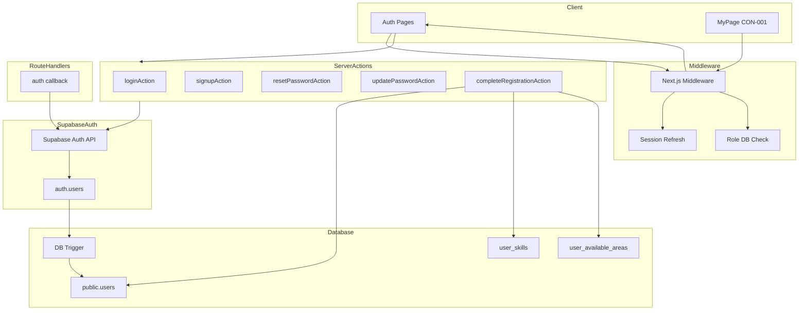
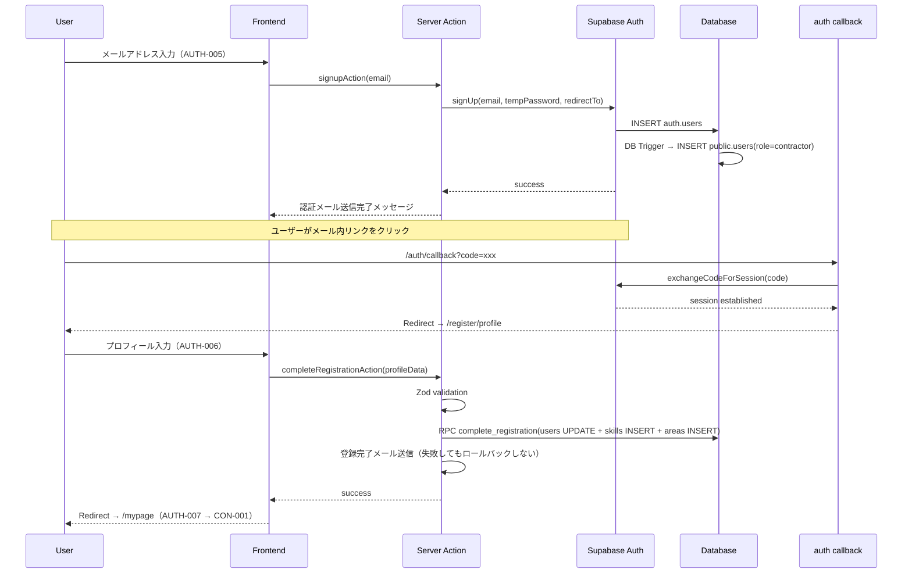
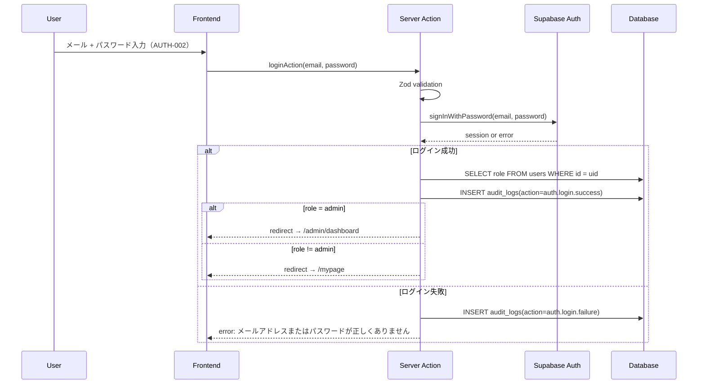
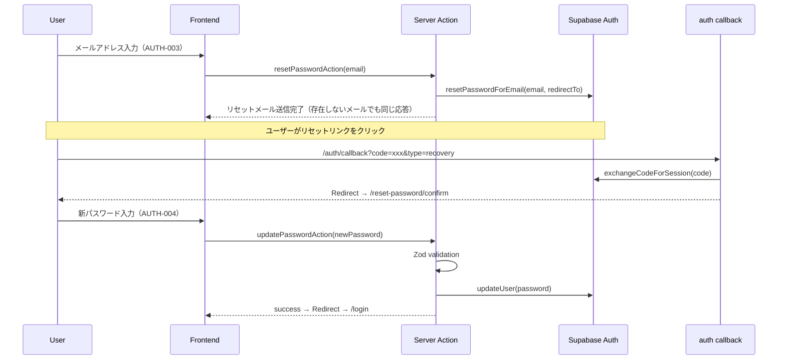
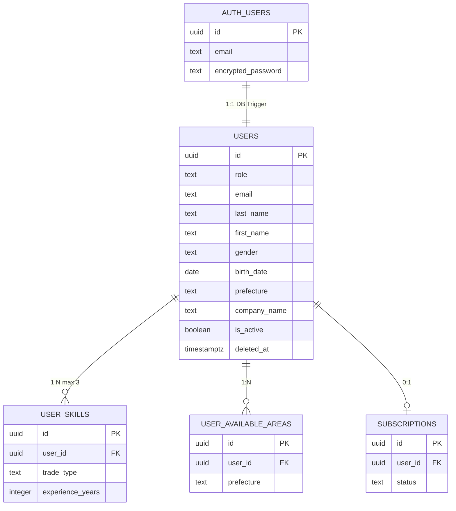

# 認証機能（auth）— 技術設計書

## Overview

**Purpose**: ビジ友の認証基盤を構築し、ユーザーの新規登録・ログイン・パスワード管理・マイページを提供する。Supabase Auth をベースに、メール/パスワード認証とセッション管理を実現する。

**Users**: 未認証ユーザー（新規登録・ログイン）、認証済みユーザー（パスワード変更・マイページ利用）が対象。建設業の職人（受注者）が主要ユーザー。

**Impact**: アプリケーション全体の認証基盤を新規構築する。Middleware によるルーティング制御、セッション管理、ロールベースのアクセス制御の土台となる。

### Goals
- Supabase Auth によるメール/パスワード認証の実装
- メール認証 → プロフィール入力 → マイページ遷移の段階的登録フロー
- Middleware による三重防御の第1層（ルーティング制御）の構築
- マイページでのロール別メニュー出し分け

### Non-Goals
- ソーシャルログイン（Google 等）— 将来検討
- 管理者認証フロー（ADM-001）— admin spec で実装
- Stripe 連携によるロール変更 — billing spec で実装
- メッセージ・通知のリアルタイム機能 — messaging spec で実装

## Architecture

### Architecture Pattern & Boundary Map



**Architecture Integration**:
- Selected pattern: Server Actions + RSC。Next.js App Router 標準に準拠し、tech.md の方針に従う
- Domain boundaries: 認証処理（Supabase Auth）とプロフィール管理（public テーブル）を分離。Server Actions が両者を橋渡し
- Existing patterns preserved: `@supabase/ssr` による Cookie ベースセッション、DB Trigger による `public.users` 自動生成
- New components rationale: Middleware（ルーティング制御）、auth callback Route Handler（PKCE コード交換）、`complete_registration` PostgreSQL 関数（トランザクション処理）
- Steering compliance: 三重防御（authentication.md）、Server Actions レスポンス形式（security.md）、Zod バリデーション（tech.md）

### Technology Stack

| Layer | Choice / Version | Role in Feature | Notes |
|-------|------------------|-----------------|-------|
| Frontend | Next.js App Router + React | 認証画面の Server/Client Components | shadcn/ui でフォーム UI |
| Form | React Hook Form + Zod | フォームバリデーション（クライアント + サーバー） | tech.md 準拠 |
| Auth | Supabase Auth + `@supabase/ssr` | 認証・セッション管理 | Cookie ベース JWT |
| Database | PostgreSQL（Supabase） | ユーザーデータ永続化 | RLS 有効 |
| Middleware | Next.js Middleware | ルーティング制御 + セッションリフレッシュ | 毎リクエスト DB ロール検証 |

## System Flows

### 新規登録フロー



### ログインフロー



### パスワードリセットフロー



## Requirements Traceability

| Requirement | Summary | Components | Interfaces | Flows |
|-------------|---------|------------|------------|-------|
| 1.1 (REQ-AUTH-001) | ランディングページ | LandingPage | — | — |
| 2.1 (REQ-AUTH-002) | ログイン | LoginPage, loginAction | LoginFormSchema, ActionResult | ログインフロー |
| 3.1 (REQ-AUTH-003) | パスワードリセット申請 | ResetPasswordPage, resetPasswordAction | ResetPasswordSchema, ActionResult | パスワードリセットフロー |
| 4.1 (REQ-AUTH-004) | パスワード再設定 | ResetPasswordConfirmPage, updatePasswordAction | UpdatePasswordSchema, ActionResult | パスワードリセットフロー |
| 5.1 (REQ-AUTH-005) | メール認証 | RegisterEmailPage, signupAction | SignupEmailSchema, ActionResult | 新規登録フロー |
| 6.1 (REQ-AUTH-006) | プロフィール入力 | RegisterProfilePage, completeRegistrationAction, complete_registration RPC | RegisterProfileSchema, ActionResult | 新規登録フロー |
| 7.1 (REQ-AUTH-007) | 登録完了 | RegisterCompletePage | — | 新規登録フロー |
| 8.1 (REQ-AUTH-008) | マイページ | MyPage, RoleMenuSection | — | — |

## Components and Interfaces

| Component | Domain/Layer | Intent | Req Coverage | Key Dependencies | Contracts |
|-----------|--------------|--------|--------------|------------------|-----------|
| AuthMiddleware | Infra | セッション検証 + ルーティング制御 | 全体 | Supabase Auth (P0) | Service |
| AuthCallbackHandler | Infra | PKCE コード交換 + リダイレクト | 5.1, 4.1 | Supabase Auth (P0) | API |
| LoginPage | UI/Auth | ログインフォーム | 2.1 | loginAction (P0), shadcn/ui (P1) | — |
| LoginAction | Action/Auth | ログイン処理 | 2.1 | Supabase Auth (P0) | Service |
| RegisterEmailPage | UI/Auth | メール認証フォーム | 5.1 | signupAction (P0) | — |
| SignupAction | Action/Auth | メール認証送信 | 5.1 | Supabase Auth (P0) | Service |
| RegisterProfilePage | UI/Auth | プロフィール入力フォーム | 6.1 | completeRegistrationAction (P0) | — |
| CompleteRegistrationAction | Action/Auth | プロフィール登録処理 | 6.1 | Supabase DB (P0), Resend (P2) | Service |
| ResetPasswordPage | UI/Auth | パスワードリセット申請 | 3.1 | resetPasswordAction (P0) | — |
| ResetPasswordConfirmPage | UI/Auth | パスワード再設定フォーム | 4.1 | updatePasswordAction (P0) | — |
| ResetPasswordAction | Action/Auth | リセットメール送信 | 3.1 | Supabase Auth (P0) | Service |
| UpdatePasswordAction | Action/Auth | パスワード更新 | 4.1 | Supabase Auth (P0) | Service |
| LandingPage | UI/Auth | ランディングページ | 1.1 | — | — |
| RegisterCompletePage | UI/Auth | 登録完了表示 | 7.1 | — | — |
| MyPage | UI/Authenticated | マイページダッシュボード | 8.1 | Supabase DB (P0) | — |

### Infrastructure Layer

#### AuthMiddleware

| Field | Detail |
|-------|--------|
| Intent | セッションリフレッシュ + DB ロール検証 + ルーティング制御 |
| Requirements | 全体（1.1, 2.1, 8.1） |

**Responsibilities & Constraints**
- 全リクエストでセッショントークンをリフレッシュし、Cookie を更新する
- 認証済みユーザーの `role`, `deleted_at`, `is_active` を `public.users` テーブルから毎回取得する（JWT 内の role を信用しない）
- `is_active = false` の場合はセッション破棄 → ログイン画面にリダイレクト
- ルーティング制御（authentication.md L42-46 準拠）:
  - 未認証 → `/auth/*` 以外をブロック（ログイン画面へリダイレクト）
  - 認証済み → `/auth/*`（認証画面）をマイページへリダイレクト
  - 受注者（contractor） → `/admin/*` と発注者専用画面（`/cli/*` 系、ただし `/billing/*`（CLI-026〜027）は例外で許可）をブロック
  - 発注者（client） → `/admin/*` をブロック
  - 担当者（staff） → `/admin/*` をブロック（発注者機能は組織経由で許可）
  - 管理者（admin） → `/admin/*` のみアクセス可。一般ユーザー画面にはアクセス不可

**Dependencies**
- External: `@supabase/ssr` createServerClient — Cookie ベースセッション管理 (P0)
- Outbound: public.users テーブル — ロール・アクティブ状態取得 (P0)

**Contracts**: Service [x]

##### Service Interface
```typescript
// middleware.ts — Next.js Middleware
// 認証・認可のルーティング制御

interface UserStatus {
  role: 'contractor' | 'client' | 'staff' | 'admin';
  deletedAt: string | null;
  isActive: boolean;
}

// Middleware 内部で使用するルーティングルール
interface RouteRule {
  pattern: RegExp;
  allowedRoles: Array<'unauthenticated' | 'contractor' | 'client' | 'staff' | 'admin'>;
  redirectTo: string;
}

// ルーティングルール定義（authentication.md L42-46 準拠）
// prettier-ignore
const ROUTE_RULES: RouteRule[] = [
  // 公開ルート: 認証不要
  { pattern: /^\/auth\//, allowedRoles: ['unauthenticated', 'contractor', 'client', 'staff', 'admin'], redirectTo: '/mypage' },
  // 管理者専用
  { pattern: /^\/admin\//, allowedRoles: ['admin'], redirectTo: '/mypage' },
  // 課金導線: 受注者にも開放（CLI-026〜027 例外）
  { pattern: /^\/billing\//, allowedRoles: ['contractor', 'client', 'staff'], redirectTo: '/login' },
  // 発注者専用画面（CLI系）: 受注者はブロック
  { pattern: /^\/(jobs\/create|jobs\/edit|clients|applications\/manage|orders|broadcast|scouts|organization)\//, allowedRoles: ['client', 'staff'], redirectTo: '/mypage' },
  // 一般認証済みルート
  { pattern: /^\//, allowedRoles: ['contractor', 'client', 'staff'], redirectTo: '/login' },
];
```
- Preconditions: リクエストに Cookie が含まれること
- Postconditions: セッションが有効な場合は Cookie がリフレッシュされる。ルール違反の場合はリダイレクトレスポンスを返す
- Invariants: JWT 内の role は使用しない。常に DB から最新の role を取得する

**Implementation Notes**
- 公開ルート（`/auth/*`, `/api/webhooks/*`, 静的アセット）はセッション検証をスキップ
- `is_active` チェックのエラーメッセージ: 「アカウントが一時停止されています。詳しくは管理者にお問い合わせください」
- パフォーマンス: PK 検索のため1ms以下（authentication.md で確認済み）

#### AuthCallbackHandler

| Field | Detail |
|-------|--------|
| Intent | メール確認・パスワードリセットの PKCE コード交換 + リダイレクト |
| Requirements | 5.1, 4.1 |

**Responsibilities & Constraints**
- `/auth/callback` Route Handler として実装
- クエリパラメータの `code` を使用して Supabase Auth とトークン交換
- フロー種別に応じてリダイレクト先を分岐: signup → `/register/profile`, recovery → `/reset-password/confirm`

**Dependencies**
- External: `@supabase/ssr` — トークン交換 (P0)

**Contracts**: API [x]

##### API Contract
| Method | Endpoint | Request | Response | Errors |
|--------|----------|---------|----------|--------|
| GET | /auth/callback | `?code=xxx&type=signup\|recovery` | 302 Redirect | 無効コード → /login にリダイレクト |

**Implementation Notes**
- `code` が無い or トークン交換失敗 → `/login` へリダイレクト（エラーメッセージ付き）
- Route Handler ファイル: `src/app/auth/callback/route.ts`

### Server Actions Layer

#### LoginAction

| Field | Detail |
|-------|--------|
| Intent | メール/パスワードによるログイン処理 |
| Requirements | 2.1 |

**Responsibilities & Constraints**
- Zod でバリデーション後、Supabase Auth の `signInWithPassword` を呼び出す
- ログイン成功後、`public.users` から role を取得し、role に応じた遷移先を決定する
- エラーメッセージは一律「メールアドレスまたはパスワードが正しくありません」（アカウント存在推測防止）
- ログイン成功/失敗を `audit_logs` テーブルに記録する（security.md L194「認証系: ログイン成功/失敗」準拠）。成功時は `action: 'auth.login.success'`、失敗時は `action: 'auth.login.failure'`。metadata にはメールアドレス（マスク済み）とタイムスタンプを含め、パスワードやトークンは絶対に含めない

**Dependencies**
- External: Supabase Auth `signInWithPassword` (P0)
- Outbound: public.users — role 取得 (P0)
- Outbound: audit_logs — ログイン結果の記録 (P1)

**Contracts**: Service [x]

##### Service Interface
```typescript
// src/app/(auth)/login/actions.ts

interface LoginInput {
  email: string;
  password: string;
}

type ActionResult<T = undefined> = {
  success: true;
  data?: T;
} | {
  success: false;
  error: string;
};

function loginAction(input: LoginInput): Promise<ActionResult<{ redirectTo: string }>>;
```
- Preconditions: email が有効な形式、password が空でないこと
- Postconditions: 成功時にセッション Cookie が設定される。成功/失敗いずれも audit_logs にレコードが作成される
- Invariants: エラー時にアカウント存在の有無を漏洩しない。audit_logs への書き込み失敗でログイン処理自体をロールバックしない

#### SignupAction

| Field | Detail |
|-------|--------|
| Intent | メールアドレスの認証メール送信 |
| Requirements | 5.1 |

**Responsibilities & Constraints**
- Zod でメールアドレスをバリデーション
- Supabase Auth の `signUp` を呼び出し（`emailRedirectTo` を `/auth/callback` に設定）
- 既に登録済みのメールアドレスでも同じ成功メッセージを表示（セキュリティ）

**Dependencies**
- External: Supabase Auth `signUp` (P0)

**Contracts**: Service [x]

##### Service Interface
```typescript
// src/app/(auth)/register/actions.ts

interface SignupEmailInput {
  email: string;
}

function signupAction(input: SignupEmailInput): Promise<ActionResult>;
```
- Preconditions: email が有効なメール形式
- Postconditions: 認証メールが送信される（既存ユーザーの場合も同じレスポンス）
- Invariants: アカウント存在の有無を漏洩しない

#### CompleteRegistrationAction

| Field | Detail |
|-------|--------|
| Intent | プロフィール情報の登録（users UPDATE + user_skills INSERT + user_available_areas INSERT） |
| Requirements | 6.1 |

**Responsibilities & Constraints**
- 認証チェック: セッションからユーザー ID を取得。未認証の場合はエラー
- Zod でバリデーション（全入力フィールド）
- role パラメータはクライアントから受け付けない。常に `'contractor'` 固定（三重防御の Server Action 層）
- PostgreSQL 関数 `complete_registration` を RPC で呼び出し、トランザクション内で3テーブルを更新
- トランザクション成功後、登録完了メールを送信（送信失敗時もロールバックしない）

**Dependencies**
- External: Supabase DB RPC `complete_registration` (P0)
- External: Resend — 登録完了メール送信 (P2)
- Inbound: AuthMiddleware — セッション検証 (P0)

**Contracts**: Service [x]

##### Service Interface
```typescript
// src/app/(auth)/register/profile/actions.ts

interface SkillInput {
  tradeType: string;
  experienceYears: number;
}

interface RegisterProfileInput {
  lastName: string;
  firstName: string;
  gender: string;
  birthDate: string;  // ISO date format
  prefecture: string;
  companyName?: string;
  skills: SkillInput[];       // 1-3 items
  availableAreas: string[];   // prefecture codes, 1+ items
  password: string;           // 8+ characters
}

function completeRegistrationAction(
  input: RegisterProfileInput
): Promise<ActionResult>;
```
- Preconditions: ユーザーがメール認証済みでセッションが確立されていること。skills は1〜3件、availableAreas は1件以上
- Postconditions: public.users が更新され、user_skills と user_available_areas にレコードが作成される。パスワードが設定される
- Invariants: role は常に `'contractor'`。トランザクションの原子性を保証

**Implementation Notes**
- **一時パスワード方式の設計判断**: Supabase Auth の `signUp` は email + password の両方を必須とするが、ビジ友の登録フローでは AUTH-005（メールアドレス入力）と AUTH-006（プロフィール入力 + パスワード設定）が分離されている。このため `signUp` 時にサーバー側で暗号学的に安全なランダム文字列（`crypto.randomUUID()` 等、最低32文字）を一時パスワードとして生成し、メール確認完了後の AUTH-006 でユーザーが入力した本パスワードに `updateUser({ password })` で上書きする。一時パスワードはクライアントに送信せず、ログにも記録しない。一時パスワード状態のままプロフィール入力を完了しなかったアカウントは、ユーザーが本パスワードを知らないためログイン不可となり、事実上の不活性アカウントとなる（将来的にクリーンアップジョブで対応を検討）
- トランザクション失敗時: ユーザーに再試行を促す。auth.users は削除しない
- 選択肢（職種、都道府県、性別）は TypeScript 定数から取得（OptionSets 方針に準拠）

#### ResetPasswordAction

| Field | Detail |
|-------|--------|
| Intent | パスワードリセットメールの送信 |
| Requirements | 3.1 |

**Contracts**: Service [x]

##### Service Interface
```typescript
// src/app/(auth)/reset-password/actions.ts

interface ResetPasswordInput {
  email: string;
}

function resetPasswordAction(input: ResetPasswordInput): Promise<ActionResult>;
```
- Preconditions: email が有効なメール形式
- Postconditions: リセットメールが送信される（存在しないメールでも同じレスポンス）

#### UpdatePasswordAction

| Field | Detail |
|-------|--------|
| Intent | 新しいパスワードの設定 |
| Requirements | 4.1 |

**Contracts**: Service [x]

##### Service Interface
```typescript
// src/app/(auth)/reset-password/confirm/actions.ts

interface UpdatePasswordInput {
  password: string;
  confirmPassword: string;
}

function updatePasswordAction(input: UpdatePasswordInput): Promise<ActionResult>;
```
- Preconditions: ユーザーがリセットリンク経由で認証されていること。password が8文字以上。password と confirmPassword が一致
- Postconditions: パスワードが更新される。成功後 `/login` へ遷移

### UI Layer（Summary-only）

UI コンポーネントは新しい boundary を導入しないため、概要のみ記載する。

| Component | File Path | Notes |
|-----------|-----------|-------|
| LandingPage | `src/app/page.tsx` | 認証済みユーザーは `/mypage` へリダイレクト（Middleware）。サービス概要 + ログイン/新規登録ボタン。フッター: よくある質問（COM-007）、お問い合わせ（COM-008）、利用規約（COM-009）、プライバシーポリシー（COM-010）、特定商取引法（COM-011） |
| LoginPage | `src/app/(auth)/login/page.tsx` | Client Component（useState, フォーム操作） |
| RegisterEmailPage | `src/app/(auth)/register/page.tsx` | Client Component |
| RegisterProfilePage | `src/app/(auth)/register/profile/page.tsx` | Client Component。職種選択（最大3つ）、エリア複数選択 |
| RegisterCompletePage | `src/app/(auth)/register/complete/page.tsx` | Server Component。自動で `/mypage` へリダイレクト |
| ResetPasswordPage | `src/app/(auth)/reset-password/page.tsx` | Client Component |
| ResetPasswordConfirmPage | `src/app/(auth)/reset-password/confirm/page.tsx` | Client Component |
| MyPage | `src/app/(authenticated)/mypage/page.tsx` | Server Component。以下のメニュー表示分岐ロジックを実装（REQ-AUTH-008 準拠） |

**MyPage メニュー表示分岐**:

判定条件: `users.role` と `subscriptions.status` を Server Component で取得し、表示メニューを決定する。

**受注者メニュー（常に表示）**:
| メニュー項目 | 遷移先 | 表示条件 |
|-------------|--------|---------|
| 募集案件一覧 | CON-002 | 常時 |
| 発注者一覧 | CON-005 | 常時 |
| マイリスト | CON-007 | 常時 |
| メッセージ/スカウト一覧 | CON-008 | 常時 |
| 応募履歴一覧 | CON-011 | 常時 |
| 空き日程一覧 | CON-014 | 常時 |
| 本人確認・CCUS登録 | COM-003 | 常時 |
| プロフィール | COM-001 | 常時 |
| 有料プラン案内 | CLI-026 | 常時 |
| よくある質問 | COM-007 | 常時 |
| お問い合わせ | COM-008 | 常時 |

**発注者メニュー（課金後に追加表示）**:
表示条件: `users.role IN ('client', 'staff') AND subscriptions.status IN ('active', 'past_due')`

| メニュー項目 | 遷移先 | 表示条件 |
|-------------|--------|---------|
| 募集現場一覧 | CLI-001 | 発注者全般 |
| ユーザー一覧/職人一覧 | CLI-005 | 発注者全般 |
| 応募一覧 | CLI-007 | 発注者全般 |
| 発注履歴一覧 | CLI-010 | 発注者全般 |
| メッセージ一斉送信 | CLI-014 | 発注者全般 |
| スカウトテンプレート | CLI-016 | 発注者全般 |
| 発注者情報 | CLI-020 | 発注者全般 |
| 担当者一覧 | CLI-022 | 法人プランのみ（`subscriptions.plan_type IN ('corporate', 'corporate_high')` で判定） |

## Data Models

### Domain Model

認証機能が関与するエンティティと境界:



- **Aggregate Root**: `public.users`（プロフィール情報の一貫性を管理）
- **Invariants**:
  - user_skills は1ユーザーにつき最大3件
  - user_available_areas は1件以上（登録時必須）
  - role は新規登録時に常に `'contractor'`

### Physical Data Model

既存のマイグレーション（001〜005）で定義済みのテーブルを使用。追加が必要なのは `complete_registration` PostgreSQL 関数のみ。

```sql
-- 新規マイグレーション: complete_registration 関数
CREATE OR REPLACE FUNCTION complete_registration(
  p_user_id uuid,
  p_last_name text,
  p_first_name text,
  p_gender text,
  p_birth_date date,
  p_prefecture text,
  p_company_name text DEFAULT NULL,
  p_skills jsonb DEFAULT '[]'::jsonb,
  p_areas text[] DEFAULT '{}'::text[]
) RETURNS void AS $$
BEGIN
  -- Update users
  UPDATE public.users SET
    last_name = p_last_name,
    first_name = p_first_name,
    gender = p_gender,
    birth_date = p_birth_date,
    prefecture = p_prefecture,
    company_name = p_company_name,
    updated_at = NOW()
  WHERE id = p_user_id;

  -- Insert skills (max 3)
  INSERT INTO public.user_skills (id, user_id, trade_type, experience_years)
  SELECT
    gen_random_uuid(),
    p_user_id,
    (skill->>'trade_type')::text,
    (skill->>'experience_years')::integer
  FROM jsonb_array_elements(p_skills) AS skill
  LIMIT 3;

  -- Insert available areas
  INSERT INTO public.user_available_areas (id, user_id, prefecture)
  SELECT gen_random_uuid(), p_user_id, unnest(p_areas);
END;
$$ LANGUAGE plpgsql SECURITY DEFINER;
```

### Data Contracts

**Zod Validation Schemas**（クライアント + サーバー共用）:

```typescript
// src/lib/validations/auth.ts

import { z } from 'zod';

export const loginSchema = z.object({
  email: z.string().email('有効なメールアドレスを入力してください'),
  password: z.string().min(1, 'パスワードを入力してください'),
});

export const signupEmailSchema = z.object({
  email: z.string().email('有効なメールアドレスを入力してください'),
});

export const resetPasswordSchema = z.object({
  email: z.string().email('有効なメールアドレスを入力してください'),
});

export const updatePasswordSchema = z.object({
  password: z.string().min(8, 'パスワードは8文字以上で入力してください'),
  confirmPassword: z.string(),
}).refine(
  (data) => data.password === data.confirmPassword,
  { message: 'パスワードが一致しません', path: ['confirmPassword'] }
);

export const registerProfileSchema = z.object({
  lastName: z.string().min(1, '姓を入力してください'),
  firstName: z.string().min(1, '名を入力してください'),
  gender: z.string().min(1, '性別を選択してください'),
  birthDate: z.string().min(1, '生年月日を入力してください'),
  prefecture: z.string().min(1, '都道府県を選択してください'),
  companyName: z.string().optional(),
  skills: z.array(z.object({
    tradeType: z.string().min(1),
    experienceYears: z.number().int().min(0),
  })).min(1, '職種を1つ以上選択してください').max(3, '職種は最大3つまでです'),
  availableAreas: z.array(z.string()).min(1, '対応可能エリアを1つ以上選択してください'),
  password: z.string().min(8, 'パスワードは8文字以上で入力してください'),
});
```

## Error Handling

### Error Strategy

全 Server Actions は統一レスポンス型 `ActionResult<T>` を使用する（security.md 準拠）。

### Error Categories and Responses

**User Errors**:
- 無効なフォーム入力 → Zod バリデーションエラー（フィールドごとの日本語メッセージ）
- ログイン失敗 → 「メールアドレスまたはパスワードが正しくありません」（一律メッセージ）
- 未認証アクセス → ログイン画面へリダイレクト
- `is_active = false` → 「アカウントが一時停止されています。詳しくは管理者にお問い合わせください」

**System Errors**:
- Supabase Auth API エラー → ログ記録 + 「エラーが発生しました。しばらくしてから再度お試しください」
- トランザクション失敗（complete_registration） → ログ記録 + ユーザーに再試行を促す
- メール送信失敗 → ログ記録のみ。本体処理はロールバックしない（security.md の共通方針）

**Business Logic Errors**:
- リセットトークン期限切れ → 「リンクの有効期限が切れています。もう一度パスワードリセットを申請してください」+ AUTH-003 への導線
- メール認証未完了でプロフィール画面にアクセス → `/register` へリダイレクト

## Testing Strategy

### Unit Tests（高リスク: 認証 + 権限）
- Zod バリデーションスキーマ（loginSchema, registerProfileSchema 等）のテスト
- Middleware ルーティングルールのテスト（ロール別アクセス制御）
- Server Actions のバリデーション + エラーハンドリング

### Integration Tests（高リスク: 認証フロー）
- RLS ポリシーテスト: users テーブルの INSERT で `role = 'contractor'` のみ許可されること
- RLS ポリシーテスト: ユーザーが自分の users レコードのみ更新できること
- `complete_registration` RPC のトランザクションテスト（成功 / 部分失敗時のロールバック）

### E2E Tests
- 新規登録 → メール認証 → プロフィール入力 → マイページ遷移のフルフロー
- ログイン → マイページ表示

## Security Considerations

本機能は認証基盤のため、セキュリティが最重要。

- **role エスカレーション防止（三重防御）**:
  1. Server Action: role パラメータをクライアントから受け付けない。常に `'contractor'` 固定
  2. RLS: users INSERT ポリシーで `auth.uid() = id` のみ許可（role の値チェックは Server Action で実施）
  3. DB Trigger: `handle_new_user` が `role = 'contractor'` を固定値で設定
- **アカウント列挙攻撃の防止**: ログイン失敗・パスワードリセット・メール登録すべてで一律のメッセージを返す
- **セッション管理**: httpOnly Cookie（Supabase のデフォルト）。Middleware で毎リクエストリフレッシュ
- **パスワードポリシー**: 最低8文字（Supabase Auth + Zod の両方で検証）
- **CSRF**: Server Actions は Next.js 標準の CSRF 保護を継承
- **`complete_registration` 関数の SECURITY DEFINER**:
  - 採用理由: この関数は `public.users`（UPDATE）、`user_skills`（INSERT）、`user_available_areas`（INSERT）の3テーブルに対してトランザクション内で操作を行う。RLS ポリシーは各テーブルに設定されているが、RPC 関数内で複数テーブルを跨ぐ操作を `SECURITY INVOKER`（呼び出し元ユーザーの権限で実行）で行うと、Supabase の RLS 評価が各 INSERT/UPDATE ごとに走り、関数のオーナー権限ではなくユーザーの JWT クレームに基づくため、DB Trigger で自動生成された直後の users レコード（まだ last_name 等が NULL の状態）に対する UPDATE が RLS の条件次第で失敗するリスクがある
  - リスク軽減策: `SECURITY DEFINER` は関数オーナー（通常 `postgres`）の権限で実行されるため、RLS をバイパスする。このため入力値の検証は Server Action 側（Zod バリデーション + 認証チェック）で厳密に行い、関数に渡す前にすべてサニタイズする。関数自体は `p_user_id` が呼び出し元の `auth.uid()` と一致することを Server Action で保証する（関数内では検証しない = 権限チェックの責務は Server Action に集約）
  - 代替案不採用の理由: `SECURITY INVOKER` + 各テーブルの RLS を通す方法も検討したが、3テーブルの RLS ポリシーを登録フロー専用に調整する必要があり、他の操作（プロフィール編集等）への影響範囲が広がるため不採用
