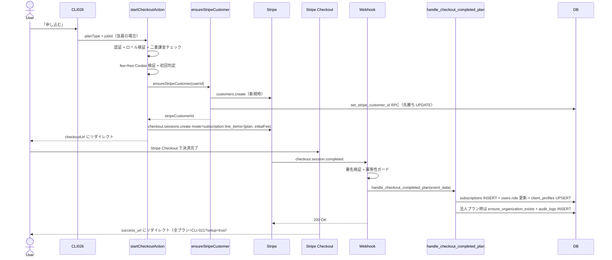
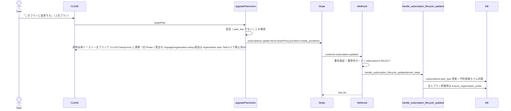
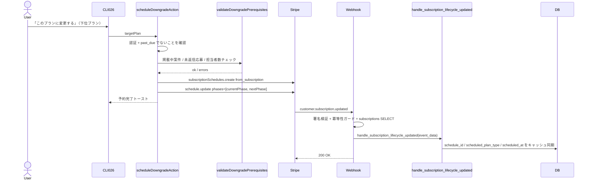
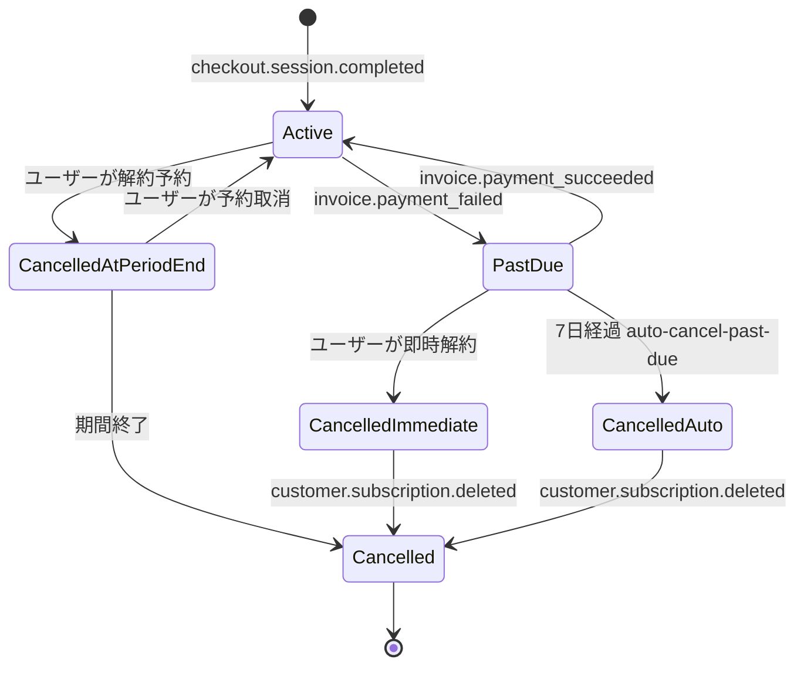
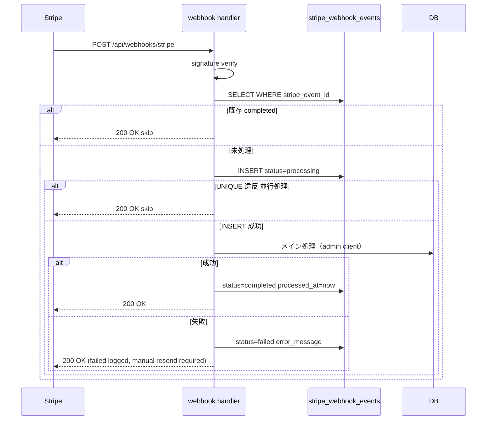
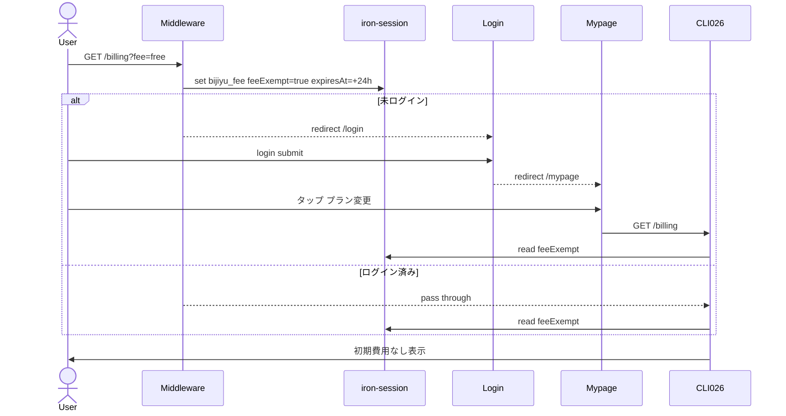
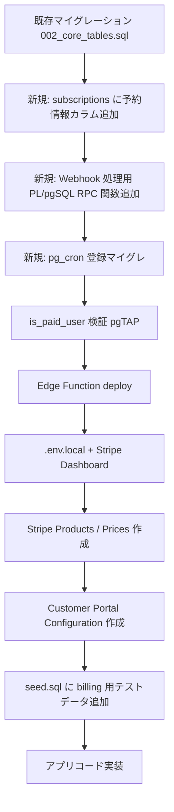

# 課金機能（billing）— 技術設計

## Overview

**Purpose**: ビジ友の有料プラン（個人発注者様向け / 小規模事業主様向け / 法人向け / 法人向け（高サポート））と4種類のオプション（急募 / 動画掲載 / 補償¥5,000 / 補償¥9,800）の決済・状態管理・自動処理を提供する。Stripe Billing と Stripe Checkout を中核に据え、Webhook を唯一の正規ルートとして DB 状態を更新する Webhook 主導モデルを採用する。

**Users**: 受注者（contractor）はプラン案内（CLI-026）を閲覧し有料プランへ申し込める。発注者（client）はプラン変更・解約・オプション購入・支払い方法管理を行う。担当者（staff）は CLI-026 を閲覧できるが書き込み操作はすべてブロックされる。

**Impact**: 既存の `subscriptions` / `option_subscriptions` / `stripe_webhook_events` / `users.stripe_customer_id` テーブル（マイグレーション済み）を使用する。新規実装は CLI-026 / CLI-027 の2画面、Webhook Route Handler、Server Actions、Edge Function（auto-cancel-past-due）、pg_cron ジョブ 3 本（SQL 直接実行 2 本: `expire-options` / `close-expired-jobs`、Edge Function 起動 1 本: `auto-cancel-past-due`）、メールテンプレート3種、PastDueBanner（ルートレイアウト共通）、fee=free Cookie のミドルウェアロジック。

### Goals
- Stripe Billing による安全な決済と署名検証付き Webhook 処理
- 二重課金防止と Webhook 冪等性の担保
- 全プラン変更マトリクス（アップグレード・ダウングレード・解約のすべての組み合わせ）を矛盾なく処理
- プラン購入直後の発注者情報設定導線（全プラン CLI-021?setup=true へ遷移。法人プランは社名必須・スキップ不可、個人・小規模プランは任意でスキップ可）。法人プランは追加で組織（organizations）の自動作成も行う。Phase 1 暫定の `/mypage/organization-setup` 経由は organization spec Task 6 で廃止済み
- past_due の7日猶予と自動解約（pg_cron + Edge Function）
- 担当者（staff）の書き込み操作を三重防御（Middleware + UI + Server Action）でブロック
- fee=free（初回事務手数料免除）ルートを暗号化 Cookie で実装

### Non-Goals
- カード情報のアプリ側保存（Stripe Customer ID のみ DB に保持）
- Stripe Customer Portal からの解約・プラン変更（許可機能は「カード情報更新」「請求履歴閲覧」のみ）
- 動画掲載オプションのユーザー側解約 UI（買い切りのため、停止は ADM-010 経由）
- Phase 1 での fee=free ログイン後自動リダイレクト（ユーザーがマイページから自力で /billing へ遷移する）
- ポーリングによる Webhook 遅延補正（要件で許容済み）
- 代理メッセージ通数の自動カウント（運用管理）
- **one_time オプション（急募・動画掲載）の購入後返金**（基本プラン解約後に benefit が使えなくなっても返金処理は行わない。`option_subscriptions` レコードはそのまま残置し、急募は `expire-options` cron で自然満了させる。Phase 2 で返金フローを再検討）
- **基本プラン解約後の補償オプション継続**（基本プラン解約時に補償オプションも自動連鎖キャンセルする。「無料ユーザー × 補償オプション継続課金」状態は設計上発生しない。Phase 1 では補償解約専用メールテンプレートは作成せず、ユーザー通知は基本プラン解約メールに統合される）

## Architecture

### Existing Architecture Analysis

既存の以下の要素を活用する:
- **マイグレーション済みテーブル**: `subscriptions` / `option_subscriptions` / `stripe_webhook_events` / `users.stripe_customer_id` / `client_profiles` / `organizations` / `organization_members` / `audit_logs`
- **既存 RLS ポリシー**: subscriptions / option_subscriptions の書き込みは service_role のみ（既に制限済み）
- **既存ヘルパー関数**: `is_paid_user(uid)`（subscriptions.status IN ('active', 'past_due') を含むことを実装時に再検証）
- **既存 admin client**: `src/lib/supabase/admin.ts` の `createAdminClient()` を Webhook ハンドラと Edge Function で使用
- **既存ミドルウェア**: `src/middleware.ts` には既に `BILLING_PATH_PREFIX` と contractor の例外処理が実装済み。本機能で fee=free Cookie セットロジックを追加
- **既存メールテンプレート**: `src/lib/email/templates/` の HTML 関数パターン（`{ subject, html }` を返す）を踏襲

### Architecture Pattern & Boundary Map

```mermaid
graph TB
    subgraph Browser
        CLI026[CLI-026 プラン案内]
        CLI027[CLI-027 Stripe Checkout]
        Banner[PastDueBanner]
        OrgSetup[OrganizationNameSetupPage 暫定]
    end

    subgraph NextApp
        Middleware[middleware fee=free Cookie + cleanup]
        Layout[RootLayout PastDueData]
    end

    subgraph ServerActions
        SAStart[startCheckoutAction]
        SAChange[changePlanAction routing]
        SAUpgrade[upgradePlanAction internal]
        SADown[scheduleDowngradeAction internal]
        SAReservCancel[cancelDowngradeReservationAction]
        SACancel[scheduleCancelAction]
        SAImmediate[cancelImmediatelyAction]
        SACancelOpt[cancelCompensationAction]
        SAPortal[openCustomerPortalAction]
        SASaveOrgName[saveOrganizationNameAction temp]
        ESC[ensureStripeCustomer wrapper]
        Cmp[comparePlans helper]
    end

    subgraph WebhookLayer
        Webhook[stripe webhook handler]
        Idemp[withWebhookIdempotency]
        HCC[handleCheckoutCompleted]
        HSL[handleSubscriptionLifecycle]
    end

    subgraph PostgresFunctions
        FnCheckout[handle_checkout_completed_plan]
        FnUpdated[handle_subscription_lifecycle_updated]
        FnDeleted[handle_subscription_lifecycle_deleted]
        FnGetLock[get_or_lock_stripe_customer]
        FnSetCust[set_stripe_customer_id]
        FnEnsureOrg[ensure_organization_exists]
    end

    subgraph Stripe
        Checkout[Stripe Checkout]
        Portal[Customer Portal]
        Subs[Stripe Subscription]
        Schedule[Subscription Schedule]
    end

    subgraph Database
        UsersTable[users]
        SubsTable[subscriptions]
        OptSubsTable[option_subscriptions]
        ProfilesTable[client_profiles]
        Orgs[organizations]
        OrgMembers[organization_members]
        WebhookEvents[stripe_webhook_events]
        Audit[audit_logs]
    end

    subgraph BackgroundJobs
        Cron[pg_cron scheduler]
        ExpireOpt[expire-options SQL]
        CloseJobs[close-expired-jobs SQL]
        AutoCancel[Edge Function auto-cancel-past-due]
    end

    subgraph ExternalServices
        Resend[Resend Email]
    end

    CLI026 --> SAStart
    CLI026 --> SAChange
    CLI026 --> SAReservCancel
    CLI026 --> SACancel
    CLI026 --> SAImmediate
    CLI026 --> SACancelOpt
    CLI026 --> SAPortal
    SAChange --> Cmp
    SAChange --> SAUpgrade
    SAChange --> SADown
    SAStart --> ESC
    SAStart --> Checkout
    SAUpgrade --> Subs
    SADown --> Schedule
    SAReservCancel --> Schedule
    SACancel --> Subs
    SAImmediate --> Subs
    SACancelOpt --> Subs
    SAPortal --> Portal
    ESC --> FnGetLock
    ESC --> FnSetCust
    ESC --> Stripe
    Checkout --> CLI027
    CLI027 --> Webhook
    Webhook --> Idemp
    Idemp --> WebhookEvents
    Webhook --> HCC
    Webhook --> HSL
    HCC --> FnCheckout
    HSL --> FnUpdated
    HSL --> FnDeleted
    HSL --> OptSubsTable
    HSL --> ProfilesTable
    HSL --> Resend
    FnCheckout --> SubsTable
    FnCheckout --> UsersTable
    FnCheckout --> ProfilesTable
    FnCheckout --> FnEnsureOrg
    FnCheckout --> Audit
    FnUpdated --> SubsTable
    FnUpdated --> FnEnsureOrg
    FnDeleted --> SubsTable
    FnDeleted --> UsersTable
    FnDeleted --> Audit
    FnEnsureOrg --> Orgs
    FnEnsureOrg --> OrgMembers
    FnGetLock --> UsersTable
    FnSetCust --> UsersTable
    Layout --> Banner
    Layout --> SubsTable
    Banner --> SAPortal
    Middleware --> SubsTable
    Middleware --> CLI026
    CLI027 --> OrgSetup
    OrgSetup --> SASaveOrgName
    SASaveOrgName --> Orgs
    SASaveOrgName --> Audit
    Cron --> ExpireOpt
    Cron --> CloseJobs
    Cron --> AutoCancel
    ExpireOpt --> OptSubsTable
    ExpireOpt --> ProfilesTable
    CloseJobs --> SubsTable
    AutoCancel --> Stripe
    AutoCancel --> Resend
    AutoCancel --> Audit
```



**Architecture Integration**:
- Selected pattern: Webhook 主導状態遷移 + Server Action（UI 操作の入口）。Stripe をシステムオブレコードとして扱い、DB 更新は Webhook を唯一の正規ルートとする
- Domain boundaries: `/billing` 配下に CLI-026 を配置。`/api/webhooks/stripe` で Webhook を受信。決済関連の Server Action は `src/app/(authenticated)/billing/actions.ts` に集約
- Existing patterns preserved: ActionResult<T>、Zod スキーマ、Server Component による初期表示、admin client / server client の使い分け、メール送信失敗時の非ロールバック方針
- New patterns introduced: Stripe Webhook 署名検証、iron-session（暗号化 Cookie）、pg_cron + Edge Function ハイブリッド、PastDueBanner のルートレイアウト統合
- New pattern: **Webhook 主要処理を PL/pgSQL RPC 関数に委譲**。PostgREST の単一クエリ API では原子性が保証できないため、複数テーブルの整合性が必要な処理（`handle_checkout_completed_plan` 等）は SECURITY DEFINER 関数にまとめ、関数内の暗黙トランザクションでロールバックを担保する
- Steering compliance: 三重防御（Middleware + Server Action + RLS）、`is_paid_user()` の past_due 包含、Stripe シークレットの環境変数管理

### Technology Stack

| Layer | Choice / Version | Role in Feature | Notes |
|-------|------------------|-----------------|-------|
| Frontend | Next.js App Router (RSC + Client Components) | CLI-026 表示、PastDueBanner、確認ダイアログ | Banner は残日数のリアルタイム計算のため Client Component |
| UI | shadcn/ui + Tailwind CSS | プランカード、確認ダイアログ、ダウングレード前提条件エラー表示 | design-rule.md に準拠 |
| Backend | Next.js Server Actions + Route Handler | Checkout Session 作成、解約予約、Webhook 受信 | Webhook は `runtime = 'nodejs'` を明示 |
| Validation | Zod | 急募オプション選択、解約理由（任意）等のフォーム入力 | クライアント + サーバーで実施 |
| Payment | Stripe SDK (Node) | Checkout / Subscriptions / Subscription Schedules / Customer Portal / Webhooks | secret 環境変数で初期化 |
| Session | iron-session | fee=free 暗号化 Cookie（24時間） | SESSION_SECRET 環境変数 |
| Data | Supabase (PostgreSQL) + RLS | subscriptions / option_subscriptions / users / client_profiles / organizations / organization_members / stripe_webhook_events / audit_logs | 既存マイグレーション流用 |
| Background Jobs | Supabase Edge Function (Deno/TS) + pg_cron | auto-cancel-past-due（Edge Function）、expire-options / close-expired-jobs（pg_cron 直接 SQL） | 5分ずつずらして競合回避 |
| Email | Resend + 既存 HTML テンプレート方式 | 支払い失敗 / プラン変更確認 / 解約完了通知 | 3 テンプレート新規作成 |

詳細な検討経緯・代替案比較は [research.md](./research.md) を参照。

## System Flows

### 初回購入フロー（Checkout Session）



**プラン購入完了後のリダイレクト先（全プラン共通、現行仕様）**:
- **現行（organization spec Task 6 完了後）**: 全プラン共通で `/mypage/client-profile/edit?setup=true`（CLI-021 setup モード）に遷移。`buildSuccessUrl` 内のプラン分岐は廃止済み
- **旧 Phase 1 暫定**（organization spec で置き換え済み）: 法人プランは `/mypage/organization-setup`、個人・小規模は `/mypage?checkout=success`。暫定画面と Server Action は organization spec Task 6.1 で削除済み
- **プラン別の必須/任意**:
  - 法人プラン（corporate / corporate_premium）: 社名入力必須、スキップ不可
  - 個人・小規模プラン（`individual` / `small`）: 任意、「スキップして後で設定する」ボタンで CON-001 へ遷移可
- **スキップ時の表示名**: Webhook（`handle_checkout_completed_plan`）が `client_profiles` を INSERT する際に `display_name` のデフォルト値として `users.last_name + first_name`（受注者登録時に入力された姓名）を格納する（`ON CONFLICT (user_id) DO NOTHING` のため既存値があれば維持）。スキップ時は DB 操作を行わずこの値がそのまま表示名として使われるため、受注者側で「名無し」にはならない
- **参考**: 切替作業の詳細手順は `.kiro/specs/organization/requirements.md` 付録 A Step 4 + organization spec Task 6.1-6.3 のコミット履歴を参照
- **Webhook 未着時のガード緩和**: `?setup=true` の CLI-021 アクセスは `users.role` や `subscriptions.plan_type` の確定を待たず認証済みユーザーに許可する。保存 Server Action は Webhook 完了を前提とするため、未完了時は「プラン情報を反映中です。数秒後にもう一度お試しください」エラーを返す
- **二重防御**: `resolveParticipantName()` のフォールバック（`users.last_name + first_name`）が機能するため、万一 `client_profiles` レコードが存在しない edge case でも表示名が空にならない
- **詳細**: 発注者表示名の一本化方針は `.kiro/steering/database-schema.md`「発注者表示名のルール」参照

### アップグレードフロー（即時・日割り）



**プランアップグレード完了後のリダイレクト先（全プラン共通）**:
- 新規購入時と同じ遷移先（全プラン `/mypage/client-profile/edit?setup=true` = CLI-021 setup モード）にリダイレクトし、発注者情報の入力を求める（非法人プランはスキップ可）。旧 Phase 1 暫定の `/mypage/organization-setup` 経路は organization spec Task 6 で廃止済み
- 再アップグレード時（既に発注者情報が設定済み）は、遷移先画面が既存データを表示するため、ユーザーは確認・変更が可能
- 無料→有料のアップグレードはそもそも Checkout フロー（startCheckoutAction）を通る。本セクションは有料→有料のプラン変更（upgradePlanAction）を対象とする

**Webhook race condition 対策（upgradePlanAction の同期的先行更新）**:
- `stripe.subscriptions.update()` の直後に遷移先画面（organization spec 実装後は全プラン CLI-021?setup=true）へクライアント遷移すると、Webhook が到着する前にページガードを通過できず `/mypage` にリダイレクトされる race condition が発生する
- 対策: Server Action 内で Stripe 呼び出し成功後、Webhook を待たずに以下を**同期的**に実行する:
  1. `subscriptions.plan_type` の先行 UPDATE（新プランに更新）
  2. 法人プラン昇格時は `ensure_organization_exists(uid)` RPC の先行実行
- Webhook（`handle_subscription_lifecycle_updated`）で同じ更新が再実行されるが、冪等な操作なので二重実行しても安全
- CLI-021?setup=true 自体のページガードは緩和済み（`?setup=true` 時は `users.role` / `plan_type` の確定を待たず認証済みユーザーに許可）のため、ガード通過のための先行 UPDATE は主にメニュー表示等のため
- クライアント側のリダイレクトは Next.js Router Cache によるリダイレクトキャッシュを避けるため `window.location.href` を使う（`router.push` では古い redirect 結果がキャッシュされている可能性がある）

### ダウングレード予約フロー（次回請求日から反映）



> 注: 初回購入のみ `checkout.session.completed` が発火する。アップグレード・ダウングレードは `customer.subscription.updated` が発火し、Webhook ハンドラの分岐先も異なる。3 フローを混同しないこと。

### past_due フロー（支払い遅延と即時解約）



**Key Decisions**（上記図に補足）:
- past_due 中はアップグレード・ダウングレード不可。解約のみ即時実行（前提条件チェックスキップ）
- past_due → active 復帰時、組織配下の **Admin / Staff 両方**（`organization_members.org_role IN ('admin', 'staff')`）の `users.is_active` を true に戻す（2026-04-19 追加: Admin も Owner の契約に連動するため、Staff だけでなく Admin も復帰対象とする）
- 自動解約（7日経過）は Edge Function `auto-cancel-past-due` が pg_cron 経由で 03:00 JST に実行
- **完全解約時（`customer.subscription.deleted`）**: 法人プランの場合、組織配下の **Admin / Staff 両方**（`org_role IN ('admin', 'staff')`）の `users.is_active` を false に設定（2026-04-19 追加、organization spec REQ-ORG-006-B + J1 決定と整合）。past_due 時と同じロジックを共通化
- **再アップグレード時（`customer.subscription.created`）**: 法人プランの場合、組織配下の **Admin / Staff 両方**の `users.is_active` を true に復帰（past_due → active 復帰と同じロジックを流用）
- **退会済みユーザー（`users.deleted_at IS NOT NULL`）への Webhook 処理スキップ**（2026-04-19 追加、C 案採用に伴うガード）:
  - Owner が COM-006 で退会した直後に Stripe キャンセル API が呼ばれ、Webhook `customer.subscription.deleted` が到達するケースを想定
  - Webhook ハンドラは RPC 呼び出し前に `SELECT deleted_at FROM users WHERE id = user_id` をチェックし、`deleted_at IS NOT NULL` の場合は以下の処理をスキップ:
    - `users.role` の `'contractor'` 降格（既に退会で deleted_at セット済みのため再降格は不要）
    - `users.is_active` の false 設定（既にログイン不可のため不要）
  - ただし `subscriptions.status` の `'cancelled'` 更新と `organization_members` / `organizations` 関連の処理は、退会フロー（`withdrawAction`）で既に実行済みのため**冪等に再実行されるだけで問題ない**（organizations.deleted_at は既にセット済み、所属メンバーは既に削除済み）
  - Webhook の冪等性と並行制御フロー（次項）で詳細を参照

### Webhook 冪等性と並行制御フロー



### fee=free Cookie の維持フロー



## Requirements Traceability

| Requirement | Summary | Components | Interfaces | Flows |
|-------------|---------|------------|------------|-------|
| 1.1 (REQ-BL-001) | プラン案内 CLI-026（一覧 / 比較表 / 状態表示） | BillingPage, PlanCard, OptionSection, DowngradeReservationLabel, StaffRestrictionNotice | — | — |
| 1.2 (REQ-BL-001) | 急募オプション案件選択 + 補償オプション排他制御 | OptionSection（UrgentJobSelect サブコンポーネント）, getUrgentEligibleJobs query | — | — |
| 2.1 (REQ-BL-002) | Stripe Checkout Session 作成 + customer 作成 + 初回手数料制御 | startCheckoutAction, ensureStripeCustomer | StartCheckoutInput / StartCheckoutResult | 通常ルート |
| 2.2 (REQ-BL-002) | success_url / cancel_url 分岐（法人プラン / 個人プラン / オプション）+ 法人プラン購入後の組織名入力暫定画面 | resolveSuccessUrl / resolveCancelUrl helpers, OrganizationNameSetupPage, saveOrganizationNameAction | Service | 通常ルート |
| 3.1 (REQ-BL-003) | Webhook 受信 + 署名検証 + 冪等性 | StripeWebhookHandler, withWebhookIdempotency | API, Event | 冪等性フロー |
| 3.2 (REQ-BL-003) | checkout.session.completed の plan / option 振り分け処理 + 二重課金最終防御 | handleCheckoutCompleted, ensureOrganizationExists | Event | 通常ルート |
| 3.3 (REQ-BL-003) | customer.subscription.updated / deleted / invoice.payment_failed / invoice.payment_succeeded + 予約情報の DB 同期 | handleSubscriptionLifecycle, ensureOrganizationExists | Event | past_due フロー |
| 4.1 (REQ-BL-004) | オプション購入 + 排他制御 + 期限切れ自動処理 | OptionSection, expireOptionsCron | Batch | — |
| 5.1 (REQ-BL-005) | アップグレード（即時・日割り）+ 法人プラン昇格時の組織自動作成・再利用 | upgradePlanAction, ensureOrganizationExists | Service | 通常ルート |
| 5.2 (REQ-BL-005) | ダウングレード予約 + 前提条件チェック + キャンセル | scheduleDowngradeAction, cancelDowngradeReservationAction, validateDowngradePrerequisites | Service | 通常ルート |
| 5.3 (REQ-BL-005) | 解約予約 + past_due 即時解約 | scheduleCancelAction, cancelImmediatelyAction | Service | past_due フロー |
| 6.1 (REQ-BL-006) | past_due 警告バナー（全画面共通） | PastDueBanner, fetchPastDueState | State | — |
| 7.1 (REQ-BL-007) | Customer Portal 連携（カード更新 / 請求履歴のみ） | openCustomerPortalAction | Service | — |
| 8.1 (REQ-BL-008) | auto-cancel-past-due Edge Function | autoCancelPastDueFunction | Batch | past_due フロー |
| 8.2 (REQ-BL-008) | expire-options / close-expired-jobs（pg_cron SQL 直接） | expireOptionsCron, closeExpiredJobsCron | Batch | — |
| 9.1 (REQ-BL-009) | 決済系メール3種テンプレート | paymentFailedEmail, subscriptionChangedEmail, subscriptionCancelledEmail | — | — |

## Components and Interfaces

| Component | Domain/Layer | Intent | Req Coverage | Key Dependencies | Contracts |
|-----------|--------------|--------|--------------|------------------|-----------|
| BillingPage (CLI-026) | UI | プラン一覧 / 状態表示 / 各種ボタン分岐 | 1.1, 1.2 | startCheckoutAction (P0), changePlanAction (P0), scheduleCancelAction (P0), cancelImmediatelyAction (P0), cancelDowngradeReservationAction (P0), openCustomerPortalAction (P0), cancelCompensationAction (P0), comparePlans (P0), Supabase (P0) | — |
| PlanCard | UI | 個別プラン1枚の表示と CTA ボタン | 1.1 | startCheckoutAction (P0), changePlanAction (P0) | — |
| OptionSection | UI | オプション一覧 + 急募案件プルダウン + 補償排他 | 1.2, 4.1 | startCheckoutAction (P0), cancelCompensationAction (P0) | — |
| StaffRestrictionNotice | UI | staff 用の操作不可メッセージ | 1.1 | — | — |
| OrganizationNameSetupPage | UI | 法人プラン購入直後の組織名入力暫定画面（**Phase 1 暫定。CLI-021 実装後は CLI-021 へのリダイレクトに差し替え**） | 2.2 | saveOrganizationNameAction (P0), Supabase (P0) | — |
| saveOrganizationNameAction | Action | 暫定 Server Action（**Phase 1 暫定。CLI-021 実装後に削除予定**。最終的には `client_profiles.display_name` に保存する CLI-021 の Server Action に置き換え） | 2.2 | Supabase (P0) | Service |
| PastDueBanner | UI | past_due 中の全画面共通バナー | 6.1 | openCustomerPortalAction (P0) | State |
| CheckoutSuccessToast | UI | success_url 戻り後のトースト | 2.2 | — | — |
| startCheckoutAction | Action | Checkout Session 作成 + 二重課金防止 | 2.1, 2.2, 4.1 | Stripe SDK (P0), Supabase admin (P0), iron-session (P1), ensureStripeCustomer (P0) | Service |
| ensureStripeCustomer | Service | Stripe Customer ID を冪等に確保する（並行リクエスト耐性） | 2.1 | Stripe SDK (P0), Supabase admin (P0) | Service |
| upgradePlanAction | Action | アップグレード（subscription.update）。changePlanAction から呼ばれる内部ヘルパー | 5.1 | Stripe SDK (P0) | Service |
| changePlanAction | Action | 「このプランに変更する」ボタンの統一エントリ。comparePlans で upgrade / downgrade / same を判定し、upgradePlanAction または scheduleDowngradeAction に振り分ける | 5.1, 5.2 | comparePlans (P0), upgradePlanAction (P0), scheduleDowngradeAction (P0), Supabase (P0) | Service |
| scheduleDowngradeAction | Action | ダウングレード予約 + 前提条件チェック。changePlanAction から呼ばれる内部ヘルパー | 5.2 | Stripe SDK (P0), Supabase (P0), validateDowngradePrerequisites (P0) | Service |
| comparePlans | Service | プラン序列の比較（PLAN_LIMITS.rank ベース）。BillingPage と changePlanAction で共通利用 | 5.1, 5.2 | PLAN_LIMITS (P0) | Service |
| cancelDowngradeReservationAction | Action | ダウングレード予約のキャンセル | 5.2 | Stripe SDK (P0) | Service |
| scheduleCancelAction | Action | 解約予約（cancel_at_period_end）+ 前提条件チェック | 5.3 | Stripe SDK (P0), validateDowngradePrerequisites (P0) | Service |
| cancelImmediatelyAction | Action | past_due 中の即時解約 | 5.3 | Stripe SDK (P0) | Service |
| cancelCompensationAction | Action | 補償オプション解約 | 4.1 | Stripe SDK (P0) | Service |
| openCustomerPortalAction | Action | Customer Portal セッション生成 + リダイレクト | 7.1 | Stripe SDK (P0) | Service |
| StripeWebhookHandler | API | /api/webhooks/stripe Route Handler | 3.1, 3.2, 3.3 | Stripe SDK (P0), Supabase admin (P0), Resend (P1) | API, Event |
| withWebhookIdempotency | Util | stripe_webhook_events を使った冪等性ガード | 3.1 | Supabase admin (P0) | — |
| handleCheckoutCompleted | Handler | metadata.type による plan/option 振り分け + 二重課金最終防御 | 3.2 | ensureOrganizationExists (P0), Supabase admin (P0) | Event |
| handleSubscriptionLifecycle | Handler | updated / deleted / payment_failed / payment_succeeded + 予約情報の DB 同期 | 3.3 | ensureOrganizationExists (P0), Resend (P1) | Event |
| ensureOrganizationExists | Service | 法人プラン購入・アップグレード時の organizations の冪等な確保（既存組織の再利用） | 3.2, 5.1 | Supabase admin (P0) | Service |
| validateDowngradePrerequisites | Service | 3項目チェック共通バリデーション | 5.2, 5.3 | PLAN_LIMITS (P0) | Service |
| autoCancelPastDueFunction | Edge Function | past_due 7日経過の自動解約 | 8.1 | Stripe SDK (P0), Supabase admin (P0), Resend (P1) | Batch |
| expireOptionsCron | pg_cron Job | 急募・買い切り動画掲載の期限切れ更新 | 4.1, 8.2 | — | Batch |
| closeExpiredJobsCron | pg_cron Job | 案件募集期限切れの自動クローズ | 8.2 | — | Batch |
| paymentFailedEmail | Template | 支払い失敗通知メール | 9.1 | — | — |
| subscriptionChangedEmail | Template | プラン変更確認メール | 9.1 | — | — |
| subscriptionCancelledEmail | Template | 解約完了通知メール | 9.1 | — | — |
| feeFreeMiddleware | Middleware | /billing?fee=free 検出 + iron-session Cookie セット | 1.1 | iron-session (P0) | — |

### UI Layer

#### BillingPage (CLI-026)

| Field | Detail |
|-------|--------|
| Intent | プラン一覧、現在プランハイライト、オプション、past_due 警告、ダウングレード予約ラベル、staff 制限を統合表示する |
| Requirements | 1.1, 1.2 |

**Responsibilities & Constraints**
- Server Component。`createServerClient` でユーザー情報・サブスクリプション・オプション・組織情報を取得
- 取得データ: `users.role`, `subscriptions`（active/past_due/cancelled、新規 4 カラム `schedule_id` / `scheduled_plan_type` / `scheduled_at` / `cancel_at_period_end` を含む）、`option_subscriptions`、`organization_members`
- **Stripe API は CLI-026 表示時に呼ばない**（パフォーマンス・障害耐性のため）。予約情報は subscriptions テーブルのキャッシュカラムから取得する。最新化は Webhook 経由で `handleSubscriptionLifecycle` が行う
- 初回判定: `subscriptions` に該当ユーザーのレコード（status=active/past_due/cancelled）が0件なら初回 → 初期費用あり。`fee=free` Cookie がある場合は除外
- **fee=free Cookie のクリーンアップは Middleware が担当する**（Server Component では Cookie 削除ができないため）。BillingPage は Cookie の有無を参照するのみで、削除は行わない
- searchParams 監視:
  - `checkout=success`（個人/小規模プラン購入後）→ トースト表示
  - `option_success=urgent|compensation|video` → トースト表示
  - 該当 searchParams は表示後 `router.replace()` でクリア
- **予約キャンセル後のトースト出し分け**: `cancelDowngradeReservationAction` の戻り値 `cancelledType` を判定:
  - `'downgrade'` → 「ダウングレード予約を取り消しました（{`previousTargetPlan` のプラン名}）」
  - `'cancel'` → 「解約予定を取り消しました」
  - 戻り値なし（冪等成功）→ 「すでに予約はキャンセル済みです」
- ボタン状態の決定ロジック（要件 REQ-BL-001 準拠）:
  - **未課金**（subscriptions レコード 0 件、または cancelled のみ）: 各プランに「申し込む」→ `startCheckoutAction(planType)` を呼ぶ。**cancelled のみのユーザーも未課金と同等に扱う**（ボタン文言・遷移先は同じ。ただし初回判定では cancelled レコードがあるため初期費用なし）
  - **課金済み（active / past_due）× 同プラン**: 「ご利用中」バッジ非活性
  - **課金済み × 他プラン**: 「このプランに変更する」→ `changePlanAction(targetPlan)` を呼ぶ（内部で comparePlans → upgrade or downgrade に分岐）
  - **past_due**: アップグレード/ダウングレード非活性、解約のみ有効、現在プランに「ご利用中」+「お支払い確認中」バッジ
  - **予約あり（schedule_id 非 null または cancel_at_period_end=true）**: **「このプランに変更する」ボタンを他プラン全て非活性化**し、ツールチップ「予約をキャンセルしてから操作してください」を表示する。現在プランカードのみ「変更をキャンセルする」/「解約をキャンセルする」を表示
  - **staff**: 全ボタン非活性 + StaffRestrictionNotice 表示
- **Server Action 振り分けの責務**: BillingPage（および PlanCard）は currentPlan / targetPlan / 状態フラグから「どの Server Action を呼ぶか」を決定する。プラン変更の routing は `changePlanAction` 1 つに集約し、同 Server Action 内で `comparePlans` で upgrade / downgrade / same を判定する
- 担当者制限: `users.role === 'staff'` のとき UI ボタンを全て disable し、操作系 Server Action もエラーを返す
- ダウングレード/解約予約状態の表示: `subscriptions` テーブルから取得した `schedule_id` / `scheduled_plan_type` / `scheduled_at` / `cancel_at_period_end` を参照し、現在プランカードに「{`scheduled_at` の日付}に{`scheduled_plan_type` のプラン名}に変更予定 / 解約予定」ラベルとキャンセルボタンを表示

**Dependencies**
- Inbound: Middleware（fee=free Cookie セット後にレンダリング） — P0
- Outbound: startCheckoutAction / changePlanAction / scheduleCancelAction / cancelImmediatelyAction / openCustomerPortalAction / cancelCompensationAction / cancelDowngradeReservationAction — P0
- External: Supabase（subscriptions / option_subscriptions の SELECT） — P0

**Contracts**: State

##### State Management
- 状態モデル: 「未課金 / active / past_due / cancelled」「予約なし / ダウングレード予約 / 解約予約」「初回 / 既課金」「fee=free あり / なし」「staff / その他」の組合せ
- 永続化: Stripe（システムオブレコード）+ DB（subscriptions テーブル、Webhook で同期）
- 一貫性: CLI-026 表示時は **DB の subscriptions テーブルのみ**を参照（Stripe API は呼ばない）。Webhook 経由で予約情報も同期されるため、表示は常に DB が source of truth
- 並行性: ユーザー操作起点のため低い。同時クリック対策はボタン loading 状態（`useTransition` + `disabled`）で UI 側制御

**Implementation Notes**
- 統合: PastDueBanner はルートレイアウトに配置するため CLI-026 の責務外。CLI-026 内では past_due 専用の警告メッセージのみ表示（バナーと重複させない）
- 検証: ボタン分岐ロジックを Vitest でユニットテスト（10 パターン以上）。予約情報の表示を DB キャッシュから取得することを統合テストで確認
- リスク: Webhook 遅延中に CLI-026 の予約表示が古い可能性 → 通常数秒以内に Webhook が届くため許容。手動更新ボタンは Phase 2 で検討

#### OptionSection

| Field | Detail |
|-------|--------|
| Intent | 4種オプションの一覧、急募の案件選択プルダウン、補償の排他制御、解約ボタンを表示 |
| Requirements | 1.2, 4.1 |

**Responsibilities & Constraints**
- 急募の案件選択: `getUrgentEligibleJobs(userId)` で `status='open' AND is_urgent=false AND id NOT IN (active な urgent option_subscriptions の job_id)` を取得
  - **案件スコープ**: 個人プラン（組織なし）は `owner_id = userId` に限定。法人プラン（組織所属）は `organization_id = <userId の所属組織>` で組織全体の案件を対象とする
  - UI のプルダウン表示範囲と Server Action の権限チェック範囲を**必ず一致**させる。スタッフが作成した案件もオーナーが急募オプションを購入できる設計（金銭操作はオーナーのみ、対象案件は組織共有）
- 0件時: 「掲載中の案件がありません」表示、申込ボタン非活性
- 補償排他制御: `client_profiles.is_compensation_5000` または `is_compensation_9800` のいずれかが true の場合、もう一方の申込ボタンを非活性
- 解約ボタン: active な補償オプションに「解約する」ボタン、確認ダイアログ → `cancelCompensationAction`
- 動画掲載は解約ボタンを表示しない

**Implementation Notes**
- 統合: BillingPage 内のセクションとして配置。Server Component
- 検証: 急募プルダウンの選択肢生成ロジックをユニットテスト
- リスク: 大量の active option_subscriptions がある場合の N+1 → ユーザー単位の集計クエリで事前取得

#### OrganizationNameSetupPage（旧暫定画面 — organization spec で置き換え済み）

> **〔organization spec Task 6.1 で削除済み〕**: 本暫定画面（`/mypage/organization-setup`）は organization spec Task 6.1 で `src/app/(authenticated)/mypage/organization-setup/*` 3 ファイル + `saveOrganizationNameAction` と共に削除された。後継は CLI-021 setup モード（`/mypage/client-profile/edit?setup=true`）。以下の記述は当時の仕様書として保持する（歴史的記録）。

| Field | Detail |
|-------|--------|
| Intent | 法人プラン購入直後のユーザーに組織名入力を求める軽量画面。CLI-021（organization spec で実装予定）の完成までの暫定対応 |
| Requirements | 2.2 |

**Responsibilities & Constraints**
- **配置**: `src/app/(authenticated)/mypage/organization-setup/page.tsx`（Server Component）+ Client Component のフォーム
- **表示条件（Phase 1 暫定）**: 認証済み AND `users.role='client'` AND `subscriptions.plan_type IN ('corporate', 'corporate_premium')` AND 組織名（暫定: `organizations.name`）が空文字または null
- **冪等性**:
  - 組織名が既に入力済みの場合（非空）は `/mypage` に即リダイレクト
  - 法人プラン以外のユーザーがアクセスした場合も `/mypage` にリダイレクト
  - staff ロールがアクセスした場合も `/mypage` にリダイレクト（プラン変更権限なし）
- **⚠️ Phase 2 移行時**: この暫定画面は CLI-021 にリダイレクトに差し替え。表示条件チェックも `client_profiles.display_name` に変更
- **UI 要素**:
  - タイトル: 「組織名を入力してください」
  - 説明文: 「法人プランにご登録いただきありがとうございます。受注者に表示される組織名を入力してください」
  - 入力フィールド 1 つ（組織名、必須、1〜100 文字、`trim()` 必須）
  - 送信ボタン（primary、ピル型、CTA スタイル、`useTransition` + `disabled` で連打防止）
- **Server Action `saveOrganizationNameAction(name: string)`**:
  - 認証チェック + ロールチェック（client のみ許可、staff / contractor は拒否）
  - 組織名の Zod バリデーション（1〜100 文字、trim 必須、空文字拒否）
  - `organizations` テーブルの `name` カラムを UPDATE（`owner_id = user.id` で特定）
  - `audit_logs` に `organization_name_set` を action として記録
  - 成功後は `/mypage?setup_completed=true` にリダイレクト
- **Middleware**: 既存の Middleware には特別な変更不要（マイページ配下のため認証チェックが既に効く）
- **CLI-021 完成後の扱い**: Task 8.6 で本コンポーネントと saveOrganizationNameAction は削除し、CLI-021 の `?setup=true` フローに統合される。その際、success_url の分岐は**全プラン統一（法人・個人・小規模すべて CLI-021?setup=true に遷移）**になる。個人・小規模プランでは CLI-021 上で「スキップして後で設定する」ボタンが表示されるため、受注者機能のみ利用するユーザーも摩擦なく通過できる

**Dependencies**
- Inbound: startCheckoutAction の success_url（法人プラン購入後のリダイレクト先） — P0
- Outbound: saveOrganizationNameAction (P0)
- External: Supabase（organizations の SELECT/UPDATE） — P0

**Contracts**: Service

##### Service Interface
```typescript
interface SaveOrganizationNameService {
  saveOrganizationNameAction(name: string): Promise<ActionResult<void>>;
}
```
- Preconditions: 認証済み、`role === 'client'`、対象 organization の owner であること、`name` が 1〜100 文字
- Postconditions（Phase 1 暫定）: 組織名が保存されている。`audit_logs` に `organization_name_set` レコードが追加されている
- Invariants: client 以外のロールから呼び出し不可

**Implementation Notes**
- 統合: page.tsx は Server Component で表示条件をチェック → 条件を満たさなければ即 redirect。条件を満たせば Client Component のフォームをレンダリング
- 検証: Vitest で「条件を満たさないユーザーのリダイレクト」「Zod バリデーション（空文字 / 1 文字 / 100 文字 / 101 文字）」「成功後のリダイレクト先」を網羅
- リスク: ユーザーが組織名を入力せず離脱した場合に組織名が空のまま残る → `resolveParticipantName()` のフォールバック（`users.last_name + first_name`）が二重防御として機能する
- **⚠️ 移行手順（organization spec 実装時に削除）**: 本暫定画面は organization spec の実装と同時に削除される。具体的な削除・移行手順は `.kiro/specs/organization/requirements.md` の「付録 A: 実装前提リファクタリング手順」**Step 1（データ移行）**および **Step 4（organization-setup の CLI-021 統合）** を正とする。削除対象: 本 `page.tsx` + `saveOrganizationNameAction` + 関連テスト + Task 8.7 / Task 15.5 の E2E シナリオ。暫定期間中に蓄積された `organizations.name` のデータは付録 A Step 1-A-2 の data migration で `client_profiles.display_name` に移行される

#### PastDueBanner

| Field | Detail |
|-------|--------|
| Intent | past_due 中のユーザーに全画面共通で警告バナーを表示し、Customer Portal への導線を提供 |
| Requirements | 6.1 |

**Responsibilities & Constraints**
- ルートレイアウト（`src/app/(authenticated)/layout.tsx` 等）の最上部に配置
- データ取得: Server Component（layout）で認証済みユーザーの subscriptions テーブルから `status` / `past_due_since` を取得
- 表示条件: `status === 'past_due'` のときのみレンダリング
- **残日数の計算は Server Component 側で行う**（クライアント時刻の誤差で誤った残日数を表示するリスクを回避）:
  - 計算式: `Math.max(0, 7 - Math.floor((Date.now() - new Date(past_due_since).getTime()) / 86_400_000))`
  - **重要度判定もサーバー側で決定**: `severity: 'warning' | 'critical'`（残日数 4 日以上 = `'warning'`、3 日以下 = `'critical'`）
  - クライアント（Banner Client Component）は `daysRemaining` と `severity` を props で受け取り、**色分け表示のみ**を担当（残日数の再計算は行わない）
- 残日数 0 以下のとき: 「まもなく自動解約されます」と表示
- 色: `severity === 'warning'` → `bg-yellow-50 border-yellow-200 text-yellow-800` / `severity === 'critical'` → `bg-red-50 border-red-200 text-red-800`
- ボタン: 「お支払い方法を更新する」→ openCustomerPortalAction

**Implementation Notes**
- **採用方針: Middleware 統合戦略（軽 4）** — Middleware が認証チェック時に subscriptions の状態（status / past_due_since）も同時に SELECT し、レスポンスヘッダー（`x-billing-status`, `x-past-due-since`）でレイアウトに渡す。layout はヘッダーを `headers()` で読むだけで DB 問い合わせは不要
- これにより、`/billing` リクエスト時に Middleware 側で fee=free Cookie クリーンアップ判定とも SELECT を共有でき、**1 リクエストあたり 1 回の subscriptions SELECT** に統合される（旧 Strategy A の `React.cache()` 利用と異なり、Middleware 横断で重複 SELECT を抑止）
- layout は Server Component で `headers()` から `x-billing-status` と `x-past-due-since` を読み取り、past_due ならサーバー側で残日数・severity を計算して Banner Client Component に props で渡す
- 検証: 残日数計算のユニットテスト（境界値: 0, 1, 3, 4, 7, 8 日）。`severity` の境界値（3 vs 4）も明示的にテスト。Middleware ヘッダー設定 + layout ヘッダー読み取りの統合テストも追加
- リスク: ヘッダーは ASCII 文字列なので `past_due_since` を ISO 8601 形式（`2026-04-15T03:00:00.000Z`）で渡す。null 時はヘッダー未設定とし、layout 側で `header == null` 判定する

### Server Action Layer

#### startCheckoutAction

| Field | Detail |
|-------|--------|
| Intent | Checkout Session を作成し、Stripe ホスト画面の URL を返す。プラン購入とオプション購入を統一的に扱う |
| Requirements | 2.1, 2.2, 4.1 |

**Responsibilities & Constraints**
- 認証チェック → ロールチェック（staff 拒否）→ アクティブサブスク存在チェック → fee=free Cookie 検証 → 初回判定 → Stripe Customer 確保 → Checkout Session 作成
- 二重課金防止（二段構え）:
  1. **DB チェック**: subscriptions に status IN ('active', 'past_due') のレコードが既にある場合、basic plan の Session 作成を拒否（プラン変更フローに誘導）
  2. **Stripe API チェック**: ensureStripeCustomer で customerId 確定後、`stripe.subscriptions.list({ customer, status: 'active' })` で Stripe 側の active subscription を直接確認し、存在すれば拒否。Webhook 遅延により DB が未更新でも二重課金を防止する
- **Customer 確保**: `ensureStripeCustomer(userId)` を呼び出す（並行リクエスト耐性のあるサービス。詳細は後述の `ensureStripeCustomer` セクション参照）
- 急募オプションの場合: 案件権限チェック（`owner_id === user.id` OR `organization_members` 経由で `organization_id` 一致）+ 同案件で active な urgent option がないことを確認
- 補償オプション排他: 既に1つの補償が active なら拒否
- **補償オプションの追加チェック（Gap 3 防御）**: `optionType === 'compensation_5000'` または `'compensation_9800'` の場合、以下を要求する:
  - `users.role === 'client'` であること
  - `subscriptions` に status IN ('active', 'past_due') の基本プランレコードが存在すること
  - いずれかを満たさない場合はエラー（「補償オプションは有料プランご加入のお客様のみお申し込みいただけます」）。free / contractor / staff は購入不可とする
  - **理由**: 補償オプションは発注業務に対する保険であり、無料ユーザーには対象がない。また「無料ユーザー × 補償オプション継続課金」という想定外状態を入口で塞ぐ
- metadata 設定: `{ type: 'plan' | 'option', plan_type | option_type, user_id, job_id（急募のみ） }`
- success_url / cancel_url: `resolveSuccessUrl(input)` / `resolveCancelUrl(input)` ヘルパで生成
- **UI 側の連打防止**: BillingPage の「申し込む」「このプランに変更する」「申し込む（オプション）」ボタンは `useTransition` + `disabled` を必須とし、Server Action 呼び出し中は無効化する。同一 Session の二重作成を UI 層でも防御する

**Dependencies**
- Inbound: BillingPage（PlanCard, OptionSection） — P0
- Outbound: ensureStripeCustomer (P0), ensureNotDuplicateSubscription (P0), getUrgentEligibleJobs (P0)
- External: Stripe SDK（checkout.sessions.create） — P0

**Contracts**: Service

##### Service Interface
```typescript
type StartCheckoutInput =
  | { type: 'plan'; planType: 'individual' | 'small' | 'corporate' | 'corporate_premium' }
  | { type: 'option'; optionType: 'compensation_5000' | 'compensation_9800' }
  | { type: 'option'; optionType: 'urgent'; jobId: string }
  | { type: 'option'; optionType: 'video' };

type StartCheckoutResult = ActionResult<{ checkoutUrl: string }>;

interface StartCheckoutService {
  startCheckoutAction(input: StartCheckoutInput): Promise<StartCheckoutResult>;
}
```
- Preconditions: 認証済み、`role IN ('contractor', 'client')`、`users.deleted_at IS NULL`、`users.is_active = true`
- Postconditions: 成功時 `users.stripe_customer_id` が確実に設定済み。Stripe Checkout Session が pending 状態
- Invariants: 既存 active/past_due サブスクがある状態で同種 plan の新規 Session を作成しない

**Implementation Notes**
- 統合: PlanCard / OptionSection からの呼び出し。`useTransition` でローディング表示
- 検証: Vitest で初回判定 / fee=free 適用 / 二重課金防止 / staff 拒否 / 急募所有権チェック / 補償排他をテスト
- リスク: Stripe API のレイテンシでユーザー体感が悪化 → ボタン押下後に即座にローディング表示

#### upgradePlanAction / changePlanAction（プラン変更ルーティング）

| Field | Detail |
|-------|--------|
| Intent | プラン変更ボタンの統一エントリ。`comparePlans` で upgrade / downgrade / same を判定し、内部で `upgradePlanAction` または `scheduleDowngradeAction` に振り分ける |
| Requirements | 5.1, 5.2 |

**Responsibilities & Constraints**
- `changePlanAction(targetPlan)` の処理手順:
  1. 認証チェック → ロールチェック（client のみ）→ past_due でないことを確認
  2. 現在のサブスクリプションから `currentPlan` を取得（`subscriptions.plan_type`）
  3. **予約状態チェック**: `subscriptions.schedule_id` 非 null または `cancel_at_period_end=true` の場合 → エラー（「予約をキャンセルしてからプラン変更してください」）。これにより Gap 1 のシナリオを防御する
  4. `comparePlans(currentPlan, targetPlan)` を呼び出して比較結果を取得
  5. 結果に応じて分岐:
     - `'upgrade'` → `upgradePlanAction(targetPlan)` を呼び出す
     - `'downgrade'` → `scheduleDowngradeAction({ targetPlan })` を呼び出す
     - `'same'` → エラー（「同じプランへの変更はできません」）。Gap 5 の防御
  6. 戻り値に `performedType` を含めて UI 側でトースト出し分けを可能にする
- `upgradePlanAction(targetPlan)` の処理手順（changePlanAction から内部呼び出し）:
  1. **同一プラン validation**: `currentPlan === targetPlan` ならエラー（changePlanAction でも検証されるが二重防御）
  2. `stripe.subscriptions.update(id, { items: [{ id: itemId, price: newPriceId }], proration_behavior: 'create_prorations' })` を呼び出す
  3. Stripe Subscription ID は変わらない（同一サブスクの Price 入れ替え）。日割り差額が即時課金される
  4. Webhook（`customer.subscription.updated`）で DB が同期される（plan_type の変更検知 → subscriptionChangedEmail 送信）
- **Stripe API エラーハンドリング**: Stripe 側で「subscription is canceled」や「invalid plan transition」等のエラーが返ったら、ユーザーに「プラン変更に失敗しました（{Stripe エラーの日本語要約}）。しばらくしてから再度お試しください」を表示

##### Service Interface
```typescript
type PlanType = 'individual' | 'small' | 'corporate' | 'corporate_premium';
type ChangePlanResult = ActionResult<{
  performedType: 'upgrade' | 'downgrade';
  scheduledAt?: string; // downgrade 時のみ。次回適用日（current_period_end）
  newPlanName: string;  // UI 表示用
}>;

interface ChangePlanService {
  changePlanAction(input: { targetPlan: PlanType }): Promise<ChangePlanResult>;
  upgradePlanAction(input: { targetPlan: PlanType }): Promise<ChangePlanResult>; // 内部ヘルパー、UI から直接呼ばない
}
```
- Preconditions: 認証済み、`role === 'client'`、`!past_due`、予約なし、`currentPlan !== targetPlan`
- Postconditions: Stripe で plan_type が変更（upgrade）または next phase に予約（downgrade）。Webhook で DB と subscriptionChangedEmail が処理される
- Invariants: past_due 中・予約中・staff・同一プランへの変更は呼び出し不可

**Implementation Notes**
- 統合: BillingPage の PlanCard が `changePlanAction` のみを呼び出す。`upgradePlanAction` / `scheduleDowngradeAction` は外部からは直接呼ばず、`changePlanAction` 経由で routing する
- 検証: Vitest で「`comparePlans` の境界値」「changePlanAction の upgrade/downgrade/same 振り分け」「予約状態時のブロック」「past_due 時のブロック」をテスト
- リスク: changePlanAction は成功時に `performedType='upgrade'` の場合即座に role/price が変わるため、UI 側のトーストとリダイレクトのタイミング設計が重要 → 成功後 `router.refresh()` で再フェッチ

#### scheduleDowngradeAction / scheduleCancelAction / cancelImmediatelyAction

| Field | Detail |
|-------|--------|
| Intent | プラン変更（ダウングレード予約）、解約予約、past_due 時即時解約を分担。前提条件チェックを共通利用 |
| Requirements | 5.2, 5.3 |

**Responsibilities & Constraints**
- 前提条件チェック: `validateDowngradePrerequisites(currentPlan, targetPlan)` を呼び出し、3項目（掲載中案件 / 未返信応募 / 担当者数）を検証
- past_due 中: scheduleDowngradeAction はエラー、scheduleCancelAction も拒否、cancelImmediatelyAction のみ許可。前提条件チェックはスキップ
- ダウングレード予約: Subscription Schedule API を使用（`subscriptionSchedules.create({ from_subscription })` → `phases` を更新）
- ダウングレード予約のキャンセル（`cancelDowngradeReservationAction`）:
  1. 現在の subscription を `stripe.subscriptions.retrieve(subscriptionId)` で取得し `schedule` 属性を読み取る
  2. `schedule` が存在する場合: `stripe.subscriptionSchedules.release(scheduleId)` を呼び出して Schedule を解放する
  3. release 後は subscription が通常の状態（current price のみ）に戻り、Webhook（`customer.subscription.updated`）経由で DB の予約情報（`schedule_id` / `scheduled_plan_type` / `scheduled_at`）も自動的にクリアされる
  4. `schedule` が null（既に解放済み or 予約なし）の場合はエラーにせず success を返す（**冪等**。ユーザーの連打や Webhook 順序逆転に耐える）
  5. **Stripe API エラーハンドリング（Gap 6）**: `subscriptions.retrieve()` または `subscriptionSchedules.release()` が以下のエラーを返した場合は適切なメッセージで返す:
     - `resource_missing` または `subscription is canceled` → 「解約処理が既に完了したため、取り消しできません。プラン案内画面を再度ご確認ください」（subscription が deleted 後に走った場合）
     - その他の Stripe API エラー → 「予約のキャンセルに失敗しました。しばらくしてから再度お試しください」
  6. `audit_logs` に `subscription_reservation_cancelled` を記録
- 解約予約: `subscription.update({ cancel_at_period_end: true })`
- 解約予約のキャンセル（`cancelDowngradeReservationAction` と同じ Server Action 内で `cancel_at_period_end` フラグの判定により分岐）: `subscription.update({ cancel_at_period_end: false })`
- 即時解約: `subscriptions.cancel(subscriptionId)`
- 確認ダイアログのテキストはクライアント側で生成（current_period_end 等の日付を渡す）
- **`cancelDowngradeReservationAction` の分岐ロジック**:
  - subscription の `schedule` 属性が**非 null** → ダウングレード予約のキャンセル（`subscriptionSchedules.release`）。戻り値: `{ cancelledType: 'downgrade', previousTargetPlan: <Schedule の next phase から取得したプラン> }`
  - `schedule` が **null** かつ `cancel_at_period_end === true` → 解約予約のキャンセル（`subscription.update({ cancel_at_period_end: false })`）。戻り値: `{ cancelledType: 'cancel' }`
  - **どちらでもない場合** → 冪等的に success を返す（`cancelledType` は直前の状態から推測できないため、UI 側で「すでに予約はキャンセル済みです」表示でフォールバック）
- **UI 側の分岐**: BillingPage で `cancelledType` により「ダウングレード予約を取り消しました」「解約予定を取り消しました」のトーストメッセージを出し分ける

##### Service Interface
```typescript
type PlanType = 'individual' | 'small' | 'corporate' | 'corporate_premium';
type ChangeResult = ActionResult<{ scheduledAt: string | null }>;

type CancelledReservationType = 'downgrade' | 'cancel';
type CancelReservationResult = ActionResult<{
  cancelledType: CancelledReservationType;
  previousTargetPlan?: PlanType; // ダウングレード予約の場合のみ
}>;

interface PlanChangeService {
  scheduleDowngradeAction(input: { targetPlan: PlanType }): Promise<ChangeResult>;
  cancelDowngradeReservationAction(): Promise<CancelReservationResult>;
  scheduleCancelAction(): Promise<ChangeResult>;
  cancelImmediatelyAction(): Promise<ActionResult<void>>; // past_due only
}
```
- Preconditions: 認証済み、`role === 'client'`、対象サブスクの所有者であること
- Postconditions: Stripe 側で予約状態が更新済み。Webhook で DB が同期される
- Invariants: past_due 中はアップグレード・ダウングレード予約を禁止

**Implementation Notes**
- 統合: BillingPage の確認ダイアログから呼び出し
- 検証: Vitest で全プラン変更マトリクス（ダウングレード 6 パターン × 3 種類の前提条件チェック失敗 = 18 ケース + 5 プランからの解約 = 5 ケース = 計 23 ケース、およびアップグレード許可ケース 4 パターンを含む）を全網羅する
- リスク: Subscription Schedule の挙動が複雑 → research.md に Stripe Docs 参照を残し、実装時に最新パターンを確認

#### openCustomerPortalAction

| Field | Detail |
|-------|--------|
| Intent | Stripe Customer Portal の Session を生成し URL を返す。許可機能はカード更新と請求履歴のみ |
| Requirements | 7.1 |

**Responsibilities & Constraints**
- 認証チェック → `users.stripe_customer_id` 取得 → `billingPortal.sessions.create({ customer, return_url, configuration })`
- Configuration ID は環境変数 `STRIPE_PORTAL_CONFIGURATION_ID` で管理（Stripe Dashboard で「カード情報の更新」「請求履歴」のみ on にした Configuration を事前作成）
- return_url: CLI-026

##### Service Interface
```typescript
interface CustomerPortalService {
  openCustomerPortalAction(): Promise<ActionResult<{ portalUrl: string }>>;
}
```

#### ensureStripeCustomer

| Field | Detail |
|-------|--------|
| Intent | Stripe Customer ID を冪等に確保する。並行リクエストや Webhook との競合に耐える |
| Requirements | 2.1 |

**Responsibilities & Constraints**
- **実装方式**: 行ロック処理を伴うため、**PL/pgSQL 関数 2 本**として実装する。Supabase PostgREST は `SELECT ... FOR UPDATE` を直接サポートしないため、TypeScript ラッパーから RPC 関数を呼び出す協調パターンを採用する
  - `get_or_lock_stripe_customer(uid uuid) RETURNS jsonb` — 行ロック取得 + 既存値チェック
  - `set_stripe_customer_id(uid uuid, customer_id text) RETURNS jsonb` — `WHERE stripe_customer_id IS NULL` 付き UPDATE による先勝ち制御
- 入力: `userId`
- 処理手順（TypeScript と RPC の協調）:
  1. **TypeScript: `supabase.rpc('get_or_lock_stripe_customer', { uid: userId })` を呼び出す**
     - PL/pgSQL 関数内で実行されること:
       - a. `SELECT stripe_customer_id, email FROM users WHERE id = uid FOR UPDATE` で行ロック取得
       - b. 既に値があれば `{ stripe_customer_id, email, locked: false }` を返して関数終了
       - c. null の場合は `{ stripe_customer_id: null, email, locked: true }` を返して制御を TypeScript に戻す（**関数内から Stripe API は呼べないため**）
  2. **TypeScript: 受け取った結果で分岐**
     - 既存値あり → そのまま `{ stripeCustomerId, created: false }` を返す
     - null の場合 → `stripe.customers.create({ email, metadata: { user_id: userId } })` を実行 → `newCustomerId` を取得
  3. **TypeScript: `supabase.rpc('set_stripe_customer_id', { uid: userId, customer_id: newCustomerId })` を呼び出す**
     - PL/pgSQL 関数内で `UPDATE users SET stripe_customer_id = customer_id WHERE id = uid AND stripe_customer_id IS NULL RETURNING stripe_customer_id` を実行
     - **戻り値の判定**:
       - 1 行返却（自分が先勝ち）: `{ stripeCustomerId: newCustomerId, conflicted: false }` を返す
       - 0 行返却（並行リクエストが先に INSERT 済み、競合発生）: 既存値を再 SELECT し `{ stripeCustomerId: existing, conflicted: true }` を返す
  4. **TypeScript: 競合検出時のクリーンアップ** — `conflicted: true` の場合、自分が作成した Stripe Customer を `stripe.customers.del(newCustomerId)` で削除する（孤児防止）
- **2 段階 RPC のため行ロックは維持されない** が、`set_stripe_customer_id` 関数の `WHERE stripe_customer_id IS NULL` 条件が先勝ち制御を担保する。並行呼び出しでも Stripe 側に「使われない孤児 Customer」は残らない
- **代替案 B（参考、Phase 1 では非採用）**: PostgreSQL から直接 Stripe API を呼ぶ拡張（pg_net 等）を使えば 1 関数で完結するが、依存追加と障害切り分けの複雑化のため Phase 1 では見送る
- 副作用: Stripe Dashboard に新しい Customer が作成される（成功時）。競合時は `customers.del()` で削除されるため最終的に孤児なし

**Dependencies**
- Inbound: startCheckoutAction — P0
- Outbound: Supabase admin client — P0
- External: Stripe SDK（customers.create, customers.del） — P0

**Contracts**: Service

##### Service Interface
```typescript
interface EnsureStripeCustomerService {
  ensureStripeCustomer(userId: string): Promise<{ stripeCustomerId: string; created: boolean }>;
}
```
- Preconditions: `userId` が `users` テーブルに存在し、`email` が設定済み
- Postconditions: `users.stripe_customer_id` に有効な Stripe Customer ID が必ず保存されている
- Invariants: 同一 `userId` に対して**1つだけ**の Stripe Customer が存在する（孤児なし）

**Implementation Notes**
- **実装上の制約**: Supabase PostgREST は `SELECT ... FOR UPDATE` を直接実行できないため、行ロックを伴う処理は必ず PL/pgSQL 関数として実装する
- **採用方針**: オプション A（TypeScript と RPC の協調）を Phase 1 で採用。RPC 関数は 2 本（`get_or_lock_stripe_customer` と `set_stripe_customer_id`）に分け、TypeScript 側で Stripe API 呼び出しを挟む
- 統合: TypeScript ラッパーは `src/lib/billing/ensure-stripe-customer.ts` に配置。startCheckoutAction から呼び出す。RPC 関数定義は `XXXXXXXX_add_billing_rpc_functions.sql` マイグレーションに含める
- 検証: Vitest で並行性テスト（モック Stripe SDK + モック Supabase RPC で2つの並行呼び出しをシミュレートし、後勝ちリクエストが `customers.del` を呼ぶことを確認）。pgTAP で `set_stripe_customer_id` の先勝ち制御（並行 UPDATE のうち 1 つだけが成功）を検証
- リスク: `stripe.customers.del()` が失敗した場合、Stripe 側に孤児が残る → エラーログを記録し、Phase 2 で定期クリーンアップを検討

### API Layer

#### StripeWebhookHandler (`/api/webhooks/stripe/route.ts`)

| Field | Detail |
|-------|--------|
| Intent | Stripe からの Webhook を受信し、署名検証・冪等性確保・イベント処理を行う唯一の正規ルート |
| Requirements | 3.1, 3.2, 3.3 |

**Responsibilities & Constraints**
- `export const runtime = 'nodejs'` を明示（Stripe SDK は Node.js 環境を要求）
- `request.text()` で raw body を取得（`request.json()` 禁止）
- `stripe.webhooks.constructEvent(rawBody, signature, STRIPE_WEBHOOK_SECRET)` で署名検証
- 失敗時: 400 を返す（`error.message` をログのみに出力、レスポンスに含めない）
- `withWebhookIdempotency(event, handler)` で冪等性ガード
- メイン処理は admin client（service_role）で実行
- 処理時間 20 秒以内（Stripe のタイムアウト前）。必要に応じて並列化
- 未対応イベントタイプは 200 を返す

**Dependencies**
- Inbound: Stripe Webhook（外部） — P0
- Outbound: handleCheckoutCompleted, handleSubscriptionLifecycle, withWebhookIdempotency — P0
- External: Stripe SDK, Supabase admin client, Resend — P0

**Contracts**: API, Event

##### API Contract
| Method | Endpoint | Request | Response | Errors |
|--------|----------|---------|----------|--------|
| POST | /api/webhooks/stripe | raw body + `stripe-signature` header | `{ received: true }` 200 | 400（署名検証失敗）/ 200（処理スキップ含む全ケース） |

##### Event Contract
- Subscribed events: 
  - `checkout.session.completed`
  - `customer.subscription.updated`
  - `customer.subscription.deleted`
  - `invoice.payment_failed`
  - `invoice.payment_succeeded`
- Published events: なし（DB 更新のみ）
- Ordering: Stripe は順序保証なし。`updated` が `completed` より先に来る場合は subscription レコード未存在で 200 スキップ
- Delivery: Stripe の at-least-once。冪等性は `stripe_event_id` の UNIQUE 制約で保証

##### Service Interface
```typescript
type WebhookEvent =
  | { type: 'checkout.session.completed'; data: Stripe.Checkout.Session }
  | { type: 'customer.subscription.updated'; data: Stripe.Subscription }
  | { type: 'customer.subscription.deleted'; data: Stripe.Subscription }
  | { type: 'invoice.payment_failed'; data: Stripe.Invoice }
  | { type: 'invoice.payment_succeeded'; data: Stripe.Invoice };

interface WebhookHandler {
  handleEvent(event: WebhookEvent): Promise<void>;
}

interface IdempotencyGuard {
  withWebhookIdempotency(
    eventId: string,
    eventType: string,
    handler: () => Promise<void>,
  ): Promise<{ skipped: boolean }>;
}
```
- Preconditions: 署名検証済み、`event.id` が一意
- Postconditions: 成功時 `stripe_webhook_events.status='completed'`。失敗時 `'failed'` + `error_message`
- Invariants: 同一 `event.id` で2回以上 DB を更新しない

**Implementation Notes**
- 統合: handler は `src/app/api/webhooks/stripe/route.ts` に配置。各イベントの処理関数は `src/lib/billing/webhook/` に分割
- 検証: Vitest でハンドラの内部ロジックをテスト（Stripe SDK と Supabase クライアントをモック）。Stripe CLI でローカル E2E
- リスク: ハンドラ内エラーで status='failed' のまま放置 → Stripe Dashboard から手動 Resend で再処理可能。Phase 2 で自動アラート

#### withWebhookIdempotency

| Field | Detail |
|-------|--------|
| Intent | `stripe_webhook_events` テーブルを使った Webhook 冪等性ガード。重複イベントの再処理を防ぐ |
| Requirements | 3.1 |

**Responsibilities & Constraints**
- `stripe_event_id` で `stripe_webhook_events` を SELECT
- 既存 `status='completed'` → 200 スキップ
- 既存なし → `status='processing'` で INSERT 試行 → UNIQUE 違反なら 200 スキップ → 成功時はメイン処理 → status='completed' or 'failed' に更新
- メイン処理失敗時は status='failed' を記録 + 200 を返す（Stripe の自動リトライは発動しない、運用者が手動 Resend する）
- **stuck processing レコードの扱い**:
  - 過去のハンドラがクラッシュして `status='processing'` のまま残っているレコードが存在する場合がある
  - **Phase 1 の方針**: `processing` レコードを見つけたら「並行処理中 or stuck の可能性あり」と判断して 200 を返してスキップする。自動復旧は行わない
  - stuck レコードの検出・復旧は運用者が以下の手順で行う:
    1. `SELECT * FROM stripe_webhook_events WHERE status='processing' AND created_at < NOW() - INTERVAL '5 minutes'` で stuck を検出
    2. Stripe ダッシュボードの Events タブから該当イベントを Resend する
    3. Resend 前に stuck レコードを手動で削除するか `status='failed'` に更新しておく（UNIQUE 違反回避）
  - **Phase 2 で検討**: `processing` かつ `created_at` が N 分以上前のレコードを「dead」とみなして自動再処理する仕組み

**Implementation Notes**
- 統合: `src/lib/billing/webhook/idempotency.ts` に配置
- 検証: Vitest で「既存 completed 即スキップ / 並行 INSERT 失敗で 200 / 新規処理 / 失敗時の status 更新 / stuck processing 検出時のスキップ」を網羅

#### handleCheckoutCompleted

| Field | Detail |
|-------|--------|
| Intent | `checkout.session.completed` イベントを metadata.type で振り分けて処理する |
| Requirements | 3.2 |

**Responsibilities & Constraints**
- metadata.type で判別: `'plan'` → 基本プラン、`'option'` + option_type で補償/急募/動画
- 基本プラン処理（admin client、各クエリは順次実行）:
  1. **subscriptions の UPSERT 手順（二重課金最終防御）**:
     1. `stripe_subscription_id` で `subscriptions` を SELECT
     2. **見つかった場合（同一 Stripe Subscription の重複イベント）**: UPDATE（plan_type, status='active', current_period_start, current_period_end を更新）
     3. **見つからなかった場合**:
        - 同一 `user_id` で `status IN ('active', 'past_due')` のレコードがあるかチェック
        - **あれば**: 整合性エラーとして処理を中断し、`stripe_webhook_events.status='failed'` に記録（error_message: `"duplicate active subscription detected for user_id={userId}"`）。Phase 2 で Slack 通知を追加
        - **なければ**: `subscriptions` に INSERT（新規作成、plan_type は metadata.plan_type、status='active'）
     4. このチェックにより「Server Action 側の二重課金防止が漏れた場合」でも Webhook 層で最終防御する
  2. `users.stripe_customer_id` を Session.customer から保存（未設定の場合）
  3. `users.role` が `'contractor'` の場合のみ `'client'` に更新（`'staff'` は変更しない）
  4. `client_profiles` を **`INSERT INTO client_profiles (user_id, display_name) VALUES (?, ?) ON CONFLICT (user_id) DO NOTHING`**（既存値があれば display_name は維持。再アップグレード時にユーザーが CLI-021 で設定した法人名「株式会社XXX」を `users.last_name + first_name` で上書きしないため）。新規作成時の display_name = `users.last_name + first_name`
  5. 法人プランの場合: `ensureOrganizationExists(userId)` を実行（既存組織があれば再利用、なければ新規作成）
  6. `audit_logs` に `role_changed` / `subscription_created` を記録
  7. **fee=free Cookie のクリーンアップ**: Webhook はサーバー間通信のため Cookie に直接アクセスできない。実際の削除は Middleware が `/billing` リクエストごとに「`subscriptions` に active/past_due あり + `bijiyu_fee` Cookie あり → 削除」を判定して実行する（feeFreeMiddleware セクション参照）
- 補償オプション処理:
  - **二重防御チェック（軽 2）**: INSERT 前に同ユーザーの active な補償オプションが存在しないかを `SELECT 1 FROM option_subscriptions WHERE user_id=? AND option_type IN ('compensation_5000','compensation_9800') AND status='active'` で確認。既存があれば `stripe_webhook_events.status='failed'` に記録（error_message: `"duplicate compensation option detected"`）+ Phase 2 で運用者通知。Server Action 側の排他チェックが race condition でバイパスされた場合の最終防御
  - `option_subscriptions` INSERT（payment_type='subscription'、`stripe_subscription_id = session.subscription`）+ `client_profiles.is_compensation_*` を true に更新
- 急募オプション処理: `option_subscriptions` INSERT（payment_type='one_time', `stripe_payment_intent_id = session.payment_intent`, end_date=NOW()+7日）+ `client_profiles.is_urgent_option=true` + 対象 `jobs.is_urgent=true` 更新（metadata.job_id の所有権は Server Action 側で検証済みのため Webhook では再検証不要）
- 動画掲載オプション処理: `option_subscriptions` INSERT（payment_type='one_time', `stripe_payment_intent_id = session.payment_intent`, end_date=NULL）
- **`stripe_payment_intent_id` の保存（軽 1）**: one_time オプション（急募・動画掲載）は INSERT 時に `session.payment_intent` を必ず `stripe_payment_intent_id` カラムに保存する。返金やトラブル対応時のトレーサビリティ確保のため

**Implementation Notes**
- **実装方針**: 基本プラン処理は PL/pgSQL 関数 `handle_checkout_completed_plan(event_data jsonb)` に委譲し、関数内の暗黙トランザクションで原子性を担保する。Webhook ハンドラ（TypeScript）は `supabase.rpc('handle_checkout_completed_plan', { event_data })` を呼び出すのみで、個別の UPDATE/INSERT は行わない
- オプション処理（補償・急募・動画）はクエリが少なく独立性が高いため、TypeScript 側で順次 UPDATE/INSERT を実行しても良い（トランザクション不要）
- 統合: Webhook ハンドラから呼び出される。`src/lib/billing/webhook/handle-checkout-completed.ts` に配置
- 検証: Vitest で metadata.type 振り分け・二重課金検知パターンをテスト。RPC 関数の原子性は pgTAP で検証
- リスク: PL/pgSQL 関数内のロジック変更時にマイグレーションが必要 → 関数定義は CREATE OR REPLACE 文で冪等にし、新規マイグレーションファイルとして追加する

#### handleSubscriptionLifecycle

| Field | Detail |
|-------|--------|
| Intent | サブスクリプションのライフサイクルイベントを統合処理する |
| Requirements | 3.3 |

**Responsibilities & Constraints**
- `customer.subscription.updated`（TypeScript 側で分岐 → 必要なら RPC 関数委譲）:
  1. **TypeScript: `stripe_subscription_id` で `subscriptions` を SELECT** し、現在の `plan_type` / `schedule_id` / `cancel_at_period_end` を**変更前の値**として保持しておく（後続のメール送信判定で使用）
  2. **ヒットした場合（基本プラン契約）** — `handle_subscription_lifecycle_updated(event_data)` RPC 関数に委譲。関数内で以下を 1 トランザクションで実行:
     - `plan_type` / `status` / `current_period_start` / `current_period_end` の更新
     - **予約情報のキャッシュ同期**（CLI-026 が DB を参照するため必須）:
       - `subscription.schedule` → `schedule_id`（null の場合は null をセット = 予約解除を反映）
       - Subscription Schedule の next phase の price ID（`schedule.phases[1].items[0].price`）を `resolvePlanTypeFromPriceId()` で plan_type に変換 → `scheduled_plan_type`（Schedule がなければ null）。**未知の price ID が返された場合は null をセットし、`stripe_webhook_events.error_message='unknown price id: <id>'` を記録して status='failed' とする**
       - next phase の `start_date` → `scheduled_at`（Schedule がなければ null）
       - `subscription.cancel_at_period_end` → `cancel_at_period_end`
     - `corporate` / `corporate_premium` への変更時は `ensure_organization_exists()` を関数内から呼び出し
     - **トランザクション後（TypeScript 側で実行）— subscriptionChangedEmail の送信判定**（Gap 4 対応）:
       - **(a) アップグレード確定**: 変更前 plan_type !== 変更後 plan_type → 「プラン変更を承りました」（適用開始日 = 即時）
       - **(b) ダウングレード予約成立**: 変更前 schedule_id null → 変更後非 null → 「ダウングレード予約を承りました」（適用開始日 = `scheduled_at`、新プラン名 = `scheduled_plan_type` のラベル）
       - **(c) 解約予約成立**: 変更前 cancel_at_period_end=false → 変更後 true → 「解約予定を承りました」（適用開始日 = `current_period_end`）
       - **(d) 予約取消**: 変更前 schedule_id 非 null → 変更後 null、または cancel_at_period_end true → false → 「予約を取り消しました」（適用開始日不要）
       - これら以外の更新（current_period のみの更新等）はメール送信しない
       - メール送信はトランザクション外で実行。失敗時はログのみ、本体処理はロールバックしない
  3. **ヒットしなかった場合（補償オプション契約）** — TypeScript 側で `option_subscriptions` を `stripe_subscription_id` で SELECT し、ヒットすれば `status` カラムを直接 UPDATE（単一テーブル更新のため RPC 関数化不要）。**メール送信は行わない**
  4. **どちらにもヒットしなかった場合** — 200 スキップ（順序逆転対策）
- `customer.subscription.deleted`（TypeScript 側で分岐 → 必要なら RPC 関数委譲）:
  1. **TypeScript: `stripe_subscription_id` で `subscriptions` を SELECT**
  2. **ヒットした場合（基本プラン契約）** — `handle_subscription_lifecycle_deleted(event_data)` RPC 関数に委譲。関数内で以下を 1 トランザクションで実行:
     - `subscriptions.status='cancelled'` に更新
     - `users.role='client'` → `'contractor'` にダウングレード
     - 法人プラン owner だった場合、配下の staff の `is_active=false`
     - 掲載中案件を `closed` に変更
     - **トランザクション後（TypeScript 側で実行）**:
       - **a. 補償オプションの連鎖キャンセル（Gap 3）**: 同ユーザーの `option_subscriptions WHERE payment_type='subscription' AND status='active'` を SELECT し、各レコードの `stripe_subscription_id` に対して `stripe.subscriptions.cancel()` を呼び出す。それぞれの cancellation により Stripe から個別の `customer.subscription.deleted` Webhook が届き、option_subscriptions ヒット分岐で DB と client_profiles のフラグが更新される。これにより「無料ユーザー × 補償オプション継続課金」という想定外状態を防ぐ
       - **b. 解約完了通知メール送信**（subscriptionCancelledEmail）。基本プラン契約の解約のみメール送信する。メール送信はトランザクション外で実行
  3. **ヒットしなかった場合（補償オプション契約）** — TypeScript 側で `option_subscriptions` を SELECT し、ヒットすれば以下を直接実行（2 テーブル更新のみで独立性が高いため RPC 関数化不要）:
     - `option_subscriptions.status='cancelled'` に更新
     - `client_profiles.is_compensation_*=false` に更新
     - **メール送信は行わない**（ユーザーが基本プラン解約したわけではないため、subscriptionCancelledEmail を送ると誤解を招く。Phase 2 で `compensationOptionCancelledEmail` を別テンプレートとして検討）
  4. どちらにもヒットしなかった場合 — 200 スキップ
- `invoice.payment_failed`:
  1. `subscriptions.status='past_due'` に更新
  2. `past_due_since` が NULL の場合のみ NOW() に設定
  3. 支払い失敗通知メール送信（paymentFailedEmail）
- `invoice.payment_succeeded`（past_due 復帰時のみ反応）:
  1. 該当サブスクが過去 past_due だった場合 status='active' に更新、past_due_since=NULL リセット
  2. 該当ユーザーが法人プランの owner なら配下 staff の `is_active=true` 復帰
- `audit_logs` に `subscription_updated` / `subscription_cancelled` / `auto_cancelled_past_due` 等を記録（actor_id=null）。audit_logs への INSERT は RPC 関数内（基本プラン系）または TypeScript 側（補償オプション系）で適切な位置に配置する

**Implementation Notes**
- **実装方針**: 複数テーブル整合性が必要な処理のみ PL/pgSQL 関数に委譲し、単一テーブル更新は TypeScript 側で直接処理する
- **`customer.subscription.updated` の責務分離**:
  - TypeScript 側で **先に `subscriptions` テーブルを `stripe_subscription_id` で SELECT** し、ヒットの有無で分岐する
  - **`subscriptions` にヒットした場合（基本プラン契約の更新）**: `handle_subscription_lifecycle_updated(event_data jsonb)` RPC 関数に委譲する。この関数内で `subscriptions` の `plan_type` / `status` / 予約情報カラム（`schedule_id` / `scheduled_plan_type` / `scheduled_at` / `cancel_at_period_end`）の更新 + 法人プラン時の `ensure_organization_exists` 呼び出しを 1 トランザクションで実行
  - **`subscriptions` にヒットしなかった場合（補償オプション契約の更新）**: `option_subscriptions` テーブルを `stripe_subscription_id` で SELECT し、ヒットすれば TypeScript 側で `status` カラムのみを直接 UPDATE する。**単一テーブル更新のため RPC 関数化は不要**
  - どちらにもヒットしなかった場合は 200 を返してスキップ（順序逆転対策）
- **`customer.subscription.deleted` の責務分離**:
  - 同様に TypeScript 側で `subscriptions` / `option_subscriptions` を順に SELECT し、ヒット先で分岐する
  - `subscriptions` ヒット時は `handle_subscription_lifecycle_deleted(event_data jsonb)` RPC 関数に委譲（基本プラン契約のキャンセルは `subscriptions` status 更新 + `users.role` ダウングレード + staff `is_active=false` + jobs `closed` の複数テーブル更新が必要）
  - `option_subscriptions` ヒット時は TypeScript 側で `status='cancelled'` 更新 + `client_profiles.is_compensation_*=false` 更新を直接実行（補償オプション解約は 2 テーブル更新のみで独立性が高いため、RPC 関数化は不要と判断）
- **`invoice.payment_failed` / `invoice.payment_succeeded`**: `subscriptions` の1テーブル更新 + メール送信のみのため、TypeScript 側で直接処理可能（RPC 関数化は不要）
- **RPC 関数化の判断基準**: 「3 テーブル以上の更新が必要」かつ「中途半端な状態でロールバックされないと整合性が壊れる」処理のみ RPC 関数化する。2 テーブル以下の独立した更新は TypeScript 側で処理する
- 統合: `src/lib/billing/webhook/handle-subscription-lifecycle.ts` に配置。ファイル内で subscriptions / option_subscriptions の SELECT → 分岐 → RPC 呼び出し or 直接 UPDATE のロジックを記述
- 検証: Vitest で4つの分岐（`updated` × subscriptions / option_subscriptions、`deleted` × subscriptions / option_subscriptions）すべてをカバー。pgTAP で 2 つの RPC 関数（`handle_subscription_lifecycle_updated` / `handle_subscription_lifecycle_deleted`）の原子性・ロールバック挙動を確認

#### ensureOrganizationExists

| Field | Detail |
|-------|--------|
| Intent | 法人プラン購入・アップグレード時に組織レコードを冪等に確保する。再アップグレード時は既存組織を再利用する |
| Requirements | 3.2, 5.1 |

**Responsibilities & Constraints**
- 入力: `userId`
- 処理手順:
  1. **既存組織の検索**: `organizations` を `WHERE owner_id = userId AND deleted_at IS NULL` で SELECT
  2. **既存組織が見つかった場合（再アップグレード等）**:
     - その組織を**再利用**する（新規作成しない）
     - `organization_members` に該当ユーザーが `org_role='owner'` で存在するか確認 → なければ INSERT
     - `name` は変更しない（過去に CLI-021 で設定された値を維持）
  3. **既存組織が見つからなかった場合（初回購入）**:
     - `organizations` を新規 INSERT（`owner_id=userId`, `name=''`（空文字で初期化）, `deleted_at=NULL`）
     - `organization_members` に該当ユーザーを `org_role='owner'` で INSERT
     - 後続の CLI-021（`?setup=true`）で `name` の入力が強制される（REQ-BL-002）
- **重複防止**: `organizations.owner_id` の **UNIQUE 制約**（マイグ済 002_core_tables.sql）により、同一ユーザーが複数の organization を所有できないことを DB レベルで担保。アプリ側ロジックは「存在チェック → 分岐」で UNIQUE 違反を回避する
- **プラン変更時の扱い**:
  - 個人プラン → 法人プラン（アップグレード）: 既存組織がなければ新規作成
  - 法人プラン → 個人プラン（ダウングレード）: 組織は削除しない（要件「組織データはダウングレード・解約時も削除しない」に準拠）
  - 法人プラン → 個人プラン → 法人プラン（再アップグレード）: 既存組織を**再利用**。`name` も維持される
- **ソフトデリート復帰**: 仮に過去に `deleted_at` が設定された組織が残っている場合は、本機能では対象外（管理者操作で復帰させる運用）

**Dependencies**
- Inbound: handleCheckoutCompleted（基本プラン処理 / 法人プラン）— P0
- Inbound: handleSubscriptionLifecycle（`customer.subscription.updated` で `corporate` / `corporate_premium` への変更時）— P0
- Outbound: Supabase admin client（organizations / organization_members への書き込み）— P0

**Contracts**: Service

##### Service Interface
```typescript
interface EnsureOrganizationExistsService {
  ensureOrganizationExists(userId: string): Promise<{
    organizationId: string;
    created: boolean; // true=新規作成, false=既存再利用
  }>;
}
```
- Preconditions: `userId` が `users` テーブルに存在し、`deleted_at IS NULL`
- Postconditions: 戻り後、`organizations` に該当 owner のレコードが存在し、`organization_members` に該当ユーザーが owner として登録されている
- Invariants: 1 ユーザー = 1 organization（DB UNIQUE 制約で保証）

**Implementation Notes**
- 統合: handleCheckoutCompleted と handleSubscriptionLifecycle の両方から呼び出される共通サービス。`src/lib/billing/ensure-organization-exists.ts` に配置
- 検証: Vitest で「初回作成」「既存組織あり（owner_member あり）」「既存組織あり（owner_member なし）」「再アップグレード」の4ケースをテスト
- リスク: organization が物理削除されている異常系 → owner_id UNIQUE 違反で INSERT 失敗 → Webhook が `failed` で停止し、Stripe Dashboard から手動 Resend で再処理

### Background Job Layer

#### autoCancelPastDueFunction (Edge Function)

| Field | Detail |
|-------|--------|
| Intent | past_due 状態が7日を超えたサブスクリプションを Stripe API でキャンセルし、関連処理を実行する |
| Requirements | 8.1 |

**Contracts**: Batch

##### Batch / Job Contract
- Trigger: pg_cron が毎日 03:00 JST に `net.http_post()` で Edge Function URL を呼び出し
- Input / 検証: 認証ヘッダ `Authorization: Bearer <SUPABASE_SERVICE_ROLE_KEY>` を検証。**不一致または欠落の場合は 401 を返して即終了**（軽 3）。エラー詳細はログのみに出力し、レスポンスボディには含めない
- 処理:
  1. `subscriptions WHERE status='past_due' AND past_due_since + INTERVAL '7 days' < NOW()` を取得
  2. 各レコードを順次処理（try-catch で個別エラーハンドリング）
  3. `stripe.subscriptions.cancel(stripeSubscriptionId)` 実行（Webhook 経由で DB 状態が更新される）。**Webhook の `customer.subscription.deleted` ハンドラ内で補償オプション連鎖キャンセルが自動実行される**ため、Edge Function 側で個別に option_subscriptions を処理する必要はない（Gap 3 対応）
  4. 解約完了通知メール送信（subscriptionCancelledEmail）
  5. `audit_logs` に `auto_cancelled_past_due` を記録
- Output: `{ total: N, succeeded: N, failed: N, errors: [{ userId, message }] }`
- 冪等性: 同じユーザーを2回処理しても、Stripe 側で既にキャンセル済みなら API がエラーを返すため try-catch で吸収。べき等
- 復旧: 失敗したユーザーは次回実行で再試行される（status='past_due' と日数条件を満たす限り）

**Implementation Notes**
- 統合: `supabase/functions/auto-cancel-past-due/index.ts` に配置。pg_cron の登録はマイグレーションで行う
- 検証: ローカルで `supabase functions serve` + 手動 HTTP POST。失敗ケース・空ケース・複数件ケースをテスト
- リスク: 処理時間が長くなる場合（大量データ） → バッチサイズ制限（1日100件等）を実装時に検討

#### expireOptionsCron (pg_cron 直接 SQL)

| Field | Detail |
|-------|--------|
| Intent | 急募オプションの期限切れ更新と関連フラグ更新を SQL のみで実行する |
| Requirements | 4.1, 8.2 |

**Contracts**: Batch

##### Batch / Job Contract
- Trigger: pg_cron `5 18 * * *`（UTC = 03:05 JST）
- 処理:
  1. `option_subscriptions SET status='expired' WHERE status='active' AND end_date IS NOT NULL AND end_date < NOW()`
  2. 上記で expire した urgent オプションの client_profiles について、同ユーザーに他の active urgent がない場合 `is_urgent_option=false` に更新
  3. expire した urgent の対象 `jobs.is_urgent=false` に更新
- **参考 SQL（実装イメージ、軽 5）**:
  ```sql
  -- pg_cron は CTE をジョブ間で持ち越せないため、ステートメントを 3 つに分けて連続実行する
  -- ステートメント 1: 期限切れマーク
  UPDATE option_subscriptions
  SET status='expired'
  WHERE status='active' AND end_date IS NOT NULL AND end_date < NOW();

  -- ステートメント 2: 同ユーザーに他の active urgent がない場合に is_urgent_option=false
  UPDATE client_profiles cp SET is_urgent_option=false
  WHERE cp.is_urgent_option = true
    AND NOT EXISTS (
      SELECT 1 FROM option_subscriptions os
      WHERE os.user_id = cp.user_id
        AND os.option_type = 'urgent'
        AND os.status = 'active'
    );

  -- ステートメント 3: 対象 jobs.is_urgent=false
  UPDATE jobs SET is_urgent=false
  WHERE is_urgent = true
    AND NOT EXISTS (
      SELECT 1 FROM option_subscriptions os
      WHERE os.job_id = jobs.id
        AND os.option_type = 'urgent'
        AND os.status = 'active'
    );
  ```
- 冪等性: status の更新条件が `active` のみのため、再実行しても二重処理にならない
- 監視: `cron.job_run_details` で実行結果確認

#### closeExpiredJobsCron (pg_cron 直接 SQL)

| Field | Detail |
|-------|--------|
| Intent | 募集期限切れの案件を自動クローズ |
| Requirements | 8.2 |

##### Batch / Job Contract
- Trigger: pg_cron `10 18 * * *`（UTC = 03:10 JST）
- 処理: `UPDATE jobs SET status='closed' WHERE status='open' AND recruit_end_date < CURRENT_DATE`
- 注: past_due による強制クローズとは別の処理

### Middleware Layer

#### feeFreeMiddleware

| Field | Detail |
|-------|--------|
| Intent | `/billing?fee=free` アクセス時に iron-session で暗号化 Cookie をセットし、ログイン前後で維持する |
| Requirements | 1.1 |

**Responsibilities & Constraints**
- 既存 `src/middleware.ts` の冒頭（認証チェック前）に統合
- 検出条件: `pathname === '/billing'` かつ `searchParams.has('fee') && fee === 'free'`
- Cookie 内容: `{ feeExempt: true, expiresAt: Date.now() + 24 * 3600 * 1000 }`
- Cookie オプション: `httpOnly: true, secure: NODE_ENV === 'production', sameSite: 'lax', maxAge: 24 * 3600`
- iron-session の sealData / unsealData を使用（Edge Runtime 互換のものを採用）
- 既存の認証ロジックを壊さないこと
- **fee=free Cookie のクリーンアップ（Middleware 責務）**:
  - `/billing` へのリクエストを受けたとき、以下の条件をすべて満たす場合は `bijiyu_fee` Cookie を削除する:
    1. ユーザーが認証済み
    2. `subscriptions` テーブルで当該ユーザーに `status IN ('active', 'past_due')` のレコードが存在する（既に課金済み = Cookie は不要）
    3. リクエストに `bijiyu_fee` Cookie が含まれている
  - Cookie の削除は Middleware の `NextResponse.cookies.delete('bijiyu_fee')` で行う（Server Component 内では `cookies().delete()` が使えないため、Middleware で実行する必要がある）
- **subscriptions 状態の SELECT 統合（軽 4、PastDueBanner との共有）**:
  - Middleware は認証済みリクエスト全般について、`subscriptions WHERE user_id = ? AND status IN ('active', 'past_due') ORDER BY created_at DESC LIMIT 1` で **1 回の SELECT** を実行する
  - 取得した `status` / `past_due_since` をレスポンスヘッダーに付与:
    - `x-billing-status`: `'active' | 'past_due' | 'none'`（active/past_due/レコードなし）
    - `x-past-due-since`: ISO 8601 形式の文字列（past_due の場合のみ。それ以外はヘッダー未設定）
  - layout の Server Component（PastDueBanner ホスト）は `headers()` でこれらを読み取り、追加の DB 問い合わせをせずに past_due 表示を判定する
  - `/billing` リクエスト時は同じ SELECT 結果を fee=free Cookie クリーンアップ判定にも使用する（クエリは 1 回のみ）
  - 非認証リクエストではこの SELECT を実行しない（オーバーヘッド回避）
- **Middleware で Cookie クリーンアップを行う理由**: Next.js の仕様上、Server Component（page.tsx / layout.tsx）では `cookies()` が read-only で、書き換え・削除ができない。Cookie 操作が可能なのは Middleware / Server Action / Route Handler のみ
- **Cookie のライフサイクル**:
  - **セット**: `/billing?fee=free` アクセス時、有効期限 24 時間（Middleware で実施）
  - **削除タイミング**: 基本プランの購入完了後の次回 `/billing` リクエスト時に Middleware が削除（上記参照）
  - **理由**: Webhook はサーバー間通信のため Cookie に直接アクセスできない。Middleware でクリーンアップすることで、1 回購入したユーザーが再度 `/billing?fee=free` を踏まない限り免除は効かなくなる
- **24 時間の自動失効**: Cookie の `maxAge: 24 * 3600` および payload の `expiresAt` の二重防御。Server Component で読み取り時に `expiresAt < Date.now()` を確認し、期限切れなら無視する

**Implementation Notes**
- 統合: ミドルウェア冒頭で fee=free 検出 → Cookie セット → 通常の認証フロー継続
- 検証: 未ログイン → /billing?fee=free → /login → /mypage → /billing で Cookie が維持されることを E2E ではなく手動確認（テスト容易性のため）。購入完了後に Cookie が削除されることを Vitest で BillingPage のクリーンアップロジックとしてテスト
- リスク: iron-session の Edge Runtime 互換性 → 実装時に v8 系を採用（v7 以前は Node 限定）

### Email Templates

#### paymentFailedEmail / subscriptionChangedEmail / subscriptionCancelledEmail

| Field | Detail |
|-------|--------|
| Intent | 決済系の通知メール3種を統一フォーマットで送信 |
| Requirements | 9.1 |

**Responsibilities & Constraints**
- 既存 `src/lib/email/templates/` の HTML テンプレート方式（`{ subject, html }` を返す関数）
- 宛名: `users.last_name + first_name`（スペースなし結合）。`resolveParticipantName()` ユーティリティを利用
- デザイン: 既存の `matching-accepted.ts` と統一（紫ヘッダー、白本文、灰フッター、ピル型 CTA）
- メール送信失敗で本体処理をロールバックしない（security.md の共通方針）

```typescript
interface PaymentFailedEmailProps { recipientName: string; planName: string; nextRetryDate: string; serviceUrl: string }
interface SubscriptionChangedEmailProps { recipientName: string; oldPlanName: string; newPlanName: string; effectiveDate: string; serviceUrl: string }
interface SubscriptionCancelledEmailProps { recipientName: string; planName: string; cancelledAt: string; serviceUrl: string }

export function paymentFailedEmail(props: PaymentFailedEmailProps): { subject: string; html: string };
export function subscriptionChangedEmail(props: SubscriptionChangedEmailProps): { subject: string; html: string };
export function subscriptionCancelledEmail(props: SubscriptionCancelledEmailProps): { subject: string; html: string };
```

## Data Models

### Domain Model

- **Subscription（基本プラン契約）**: ユーザー1人につき active/past_due は1つだけ（DB UNIQUE 制約）。Stripe Subscription と1対1
- **OptionSubscription（オプション契約）**: 1ユーザーが複数所持可。payment_type で one_time / subscription を区別
- **WebhookEvent**: Stripe イベントの受信記録。`stripe_event_id` で冪等性ガード
- **Audit Log**: 課金関連の状態遷移を不可逆に記録

### Logical Data Model

主要関係:
- `users 1—N subscriptions`（status IN ('active', 'past_due') は partial UNIQUE により 1 つのみ、cancelled 履歴は複数残りうる）
- `users 1—N option_subscriptions`
- `users 1—1 client_profiles`（課金時に作成）
- `users 1—1 organizations`（owner_id 経由、法人プランのみ）
- `organizations 1—N organization_members`
- `subscriptions —— stripe_webhook_events`（直接の FK はなし、stripe_event_id でトレーサビリティ）

トランザクション境界:
- Webhook の複数テーブル更新処理は PL/pgSQL 関数（SECURITY DEFINER）に委譲し、関数内の暗黙トランザクションで原子性を担保する
- 単一テーブル更新のみの処理（`invoice.payment_failed` / `invoice.payment_succeeded` 等）は TypeScript 側で admin client を使って直接実行可
- メール送信はトランザクション外（失敗してもロールバックしない）

整合性:
- Stripe をシステムオブレコードとし、DB は Webhook 経由でのみ更新
- `client_profiles` の `is_*` フラグは `option_subscriptions.status` のキャッシュ的役割

### Physical Data Model

既存マイグレーション済みテーブルを使用し、本機能でテーブルの新規追加はない。ただし、既存テーブルへの **2 種類の追加修正**と、Webhook 処理用の PL/pgSQL RPC 関数追加マイグレーションが新規に必要となる:

1. **`subscriptions` テーブルへのカラム追加**（予約情報キャッシュ 4 本）
2. **`client_profiles` テーブルへの UNIQUE 制約追加**（`user_id` 列）— `handle_checkout_completed_plan` 内の UPSERT が ON CONFLICT 句を使うため必須
3. **Webhook 処理用 PL/pgSQL RPC 関数の追加**（6 関数、SECURITY DEFINER）

※ 上記 1 と 2 は同一マイグレーションファイルにまとめる（適用順序の依存を避けるため）。

主要テーブル参照:
- `subscriptions`（マイグレ済 002_core_tables.sql:264-282）
- `option_subscriptions`（同 288-309）
- `client_profiles`（同 315-339）
- `stripe_webhook_events`（同 428-436）
- `users.stripe_customer_id`（同 26）
- `audit_logs`（同 442-451）

新規追加マイグレーション:
1. **pg_cron ジョブ登録マイグレーション**: `expire-options` と `close-expired-jobs` の `cron.schedule()` 定義、および `auto-cancel-past-due` の `cron.schedule()` + `net.http_post()` 定義
2. **検証用マイグレーション**（必要に応じて）: `is_paid_user()` の定義が `subscriptions.status IN ('active', 'past_due')` を含むかをチェックする pgTAP テスト追加
3. **subscriptions 予約情報カラム追加 + client_profiles UNIQUE 制約追加マイグレーション**（同一ファイルにまとめる）:
   - **subscriptions テーブルへの 4 カラム追加**（CLI-026 表示時に Stripe API を呼ばずに DB だけで予約状態を再現するため）:
     - `schedule_id TEXT` — Stripe Subscription Schedule ID（ダウングレード予約時のみ非 null）
     - `scheduled_plan_type TEXT` — 予約先のプラン種別（individual / small / corporate / corporate_premium / null=解約予約）
     - `scheduled_at TIMESTAMPTZ` — 予約の実行予定日時（通常は `current_period_end` と一致）
     - `cancel_at_period_end BOOLEAN NOT NULL DEFAULT false` — 解約予約フラグ
   - **client_profiles テーブルへの UNIQUE 制約追加**: `ALTER TABLE client_profiles ADD CONSTRAINT client_profiles_user_id_unique UNIQUE (user_id)` を発行する（`handle_checkout_completed_plan` 内の `INSERT ... ON CONFLICT (user_id)` UPSERT に必須）
   - マイグレーションファイル名: `XXXXXXXX_add_billing_schema_changes.sql`
   - データ更新パス: 全エントリは Webhook（`customer.subscription.updated`）が同期する。本マイグレーション実行直後は既存レコードがすべてデフォルト値となる（Phase 1 の billing 機能リリース時には既存サブスクが0件である前提）
   - 既存の `client_profiles` レコードに user_id 重複がないことを事前確認する（重複があると UNIQUE 追加時にエラー）
4. **Webhook 処理用 PL/pgSQL RPC 関数のマイグレーション**:
   - Supabase の admin client（PostgREST）は複数クエリを単一トランザクションにまとめられないため、Webhook の主要処理を PL/pgSQL 関数として実装し、関数内の暗黙トランザクションで原子性を担保する
   - 追加する RPC 関数:
     - `handle_checkout_completed_plan(event_data jsonb) RETURNS jsonb` — `subscriptions` UPSERT + `users.role` 更新 + `client_profiles` UPSERT + `organizations` / `organization_members` 確保 + `audit_logs` INSERT を 1 トランザクションで実行
     - `handle_subscription_lifecycle_updated(event_data jsonb) RETURNS jsonb` — `subscriptions` の `plan_type` / `status` / 予約情報カラムを原子的に更新
     - `handle_subscription_lifecycle_deleted(event_data jsonb) RETURNS jsonb` — `subscriptions` を `cancelled` に + `users.role` ダウングレード + staff `is_active=false` + jobs `closed` を原子的に実行
     - `get_or_lock_stripe_customer(uid uuid) RETURNS jsonb` — `users.stripe_customer_id` を `SELECT ... FOR UPDATE` で取得（既存値があれば返し、null の場合は呼び出し元に制御を戻す）
     - `set_stripe_customer_id(uid uuid, customer_id text) RETURNS jsonb` — `WHERE stripe_customer_id IS NULL` 付き UPDATE による先勝ち制御
     - `ensure_organization_exists(uid uuid) RETURNS jsonb` — 既存組織検索 → 再利用 vs 新規作成の分岐を原子的に実行
   - マイグレーションファイル名: `XXXXXXXX_add_billing_rpc_functions.sql`
   - これらの関数は **`SECURITY DEFINER`** で作成し、RLS をバイパスしつつ service_role キー経由でのみ呼び出し可能にする（`REVOKE EXECUTE ... FROM PUBLIC` + `GRANT EXECUTE ... TO service_role` を明示）

インデックス:
- `(subscriptions.user_id, status)` — マイグ済（is_paid_user の高速化）
- 追加検討: `option_subscriptions(user_id, option_type, status)` — 補償排他チェック・急募重複チェックの高速化

### Data Contracts & Integration

#### Stripe Checkout Session metadata
```typescript
type CheckoutMetadata =
  | { type: 'plan'; plan_type: PlanType; user_id: string }
  | { type: 'option'; option_type: 'compensation_5000' | 'compensation_9800'; user_id: string }
  | { type: 'option'; option_type: 'urgent'; user_id: string; job_id: string }
  | { type: 'option'; option_type: 'video'; user_id: string };
```

#### PLAN_LIMITS 定数（`src/lib/constants/plans.ts`）
```typescript
export const PLAN_LIMITS = {
  free:              { rank: 0, maxOpenJobs: 0,         maxStaff: 0,  hasProxy: false, monthlyPriceTaxIncluded:      0 },
  individual:        { rank: 1, maxOpenJobs: 1,         maxStaff: 0,  hasProxy: false, monthlyPriceTaxIncluded:   3800 },
  small:             { rank: 2, maxOpenJobs: Infinity,  maxStaff: 0,  hasProxy: false, monthlyPriceTaxIncluded:  14800 },
  corporate:         { rank: 3, maxOpenJobs: Infinity,  maxStaff: 10, hasProxy: true,  monthlyPriceTaxIncluded:  48000 },
  corporate_premium: { rank: 4, maxOpenJobs: Infinity,  maxStaff: 30, hasProxy: true,  monthlyPriceTaxIncluded: 148000 },
} as const;
```

#### comparePlans ヘルパー（`src/lib/billing/compare-plans.ts`）
```typescript
type PlanType = keyof typeof PLAN_LIMITS;
type PlanComparison = 'upgrade' | 'downgrade' | 'same';

export function comparePlans(currentPlan: PlanType, targetPlan: PlanType): PlanComparison {
  const currentRank = PLAN_LIMITS[currentPlan].rank;
  const targetRank  = PLAN_LIMITS[targetPlan].rank;
  if (targetRank > currentRank) return 'upgrade';
  if (targetRank < currentRank) return 'downgrade';
  return 'same';
}
```
- `comparePlans` は BillingPage の表示判定（CTA 文言）と `changePlanAction` の振り分け両方で使用される
- `free` も rank=0 として扱い、解約予約時の比較にも利用可能

#### PRICE_ID_TO_PLAN_TYPE 逆引きマップ（`src/lib/constants/plans.ts`）

`handleSubscriptionLifecycle` の updated 分岐で、Stripe Subscription Schedule の next phase から取得した price ID から `scheduled_plan_type` を解決するため、price ID → plan_type の逆引きマップを定義する。

```typescript
// price ID → plan_type の逆引きマップ（環境変数で price ID を管理し、起動時にマップを構築する）
export const PRICE_ID_TO_PLAN_TYPE: Record<string, PlanType> = {
  [process.env.STRIPE_PRICE_INDIVIDUAL!]:        'individual',
  [process.env.STRIPE_PRICE_SMALL!]:             'small',
  [process.env.STRIPE_PRICE_CORPORATE!]:         'corporate',
  [process.env.STRIPE_PRICE_CORPORATE_PREMIUM!]: 'corporate_premium',
};

// 逆引きヘルパー
export function resolvePlanTypeFromPriceId(priceId: string): PlanType | null {
  return PRICE_ID_TO_PLAN_TYPE[priceId] ?? null;
}
```
- Webhook ハンドラ（`handleSubscriptionLifecycle` の updated 分岐）で、Schedule の next phase から取得した price ID を `resolvePlanTypeFromPriceId()` で plan_type に変換し、`scheduled_plan_type` カラムにセットする
- 未知の price ID（マップに存在しない値）が返された場合は null をセットし、`stripe_webhook_events.error_message` に `"unknown price id: <id>"` を記録して `status='failed'` とする
- 既存の `STRIPE_PRICE_*` 環境変数（`STRIPE_PRICE_INDIVIDUAL` / `_SMALL` / `_CORPORATE` / `_CORPORATE_PREMIUM`）を流用するため新規環境変数の追加は不要

#### ActionResult 型（既存パターン）
```typescript
type ActionResult<T = void> =
  | { success: true; data?: T }
  | { success: false; error: string; fieldErrors?: Record<string, string[]> };
```

#### 発注者表示名の解決（Cross-cutting）

発注者の名前表示は、UI 全体で一貫したロジックで解決する。

**データソースの優先順位**（`resolveParticipantName`）:
1. `client_profiles.display_name` — CLI-021 で入力した社名・氏名（全プラン共通）
2. `users.last_name + users.first_name` — フォールバック（display_name 未入力時）

※ 法人プランの Staff がメッセージを送信した場合、Staff は `client_profiles` を持たないため、所属組織の Owner の `client_profiles.display_name` を使用する（Staff → `organization_members` → `organizations.owner_id` → `client_profiles`）

**旧方式（廃止済み）**: `organizations.name` → `users.company_name` → 氏名 の 3 段階解決は organization spec で廃止。`organizations.name` カラムは削除済み。`getActiveCorporateOrgNames()` ヘルパーも廃止対象。

**ポリシー**: ダウングレード/解約時も `client_profiles` レコードは削除しない（再アップグレード時の利便性のため）。プラン状態による表示切り替えは不要（どのプランでも `client_profiles.display_name` がそのまま使われる）。

**RLS**: `client_profiles` は公開 SELECT（全ユーザー閲覧可）のため、他ユーザーの発注者名取得に admin client は不要。旧方式で必要だった `createAdminClient()` 経由の組織名取得は廃止。

**適用範囲**（ユーザー名を表示するすべての UI）:
- 発注者一覧 / 発注者詳細
- 案件検索 / 案件詳細 / 案件管理 / 応募フォーム
- お気に入り（発注者タブ・案件タブ）
- マイページ（完了案件の発注者名）
- メッセージ（スレッド一覧・詳細の相手名）
- メール通知（送信者名・受信者名）
- メッセージ UI / メール通知（`resolveParticipantName` + メッセージ機能のクエリ）

## Error Handling

### Error Strategy
- 4xx（ユーザーエラー）: Server Action で `ActionResult.error` として日本語メッセージを返す。CLI-026 でトースト表示
- 5xx（システムエラー）: Server Action 内で try-catch、技術詳細はログのみ、ユーザーには「一時的なエラーが発生しました」
- Webhook エラー: 200 を返してスキップ or 400（署名失敗のみ）。Stripe が自動リトライ
- Edge Function エラー: 個別の try-catch で他ユーザーに影響させない。`{ failed: N, errors: [...] }` を返す
- **Stripe API 障害時のフォールバック設計**:
  - **CLI-026 表示**: subscriptions テーブルのキャッシュカラム（`schedule_id` / `scheduled_plan_type` / `scheduled_at` / `cancel_at_period_end`）のみで予約状態を再現できるため、Stripe API 障害時でも CLI-026 は通常通り表示できる
  - **予約情報の鮮度**: Stripe 復旧後に届いた `customer.subscription.updated` Webhook で DB が再同期される
  - **予約操作系の Server Action**（`scheduleDowngradeAction` / `cancelDowngradeReservationAction` / `scheduleCancelAction` / `cancelImmediatelyAction`）は Stripe API に依存するため、障害時はユーザーに「決済システムに接続できません。しばらくしてから再度お試しください」と表示してリトライを促す

### Error Categories and Responses

| カテゴリ | 例 | 対応 |
|---------|-----|------|
| 認証 | 未ログイン | redirect /login |
| 認可 | staff の課金操作 | エラー: 「担当者アカウントではプラン変更できません」 |
| ビジネスルール | ダウングレード前提条件未達 | エラー: 「掲載中の案件を{N}件以下にしてください」 |
| 二重課金 | 既存 active あり | プラン変更フローへ誘導 |
| Stripe API 失敗 | レート制限・障害 | エラー: 「決済システムに接続できません。しばらくしてから再度お試しください」 |
| Webhook 署名失敗 | 偽造 / 鍵不一致 | 400 + ログ |
| Webhook 処理失敗 | DB エラー | `stripe_webhook_events.status='failed'` 記録 + 200 を返す。**Stripe の自動リトライは発動しない**。Phase 1 では運用者が Stripe ダッシュボードから手動 Resend する運用とする。Phase 2 で failed 検知時の Slack 通知を追加予定 |
| メール送信失敗 | Resend 障害 | ログのみ、本体処理続行 |

### Monitoring
- `stripe_webhook_events.status='failed'` を Phase 2 で Slack 通知
- `audit_logs` で課金関連の全状態遷移を追跡可能
- Stripe Dashboard の Events タブで Webhook 配送状況を確認
- pg_cron 実行ログは `cron.job_run_details` テーブルで参照
- Edge Function のレスポンスを pg_cron ジョブのログで確認
- **Phase 1 の運用手順**: `stripe_webhook_events.status='failed'` のレコードを定期確認し、Stripe ダッシュボードの Events タブから該当イベントを Resend する。Phase 2 で Slack 通知による自動検知を追加予定

## Testing Strategy

### Unit Tests（Vitest）
- BillingPage のボタン状態決定ロジック（10 パターン以上のスナップショット）
- BillingPage の予約情報表示が **DB キャッシュ**（`subscriptions.schedule_id` 等）から取得されることを検証
- Middleware の fee=free Cookie クリーンアップ（既存 active サブスク + bijiyu_fee Cookie の状態で `NextResponse.cookies.delete('bijiyu_fee')` が呼ばれること。BillingPage では Cookie 削除を行わない）
- `validateDowngradePrerequisites()` の全プラン変更マトリクス網羅（ダウングレード 6 パターン × 3 種類のチェック失敗 + 解約 5 パターン = 計 23 ケース）
- PastDueBanner の **サーバー側残日数計算**（境界値: 0, 1, 3, 4, 7, 8 日）と `severity` 判定（3 vs 4 の境界）
- `withWebhookIdempotency()` の冪等性（既存 completed / 並行 INSERT 失敗 / 新規 / 失敗時の status 更新）
- `ensureStripeCustomer()` の並行性テスト（モック Stripe SDK で同時呼び出しをシミュレート → 後勝ちのリクエストが `customers.del` を呼ぶこと）
- `ensureOrganizationExists()` の4ケース（初回作成 / 既存組織あり owner_member あり / 既存組織あり owner_member なし / 再アップグレード）
- `cancelDowngradeReservationAction` の **3 分岐テスト**:
  - `schedule` 非 null → ダウングレード予約のキャンセル + 戻り値 `{ cancelledType: 'downgrade', previousTargetPlan }` を確認
  - `schedule` null かつ `cancel_at_period_end === true` → 解約予約のキャンセル + 戻り値 `{ cancelledType: 'cancel' }` を確認
  - どちらでもない（冪等ケース）→ success を返すこと
- `cancelDowngradeReservationAction` の `subscriptionSchedules.release` 呼び出しと冪等性（schedule=null の場合に success を返すこと）
- `handleCheckoutCompleted` の subscriptions 二重防御（既存 active あり時の failed 記録）
- `handleSubscriptionLifecycle` の予約情報 DB 同期（schedule / cancel_at_period_end のセット・解除）
- **`handleSubscriptionLifecycle` の4分岐テスト**:
  - `customer.subscription.updated` × subscriptions ヒット → `handle_subscription_lifecycle_updated` RPC 関数が呼ばれることを確認（Supabase クライアントの rpc モックで検証）
  - `customer.subscription.updated` × option_subscriptions ヒット → TypeScript 側で `option_subscriptions.status` が直接 UPDATE されることを確認（RPC 関数は呼ばれない）
  - `customer.subscription.deleted` × subscriptions ヒット → `handle_subscription_lifecycle_deleted` RPC 関数が呼ばれることを確認
  - `customer.subscription.deleted` × option_subscriptions ヒット → TypeScript 側で `option_subscriptions.status='cancelled'` + `client_profiles.is_compensation_*=false` が直接 UPDATE されることを確認
- 上記4分岐において「どちらにもヒットしなかった場合は 200 を返してスキップする」ことを確認
- **`ensure_stripe_customer` の 2 段階 RPC + Stripe API 呼び出しの協調テスト**: モック Supabase RPC + モック Stripe SDK で「先勝ち」「後勝ち（孤児削除）」の両ケースを検証
- メールテンプレート関数の subject / 宛名整形
- Stripe SDK / Supabase クライアント / Resend / iron-session をモック。Server Action 自体はモックしない

### Integration Tests
- Webhook ハンドラ全イベントタイプの分岐（モック Stripe SDK + 実 Supabase ローカル DB）
- handleCheckoutCompleted の plan / option 振り分け
- handleSubscriptionLifecycle の updated / deleted / payment_failed / payment_succeeded / 順序逆転スキップ
- ロール変更の audit_logs 記録
- 法人プラン購入時の organizations 自動作成 + organization_members 追加
- past_due → active 復帰時の staff 復帰

### RLS Tests（pgTAP）
- `is_paid_user(user_id)` が `subscriptions.status IN ('active', 'past_due')` を返すことを検証
- subscriptions / option_subscriptions / stripe_webhook_events への一般ユーザー書き込みが拒否されることを検証
- service_role キーでの読み書きが成功することを検証
- **新規 PL/pgSQL 関数（SECURITY DEFINER）の権限テスト**:
  - `handle_checkout_completed_plan` / `handle_subscription_lifecycle_updated` / `handle_subscription_lifecycle_deleted` / `get_or_lock_stripe_customer` / `set_stripe_customer_id` / `ensure_organization_exists` の 6 関数が、`anon` / `authenticated` ロールから呼び出せず `permission denied` になることを確認
  - `service_role` ロールから呼び出した場合に正常実行されることを確認
- **`handle_checkout_completed_plan` の各種パターンテスト（pgTAP の `BEGIN; ... ROLLBACK;` 内で実行）**:
  - 初回購入（subscriptions 0 件）→ 1 件 INSERT + users.role 更新 + client_profiles INSERT + 法人プランなら organizations 作成
  - 再購入（cancelled レコードあり）→ 新規 INSERT 成功（cancelled は履歴として残る）
  - 二重防御発動（既存 active あり）→ 関数が例外を投げて全てロールバックされること
  - 法人プラン（既存組織あり）→ ensure_organization_exists 経由で再利用、organization は新規作成されないこと
- **`handle_checkout_completed_plan` の原子性テスト**: 関数の中盤で意図的に失敗させ（例: 不正な metadata.plan_type）、`subscriptions` / `users.role` / `client_profiles` のいずれも更新されていないことを確認
- **`handle_subscription_lifecycle_updated` の原子性テスト**: 予約情報カラム更新の途中で意図的に失敗させ（例: `ensure_organization_exists` 内で強制エラー）、`subscriptions` の更新もロールバックされていることを確認
- **`handle_subscription_lifecycle_deleted` の原子性テスト**: `users.role` ダウングレード後に staff `is_active` 更新を失敗させ、`subscriptions.status='cancelled'` 更新もロールバックされていることを確認
- **`set_stripe_customer_id` の先勝ち制御テスト**: 並行 UPDATE のうち 1 つだけが影響行数 1 を返し、もう一方が 0 を返すことを確認
- pgTAP テスト用 UUID は seed.sql と重複しないものを使う（CLAUDE.md の注意事項に準拠）

### E2E Tests（Playwright）
**Stripe 決済画面はテスト対象外**（Stripe Hosted のため）。代わりに以下を検証:
- CLI-026 の表示パターン: 未課金 / active 個人 / past_due / 法人プラン owner / staff の5パターン
- 「申し込む」ボタン押下で `startCheckoutAction` が呼ばれ、Stripe Checkout の URL にリダイレクトされること（リダイレクト先で停止）
- success_url 戻り後のトースト表示（`?checkout=success` を直接付与してテスト）
- past_due 状態のユーザーで PastDueBanner が表示されること
- staff ユーザーで全ボタンが非活性であること
- ダウングレード予約のキャンセルボタン表示
- Customer Portal ボタン押下時のリダイレクト

seed.sql 想定:
- 未課金 contractor、active な個人プラン client、active な法人プラン owner + staff、past_due（past_due_since を7日以上前に設定）、cancelled、急募オプション active + 対象案件、補償オプション active のユーザーをそれぞれ用意

### Webhook ローカル検証手順
1. ターミナル1: `supabase start`
2. ターミナル2: `stripe listen --forward-to localhost:3000/api/webhooks/stripe`（出力された `whsec_...` を `.env.local` に設定）
3. ターミナル3: `npm run dev`
4. テスト:
   - `stripe trigger checkout.session.completed`
   - `stripe trigger customer.subscription.deleted`
   - `stripe trigger invoice.payment_failed`
   - 実 Checkout フロー（テストカード `4242 4242 4242 4242`）

## Security Considerations

- **Stripe Webhook 署名検証**: 必須。`STRIPE_WEBHOOK_SECRET` 環境変数で管理。失敗時は 400 を返し処理しない
- **service_role キー**: `SUPABASE_SERVICE_ROLE_KEY`（`NEXT_PUBLIC_` プレフィックスなし）。Webhook ハンドラと Edge Function のみで使用。ブラウザに漏洩しない
- **fee=free Cookie**: iron-session（暗号化）で改ざん防止。`SESSION_SECRET` 環境変数（32文字以上）で管理
- **担当者制限の三重防御**: Middleware ではアクセス許可（CLI-026 閲覧可能）、UI で全ボタン非活性、Server Action で `role==='staff'` 拒否
- **二重課金防止（三段構え）**: (1) Server Action の DB チェック（subscriptions テーブル）、(2) Server Action の Stripe API チェック（`subscriptions.list` で Stripe 側の active subscription を直接確認。Webhook 遅延時のガード）、(3) Webhook（checkout.session.completed の RPC 内で既存 active レコード検出時に fail）
- **ロールエスカレーション防止**: `users.role` の変更は Webhook 経由のみ（authentication.md 準拠）。Server Action から直接更新しない
- **カード情報**: アプリ・DB に一切保存しない。Stripe Customer ID のみ保持
- **Customer Portal**: Configuration で機能を「カード更新」「請求履歴」のみに限定。解約・プラン変更はアプリ内 UI で完結
- **Audit logs**: role 変更 / subscription CRUD / 自動解約を記録（actor_id=null は Webhook 経由）。**列名は `action`**（列名 `action_type` は存在しない）。変更前後の詳細は `metadata jsonb` 列に格納する

## Migration Strategy



- Phase: マイグレーション（カラム追加 → RPC 関数 → pg_cron）→ Edge Function → Stripe 設定 → アプリコード → テストの順
- Rollback トリガー:
  - subscriptions カラム追加マイグレが失敗した場合、新マイグレで `ALTER TABLE ... DROP COLUMN` を発行
  - RPC 関数追加マイグレが失敗した場合、新マイグレで `DROP FUNCTION ...` を発行
  - pg_cron 登録マイグレが失敗した場合、新マイグレを追加して `cron.unschedule()` で取り消す
- バリデーションチェックポイント:
  - マイグレ適用後に `subscriptions` テーブルに `schedule_id` / `scheduled_plan_type` / `scheduled_at` / `cancel_at_period_end` の 4 カラムが存在することを確認
  - `pg_proc` で 6 本の RPC 関数（`handle_checkout_completed_plan` / `handle_subscription_lifecycle_updated` / `handle_subscription_lifecycle_deleted` / `get_or_lock_stripe_customer` / `set_stripe_customer_id` / `ensure_organization_exists`）が登録されていることを確認
  - `cron.job` テーブルでジョブが3件登録されていることを確認

## Supporting References

### 環境変数（.env.local.example に追記）

| 変数名 | 用途 | 値の取得元 |
|--------|------|-----------|
| STRIPE_SECRET_KEY | Stripe API 秘密鍵 | Stripe Dashboard > API keys |
| STRIPE_WEBHOOK_SECRET | Webhook 署名検証用 | Stripe CLI（ローカル）/ Stripe Dashboard（本番） |
| NEXT_PUBLIC_STRIPE_PUBLISHABLE_KEY | Stripe 公開鍵（必要に応じて） | Stripe Dashboard > API keys |
| STRIPE_PORTAL_CONFIGURATION_ID | Customer Portal 設定 ID（機能限定版） | Stripe Dashboard で作成 |
| SESSION_SECRET | iron-session 暗号化キー（32文字以上） | 自分で生成 |
| SUPABASE_SERVICE_ROLE_KEY | Webhook ハンドラ / Edge Function 用 admin client | Supabase Dashboard |
| STRIPE_PRICE_INDIVIDUAL | 個人発注者様向けプラン Price ID | Stripe Dashboard > Products |
| STRIPE_PRICE_SMALL | 小規模事業主様向けプラン Price ID | 同上 |
| STRIPE_PRICE_CORPORATE | 法人向けプラン Price ID | 同上 |
| STRIPE_PRICE_CORPORATE_PREMIUM | 法人向けプラン（高サポート）Price ID | 同上 |
| STRIPE_PRICE_INITIAL_FEE | 初回事務手数料 Price ID（one-time） | 同上 |
| STRIPE_PRICE_COMPENSATION_5000 | 補償¥5,000 Price ID | 同上 |
| STRIPE_PRICE_COMPENSATION_9800 | 補償¥9,800 Price ID | 同上 |
| STRIPE_PRICE_URGENT | 急募 Price ID | 同上 |
| STRIPE_PRICE_VIDEO | 動画掲載 Price ID | 同上 |
| RESEND_API_KEY | Resend メール送信 | Resend Dashboard |

### 関連ドキュメント
- [requirements.md](./requirements.md) — 機能要件・画面遷移・決定済み事項
- [research.md](./research.md) — 設計判断・代替案比較・調査ログ
- [.kiro/steering/database-schema.md](../../steering/database-schema.md) — テーブル定義
- [.kiro/steering/authentication.md](../../steering/authentication.md) — 認証・認可パターン
- [.kiro/steering/security.md](../../steering/security.md) — セキュリティ方針
- [.kiro/steering/roles-and-permissions.md](../../steering/roles-and-permissions.md) — past_due 動作・担当者制限
- [.kiro/specs/messaging/requirements.md](../messaging/requirements.md) — 名前表示ルール（メール宛名）
