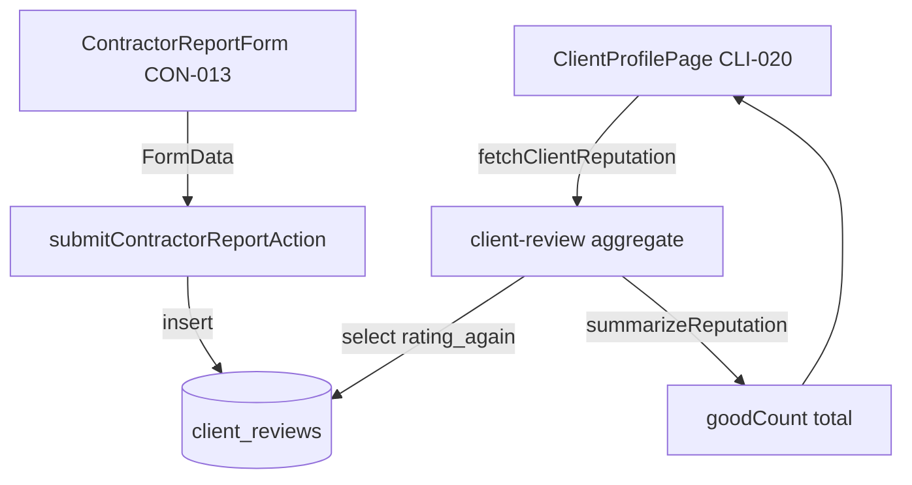
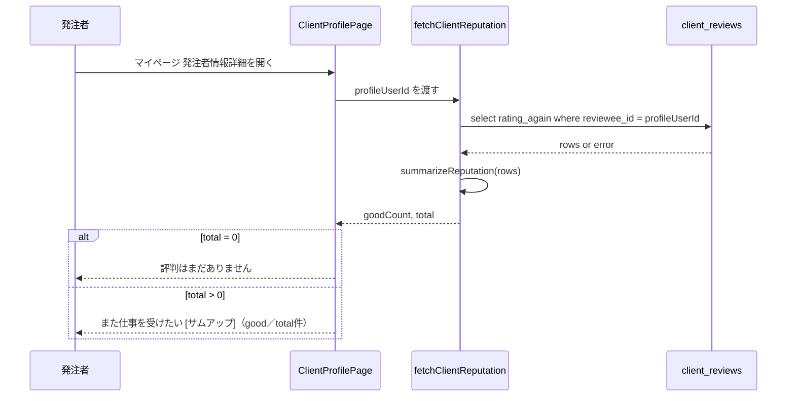

# Technical Design — client-review-completion

## Overview

本機能は、受注者が発注者を評価する仕組み（CON-013 / `client_reviews`）の「出口」を整備する。評価の入力形式は現行の Good/Bad を維持したまま、(1) 入力フォームの必須表示の不整合を是正し、(2) Good/Bad マークを lucide サムアップに統一し、(3) 発注者が自分の評判（「また受けたい」件数）を CLI-020 で確認できるようにする。

**Users**: 受注者（CON-013 で評価を入力）と、発注者本人（CLI-020 で自分の評判を閲覧）。

**Impact**: 現状「保存されるだけで活用されていない」`rating_again` に、本人向けの表示経路を与える。DB スキーマ・RLS・ルーティングは変更しない。評価の補足テキスト（status_supplement / comment）は保存し続けるが本 spec では表示しない（後決め）。

### Goals
- CON-013 の「また仕事を受けたいか」に必須表示を付与し、入力前に必須と分かるようにする
- Good/Bad マークと評判表示のサムアップを lucide で統一する
- 発注者本人が CLI-020 で「また受けたい（good／合計件数）」を確認できる
- 評判集計を再利用可能・テスト可能なドメイン関数に集約する

### Non-Goals
- 評価形式の★×5化、評価項目の追加（Good/Bad 維持）
- 稼働状況の補足・評価補足コメントの表示（全画面・保留）
- bad 件数の表示
- 他の受注者が発注者の評判を見る画面（CLI-028 相当）の新設
- `client_reviews` の SELECT RLS 緩和（公開範囲拡大）、スキーマ変更、マイグレーション
- 稼働状況6択の意味論・applications.status 連動の変更

## Requirements Traceability

| Requirement | Summary | Components | Interfaces | Flows |
|-------------|---------|------------|------------|-------|
| 1.1, 1.4 | 必須表示・任意表示の体裁 | ContractorReportForm | 表示文言（必須 span） | — |
| 1.2, 1.3 | 送信ガード・サーバ検証 | ContractorReportForm / submitContractorReportAction | `contractorReportSchema`（現状維持） | 提出フロー |
| 2.1–2.5 | サムアップ統一・状態区別・a11y・type=button | ContractorReportForm / ClientProfilePage | lucide `ThumbsUp`/`ThumbsDown` | — |
| 3.1–3.5 | 評判集計（good/合計）純粋関数＋取得 | client-review/aggregate | `summarizeReputation` / `fetchClientReputation` | — |
| 4.1–4.6 | CLI-020 評判表示（また受けたい good/合計） | ClientProfilePage | `fetchClientReputation` 呼び出し | 表示フロー |
| 5.1–5.5 | RLS 不変・補足非表示・clients/[id] 不変 | （変更しない範囲） | — | — |
| 6.1–6.3 | 存在チェック非回帰・スキーマ不変 | （既存5画面 + 二者完了判定） | — | — |
| 7.1–7.5 | Vitest/Playwright/seed/3層ゲート | aggregate.test / matching.spec / seed.sql | — | — |
| 8.1–8.3 | screen-map 整合・後決め注記 | screen-map.md | — | — |

## Architecture

### Existing Architecture Analysis
- **集計層**: `src/lib/rating/aggregate.ts`（user_reviews 用）が「純粋 `summarize()` + `fetch*()`（`{data,error}` ガード）」パターンを確立。本機能はこれと対称な `client-review` 版を新設する
- **書き込み経路**: `client_reviews` の INSERT は `submitContractorReportAction`（`applications/actions.ts`）の1か所のみ。本 spec で書き込みロジックは変更しない
- **既存 RLS（維持）**: `client_reviews` の SELECT は被評価者本人・同一組織・投稿者本人のみ。CLI-020（本人が自分の評判を見る）はこの範囲内で成立する
- **保たれる統合点**: 存在チェックを行う5画面（mypage / applications.history(+[id]) / applications.orders(+[id]) / jobs.[id].applicants）と、発注者側の二者完了判定（actions.ts の client_reviews 存在 SELECT）

### Architecture Pattern & Boundary Map



**Architecture Integration**:
- Selected pattern: ドメイン集計関数 + RSC 直接フェッチ（既存 `lib/rating` と対称）
- Domain/feature boundaries: 集計ロジックは `lib/client-review` に閉じ込め、表示（CLI-020）と入力（CON-013）は薄い UI 改修のみ
- Existing patterns preserved: RSC 直接フェッチ、`{success,error,data}` Server Action（変更なし）、lucide アイコンの薄紫統一
- New components rationale: 評判集計の単一情報源（手書き count の散在防止、将来の評判ページとの共有）
- Steering compliance: フォーム内ボタン `type` 明示、アイコンは lucide を className で薄紫統一、テスト3層

### Technology Stack

| Layer | Choice / Version | Role in Feature | Notes |
|-------|------------------|-----------------|-------|
| Frontend | Next.js App Router（RSC）, lucide-react | CLI-020 表示・CON-013 フォーム改修 | 既存スタック。新規依存なし |
| Backend / Domain | TypeScript ドメイン関数（`lib/client-review`） | 評判集計 | `lib/rating` と同型 |
| Data | Supabase Postgres `client_reviews`（読み取りのみ） | 評判ソース | スキーマ・RLS 不変 |
| Test | Vitest / Playwright | 集計ユニット・提出/表示 E2E | seed.sql に client_reviews 追加 |

## System Flows

CLI-020 評判表示（単純フェッチのため簡略）:



> 法人プランでは `profileUserId` は組織 Owner の ID に解決される（既存 `resolveProfileContext` を踏襲）。error 時は `fetchClientReputation` が `{goodCount:0, total:0}` を返し、0件表示に縮退する（fail-safe）。

## Components and Interfaces

| Component | Domain/Layer | Intent | Req Coverage | Key Dependencies (P0/P1) | Contracts |
|-----------|--------------|--------|--------------|--------------------------|-----------|
| client-review/aggregate | Domain | 評判 good/合計 を集計 | 3 | Supabase client (P0) | Service / State |
| ContractorReportForm | UI | CON-013 入力・必須表示・サムアップ | 1, 2 | submitContractorReportAction (P0) | — |
| ClientProfilePage | UI | CLI-020 評判表示 | 2, 4 | client-review/aggregate (P0) | — |

### Domain: client-review/aggregate

#### ClientReviewAggregate

| Field | Detail |
|-------|--------|
| Intent | client_reviews から発注者の評判（good件数・合計件数）を集計する |
| Requirements | 3.1, 3.2, 3.3, 3.4, 3.5 |

**Responsibilities & Constraints**
- 件数算出（`summarizeReputation`）は純粋関数として副作用を持たない（Req3-2）
- 0件・error 時は `{goodCount:0, total:0}` を返し例外を投げない（Req3-3）
- 引数は被評価者 ID のみ。閲覧権限は呼び出し側／RLS に委ねる（Req3-5：将来「閲覧者≠被評価者」拡張の余地）
- 補足・コメント取得は実装しない（保留）

**Dependencies**
- Outbound: Supabase client（`from("client_reviews").select("rating_again")`）— 評判データ取得（P0）

**Contracts**: Service [x] / State [x]

##### Service Interface
```typescript
/** 発注者の評判サマリー。bad は表示しないため返さない（将来 total - goodCount で導出可能）。 */
export interface ClientReputationSummary {
  /** rating_again = 'good' の件数（0以上） */
  goodCount: number;
  /** rating_again が記録された評価の合計件数（good + bad、分母） */
  total: number;
}

/** 純粋関数: rating_again 列の配列から good 件数と合計件数を算出する。 */
export function summarizeReputation(
  rows: ReadonlyArray<{ rating_again: string | null }>,
): ClientReputationSummary;

/** 取得関数: 特定の被評価者（発注者）の評判を集計して返す。error/0件は {0,0}。 */
export function fetchClientReputation(
  supabase: SupabaseClient<Database>,
  clientUserId: string,
): Promise<ClientReputationSummary>;
```
- Preconditions: `clientUserId` は有効なユーザーID。RLS により呼び出し元が当該被評価者の client_reviews を SELECT できること（CLI-020 では本人）
- Postconditions: `0 <= goodCount <= total`
- **`total` の正準定義（実装者はこの1定義に従う）**: `total` = その被評価者が受け取った評価の総数 = `rating_again` が `'good'` または `'bad'` の行数（`null` 行は除外）。`rating_again` はフォーム＋`contractorReportSchema` で実質必須のため、実データ上は「被評価者の client_reviews 行数」と一致する。`goodCount` = `rating_again = 'good'` の行数。CLI-020 の「（goodCount／total件）」の分母はこの `total` を唯一の真実とし、旧 `reviews.length` 系の手書き集計は使わない
- Invariants: 副作用なし。返り値は常に非負整数の組

**Implementation Notes**
- Integration: `lib/rating/aggregate.ts` の `fetchOverallSummary` と同じ `{data,error}` ガード様式を踏襲
- Validation: `summarizeReputation` は `rating_again === 'good'` を good、`'good' | 'bad'` のいずれかを total としてカウント（null は分母外）
- Risks: rating_again に想定外値が入った場合 total に含めるか要確認 → 設計上 good/bad のみ total、null は除外で統一

### UI: ContractorReportForm（CON-013）— Summary-only

| Field | Detail |
|-------|--------|
| Intent | 受注者の作業報告＋発注者評価入力。必須表示是正とサムアップ統一 |
| Requirements | 1.1, 1.2, 1.3, 1.4, 2.1, 2.2, 2.3, 2.4, 2.5 |

**Implementation Notes**
- Integration: 既存 `contractor-report-form.tsx` を最小改修。「また仕事を受けたいか」見出しに稼働状況と同体裁の `<span className="text-destructive text-body-sm">必須</span>` を追加（1.1）
- Validation: 送信ガード（`!operatingStatus || !ratingAgain` で disabled）と `contractorReportSchema`（`ratingAgain` 必須）は現状維持（1.2, 1.3）
- アイコン: lucide `ThumbsUp`/`ThumbsDown` を維持。`aria-label="Good"/"Bad"` は**変更しない**（既存 E2E `e2e/matching.spec.ts` L187 が依存）。ボタンは `type="button"` 明示済（2.4, 2.5）。選択中 fill=currentColor + text-primary（2.2）
- Risks: 必須ラベルは見出しテキストのみ追加。selector 非依存なので E2E 非回帰

### UI: ClientProfilePage（CLI-020）— Summary-only

| Field | Detail |
|-------|--------|
| Intent | 発注者本人の評判表示を「また受けたい（good／合計）」に整える |
| Requirements | 2.1, 4.1, 4.2, 4.3, 4.4, 4.5, 4.6 |

**Implementation Notes**
- Integration: `mypage/client-profile/page.tsx` の現状インライン集計（L131-139）を `fetchClientReputation(supabase, profileUserId)` 呼び出しに置換（4.2）。`profileUserId` は既存 `resolveProfileContext` の解決値（法人は Owner）（4.4）
- 表示: 評判セクション（L240-257）を「また仕事を受けたい」ラベル（CON-013 設問と統一）+ lucide `ThumbsUp` + 「（goodCount／total件）」に変更（4.1）。現状の `👍` 絵文字を lucide サムアップに置換（2.1 統一）
- 0件分岐: `total === 0` のとき「評判はまだありません」を維持（4.3）
- 非表示: status_supplement / comment / bad 件数は表示しない（4.5, 4.6）
- Risks: 既存の `reputationGood`（L136-138）と `totalReviews = reviews.length`（L139）を**完全撤去**し、`fetchClientReputation` が返す `goodCount` / `total` に一本化する。これにより「合計件数」の定義が集計関数の正準定義1つに揃う（重複・ドリフト防止）

## Data Models

**スキーマ変更なし。** `client_reviews`（既存）を読み取りのみで利用する。関連カラム:

| Column | Type | 本機能での扱い |
|--------|------|----------------|
| reviewee_id | uuid | 集計のキー（被評価者＝発注者） |
| rating_again | text（'good'/'bad'） | good件数・合計件数の算出に使用 |
| status_supplement | text | 保存のみ・**非表示**（保留） |
| comment | text | 保存のみ・**非表示**（保留） |
| application_id | uuid (UNIQUE) | 1応募1評価（既存制約） |

### Seed（テストデータ）
- `supabase/seed.sql` に client_reviews 行を追加（現状ゼロ）。CLI-020 評判表示 E2E 用に、ある発注者テストユーザーを reviewee_id とする good 複数件 + bad 1件を投入し、「good／合計」の分母を検証可能にする
- FK 整合: 既存の accepted/completed 応募行に紐付け、reviewer_id=applicant（受注者）、reviewee_id=job owner（発注者）。application_id は UNIQUE のため1応募1行

## Error Handling

### Error Strategy
- **集計取得失敗**: `fetchClientReputation` は Supabase error 時に `{goodCount:0, total:0}` を返す（fail-safe）。CLI-020 は「評判はまだありません」に縮退し、画面は壊れない
- **フォーム検証**: 既存どおり `contractorReportSchema` の Zod 検証で必須未入力を拒否し、日本語エラーを返す（1.3）。クライアント側は送信ボタン disabled で先回り防止（1.2）

### Error Categories and Responses
- User Errors: 必須未入力 → 送信ボタン非活性＋サーバ検証エラー文言
- System Errors: 集計クエリ失敗 → 0件表示に縮退（ログは既存方針に従う）

### Monitoring
- 新規の監視要件なし。既存のロギング方針に従う

## Testing Strategy

### Unit Tests (Vitest)
- `summarizeReputation`: good のみ／good+bad 混在／空配列（{0,0}）／null 混在（total から除外）の件数算出（3.2, 3.3）
- `fetchClientReputation`: Supabase モックで data 正常時の集計、error 時の {0,0} 縮退（3.3）

### E2E Tests (Playwright)
- CON-013 提出（必須ラベル・サムアップ後）: 稼働状況選択 → `getByLabel("Good")` → 送信 → 評価済みになる正常系（7.2、既存 `e2e/matching.spec.ts` を維持／必要なら必須表示の存在 assert を追加）
- CLI-020 表示: 評判ありの発注者でログイン → 「また受けたい（good／合計）」表示（7.3）
- CLI-020 表示（0件）: 評価0件の発注者で「評判はまだありません」表示（7.3）

### Regression Gate
- `npm run test` / `supabase test db` / `npm run test:e2e` の3層が既存含め全通過（7.5）。スキーマ・RLS 不変のため pgTAP は新規追加不要（既存 `matching_rls.test.sql` を維持）

## Security Considerations

- **公開範囲を広げない**: `client_reviews` の SELECT RLS（本人・同組織・投稿者のみ）を変更しない。CLI-020 は本人が自分の評判を見るユースケースで現行 RLS 内に収まる（5.1, 5.2）
- **段階的公開の分離**: 補足・コメントの本人表示（段階1）、第三者公開（段階2＝RLS 緩和）は本 spec のスコープ外とし、別 spec の意思決定に委ねる（5.3, 5.5）
- **clients/[id] 不変**: 受注者が他発注者を見る画面では client_reviews を参照しない現状を維持（5.4）

## Migration Strategy

マイグレーション不要（スキーマ・RLS 変更なし）。型再生成（`supabase gen types`）も不要。変更は seed.sql のテストデータ追加のみ。
