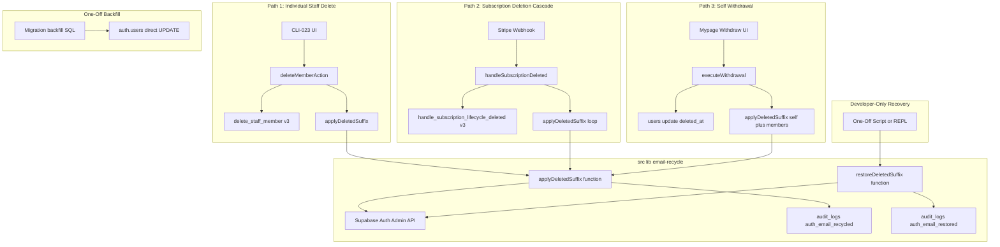
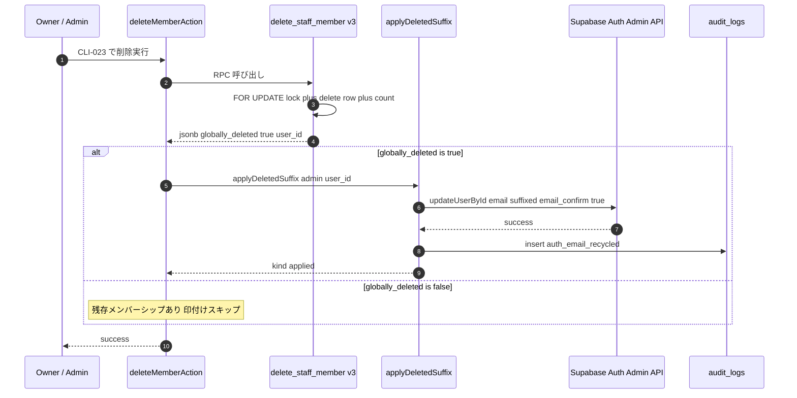
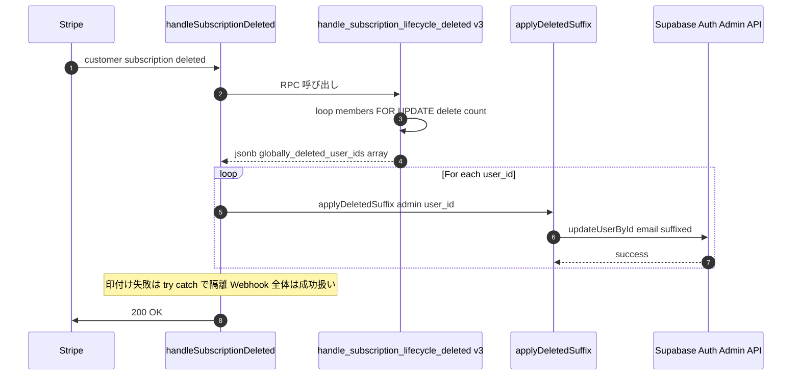
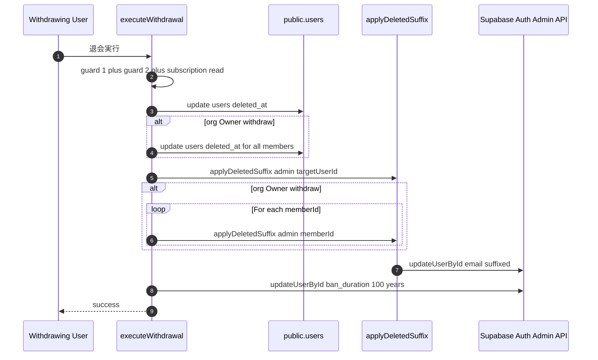
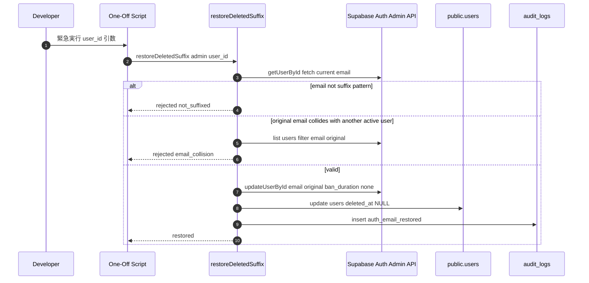
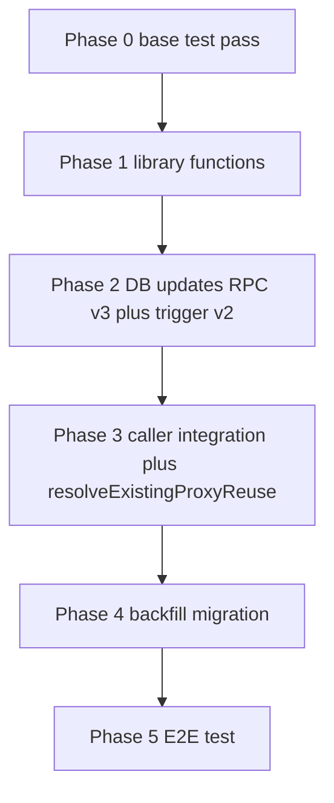

# Design Document — email-recycle-on-delete

## Overview

**Purpose**: ビジ友のユーザー削除フロー 3 経路（個別担当者削除 / 法人プラン解約連鎖 / 本人退会）すべてで、対象 user の `auth.users.email` に「印」を付けて元のメールアドレスを解放する。これにより、運営の DB 直叩き手作業をゼロにし、同じメールでの再招待・再登録を Owner / 一般ユーザーの通常操作で完結させる。

**Users**: ビジ友運営員（代理として N 法人を行き来）、法人 Owner / Admin（CLI-023 から担当者を管理）、受注者・発注者本人（自己退会・再登録）、ビジ友開発者（誤削除時の救済を直接実行）。

**Impact**: 3 経路の RPC / Server Action / Webhook handler に印付け呼び出しを差し込む。新規ライブラリ `src/lib/email-recycle/` 配下に 2 関数を実装。`delete_staff_member` / `handle_subscription_lifecycle_deleted` の RPC 戻り値を拡張（v3 化）。**既存トリガー `on_auth_user_email_changed` の関数本体（`handle_user_email_change`）を更新**し、印付き email への変更時は `public.users.email` への同期をスキップする。**既存ヘルパー `resolveExistingProxyReuse` の検索クエリに `.is("deleted_at", null)` フィルタを追加**し、同 email 複数行並存時の multi-row エラーを防ぐ。過去削除済みデータ用に 1 回限りバックフィル migration を投入。

### Goals

- 3 経路すべてで `public.users.deleted_at` が NULL → now() に遷移したとき、`auth.users.email` を `deleted-{YYYYMMDD}-{rand4}-{localpart}@{domain}` 形式に書き換える
- 既存削除フロー（`delete_staff_member` v2 / `handle_subscription_lifecycle_deleted` v2 / `executeWithdrawal` / `createMemberAction` / `acceptInviteAction` 等）の挙動は変えず、追加処理として印付けを差し込む
- 誤削除からの復活処理を `src/lib/email-recycle/restore-deleted-suffix.ts` ライブラリ関数として実装し、開発者直接呼び出しで利用可能にする
- 本機能投入前にすでに `deleted_at IS NOT NULL` の user を一括バックフィル
- 副作用対応として 2 つの既存実装を最小修正する：（a）`handle_user_email_change` トリガー関数を「印付き email への変更時は public.users.email へ同期しない」よう更新、（b）`resolveExistingProxyReuse` の検索クエリに `.is("deleted_at", null)` を追加
- 印付け失敗時も `audit_logs` に `auth_email_recycle_failed` action で記録し、運営が SQL 1 本で失敗 user を特定できる状態を保つ

### Non-Goals

- 旧「凍結（`is_active = false`）→ 再アップグレードで復活」モデルの復活
- 削除前の旧 user に紐づくメッセージ / 評価 / お気に入り / プロフィール等を新 user に引き継ぐ仕組み
- 復活処理の管理画面 UI / admin Server Action route / CLI コマンド（運営も含めて UI 経由の呼び出し導線は一切作らない）
- `delete_staff_member` v2 の残存メンバーシップ判定 / `handle_subscription_lifecycle_deleted` v2 の Owner 既退会 early-return / `executeWithdrawal` の各種 guard 等、既存ロジックの挙動変更
- 通知メール spec での Withdraw / Restore メール通知（spec `notifications` 側で扱う）

## Architecture

### Existing Architecture Analysis

本機能は以下の既存サブシステムを拡張する形で実装する：

- **`delete_staff_member` v2 RPC**: `FOR UPDATE` 悲観ロック → `organization_members` 行削除 → 残存判定 → 条件付き `deleted_at` セット。**戻り値が `void` のため、呼び出し元はグローバル削除が起きたかを知る術がない** → 戻り値を `jsonb` に拡張
- **`handle_subscription_lifecycle_deleted` v2 RPC**: ループ内で配下 Admin / Staff を順次削除 → 残存判定 → 条件付き `deleted_at` セット。**配下 user_id 配列を返していない** → 戻り値拡張
- **`executeWithdrawal` (`src/lib/withdrawal/execute.ts`)**: TypeScript 内で `public.users.deleted_at` を直接 UPDATE。Owner 退会では配下 Admin / Staff も一括 UPDATE。**RPC を介さず TS から直接実行されるため、RPC 戻り値の拡張ではなく TS 内に呼び出しを差し込む**
- **Stripe Webhook handler (`src/lib/billing/webhook/handle-subscription-lifecycle.ts`)**: 経路 2 の RPC を呼び出す層。RPC 戻り値の `globally_deleted_user_ids` を受け取り印付けを実行する
- **`createMemberAction`**: 既存の招待フロー。**変更しない**。印付け済み auth.users が空席として機能するだけで、招待フロー側は意識しない
- **`resolveExistingProxyReuse` (`src/lib/organization/resolve-existing-proxy-reuse.ts`)**: 招待時に既存 user を引くヘルパー。`public.users.email` の検索が `.maybeSingle()` で 1 行前提。**本機能で同 email 複数行並存が可能になるため、`.is("deleted_at", null)` フィルタを 1 行追加**。discriminated union の構造・分岐ロジックは不変
- **`handle_user_email_change` トリガー関数 (`supabase/migrations/20260415100000_auth_email_sync_trigger.sql`)**: `auth.users.email` の UPDATE を検知して `public.users.email` を自動同期する。**印付け書き換え時にもこれが起動して `public.users.email` を suffix 形式に上書きしてしまうため、印付きパターンに該当する変更は同期スキップするよう関数本体を更新**

### Architecture Pattern & Boundary Map



**Architecture Integration**:
- Selected pattern: **Caller-side hook + shared library function**（PostgreSQL RPC からは Supabase Auth Admin API を呼べないため、TypeScript 層で印付けを実行）
- Domain / feature boundaries: `src/lib/email-recycle/` が独立 domain。3 経路の呼び出し元はこの domain を import して利用するのみ
- Existing patterns preserved: `delete_staff_member` v2 の `FOR UPDATE` 悲観ロック、`handle_subscription_lifecycle_deleted` v2 の Owner 既退会 early-return、`executeWithdrawal` の各種 guard、`resolveExistingProxyReuse` の判定ロジック、`audit_logs` への記録パターン
- New components rationale: ライブラリ関数 2 つ（apply / restore）+ RPC 戻り値拡張 2 つ + 1 回限りバックフィル migration。これより少ない構成は実現不可
- Steering compliance: 非 UNIQUE な `public.users.email` を維持、`audit_logs.action` の text 列特性を維持、SECURITY DEFINER 関数の `SET search_path = public` を維持

### Technology Stack

| Layer | Choice / Version | Role in Feature | Notes |
|-------|------------------|-----------------|-------|
| Backend / Library | TypeScript（既存）、`@supabase/supabase-js` admin client | 印付け / 復活ライブラリ関数の実装基盤 | 新規依存ライブラリなし |
| Backend / RPC | PostgreSQL / Supabase SQL | `delete_staff_member` v3 / `handle_subscription_lifecycle_deleted` v3 の戻り値拡張 | 既存 v2 を `CREATE OR REPLACE` で書き換え |
| Data / Storage | `auth.users.email` / `public.users.email` / `audit_logs` | 印付け対象、原本保持、監査ログ | 新規テーブル / カラムなし |
| Infrastructure / Runtime | Next.js 16 Server Action / API Route Webhook | 呼び出し元の実行環境 | 既存実行基盤を流用 |

> 詳細な検討経緯は `research.md` の Topic 1〜6 を参照。

## System Flows

### Flow 1: 個別担当者削除（経路 1）



### Flow 2: 法人プラン解約連鎖（経路 2）



### Flow 3: 本人退会（経路 3）



### Flow 4: 復活（誤削除救済 / 開発者直接呼び出し）



## Requirements Traceability

| Requirement | Summary | Components | Interfaces | Flows |
|-------------|---------|------------|------------|-------|
| 1.1 | `delete_staff_member` で `deleted_at` 遷移時に印付け | `applyDeletedSuffix` / `delete_staff_member` v3 / `deleteMemberAction` | Service Interface | Flow 1 |
| 1.2 | 残存メンバーシップありなら印付けしない | `delete_staff_member` v3（戻り値が判定） | RPC Contract | Flow 1 |
| 1.3 | `is_proxy_account` を区別しない | `applyDeletedSuffix`（フラグ参照しない） | Service Interface | Flow 1 |
| 1.4 | `audit_logs` 記録 | `applyDeletedSuffix` | State Management | Flow 1 |
| 1.5 | 印付け失敗時の削除完了維持 | `deleteMemberAction`（try-catch 隔離） | Service Interface | Flow 1 |
| 1.6 | `public.users.email` 不変 | `applyDeletedSuffix`（auth.users のみ更新） | Service Interface | Flow 1 |
| 1.7 | `handle_user_email_change` トリガー関数更新で印付きスキップ | `handle_user_email_change` v2 | API (DB Trigger) | — |
| 1.8 | v2 関数に `SET search_path = public` を必ず付与（CLAUDE.md SECURITY DEFINER ルール準拠） | `handle_user_email_change` v2 | API (DB Trigger) | — |
| 1.9 | admin API 呼び出しに `email_confirm: true` を必ず付与（架空アドレスへの確認メール送信を抑止、bounce による配信信頼度低下を防止） | `applyDeletedSuffix` | Service Interface | Flow 1, 2, 3 |
| 2.1 | 解約連鎖で印付け | `handle_subscription_lifecycle_deleted` v3 / `handleSubscriptionDeleted` / `applyDeletedSuffix` | RPC / Service | Flow 2 |
| 2.2 | バッチ内独立乱数 | `applyDeletedSuffix`（呼び出しごとに乱数生成） | Service Interface | Flow 2 |
| 2.3 | RPC 内で auth API 呼べないので Webhook 側で実行 | `handleSubscriptionDeleted`（loop） | Webhook Contract | Flow 2 |
| 2.4 | 部分失敗の許容 | `handleSubscriptionDeleted`（try-catch loop） | Webhook Contract | Flow 2 |
| 2.5 | Owner 既退会 early-return では印付け不発火 | `handle_subscription_lifecycle_deleted` v3（戻り値空配列） | RPC Contract | Flow 2 |
| 3.1 | `executeWithdrawal` で印付け | `executeWithdrawal` / `applyDeletedSuffix` | Service Interface | Flow 3 |
| 3.2 | Owner 退会カスケード全員に印付け | `executeWithdrawal`（memberIds loop） | Service Interface | Flow 3 |
| 3.3 | ban_duration 既存挙動維持 | `executeWithdrawal`（変更しない） | Service Interface | Flow 3 |
| 3.4 | guard / Stripe 解約 / カスケード変更しない | `executeWithdrawal`（追加のみ） | Service Interface | Flow 3 |
| 3.5 | 印付け失敗時の退会成功維持 | `executeWithdrawal`（try-catch 隔離） | Service Interface | Flow 3 |
| 4.1 | `deleted-{YYYYMMDD}-{rand4}-{local}@{domain}` フォーマット | `generateSuffixedEmail` 内部関数 | Service Interface | — |
| 4.2 | YYYYMMDD（UTC） | `generateSuffixedEmail`（`toISOString().slice(0, 10)`） | Service Interface | — |
| 4.3 | 小文字英数 4 文字乱数 | `generateRandomSuffix` 内部関数 | Service Interface | — |
| 4.4 | 不正形式 skip | `applyDeletedSuffix`（preflight validation） | Service Interface | — |
| 4.5 | 衝突時 3 回リトライ | `applyDeletedSuffix`（retry loop） | Service Interface | — |
| 4.6 | 二重印付け回避 | `applyDeletedSuffix`（SUFFIX_PATTERN 判定） | Service Interface | — |
| 5.1〜5.5 | invite / signup / proxy reuse / fresh start を変更しない | 既存コンポーネント無変更 | — | — |
| 5.6 | `resolveExistingProxyReuse` 検索クエリに `.is("deleted_at", null)` 追加 | `resolveExistingProxyReuse` (拡張) | Service Interface | — |
| 6.1〜6.4 | fresh start 徹底 | 既存テーブル無変更 / 新 user は新 id | — | — |
| 7.1〜7.9 | 復活処理（開発者直接呼び出し用） | `restoreDeletedSuffix` ライブラリ関数 | Service Interface | Flow 4 |
| 7.10 | 復活失敗時の audit_logs 記録（applyDeletedSuffix の失敗ログと対称） | `restoreDeletedSuffix`（`auth_email_restore_failed` 行 insert） | State Management | Flow 4 |
| 8.1〜8.4 | 既存削除済みデータのバックフィル | `XXX_email_recycle_backfill.sql` migration | Batch Contract | — |
| 8.5 | バックフィルは低トラフィック時間帯に投入（forward 経路との並行 race 回避） | Migration コメント / 運用 doc | Batch Contract | — |
| 8.6 | バックフィル乱数を 8 文字に拡張（forward 4 文字との非対称、衝突確率を実質ゼロに） | Backfill Migration（md5 substring 1-8）| Batch Contract | — |
| 9.1〜9.4 | 監査ログ（4 種 action 値） | `applyDeletedSuffix` / `restoreDeletedSuffix`（`audit_logs` insert） | State Management | — |
| 10.1〜10.4 | 冪等性・並行安全 | `applyDeletedSuffix`（事前 SUFFIX_PATTERN 判定）/ `delete_staff_member` v3（`FOR UPDATE`） | Service Interface | — |
| 10.5 | 失敗時の audit_logs 記録 | `applyDeletedSuffix`（`auth_email_recycle_failed` 行 insert） | State Management | — |
| 11.1〜11.5 | 既存仕様への非介入 | 既存コンポーネント無変更 | — | — |
| 12.1〜12.4 | テスト戦略 | テストファイル群 | Testing Strategy | — |

## Components and Interfaces

| Component | Domain/Layer | Intent | Req Coverage | Key Dependencies (P0/P1) | Contracts |
|-----------|--------------|--------|--------------|--------------------------|-----------|
| `applyDeletedSuffix` | Library (`src/lib/email-recycle/`) | `auth.users.email` に印付け、`audit_logs` 記録（成功 / 失敗） | 1.1, 1.3, 1.4, 1.6, 2.2, 3.1, 4.1〜4.6, 9.1〜9.3, 10.1, 10.5 | Supabase Auth Admin API (P0), `audit_logs` table (P0) | Service |
| `restoreDeletedSuffix` | Library (`src/lib/email-recycle/`) | 印を剥がして `deleted_at = NULL` / ban 解除 | 7.1〜7.9, 9.1〜9.3 | Supabase Auth Admin API (P0), `public.users` (P0), `audit_logs` (P0) | Service |
| `delete_staff_member` v3 | DB / RPC | 戻り値拡張で `globally_deleted` を返す | 1.1, 1.2, 1.3, 11.1 | `organization_members`, `public.users` | API (RPC) |
| `handle_subscription_lifecycle_deleted` v3 | DB / RPC | 戻り値に `globally_deleted_user_ids` 配列を含める | 2.1, 2.5, 11.2 | `organization_members`, `public.users` | API (RPC) |
| `handle_user_email_change` v2 (Trigger Function) | DB / Trigger Function | 印付き email への変更時は `public.users.email` 同期をスキップ | 1.6, 1.7, 6.1, 6.2 | `auth.users`, `public.users` | API (DB Trigger) |
| `resolveExistingProxyReuse` (拡張) | Library (`src/lib/organization/resolve-existing-proxy-reuse.ts`) | 検索クエリに `.is("deleted_at", null)` 追加で同 email 複数行を回避 | 5.3, 5.6, 11.3 | `public.users` | Service |
| `deleteMemberAction` (拡張) | Server Action (`src/app/(authenticated)/mypage/members/actions.ts`) | RPC 戻り値で印付け呼び出し | 1.1, 1.5 | `delete_staff_member` v3, `applyDeletedSuffix` | Service |
| `handleSubscriptionDeleted` (拡張) | Webhook handler (`src/lib/billing/webhook/handle-subscription-lifecycle.ts`) | RPC 戻り値配列で印付け loop | 2.1, 2.3, 2.4 | `handle_subscription_lifecycle_deleted` v3, `applyDeletedSuffix` | Service |
| `executeWithdrawal` (拡張) | Library (`src/lib/withdrawal/execute.ts`) | TS 内で印付け呼び出し | 3.1, 3.2, 3.5 | `applyDeletedSuffix`, 既存退会フロー | Service |
| Backfill Migration | SQL Migration | 既存削除済み user 一括印付け（更新後トリガー関数前提） | 8.1〜8.4 | `auth.users`, `public.users` | Batch |

### Library Layer (`src/lib/email-recycle/`)

#### applyDeletedSuffix

| Field | Detail |
|-------|--------|
| Intent | 対象 user の `auth.users.email` に削除印を付け、`audit_logs` に記録する |
| Requirements | 1.1, 1.3, 1.4, 1.6, 2.2, 3.1, 4.1〜4.6, 9.1〜9.3, 10.1 |

**Responsibilities & Constraints**
- 対象 user の現在の email を取得し、印付き形式に該当しなければ印付けて Supabase Auth Admin API で更新する
- 衝突時のリトライ（最大 3 回）と二重印付け回避は本関数の責任
- `public.users.email` には触らない（履歴保持）
- 失敗時は throw せず、結果 union 型で返す（呼び出し元が削除完了を維持するため）

**Dependencies**
- Inbound: `deleteMemberAction`, `handleSubscriptionDeleted`, `executeWithdrawal` — 削除確定後の印付け（P0）
- Outbound: Supabase Auth Admin API（`updateUserById` / `getUserById`）— email 更新（P0）
- Outbound: `audit_logs` table — 記録（P0）

**Contracts**: Service [x] / API [ ] / Event [ ] / Batch [ ] / State [ ]

##### Service Interface

```typescript
import type { SupabaseClient } from "@supabase/supabase-js";
import type { Database } from "@/types/database";

export type AdminClient = SupabaseClient<Database>;

export type ApplyDeletedSuffixResult =
  | { kind: "applied"; recycledEmail: string }
  | { kind: "already_suffixed" }
  | { kind: "skipped"; reason: "invalid_format" | "user_not_found" | "max_retries_exceeded"; error?: string }
  | { kind: "failed"; reason: "api_error"; error: string };

export interface ApplyDeletedSuffixOptions {
  /** 印付け発生経路（audit_logs.metadata.path に記録） */
  path: "staff_delete" | "subscription_deleted" | "self_withdrawal";
  /** 削除を実行した actor の user id（actor_id 記録用、なければ NULL） */
  actorId: string | null;
}

export async function applyDeletedSuffix(
  admin: AdminClient,
  userId: string,
  options: ApplyDeletedSuffixOptions,
): Promise<ApplyDeletedSuffixResult>;
```

- Preconditions: `admin` が Service Role Key で初期化されていること、`userId` が `auth.users.id` に存在する形式（uuid）であること。
- Postconditions: `applied` 時は `auth.users.email` が印付き形式に書き換わり、`audit_logs` に `action='auth_email_recycled'` 行が 1 件追加される。`already_suffixed` 時は変更も追加も発生しない。
- Invariants: `public.users.email` は変更されない。`public.users.deleted_at` も変更されない（既に上位処理でセット済み前提）。

##### State Management
- 副作用: `auth.users.email` UPDATE + `audit_logs` INSERT の 2 つ
- 冪等性: **`SUFFIX_PATTERN = /^deleted-\d{8}-[a-z0-9]{4,}-/`** で前方一致判定し、既に印付き済みなら no-op で `already_suffixed` を返す。`{4,}` で forward 4 文字 / バックフィル 8 文字を両対応
- 並行制御: 上位 `delete_staff_member` v2 の `FOR UPDATE` ロックで同一 user の並行削除は直列化される。本関数自体は短時間処理（admin API 1 回 + insert 1 回）

**Implementation Notes**
- Integration: 3 経路の呼び出し元から `try { result = await applyDeletedSuffix(...) } catch (e) { console.error(...) }` の形で呼ぶ。throw されないので catch は防御的（API SDK の予期せぬ throw 対応）
- Validation: 関数冒頭で `auth.users.getUserById(userId)` → email 形式（`@` 含む）/ 既存印付き判定 → 必要なら印付け
- **API 呼び出し形式 (Req 1.9)**: `admin.auth.admin.updateUserById(userId, { email: suffixedEmail, email_confirm: true })` で `email_confirm: true` を必ず付与する。理由：印付き email は実在しない架空アドレスのため、デフォルトの確認メール送信は bounce → ドメイン配信信頼度低下を招く。`email_confirm: true` で確認メール送信を抑止
- Failure logging: 結果が `failed` / `skipped` で終わった場合、`audit_logs` に `action='auth_email_recycle_failed'`, `target_type='user'`, `target_id=対象 user id`, `metadata = { reason, path, date }` を 1 件 insert する（Req 10.5）。これにより運営が `SELECT * FROM audit_logs WHERE action = 'auth_email_recycle_failed'` で失敗 user を 1 クエリで抽出できる
- Trigger interaction: 印付け UPDATE は `handle_user_email_change` v2 を起動するが、印付きパターンに該当するため同期スキップされる（Req 1.7）。よって `public.users.email` は原本のまま保持される
- Risks: 衝突 3 回リトライでも失敗する確率は 1/(36^4)^3 ≈ 10^-18 で実質ゼロ。失敗時はログ + audit + skip

#### restoreDeletedSuffix

| Field | Detail |
|-------|--------|
| Intent | 印を剥がして `public.users.deleted_at` を NULL に戻し、ban があれば解除する |
| Requirements | 7.1〜7.9, 9.1〜9.3 |

**Responsibilities & Constraints**
- 対象 user の現在の auth email が印付き形式に合致するか検証
- 印を剥がした元 email が別の active user と衝突しないか検証
- 検証通過時は `auth.users.email` 復元 + `ban_duration` 解除 + `public.users.deleted_at` クリア + `audit_logs` 記録
- **Server Action として export しない**（`'use server'` を付けない）。緊急時のみ開発者が直接呼ぶ

**Dependencies**
- Inbound: 開発者の一回限りスクリプト or Node REPL（P2）
- Outbound: Supabase Auth Admin API（P0）
- Outbound: `public.users` UPDATE（P0）
- Outbound: `audit_logs` INSERT（P0）

**Contracts**: Service [x] / API [ ] / Event [ ] / Batch [ ] / State [ ]

##### Service Interface

```typescript
export type RestoreDeletedSuffixResult =
  | { kind: "restored"; originalEmail: string }
  | { kind: "rejected"; reason: "not_suffixed" | "email_collision" | "user_not_found"; error: string }
  | { kind: "failed"; reason: "api_error"; error: string };

/**
 * 危険・運用注意
 * - 削除済み user を「印剥がし + deleted_at クリア + ban 解除」で active 状態に戻す
 * - fresh start を巻き戻すため、対象 user の旧 user_id に紐づくメッセージ / 評価 / 履歴がすべて
 *   再び有効化される
 * - 呼び出し前に対象 user の public.users 状態を確認すべき
 * - Service Role Key を持つ環境からのみ呼び出し可能。Server Action としては export しない
 */
export async function restoreDeletedSuffix(
  admin: AdminClient,
  userId: string,
): Promise<RestoreDeletedSuffixResult>;
```

- Preconditions: 対象 user の `auth.users.email` が印付き形式に合致していること。
- Postconditions: `restored` 時は `auth.users.email` が原本に戻り、`public.users.deleted_at = NULL`、ban_duration が解除され、`audit_logs` に `action='auth_email_restored'` 行が 1 件追加される。
- Invariants: 元 email が別 active user と衝突する場合、何も変更せず `rejected` を返す。

##### State Management
- 副作用: `auth.users.email` + `auth.users.ban_duration` + `public.users.deleted_at` + `audit_logs` INSERT
- 冪等性: 印付け形式でない user に対して呼ばれた場合は `rejected/not_suffixed` を返し、副作用ゼロ
- 並行制御: 復活は緊急時の手動操作で、並行実行は想定しない

**Implementation Notes**
- Integration: 開発者用スクリプト `scripts/restore-recycled-email.ts`（本 spec の成果物に含めず、運用 doc に手順だけ残す案を検討）
- Validation: 印付き形式マッチ、原本 email の `auth.users` 衝突確認、user_id 存在確認
- **email_collision 検出方法（明示）**: `admin.auth.admin.updateUserById(userId, { email: originalEmail, email_confirm: true })` を直接試行し、`error.code === 'email_exists'`（HTTP 422 相当）の場合のみ `rejected/email_collision` を返す。事前検索（`listUsers()` 全列挙 / auth スキーマへの直接 SQL）は採用しない（性能・権限の観点で不適切）
- Failure logging: 結果が `rejected` / `failed` で終わった場合、`audit_logs` に `action='auth_email_restore_failed'`, `target_type='user'`, `target_id=対象 user id`, `actor_id=NULL`, `metadata = { invoked_by: 'developer', reason, date }` を 1 件 insert する（Req 7.10）。これにより `applyDeletedSuffix` の失敗ログと対称な追跡が可能になり、誰がいつ救済を試みて失敗したかの監査が成立する
- Risks: 復活後の旧 user 行が active 化されることで「同じ email で 2 人の active user が並存する」可能性を email_collision チェックで回避

### Database Layer

#### delete_staff_member v3

| Field | Detail |
|-------|--------|
| Intent | v2 の戻り値を `void` から `jsonb` に拡張し、`globally_deleted` を返す |
| Requirements | 1.1, 1.2, 1.3, 11.1 |

**Responsibilities & Constraints**
- v2 の挙動（`FOR UPDATE` + row delete + count + 条件付き `deleted_at`）は完全維持
- 戻り値のみ `RETURNS jsonb` に変更し、`{ "user_id": uuid, "globally_deleted": boolean }` を返す
- `globally_deleted = true` は本 RPC 呼び出しで `users.deleted_at` を NULL → now() に遷移させた場合のみ

**Contracts**: Service [ ] / API [x] / Event [ ] / Batch [ ] / State [ ]

##### API Contract

| Method | Endpoint | Request | Response | Errors |
|--------|----------|---------|----------|--------|
| RPC | `delete_staff_member` | `(p_target_user_id uuid, p_organization_id uuid, p_owner_user_id uuid)` | `jsonb { user_id, globally_deleted }` | RAISE EXCEPTION on RLS denial |

**Implementation Notes**
- Integration: 新しい migration `XXX_delete_staff_member_v3.sql` で `CREATE OR REPLACE FUNCTION`
- Validation: 戻り値の型変更は呼び出し元 TypeScript の型定義 / `supabase gen types` 再生成が必要
- Risks: `RETURNS void` → `RETURNS jsonb` の変更は `DROP FUNCTION` を伴うため、`DROP FUNCTION IF EXISTS ... ; CREATE FUNCTION ...` の順で migration 内で実行（既存 GRANT/REVOKE は再付与）

#### handle_subscription_lifecycle_deleted v3

| Field | Detail |
|-------|--------|
| Intent | v2 の戻り値 jsonb に `globally_deleted_user_ids: uuid[]` を追加 |
| Requirements | 2.1, 2.5, 11.2 |

**Responsibilities & Constraints**
- v2 のループ内挙動は完全維持
- ループ内で `deleted_at` セット時に `v_globally_deleted_ids := array_append(v_globally_deleted_ids, v_member_user_id)`
- 戻り値 jsonb に `'globally_deleted_user_ids', to_jsonb(v_globally_deleted_ids)` を追加
- Owner 既退会 early-return パスでは `globally_deleted_user_ids` は空配列で返す（連鎖削除が発生しないため）

**Contracts**: Service [ ] / API [x] / Event [ ] / Batch [ ] / State [ ]

##### API Contract

| Method | Endpoint | Request | Response | Errors |
|--------|----------|---------|----------|--------|
| RPC | `handle_subscription_lifecycle_deleted` | `(event_data jsonb)` | `jsonb { subscription_id, user_id, globally_deleted_user_ids: uuid[], skipped_downgrade? }` | RAISE EXCEPTION on subscription not found |

**Implementation Notes**
- Integration: 新しい migration `XXX_handle_subscription_lifecycle_deleted_v3.sql` で `CREATE OR REPLACE FUNCTION`
- Validation: `supabase gen types` 再生成 + 呼び出し元 `handleSubscriptionDeleted` の型を更新
- Risks: 既存 v2 テスト（pgTAP）の戻り値 assertion を更新する必要あり

#### handle_user_email_change v2（auth-to-public sync トリガー関数の更新）

| Field | Detail |
|-------|--------|
| Intent | 印付き email（`/^deleted-\d{8}-[a-z0-9]{4,}-/`、`{4,}` で forward 4 文字 / バックフィル 8 文字を両対応）への変更時は `public.users.email` への同期をスキップする |
| Requirements | 1.6, 1.7, 6.1, 6.2 |

**Responsibilities & Constraints**
- 既存トリガー `on_auth_user_email_changed`（`AFTER UPDATE OF email ON auth.users`）は維持
- 関数本体 `handle_user_email_change` を `CREATE OR REPLACE` で更新し、`NEW.email !~ '^deleted-\d{8}-[a-z0-9]{4,}-'` 条件を追加（`{4,}` で forward 4 文字 / バックフィル 8 文字を両対応）
- 復活処理（印を剥がす UPDATE）では `NEW.email` が原本（パターン外）なので同期が通常通り発火する（実質 no-op、既に同じ値）
- バックフィル migration（Req 8）の `auth.users.email` 直接 UPDATE もこの関数を起動するため、本関数の更新が **バックフィルより先に投入される必要あり**（移行戦略の Phase 2 に明記）

**Contracts**: Service [ ] / API [x] / Event [ ] / Batch [ ] / State [ ]

##### API Contract

| Trigger | Source Event | Logic | Side Effect |
|---------|--------------|-------|-------------|
| `on_auth_user_email_changed` | `AFTER UPDATE OF email ON auth.users` | `IF NEW.email IS DISTINCT FROM OLD.email AND NEW.email !~ '^deleted-\d{8}-[a-z0-9]{4,}-' THEN UPDATE public.users SET email = NEW.email WHERE id = NEW.id; END IF;` | 印付き以外は同期、印付きはスキップ（`{4,}` で 4/8 文字両対応） |

##### Function Signature (v2)

```sql
CREATE OR REPLACE FUNCTION handle_user_email_change()
RETURNS TRIGGER AS $$
BEGIN
  IF NEW.email IS DISTINCT FROM OLD.email
     AND NEW.email !~ '^deleted-\d{8}-[a-z0-9]{4,}-' THEN
    UPDATE public.users SET email = NEW.email WHERE id = NEW.id;
  END IF;
  RETURN NEW;
END;
$$ LANGUAGE plpgsql SECURITY DEFINER
   SET search_path = public;   -- ← Req 1.8 で必須化 (v1 では欠落)
```

**正規表現の `{4,}` （4 文字以上）について**: forward 経路（`applyDeletedSuffix`）は 4 文字、バックフィル経路（Task 10）は 8 文字を使うため、両長さを同じパターンで検出する必要がある。`{4}` ではなく `{4,}` を使用。

**Implementation Notes**
- Integration: 新しい migration `XXX_auth_email_sync_trigger_v2.sql` で `CREATE OR REPLACE FUNCTION handle_user_email_change()` を実行
- **`SET search_path = public` を必ず付与（Req 1.8）**：CLAUDE.md SECURITY DEFINER ルール準拠。既存 v1 では欠落しており、2026-04-24 に `handle_new_user` トリガーで同種の欠落により招待フロー全体が「Database error saving new user」で停止した経緯あり。v2 化のタイミングで同時に補修する
- Validation: pgTAP テストで「印付け UPDATE 後も `public.users.email` が原本のまま」を検証。また「通常のメール変更（Secure email change）では従来通り同期される」も検証。さらに pg_proc を `static check` し `prosecdef = true` かつ `proconfig` に `search_path=public` が含まれることを assert（新規テスト）
- Risks: 関数更新中に発火する email 変更がスキップされる極小タイミング窓があるが、本機能投入は dev → prod の段階的展開で吸収可能

### Integration Layer

#### resolveExistingProxyReuse (拡張)

| Field | Detail |
|-------|--------|
| Intent | 同 email 複数行並存時の `.maybeSingle()` multi-row エラーを防ぐため、検索クエリを `deleted_at IS NULL` で active 行に絞る |
| Requirements | 5.3, 5.6, 11.3 |

**Responsibilities & Constraints**
- 既存の Step 1 SELECT クエリに `.is("deleted_at", null)` を 1 行追加
- Step 3 の「論理削除済みユーザー → `new_user` 扱い」分岐は防御として残すが、フィルタにより到達不能 (dead code) になる。コメントで補足
- discriminated union の 4 種戻り値・氏名突合ロジック・proxy membership 判定は変更しない（Req 11.3）

**Contracts**: Service [x] / API [ ] / Event [ ] / Batch [ ] / State [ ]

##### Service Interface

```typescript
// 変更点（差分のみ）:
const { data: existingUser } = await admin
  .from("users")
  .select("id, last_name, first_name, deleted_at")  // ← 既存のまま維持（Step 3 の防御コード TS 整合性のため）
  .eq("email", input.email)
  .is("deleted_at", null)                           // ← 追加
  .maybeSingle();

// Step 3 は dead code 化するがコメント付きで維持:
if (existingUser.deleted_at !== null) {
  // Step 1 のフィルタにより到達しない / 万一 RLS 等で漏れた場合の二重防御
  return { kind: "new_user" };
}
```

- Preconditions: 既存と同じ（`email` / `lastName` / `firstName` / `isProxyAccount` 引数）
- Postconditions: 同 email で複数行 active が並ぶ理論上不可能な状態でも crash しない（`.maybeSingle()` が active 行のみで判定）
- Invariants: 戻り値の `ReuseDecision` 型は変更なし

**Implementation Notes**
- Integration: `src/lib/organization/resolve-existing-proxy-reuse.ts:44-58` の Step 1 にフィルタ追加。SELECT 列・Step 3 は変更しない（TS 型整合維持 + 防御コード保全）
- Validation: vitest テストで「同 email の deleted + active が並存するシナリオ」を新規追加し、active 行が正しく拾われることを確認
- Risks: 既存テスト（Phase 6 で追加された 4 種 discriminated union のテスト）は変わらず PASS する想定。回帰テストで確認

#### deleteMemberAction (拡張)

#### deleteMemberAction (拡張)

| Field | Detail |
|-------|--------|
| Intent | RPC v3 戻り値で `globally_deleted` の場合のみ `applyDeletedSuffix` を呼ぶ |
| Requirements | 1.1, 1.5 |

**Implementation Notes**
- Integration: `delete_staff_member` RPC 呼び出し直後、`if (result.globally_deleted) { try { await applyDeletedSuffix(...) } catch (e) { console.error(...) } }` を追加
- Validation: vitest テストで `globally_deleted=true/false` 両方のケースを mock
- Risks: 戻り値が `null` で返る可能性（RPC 失敗時）への防御コードが必要

#### handleSubscriptionDeleted (拡張)

| Field | Detail |
|-------|--------|
| Intent | RPC v3 戻り値の `globally_deleted_user_ids` 配列をループして印付け |
| Requirements | 2.1, 2.3, 2.4 |

**Implementation Notes**
- Integration: `handle_subscription_lifecycle_deleted` RPC 呼び出し直後、`for (const memberUserId of result.globally_deleted_user_ids) { try { await applyDeletedSuffix(...) } catch (e) { console.error(...) } }` を追加
- Validation: vitest テストで配列空 / 1 件 / 複数件のケースを mock。1 件失敗で他が成功する partial-success ケースもテスト
- Risks: Webhook 全体 throw されると Stripe が再試行 → 既に印付け済み user に対して再度 `applyDeletedSuffix` が呼ばれる → 冪等性で `already_suffixed` 返却 → 副作用なし

#### executeWithdrawal (拡張)

| Field | Detail |
|-------|--------|
| Intent | TS 内の `users.update({ deleted_at })` 直後に印付け呼び出しを追加 |
| Requirements | 3.1, 3.2, 3.5 |

**Implementation Notes**
- Integration: 対象本人の `users.update({ deleted_at })` 直後（line 153 付近）に `try { await applyDeletedSuffix(admin, targetUserId, { path: 'self_withdrawal', actorId: ... }) } catch (e) { ... }` を追加。Owner 退会カスケード（line 197-206）の後にも `for (const memberId of memberIds) { ... }` ループを追加
- Validation: vitest テストで本人退会 / Owner 退会カスケード両方のケース
- Risks: 既存の `auth.admin.updateUserById(targetUserId, { ban_duration })` との順序。**印付けを先に実行**してから ban を適用する（順序逆だと ban 設定後に email 更新が拒否される可能性。検証は research.md Topic 2 で実機確認）

### Batch Layer

#### Email Recycle Backfill Migration

| Field | Detail |
|-------|--------|
| Intent | 本機能投入前にすでに `deleted_at IS NOT NULL` の user 全員に印付けを一括適用 |
| Requirements | 8.1〜8.4 |

**Contracts**: Service [ ] / API [ ] / Event [ ] / Batch [x] / State [ ]

##### Batch / Job Contract

- Trigger: 本機能リリース migration の一部として 1 回限り実行
- Input / validation: `public.users.deleted_at IS NOT NULL` かつ対応する `auth.users.email` が SUFFIX_PATTERN にマッチしない user
- Output / destination: `auth.users.email` を **`deleted-{YYYYMMDD}-{rand8}-{localpart}@{domain}`** に UPDATE（**8 文字乱数を使用**、Req 8.6）
- Idempotency & recovery: WHERE 句で既印付け user を除外。複数回実行しても二重印付けなし。`DO $$ ... RAISE NOTICE '件数: %', count $$` で対象件数を事前表示

##### Batch SQL

```sql
UPDATE auth.users
SET email = 'deleted-'
          || to_char(now() at time zone 'UTC', 'YYYYMMDD')
          || '-'
          || substring(md5(random()::text || id::text || clock_timestamp()::text), 1, 8)
          || '-'
          || split_part(email, '@', 1)
          || '@'
          || split_part(email, '@', 2)
WHERE id IN (SELECT id FROM public.users WHERE deleted_at IS NOT NULL)
  AND email !~ '^deleted-\d{8}-[a-z0-9]{4,}-';
```

**乱数を 8 文字にする理由 (Req 8.6)**: forward 経路の 4 文字（16^4 = 65,536 通り）では 1000 件規模で誕生日のパラドックスにより衝突確率 99.9%。`auth.users.email` UNIQUE 制約に抵触して migration 全体が rollback する。8 文字（16^8 ≈ 43 億通り）にすることで衝突確率を実質ゼロに抑える。1 回限りの一括 UPDATE では衝突時の retry が効かないため、entropy を増やすことが唯一の対策。

**Implementation Notes**
- Integration: 新しい migration `20260617110300_email_recycle_backfill.sql`。grant migration `20260617120000` より前、かつトリガー v2（`20260617110000`）より後
- Validation: ローカル開発環境で `supabase db reset` 後に件数 NOTICE を確認してから本番投入
- Risks: 万一の auth.users 内部仕様変更（将来）への耐性は forward 経路（admin API）が担保

## Data Models

### Logical Data Model

本機能で新規追加するテーブル / カラムはなし。既存 `audit_logs` の `action` 列に新しい値を 2 つ追加する。

**audit_logs での新 action 値（4 種）**:
- `auth_email_recycled`: `applyDeletedSuffix` 成功時（`kind = applied`）に記録
- `auth_email_recycle_failed`: `applyDeletedSuffix` の結果が `failed` / `skipped` で終わった場合に記録（運営が SQL で失敗 user 一覧を取得するため）
- `auth_email_restored`: `restoreDeletedSuffix` 成功時に記録
- `auth_email_restore_failed`: `restoreDeletedSuffix` の `rejected` / `failed` 時に記録（誰がいつ救済を試みて失敗したかの追跡用、`applyDeletedSuffix` の失敗ログと対称）

`audit_logs.action` は `text NOT NULL`（CHECK / ENUM 制約なし）のため、追加に migration 不要。

### Data Contracts

#### audit_logs metadata schema

```typescript
type EmailRecycledMetadata = {
  path: "staff_delete" | "subscription_deleted" | "self_withdrawal";
  date: string; // YYYY-MM-DD
};

type EmailRecycleFailedMetadata = {
  path: "staff_delete" | "subscription_deleted" | "self_withdrawal";
  reason: "api_error" | "invalid_format" | "max_retries_exceeded" | "user_not_found";
  date: string; // YYYY-MM-DD
};

type EmailRestoredMetadata = {
  invoked_by: "developer";
  date: string; // YYYY-MM-DD（他 3 種 metadata と対称、運営の集計クエリ簡素化のため）
};

type EmailRestoreFailedMetadata = {
  invoked_by: "developer";
  reason: "not_suffixed" | "email_collision" | "user_not_found" | "api_error";
  date: string; // YYYY-MM-DD
};
```

- `metadata` は jsonb なので型強制はしないが、analytics 用に上記スキーマで埋める
- 元 email アドレスの値は metadata に**含めない**（個人情報重複保存回避、Req 9.4）

## Error Handling

### Error Strategy

- 本機能は「上位の削除処理が完了した後の付加処理」に位置するため、**印付け / 復活処理の失敗は上位処理の成功を覆さない**
- 失敗はすべて `console.error` + Result 型の `failed` / `skipped` で表現し、throw しない
- 例外的に `applyDeletedSuffix` 内で予期せぬ throw が SDK 由来で発生する可能性があるため、呼び出し元は `try / catch` でガード

### Error Categories and Responses

- **Validation Errors（前提条件）**: `kind: "skipped"` で原因を返却（invalid_format / user_not_found / max_retries_exceeded）
- **External API Errors（Supabase Auth Admin API 失敗）**: `kind: "failed"; reason: "api_error"` でメッセージ返却。上位処理は成功扱い
- **Recovery Rejected**: 復活時の collision / format mismatch は `kind: "rejected"` で原因を返却

### Monitoring

- `console.error` で印付け失敗・復活拒否を出力（Vercel / 本番ログで補助的に検索可能）
- **`audit_logs` で 4 種の事象すべてを記録**：成功 / 失敗 / 復活 / 復活失敗が `auth_email_recycled` / `auth_email_recycle_failed` / `auth_email_restored` / `auth_email_restore_failed` の 4 actions に対応（Req 9.1, 10.5, 7.10）。運営は以下のクエリでそれぞれを集計可能:
  - `SELECT * FROM audit_logs WHERE action = 'auth_email_recycle_failed' AND created_at >= ...`（印付け失敗 user 一覧）
  - `SELECT * FROM audit_logs WHERE action = 'auth_email_restore_failed' AND created_at >= ...`（救済試行 → 失敗の履歴）
- 二次手段として「`public.users.deleted_at IS NOT NULL` かつ `auth.users.email` が SUFFIX_PATTERN にマッチしない」クエリも有効。Req 10.5 の audit ベースの集計と併用
- ADM 画面化は本 spec ではスコープ外

## Testing Strategy

### Unit Tests (vitest)

1. `generateSuffixedEmail` 関数: 正常 email → 期待フォーマット出力（日付・乱数・localpart・domain）
2. `generateSuffixedEmail` 関数: 不正形式（`@` なし）→ 例外 or null 返却
3. `applyDeletedSuffix`: 通常パス（admin client mock）で `auth.users.email` 書き換え + `audit_logs` insert
4. `applyDeletedSuffix`: 既印付け user → `already_suffixed` で no-op
5. `applyDeletedSuffix`: 衝突 1 回目失敗 → 2 回目成功（リトライロジック）
6. `applyDeletedSuffix`: 3 回連続衝突 → `skipped/max_retries_exceeded`
7. `restoreDeletedSuffix`: 通常パス → email 復元 + deleted_at NULL + ban 解除 + `audit_logs` に `auth_email_restored` 記録
8. `restoreDeletedSuffix`: 元 email が別 active user と衝突 → `rejected/email_collision` + `audit_logs` に `auth_email_restore_failed` 記録
9. `restoreDeletedSuffix`: 印付き形式でない user → `rejected/not_suffixed` + `audit_logs` に `auth_email_restore_failed` 記録
10. `restoreDeletedSuffix`: admin API 例外 → `failed/api_error` + `audit_logs` に `auth_email_restore_failed` 記録

### Integration Tests (vitest + Supabase mock)

1. `deleteMemberAction`: RPC v3 が `globally_deleted=true` → `applyDeletedSuffix` 呼び出し
2. `deleteMemberAction`: RPC v3 が `globally_deleted=false` → `applyDeletedSuffix` 呼び出さない（兼任継続）
3. `handleSubscriptionDeleted`: RPC v3 が `globally_deleted_user_ids: [u1, u2]` → 各 user に対し `applyDeletedSuffix` 呼び出し
4. `handleSubscriptionDeleted`: 配列空（Owner 既退会 early-return）→ 呼び出さない
5. `executeWithdrawal`: 本人退会 → 自分に対する印付け呼び出し
6. `executeWithdrawal`: Owner 退会 → 自分 + 配下メンバー全員に対する印付け呼び出し
7. `resolveExistingProxyReuse`: 同 email で deleted（旧）+ active（新）の 2 行並存時、active 行が `.maybeSingle()` で正しく拾われる（multi-row エラーが発生しない）
8. `resolveExistingProxyReuse`: 全行 deleted な状態（active なし）では `new_user` を返す（フィルタが効くことの確認）

### Database Tests (pgTAP)

1. `delete_staff_member` v3: 戻り値 jsonb に `globally_deleted: true/false` が含まれる
2. `delete_staff_member` v3: v2 と同じ条件分岐挙動（残存メンバーシップで `deleted_at` セット有無）
3. `handle_subscription_lifecycle_deleted` v3: 戻り値 jsonb に `globally_deleted_user_ids` 配列が含まれる
4. `handle_subscription_lifecycle_deleted` v3: Owner 既退会 early-return で配列空
5. `handle_user_email_change` v2: 印付き email への UPDATE で `public.users.email` が変更されない
6. `handle_user_email_change` v2: 通常メール変更（Secure email change 等）では従来通り `public.users.email` が同期される
7. `handle_user_email_change` v2: `pg_proc.prosecdef = true` かつ `proconfig` に `search_path=public` が含まれる（CLAUDE.md SECURITY DEFINER ルール準拠の静的検証、Req 1.8）
8. Backfill migration: 削除済み user の `auth.users.email` が SUFFIX_PATTERN に変換される
9. Backfill migration: バックフィル後も `public.users.email` は原本のまま（トリガー v2 のスキップ判定が機能）
10. Backfill migration: 既印付け user は二重印付けされない（冪等性）

### E2E Tests (Playwright)

1. 「代理 staff を全組織から削除 → 同じメールで別法人代理に招待 → 招待成立 + 新 user として fresh start でログイン可能」
2. 「通常 staff を削除 → 同じメールで同法人に再招待 → 招待成立」
3. 「受注者本人退会 → 同じメールで新規会員登録 → 登録成立 + プロフィールが空 = fresh start」
4. 「再登録後の受注者から旧アカウントのメッセージ / 評価 / お気に入りが見えないこと」（fresh start 保証）

## Security Considerations

- **Service Role Key 露出**: `applyDeletedSuffix` / `restoreDeletedSuffix` は admin client（Service Role Key）を引数で受け取る。呼び出し側は Server Action / Webhook handler 内部のサーバーサイドのみ。クライアントには絶対に渡さない
- **印付き email への意図しないメール送信防止**: 印付け email は実在しない形式（送信先にならない）。Supabase Auth Admin API 呼び出し時に `email_confirm: true` を明示し、確認メール送信を抑止
- **復活処理の権限**: ライブラリ関数の呼び出しは Service Role Key を持つ環境（本番 DB アクセス権を持つ開発者）に限定される。Server Action として export しないため、誤って admin UI から呼ばれることはない
- **audit_logs プライバシー**: 元 email アドレスの値を `audit_logs.metadata` に含めない（既に `public.users.email` で参照可能、二重保存しない）

## Migration Strategy



- **Phase 0**: ベースライン（Vitest / pgTAP / Playwright 全 PASS 確認）
- **Phase 1**: `src/lib/email-recycle/` 配下に `applyDeletedSuffix` / `restoreDeletedSuffix` を実装 + vitest（成功 / 失敗ともに audit_logs 記録のテスト含む）
- **Phase 2 (DB updates)**: 以下を順に投入し pgTAP で検証（**全 migration の timestamp は `20260617120000_grant_public_schema_to_supabase_roles.sql`（末尾固定 grant migration）より前に配置**、`project_supabase_db_reset_grant_loss` の対策維持）
  - `20260617110000_auth_email_sync_trigger_v2.sql`: `handle_user_email_change` 関数を印付きスキップ対応に更新（**Phase 4 backfill より前に必須**）
  - `20260617110100_delete_staff_member_v3.sql`: RPC 戻り値拡張（DROP FUNCTION + CREATE FUNCTION）
  - `20260617110200_handle_subscription_lifecycle_deleted_v3.sql`: RPC 戻り値拡張（CREATE OR REPLACE）
- **Phase 3 (caller integration)**: `deleteMemberAction` / `handleSubscriptionDeleted` / `executeWithdrawal` への印付け呼び出し差し込み + `resolveExistingProxyReuse` の `.is("deleted_at", null)` 追加 + integration test
- **Phase 4 (backfill)**: バックフィル migration `20260617110300_email_recycle_backfill.sql` を投入（投入前に件数 NOTICE で対象数確認）。Phase 2 のトリガー v2 が先に投入されていることが前提（さもなければ `public.users.email` が壊れる）。**乱数は 8 文字を使用**（Req 8.6、4 文字 forward 経路と異なる理由は前述の Batch SQL コメント参照）。**投入推奨タイミングは深夜・低トラフィック時間帯**（Req 8.5）—— Phase 3 の forward 経路と同一ユーザーへの並行更新で `auth.users` の row-level lock 競合による稀な時間切れ失敗を回避するため。万一発生した forward 経路の失敗は `audit_logs.auth_email_recycle_failed` 行から後追いで運営が再実行可能
- **Phase 5 (E2E)**: E2E テスト追加 + 全テスト最終回帰

ロールバック:
- Phase 4 の backfill migration は idempotent。
- Phase 3 の呼び出し差し込みは revert で簡単に外せる。
- Phase 2 の RPC v3 は v2 への revert migration を別途用意する。
- Phase 2 のトリガー v2 は v1 への revert migration を用意。ただし revert すると印付き UPDATE で `public.users.email` が破壊されるため、Phase 3〜4 が在籍中は revert 禁止。
