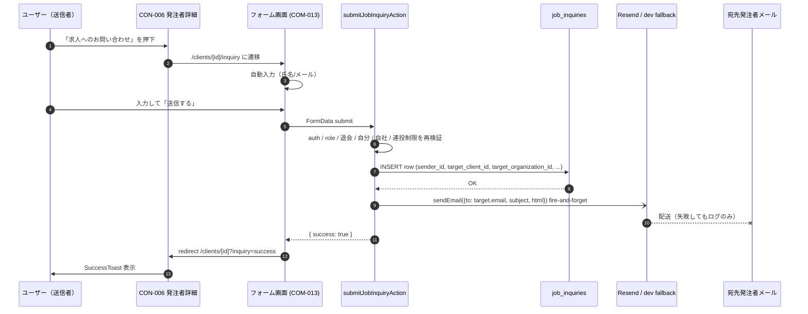

# Technical Design — job-inquiry

## Overview

**Purpose**: 発注者詳細(CON-006)に「求人へのお問い合わせ」ボタンを設置し、ログイン中の受注者・発注者・担当者が宛先発注者宛に最小項目の問い合わせを送れるようにする。問い合わせは発注者のマイページ受信箱と、将来の運営(admin)から閲覧できる。**ビジ友は連絡先＋最小入力の「橋渡し」のみを担い、以降のやり取りは当事者間で直接（メール/既存メッセージ機能）行う。専用の返信・状態管理機能は実装しない。**

**Users**: 送信側は受注者(contractor)・発注者(client)・担当者(staff)。受信側は宛先発注者(client) 本人と所属組織メンバー(法人プランの owner/admin/staff)、および将来 admin 画面実装後の運営。

**Impact**:
- 新規テーブル `job_inquiries` ＋ RLS（SELECT 3条件、INSERT 1条件、UPDATE/DELETE default deny）
- 新規画面3点（フォーム/受信箱一覧/受信箱詳細）と既存画面2点（CON-006/マイページ）への追記
- 新規メールテンプレ1本（`job-inquiry-notification.ts`）
- screen-map.md / tech.md / database-schema.md への追記

### Goals
- 最小構成で「橋渡しのきっかけ作り」を成立させる
- 既存の `trouble-report` / `scout-notification` / `applications/received` パターンに揃え、コードと保守負担を最小化
- 発注者・運営の両方が同じデータを参照できる権限分離

### Non-Goals
- 求人問い合わせ専用のメッセージ・返信機能（既存メッセージで代替）
- 対応済フラグ等の状態管理 UI / DB カラム（YAGNI、後付け可）
- admin 統合管理画面（後日 admin spec で一括）
- 添付ファイル / 確認画面ステップ
- 組織メンバー全員へのメール通知（MVP は宛先 client 本人のみ）

## Architecture

### Existing Architecture Analysis
- App Router (Next.js)。RSC 中心、変更操作は Server Action。Supabase + RLS で 3 層防御。Resend でトランザクションメール
- 直近の `support` spec で同型の「フォーム → admin 限定 SELECT RLS → 添付バケット」を実装済み。本機能はその上に「SELECT を宛先 client と同一組織にも開放」「メール通知 1 通追加」だけ載せる構造
- 個人プラン client・法人プラン client・staff の組織所属判定は `is_same_org(auth.uid(), org_id)` （SECURITY DEFINER 関数）で統一済み

### Architecture Pattern & Boundary Map

```mermaid
graph TB
  subgraph Browser
    CON006[CON-006 発注者詳細<br/>clients/[id]/page.tsx]
    Form[COM-013 フォーム<br/>clients/[id]/inquiry/page.tsx]
    InboxList[COM-014 受信箱一覧<br/>mypage/job-inquiries/page.tsx]
    InboxDetail[COM-015 受信箱詳細<br/>mypage/job-inquiries/[id]/page.tsx]
    MyPage[マイページ<br/>mypage/page.tsx]
  end

  subgraph ServerActions
    SubmitAction[submitJobInquiryAction<br/>actions.ts]
  end

  subgraph Domain
    Schema[jobInquirySchema<br/>validations/job-inquiry.ts]
    Constants[INQUIRY_TOPICS<br/>constants/job-inquiry-options.ts]
    EmailTemplate[jobInquiryNotificationEmail<br/>email/templates]
  end

  subgraph Persistence
    Table[(job_inquiries テーブル)]
    RLS[RLS Policies<br/>SELECT/INSERT only]
  end

  subgraph External
    Resend[Resend API]
    DevFallback[/tmp/bijiyu-dev-mail/]
  end

  CON006 -->|click| Form
  Form -->|submit| SubmitAction
  SubmitAction -->|validate| Schema
  Schema --> Constants
  SubmitAction -->|INSERT| Table
  SubmitAction -->|sendEmail| EmailTemplate
  EmailTemplate -->|HTML| Resend
  EmailTemplate -.dev fallback.-> DevFallback
  Table --> RLS

  MyPage -->|menu link| InboxList
  InboxList -->|SELECT| Table
  InboxList -->|row click| InboxDetail
  InboxDetail -->|SELECT| Table
```

**Architecture Integration**:
- Selected pattern: **既存パターン拡張**（`trouble-report` のフォーム3点セット + `scout-notification` のメール通知 + `messages` の `is_same_org()` SELECT RLS）
- Domain/feature boundaries: フォーム送信は `clients/[id]/inquiry` 配下に閉じ込め、受信箱は `mypage/job-inquiries` 配下に隔離。データ層は単一テーブル
- Existing patterns preserved: ActionResult 型／react-hook-form + Zod + sonner／admin client によるレート制限 COUNT／fire-and-forget メール送信／RSC + Server Action
- New components rationale: 新規アーキ要素は `job_inquiries` テーブルと SELECT 3条件の RLS のみ。それ以外は既存ヘルパ・コンポーネントの組み替え
- Steering compliance: security.md「Server Actions の権限チェック」「メール送信失敗時の共通方針」、CLAUDE.md「UI と Server Action の許可範囲一致」「page.goto 直接遷移だけで E2E を完結させない」「フォーム内ボタン type 明示」を遵守

### Technology Stack

| Layer | Choice / Version | Role in Feature | Notes |
|-------|------------------|-----------------|-------|
| Frontend | Next.js 16 App Router (RSC + Client Components) | フォーム/受信箱の SSR、shadcn/ui コンポーネント | 既存と同じ。新規依存なし |
| Forms | react-hook-form + zodResolver + sonner | クライアント検証＋トースト | 既存パターン流用 |
| Backend | Next.js Server Actions | 送信処理、Zod 再検証、レート制限 | 既存パターン流用 |
| Data | Supabase Postgres + RLS | テーブル＋ポリシー | 新規テーブル `job_inquiries` のみ |
| Email | Resend（dev は `/tmp/bijiyu-dev-mail/` フォールバック） | 宛先発注者へ通知メール | 既存 `sendEmail()` 流用、テンプレ1本新設 |
| Auth/Authz | Supabase Auth + `is_admin()`／`is_same_org()` | 認証＋三重防御 | 既存ヘルパ流用 |

新規外部依存はなし。

## System Flows

### フォーム送信から通知メールまで



**Key Decisions**:
- メール送信は fire-and-forget（`.catch(err => console.error(...))`）。失敗してもロールバックしない（security.md 共通方針）
- 受信箱を真実とし、メールは橋渡しの補助という位置付け
- 成功遷移は CON-006 + クエリパラメータで SuccessToast。フォームに留まらない

### 受信箱閲覧フロー
単純な SSR 2 画面（一覧 → 行クリック → 詳細）。RLS が SELECT 条件を担保するため、UI はクエリ結果を表示するだけ。フロー図は省略。

## Requirements Traceability

| Requirement | Summary | Components | Interfaces | Flows |
|-------------|---------|------------|------------|-------|
| 1.1-1.10 | フォーム表示・自動入力・入力項目 | CON006Button, InquiryFormPage, InquiryForm | jobInquirySchema, INQUIRY_TOPICS | 送信フロー① |
| 2.1-2.9 | 送信・バリデーション・成功遷移 | InquiryForm, submitJobInquiryAction | jobInquirySchema, ActionResult | 送信フロー② |
| 3.1-3.6 | 送信者・宛先のアクセス制御 | CON006Button, InquiryFormPage, submitJobInquiryAction | canSendJobInquiry ロジック | 送信フロー（再検証） |
| 4.1-4.2 | 連投制限 | submitJobInquiryAction | admin client COUNT クエリ | 送信フロー（再検証） |
| 5.1-5.7 | メール通知 | submitJobInquiryAction, jobInquiryNotificationEmail | sendEmail() | 送信フロー③ |
| 6.1-6.7 | 受信箱（一覧・詳細） | MyPageMenu, InboxListPage, InboxDetailPage | RLS SELECT | 受信箱閲覧 |
| 7.1-7.5 | RLS とデータ保護 | job_inquiries テーブル | 5 つの RLS ポリシー | — |
| 8.1-8.3 | admin 向けデータの器 | job_inquiries テーブル | `job_inquiries_select_admin` | — |
| 9.1-9.3 | 戻る動線 | InquiryForm, InboxListPage, InboxDetailPage | BackButton 共通部品 | — |
| 10.1-10.4 | ドキュメント整合 | screen-map.md / tech.md / database-schema.md | — | — |
| 11.1-11.4 | テスト | Vitest / pgTAP / Playwright | — | — |

## Components and Interfaces

### 概要

| Component | Domain/Layer | Intent | Req Coverage | Key Dependencies | Contracts |
|-----------|--------------|--------|--------------|------------------|-----------|
| `job_inquiries` テーブル + RLS | Data | 問い合わせデータの永続化と権限制御 | 2.6, 6.2-6.4, 7.1-7.5, 8.1-8.3 | `users`, `organizations` (P0) | State (DB) |
| `submitJobInquiryAction` | Server Action | 送信時の検証・保存・通知 | 1.10, 2.1-2.9, 3.5-3.6, 4.1-4.2, 5.1-5.6 | Supabase admin client (P0), `sendEmail()` (P1) | Service |
| `jobInquirySchema` | Validation | 共通 Zod スキーマ | 2.2-2.5 | `INQUIRY_TOPICS` (P0) | Service |
| `jobInquiryNotificationEmail` | Email Template | 通知メール HTML 生成 | 5.1-5.3 | `INQUIRY_TOPICS` (P1) | Service |
| `InquiryFormPage` (RSC) | UI | フォーム画面の SSR・自動入力・ガード | 1.1-1.10, 3.1-3.5 | Supabase server client (P0), admin client (P1) | State |
| `InquiryForm` (Client) | UI | フォーム本体、Zod 検証、送信 | 1.6-1.9, 2.1-2.4, 2.7-2.8 | react-hook-form, sonner (P1) | State |
| `CON006InquiryButton` | UI | CON-006 内のボタン表示制御 | 1.1, 3.1-3.4 | canSendJobInquiry (P1) | — |
| `InboxListPage` (RSC) | UI | 受信箱一覧 SSR + 20件ページング | 6.2, 6.3 | Supabase server client (P0) | — |
| `InboxDetailPage` (RSC) | UI | 受信箱詳細 SSR | 6.4, 6.6 | Supabase server client (P0) | — |
| `MyPageMenuItem` | UI 追記 | マイページに導線追加 | 6.1, 10.4 | 既存 `MenuList` (P2) | — |
| `SuccessToast` | UI | 成功時 redirect 先で表示 | 2.7 | sonner (P2) | — |

### Data

#### `job_inquiries` テーブルと RLS

| Field | Detail |
|-------|--------|
| Intent | 問い合わせデータを保存し、送信者・宛先・運営の各観点で適切に SELECT/INSERT 権限を制御する |
| Requirements | 2.6, 6.2-6.4, 7.1-7.5, 8.1-8.3 |

**Responsibilities & Constraints**:
- 行は永続。論理削除も状態フラグも持たない（最小構成）
- `target_organization_id` を denormalize で保持（INSERT 時にサーバーが解決）
- UPDATE / DELETE は一般ユーザー禁止（admin client / バックエンドのみ）

**Dependencies**:
- Outbound: `users` テーブル (P0) — sender_id / target_client_id の FK
- Outbound: `organizations` テーブル (P0) — target_organization_id の FK
- External: `is_same_org()`, `is_admin()` SECURITY DEFINER 関数 (P0)

**Contracts**: ☑ State (DB)

##### State Management

- State model: 不変レコード（INSERT のみ）。状態遷移なし
- Persistence & consistency: 単一テーブル、トランザクション境界は INSERT 1 操作のみ
- Concurrency strategy: なし（連投制限のみサーバー側 COUNT で防御）

**Implementation Notes**:
- Integration: migration 1 本で完結。`(sender_id, created_at)` インデックスを追加（連投 COUNT 高速化）
- Validation: NOT NULL 制約は `sender_id` を除く必須項目に設定。`sender_id` は ON DELETE SET NULL で送信者退会後も記録保持
- Risks: `target_organization_id` の denormalize が古くなる可能性（Owner 交代時）。運用での対処を前提

### Server Action

#### `submitJobInquiryAction`

| Field | Detail |
|-------|--------|
| Intent | フォーム送信時に検証・連投制限・保存・通知をまとめて実行する |
| Requirements | 1.10, 2.1-2.9, 3.5-3.6, 4.1-4.2, 5.1-5.6 |

**Responsibilities & Constraints**:
- 認証・ロール・宛先妥当性・自分宛・自社宛・連投制限の全ガードを実行
- INSERT 成功後に通知メールを fire-and-forget で送る（失敗してもロールバックしない）
- ActionResult を返してフォームに結果を伝える

**Dependencies**:
- Inbound: `InquiryForm` (P0) — FormData を渡す
- Outbound: Supabase admin client (P0) — 宛先 client lookup、連投 COUNT、INSERT
- Outbound: `sendEmail()` (P1) — メール送信ラッパー
- External: Resend API (P1) — 本番でのみ呼ばれる

**Contracts**: ☑ Service

##### Service Interface

```typescript
type SubmitJobInquiryInput = {
  targetClientId: string;
};

type ActionResult<T = void> =
  | { success: true; data?: T }
  | { success: false; error: string };

export async function submitJobInquiryAction(
  targetClientId: string,
  formData: FormData,
): Promise<ActionResult>;
```

- Preconditions:
  - クライアント側でユーザーは認証済み（Middleware 経由）
  - `formData` に `name` / `email` / `topics` / `content` を含む
- Postconditions:
  - 成功時: `job_inquiries` に行が1つ追加され、宛先 client にメールが送信される（メール失敗はログのみ）
  - 失敗時: 行は追加されず、`{ success: false, error }` を返す
- Invariants:
  - sender_id === auth.uid()
  - target_client_id !== auth.uid()
  - sender と target が同一 organization に属さない
  - target は退会済みでない
  - 直近1時間の sender の問い合わせ件数 < 5

**Implementation Notes**:
- Integration:
  - 1) `createClient()` で認証ユーザー取得 → 未認証は拒否
  - 2) `userData.role !== 'admin'` を確認（admin は禁止）
  - 3) `createAdminClient()` で target client を取得（deleted_at, organization_id）
  - 4) アクセスガード（self/deleted/same-org）
  - 5) `jobInquirySchema.safeParse(formData)` でサーバー側再検証
  - 6) admin client で `count` クエリ（`sender_id = user.id` AND `created_at > now() - 1 hour`）
  - 7) admin client で INSERT（`target_organization_id` も同時に保存）
  - 8) `sendEmail({ to: target.email, ... }).catch(err => console.error(...))` を fire-and-forget
- Validation:
  - フォーム内ボタンは `type="submit"` を明示（CLAUDE.md ルール）
  - Zod の `.uuid()` は seed の非標準 UUID で弾かれる事例あり（[[project_zod_uuid_seed_workaround]]）。`targetClientId` は正規表現緩和を検討
- Risks:
  - admin client の使い過ぎはレビュー時に懸念されやすい。cross-user 参照と RLS で SELECT 不可な行の COUNT のみに限定する

### Validation

#### `jobInquirySchema`

```typescript
import { z } from "zod";
import { INQUIRY_TOPICS } from "@/lib/constants/job-inquiry-options";

export const jobInquirySchema = z.object({
  name: z
    .string()
    .min(1, "氏名を入力してください")
    .max(100, "氏名は100文字以内で入力してください"),
  email: z
    .string()
    .min(1, "メールアドレスを入力してください")
    .email("メールアドレスの形式が正しくありません"),
  topics: z
    .array(z.enum(INQUIRY_TOPICS))
    .min(1, "お問い合わせ項目を選択してください"),
  content: z
    .string()
    .max(2000, "お問い合わせ内容は2000文字以内で入力してください")
    .optional()
    .default(""),
});

export type JobInquiryInput = z.infer<typeof jobInquirySchema>;
```

- 文字数上限は trouble-report / contact と揃える（content 2000字、name 100字）

### Email Template

#### `jobInquiryNotificationEmail`

```typescript
interface JobInquiryNotificationEmailProps {
  recipientName: string;   // 宛先発注者の表示名
  senderName: string;      // フォーム入力の氏名
  senderEmail: string;     // フォーム入力のメール
  topics: string[];        // 選択された項目ラベル
  content: string;         // 任意の本文（未入力時は "（未入力）" 等）
  inboxUrl: string;        // 受信箱詳細 URL（または一覧 URL）
  serviceUrl: string;      // ビジ友トップ URL
}

export function jobInquiryNotificationEmail(
  props: JobInquiryNotificationEmailProps,
): { subject: string; html: string };
```

- Subject: `【ビジ友】求人へのお問い合わせを受信しました - ${senderName}`
- 構造は `scout-notification.ts` の HTML テーブルレイアウトを踏襲（ヘッダー色 #920783、CTA ピル、フッター）
- 本文の CTA は「受信箱で確認する」（`inboxUrl` への遷移）

### Constants

#### `INQUIRY_TOPICS`

```typescript
export const INQUIRY_TOPICS = [
  "求人について話を聞きたい",
  "求人に応募したい",
  "その他",
] as const;

export type InquiryTopic = typeof INQUIRY_TOPICS[number];
```

- マスタ化しない（trouble-report / contact 同様、コード定数で運用）

### UI

#### `CON006InquiryButton` (Summary)

CON-006 (`clients/[id]/page.tsx`) の既存「メッセージを送る」ボタンの並びに追加。表示条件は次の AND が全て true:
- `!isDeleted`（対象 client が退会していない）
- `client.id !== user.id`（自分自身でない）
- `!isSameOrgAsTarget`（自社の発注者でない＝viewer の organization と target.organization_id が一致しない）
- `userData.role !== 'admin'`（admin でない）

ボタンスタイル: 紫ピル `bg-primary text-primary-foreground rounded-[47px]`。`asChild` + `<Link href={\`/clients/${id}/inquiry\`}>` で遷移。

**Implementation Note**: 表示条件のロジックは **`src/lib/job-inquiry/access-guard.ts`** に `canSendJobInquiry({ viewer, target }): { ok: true } | { ok: false; reason: 'deleted' | 'self' | 'same_org' | 'admin' }` として切り出し、**CON-006 のボタン表示判定と Server Action のガード判定の両方が同じ関数を呼ぶ**ことを必須とする（CLAUDE.md「UI と Server Action の許可範囲一致」）。判定に必要な情報（viewer 側の `users.role` / `organization_members.organization_id`、target 側の `users.deleted_at` / `organizations.id`）は呼び出し側で取得して構造化された値で渡し、ヘルパ自体は DB アクセスを行わない純粋関数とする（テスタビリティ確保）。

#### `InquiryFormPage` (RSC, full block)

| Field | Detail |
|-------|--------|
| Intent | フォームの SSR、自動入力、アクセスガード、未許可時のリダイレクト |
| Requirements | 1.1-1.5, 3.1-3.5 |

**Responsibilities & Constraints**:
- パスは `/clients/[id]/inquiry`
- 認証ユーザーから `users.last_name + first_name`（スペース無し）と `auth.users.email` を取得
- 宛先 client を取得（公開 SELECT で可）し、表示名は `resolveParticipantName()` で解決
- ガード（self / deleted / same-org / admin）違反は `notFound()` または `redirect("/clients/[id]")`
- `InquiryForm` に `defaultName` / `defaultEmail` / `targetClientId` / `targetDisplayName` を props で渡す

**Dependencies**:
- Outbound: Supabase server client (P0) — 認証＋宛先 client lookup
- Outbound: Supabase admin client (P1) — `is_same_org` 判定用に target の organization_id を取得（必要な場合）

**Contracts**: ☑ State

**Implementation Notes**:
- Integration: `trouble-report/page.tsx` の構造に倣う
- Validation: 同じガードを Server Action 側でも再実行する
- Risks: 個人プラン client は organization を持たない（または single-member org）。`is_same_org()` は false を返すため、ガードが意図通り動作する

#### `InquiryForm` (Client, full block)

| Field | Detail |
|-------|--------|
| Intent | フォーム本体。クライアント検証＋送信＋エラー表示 |
| Requirements | 1.6-1.9, 2.1-2.4, 2.7-2.8 |

**Responsibilities & Constraints**:
- react-hook-form + zodResolver(jobInquirySchema)
- `defaultValues` で氏名・メール初期化
- お問い合わせ項目はチェックボックス3個（複数選択）。`watch("topics")` で配列を管理
- 「送信する」ボタンは `type="submit"`、「もどる」は `type="button"`（BackButton 内）
- 送信成功時は `router.push(\`/clients/${targetClientId}?inquiry=success\`)`
- 失敗時は `toast.error(result.error)`

**Dependencies**:
- Inbound: `InquiryFormPage` (P0) — props 渡し
- Outbound: `submitJobInquiryAction` (P0) — FormData 送信
- External: shadcn/ui `Checkbox`, `Input`, `Textarea`, sonner (P1)

**Contracts**: ☑ State

**Implementation Notes**:
- Integration: `trouble-report-form.tsx` の構造を流用し、添付関連を全削除、Select を Checkbox 群に差し替え
- Validation: react-hook-form 初期値同期前に `.fill("")` しない（CLAUDE.md E2E ルール）
- Risks: Checkbox 群のクライアント検証は `setValue("topics", ...)` でフォーム state に反映。E2E では `getByRole("checkbox", { name: ... })` で操作

#### `InboxListPage` (RSC, Summary)

`/mypage/job-inquiries`。SSR で `job_inquiries` を SELECT。20件ページング（`ITEMS_PER_PAGE = 20`、`from / to` + `count: 'exact'` の2クエリ）。RLS が「宛先 client または同一組織メンバー」のみを返すため、UI 側で追加フィルタは不要。各行: 受信日時、送信者氏名、お問い合わせ項目（カンマ区切り、長い場合は省略）。行クリックで `/mypage/job-inquiries/[id]` へ遷移。

**Implementation Note**: `applications/received/page.tsx` のページング・カードレイアウトを参照。ステータスフィルタ・ソート UI は無し。

#### `InboxDetailPage` (RSC, Summary)

`/mypage/job-inquiries/[id]`。SSR で行を1件 SELECT。表示: 受信日時、送信者氏名、メールアドレス、お問い合わせ項目、お問い合わせ内容。**独立した「返信する」ボタンや案内文は置かない**（お問い合わせ・トラブル報告と同じ「保存して読む」だけの最小構成）。送信者メールアドレスは `<a href={\`mailto:${row.email}\`}>` の標準的なハイパーリンクとして表示し、クリックでメーラー起動／長押し（モバイル）やマウス選択でコピーが自然にできる状態にする。下部に BackButton。

**Implementation Note**: 行が存在しない（RLS で見えない場合も含む）は `notFound()`。

#### `MyPageMenuItem` (Summary)

`mypage/page.tsx` の `MANAGE_ORDERS_MENU` に1行追加:
```typescript
{ label: "求人へのお問い合わせ", href: "/mypage/job-inquiries" },
```

**表示対象**: 宛先発注者となりうるロール = **Owner（管理責任者）／組織管理者／担当者（staff）の全員**に表示する。受信箱が組織共有のため、法人プランの担当者にも受信箱への入口が見える必要がある（Req 6.7「Owner / 組織管理者 / 担当者の全員に閲覧を許可する」と整合）。受注者専用（contractor）のマイページには表示しない。実装上は `MANAGE_ORDERS_MENU` の既存可視性ルール（client / org メンバーで表示）を踏襲する。

#### `SuccessToast` (Summary)

クライアントコンポーネント。`searchParams.get("inquiry") === "success"` を検出すると `toast.success("問い合わせを送信しました")` を呼び、`router.replace(pathname)` でクエリパラメータを除去。`applications/received/success-toast.tsx` 等の既存パターンが流用可能なら reuse。

## Data Models

### Domain Model

**Aggregate**: `JobInquiry`（不変イベントレコード。Aggregate Root 自身）

**Entities / Value Objects**:
- `JobInquiry`: 1件の問い合わせ。id, sender_id, target_client_id, target_organization_id?, name, email, topics, content, created_at
- `InquiryTopic`: 値オブジェクト。3つの固定ラベルのいずれか

**Business Rules / Invariants**:
- INSERT 時のみ存在し、以後変更されない（admin の物理削除を除く）
- sender_id ≠ target_client_id
- sender と target は異なる organization に属する（または target は organization を持たない個人プラン）
- 直近1時間の同 sender の件数 < 5

### Physical Data Model

#### `job_inquiries` テーブル定義

```sql
CREATE TABLE job_inquiries (
  id uuid PRIMARY KEY DEFAULT gen_random_uuid(),
  -- 送信者（認証ユーザー）。退会時は NULL 化して記録は残す
  sender_id uuid REFERENCES users(id) ON DELETE SET NULL,
  -- 宛先発注者（client role）。退会時は NULL 化して記録は残す
  target_client_id uuid REFERENCES users(id) ON DELETE SET NULL,
  -- 宛先発注者の組織（is_same_org() RLS 用に denormalize）。個人プランは NULL
  target_organization_id uuid REFERENCES organizations(id) ON DELETE SET NULL,
  -- フォーム入力値（編集後の値）
  name text NOT NULL,
  email text NOT NULL,
  topics text[] NOT NULL CHECK (array_length(topics, 1) >= 1),
  content text NOT NULL DEFAULT '',
  created_at timestamptz NOT NULL DEFAULT now()
);

-- 連投制限 COUNT の高速化
CREATE INDEX job_inquiries_sender_id_created_at_idx
  ON job_inquiries (sender_id, created_at DESC);

-- 受信箱一覧の高速化
CREATE INDEX job_inquiries_target_client_id_created_at_idx
  ON job_inquiries (target_client_id, created_at DESC);

-- 組織メンバー受信箱の高速化
CREATE INDEX job_inquiries_target_organization_id_created_at_idx
  ON job_inquiries (target_organization_id, created_at DESC)
  WHERE target_organization_id IS NOT NULL;
```

#### RLS ポリシー

```sql
ALTER TABLE job_inquiries ENABLE ROW LEVEL SECURITY;

-- SELECT: admin
CREATE POLICY "job_inquiries_select_admin" ON job_inquiries
  FOR SELECT TO authenticated
  USING (is_admin(auth.uid()));

-- SELECT: 宛先 client 本人
CREATE POLICY "job_inquiries_select_target" ON job_inquiries
  FOR SELECT TO authenticated
  USING (target_client_id = auth.uid());

-- SELECT: 宛先 client の組織メンバー（法人プラン）
CREATE POLICY "job_inquiries_select_org_member" ON job_inquiries
  FOR SELECT TO authenticated
  USING (
    target_organization_id IS NOT NULL
    AND is_same_org(auth.uid(), target_organization_id)
  );

-- INSERT: 認証済み + sender = self
CREATE POLICY "job_inquiries_insert_own" ON job_inquiries
  FOR INSERT TO authenticated
  WITH CHECK (sender_id = auth.uid());

-- UPDATE / DELETE: ポリシー無し = default deny
```

**Notes**:
- PERMISSIVE な複数 SELECT ポリシーは OR で結合される
- `is_same_org()` は SECURITY DEFINER 関数で `organization_members` の RLS をバイパスする（既存）
- `is_admin()` も SECURITY DEFINER 関数（既存）

### Data Contracts & Integration

- INSERT 時の `target_organization_id` 解決ロジック:
  1. `organizations.owner_id = target_client_id` で SELECT
  2. 見つかれば `organizations.id` を保存、見つからなければ NULL
- email 通知の宛先解決:
  - `auth.users.email`（admin client で取得）
  - メール変更未確認時の `email_change` は無視（Supabase は確認後に email を上書きする）

## Error Handling

### Error Strategy

| カテゴリ | 例 | 対応 |
|---|---|---|
| User Errors (4xx 相当) | 必須未入力、メール形式不正、項目未選択 | フォームにエラー表示 + 入力維持 |
| Auth/Authz Errors | 未ログイン、admin、自分宛、自社宛、退会済み宛 | Server Action から `{ success: false, error }` ／ ページ層は `notFound()` / `redirect()` |
| Rate Limit | 1時間5件超過 | 「送信回数の上限に達しました...」トースト |
| System Errors | DB / admin client 失敗 | 汎用「送信中にエラーが発生しました...」トースト + サーバーログ |
| Email Failure | Resend エラー | ログのみ、本体処理は成功扱い |

### Error Categories and Responses
- **User Errors**: Zod の field レベルメッセージを `errors.[field].message` で表示。`toast.error(result.error)` は不要（フォーム内表示で代替）
- **Auth/Authz Errors**: 想定外のシナリオはエラー詳細を漏らさず汎用文言で返す（security.md）
- **Rate Limit**: 文言は `trouble-report` と統一
- **Business Logic Errors**: 自分宛・自社宛は「対象の発注者には送信できません」等の汎用文言

### Monitoring
- `console.error("[submitJobInquiryAction] ...", err)` で全失敗をログ。Vercel ログから追跡可能（既存と同じ）
- audit_logs テーブルへの追加記録はスコープ外（必要になれば後追加）

## Testing Strategy

### Unit Tests (Vitest)
- `submitJobInquiryAction`: 正常系 / 必須未入力 / メール形式不正 / 項目未選択 / 自分宛 / 自社宛 / 退会済み宛 / admin 送信試行 / 連投制限超過
- `jobInquirySchema`: 各バリデーションメッセージの確認
- メールテンプレ: subject / html に必要な情報が含まれているかのスナップショット

### Integration Tests (pgTAP)
- RLS SELECT: admin / 宛先 client / 同一組織メンバー / 第三者（contractor、別組織 client、staff 別組織）の見え方
- RLS INSERT: 自分以外を sender_id にした行を弾く
- RLS UPDATE / DELETE: 一般ユーザーから不可（admin client のみ可能）
- 個人プラン client（`target_organization_id IS NULL`）でも宛先本人だけが SELECT 可能であること

### E2E Tests (Playwright)
- 受注者 → CON-006 から「求人へのお問い合わせ」を押す → フォーム入力 → 送信 → CON-006 で完了トースト
- 発注者ログイン → マイページから受信箱 → 行クリックで詳細 → 内容と補助リンクが表示される
- 法人プランの担当者ログイン → 受信箱で同じ問い合わせが見える
- 自社発注者の CON-006 ではボタンが表示されないこと
- 連投制限到達時にエラートーストが出ること
- 起点は `page.goto()` 直接遷移だけでなく、ログイン → マイページ → CON-006 → ボタン押下の通し導線も含める（CLAUDE.md ルール）

## Security Considerations

- **三重防御**: Middleware（認証）→ Server Action（ロール/宛先/連投制限）→ RLS（行レベル）の3層
- **送信者の SELECT 不許可**: sender 自身は自分が送った行を SELECT できない（admin の透明性確保のため）。レート制限の COUNT は admin client で実施
- **admin 操作経路**: `service_role` キーは Server Action / Edge Function からのみ使用（既存ルール）
- **email 経由の情報露出**: 通知メールには宛先 client の登録メールアドレスを使う。送信者のメールは内容に含まれるが、これは本人が入力した値であり、橋渡し目的で開示する設計
- **PII**: 受信箱画面のリスト一覧では送信者のメールアドレスは出さない（詳細画面のみ）

## Supporting References

- `.kiro/specs/job-inquiry/research.md` — 設計判断の調査ログ
- `.kiro/specs/job-inquiry/gap-analysis.md` — 既存資産マップ
- `.kiro/specs/support/requirements.md` / `design.md` — 兄弟仕様のパターン参照元
- `.kiro/steering/database-schema.md` — 「主要テーブル別ポリシー」追記対象
- `.kiro/steering/screen-map.md` — COM-013 / COM-014 / COM-015 追記対象
- `.kiro/steering/tech.md` — 「メール種別と送信トリガー」表追記対象
