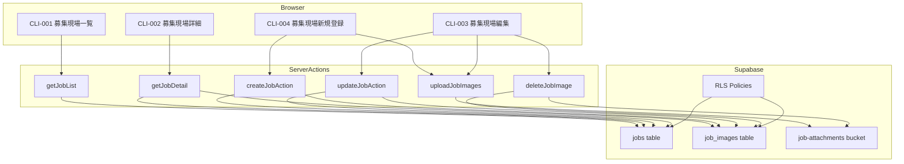
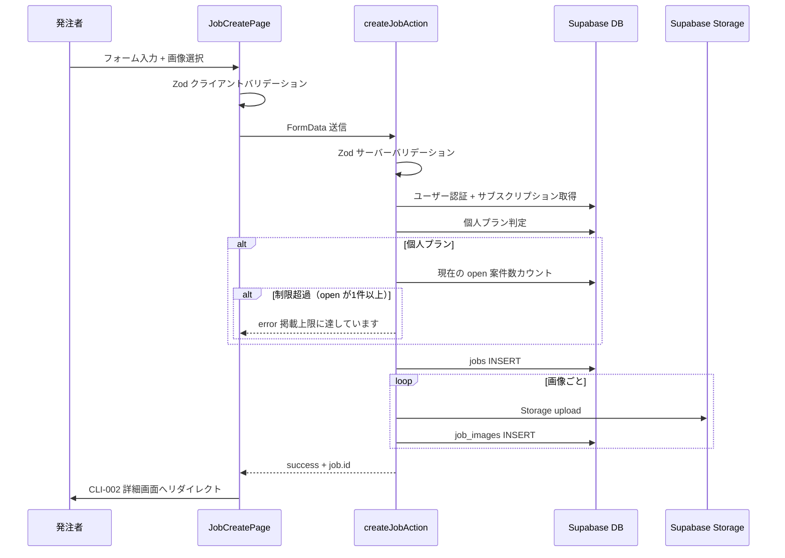
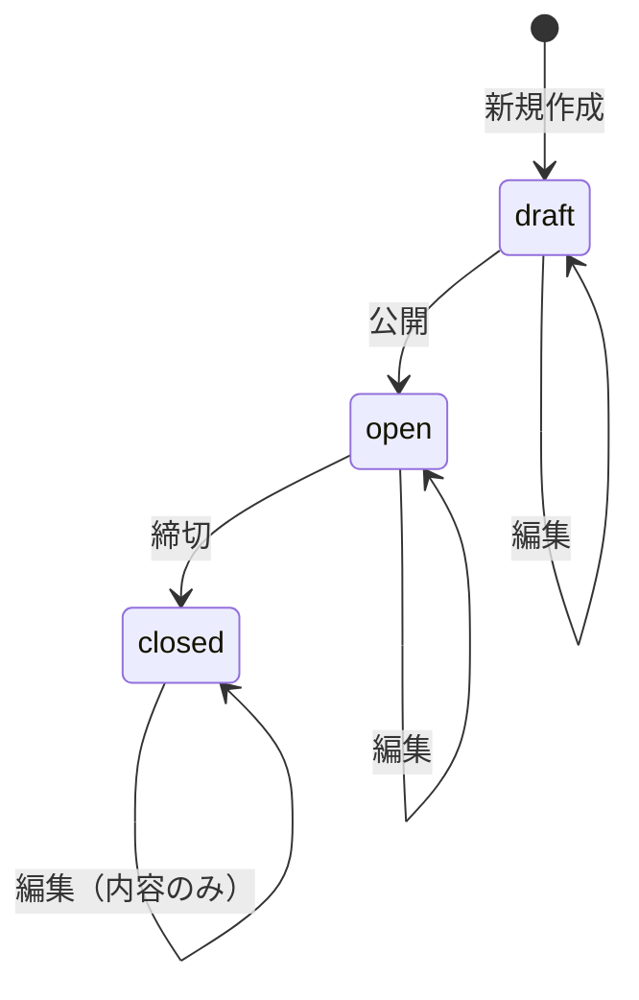

# 案件掲載機能（job-posting）— 技術設計書

## Overview

**Purpose**: 発注者（Client）が募集現場（案件）を作成・編集・管理するための CRUD 機能を提供する。
**Users**: 発注者（個人・法人プラン）および担当者（Staff）が案件の掲載・管理ワークフローで利用する。
**Impact**: 4画面（CLI-001〜CLI-004）を新規追加し、既存の認証・プラン管理基盤と統合する。

### Goals
- 案件の新規作成・編集・一覧表示・詳細表示の完全な CRUD 機能
- 個人プランの月次掲載制限（1件/月）の Server Action レベルでの強制
- 画像・書類の Supabase Storage アップロード（job-attachments バケット）
- 法人プランにおける組織内案件の統合管理

### 画面遷移の設計方針（CON-003 と CLI-002 の区別）

ビジ友では同じ案件ID（`/jobs/[id]`）に対して、2つの異なる画面が存在する:

- **CON-003（募集案件詳細）**: 案件を閲覧・応募するための画面。受注者・発注者・担当者すべてが利用する
- **CLI-002（募集現場詳細）**: 自分（または同一組織メンバー）が掲載した案件を管理するための画面。発注者・担当者のみが利用する

この区別は URL のクエリパラメータ `?manage=true` で制御する:
- CLI-001（募集現場一覧）からのリンク: `/jobs/${job.id}?manage=true` → CLI-002 を表示
- CON-002（募集案件一覧）からのリンク: `/jobs/${job.id}`（パラメータなし）→ CON-003 を表示
- `/jobs/[id]` ページの表示分岐: `(isOwner || isSameOrganization) && searchParams.manage === 'true'` のときのみ CLI-002、それ以外は CON-003

**発注者アカウントの画面構造:**
発注者は受注者機能（エリア等の制限なし）に加えて発注者機能が開放される構造であるため:
- 「仕事を探す」セクション → 「募集案件一覧」（CON-002）「発注者一覧」（CON-005）= 受注者と同じ画面
- 「発注先を管理する」セクション → 「募集現場一覧」（CLI-001）= 自分の掲載案件の管理画面

発注者が CON-002 経由で案件にアクセスした場合は、常に CON-003（閲覧・応募画面）を表示すること。CLI-002（管理画面）は CLI-001 経由のアクセスでのみ表示する。

### Non-Goals
- 受注者（Contractor）向けの案件検索・閲覧機能（別 spec: job-search）
- 応募管理機能（CLI-005〜CLI-007 は別 spec）
- 案件の公開/非公開の自動スケジューリング
- 急募オプションの購入フロー（billing spec で対応）

## Architecture

### Existing Architecture Analysis

既存の認証済みエリア（`src/app/(authenticated)/`）のパターンを踏襲する:
- Server Components によるデータフェッチ（layout.tsx でユーザー・サブスクリプション情報を取得済み）
- Server Actions（`actions.ts`）による書き込み操作 + `ActionResult<T>` 型
- react-hook-form + Zod による双方向バリデーション
- Supabase Storage による画像管理（avatars バケットのパターンを踏襲）

既存の Middleware は `/jobs/create` と `/jobs/edit` を client/staff 専用ルートとして制御済み。

### Architecture Pattern & Boundary Map



**Architecture Integration**:
- **Selected pattern**: Next.js App Router + Server Actions（既存パターン踏襲）
- **Domain boundaries**: 案件 CRUD は Server Actions に集約。画像管理は別 Action に分離
- **Existing patterns preserved**: ActionResult 型、FormData 受け渡し、Zod バリデーション
- **New components**: 案件フォーム、一覧・詳細の UI コンポーネント
- **Steering compliance**: structure.md のディレクトリ規則、security.md のファイルアップロード方針に準拠

### Technology Stack

| Layer | Choice / Version | Role in Feature | Notes |
|-------|------------------|-----------------|-------|
| Frontend | Next.js App Router + React 19 | SSR ページ + Client フォーム | 既存構成 |
| Form | react-hook-form + zodResolver | フォームバリデーション + 状態管理 | 既存パターン |
| Backend | Next.js Server Actions | CRUD 操作 + プラン制限チェック | ActionResult パターン |
| Data | Supabase PostgreSQL | jobs / job_images テーブル | マイグレーション済み |
| Storage | Supabase Storage | job-attachments バケット | 新規バケット作成が必要 |
| Validation | Zod | クライアント + サーバー双方向 | 既存パターン |
| UI | shadcn/ui + Tailwind CSS | フォーム・テーブル・カード | design-rule.md 準拠 |

## System Flows

### 案件新規作成フロー（プラン制限チェック付き）



### 案件ステータス遷移



## Requirements Traceability

| Requirement | Summary | Components | Interfaces | Flows |
|-------------|---------|------------|------------|-------|
| REQ-JP-001 | 募集現場一覧 | JobListPage, JobListTable | getJobList | 一覧取得 |
| REQ-JP-002 | 募集現場詳細 | JobDetailPage, JobDetailView | getJobDetail | 詳細取得 |
| REQ-JP-003 | 募集現場編集 | JobEditPage, JobForm | updateJobAction, uploadJobImages, deleteJobImage | 更新フロー |
| REQ-JP-004 | 募集現場新規登録 | JobCreatePage, JobForm | createJobAction, uploadJobImages | 作成フロー |

## Components and Interfaces

| Component | Domain/Layer | Intent | Req Coverage | Key Dependencies | Contracts |
|-----------|-------------|--------|--------------|------------------|-----------|
| JobListPage | UI / Page | 案件一覧の Server Component | REQ-JP-001 | Supabase client (P0) | - |
| JobListTable | UI / Client | 案件一覧テーブル + ページネーション | REQ-JP-001 | JobListPage props (P0) | State |
| JobDetailPage | UI / Page | 案件詳細の Server Component（CLI-002 は CON-003 と同じ DetailRow スタイルを採用） | REQ-JP-002 | Supabase client (P0) | - |
| JobDetailView | UI / Presentational | 案件詳細の表示コンポーネント | REQ-JP-002 | JobDetailPage props (P0) | - |
| JobCreatePage | UI / Page | 新規登録ページ（copyFrom クエリパラメータによるコピー機能対応） | REQ-JP-004 | JobForm (P0), Supabase client (P0) | - |
| JobEditPage | UI / Page | 編集ページ（既存データプリフィル） | REQ-JP-003 | JobForm (P0), Supabase client (P0) | - |
| JobForm | UI / Client | 案件入力フォーム（作成・編集共用） | REQ-JP-003, REQ-JP-004 | react-hook-form (P0), Zod (P0) | State |
| JobImageUploader | UI / Client | 画像アップロード・プレビュー・削除 | REQ-JP-003, REQ-JP-004 | JobForm (P0) | State |
| createJobAction | Server Action | 案件新規作成 + プラン制限チェック | REQ-JP-004 | Supabase (P0) | Service |
| updateJobAction | Server Action | 案件更新 | REQ-JP-003 | Supabase (P0) | Service |
| uploadJobImages | Server Action | 画像アップロード | REQ-JP-003, REQ-JP-004 | Supabase Storage (P0) | Service |
| deleteJobImage | Server Action | 画像削除 | REQ-JP-003 | Supabase Storage (P0) | Service |
| jobSchema | Validation | 案件 Zod スキーマ | REQ-JP-003, REQ-JP-004 | Zod (P0) | - |

### UI Layer

#### JobListPage

| Field | Detail |
|-------|--------|
| Intent | 自分（または組織）の案件一覧を取得・表示する Server Component |
| Requirements | REQ-JP-001 |

**Responsibilities & Constraints**
- Server Component として Supabase から案件一覧を取得
- ページネーション（20件/ページ）をクエリパラメータで制御
- 法人プランの場合は組織内全案件を取得（作成者名を付記）

**Implementation Notes**
- データ取得: `supabase.from("jobs").select("*, users!owner_id(display_name)").eq("deleted_at", null).order("created_at", { ascending: false }).range(offset, offset + 19)`
- 法人判定: layout から渡されるユーザー情報の organization_id の有無で分岐
- 「新規登録」ボタン → `/jobs/create` へ遷移
- 各案件カードのリンク先: `/jobs/${job.id}?manage=true` → CLI-002（管理画面）へ遷移

#### JobDetailPage（CLI-002 管理ビュー）

| Field | Detail |
|-------|--------|
| Intent | 自分（または同一組織）の案件の詳細を表示・管理する Server Component。CON-003 と同じ DetailRow スタイルを採用 |
| Requirements | REQ-JP-002 |

**Responsibilities & Constraints**
- `/jobs/[id]?manage=true` でアクセスした場合にのみ表示（(isOwner || isSameOrganization) && isManageView）
- CON-003（募集案件詳細）と同じ DetailRow コンポーネント + セクション分割スタイルを使用する
- 全フィールドに `alwaysShow` を適用し、値が空の場合も項目名と「—」を表示する

**Implementation Notes**
- レイアウト構成（上から順）:
  1. ヘッダー（「募集現場詳細」+ 掲載中の場合「掲載を終了する」ボタン（CloseJobButton クライアントコンポーネント、確認ダイアログ付き、closeJobAction を呼び出し））
  2. ステータスバッジ + 急募バッジ（option_subscriptions 参照）
  3. 画像エリア（job_images。画像なしの場合はプレースホルダー表示）
  4. タイトル + 会社名（users.company_name）
  5. アクションボタン上部（「応募者をみる」outline / 「編集する」primary — 同幅・中央配置）
  6. 条件セクション — DetailRow（alwaysShow）形式: 報酬、エリア、住所、募集職種、募集人数、現場工期、募集期間、稼働時間、締め切り、経験年数、必須スキル、国籍・言語、持ち物
  7. 業務内容セクション — スケジュール詳細、請負案件詳細（ラベル + 本文の縦並び）
  8. 発注者からのメッセージセクション — border 枠付きカード
  9. アクションボタン下部（上部と同じ「応募者をみる」「編集する」を再配置 — 同幅・中央配置）
  10. 「コピーして新規作成する」ボタン（primary カプセル型）と「もどる」ボタン（outline カプセル型）— 同幅・縦並び中央配置

#### JobCreatePage（CLI-004 新規登録 + コピー機能）

| Field | Detail |
|-------|--------|
| Intent | 新規案件の作成ページ。copyFrom クエリパラメータによる既存案件のコピー機能を提供 |
| Requirements | REQ-JP-004 |

**Responsibilities & Constraints**
- `searchParams` から `copyFrom`（コピー元案件ID）を取得する
- `copyFrom` が指定されている場合、Supabase からコピー元案件データを取得し `defaultValues` にマッピングして JobForm に渡す
- コピー時の注意: 日付フィールド（工期・募集期間）は空にする。ステータスは常に `"draft"` で初期化。画像はコピーしない

**Implementation Notes**
- コピー元データのマッピング: edit ページと同じフィールドマッピングを使用するが、以下のフィールドは空にする:
  - `workStartDate`, `workEndDate`, `recruitStartDate`, `recruitEndDate` → `""`
  - `status` → `"draft"`
- `copyFrom` が指定されていない場合は従来通り空のフォームを表示する

#### JobForm（作成・編集共用）

| Field | Detail |
|-------|--------|
| Intent | 案件の入力フォーム。新規作成と編集で共用 |
| Requirements | REQ-JP-003, REQ-JP-004 |

**Responsibilities & Constraints**
- `"use client"` コンポーネント
- react-hook-form + zodResolver で入力管理（`shouldFocusError: true` でエラー箇所に自動スクロール）
- 編集モードでは既存データをデフォルト値としてプリフィル
- セクション分割でフォームの見やすさを確保（基本情報 / 勤務条件 / 詳細情報 / 画像）
- ボタン構成:
  - 新規作成（create）: 「公開する」（`type="button"`, handlePublish で handleSubmit → status = "open"）+ 「下書き保存」（`type="button"`, handleSaveAsDraft でバリデーションスキップ → status = "draft"）
  - 下書き編集（edit + draft）: 「公開する」+ 「下書き保存」（新規作成と同じ構成）
  - 公開中の編集（edit + 非draft）: 「更新する」（`type="submit"`, 通常のフォーム送信）
- 「公開する」ボタン押下時にバリデーションエラーがある場合、トーストで具体的なエラーフィールドを通知する

**Dependencies**
- Inbound: JobCreatePage / JobEditPage — 初期データとモード指定 (P0)
- Outbound: createJobAction / updateJobAction — フォーム送信 (P0)
- Outbound: JobImageUploader — 画像管理 (P1)

**Contracts**: State [x]

##### State Management
- State model: react-hook-form の useForm + useFieldArray（画像リスト）
- Persistence: フォーム送信時に Server Action 経由で DB 保存
- UI state: `useTransition` で送信中の pending 状態を管理

```typescript
interface JobFormProps {
  mode: "create" | "edit";
  defaultValues?: Partial<JobFormValues>;
  existingImages?: JobImage[];
}

interface JobFormValues {
  title: string;
  description: string;
  tradeType: string;
  rewardLower: number;
  rewardUpper: number;
  prefecture: string;
  address: string;
  workStartDate: string;
  workEndDate: string;
  recruitStartDate: string;
  recruitEndDate: string;
  headcount: number;
  workHours: string;
  experienceYears: string;
  requiredSkills: string;
  nationalityLanguage: string;
  items: string;
  scheduleDetail: string;
  projectDetails: string;
  ownerMessage: string;
  status: "draft" | "open" | "closed";
  images: File[];
}

interface JobImage {
  id: string;
  imageUrl: string;
  imageType: string;
  sortOrder: number;
}
```

#### JobImageUploader

| Field | Detail |
|-------|--------|
| Intent | 画像の選択・プレビュー・並び替え・削除を管理する |
| Requirements | REQ-JP-003, REQ-JP-004 |

**Responsibilities & Constraints**
- ファイル選択（複数可）、プレビュー表示、削除
- 編集モードでは既存画像の表示 + 新規追加 + 既存画像の削除
- JPEG/PNG のみ、10MB/枚、1案件あたり最大10枚の制限をクライアント側でバリデーション
- 既存画像 + 新規追加の合計が10枚を超える場合はエラー表示

**Implementation Notes**
- ファイル選択: `<input type="file" accept="image/jpeg,image/png" multiple />`
- プレビュー: `URL.createObjectURL()` で即時表示
- 既存画像の削除: deleteJobImage Server Action を呼び出し

### Server Action Layer

#### createJobAction

| Field | Detail |
|-------|--------|
| Intent | 案件を新規作成し、画像をアップロードする |
| Requirements | REQ-JP-004 |

**Responsibilities & Constraints**
- FormData から全フィールドを抽出・Zod バリデーション
- 個人プランの掲載制限チェック（現在 open の案件総数で判定）
- jobs テーブルへの INSERT + 画像の Storage アップロード + job_images INSERT
- 法人プランの場合は organization_id を自動設定

**Dependencies**
- External: Supabase Auth — ユーザー認証 (P0)
- External: Supabase DB — jobs, job_images, subscriptions テーブル (P0)
- External: Supabase Storage — job-attachments バケット (P0)

**Contracts**: Service [x]

##### Service Interface

```typescript
// Server Action signature
async function createJobAction(formData: FormData): Promise<ActionResult<{ id: string }>>

// ActionResult type (既存定義を使用)
type ActionResult<T> =
  | { success: true; data?: T }
  | { success: false; error: string };
```

- Preconditions:
  - ユーザーが認証済み（role = 'client' or 'staff'）
  - サブスクリプションが有効（status = 'active' or 'past_due'）
- Postconditions:
  - jobs レコードが作成される（status = 'draft'）
  - 画像がある場合、Storage にアップロードされ job_images レコードが作成される
- Invariants:
  - 個人プラン: 現在 open の案件数が1件未満であること（created_at に関係なく、status = 'open' かつ deleted_at IS NULL の総数でカウント）

**プラン制限チェックのロジック**:

```typescript
// 個人プランの掲載制限チェック（疑似コード）
// 「同時に open にできる案件は1件まで」— created_at に依存しない安全な方式
async function checkOpenJobLimit(
  supabase: SupabaseClient,
  userId: string,
  planType: string
): Promise<boolean> {
  // 個人プラン以外は制限なし
  if (planType !== "individual") return true;

  const { count } = await supabase
    .from("jobs")
    .select("*", { count: "exact", head: true })
    .eq("owner_id", userId)
    .eq("status", "open")
    .is("deleted_at", null);

  return (count ?? 0) < 1;
}
```

**Implementation Notes**
- 画像アップロードパス: `${userId}/${jobId}/${crypto.randomUUID()}.${ext}`
- バリデーションエラーは日本語メッセージで返す
- 画像アップロード失敗時: 作成済みの job レコードは残し、エラーメッセージで画像の再アップロードを促す

#### updateJobAction

| Field | Detail |
|-------|--------|
| Intent | 既存案件の内容を更新する |
| Requirements | REQ-JP-003 |

**Responsibilities & Constraints**
- FormData から全フィールドを抽出・Zod バリデーション
- jobs テーブルの UPDATE
- ステータス遷移はホワイトリスト方式で検証する。許可される遷移のみを受け付け、それ以外はエラーを返す
- 新規画像の追加と既存画像の並び替え
- draft → open へのステータス変更時: 個人プランの場合、既に open の案件が1件以上あれば遷移を拒否する（createJobAction と同じ checkOpenJobLimit を使用）

**ステータス遷移ホワイトリスト**:
```typescript
const ALLOWED_TRANSITIONS: Record<string, string[]> = {
  draft: ["open"],
  open: ["closed"],
  closed: [], // 逆方向の遷移は不可
};
```

- ステータス変更リクエストが ALLOWED_TRANSITIONS に含まれない場合は `{ success: false, error: "この操作は現在のステータスでは実行できません" }` を返す
- ステータスを変更しない編集（同じステータスのまま内容のみ更新）は常に許可する

**Contracts**: Service [x]

##### Service Interface

```typescript
async function updateJobAction(formData: FormData): Promise<ActionResult<{ id: string }>>
```

- Preconditions:
  - ユーザーが認証済み
  - 対象案件の owner_id が自分、または同一組織のメンバー
  - ステータス変更がある場合、ALLOWED_TRANSITIONS で許可された遷移であること
- Postconditions:
  - jobs レコードが更新される
  - updated_at が自動更新される（DB トリガー）

#### closeJobAction

| Field | Detail |
|-------|--------|
| Intent | 掲載中の案件を終了する（open → closed） |
| Requirements | REQ-JP-002 |

**Responsibilities & Constraints**
- 認証チェック + 案件の存在・ステータス確認
- RLS により owner_id または同一組織メンバーのみ更新可能
- status が 'open' でない場合はエラーを返す

**Contracts**: Service [x]

##### Service Interface

```typescript
async function closeJobAction(jobId: string): Promise<ActionResult>
```

- Preconditions:
  - ユーザーが認証済み
  - 対象案件の status が 'open'
  - 対象案件の owner_id が自分、または同一組織のメンバー（RLS で制御）
- Postconditions:
  - jobs.status が 'closed' に更新される

**UI コンポーネント**: `CloseJobButton`（クライアントコンポーネント）
- `confirm()` ダイアログで確認後に closeJobAction を呼び出す
- 成功時は `router.refresh()` でページを再読み込み
- 処理中は「処理中...」を表示し二重クリックを防止

#### uploadJobImages

| Field | Detail |
|-------|--------|
| Intent | 画像ファイルを Storage にアップロードし job_images に記録する |
| Requirements | REQ-JP-003, REQ-JP-004 |

**Contracts**: Service [x]

##### Service Interface

```typescript
async function uploadJobImages(formData: FormData): Promise<ActionResult<{ images: JobImage[] }>>
// FormData keys: jobId, files (multiple File objects), imageType ("photo" | "document")
```

- Preconditions: JPEG/PNG、10MB以下、対象案件のオーナー（または同一組織メンバー）であること、対象案件の既存画像数 + アップロード枚数が10枚以下であること
- Postconditions: Storage にファイル保存、job_images にレコード追加

#### deleteJobImage

| Field | Detail |
|-------|--------|
| Intent | 案件画像を Storage と DB から削除する |
| Requirements | REQ-JP-003 |

**Contracts**: Service [x]

##### Service Interface

```typescript
async function deleteJobImage(formData: FormData): Promise<ActionResult<void>>
// FormData keys: imageId, jobId
```

- Preconditions: 対象画像の案件オーナー、または同一組織のメンバーであること
- Postconditions: Storage からファイル削除、job_images レコード削除

**削除時の認可と Storage アクセス方式**:
- 個人プラン（自分がアップロードした画像）: 通常の Supabase クライアントで削除（Storage RLS の `foldername[1] = auth.uid()` で本人のみ許可）
- 法人プランで他メンバーがアップロードした画像を削除する場合: Server Action 内で `is_same_org()` による組織所属を検証した上で、service_role クライアントを使用して Storage から削除する（Storage RLS はアップロード者の userId ベースのため、通常クライアントではアクセス不可）

### Validation Layer

#### jobSchema

```typescript
import { z } from "zod";

export const jobSchema = z.object({
  title: z.string().min(1, "タイトルを入力してください").max(100, "タイトルは100文字以内で入力してください"),
  description: z.string().min(1, "案件詳細を入力してください").max(5000, "案件詳細は5000文字以内で入力してください"),
  tradeType: z.string().min(1, "職種を選択してください"),
  rewardLower: z.number({ message: "報酬下限は数値で入力してください" }).int().positive("報酬下限は正の数で入力してください"),
  rewardUpper: z.number({ message: "報酬上限は数値で入力してください" }).int().positive("報酬上限は正の数で入力してください"),
  prefecture: z.string().min(1, "都道府県を選択してください"),
  address: z.string().max(200, "詳細住所は200文字以内で入力してください").optional().or(z.literal("")),
  workStartDate: z.string().min(1, "工期開始日を選択してください"),
  workEndDate: z.string().min(1, "工期終了日を選択してください"),
  recruitStartDate: z.string().min(1, "募集開始日を選択してください"),
  recruitEndDate: z.string().min(1, "募集終了日を選択してください"),
  headcount: z.number({ message: "募集人数は数値で入力してください" }).int().positive("募集人数は正の数で入力してください"),
  workHours: z.string().max(200).optional().or(z.literal("")),
  experienceYears: z.string().max(100).optional().or(z.literal("")),
  requiredSkills: z.string().max(500).optional().or(z.literal("")),
  nationalityLanguage: z.string().max(200).optional().or(z.literal("")),
  items: z.string().max(500).optional().or(z.literal("")),
  scheduleDetail: z.string().max(2000).optional().or(z.literal("")),
  projectDetails: z.string().max(2000).optional().or(z.literal("")),
  ownerMessage: z.string().max(2000).optional().or(z.literal("")),
  status: z.enum(["draft", "open", "closed"]),
}).refine(
  (data) => data.rewardUpper >= data.rewardLower,
  { message: "報酬上限は下限以上の値を入力してください", path: ["rewardUpper"] }
).refine(
  (data) => new Date(data.workEndDate) >= new Date(data.workStartDate),
  { message: "工期終了日は開始日以降を選択してください", path: ["workEndDate"] }
).refine(
  (data) => new Date(data.recruitEndDate) >= new Date(data.recruitStartDate),
  { message: "募集終了日は開始日以降を選択してください", path: ["recruitEndDate"] }
);
```

#### jobDraftSchema

下書き保存時はタイトルのみ必須とし、他のフィールドは optional とする緩いバリデーションスキーマ。
createJobAction / updateJobAction 内で `status === "draft"` の場合にこのスキーマを使用する。
数値フィールド（rewardLower, rewardUpper, headcount）は NaN を許容し、DB 保存時に null に変換する。

```typescript
export const jobDraftSchema = z.object({
  title: z.string().min(1).max(100),
  description: z.string().max(5000).optional().or(z.literal("")),
  // ... 他の全フィールドは optional
  status: z.literal("draft"),
});
```

## Data Models

### Domain Model

既存の jobs / job_images テーブルをそのまま使用する。新規テーブルの作成は不要。

**Aggregates**:
- Job（集約ルート）: jobs テーブル + job_images テーブル
- Job → JobImage: 1対多（CASCADE DELETE）

**Business Rules**:
- 個人プラン: 同時に open にできる案件は1件まで（created_at に関係なく、現在 open かつ deleted_at IS NULL の案件総数で判定。先月作成の案件がまだ open の場合は新しい案件を open にできない）
- ステータス遷移: draft → open → closed（逆方向は不可）
- 画像: JPEG/PNG のみ、10MB/枚、1案件あたり最大10枚

### Physical Data Model

既存マイグレーション済み。追加マイグレーションは Storage バケットの RLS ポリシーのみ。

**jobs テーブル**（既存）:

| Column | Type | Constraints |
|--------|------|-------------|
| id | uuid | PK, DEFAULT gen_random_uuid() |
| owner_id | uuid | NOT NULL, FK → users(id) |
| organization_id | uuid | FK → organizations(id) |
| title | text | NOT NULL |
| description | text | |
| prefecture | text | |
| address | text | |
| trade_type | text | |
| headcount | integer | |
| reward_lower | integer | |
| reward_upper | integer | |
| work_start_date | date | |
| work_end_date | date | |
| recruit_start_date | date | |
| recruit_end_date | date | |
| work_hours | text | |
| experience_years | text | |
| required_skills | text | |
| nationality_language | text | |
| items | text | |
| schedule_detail | text | |
| project_details | text | |
| owner_message | text | |
| location | text | |
| etc_message | text | |
| status | job_status | DEFAULT 'draft' |
| is_urgent | boolean | DEFAULT false |
| created_at | timestamptz | NOT NULL, DEFAULT NOW() |
| updated_at | timestamptz | NOT NULL, DEFAULT NOW() |
| deleted_at | timestamptz | |

**job_images テーブル**（既存）:

| Column | Type | Constraints |
|--------|------|-------------|
| id | uuid | PK, DEFAULT gen_random_uuid() |
| job_id | uuid | NOT NULL, FK → jobs(id) ON DELETE CASCADE |
| image_url | text | NOT NULL |
| image_type | text | NOT NULL |
| sort_order | integer | NOT NULL, DEFAULT 0 |
| created_at | timestamptz | NOT NULL, DEFAULT NOW() |

**追加マイグレーション**: job-attachments Storage バケットの作成 + RLS ポリシー

```sql
-- Storage バケット作成
INSERT INTO storage.buckets (id, name, public)
VALUES ('job-attachments', 'job-attachments', true);

-- Storage RLS: 認証済みユーザーが自分のフォルダにアップロード可能
CREATE POLICY "job_attachments_insert" ON storage.objects
  FOR INSERT TO authenticated
  WITH CHECK (
    bucket_id = 'job-attachments'
    AND (storage.foldername(name))[1] = auth.uid()::text
  );

-- Storage RLS: 自分のファイルを削除可能
CREATE POLICY "job_attachments_delete" ON storage.objects
  FOR DELETE TO authenticated
  USING (
    bucket_id = 'job-attachments'
    AND (storage.foldername(name))[1] = auth.uid()::text
  );

-- Storage RLS: 公開バケットなので誰でも読み取り可能
CREATE POLICY "job_attachments_select" ON storage.objects
  FOR SELECT TO public
  USING (bucket_id = 'job-attachments');
```

## Error Handling

### Error Categories and Responses

**User Errors (4xx)**:
- バリデーションエラー → Zod のフィールドレベルエラーメッセージ（日本語）
- 未認証 → Middleware でログイン画面へリダイレクト
- 権限不足（受注者がアクセス） → Middleware でマイページへリダイレクト
- 他ユーザーの案件 → RLS で空結果、Server Action で「案件が見つかりません」

**Business Logic Errors (422)**:
- 掲載制限超過 → 「掲載上限（1件）に達しています。既存の募集中案件を締切にしてから再度お試しください」
- 不正なステータス遷移 → 「この操作は現在のステータスでは実行できません」
- ファイル形式エラー → 「JPEG または PNG 形式の画像のみアップロードできます」
- ファイルサイズ超過 → 「画像は1枚あたり10MB以下にしてください」
- 画像枚数超過 → 「画像は1案件あたり最大10枚までアップロードできます」

**System Errors (5xx)**:
- DB エラー → 「案件の保存に失敗しました。時間をおいて再度お試しください」
- Storage エラー → 「画像のアップロードに失敗しました。時間をおいて再度お試しください」

## Testing Strategy

### Unit Tests
- `jobSchema` のバリデーション（正常系 + 異常系: 報酬上限 < 下限、日付矛盾）
- `createJobAction` のプラン制限チェック（個人プラン制限超過 / 法人プラン無制限）
- `createJobAction` の Zod バリデーション（必須項目不足、型不一致）
- `updateJobAction` のステータス遷移ホワイトリスト検証（許可遷移: draft→open, open→closed / 不正遷移: closed→draft, closed→open の拒否）
- `updateJobAction` の draft→open 遷移時の個人プラン掲載制限チェック
- 画像バリデーション（MIME タイプ、サイズ制限、枚数上限超過）

### Integration Tests
- `createJobAction`: Supabase クライアントをモックし、jobs + job_images INSERT の呼び出しを検証
- `updateJobAction`: 既存データの更新 + 画像追加・削除の連携
- プラン制限: subscriptions の状態に応じたアクセス制御

### E2E Tests (Playwright)
- 案件新規作成フロー（フォーム入力 → 保存 → 詳細表示の確認）
- 案件編集フロー（既存データのプリフィル確認 → 変更 → 保存）
- 画像アップロード + 削除
- 個人プラン制限の動作確認

### RLS Tests (pgTAP)
- 発注者が自分の案件のみ CRUD 可能
- 組織メンバーが組織内案件を読み取り可能
- 受注者が案件を作成・編集不可

## Security Considerations

- **認証**: Middleware で発注者（課金済み）のみアクセス許可。受注者は `/jobs/create`, `/jobs/edit` にアクセス不可
- **認可**: RLS で owner_id / organization_id ベースのアクセス制御。他人の案件は読み書き不可
- **ファイルアップロード**: MIME タイプ + 拡張子の二重チェック。UUID ファイル名で予測不可能なパス
- **入力サニタイズ**: Zod スキーマで全フィールドをバリデーション。最大文字数制限で DoS 対策
- **プラン制限**: Server Action 内でチェック。フロントエンドのみでの制御は不可（バイパス防止）
- **Storage 削除の権限分離**: 個人プランでは Storage RLS で本人のみ削除可。法人プランで組織内の他メンバーの画像を削除する場合は、Server Action で組織所属を検証後に service_role クライアントを使用する。service_role の使用は deleteJobImage Server Action 内に限定する
