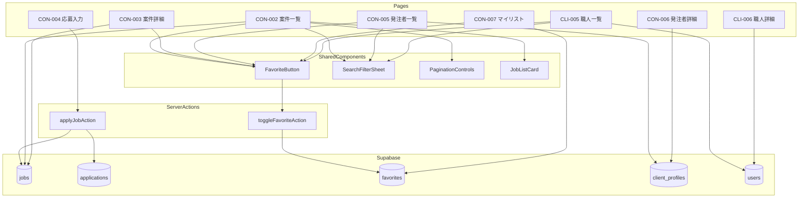
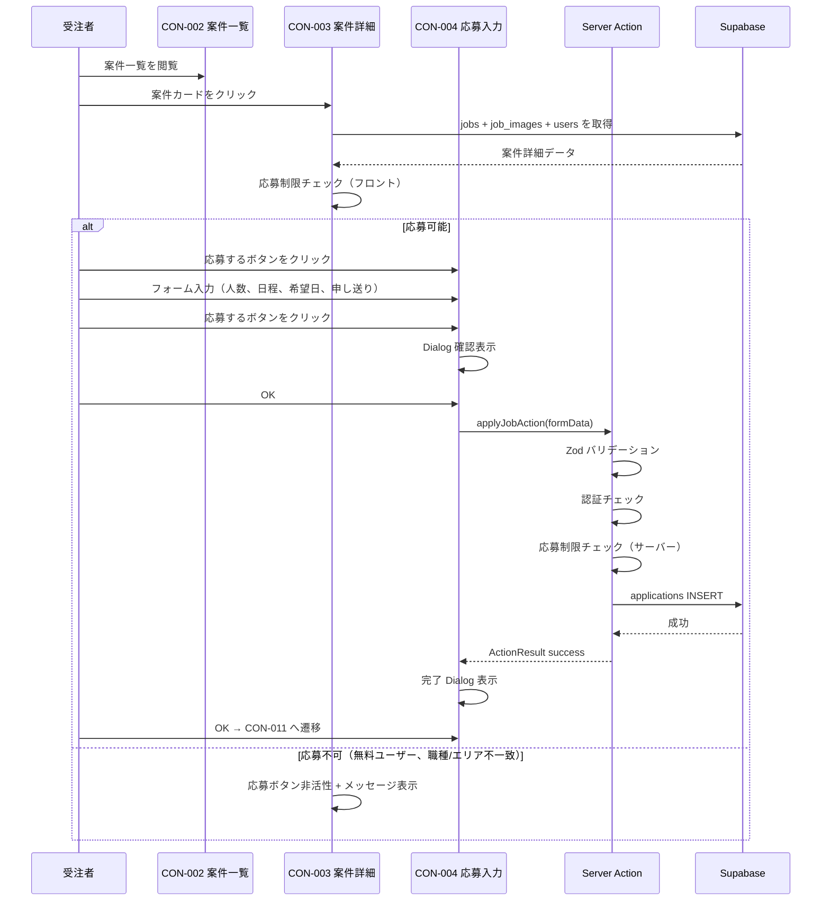
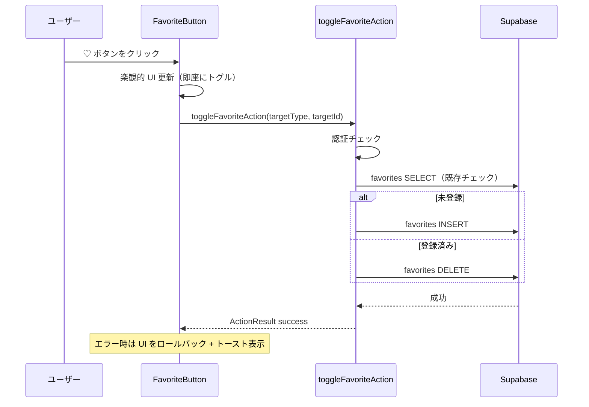

# 案件検索機能（job-search）— 技術設計

## Overview

**Purpose**: 受注者（職人）が募集案件を検索・閲覧・応募し、発注者を検索・お気に入り管理する機能を提供する。発注者が職人を検索する機能も含む。

**Users**: 受注者（無料/有料）は案件検索・応募・発注者検索・マイリストを利用する。発注者は職人検索・マイリスト（見込みユーザー含む）を利用する。

**Impact**: 既存の jobs 管理機能（発注者向け）に対し、受注者向けの検索・閲覧・応募フローと、双方向のお気に入り管理を追加する。

### Goals
- 受注者が案件を効率的に検索・フィルタリングし、条件に合った案件に応募できる
- 発注者が職人を検索・閲覧し、スカウト・メッセージの導線を提供する
- お気に入り機能で案件・発注者・職人をブックマークし、再訪問を容易にする
- 無料ユーザーの応募制限（職種×エリア一致）をフロント・サーバー双方で制御する

### Non-Goals
- リアルタイム更新（案件一覧のライブ更新は不要。ページ遷移/リロードで更新）
- 案件の作成・編集・削除（job-posting spec で実装済み）
- メッセージ送受信の実装（messaging spec で実装）
- スカウト送信の実装（messaging spec で実装）
- 評価の登録・表示の詳細（matching spec で実装）

## Architecture

### Existing Architecture Analysis

既存の jobs/manage ページ（発注者向け案件管理）で以下のパターンが確立済み:
- Server Component + searchParams によるフィルター・ページネーション
- Server Action + ActionResult 型による書き込み操作
- Zod スキーマによるクライアント・サーバー双方のバリデーション
- Supabase クライアントの `.select()` リレーション JOIN + `.range()` ページネーション

本機能はこれらのパターンを踏襲し、受注者向けの読み取り系画面と応募書き込みを追加する。

### Architecture Pattern & Boundary Map



**Architecture Integration**:
- Selected pattern: RSC + searchParams（既存パターン踏襲）
- Domain boundaries: 検索・閲覧は Server Component、書き込み（応募・お気に入り）は Server Action
- Existing patterns preserved: ActionResult 型、Zod バリデーション、Supabase server client
- New components rationale: FavoriteButton（6画面以上で再利用）、SearchFilterSheet（3画面で再利用）
- Steering compliance: 三重防御（Middleware + Server Action + RLS）、モバイルファースト

### Technology Stack

| Layer | Choice / Version | Role in Feature | Notes |
|-------|------------------|-----------------|-------|
| Frontend | Next.js App Router + React 19 | RSC でデータ取得、Client Component でインタラクション | 既存スタック |
| UI | shadcn/ui (Card, Sheet, Dialog, Badge, Select) | 一覧カード、検索モーダル、応募確認、バッジ | 既存スタック |
| Backend | Next.js Server Actions | 応募登録、お気に入りトグル | ActionResult 型で統一 |
| Data | Supabase (PostgreSQL) | jobs, applications, favorites, client_profiles, users | RLS でアクセス制御 |
| Validation | Zod | 応募フォームのクライアント・サーバーバリデーション | 既存パターン |

## System Flows

### 応募フロー（CON-002 → CON-003 → CON-004 → 完了）



### お気に入りトグルフロー



## Requirements Traceability

| Requirement | Summary | Components | Interfaces | Flows |
|-------------|---------|------------|------------|-------|
| REQ-JS-001 | 募集案件一覧（検索・フィルター・ソート・ページネーション・お気に入り） | JobSearchPage, JobListCard, SearchFilterSheet, PaginationControls, FavoriteButton | — | — |
| REQ-JS-002 | 募集案件詳細（全情報表示・応募制限チェック・お気に入り） | JobDetailPage, FavoriteButton | canApplyJob | — |
| REQ-JS-003 | 応募情報入力（フォーム・確認/完了ポップアップ・サーバー検証） | ApplicationFormPage | applyJobAction | 応募フロー |
| REQ-JS-004 | 発注者一覧（検索・フィルター・お気に入り） | ClientSearchPage, ClientListCard, SearchFilterSheet, FavoriteButton | — | — |
| REQ-JS-005 | 発注者詳細（全情報・掲載案件・評価集計・お気に入り） | ClientDetailPage, FavoriteButton | — | — |
| REQ-JS-006 | マイリスト（お気に入り案件/発注者/見込みユーザー） | FavoritesPage, FavoriteButton | — | — |
| REQ-JS-007 | 職人一覧（発注者専用、検索・フィルター・お気に入り） | UserSearchPage, UserListCard, SearchFilterSheet, FavoriteButton | — | — |
| REQ-JS-008 | 職人詳細（発注者専用、プロフィール詳細・導線） | UserDetailPage, FavoriteButton | — | — |

## Components and Interfaces

| Component | Domain/Layer | Intent | Req Coverage | Key Dependencies | Contracts |
|-----------|--------------|--------|--------------|------------------|-----------|
| JobSearchPage | UI / Page | 案件一覧の表示・検索・フィルター・ページネーション | REQ-JS-001 | Supabase (P0), SearchFilterSheet (P1) | — |
| JobDetailPage | UI / Page | 案件詳細の全情報表示、応募制限判定 | REQ-JS-002 | Supabase (P0), canApplyJob (P0) | — |
| ApplicationFormPage | UI / Page | 応募フォーム、確認/完了ポップアップ | REQ-JS-003 | applyJobAction (P0) | Service |
| ClientSearchPage | UI / Page | 発注者一覧の表示・検索 | REQ-JS-004 | Supabase (P0) | — |
| ClientDetailPage | UI / Page | 発注者詳細の全情報表示 | REQ-JS-005 | Supabase (P0) | — |
| FavoritesPage | UI / Page | マイリスト（お気に入り管理） | REQ-JS-006 | Supabase (P0) | — |
| UserSearchPage | UI / Page | 職人一覧（発注者専用） | REQ-JS-007 | Supabase (P0) | — |
| UserDetailPage | UI / Page | 職人詳細（発注者専用） | REQ-JS-008 | Supabase (P0) | — |
| FavoriteButton | UI / Shared | お気に入りトグル（楽観的 UI） | REQ-JS-001〜008 | toggleFavoriteAction (P0) | Service |
| SearchFilterSheet | UI / Shared | 検索フィルターモーダル | REQ-JS-001, 004, 007 | shadcn/ui Sheet (P0) | — |
| JobListCard | UI / Shared | 案件カードコンポーネント | REQ-JS-001, 006 | — | — |
| applyJobAction | Server Action | 応募の登録（検証含む） | REQ-JS-003 | Supabase (P0) | Service |
| toggleFavoriteAction | Server Action | お気に入りのトグル | REQ-JS-001〜008 | Supabase (P0) | Service |
| canApplyJob | Utility | 応募可否の判定（フロント/サーバー共用） | REQ-JS-002, 003 | — | Service |

### 共通実装ルール

#### 退会済みユーザーの表示
- `users.deleted_at IS NOT NULL` のユーザーは、氏名・会社名を「退会済みユーザー」と表示する
- 該当する画面: CON-005（発注者一覧）、CON-006（発注者詳細）、CLI-005（職人一覧）、CLI-006（職人詳細）
- 既存の `getUserDisplayName()` ユーティリティを使用する（実装済みの場合）。未実装の場合は `src/lib/utils/display-name.ts` に作成する
- 一覧画面では退会済みユーザーを表示しない（`.is('deleted_at', null)` でフィルタ）が、詳細画面では URL 直接アクセスの可能性があるため、退会済みの場合は「退会済みユーザー」と表示したうえで操作ボタン（メッセージ送信等）を非表示にする

#### 画像表示ルール（Supabase Storage）
- Supabase Storage から取得した画像（サムネイル、アバター、案件画像等）は `` タグで表示する
- `next/image` の `<Image>` コンポーネントは使用しない（remotePatterns 設定の問題を回避するため）
- 該当コンポーネント: JobListCard（サムネイル）、CON-003（案件画像）、CON-005/006（発注者アバター）、CLI-005/006（職人アバター）

### Server Actions

#### applyJobAction

| Field | Detail |
|-------|--------|
| Intent | 案件への応募を登録する。無料ユーザーの応募制限をサーバーサイドで検証する |
| Requirements | REQ-JS-003 |

**Responsibilities & Constraints**

**Server Action チェック順序（security.md 準拠）**:
1. 認証チェック: ログイン済みか確認（未認証ならエラー）
2. ロールチェック: user.role が 'contractor', 'client', 'staff' のいずれかであることを確認
3. FormData 抽出 + Zod バリデーション: applicationSchema でバリデーション
4. 案件ステータスチェック: 応募先の案件が status = 'open' かつ deleted_at IS NULL
5. 重複応募チェック: 同一 applicant_id + job_id で status NOT IN ('cancelled') のレコードが存在しないこと
6. 応募制限チェック（無料ユーザーのみ）: canApplyJob() で職種×エリアの合致を検証
7. applications INSERT: status = 'applied' で登録

**Dependencies**
- Inbound: ApplicationFormPage — フォーム送信 (P0)
- External: Supabase — applications INSERT, jobs/user_skills/user_available_areas SELECT (P0)

**Contracts**: Service [x]

##### Service Interface
```typescript
interface ApplyJobService {
  applyJobAction(formData: FormData): Promise<ActionResult<{ applicationId: string }>>;
}

// FormData fields:
// - jobId: string (UUID)
// - headcount: string (数値文字列)
// - workingType: string
// - preferredFirstWorkDate: string (ISO date)
// - message: string (optional)
```
- Preconditions: ユーザーがログイン済み、案件が status = 'open'
- Postconditions: applications テーブルに新規レコードが作成される（status = 'applied'）
- Invariants: 同一 applicant_id + job_id で重複レコードは作成されない（cancelled 除く）

**Implementation Notes**
- Validation: applicationSchema（Zod）でバリデーション。headcount は正の整数、preferredFirstWorkDate は未来日
- Risks: 応募制限の判定ロジックがフロントとサーバーで乖離するリスク → canApplyJob ユーティリティで共通化

#### toggleFavoriteAction

| Field | Detail |
|-------|--------|
| Intent | お気に入りの登録/解除をトグルする |
| Requirements | REQ-JS-001〜008 |

**Responsibilities & Constraints**

**Server Action チェック順序（security.md 準拠）**:
1. 認証チェック: ログイン済みか確認
2. ロールチェック + target_type バリデーション:
   - 受注者（role = 'contractor'）: target_type は 'job' または 'client' のみ許可
   - 発注者（role = 'client'）/ 担当者（role = 'staff'）: target_type は 'job', 'client', 'user' の3種を許可
   - 上記以外はエラー（「不正なリクエストです」）
3. target_id の存在チェック: 対象のレコードが実際に存在するか確認（存在しないIDでのお気に入り登録を防止）
4. favorites テーブルで既存レコードを SELECT → 存在すれば DELETE、なければ INSERT

**Dependencies**
- Inbound: FavoriteButton — ♡ボタンクリック (P0)
- External: Supabase — favorites SELECT/INSERT/DELETE (P0)

**Contracts**: Service [x]

##### Service Interface
```typescript
interface ToggleFavoriteService {
  toggleFavoriteAction(formData: FormData): Promise<ActionResult<{ isFavorited: boolean }>>;
}

// FormData fields:
// - targetType: 'job' | 'client' | 'user'
// - targetId: string (UUID)
```
- Preconditions: ユーザーがログイン済み
- Postconditions: favorites レコードが追加または削除される
- Invariants: 同一 user_id + target_type + target_id で重複レコードは作成されない

### Shared Components

#### FavoriteButton

| Field | Detail |
|-------|--------|
| Intent | お気に入りの♡ボタン。楽観的 UI でトグルする Client Component |
| Requirements | REQ-JS-001〜008 |

**Responsibilities & Constraints**
- Client Component（`"use client"`）
- 楽観的 UI: クリック時に即座に♡の状態を反転し、Server Action の完了を待たない
- Server Action 失敗時は状態をロールバックし、トーストでエラー通知
- `assets/icons/icon-heart.png` のプロジェクト専用アイコンを使用

**Props Interface**
```typescript
interface FavoriteButtonProps {
  targetType: 'job' | 'client' | 'user';
  targetId: string;
  initialIsFavorited: boolean;
}
```

**Implementation Notes**
- `useOptimistic` または `useState` で楽観的 UI を実現
- アイコン: `icon-heart.png`（グレー: 未登録、塗りつぶし: 登録済み）

#### SearchFilterSheet

| Field | Detail |
|-------|--------|
| Intent | 検索条件のモーダル。画面ごとにフィルター項目が異なる |
| Requirements | REQ-JS-001, 004, 007 |

**Responsibilities & Constraints**
- shadcn/ui Sheet コンポーネントで実装
- フィルター項目は画面ごとに異なるため、children または設定 props で柔軟に構成
- 「検索する」ボタンで searchParams を更新し、Sheet を閉じる

**フィルター項目**:
- CON-002（案件検索）: キーワード、エリア、希望日程、募集職種、経験年数、国籍・言語
- CON-005（発注者検索）: キーワード、募集エリア、募集職種、従業員規模、求める働き方、言語
- CLI-005（職人検索）: 対応職種、対応エリア、希望日程、経験年数、保有スキル、保有資格、お気に入り登録

**Implementation Notes**
- 各画面で専用のフィルターフォームコンポーネントを作成し、SearchFilterSheet でラップする構成
- フィルター値は `useRouter().push()` で URL searchParams に反映

#### JobListCard

| Field | Detail |
|-------|--------|
| Intent | 案件一覧のカードコンポーネント。CON-002 とマイリスト（CON-007）で共用 |
| Requirements | REQ-JS-001, 006 |

**Props Interface**
```typescript
interface JobListCardProps {
  job: {
    id: string;
    title: string;
    tradeType: string;
    prefecture: string;
    rewardLower: number | null;
    rewardUpper: number | null;
    isUrgent: boolean;
    recruitEndDate: string;
    companyName: string | null;
    thumbnailUrl: string | null;
  };
  isFavorited: boolean;
}
```

**Layout（デザインカンプ準拠）**:
- SP: `grid grid-cols-1 gap-8`
- PC: `md:grid-cols-2 lg:grid-cols-3 gap-8`
- カード上部: サムネイル画像（1枚目、なければプレースホルダー）
- 画像左上: 急募バッジ（`is_urgent = true` の場合）、`rounded-[33px]` absolute 配置
- カード下部: タイトル、会社名、職種、報酬、エリア、募集期間
- カード内に「マイリスト登録」ボタン（FavoriteButton）と「詳細をみる」リンク
- アイコン: `icon-briefcase.png`（職種）、`icon-pin.png`（エリア）、`icon-sort.png`（日程）

**Implementation Notes**
- サムネイル画像（Supabase Storage）の表示には `` タグを使用すること（`next/image` の `<Image>` は使用しない）
- CLAUDE.md の「ユーザーアップロード画像の表示」ルールに準拠

### Utility Functions

#### canApplyJob

| Field | Detail |
|-------|--------|
| Intent | 無料ユーザーの応募可否を判定する共通ユーティリティ |
| Requirements | REQ-JS-002, 003 |

```typescript
interface CanApplyJobParams {
  userRole: 'contractor' | 'client' | 'staff';
  isPaidUser: boolean; // subscriptions.status IN ('active', 'past_due') で判定。DB の is_paid_user() 関数と同等
  jobTradeType: string;
  jobPrefecture: string;
  userSkills: Array<{ tradeType: string }>;
  userAvailableAreas: Array<{ prefecture: string }>;
}

interface CanApplyJobResult {
  canApply: boolean;
  reason?: string; // 不可の理由（日本語メッセージ）
}

function canApplyJob(params: CanApplyJobParams): CanApplyJobResult;
```

- 有料ユーザーの判定: subscriptions テーブルで status IN ('active', 'past_due') のレコードが存在するかで判定する
  - past_due（支払い遅延中）のユーザーも猶予期間中は有料ユーザーとして扱う（roles-and-permissions.md に準拠）
  - staff ロール（法人プランの担当者）も有料ユーザーとして扱う
- DB の is_paid_user() ヘルパー関数と同じロジックをサーバーサイドで再現する
- 有料ユーザー（`isPaidUser = true`）は常に `canApply: true`
- 無料ユーザー: `jobTradeType` が `userSkills` に含まれ、かつ `jobPrefecture` が `userAvailableAreas` に含まれる場合のみ `canApply: true`
- フロントエンド（CON-003）とサーバーサイド（applyJobAction）の両方から呼び出す

## Data Models

### Domain Model

本機能で操作するエンティティ:
- **Job（案件）**: 読み取り専用。status = 'open' のもののみ一覧に表示
- **Application（応募）**: 本機能で新規作成。applicant_id + job_id のユニーク制約
- **Favorite（お気に入り）**: 本機能で作成/削除。user_id + target_type + target_id
- **ClientProfile（発注者プロフィール）**: 読み取り専用。発注者一覧・詳細で表示
- **User（ユーザー）**: 読み取り専用。職人一覧・詳細で表示

### Physical Data Model

既存テーブルを使用する。新規テーブルの作成は不要。

**テーブル制約（仕様書 database-schema.md 準拠）**:

- **applications**: `UNIQUE (job_id, applicant_id) WHERE status NOT IN ('cancelled')` — 同一案件への重複応募防止。cancelled のみ除外（rejected 後の再応募は不可）
- **favorites**: `UNIQUE (user_id, target_type, target_id)` — 同一対象への重複登録防止（toggleFavoriteAction で SELECT → INSERT/DELETE するが、レースコンディション対策としてDB制約も設定）

**必要なインデックス（パフォーマンス最適化）**:

```sql
-- 案件検索の高速化（database-schema.md 準拠の複合インデックス）
-- 仕様書には (status, prefecture, trade_type) が定義済み
-- job-search 固有の急募+新着ソート用に追加
CREATE INDEX IF NOT EXISTS idx_jobs_search_sort
  ON jobs (status, is_urgent DESC, created_at DESC)
  WHERE deleted_at IS NULL;

-- お気に入り検索の高速化（仕様書で (user_id, target_type) が定義済み — 追加不要）
-- ※ idx_favorites_user_type は database-schema.md のパフォーマンス用インデックスで定義済み

-- 応募重複チェック（仕様書の UNIQUE 制約で対応済み — 追加インデックスは不要）
-- ※ UNIQUE (job_id, applicant_id) WHERE status NOT IN ('cancelled') が部分インデックスとして機能する
```

### Data Contracts

**案件一覧クエリ（CON-002）**:
```typescript
// Supabase query
const query = supabase
  .from('jobs')
  .select(`
    id, title, description, trade_type, prefecture,
    reward_lower, reward_upper, is_urgent,
    recruit_start_date, recruit_end_date, created_at,
    users!owner_id(company_name),
    job_images(image_url, sort_order)
  `, { count: 'exact' })
  .eq('status', 'open')
  .is('deleted_at', null)
  .gte('recruit_end_date', new Date().toISOString().split('T')[0]) // 募集期間が今日以降のもの
  .order('is_urgent', { ascending: false })
  .order('created_at', { ascending: false })
  .range(offset, offset + ITEMS_PER_PAGE - 1);
```

**発注者一覧クエリ（CON-005）**:
```typescript
// Supabase query — users + client_profiles の JOIN
const query = supabase
  .from('users')
  .select(`
    id, company_name, prefecture, avatar_url, deleted_at,
    client_profiles!inner(
      display_name, image_url, recruit_job_types,
      recruit_area, employee_scale, working_way, message
    )
  `, { count: 'exact' })
  .eq('role', 'client')
  .eq('is_active', true)
  .is('deleted_at', null)
  .order('created_at', { ascending: false })
  .range(offset, offset + ITEMS_PER_PAGE - 1);
```

**職人一覧クエリ（CLI-005）**:
```typescript
const query = supabase
  .from('users')
  .select(`
    id, last_name, first_name, birth_date, prefecture,
    avatar_url, identity_verified, ccus_verified, deleted_at,
    user_skills(trade_type, experience_years),
    user_available_areas(prefecture)
  `, { count: 'exact' })
  .eq('role', 'contractor')
  .eq('is_active', true)
  .is('deleted_at', null)
  .order('created_at', { ascending: false })
  .range(offset, offset + ITEMS_PER_PAGE - 1);
```

**応募登録 Zod スキーマ**:
```typescript
const applicationSchema = z.object({
  jobId: z.string().uuid(),
  headcount: z.coerce.number().int().min(1, '1名以上を入力してください'),
  workingType: z.string().min(1, '日程/働き方を入力してください'),
  preferredFirstWorkDate: z.string().min(1, '初回稼働希望日を選択してください'),
  message: z.string().optional(),
});
```

## Page Layouts（デザインカンプ準拠）

### CON-002 募集案件一覧

**デザインカンプ**: `CON-002-design-sp.png`, `CON-002-design-pc.png`, `CON-002-popup.png`
**デザイン要件CSS**: `CON-002-sp.css`, `CON-002-pc.css`

**レイアウト構造**:
- ヘッダー: ロゴ + ハンバーガーメニュー
- ページタイトル: 「募集案件一覧」（`text-heading-lg font-bold`）
- 件数表示 + ソートアイコン（`icon-sort.png`）
- カードグリッド: SP `grid-cols-1`、PC `md:grid-cols-2 lg:grid-cols-3`
- 各カード: JobListCard（サムネイル + 急募バッジ + 案件情報 + ♡ボタン + 詳細リンク）
- ページネーション: 下部に配置
- 検索ボタン（虫眼鏡 `icon-search.png`）→ SearchFilterSheet を開く
- ページ背景: `bg-muted`

**searchParams**:
- `q`: キーワード
- `prefecture`: エリア
- `tradeType`: 職種
- `sort`: `newest`(default) / `reward_high` / `reward_low`
- `page`: ページ番号

### CON-003 募集案件詳細

**デザインカンプ**: `CON-003.png`

**レイアウト構造**:
- ページタイトル: 「募集案件詳細」
- 案件タイトル + 会社名
- 「興味する」ボタン（FavoriteButton）+ 「応募する」ボタン
- 情報セクション（上から順に）:
  - 報酬、エリア、募集職種、募集人数
  - 勤務地、現場工期、募集期間
  - 稼働時間、必要経験年数、必須スキル、国籍・言語
  - 持ち物、スケジュール詳細、請負案件詳細
  - 発注者からのメッセージ、詳細その他
- 急募バッジ（該当時）
- 添付画像・書類
- 発注者情報リンク（→ CON-006）
- 下部固定: 「応募する」ボタン
- **応募制限表示**: 応募不可の場合、ボタン非活性 + メッセージ「有料プランに加入するか、プロフィールの職種・エリアを更新してください」

### CON-004 応募情報入力

**ルーティング**: `/jobs/[id]/apply`（CON-003 の「応募する」ボタンから遷移）

**デザインカンプ**: `CON-004.png`

**レイアウト構造**:
- ページタイトル: 「応募情報入力」
- 案件サマリー（タイトル、会社名、報酬、エリア、稼働時間等）
- フォーム:
  - 応募人数（Input type=number, 必須）
  - 日程/働き方（Input, 必須）
  - 初回稼働希望日（Input type=date, 必須）
  - 申し送り（Textarea, 任意）
- 「上記内容を確認しました」チェックボックス
- 「応募する」ボタン（CTA）+ 「もどる」リンク
- **確認 Dialog**: 「この情報で応募して良いですか」→ OK → Server Action 実行 → 完了 Dialog「応募が完了しました」→ OK → CON-011 へ遷移

### CON-005 発注者一覧

**デザインカンプ**: `CON-005.png`, `CON-005-popup.png`

**レイアウト構造**:
- ページタイトル: 「発注者一覧」
- 件数表示 + 検索ボタン（`icon-search.png`）
- カードリスト（1カラム）:
  - アバター画像 + 会社名 + 住所
  - 募集職種、募集エリア、求める働き方（チェックマークアイコン付き）
  - 「マイリスト登録」ボタン + 「詳細をみる」ボタン
- ページネーション

### CON-006 発注者詳細

**デザインカンプ**: `CON-006.png`

**レイアウト構造**:
- ページタイトル: 「発注者詳細」
- プロフィール画像 + 名前 + 住所
- 「興味する」ボタン（FavoriteButton）+ 「応募する」ボタン
- 情報セクション: 募集職種、募集エリア、従業員規模、求める働き方
- 発注者からのメッセージ
- 掲載中の案件一覧（案件カード形式）
- 発注者評価の集計（client_reviews の平均等）

### CON-007 マイリスト

**デザインカンプ**: `CON-007.png`（案件タブ）, `CON-007-b.png`（ユーザータブ）

**レイアウト構造**:
- ページタイトル: 「マイリスト」
- プルダウン切り替え（Select コンポーネント）:
  - 受注者: 「案件」/「発注者」
  - 発注者: 「案件」/「発注者」/「見込みユーザー」
- 件数表示 + 検索ボタン
- タブ内容に応じたカード一覧:
  - 案件タブ: JobListCard と同様のカード
  - 発注者タブ: CON-005 と同様のカード
  - 見込みユーザータブ: CLI-005 と同様のカード（ユーザー情報 + お気に入り案件表示）
- 「マイリスト解除」ボタン + 「詳細をみる」ボタン
- 「もどる」ボタン

**searchParams**:
- `type`: `job`(default) / `client` / `user`（タブ切り替え）
- `page`: ページ番号（タブごとに独立）

### CLI-005 ユーザー一覧（職人一覧）

**デザインカンプ**: `CLI-005.png`, `CLI-005-popup-a.png`, `CLI-005-popup-b.png`

**レイアウト構造**:
- ページタイトル: 「ユーザー一覧」
- 件数表示 + 検索ボタン + ソートボタン（`icon-sort.png`）
- 高評価バッジ: 「発注者の再発注希望80%!」等
- カードリスト（1カラム）:
  - アバター + 氏名 + 年齢
  - 対応職種（複数）、本人確認バッジ（`icon-tag.png`）、CCUS バッジ
  - 対応エリア（`icon-globe.png`）、経験年数
  - 「お気に入り登録」ボタン + 「詳細をみる」ボタン
- ページネーション

### CLI-006 ユーザー詳細（職人詳細）

**デザインカンプ**: `CLI-006.png`, `CLI-006-design-sp.png`, `CLI-006-design-pc.png`
**デザイン要件CSS**: `CLI-006-sp.css`, `CLI-006-pc.css`

**レイアウト構造**:
- ページタイトル: 「ユーザー詳細」
- アバター + 氏名 + 年齢
- 「メッセージを送る」ボタン + 「スカウトを送る」ボタン
- バッジ: 本人確認済み、CCUS 登録済み
- PR 動画（登録済みの場合）
- セクション:
  - 基本情報: 性別、都道府県、会社名/屋号
  - 自己紹介
  - 能力: 職種×経験年数、スキル、資格
  - 対応可能エリア
  - 空き日程
- 発注者からの評価（user_reviews 集計）
- 「評価を見る」リンク（→ CLI-028）

## Error Handling

### Error Categories and Responses

**User Errors (4xx)**:
- 応募フォームバリデーションエラー → Zod のフィールドレベルエラーメッセージ（日本語）
- 応募制限違反（フロントバイパス） → 「応募条件を満たしていません。プロフィールの職種・エリアを更新してください」
- 重複応募 → 「この案件には既に応募済みです」
- 認証エラー → ログインページへリダイレクト

**System Errors (5xx)**:
- Supabase 接続エラー → 「一時的なエラーが発生しました。しばらくしてから再度お試しください」
- お気に入りトグル失敗 → トーストで「お気に入りの更新に失敗しました」+ 楽観的 UI をロールバック

## Testing Strategy

### Unit Tests
- `canApplyJob` ユーティリティ: 有料ユーザー/無料ユーザー（合致/不合致）の各パターン
- `applicationSchema` Zod バリデーション: 正常系 + 各フィールドの異常系
- `toggleFavoriteAction`: 登録/解除/認証エラーの各パターン

### Integration Tests
- `applyJobAction`: FormData 組み立て → Supabase モック → 正常系 + 応募制限違反 + 重複応募
- `toggleFavoriteAction`: 未登録→登録、登録済み→解除、target_type 不正

### RLS Tests (pgTAP)
- 受注者は status = 'open' の案件のみ SELECT 可能
- favorites は自分のレコードのみ SELECT/INSERT/DELETE 可能
- applications は自分の応募のみ INSERT 可能

### E2E Tests (Playwright)
- 案件検索 → 案件詳細 → 応募入力 → 確認 → 完了 → 応募履歴一覧へ遷移
- お気に入り登録/解除 → マイリストに反映
- 発注者一覧 → 発注者詳細（基本フロー確認）

## Security Considerations

### 三重防御（security.md 準拠）

| 層 | 対象 | job-search での適用 |
|----|------|-------------------|
| Middleware（第1層） | ルーティング制御 | CON-002〜007: ログイン済みユーザーのみ。CLI-005/006: role = 'client' または 'staff' のみ |
| Server Action（第2層） | ビジネスロジック | applyJobAction: 認証→ロール→Zod→案件ステータス→重複→応募制限の順でチェック。toggleFavoriteAction: 認証→ロール×target_type→対象存在チェック |
| RLS（第3層） | データアクセス | 下記テーブル別ポリシー参照 |

### RLS ポリシー設計（database-schema.md 準拠）

#### jobs（案件）— SELECT
- 一般ユーザー: `status = 'open' AND deleted_at IS NULL`（募集中かつ未削除のみ）
- 案件作成者: `owner_id = auth.uid() AND deleted_at IS NULL`（自分の案件は draft/closed も閲覧可）
- 管理者: `is_admin(auth.uid())`（deleted_at 条件なし）

#### applications（応募）— INSERT
- 認証済みユーザー: `applicant_id = auth.uid()`（自分の名前でのみ応募可）
- ※ 職種×エリア制限は RLS ではなく Server Action で制御（JOIN が複雑なため）

#### applications（応募）— SELECT
- `applicant_id = auth.uid() OR job.owner_id = auth.uid()`
- ※ 重複応募チェックのための SELECT も RLS で許可される必要がある

#### favorites（お気に入り）— SELECT / INSERT / DELETE
- `user_id = auth.uid()`（自分のお気に入りのみ操作可能）

#### client_profiles — SELECT
- 全ユーザーが閲覧可（公開プロフィール）

#### user_skills / user_available_areas / user_qualifications — SELECT
- 全ユーザーが閲覧可（公開プロフィール）

#### user_reviews / client_reviews — SELECT
- 全ユーザーが閲覧可（公開評価）

#### available_schedules — SELECT
- 全ユーザーが閲覧可（発注者が職人の空きを確認する用途）

#### job_images — SELECT
- 全ユーザーが閲覧可（案件と同じ公開範囲。deleted_at IS NULL の案件に紐づくもの）

### Middleware 設定

```typescript
// CLI-005, CLI-006 は発注者（client）と担当者（staff）のみアクセス可
// roles-and-permissions.md: 「受注者 → CLI-001〜025 はアクセス不可」
const CLIENT_ONLY_PATHS = ['/users/contractors'];

// ※ CLI-026〜027（プラン案内）は例外的に受注者にもアクセス許可
const CLIENT_EXCEPT_PATHS = ['/billing/plans', '/billing/checkout'];
```

### 入力検証（security.md 準拠）
- 全フォーム入力に Zod バリデーション（クライアント + サーバーの両方で実施）
- 許可リスト方式を優先（ブロックリストではなく）
- エラーメッセージに内部情報（テーブル名、カラム名、SQL エラー）を含めない
- Supabase SDK のパラメータバインディングで SQL インジェクション対策を担保
