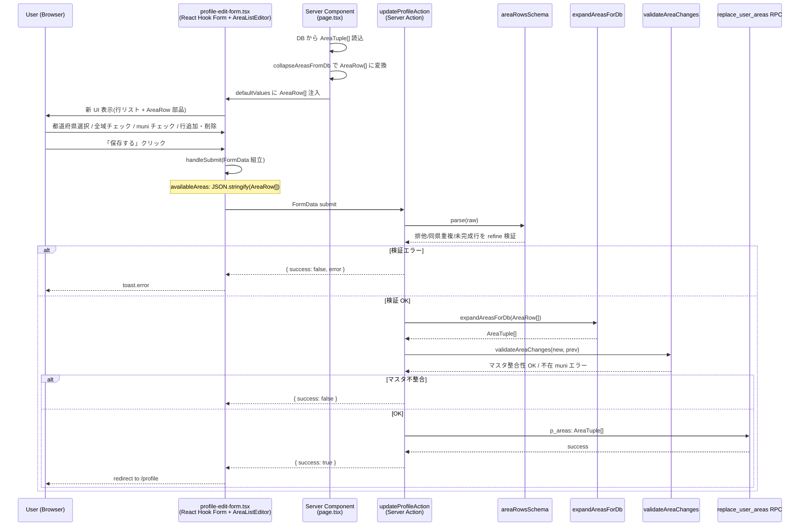
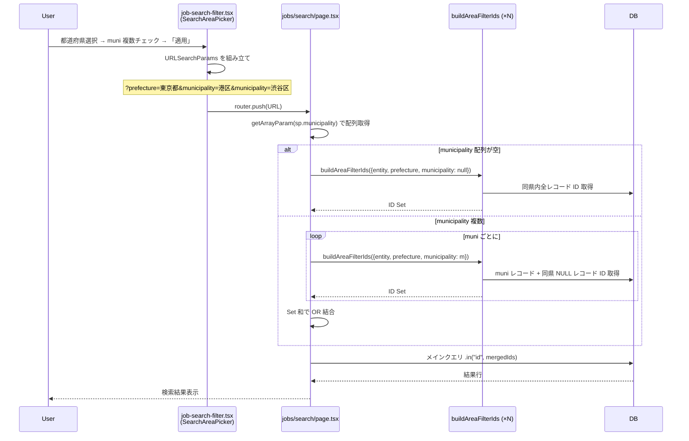
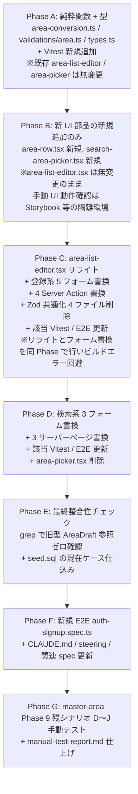

# Technical Design — master-area-multi-select

## Overview

**Purpose**: 親仕様 master-area が実装したエリア入力 UI(1 行 = 1 (県, muni) ペア)が業界標準(タウンワーク等)と乖離しており、Phase 9 手動テストで UX 起因のバグが 4 件発生していた。本仕様は **DB スキーマ・既存 RPC・マッチング判定・上位包含検索ルールを保持したまま**、UI 層と Server Action の前段(UI ↔ DB 変換)のみを差し替え、「1 行 = 1 県 + N 市区町村 / または県全域」のマルチ選択型 UI に刷新する。

**Users**: 受注者(対応エリア登録)、発注者(募集エリア・案件エリア登録)、全ロール(検索フィルタ操作)。

**Impact**: 既存 8 フォーム(登録系 5 + 検索系 3)の UI を入れ替え、Zod 検証を 4 ファイルから 1 共通スキーマに統合、URL searchParams 形式を同名キー繰返しに変更。DB / RPC / 検索クエリビルダーは無変更で API 互換性を確保。

### Goals
- 業界標準 UX(タウンワーク式「県を選ぶと市区町村ツリーが展開、複数チェック可」)を 8 フォームすべてに導入
- UI/DB 間に純粋関数 2 本(`expandAreasForDb` / `collapseAreasFromDb`)を介在させて DB スキーマ無変更を維持
- Zod 検証ロジックを `src/lib/validations/area.ts` 共通スキーマに一元化(コピペコード除去)
- 同県重複禁止 / 排他制約 / 案件 10 件上限を refine で一括検証

### Non-Goals
- DB スキーマ・既存 RPC・`buildAreaFilterIds()` API・`canApplyJob()` の変更
- `AreaList` / `AreaSummary` / `formatAreas*` 表示コンポーネントの変更
- 複数県またぐ検索 UI(検索系は「県 1 つ + その県内 muni 複数」までに限定)
- 既存データの一括 SQL マイグレーション(本番運用前のため不要)
- 30 件 soft cap 警告 UI(新 UI で削除)
- AUTH-001〜005(メール認証・パスワード設定)の全通し E2E
- 検索 URL のブックマーク互換性維持

## Architecture

### Existing Architecture Analysis

| 既存資産 | 役割 | 本仕様での扱い |
|---|---|---|
| `area-list-editor.tsx` (143 行) | 動的行リスト(各行は AreaPicker、`AreaDraft[]` 管理) | **リライト**(新型 `AreaRow[]` 管理、内部に `AreaRow` 部品を複数並べる) |
| `area-picker.tsx` (106 行) | 都道府県 Select + MasterCombobox(single) | **削除**(`AreaRow` + `SearchAreaPicker` の新設で役割分離) |
| `area-list.tsx` / `area-summary.tsx` | 表示専用(formatAreas に委譲) | **無変更** |
| `validate-area.ts` の `validateAreaChanges()` | マスタ整合性 delta 検証 | **無変更**(平坦化後の AreaTuple[] に対し呼び出す) |
| `area-search-clauses.ts` の `buildAreaFilterIds()` | 上位包含検索クエリビルダー | **API 無変更**(呼び出し側で複数 muni を OR ループ) |
| Zod スキーマ 4 ファイル(`validations/*.ts`) | エンティティ別の area 検証(同一パターンのコピペ) | **共通 `areaRowsSchema` に統合**、4 ファイル個別を削除 |
| Server Action 4 ファイル(`actions.ts`) | FormData 解析 → Zod → RPC | **平坦化処理 `expandAreasForDb` を Zod 通過後・RPC 呼出前に挿入** |
| useFieldArray + setValue パターン(5 登録フォーム) | 行リスト編集の親側統合 | **継承**(新型 AreaRow でも同パターン) |

### Architecture Pattern & Boundary Map

```mermaid
graph TB
    subgraph "UI Layer (Client Component)"
        ALE[AreaListEditor<br/>登録系 5 フォーム]
        SAP[SearchAreaPicker<br/>検索系 3 フォーム]
        AR[AreaRow<br/>共通 UI 部品]
        ALE --> AR
        SAP --> AR
    end

    subgraph "Validation Layer (Shared)"
        ARS[areaRowsSchema<br/>排他/同県重複/件数上限]
        SAS[searchAreaRowSchema<br/>配列長 1 制約]
        ARS -.派生.-> SAS
    end

    subgraph "Conversion Layer (Pure Functions)"
        EXP[expandAreasForDb<br/>UI → DB]
        COL[collapseAreasFromDb<br/>DB → UI]
    end

    subgraph "Server Action / Page (Server Component)"
        SA[updateProfileAction 等<br/>4 Server Action]
        SP[search page.tsx 3 本<br/>URL params 読取]
    end

    subgraph "Existing Layer (UNCHANGED)"
        RPC[replace_user_areas /<br/>replace_job_areas /<br/>replace_client_recruit_areas]
        BFI[buildAreaFilterIds]
        VAC[validateAreaChanges<br/>マスタ整合性]
        MAT[canApplyJob<br/>マッチング判定]
        DISP[AreaList / AreaSummary<br/>formatAreas]
    end

    ALE -.AreaRow[]<br/>(FormData JSON).-> SA
    SAP -.親フォーム経由<br/>URL params.-> SP
    SA -->|Zod| ARS
    SP -->|safeParse| SAS
    SA -->|平坦化| EXP
    EXP -->|AreaTuple[]| VAC
    EXP -->|AreaTuple[]| RPC
    SP -->|muni ごと OR ループ| BFI
    BFI -->|ID 集合| SP
    
    DB[(DB:<br/>user_available_areas<br/>job_areas<br/>client_recruit_areas)]
    RPC --> DB
    BFI --> DB
    DB -.読込時.-> COL
    COL --> ALE
    DB --> DISP
```

**Architecture Integration**:
- **Selected pattern**: 既存「UI → Zod → 純粋関数変換 → RPC」レイヤード構造を踏襲。新規追加は変換層(2 関数)と共通検証層(1 ファイル)のみ
- **Domain/feature boundaries**: 入力 UI(`AreaListEditor` / `SearchAreaPicker` / `AreaRow`)/ 検証(`areaRowsSchema`)/ 変換(`area-conversion.ts`)を 3 層に分離。各層は単一責任
- **Existing patterns preserved**: useFieldArray + setValue 統合パターン、`Controller` ベース React Hook Form 連携、shadcn `Select` + Checkbox UI、`getArrayParam()` ヘルパー(URL params 配列)
- **New components rationale**: 検索系の特殊制約(配列長 1、全域チェック不在)を `SearchAreaPicker` に閉じ込め、共通 1 行 UI を `AreaRow` で再利用
- **Steering compliance**: TypeScript `strict: true` + 明示 interface(`AreaRow` / `AreaTuple`)、フォーム内 `<button type>` 明示、`'use client'` 最小化、Server Component 優先

### Technology Stack

| Layer | Choice / Version | Role in Feature | Notes |
|-------|------------------|-----------------|-------|
| Frontend | Next.js 16 App Router / React 19 / TypeScript strict | UI コンポーネント + Server Component による defaultValues 注入 | 既存スタック踏襲、新依存ゼロ |
| Form | React Hook Form + `watch` + `setValue`(必要に応じて `useFieldArray` / `Controller`) | `AreaRow[]` 状態管理、行追加・削除・編集 | 既存 5 登録フォームは `watch("availableAreas")` + `setValue(name, AreaRow[])` の全置換パターン中心(useFieldArray は append/remove が必要な場合のみ採用)。新型 AreaRow でも同パターン継承 |
| UI Kit | shadcn/ui (`Select` / `Checkbox`) | 都道府県 Select + 市区町村 Checkbox 群 | 既存 `MasterCombobox` パターン外、Checkbox 群はネイティブ shadcn |
| Validation | Zod v4 | `areaRowsSchema` superRefine で排他/同県重複/件数上限を一括検証 | 既存 v4 のまま、新 API 利用なし |
| Backend | Next.js Server Actions / Supabase RPC | FormData 解析 → Zod → expandAreasForDb → 既存 RPC | RPC は無変更 |
| Data | Supabase Postgres(3 既存テーブル) | `user_available_areas` / `job_areas` / `client_recruit_areas` | スキーマ無変更 |
| Testing | Vitest + Playwright | 純粋関数単体テスト、Server Action 統合、E2E 通しシナリオ | 既存テスト整備 + 新規 E2E `auth-signup.spec.ts` 追加 |

詳細は `research.md` の各 Decision セクション参照。

## System Flows

### Flow 1: 受注者が新 UI で対応エリアを保存する(登録系)



### Flow 2: ユーザーが検索フォームで複数 muni 絞り込み



### Flow 3: 既存 DB データの正規化(混在ケース読込)

```mermaid
flowchart TD
    A[DB SELECT] --> B{同一 prefecture<br/>に複数行?}
    B -->|No| C[1 ペア → 1 AreaRow に変換]
    B -->|Yes| D{NULL を含む?}
    D -->|Yes| E[whole = true,<br/>municipalities = []<br/>具体 muni は捨てる]
    D -->|No| F[whole = false,<br/>municipalities = 全 muni を sort_order 昇順]
    C --> G[AreaRow[]]
    E --> G
    F --> G
    G --> H[フォーム defaultValues に渡す]
    H --> I{警告表示は?}
    I -->|出さない| J[UI 上は整形済み状態のみ見せる]
    J --> K[ユーザーが他項目変更して保存 →<br/>整形後の AreaRow[] が expandAreasForDb 経由で DB に保存される]
```

「dirty フラグ」は立てない。ユーザー視点では UI に整形済みの状態だけが見え、警告なし。他項目変更で保存した際にエリアも自動的に綺麗な状態で保存される(Issue 5 修正で明確化)。

## Requirements Traceability

| Requirement | Summary | Components | Interfaces | Flows |
|---|---|---|---|---|
| 1.1〜1.11 | UI 状態モデル AreaRow | `AreaRow`, `AreaListEditor`, `SearchAreaPicker` | `AreaRow` 型, `AreaListEditorProps`, `SearchAreaPickerProps` | Flow 1 |
| 2.1〜2.8 | 排他制約(全域 ↔ muni 複数) | `AreaRow`, `areaRowsSchema` | `AreaRow.whole`, refine カバレッジ | Flow 1 |
| 3.1〜3.5 | 同県重複禁止 | `AreaListEditor`, `areaRowsSchema` | prefecture Select 候補フィルタ, refine | Flow 1 |
| 4.1〜4.8 | UI → DB 平坦化 | `expandAreasForDb` | `expandAreasForDb(AreaRow[]): AreaTuple[]` | Flow 1 |
| 5.1〜5.8 | DB → UI 集約/正規化 | `collapseAreasFromDb` | `collapseAreasFromDb(AreaTuple[]): AreaRow[]` | Flow 3 |
| 6.1〜6.7 | Zod スキーマ共通化 | `areaRowsSchema`, `searchAreaRowSchema` | 4 既存スキーマファイル削除 + 新規 area.ts | Flow 1 |
| 7.1〜7.6 | 登録系 5 フォーム対応 | 5 form ファイル | useFieldArray + Controller + AreaListEditor | Flow 1 |
| 7B.1〜7B.8 | 検索系 3 フォーム対応 | 3 検索 form + 3 サーバーページ + `SearchAreaPicker` | URL searchParams(同名キー繰返し) + getArrayParam | Flow 2 |
| 8.1〜8.3 | UI 用語統一 | `areaErrorMessages` 定数 | エラーメッセージ集約 | - |
| 9.1〜9.7 | テスト | Vitest 新規 2 + 既存 4 更新, E2E 新規 1 + 既存 4 更新 | - | - |
| 10.1〜10.6 | 互換性維持 | (既存 API 無変更) | - | Flow 2 |
| 11.1〜11.5 | 表示コンポーネント無変更 | (`AreaList` / `AreaSummary` / `formatAreas*` 無変更) | - | - |
| 12.1〜12.5 | 既存データ正規化方針 | `collapseAreasFromDb` 防御コード, seed.sql | - | Flow 3 |
| 13.1〜13.6 | 完了後の運用 | tasks.md / manual-test-report.md / memory 更新 | - | - |
| 14.1〜14.4 | ドキュメント更新 | CLAUDE.md / steering / 関連 spec | - | - |

## Components and Interfaces

### Summary Table

| Component | Domain/Layer | Intent | Req Coverage | Key Dependencies (P0/P1) | Contracts |
|---|---|---|---|---|---|
| `AreaRow` (UI 部品) | UI / Presentation | 1 県分の入力 UI(prefecture + 全域 + muni 群) | 1, 2, 3 | shadcn Select/Checkbox (P0), master_municipalities (P0) | State |
| `AreaListEditor` | UI / Form Integration | 登録系: AreaRow 行リスト管理 | 1, 3, 7 | AreaRow (P0), react-hook-form (P0) | State |
| `SearchAreaPicker` | UI / Form Integration | 検索系: 単一 AreaRow、全域チェックなし | 7B | AreaRow (P0) | State |
| `expandAreasForDb` | Conversion / Pure Function | UI → DB 平坦化 | 4, 6 | PREFECTURES 定数のみ | Service |
| `collapseAreasFromDb` | Conversion / Pure Function | DB → UI 集約・正規化 | 5, 12 | PREFECTURES 定数のみ | Service |
| `areaRowsSchema` | Validation / Zod | 登録系共通の area 検証(配列) | 2, 3, 6 | Zod (P0), expandAreasForDb (P0 jobs用) | Service |
| `jobAreaRowsSchema` | Validation / Zod | 案件用派生(10 件上限) | 6, 7 | areaRowsSchema (P0), expandAreasForDb (P0) | Service |
| `searchAreaRowSchema` | Validation / Zod | 検索系派生(単一 AreaRow、whole=false 強制) | 6, 7B | areaRowSchema (P0) | Service |
| 4 Server Action | Server / Action | FormData 解析 + Zod + expand + RPC 呼出 | 4, 6, 7 | areaRowsSchema (P0), expandAreasForDb (P0), validateAreaChanges (P0), RPC (P0) | API |
| 3 検索サーバーページ | Server / Page | URL searchParams 読取 + muni OR ループ + buildAreaFilterIds | 7B, 10 | getArrayParam (P0), buildAreaFilterIds (P0) | API |

### UI Layer

#### AreaRow

| Field | Detail |
|---|---|
| Intent | 1 県分のエリア入力 UI(都道府県 Select + 全域 Checkbox + 市区町村 Checkbox 群) |
| Requirements | 1.3, 1.4, 1.6, 1.7, 2.1〜2.6 |
| File | `src/components/area/area-row.tsx` (新規) |

**Responsibilities & Constraints**
- 1 行 = 1 県の状態(`{ prefecture, whole, municipalities[] }`)を `value/onChange` で親に渡す
- prefecture 選択時に当該県の active muni 候補を Checkbox 群として描画
- 「全域」ON 時は muni チェックを即座にクリア + visually disabled(グレーアウト、Req 2-2/2-3)
- prefecture 未選択時は「全域」と muni 群を **非表示**(Req 1-5、Issue 4 確定)
- 廃止 muni(`deprecatedMunicipalitiesIncluded`)はチェック済みの場合のみラベル「○○区（廃止）」付きで表示

**Dependencies**
- Inbound: `AreaListEditor` (P0)、`SearchAreaPicker` (P0)
- Outbound: shadcn `Select` (P0)、shadcn `Checkbox` (P0)
- External: `PREFECTURES` 定数 (`src/lib/constants/options.ts`)

**Contracts**: State

##### Service Interface

```typescript
export interface AreaRow {
  prefecture: string;          // "" = 未選択
  whole: boolean;              // true = 県全域
  municipalities: string[];    // whole = true のときは []
}

export interface AreaRowProps {
  value: AreaRow;
  onChange: (next: AreaRow) => void;
  /** 当該行で選択可能な candidate municipalities(active のみ、prefecture でフィルタ済み) */
  candidateMunicipalitiesByPrefecture: Record<string, string[]>;
  /** 廃止 muni を含む既存登録 muni(削除済みでも保持表示するための allow-list) */
  existingDeprecatedMunicipalitiesByPrefecture?: Record<string, string[]>;
  /** 他行で既に選択済みの prefecture(本行の Select で disabled 表示) */
  disabledPrefectures?: string[];
  /** 検索系では「全域」チェックボックスを非表示(Req 7B-3) */
  showWholeCheckbox?: boolean;  // default: true
  disabled?: boolean;
  className?: string;
}
```

- **Preconditions**: `value.prefecture` が `""` または PREFECTURES に含まれる
- **Postconditions**: `value.whole && value.municipalities.length > 0` の状態にはしない(UI 即時切替で吸収)
- **Invariants**: `prefecture === ""` の間は whole=false, municipalities=[]

**Implementation Notes**
- Integration: shadcn `Select` で都道府県、ネイティブ `Checkbox` 群で muni
- Validation: UI 排他制御で `whole = true` 設定時に municipalities をクリア(refine とは独立、最終バリデーションは Zod 側)
- Risks: Checkbox 群の表示行数(東京都 62 件等)が多い → スマホ 1 列 / タブレット以上 2 列で対応(Req 1-7)

#### AreaListEditor

| Field | Detail |
|---|---|
| Intent | 登録系: `AreaRow[]` の動的行リスト管理(行追加・削除・編集) |
| Requirements | 1.1, 1.2, 1.8, 1.9, 1.10, 1.11, 3.1, 7.1, 7.3 |
| File | `src/components/area/area-list-editor.tsx` (リライト) |

**Responsibilities & Constraints**
- `value: AreaRow[]` を扱い、行ごとに `AreaRow` 部品を縦並べ
- 「県を追加」ボタンで `{ prefecture: "", whole: false, municipalities: [] }` を末尾追加
- 行のゴミ箱ボタンで該当行を即時削除(確認ダイアログなし、Req 1-9)
- 「同県重複禁止」: 他行で選択済みの prefecture を `AreaRow` の `disabledPrefectures` に渡す(Req 3-1, 3-2)
- フォーム内のすべての追加・削除ボタンに `type="button"` 明示(CLAUDE.md ルール準拠、Req 7-3)
- 件数カウンター・上限警告は **表示しない**(Req 1-11, 7-4、Issue 7 確定)

**Dependencies**
- Inbound: 登録系 5 フォーム(`register-profile-form.tsx`, `profile-edit-form.tsx`, `client-profile-edit-form.tsx`, `job-form.tsx`)(P0)
- Outbound: `AreaRow` (P0)

**Contracts**: State

##### Service Interface

```typescript
export interface AreaListEditorProps {
  value: AreaRow[];
  onChange: (next: AreaRow[]) => void;
  candidateMunicipalitiesByPrefecture: Record<string, string[]>;
  existingDeprecatedMunicipalitiesByPrefecture?: Record<string, string[]>;
  addLabel?: string;       // default "+ 県を追加"
  disabled?: boolean;
  className?: string;
}
```

- **Preconditions**: `value` は `AreaRow[]` 型、初期値は `[]` または既存データを `collapseAreasFromDb` 経由したもの
- **Postconditions**: 同一 prefecture の行が 2 つ以上存在しない(他行で disabled 表示することで防御)
- **Invariants**: 「全域」と「muni 複数」の排他制約は `AreaRow` 側で吸収

**Implementation Notes**
- Integration: react-hook-form の `Controller` または直接 `setValue("areas", next)` で統合
- Validation: 行が増減・編集される際に `disabledPrefectures` を再計算
- Risks: 8 親フォームすべてが新型 `AreaRow[]` への移行を要する(useFieldArray 型変更)

#### SearchAreaPicker

| Field | Detail |
|---|---|
| Intent | 検索系: 配列長 1 の `AreaRow`、全域チェックなし、URL searchParams 連携 |
| Requirements | 7B.1, 7B.2, 7B.3, 7B.5, 7B.8 |
| File | `src/components/area/search-area-picker.tsx` (新規) |

**Responsibilities & Constraints**
- 「県 1 つ + その県内 muni 複数チェック」(配列長 1 強制、複数県不可)
- 「全域」チェックボックスを置かない。muni 0 個チェック = 県のみ指定と解釈(上位包含ルールで等価)
- プレースホルダーで「市区町村未選択 = 県のすべて」を明示(R5 緩和策)
- **`SearchAreaPicker` 自体は URL を知らない controlled component**。value/onChange を通じて親フォームが値の管理と URL searchParams 同期を行う(useSearchParams での初期値復元、useRouter での適用時ナビゲーションは親フォーム = `job-search-filter.tsx` 等の責任)
- 「適用」ボタン押下時の URL searchParams 形式: `?prefecture=X&municipality=Y&municipality=Z`(Req 7B-4)。この URL 書き換えは親フォーム側で行う

**Dependencies**
- Inbound: 検索系 3 フォーム(`job-search-filter.tsx`, `client-search-form.tsx`, `contractor-search-filter.tsx`)(P0)
- Outbound: `AreaRow`(`showWholeCheckbox={false}`)(P0)
- Note: `useSearchParams` / `useRouter` への依存は **親フォーム側** が持つ。SearchAreaPicker 自体は URL 操作に依存しない controlled component

**Contracts**: State(controlled component。URL params の取り扱いは親フォーム側の責務)

##### Service Interface

```typescript
export interface SearchAreaPickerProps {
  value: AreaRow;  // 配列長 1 制約のため単一 AreaRow
  onChange: (next: AreaRow) => void;
  candidateMunicipalitiesByPrefecture: Record<string, string[]>;
  disabled?: boolean;
  className?: string;
}
```

- **Preconditions**: `value.whole` は常に `false`(検索系で全域チェックなし)
- **Postconditions**: URL searchParams への書き出し時は `?prefecture=X[&municipality=Y]...` 形式
- **Invariants**: 配列概念なし(単一 `AreaRow` を直接扱う)

**Implementation Notes**
- Integration: **親フォーム(`job-search-filter.tsx` / `client-search-form.tsx` / `contractor-search-filter.tsx`)が `useSearchParams` で初期値を復元し、`SearchAreaPicker` に value として渡す。「適用」ボタン押下時の `useRouter` ナビゲーションも親フォームが実行する。`SearchAreaPicker` 自体は URL の存在を知らない純粋な controlled component**
- Validation: クライアント側 UI は緩く扱い、サーバーページ側で `searchAreaRowSchema.safeParse` により検証(マスタ不存在の値はサイレント無視)
- Risks: 既存 e2e の `?municipality=港区` 単数形 URL アサーションが全件書き換え必要

### Validation Layer

#### areaRowsSchema / searchAreaRowSchema

| Field | Detail |
|---|---|
| Intent | 全エンティティ共通の area 検証 Zod スキーマ |
| Requirements | 2.7, 2.8, 3.3, 3.5, 6.1〜6.7 |
| File | `src/lib/validations/area.ts` (新規) |

**Responsibilities & Constraints**
- `AreaRow` 1 件のスキーマ `areaRowSchema` を定義
- 配列 `AreaRow[]` 全体に対する `superRefine` で以下を一括検証:
  - 排他違反(`whole && muni.length > 0`)→ Req 2-7
  - 未完成行(`!whole && muni.length === 0`)→ Req 6-2
  - 同県重複(prefecture が複数行に存在)→ Req 3-3
- 案件固有の 10 件上限は別 `.refine` で `expandAreasForDb` 出力長を検証(Req 6-5)
- 検索系派生 `searchAreaRowSchema` は配列長 1 制約 + 「全域」概念無し(`whole === false` 強制)

**Dependencies**
- Inbound: 4 Server Action(`updateProfileAction` 等)(P0)、3 検索サーバーページ(P0)
- Outbound: Zod v4 (P0)

**Contracts**: Service

##### Service Interface

```typescript
import { z } from "zod";

export const areaRowSchema = z.object({
  prefecture: z.string().min(1),
  whole: z.boolean(),
  municipalities: z.array(z.string()),
});

export const areaRowsSchema = z.array(areaRowSchema).superRefine((rows, ctx) => {
  // 排他違反
  rows.forEach((row, i) => {
    if (row.whole && row.municipalities.length > 0) {
      ctx.addIssue({
        code: "custom",
        path: [i],
        message: areaErrorMessages.exclusiveViolation,
      });
    }
    if (!row.whole && row.municipalities.length === 0) {
      ctx.addIssue({
        code: "custom",
        path: [i],
        message: areaErrorMessages.incompleteRow,
      });
    }
  });
  // 同県重複
  const seen = new Set<string>();
  rows.forEach((row, i) => {
    if (seen.has(row.prefecture)) {
      ctx.addIssue({
        code: "custom",
        path: [i, "prefecture"],
        message: areaErrorMessages.duplicatePrefecture,
      });
    }
    seen.add(row.prefecture);
  });
});

/** 案件用: 平坦化後 10 件以下の上限(Req 6-5) */
export const jobAreaRowsSchema = areaRowsSchema.refine(
  (rows) => expandAreasForDb(rows).length <= 10,
  { message: areaErrorMessages.tooManyAreasForJob },
);

/**
 * 検索系派生スキーマ: 単一の AreaRow を扱う(検索系は配列概念なし、配列長 1 制約を「単一スキーマ」として表現)。
 * Req 6-4 の「areaRowsSchema を配列長 1 に制約した派生スキーマ」は、実装上は「単一 AreaRow を直接 parse する」形で表現する。
 * 検索系では「全域」チェック概念がない(muni 0 個チェック = 県のみ指定で代替)ため `whole === false` を強制。
 */
export const searchAreaRowSchema = areaRowSchema
  .refine((r) => r.whole === false, { message: "検索系では全域指定不可" });

export const areaErrorMessages = {
  exclusiveViolation: "エリア入力に矛盾があります(全域と市区町村は同時指定不可)",
  incompleteRow: "市区町村を 1 つ以上選択するか、全域にチェックしてください",
  duplicatePrefecture: "同じ都道府県を複数登録することはできません",
  tooManyAreasForJob: "エリアは最大 10 件までです。1 つ以上削除してください",
} as const;
```

- **Preconditions**: 入力は parse 前の raw JSON(`unknown` 想定)
- **Postconditions**: 排他/同県重複/未完成行/件数超過のいずれかでもエラーがあれば検証失敗
- **Invariants**: スキーマ本体は `src/lib/validations/area.ts` の単一定義のみ。4 ファイル個別の area スキーマは削除

**Implementation Notes**
- Integration: 既存 4 ファイル(`auth.ts` / `profile.ts` / `client-profile.ts` / `job.ts`)から area 部分を削除し、`areaRowsSchema` を import で組み込む(Req 6-3)
- Validation: refine カバレッジを Vitest テスト 2 で全パス検証
- Risks: 4 ファイル削除時の他箇所からの import 漏れ → grep `availableAreas` / `recruitArea` / `areas` で参照漏れ確認

### Conversion Layer

#### expandAreasForDb / collapseAreasFromDb

| Field | Detail |
|---|---|
| Intent | UI ↔ DB の双方向変換(平坦化と集約) |
| Requirements | 4.1〜4.8, 5.1〜5.8, 12.3, 12.4 |
| File | `src/lib/master/area-conversion.ts` (新規) |

**Responsibilities & Constraints**
- `expandAreasForDb(rows)`: AreaRow[] を平坦化して AreaTuple[] へ
  - `whole=true` → `[{prefecture, municipality: null}]`
  - `municipalities=[a,b,c]` → 3 行に展開
  - 空行(`whole=false && municipalities=[]`)は出力に含めない
- `collapseAreasFromDb(pairs)`: AreaTuple[] を AreaRow[] に集約
  - 同一 prefecture に NULL を含む混在 → `whole=true` 優先で正規化(具体 muni 捨てる、Req 5-2)
  - すべて具体 → `municipalities` 配列に集約、sort_order 昇順
  - 戻り値は `PREFECTURES` 定数の順序で安定ソート
- 純粋関数: 副作用なし、I/O なし、同じ input なら同じ output

**Dependencies**
- Inbound: 4 Server Action(P0)、登録系 Server Component page.tsx(`collapseAreasFromDb` の利用)(P0)
- Outbound: `PREFECTURES` 定数(`src/lib/constants/options.ts`)のみ。動的サービスへの依存なし(純粋関数のため)

**Contracts**: Service

##### Service Interface

```typescript
import type { AreaRow } from "@/components/area/types";
import type { AreaTuple } from "@/lib/master/validate-area";

export function expandAreasForDb(rows: AreaRow[]): AreaTuple[];

export function collapseAreasFromDb(
  pairs: AreaTuple[],
  /**
   * muni 順序付け用の sort_order マップ(prefecture → muni → sort_order)。
   * 呼び出し側(Server Component の page.tsx)で `getAllMunicipalityRows()` から構築して必ず渡すこと。
   * これを省略すると muni の表示順が文字列辞書順になり、master_municipalities の sort_order と乖離する。
   */
  sortOrderMap: Record<string, Record<string, number>>,
): AreaRow[];
```

- **Preconditions**:
  - expand: `rows[i].prefecture` が非空、または空行(その場合無視)
  - collapse: `pairs[i].prefecture` が PREFECTURES に含まれる(マスタ整合性は呼び出し前提)
- **Postconditions**:
  - `expand → collapse → expand` は冪等(混在 input を除く)
  - collapse: 戻り値の `whole && municipalities.length > 0` は発生しない(排他成立)
- **Invariants**: 純粋関数

**Implementation Notes**
- Integration: Server Action 内 `expandAreasForDb(parsed.data.areas)` を Zod 通過後・RPC 呼出前に挿入
- Validation: `__tests__/master/area-conversion.test.ts` で 8 ケース以上テスト(冪等性 / 混在 / 空行 / 複数県)
- Risks: 廃止 muni を含む既存登録の往復で「廃止 muni → active のみ」の不可逆変換は起きない(collapse は単純な配列集約、deprecated 判定は別関数)

### Server Action / Page Layer

#### 4 Server Action(updateProfileAction / registerProfileAction / updateClientProfileAction / job actions)

| Field | Detail |
|---|---|
| Intent | FormData 解析 → Zod 検証 → expand 平坦化 → 既存 RPC 呼出 |
| Requirements | 4.6, 6.3, 7.5 |
| Files | `src/app/(auth)/register/profile/actions.ts`, `src/app/(authenticated)/profile/edit/actions.ts`, `src/app/(authenticated)/mypage/client-profile/edit/actions.ts`, `src/app/(authenticated)/jobs/actions.ts` |

**Responsibilities & Constraints**
- 既存の構造を保持しつつ、area 部分のみ書き換え:
  - FormData `availableAreas` / `recruitArea` / `areas` は `JSON.stringify(AreaRow[])` を受信
  - Zod スキーマは `areaRowsSchema`(jobs のみ `jobAreaRowsSchema`)を使用
  - Zod 通過後、`expandAreasForDb(rows)` で平坦化
  - 平坦化結果を `validateAreaChanges` と既存 RPC に渡す

**Dependencies**
- Inbound: 5 フォーム(P0)
- Outbound: `areaRowsSchema` (P0)、`expandAreasForDb` (P0)、`validateAreaChanges` (P0)、Supabase RPC (P0)

**Contracts**: API(`ActionResult` 形式 `{ success, error?, data? }`)

##### API Contract

| Method | Server Action | Request | Response | Errors |
|---|---|---|---|---|
| Server Action | `updateProfileAction` | FormData (含 `availableAreas: JSON<AreaRow[]>`) | `{ success: true }` or `{ success: false, error }` | Zod refine 違反 / マスタ不整合 / RPC エラー |
| Server Action | `registerProfileAction` | 同上 | 同上 | 同上 |
| Server Action | `updateClientProfileAction` | FormData (`recruitArea: JSON<AreaRow[]>`) | 同上 | 同上 |
| Server Action | `createJob` / `updateJob` | FormData (`areas: JSON<AreaRow[]>`) | 同上 | + 案件 10 件上限超過 |

**Implementation Notes**
- Integration: 既存ファイル構造を保持、area 関連部分のみ書き換え。validateAreaChanges 呼出位置は変更なし
- Validation: 既存 ActionResult パターン継承、`success: false` 時に `error` 文字列を返す
- Risks: FormData の `JSON.parse` で形式不正 → catch して generic error 返す(既存パターン)

#### 3 検索サーバーページ

| Field | Detail |
|---|---|
| Intent | URL searchParams 読取(同名キー繰返し)→ getArrayParam → muni ごとに buildAreaFilterIds ループ → Set 和 OR 結合 |
| Requirements | 7B.4, 7B.5, 7B.6, 10.6 |
| Files | `src/app/(authenticated)/jobs/search/page.tsx`, `src/app/(authenticated)/clients/page.tsx`, `src/app/(authenticated)/users/contractors/page.tsx` |

**Responsibilities & Constraints**
- `getArrayParam(sp.municipality)` で muni 配列取得(既存ヘルパー継承)
- `prefecture` だけの場合: `buildAreaFilterIds({ entity, prefecture, municipality: null })` 1 回呼出
- `prefecture + muni 配列` の場合: muni ごとに `buildAreaFilterIds` を呼び、結果 ID 集合を Set 和で OR 結合
- 既存 `buildAreaFilterIds()` の API は無変更

**Dependencies**
- Inbound: SearchAreaPicker 経由のクライアントナビゲーション
- Outbound: `getArrayParam` (P0)、`buildAreaFilterIds` (P0)

**Contracts**: API(URL searchParams)

##### API Contract

| URL Pattern | Parser | Behavior |
|---|---|---|
| `?prefecture=東京都` | `getArrayParam` で空配列 | `buildAreaFilterIds({prefecture, municipality: null})` 1 回 |
| `?prefecture=東京都&municipality=港区&municipality=渋谷区` | `getArrayParam` で `["港区", "渋谷区"]` | 2 回ループ + Set 和 |
| (なし) | - | フィルタなし |

**Implementation Notes**
- Integration: 既存 page.tsx の構造を保持、area 絞り込み部分のみ書き換え
- Validation: **`searchAreaRowSchema.safeParse()` で URL searchParams を parse**(Req 6-4 準拠)。parse 結果の `prefecture` がマスタに存在しない場合、または muni がマスタに存在しない場合はサイレントに無視(検索結果が空になるだけ、致命的エラーは発生させない)。これにより信頼境界外の入力でもクラッシュさせず、要件の Zod 統一方針と整合
- Risks: muni 配列が大きい(20+ など)場合の N 回ループ → 実用上 muni を 20 以上検索するケースは稀、将来必要なら `buildAreaFilterIds` 自体に複数 muni バッチ API を追加(本仕様外)

## Data Models

### Domain Model

3 既存テーブル(`user_available_areas` / `job_areas` / `client_recruit_areas`)の構造を **変更しない**。本仕様で扱うのは:

- **UI 状態モデル `AreaRow`**(クライアント側、Server Component の defaultValues)
  - 「1 県 = 1 エンティティ」のメンタルモデル
  - フィールド名は **複数形 `municipalities: string[]`**(1 県内の muni 複数を表す)
- **DB ペアモデル `AreaTuple`**(既存、変更なし)
  - 「1 (県, muni or NULL) = 1 行」
  - フィールド名は **単数形 `municipality: string | null`**(1 行に 1 muni のみ)

**命名の使い分け(必ず守ること)**: UI 層では複数形 `municipalities` を、DB / 変換結果では単数形 `municipality` を使う。レビュー・実装時にこの単複の差で UI 層と DB 層を区別する。両者の変換は `expandAreasForDb` / `collapseAreasFromDb` で行い、DB に永続化されるのは常に `AreaTuple[]`。

### Logical Data Model

```typescript
// UI 層の型(新規、src/components/area/types.ts に手書きで定義)
export interface AreaRow {
  prefecture: string;          // PREFECTURES 47 のいずれか、または "" (未選択)
  whole: boolean;              // true: 県全域、false: 個別 muni 指定
  municipalities: string[];    // whole=true のとき必ず空配列
}

// DB 層の型(既存、変更なし)
export interface AreaTuple {
  prefecture: string;
  municipality: string | null; // NULL = 県全域
}
```

**型と Zod schema の関係(必ず守ること)**:
- **`AreaRow` 型は手書き**で `src/components/area/types.ts` に定義。`z.infer<typeof areaRowSchema>` で導出**しない**
- 理由: UI 状態(編集途中)では `prefecture: ""` が必要だが、`areaRowSchema.prefecture` は送信時の検証で `min(1)` で空文字を拒否する。両者を別管理することで「UI 状態 = 空文字許容、送信時 = 空文字拒否」の自然な分離を維持
- 同じ shape を 2 か所に書くことになるが、これは intentional な冗長性

**Invariants**:
- AreaRow: `whole === true` ⇒ `municipalities.length === 0`(UI と Zod で二重防御)
- AreaTuple: マスタ整合性は `validateAreaChanges` で保証

### Physical Data Model

DB スキーマ変更なし。以下を再確認:

```sql
-- 既存テーブル(無変更)
CREATE TABLE user_available_areas (
  user_id UUID NOT NULL REFERENCES auth.users(id) ON DELETE CASCADE,
  prefecture TEXT NOT NULL,
  municipality TEXT NULL,
  -- ...
);

CREATE TABLE job_areas (
  job_id UUID NOT NULL REFERENCES jobs(id) ON DELETE CASCADE,
  prefecture TEXT NOT NULL,
  municipality TEXT NULL,
  -- enforce_job_areas_max トリガーで 10 件上限
);

CREATE TABLE client_recruit_areas (
  client_id UUID NOT NULL REFERENCES auth.users(id) ON DELETE CASCADE,
  prefecture TEXT NOT NULL,
  municipality TEXT NULL,
  -- ...
);
```

既存 RPC `replace_user_areas` / `replace_job_areas` / `replace_client_recruit_areas` の API も無変更。

### Data Contracts & Integration

**Server Action FormData**:
- `availableAreas` / `recruitArea` / `areas` フィールドは `JSON.stringify(AreaRow[])` 文字列
- サーバー側で `JSON.parse` → `areaRowsSchema.safeParse` → `expandAreasForDb` → RPC

**URL searchParams(検索系)**:
- `prefecture`: 単一値(string)
- `municipality`: 同名キー繰返し配列(`getArrayParam` 経由で `string[]`)

## Error Handling

### Error Strategy

**3 層で防御**:
1. **UI 層(即時 feedback)**: 排他制御で `whole=true` 設定時に muni チェックを自動クリア、同県重複は新規行の Select 候補から除外
2. **Validation 層(Zod refine)**: refine で排他/同県重複/未完成行/件数上限を検証、Server Action の `ActionResult.error` で日本語メッセージ返却
3. **マスタ整合性(validateAreaChanges)**: 既存パターン継承、deprecated muni の保持を許可

### Error Categories and Responses

**User Errors (Zod refine)**:
- 排他違反 → 「エリア入力に矛盾があります(全域と市区町村は同時指定不可)」(Req 2-7)
- 未完成行 → 「市区町村を 1 つ以上選択するか、全域にチェックしてください」(Req 6-2)
- 同県重複 → 「同じ都道府県を複数登録することはできません」(Req 3-3)
- 案件 10 件超 → 「エリアは最大 10 件までです。1 つ以上削除してください」(Req 7-5、保存時のみエラー)

**Business Logic Errors (validateAreaChanges)**:
- マスタ不存在 muni → 「指定された市区町村が見つかりません」(既存メッセージ)
- 新規 deprecated → 「廃止済みの市区町村は新規追加できません」(既存メッセージ)

**System Errors**:
- RPC エラー → 既存 ActionResult パターンで catch、generic error メッセージ
- FormData JSON.parse 失敗 → 「フォームの送信に失敗しました」

エラーメッセージは `areaErrorMessages` 定数(`src/lib/validations/area.ts`)に集約(Req 8-3)。

### Monitoring

既存パターン(`console.error` でサーバー側ログ、ユーザーには generic message)を継承。本仕様で新規追加なし。

## Testing Strategy

### Unit Tests (Vitest)

新規 2 ファイル:

1. `src/__tests__/master/area-conversion.test.ts` (Req 9-1)
   - `expandAreasForDb`: 県全域単独 / muni 複数 / 複数県混在 / 空行混入 / 同県重複 input(5+ ケース)
   - `collapseAreasFromDb`: 混在正規化(全域優先)/ 通常集約 / 単一行 / sort_order 昇順 / 空入力(5+ ケース)
   - 往復冪等性: `collapse(expand(rows))` が同等(混在 input を除く)
2. `src/__tests__/validations/area.test.ts` (Req 9-2)
   - `areaRowsSchema`: 排他違反 / 同県重複 / 未完成行 / 正常系
   - `jobAreaRowsSchema`: 10 件超過
   - `searchAreaRowSchema`: 配列長 1 制約

更新 4+ ファイル(Req 9-3, 9-4):

- `src/__tests__/master/validate-area.test.ts`: 平坦化後の AreaTuple[] で `validateAreaChanges` を呼び出す形に書き換え
- `src/__tests__/auth/validations.test.ts`: mock data を `AreaRow[]` 形式に書き換え
- `src/__tests__/profile/validations.test.ts`: 同上
- `src/__tests__/job/validations.test.ts`: 同上 + 10 件上限テスト
- `src/__tests__/organization/client-profile-actions.test.ts`: 同上

### E2E Tests (Playwright)

新規 1 ファイル:

- `e2e/auth-signup.spec.ts` (Req 13-4):
  - **ファイル名は `auth-signup` だが、テスト範囲は AUTH-006(プロフィール入力フォーム) 中心**。AUTH-001〜005 のメール認証フローは含まない(別 spec の auth 担当)
  - 認証済仮ユーザー(seed `new-contractor-e2e@test.local`、`auth.users.email_confirmed_at = now()` + `public.users.last_name IS NULL` で再現)で `/register/profile` を開く
  - 氏名・お住まい・対応職種・対応エリア(新 UI で複数県マルチ選択を含む)・自己紹介を入力
  - 「登録する」クリック → `/mypage` 到達確認

既存 4 ファイル更新(Req 9-5, 9-6):

- `e2e/master-area.spec.ts`: URL アサーション(`?prefecture=..&municipality=..` → 同名キー繰返し)書き換え、AreaRow Checkbox 操作対応
- `e2e/profile.spec.ts`: AreaListEditor の Checkbox 操作シーケンス書き換え
- `e2e/job-posting.spec.ts`: 案件 10 件上限の保存時エラー E2E 追加
- `e2e/job-search.spec.ts`: 検索系の muni 複数チェック E2E 追加

シナリオ詳細(Req 9-5):
1. **新 UI 基本動作**: COM-002 で「東京都全域」+「神奈川県の港区・川崎区」→ 保存 → 再表示で読み戻し
2. **排他切替**: COM-002 で「東京都全域」→ 全域オフ → 港区・渋谷区チェック → 保存 → 再表示で具体 muni のみ
3. **発注者**: CLI-021 で同様
4. **案件 10 件上限**: CLI-004 で展開後 11 件入力 → 保存ボタン → エラー表示
5. **既存データ正規化**: seed 仕込みの「東京都全域 + 港区」混在ユーザーがフォームを開くと「東京都全域」のみ表示
6. **検索系の複数 muni**: CON-002 で「東京都 + 港区・渋谷区」検索 → 港区 / 渋谷区 / 東京都全域指定の全案件ヒット
7. **AUTH-006 全項目入力 + マイページ到達**: `auth-signup.spec.ts` で実装

### Pre-Implementation Tests (Req 9-7)

新機能 spec-impl 開始時に既存全テストを実行:
- `npm run test`
- `supabase test db`
- `npm run test:e2e`

すべて PASS から着手(CLAUDE.md 「テスト失敗時のルール」準拠)。

## Migration Strategy

### Phase Breakdown(`research.md` の Approach C 採用、tasks.md で展開)

**設計原則**: 各 Phase の完了時点で **`npm run test` / `supabase test db` / `npm run test:e2e` が全て緑** であること(CLAUDE.md「テスト失敗時のルール」厳守)。そのため、本体コード書き換えと該当テスト更新は **同一 Phase 内で同時実施** する。テスト更新だけを後段にまとめない。



**重要な Phase 順の補足**: `area-list-editor.tsx` のリライトは **Phase C 内**で 5 親フォームの書換と同時に行う(Phase B で先行リライトすると、既存フォームが旧 props 型で呼び出してビルドエラーになるため)。Phase B では「新規ファイル(area-row / search-area-picker)の追加のみ」で既存コードに影響を与えない。

**Validation Checkpoints**(各 Phase 完了時に必須):
- `npm run test`(Vitest)グリーン
- `supabase test db`(pgTAP)グリーン
- `npm run test:e2e`(Playwright)グリーン
- 古い `AreaDraft` 型参照の grep 確認(Phase E で最終確認、R-1 緩和)

**Rollback Triggers**:
- Phase B 完了時に手動 UI 確認で「県を選んでもチェックボックスが出ない」等の致命的バグ → Phase A まで戻して型/変換層を見直し
- Phase D 完了時に検索結果が大幅変化(master-area マッチング判定維持失敗の疑い) → 上位包含ロジックを再検証
- Phase G 完了時に Phase 9 残シナリオでバグ多発 → 該当 Phase に戻って修正

### 既存ファイル削除タイミング(Req 関連ファイル一覧)

- `src/components/area/area-picker.tsx` の削除は **Phase D 完了時**(登録系 5 + 検索系 3 = 8 親フォームの import 全置換完了後)
- 削除前に grep `area-picker` で参照ゼロを確認

### 各 Phase でのテスト書換範囲(Phase C / D に分散)

| Phase | テスト書換対象 |
|---|---|
| Phase A | (新規追加) `__tests__/master/area-conversion.test.ts` / `__tests__/validations/area.test.ts` |
| Phase B | (手動 UI 確認のみ、自動テストなし) |
| Phase C | (更新) `__tests__/master/validate-area.test.ts` / `auth/validations.test.ts` / `profile/validations.test.ts` / `job/validations.test.ts` / `organization/client-profile-actions.test.ts` + 既存 4 Server Action テスト + `e2e/profile.spec.ts` / `e2e/job-posting.spec.ts` のフォーム操作部分 |
| Phase D | (更新) `e2e/master-area.spec.ts` の URL アサーション + `e2e/job-search.spec.ts` の検索シナリオ |
| Phase E | (最終 grep 確認のみ、テストファイル書換なし) |
| Phase F | (新規追加) `e2e/auth-signup.spec.ts` |
| Phase G | (手動テストのみ、自動テストなし) |

## Security Considerations

本仕様で新規セキュリティ懸念なし。理由:
- DB / RPC / RLS 無変更
- `validateAreaChanges` のマスタ整合性検証は既存パターン踏襲
- 検索 URL の searchParams 変更も既存 `getArrayParam` ヘルパーパターン継承
- Server Action のエラーパスは既存 `ActionResult` パターン継承

## Performance & Scalability

本仕様で新規パフォーマンス懸念なし。理由:
- DB クエリ構造は無変更(既存 `buildAreaFilterIds` 継続)
- 検索系の複数 muni OR ループは muni 個数 N に対し N 回 PostgREST query(N は実用上 2〜5)、`Promise.all` で並列実行可能
- Checkbox 群描画(東京都 62 件等)は普通の React render の範囲内、`useMemo` で candidate 計算をキャッシュ
- マスタ取得(`getActiveMunicipalities`)は既存 `unstable_cache` で 1 時間キャッシュ済

## Admin 用: 既存データ混在ケース検出クエリ (Phase E 5.2 追記)

本仕様は **本番運用前** のため、既存 DB に「県全域 + 同県市区町村」混在レコードは原則存在しない想定。
ただし旧 UI 経由で投入されたデータや、本番運用後に発生しうる混在を **admin が検出** するための集計クエリを以下に示す。

```sql
-- 1) user_available_areas: 同一 (user_id, prefecture) で NULL と 具体 muni が混在しているユーザーを列挙
SELECT user_id, prefecture,
       COUNT(*) FILTER (WHERE municipality IS NULL) AS whole_count,
       COUNT(*) FILTER (WHERE municipality IS NOT NULL) AS muni_count
FROM user_available_areas
GROUP BY user_id, prefecture
HAVING COUNT(*) FILTER (WHERE municipality IS NULL) > 0
   AND COUNT(*) FILTER (WHERE municipality IS NOT NULL) > 0;

-- 2) job_areas: 同一 (job_id, prefecture) で混在しているケースを列挙
SELECT job_id, prefecture,
       COUNT(*) FILTER (WHERE municipality IS NULL) AS whole_count,
       COUNT(*) FILTER (WHERE municipality IS NOT NULL) AS muni_count
FROM job_areas
GROUP BY job_id, prefecture
HAVING COUNT(*) FILTER (WHERE municipality IS NULL) > 0
   AND COUNT(*) FILTER (WHERE municipality IS NOT NULL) > 0;

-- 3) client_recruit_areas: 同一 (client_id, prefecture) で混在しているケースを列挙
SELECT client_id, prefecture,
       COUNT(*) FILTER (WHERE municipality IS NULL) AS whole_count,
       COUNT(*) FILTER (WHERE municipality IS NOT NULL) AS muni_count
FROM client_recruit_areas
GROUP BY client_id, prefecture
HAVING COUNT(*) FILTER (WHERE municipality IS NULL) > 0
   AND COUNT(*) FILTER (WHERE municipality IS NOT NULL) > 0;
```

**運用**: 混在レコードが発見された場合は `collapseAreasFromDb` の正規化動作(全域優先 = 具体 muni を捨てる、Req 5-2)に合わせて、該当ユーザー/案件の `replace_*_areas` RPC を再実行する。

**seed.sql の意図的混在**: `cc111111-1111-1111-1111-111111111111` (contractor2) のみ「東京都全域 + 港区 + 新宿区」混在を保持。これは `collapseAreasFromDb` の正規化動作確認用シナリオで使用される(`e2e/master-area.spec.ts` Phase E シナリオ 5)。それ以外の seed ユーザー / 案件は混在ゼロ。

## Supporting References

- 親仕様: `.kiro/specs/master-area/requirements.md`(エリア検索上位包含ルール、案件 10 件上限、マスタ管理)
- 親仕様: `.kiro/specs/master-skills/`(MasterCombobox、validateLabelChanges、unstable_cache パターン)
- 詳細な調査ログ・決定理由は `research.md` 参照
