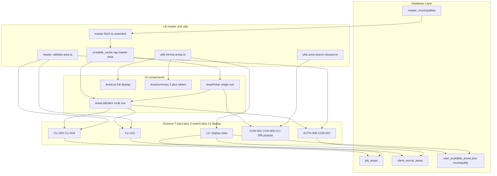
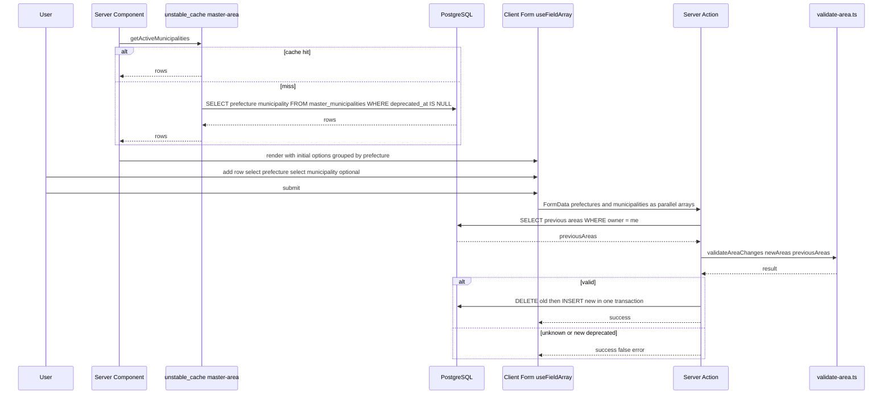
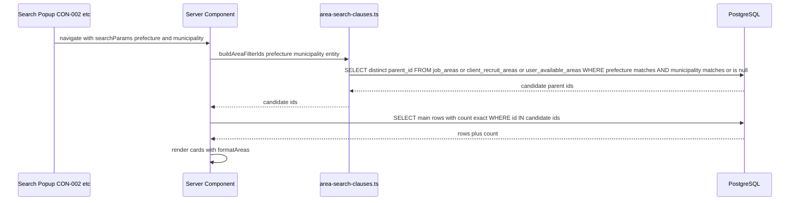
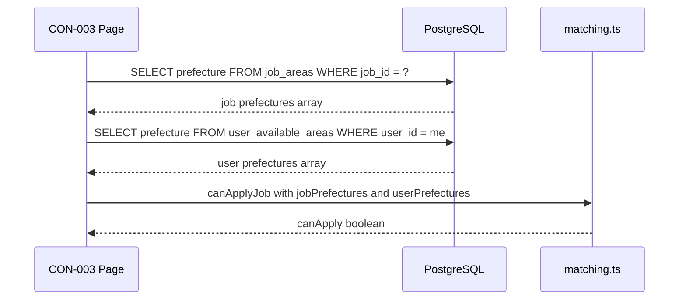
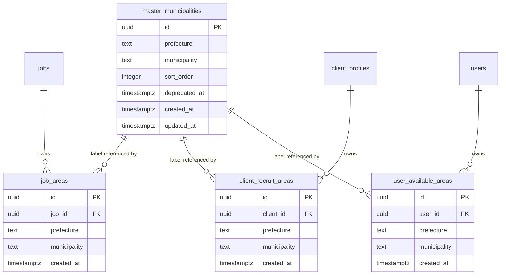

# Technical Design — master-area

> **クロスリファレンス (master-area-multi-select)**: 本仕様の UI モデル (Phase 9 で投入された旧 `AreaPicker` / `AreaListEditor` `AreaDraft[]` 構造) は別 spec `.kiro/specs/master-area-multi-select/` でマルチ選択型 UI (1 行 = 1 県 + N 市区町村 / または県全域) に刷新済み。本 spec の **DB スキーマ** / **RPC** (`replace_user_areas` / `replace_job_areas` / `replace_client_recruit_areas`) / **上位包含検索ビルダー** (`buildAreaFilterIds`) / **マッチング判定** (`canApplyJob`) / **マスタ整合性検証** (`validateAreaChanges`) / **表示コンポーネント** (`AreaList` / `AreaSummary` / `formatAreas*`) は multi-select 側で**無変更**で踏襲されている。UI 部品 (`AreaListEditor` / `SearchAreaPicker` / `AreaRow` / `expandAreasForDb` / `collapseAreasFromDb` / 共通 Zod `areaRowsSchema`) は multi-select spec を参照。

## Overview

**Purpose**: 既存「都道府県」粒度の住所運用を「都道府県 + 市区町村」粒度へ拡張する。総務省「市町村コード・特別区コード」(令和6年1月1日版) 由来の **1,898 件**を `master_municipalities` マスタに収め、案件・受注者対応エリア・発注者募集エリア・検索フィルタを統一的にこの粒度で扱う。マッチング判定（無料受注者の応募制限）は互換性維持のため都道府県のままとし、市区町村は表示・検索専用とする。

**Users**: 受注者（市区町村単位で対応エリアを宣言）/ 発注者（市区町村単位で募集エリア・案件現場を宣言）/ 検索者（全ロール、上位包含で取りこぼしなく絞り込み）。~~個人住所 `users.prefecture` はプライバシー観点で都道府県のまま据え置く。~~ → **【residence-municipality 2026-06-05 で変更】お住まい（個人居住地）も `users.municipality` を新設し市区町村まで対応**（Req 9 撤回）。

**Impact**: マイグレーション 4 本 + 約 20 ファイル（`grep -rln 'job\.prefecture\|jobPrefecture\|recruit_area'` 実測 19 ファイル + テスト関連） / 7 画面の入力 UI 改修 / 19 箇所の表示更新 / 検索クエリの post-filter → server-filter 移行。既存スキーマからの旧カラム（`jobs.prefecture` / `client_profiles.recruit_area`）削除と新テーブル（`master_municipalities` / `job_areas` / `client_recruit_areas`）追加を伴う一気移行。`user_available_areas.municipality` カラム追加で受注者側も対称化。後方互換コードは持ち込まない。

### Goals

- `master_municipalities (prefecture, municipality, deprecated_at)` マスタを 1,898 件で導入し、master-skills と同じ `deprecated_at` 運用パターンで管理
- 案件エリアを `job_areas` で正規化、1 案件最大 10 件・県跨ぎ可能・全域 NULL 表現を許可
- 発注者募集エリア `client_profiles.recruit_area TEXT[]` を廃止し `client_recruit_areas` に正規化
- 受注者対応エリア `user_available_areas` に `municipality` カラム追加で対称化
- 検索 3 画面（CON-002 / CON-005 / CLI-005）で「都道府県 + 市区町村」階層フィルタを `EXISTS` サブクエリで実装、上位包含ルール（県のみ検索 = 全市区町村ヒット、県 + 市区町村検索 = 同県全域指定もヒット）を保証
- 入力 7 画面で `AreaPicker` / `AreaListEditor` 共通コンポーネントを統一利用
- 表示は `formatAreas()` ヘルパで「主要 3 件 + 他 N エリア」省略表記・「東京都（港区ほか）」混在表現を統一
- マッチング判定 `src/lib/matching.ts` は都道府県マッチのまま据え置き

### Non-Goals

- マッチング判定ロジックの市区町村レベル拡張（互換性維持）
- 個人住所 `users.prefecture` の市区町村化（プライバシー観点）
- マスタ管理専用 admin UI（SQL マイグレーションで運用、将来必要なら別 spec）
- 総務省データの自動同期（必要時に手動マイグレーション）
- 市町村合併の自動検知（都度手動対応、`deprecated_at` で論理削除）
- 海外住所対応、郵便番号・経緯度・地理空間検索
- スカウト送信（CLI-014 / CLI-015）へのエリアフィルタ追加（現状未使用）
- PNG デザインカンプの先行更新（実装完了後にまとめて差し替え）

## Architecture

### Existing Architecture Analysis

**保持する既存パターン**:

- Next.js App Router + Server Component デフォルト、変更操作は Server Actions、`{ success, error, data }` 戻り値
- `src/lib/supabase/anon.ts`（cookieless server client）+ `unstable_cache` でマスタ取得（master-skills 既存 + `master-area` タグ追加）
- `master_*` マスタテーブルパターン（最小スキーマ `id, label, deprecated_at, created_at, updated_at` + RLS で anon SELECT 全開、INSERT/UPDATE/DELETE は service_role のみ）
- Zod スキーマでクライアント・サーバ二重バリデーション
- RLS は親リソース連動（`organizations` 等への `is_same_org` パターン）。SECURITY DEFINER 関数は `SET search_path = public`
- URL `searchParams` を検索状態の Single Source of Truth とする
- joined テーブルの絞り込みは ID 集合の積で AND を取り、メインクエリは `.in('id', ids)` で渡す（CLI-005 パターン）

**置き換える既存資産**:

- `jobs.prefecture text` カラム — 廃止、`job_areas (job_id, prefecture, municipality)` に移行
- `client_profiles.recruit_area text[]` カラム — 廃止、`client_recruit_areas (client_id, prefecture, municipality)` に移行
- `user_available_areas` テーブル — スキーマ拡張、`municipality text NULL` カラム追加
- 検索フォーム単一プルダウン（都道府県のみ）— `AreaPicker` 2 段プルダウンに置換
- **AUTH-006 の現状 Checkbox 47件グリッド UI**（受注者対応エリア入力）— `AreaListEditor` Popup 形式に統一して COM-002 と同形式にする（Req 2-8）
- `clients/page.tsx`（CON-005）の `.overlaps("client_profiles.recruit_area", [prefecture])` 直接フィルタ — `EXISTS` 経由の ID 候補集合パターンに置換

**維持する既存資産（誤って削除しないこと）**:

- ~~`jobs.address text(200)` カラム — エリアフィールド（`job_areas`）とは別管理で、CLI-004 の「勤務地」自由入力欄（番地以下の詳細住所）として現状維持する（Req 4-8）。Migration 4 の `DROP COLUMN` 対象は `jobs.prefecture` のみ~~
  - **【廃止 / superseded by work-location-address-fix, 2026-06-02】** `jobs.address` は DROP 済。詳細住所は `applications.work_location`（応募レベル、CLI-009 入力・成立した受注者にのみ表示）に一本化。
- ~~`users.prefecture text` カラム — 個人住所（プライバシー観点で都道府県のまま据え置き、Req 9）。AUTH-006 / COM-002 の「お住まい」フィールドは単一プルダウンのまま~~
  - **【変更 / residence-municipality, 2026-06-05】** Req 9 撤回。`users.municipality`（nullable）を新設。AUTH-006 / COM-002 の「お住まい」は `<ResidencePicker>`（都道府県 Select → 市区町村 Select の2段、市区町村は任意）に変更。表示は `formatResidence(prefecture, municipality)`

**新規依存**: なし。cmdk・shadcn・Radix UI は master-skills で導入済み。

### Architecture Pattern & Boundary Map



**Architecture Integration**:

- **Selected pattern**: 「マスタ参照は lib 層に局所化、UI は単一目的の 4 部品（AreaPicker / AreaListEditor / AreaList / AreaSummary）」。検索クエリは ID 候補集合パターンで `count` とページネーションの破綻を回避（research.md R-C 参照）
- **Domain/feature boundaries**: `src/lib/master/fetch.ts` 拡張がマスタ I/O の単一窓口。`src/lib/utils/format-areas.ts` が表示の単一窓口。`src/lib/utils/area-search-clauses.ts` が検索クエリ構築の単一窓口
- **Existing patterns preserved**: master-skills の `unstable_cache` + `'master-area'` タグ、`validateLabelChanges` 型 delta 検証、Zod スキーマ二重バリデーション、URL searchParams ベース検索状態管理、RLS + Middleware 二重防御
- **New components rationale**: `AreaPicker`（都道府県+市区町村連動の単一行入力）/ `AreaListEditor`（`useFieldArray` ベースの 1〜10 行動的編集）/ `AreaList`（詳細画面の全件展開表示）/ `AreaSummary`（カード共通の「主要 3 件 + 他 N エリア」省略表示）
- **Steering compliance**: `database-schema.md`「マスタテーブル参照」/ `security.md`「RLS ファースト」/ `tech.md`「サーバーコンポーネント優先」/ `implementation-notes.md` の落とし穴ルール（CLI-005 post-filter 禁止、`mode: 'submit'` 暗黙発火、SECURITY DEFINER search_path 等）を遵守

### Technology Stack

| Layer | Choice / Version | Role in Feature | Notes |
|-------|------------------|-----------------|-------|
| Frontend | Next.js 16 (App Router) | Server Component で初期描画、Client Component は入力フォームのみ | 既存スタック |
| UI | shadcn/ui + `radix-ui` + Tailwind v4 | Select / Popover / Combobox / Button | 既存 |
| Combobox | `cmdk@^1` | 市区町村のインクリメンタル検索 | master-skills で導入済 |
| Forms | React Hook Form + Zod | `useFieldArray` で動的エリア行管理 | 既存 |
| Caching | `unstable_cache` + `revalidateTag('master-area')` | マスタ全件キャッシュ TTL 3600s | 新規タグ `master-area` |
| Backend | Server Actions | エリア書き込み + マスタ整合性検証 | 既存 |
| Data | PostgreSQL (Supabase) + RLS | `master_municipalities` / `job_areas` / `client_recruit_areas` + `user_available_areas` 拡張 | 拡張 |
| Index | B-tree on `(prefecture, municipality)` 部分 idx + GIN なし（配列カラムを使わないため） | 検索高速化 | 新規 |
| Tests | Vitest / Playwright / pgTAP | 各層 | 既存 |

`pg_trgm`・GIN・三角法・地理空間拡張は採用しない（市区町村は完全一致のみ、検索は `EXISTS` で十分高速）。

## System Flows

### マスタ取得 + AreaListEditor 入力 + 保存フロー（書き込みパス）



### 検索クエリビルダー（読み取りパス）



検索ロジックの詳細:

- ユーザーが「都道府県のみ」指定: `prefecture = ?`（municipality 条件なし）→ 同県内の市区町村未指定・指定済みすべてヒット（Req 6-1）
- ユーザーが「都道府県 + 市区町村」指定: `prefecture = ? AND (municipality = ? OR municipality IS NULL)` → 該当市区町村 + 同県全域指定がヒット（Req 6-2 = 上位包含）
- 異なる都道府県のレコードは絶対にヒットしない（R6 ガード）

### 応募可否判定（判定ロジック互換性維持 + シグネチャ配列拡張）

`canApplyJob` の **判定ロジック**（都道府県のみ比較、市区町村は無視）を維持しつつ、**入力シグネチャ**は `jobPrefecture: string` → `jobPrefectures: string[]` に拡張する（後述「Components > matching.ts」参照）。呼び出し元は `job_areas` から `SELECT DISTINCT prefecture` で取得した配列を渡し、いずれか 1 つでも受注者の `user_available_areas.prefecture` と一致すれば応募可能。判定ロジックは無料受注者の応募制限のみで使われ、市区町村は無視する（Req 7）。



`canApplyJob` のシグネチャは `jobPrefecture: string` → `jobPrefectures: string[]` に拡張（後述「Components / matching.ts」）。配列 OR 一致のセマンティクスは master-skills の `jobTradeTypes` 拡張と同パターン。

## Requirements Traceability

| Requirement | Summary | Components | Interfaces | Flows |
|-------------|---------|------------|------------|-------|
| 1.1–1.9 | マスタ管理 (`master_municipalities`) | Migration 1 / `master/fetch.ts` 拡張 | `getActiveMunicipalities()` / `getActiveMunicipalitiesByPrefecture()` / `getAllMunicipalityRows()` | 書き込みパス |
| 2.1–2.10 | 受注者対応エリア市区町村化 | Migration 2 / `user_available_areas` 拡張 / `profile-edit-form.tsx` / `register-profile-form.tsx` / `AreaListEditor` | `userAreaSchema` / `validateAreaChanges` | 書き込みパス |
| 3.1–3.7 | 発注者募集エリア市区町村化 | Migration 2 / `client_recruit_areas` / `client-profile-edit-form.tsx` / `AreaListEditor` | `clientRecruitAreaSchema` | 書き込みパス |
| 4.1–4.9 | 案件複数エリア（最大10件・県跨ぎ） | Migration 2 / `job_areas` / `enforce_job_areas_max` トリガー / `job-form.tsx` / `AreaListEditor` | `jobAreaSchema` (min 1, max 10) | 書き込みパス |
| 5.1–5.6 | 表示統一 | `utils/format-areas.ts` / `AreaList` / `AreaSummary` | `formatAreas()` / `<AreaList>` / `<AreaSummary>` | 表示 |
| 6.1–6.7 | 検索フィルタ上位包含 | `utils/area-search-clauses.ts` / 検索 3 画面 / `AreaPicker` | `buildAreaFilterIds()` / URL searchParams | 検索クエリビルダー |
| 7.1–7.4 | 応募制限維持 | `matching.ts` 拡張 / `search-actions.ts` | `canApplyJob({ jobPrefectures, ... })` | 応募可否判定 |
| 8.1–8.9 | 既存データ移行 + 旧カラム削除 | Migrations 1–4 / `seed.sql` 再構築 | — | Migration Strategy |
| 9.1–9.3 | 個人住所スコープ外 | — | — | コード変更なし |
| 10.1–10.5 | マスタ取得・キャッシュ・UI 共通化 | `master/fetch.ts` 拡張 / `AreaPicker` / `AreaListEditor` | `getActiveMunicipalities*()` / Combobox Props | 書き込みパス |
| 11.1–11.5 | RLS ポリシー | Migration 1 / Migration 2 / pgTAP | RLS policies | — |
| 12.1–12.5 | テスト | pgTAP / Vitest / Playwright | — | — |
| 13.1–13.5 | ドキュメント波及 | CLAUDE.md / steering / 5 spec | — | — |

## Components and Interfaces

| Component | Domain/Layer | Intent | Req Coverage | Key Dependencies (P0/P1) | Contracts |
|-----------|--------------|--------|--------------|--------------------------|-----------|
| Migration 1 | DB | `master_municipalities` 作成 + 1,898 件シード + RLS + index | 1, 11 | PostgreSQL (P0) | — |
| Migration 2 | DB | `job_areas` / `client_recruit_areas` 作成、`user_available_areas.municipality` 追加、`enforce_job_areas_max` トリガー、RLS、複合 index | 2, 3, 4, 8, 11 | Migration 1 (P0) | — |
| Migration 3 | DB | 既存データ移行（DML） | 8 | Migration 2 (P0) | — |
| Migration 4 | DB | 旧カラム DROP + `idx_jobs_search` 再構築 | 8 | Migration 3 (P0) | — |
| `scripts/build-master-municipalities-inserts.ts` | Tools | CSV → SQL INSERT 生成 | 1.2 | Node.js fs (P0), `tmp/master-area-research/municipalities.csv` (P0) | Batch |
| `master/fetch.ts`（拡張） | Lib / Data | 市区町村マスタ取得 + キャッシュ | 1, 10 | `supabase/anon.ts` (P0), `unstable_cache` (P0) | Service |
| `master/validate-area.ts` | Lib / Validation | `(prefecture, municipality)` ペアの存在検証 + delta チェック | 2.10, 3.7, 4.9 | `master/fetch.ts` (P0) | Service |
| `utils/format-areas.ts` | Lib / Display | エリア表示の単一窓口 | 5 | — | Service |
| `utils/area-search-clauses.ts` | Lib / Query | 上位包含クエリの parent_id 集合取得 | 6 | `supabase/server.ts` (P0) | Service |
| `matching.ts`（拡張） | Lib / Domain | 配列 OR 一致応募可否判定（県のみ） | 7, 8.9 | — | Service |
| `AreaPicker` | UI / Input | 都道府県 + 市区町村の単一行入力 | 2.3, 3.3, 6.3, 10.4 | `master/fetch.ts` (P0), `MasterCombobox` (P1) | State |
| `AreaListEditor` | UI / Input | 動的エリア行追加・削除（job_areas 等） | 2, 3, 4, 10.5 | `AreaPicker` (P0), react-hook-form (P0) | State |
| `AreaList` | UI / Display | 詳細画面の全件展開表示 | 5.4 | `utils/format-areas.ts` (P0) | — |
| `AreaSummary` | UI / Display | カードの「主要 3 件 + 他 N エリア」省略表示 | 5.3 | `utils/format-areas.ts` (P0) | — |

### Lib

#### master/fetch.ts（拡張）

| Field | Detail |
|-------|--------|
| Intent | 既存 master-skills 取得関数に `master_municipalities` 用エントリポイントを追加 |
| Requirements | 1.1, 1.4, 1.5, 10.1, 10.2 |

**Responsibilities & Constraints**

- 既存 `unstable_cache` パターンに `'master-area'` タグで 3 つの新キーを追加（active / per-prefecture / all）
- `getActiveMunicipalities()` は全件 1 キャッシュ。`getActiveMunicipalitiesByPrefecture(prefecture)` はその in-memory フィルタの薄いラッパー
- 内部は cookieless anon client。`createServerClient` は使わない（既存制約）
- 取得失敗時は空配列フォールバック

**Dependencies**

- Outbound: `supabase/anon.ts` の `createAnonClient()` — (P0)
- Outbound: Next.js `unstable_cache` / `revalidateTag` — (P0)
- External: master-skills の既存 `'master-skills'` タグとは別タグ `'master-area'` で独立無効化可能

**Contracts**: Service [x]

##### Service Interface

```typescript
export interface MunicipalityRow {
  prefecture: string;
  municipality: string;
  deprecated_at: string | null;
}

// 表示候補（deprecated_at IS NULL のみ）
export function getActiveMunicipalities(): Promise<
  Array<{ prefecture: string; municipality: string }>
>;

// 都道府県別のサブセット（in-memory フィルタ）
export function getActiveMunicipalitiesByPrefecture(
  prefecture: string,
): Promise<string[]>;

// 廃止判定用（全件、deprecated 含む）
export function getAllMunicipalityRows(): Promise<MunicipalityRow[]>;
```

- Preconditions: `prefecture` は 47 都道府県のいずれか（バリデーションは呼び出し側）
- Postconditions: 返却配列は団体コード順（`master_municipalities.sort_order` カラム or `id` 順）を維持
- Invariants: キャッシュキーは `['master-area', 'municipalities', 'active' | 'all']`、TTL 3600s、tag `'master-area'`

**Implementation Notes**

- Integration: Server Component から直接 await。`AreaPicker` / `AreaListEditor` に props で注入
- Validation: クエリは固定 SELECT、SQL injection 余地なし
- 失敗時フォールバック: 空配列 → UI 側で「候補を取得できませんでした」表示（Combobox は disabled）
- Risks: `'master-area'` タグの無効化タイミングを誤ると古いマスタが残る。`revalidateTag` は SQL マイグレーション後に手動実行する手順を tasks.md に明記（master-skills と同方針）

#### master/validate-area.ts

| Field | Detail |
|-------|--------|
| Intent | 保存系 Server Action 層で `(prefecture, municipality)` ペアがマスタに存在 (active) であることを検証 |
| Requirements | 2.10, 3.7, 4.9 |

**Responsibilities & Constraints**

- `(prefecture, municipality)` の **タプル** で一致を確認（`municipality IS NULL` も合法、Req 2-5 / 3-4 / 4-7）
- 既存保有の deprecated は保持を許可（master-skills の `validateLabelChanges` と同セマンティクス）
- delta 計算: `added = newAreas - previousAreas`、added のみを active 必須でチェック

##### Service Interface

```typescript
export interface AreaTuple {
  prefecture: string;
  municipality: string | null;
}

export type ValidateAreaChangesResult =
  | { valid: true }
  | {
      valid: false;
      unknownPairs: AreaTuple[];     // master に存在しない (prefecture, municipality)
      deprecatedPairs: AreaTuple[];  // master にあるが deprecated（新規追加分のみ報告）
    };

/**
 * 保存時のエリア変更を検証する。
 *
 * - `(prefecture, municipality)` をタプルキーとして delta 計算
 * - `municipality: null` の組み合わせは "県全域" として常に valid（マスタ照合不要、prefecture が 47 都道府県のいずれかであることだけ別途バリデーション）
 * - previousAreas に含まれていた deprecated は保持を許可
 *
 * @param newAreas       フォーム送信値（trim 済み・空除外済み）
 * @param previousAreas  保存直前に DB から SELECT した現値
 */
export function validateAreaChanges(
  newAreas: AreaTuple[],
  previousAreas: AreaTuple[],
): Promise<ValidateAreaChangesResult>;

/** prefecture が PREFECTURES 定数に含まれることを確認（軽量チェック） */
export function isKnownPrefecture(prefecture: string): boolean;
```

- Preconditions: `newAreas` / `previousAreas` は trim 済み、空文字 prefecture を含まない、`municipality === ""` は `null` に正規化済み
- Postconditions: `valid === false` のとき UI 表示メッセージは Server Action 側で組み立て（例: `"対応エリア「東京都 港区」が見つかりません"`）

**Implementation Notes**

- Integration: 保存系 4 件の Server Action（COM-002 / register/profile / CLI-021 / job create-edit）が submit 時に呼ぶ
- 内部実装は `getAllMunicipalityRows()` の `unstable_cache` を使った in-memory チェック。追加 DB ラウンドトリップなし
- Risks: `previousAreas` の取得忘れで「新規登録ルートとして扱われ既存 deprecated が拒否される」事故 → master-skills と同じく Server Action テンプレートで「保存直前 SELECT」を強制

#### utils/format-areas.ts

| Field | Detail |
|-------|--------|
| Intent | エリア表示の単一窓口。カード省略・詳細展開・混在表現を一手に引き受ける |
| Requirements | 5.1, 5.2, 5.3, 5.5, 5.6 |

##### Service Interface

```typescript
export interface AreaForDisplay {
  prefecture: string;
  municipality: string | null;
}

export interface FormatAreasOptions {
  maxVisible?: number;     // default Infinity（詳細画面）/ 3（カード）
  showOthers?: boolean;    // default true（"他 N エリア" 表示）
  separator?: string;      // default "、"
}

/**
 * エリア配列を表示文字列に整形する。
 *
 * - `municipality === null` → "{prefecture}（市区町村未指定）"
 * - `municipality !== null` → "{prefecture}{municipality}"（連結、Req 5-1）
 * - 同県の県全域 + 市区町村混在 → "{prefecture}（{municipality1}・{municipality2}ほか）"（Req 5-6）
 * - `maxVisible` を超える場合は末尾に "他 N エリア"
 */
export function formatAreas(
  areas: AreaForDisplay[],
  options?: FormatAreasOptions,
): string;

/** カード用ショートカット（maxVisible = 3） */
export function formatAreasShort(areas: AreaForDisplay[]): string;

/** 詳細画面用ショートカット（全件展開、混在吸収あり） */
export function formatAreasLong(areas: AreaForDisplay[]): string;
```

- Preconditions: `areas` は重複を含んでもよい（内部で `(prefecture, municipality)` キーで dedupe）
- Postconditions: 戻り値は空配列入力時 `"未設定"` ではなく空文字 `""`。呼び出し側で fallback 文言を出す

**Implementation Notes**

- Integration: `AreaSummary` / `AreaList` 内部で使用。8+ の表示箇所はこれらコンポーネント経由で間接使用
- Validation: 113 件相当のユニットテスト（県のみ / 県＋市区町村 / 同県混在 / 4 件超 / 0 件）
- Risks: 「同県全域 + 同県市区町村」混在の表現ルール（Req 5-6）が要件のあいまい箇所。本 design では「{prefecture}（{municipality 列挙 max 2 件}ほか）」と確定（research.md R3 参照）

#### utils/area-search-clauses.ts

| Field | Detail |
|-------|--------|
| Intent | 上位包含ルールに従う検索クエリの parent_id 候補集合を返す |
| Requirements | 6.1, 6.2, 6.5, 6.6 |

##### Service Interface

```typescript
export type AreaSearchableEntity = "job" | "client" | "user";

export interface BuildAreaFilterIdsParams {
  entity: AreaSearchableEntity;     // "job" → job_areas, "client" → client_recruit_areas, "user" → user_available_areas
  prefecture: string | null;        // null なら絞り込みなし
  municipality: string | null;      // null = 市区町村絞り込みなし（県のみ検索）
  supabase: SupabaseClient;         // server client
}

/**
 * 与えられた entity の parent_id 集合を返す（上位包含ルール適用済み）。
 *
 * - prefecture = null / municipality = null: 全 parent_id（無絞り込み → null を返してメインクエリ側でスキップ）
 * - prefecture != null / municipality = null: 同県内の全レコード（municipality 制約なし）
 * - prefecture != null / municipality != null: 同県の (municipality = ? OR municipality IS NULL)
 *
 * 異なる都道府県のレコードは絶対に含めない（R6 ガード）。
 */
export function buildAreaFilterIds(
  params: BuildAreaFilterIdsParams,
): Promise<string[] | null>;
```

- Returns `null` when no filter applied（呼び出し側で `.in('id', ids)` を skip すべき合図）
- Returns 空配列 when filter applied but no match（呼び出し側は `0` 件として処理）
- Postconditions: 返却 ID 集合は重複なし

**Implementation Notes**

- Integration: CON-002（jobs 検索）/ CON-005（clients 検索）/ CLI-005（contractors 検索）の 3 Server Component で使用
- Validation: `EXISTS` ではなく `SELECT DISTINCT parent_id FROM area_table WHERE ...` で実装（CLI-005 の ID-intersection パターン準拠、`count: 'exact'` が壊れない、research.md R-C）
- Multi-condition AND: 複数フィルタ（職種 × エリア × 言語等）と組み合わせる場合、各フィルタの ID 集合の **積** をメインクエリ前に取り `.in('id', intersect)` で渡す。既存 CLI-005 ロジックを準用
- Risks: 1 都道府県の市区町村数が多い県（北海道 194 件・東京都 62 件）でも `SELECT DISTINCT parent_id` のオフセットは小さく、複合インデックス `(prefecture, municipality)` で O(log N)

#### matching.ts（拡張）

| Field | Detail |
|-------|--------|
| Intent | `jobPrefecture: string` を `jobPrefectures: string[]` に拡張し、配列 OR 一致で判定 |
| Requirements | 7.1, 7.2, 8.9 |

##### Service Interface

```typescript
export interface CanApplyJobParams {
  userRole: "contractor" | "client" | "staff";
  isPaidUser: boolean;
  jobTradeTypes: string[];
  jobPrefectures: string[];   // 旧 jobPrefecture: string から拡張
  userSkills: Array<{ tradeType: string }>;
  userAvailableAreas: Array<{ prefecture: string }>;  // municipality は無視（Req 7-3）
}

export function canApplyJob(params: CanApplyJobParams): CanApplyJobResult;
```

- Preconditions: `jobPrefectures.length >= 1`（Req 4-5 で 1 案件最低 1 件）
- Postconditions: `isPaidUser === true` なら無条件 canApply。それ以外は職種マッチ AND 「`jobPrefectures.some(p => userAreas.some(a => a.prefecture === p))`」で判定
- Invariants: `municipality` フィールドは入力に含めない（互換性維持、Req 7-1/7-3）

**Implementation Notes**

- Integration: `search-actions.ts` の `applyJobAction` で `job.prefecture` 単一 SELECT を `job_areas.prefecture` の DISTINCT 配列に置換
- `userAvailableAreas` は `municipality` カラムが追加されてもこの関数では prefecture だけ参照（重複排除は呼び出し側）
- Risks: 同案件の `job_areas` が多県跨ぎの場合、配列 OR で判定するため受注者対応県と 1 県でも一致すれば応募可能。これは「県跨ぎ案件は対応県の受注者全員に開く」という設計意図と一致

### UI

#### AreaPicker

| Field | Detail |
|-------|--------|
| Intent | 都道府県 `<Select>` + 市区町村 `MasterCombobox` の 2 段プルダウン（単一値入力） |
| Requirements | 2.3, 2.4, 3.3, 6.3, 6.4, 10.4 |

**Responsibilities & Constraints**

- 都道府県は 47 件固定の `<Select>`（cmdk 不要、件数小）
- 市区町村は選択された都道府県でフィルタした候補を `MasterCombobox` に流す
- 都道府県未選択時は市区町村側を `disabled`（Req 2-4 / 6-4）
- 市区町村は任意（未選択 = `null` = 「県内全域」のセマンティクス、Req 2-5 / 3-4 / 4-7）
- 検索ポップアップ・入力フォームで共用

##### Component Props

```typescript
// AreaDraft は AreaListEditor / AreaPicker の両方で使う共通ドラフト型
// （定義は「AreaListEditor > 型整合方針」セクション参照）
// AreaListEditor は AreaDraft[] で行管理、AreaPicker は AreaDraft 1 件を扱う
// 保存時に Zod refine で AreaTuple[] に絞り込む

export interface AreaPickerProps {
  value: AreaDraft;
  onChange: (next: AreaDraft) => void;
  municipalitiesByPrefecture: Record<string, string[]>;  // Server Component から JSON シリアライズで注入。クライアント側で必要なら useMemo で Map 化
  disabled?: boolean;
  prefectureLabel?: string;        // default "都道府県"
  municipalityLabel?: string;      // default "市区町村（任意）"
  id?: string;
}
```

- Preconditions: `municipalitiesByPrefecture` は active マスタのみ
- Postconditions: 都道府県を変更すると `municipality` は `null` にリセットされる（不整合防止）

##### Form Integration Map

| 画面 ID | 画面名 | 配置 | value の意味 |
|---------|--------|------|------------|
| CON-002 / CON-005 / CLI-005 popup | 検索 | 単一 AreaPicker | URL searchParams から復元 |
| AUTH-006 / COM-002 | 受注者プロフィール | `AreaListEditor` 内の各行 | フォーム state の `availableAreas: AreaTuple[]` 各要素 |
| CLI-021 | 発注者情報編集 | `AreaListEditor` 内の各行 | フォーム state の `recruitArea: AreaTuple[]` 各要素 |
| CLI-003 / CLI-004 | 案件編集 / 新規作成 | `AreaListEditor` 内の各行 | フォーム state の `areas: AreaTuple[]` 各要素 |

**Implementation Notes**

- Integration: react-hook-form の `Controller` で包んで使う（`AreaListEditor` 経由 or 検索画面で直接）
- Validation: 都道府県未選択で市区町村だけ入力された状態は UI レベルで阻止（disabled）
- IME: master-skills の `MasterCombobox` 既存対応をそのまま継承
- Risks: 政令市本体（横浜市・大阪市等）が候補にない件は R5 のとおりユーザー誘導で対応。`placeholder` に「市区町村は任意（県全域でも検索可）」と明示

#### AreaListEditor

| Field | Detail |
|-------|--------|
| Intent | `useFieldArray` ベースで 1〜N 件のエリア行を動的編集 |
| Requirements | 2.7, 2.8, 3.6, 4.4, 4.5, 4.6, 10.5 |

**Responsibilities & Constraints**

- 行ごとに `AreaPicker` を表示、右上「×」で削除ボタン
- 最下部に「+ エリアを追加」ボタン
- `minItems` / `maxItems` props で件数制限（job: minItems=1 maxItems=10 / user: minItems=1 / client: minItems=1 / 検索は単発 = AreaListEditor を使わず素の AreaPicker）
- `softCapWarning` props で 30 件超の警告表示制御（Req 2-7 / 3-6）
- 削除ボタンは `minItems` 件数到達時 disabled

##### AreaPicker と AreaListEditor の型整合方針（必ず守ること）

UI 層は `AreaDraft`（`prefecture: string | null`）で「未選択ドラフト」状態を表現する一方、`master/validate-area.ts` の `AreaTuple` は `prefecture: string` で「保存可能な確定状態」のみを表す。両者の整合は以下の方針で実装する:

- **AreaListEditor の内部 state は `AreaDraft[]` 型で持つ**:
  ```typescript
  export interface AreaDraft {
    prefecture: string | null;     // 未選択は null
    municipality: string | null;
  }
  ```
- AreaPicker は AreaDraft 1 行を受け取り `onChange(next: AreaDraft)` を返す。AreaListEditor は AreaDraft[] のまま親フォーム（react-hook-form）と双方向バインド
- **保存時に Zod refine で AreaTuple[] に絞り込む**: Server Action 受信側の Zod スキーマで `z.array(z.object({prefecture: z.string().min(1), municipality: z.string().nullable()}))` を使い、prefecture が null / 空文字の行を `.refine` または `.filter` で除外
- `value: AreaDraft[]` props と外部公開型 `AreaTuple[]`（validate-area / RPC 入力）の変換責任は **AreaListEditor の親フォーム submit ハンドラ** が持つ
- AreaListEditor は「未選択行を含むドラフト」を表現でき、Server Action は「prefecture 必須の確定タプル」のみ受け取るため両者の関心を分離できる

##### Component Props

```typescript
export interface AreaListEditorProps {
  value: AreaDraft[];                                  // フォーム state と双方向バインド（AreaDraft でドラフト状態を許容）
  onChange: (next: AreaDraft[]) => void;
  municipalitiesByPrefecture: Record<string, string[]>; // Server Component から JSON で注入。AreaPicker に素通し
  minItems: number;                                     // default 1
  maxItems?: number;                                    // default Infinity（job のみ 10）
  softCapWarning?: number;                              // default 30、超えた時点で警告表示
  addLabel?: string;                                    // default "+ エリアを追加"
  emptyLabel?: string;                                  // default "エリアを 1 つ以上追加してください"
}
```

- Preconditions: `value.length >= 0`（初期空も許容、最初の 1 行は内部で自動追加）
- Postconditions: `onChange` 後の `value.length >= minItems`
- Invariants: `maxItems` 到達時「+ エリアを追加」ボタンは非活性

**Implementation Notes**

- Integration: react-hook-form の `useFieldArray<{prefecture: string | null; municipality: string | null}>` で AreaDraft[] を直接管理。submit 時に Zod が `.refine` で prefecture 空行を弾き、有効行のみ Server Action に渡す
- Validation: 親フォームの Zod スキーマで `min(1) / max(10)` を二重に保証（UI 上の disabled + サーバ Zod）。Zod 内で `prefecture: z.string().min(1, "都道府県を選択してください")` で未選択行を reject
- SP レスポンシブ: `flex flex-col gap-3`、行内は `flex flex-col gap-2`（都道府県 → 市区町村 → 削除ボタンの順）、PC でも縦並びを維持（R1 / R2）
- Risks: 10 件上限到達後にユーザーが「+ エリアを追加」を連打した場合、ボタン disabled で UI 上ブロック。サーバ側でも `enforce_job_areas_max` トリガーで二重防御

#### AreaList / AreaSummary

```typescript
export interface AreaListProps {
  areas: AreaForDisplay[];
  emptyLabel?: string;                          // default "エリア未設定"
}

export interface AreaSummaryProps {
  areas: AreaForDisplay[];
  maxVisible?: number;                          // default 3
  emptyLabel?: string;
}
```

- `AreaList`: `formatAreasLong(areas)` を `<p>` で表示。0 件で `emptyLabel`
- `AreaSummary`: `formatAreasShort(areas)` を `<span>` で表示、4 件以上で末尾「他 N エリア」

**Implementation Notes**

- 表示画面が 12+ ファイル（`grep -rln "job\.prefecture"` 実測 + recruit_area / user_available_areas 経由）あるため必ずこの 2 部品に統一する（手書きで `slice(0,3).join('、')` を散らさない）
- カード（CON-002 ジョブカード等）は `AreaSummary`、詳細画面（CON-003, CLI-002, CLI-006, COM-001 等）は `AreaList`

### Server Actions

| Action | File | Changes |
|--------|------|---------|
| Profile save | `profile/edit/actions.ts` | `availableAreas: string[]` を `availableAreas: AreaTuple[]` に変更。Zod スキーマ更新、保存直前に `user_available_areas` を SELECT → `validateAreaChanges` → DELETE old + INSERT new を 1 トランザクション（RPC or admin client） |
| Register profile | `(auth)/register/profile/actions.ts` | 同上、新規登録ルート（previousAreas=[]） |
| Client profile save | `mypage/client-profile/actions.ts` | `recruitArea: string[]` → `recruitArea: AreaTuple[]`。`client_profiles.recruit_area` 書き込みは廃止、`client_recruit_areas` への DELETE + INSERT に置き換え |
| Job create / edit | `jobs/actions.ts` | `prefecture: string` を `areas: AreaTuple[]` に変更（`min(1) max(10)`）。`jobs.prefecture` 書き込みは廃止、`job_areas` への DELETE + INSERT。`job_areas` 件数は DB トリガーで二重防御 |
| Apply job | `jobs/search-actions.ts` | `job.prefecture` 単一 SELECT を `job_areas.prefecture` 配列 SELECT に変更し `canApplyJob({ jobPrefectures })` に渡す |

すべての保存系で「DELETE old + INSERT new」パターン（master-skills の `user_skills` 全置換と同型）。1 トランザクションで実行するため Server Action 内では `supabase.rpc('replace_user_areas', ...)` のような RPC を新設するか、admin client で `.delete()` → `.insert()` を直列実行する。本 design では RPC 案を採用：

```sql
-- Migration 2 で同梱する RPC（owner 自己書き込み専用、SECURITY INVOKER で RLS 経由）
CREATE OR REPLACE FUNCTION replace_user_areas(p_user_id uuid, p_areas jsonb)
RETURNS void
LANGUAGE plpgsql
SECURITY INVOKER
SET search_path = public
AS $$
BEGIN
  DELETE FROM user_available_areas WHERE user_id = p_user_id;
  INSERT INTO user_available_areas (user_id, prefecture, municipality)
  SELECT p_user_id, (elem->>'prefecture')::text, NULLIF(elem->>'municipality', '')
  FROM jsonb_array_elements(p_areas) AS elem;
END;
$$;
```

`replace_job_areas(p_job_id, p_areas)` / `replace_client_recruit_areas(p_client_id, p_areas)` も同パターンで作成。RPC を使う理由は (1) トランザクション境界の明確化、(2) Server Action 側のコード短縮、(3) `enforce_job_areas_max` トリガーとの相性。

**RPC 引数の安全な渡し方（必ず守ること）**: SECURITY INVOKER により RLS が呼び出し元の `auth.uid()` で効くため、第 1 引数（`p_user_id` / `p_job_id` / `p_client_id`）に他人の ID を渡しても DELETE は 0 行 + INSERT は WITH CHECK で拒否され攻撃は遮断される。ただし設計上の原則として以下を必ず守る:

- **`p_user_id` は Server Action 内で `(await supabase.auth.getUser()).data.user.id` から取得した値のみ渡す**。FormData / URL params 由来の値は信頼しない
- **`p_job_id` / `p_client_id` は Server Action 内で「所有確認済み」のリソース ID のみ渡す**: 例えば job 編集なら `SELECT id FROM jobs WHERE id = ? AND (owner_id = auth.uid() OR is_same_org(auth.uid(), organization_id))` で本人確認した上で渡す
- これは多層防御（Server Action ガード + RLS）の徹底であり、将来 RPC を SECURITY DEFINER に変更したくなった時にも崩れない

### DB Migrations

| Migration | File（命名規約） | 役割 |
|-----------|-----------------|------|
| **1** | `YYYYMMDDhhmmss_master_area_table.sql` | `master_municipalities` 作成 + RLS + index + 1,898 件初期データ INSERT + `'master-area'` 用のタグ説明コメント |
| **2** | `YYYYMMDDhhmmss_master_area_new_tables.sql` | `job_areas` / `client_recruit_areas` 作成、`user_available_areas.municipality` 追加、`enforce_job_areas_max` トリガー、3 つの `replace_*_areas` RPC、RLS、複合 index |
| **3** | `YYYYMMDDhhmmss_master_area_data_migration.sql` | 既存 `jobs.prefecture` → `job_areas`、`client_profiles.recruit_area` → `client_recruit_areas` の DML 移行 |
| **4** | `YYYYMMDDhhmmss_master_area_drop_legacy.sql` | `jobs.prefecture` / `client_profiles.recruit_area` の DROP COLUMN + `idx_jobs_search` 再構築（`(status)` のみ） |

詳細 SQL は「Data Models」「Migration Strategy」を参照。

## Data Models

### Domain Model



注: `master_municipalities` とエリアテーブル間に FK は張らない（denormalization = `(prefecture, municipality)` ペアコピー）。「label referenced by」は論理的整合性のみ。master-skills と同方針。

### Logical Data Model

**Structure**:

| Table | Column | Type | Constraints | Notes |
|-------|--------|------|-------------|-------|
| `master_municipalities` | id | uuid | PK, default `gen_random_uuid()` | |
| | prefecture | text | NOT NULL | 例: `東京都` |
| | municipality | text | NOT NULL | 例: `港区` / `札幌市中央区` |
| | sort_order | integer | NOT NULL | 総務省団体コード昇順（Req 1-5）。整数で保存し ORDER BY に使用 |
| | deprecated_at | timestamptz | NULL | NULL = active |
| | created_at / updated_at | timestamptz | NOT NULL, default now() | trigger で自動更新 |
| | UNIQUE | `(prefecture, municipality)` | | 重複防止 |
| `job_areas` | id | uuid | PK | |
| | job_id | uuid | NOT NULL, FK → `jobs(id) ON DELETE CASCADE` | |
| | prefecture | text | NOT NULL | |
| | municipality | text | NULL | NULL = 県全域 / 現場未定 |
| | created_at | timestamptz | NOT NULL, default now() | |
| `client_recruit_areas` | id | uuid | PK | |
| | client_id | uuid | NOT NULL, FK → `client_profiles(user_id) ON DELETE CASCADE` | |
| | prefecture | text | NOT NULL | |
| | municipality | text | NULL | |
| | created_at | timestamptz | NOT NULL | |
| `user_available_areas`（既存・拡張） | municipality | text | NULL（新規追加） | NULL = 県全域 |
| | UNIQUE | `(user_id, prefecture, municipality) NULLS NOT DISTINCT` | | Postgres 15+ 構文。NULL 同士も等価扱い → 同一県全域行の重複防止 |

**Indexes**:

| Table | Index | Type | Purpose |
|-------|-------|------|---------|
| `master_municipalities` | `(prefecture, municipality)` | UNIQUE B-tree | 重複防止 + 完全一致検索 |
| `master_municipalities` | `(sort_order)` | B-tree | 表示順序 |
| `master_municipalities` | `(prefecture, municipality) WHERE deprecated_at IS NULL` | 部分 B-tree | active のみ抽出 |
| `job_areas` | `(job_id)` | B-tree | 親案件への結合 |
| `job_areas` | `(prefecture, municipality)` | 複合 B-tree | エリア絞り込み検索 |
| `client_recruit_areas` | `(client_id)` | B-tree | |
| `client_recruit_areas` | `(prefecture, municipality)` | 複合 B-tree | |
| `user_available_areas` | `(prefecture, municipality)` | 複合 B-tree | |
| `jobs` | `(status)` | B-tree（既存改修） | 旧 `(status, prefecture)` から prefecture を外す |

**Consistency & Integrity**:

- Transaction boundary: 入力 Server Action は `replace_*_areas` RPC で「DELETE old + INSERT new」を 1 トランザクション内
- Cascading: `ON DELETE CASCADE` で親リソース削除時に子エリア行が自動削除
- Temporal: `master_municipalities.deprecated_at` でソフトデリート。エリアテーブル側は物理削除（親 CASCADE 経由）
- Constraint: `job_areas` の件数は `enforce_job_areas_max` トリガーで親 ID あたり最大 10 件をハード制約

**Trigger**:

```sql
CREATE OR REPLACE FUNCTION enforce_job_areas_max()
RETURNS TRIGGER
LANGUAGE plpgsql
SET search_path = public
AS $$
BEGIN
  IF (SELECT count(*) FROM job_areas WHERE job_id = NEW.job_id) > 10 THEN
    RAISE EXCEPTION 'job_areas exceeds 10 rows per job (job_id=%)', NEW.job_id;
  END IF;
  RETURN NEW;
END;
$$;

CREATE TRIGGER trg_enforce_job_areas_max
  AFTER INSERT ON job_areas
  FOR EACH ROW EXECUTE FUNCTION enforce_job_areas_max();
```

**RLS**:

| Table | SELECT | INSERT/UPDATE/DELETE |
|-------|--------|----------------------|
| `master_municipalities` | anon + authenticated | service_role のみ（マスタはマイグレーションで管理） |
| `job_areas` | authenticated 全員 | `jobs.owner_id = auth.uid()` OR `is_same_org(auth.uid(), jobs.organization_id)` 経由で許可 |
| `client_recruit_areas` | authenticated 全員 | `client_id = auth.uid()` のみ |
| `user_available_areas` | authenticated 全員（既存ポリシー維持） | `user_id = auth.uid()` のみ（既存維持） |

`is_same_org` 関数は `supabase/migrations/20260324161543_003_rls_policies.sql:24` で `is_same_org(uid uuid, org_id uuid)` として既存定義済み（第1引数=user_id / 第2引数=org_id）。SECURITY DEFINER + `SET search_path = public` で無限再帰を回避。自テーブル SELECT サブクエリは使わない（CLAUDE.md 既存ルール）。

### Physical Data Model

**Migration 1 — `master_municipalities` + 1,898 件シード**

```sql
CREATE TABLE master_municipalities (
  id uuid PRIMARY KEY DEFAULT gen_random_uuid(),
  prefecture text NOT NULL,
  municipality text NOT NULL,
  sort_order integer NOT NULL,
  deprecated_at timestamptz,
  created_at timestamptz NOT NULL DEFAULT now(),
  updated_at timestamptz NOT NULL DEFAULT now(),
  UNIQUE (prefecture, municipality)
);

CREATE INDEX idx_master_municipalities_sort
  ON master_municipalities (sort_order);

CREATE INDEX idx_master_municipalities_active
  ON master_municipalities (prefecture, municipality)
  WHERE deprecated_at IS NULL;

CREATE TRIGGER set_updated_at
  BEFORE UPDATE ON master_municipalities
  FOR EACH ROW EXECUTE FUNCTION update_updated_at();

ALTER TABLE master_municipalities ENABLE ROW LEVEL SECURITY;

CREATE POLICY master_municipalities_select_all
  ON master_municipalities FOR SELECT
  USING (true);

-- 初期データ投入（scripts/build-master-municipalities-inserts.ts で生成）
INSERT INTO master_municipalities (prefecture, municipality, sort_order) VALUES
  ('北海道', '札幌市中央区', 1),
  ('北海道', '札幌市北区', 2),
  -- ... 1,898 行
  ('沖縄県', '与那国町', 1898)
  ON CONFLICT (prefecture, municipality) DO NOTHING;

-- 件数確認
DO $$
DECLARE
  cnt int;
BEGIN
  SELECT count(*) INTO cnt FROM master_municipalities;
  RAISE NOTICE 'master_municipalities count=%', cnt;
END;
$$;
```

**Migration 2 — 新テーブル + RLS + index + RPC + トリガー**

```sql
-- job_areas
CREATE TABLE job_areas (
  id uuid PRIMARY KEY DEFAULT gen_random_uuid(),
  job_id uuid NOT NULL REFERENCES jobs(id) ON DELETE CASCADE,
  prefecture text NOT NULL,
  municipality text,
  created_at timestamptz NOT NULL DEFAULT now()
);
CREATE INDEX idx_job_areas_job_id ON job_areas (job_id);
CREATE INDEX idx_job_areas_search ON job_areas (prefecture, municipality);

ALTER TABLE job_areas ENABLE ROW LEVEL SECURITY;

CREATE POLICY job_areas_select_all
  ON job_areas FOR SELECT
  USING (true);

CREATE POLICY job_areas_owner_write
  ON job_areas FOR ALL
  USING (
    EXISTS (
      SELECT 1 FROM jobs
      WHERE jobs.id = job_areas.job_id
        AND (jobs.owner_id = auth.uid() OR is_same_org(auth.uid(), jobs.organization_id))
    )
  )
  WITH CHECK (
    EXISTS (
      SELECT 1 FROM jobs
      WHERE jobs.id = job_areas.job_id
        AND (jobs.owner_id = auth.uid() OR is_same_org(auth.uid(), jobs.organization_id))
    )
  );

CREATE OR REPLACE FUNCTION enforce_job_areas_max()
  RETURNS TRIGGER LANGUAGE plpgsql SET search_path = public AS $$
BEGIN
  IF (SELECT count(*) FROM job_areas WHERE job_id = NEW.job_id) > 10 THEN
    RAISE EXCEPTION 'job_areas exceeds 10 rows per job (job_id=%)', NEW.job_id;
  END IF;
  RETURN NEW;
END;
$$;

CREATE TRIGGER trg_enforce_job_areas_max
  AFTER INSERT ON job_areas
  FOR EACH ROW EXECUTE FUNCTION enforce_job_areas_max();

-- client_recruit_areas（同パターン、所有者 client_id のみ書き込み可）

-- user_available_areas 拡張
-- 既存テーブル（20260324160600_002_core_tables.sql）には UNIQUE 制約が無いため、
-- UNIQUE NULLS NOT DISTINCT を追加する前に既存データの重複を dedupe する必要がある。
-- 重複が 1 件でも残ると ALTER TABLE ... ADD CONSTRAINT が unique_violation で失敗し、
-- Migration 2 全体がロールバックされる。
DO $$
DECLARE
  dup_groups int;
BEGIN
  SELECT count(*) INTO dup_groups
  FROM (
    SELECT user_id, prefecture
    FROM user_available_areas
    GROUP BY user_id, prefecture
    HAVING count(*) > 1
  ) AS dups;
  IF dup_groups > 0 THEN
    RAISE NOTICE 'user_available_areas duplicate (user_id, prefecture) groups detected: %. Auto-dedupe will keep the oldest row per group.', dup_groups;
  END IF;
END;
$$;

-- 最古行（最小 id）のみ残して重複行を削除
DELETE FROM user_available_areas a
USING user_available_areas b
WHERE a.id > b.id
  AND a.user_id = b.user_id
  AND a.prefecture = b.prefecture;

ALTER TABLE user_available_areas ADD COLUMN municipality text;
ALTER TABLE user_available_areas
  ADD CONSTRAINT user_available_areas_unique_tuple
  UNIQUE NULLS NOT DISTINCT (user_id, prefecture, municipality);
CREATE INDEX idx_user_available_areas_search
  ON user_available_areas (prefecture, municipality);

-- RPC: replace_*_areas（SECURITY INVOKER で RLS 経由）
-- 3 つの RPC を定義（user / job / client）
```

**Migration 3 — 既存データ移行**

```sql
-- jobs.prefecture → job_areas
INSERT INTO job_areas (job_id, prefecture, municipality)
SELECT id, prefecture, NULL
FROM jobs
WHERE prefecture IS NOT NULL AND length(trim(prefecture)) > 0;

-- client_profiles.recruit_area text[] → client_recruit_areas
INSERT INTO client_recruit_areas (client_id, prefecture, municipality)
SELECT user_id, area, NULL
FROM client_profiles, unnest(recruit_area) AS area
WHERE recruit_area IS NOT NULL AND array_length(recruit_area, 1) > 0;

-- 既存 user_available_areas の municipality は ALTER で既に NULL になっている（変更不要）

-- 件数確認
DO $$
DECLARE
  ja_count int; cra_count int; uaa_count int;
BEGIN
  SELECT count(*) INTO ja_count FROM job_areas;
  SELECT count(*) INTO cra_count FROM client_recruit_areas;
  SELECT count(*) INTO uaa_count FROM user_available_areas;
  RAISE NOTICE 'migrated job_areas=% client_recruit_areas=% user_available_areas=%',
    ja_count, cra_count, uaa_count;
END;
$$;
```

**Migration 4 — 旧カラム削除 + index 再構築**

```sql
-- 旧インデックス削除（prefecture 依存）
DROP INDEX IF EXISTS idx_jobs_search;

-- 旧カラム削除
-- NOTE: 【廃止 / superseded by work-location-address-fix, 2026-06-02】jobs.address は DROP 済。
--       詳細住所は applications.work_location（CLI-009 入力・成立した受注者にのみ表示）に一本化。
-- NOTE: users.prefecture は個人住所として保持する（Req 9）。DROP しない
ALTER TABLE jobs DROP COLUMN prefecture;
ALTER TABLE client_profiles DROP COLUMN recruit_area;

-- 新インデックス
CREATE INDEX idx_jobs_search ON jobs (status);

-- supabase gen types typescript --local > src/types/database.ts を実行（CI で強制）
```

### Data Contracts & Integration

- Server Action 戻り値: `{ success: boolean; error?: string; data?: T }` 既存パターン
- マスタ取得: Server Component → `getActiveMunicipalities()` → `Promise<Array<{prefecture, municipality}>>`
- 検索 URL searchParams: 単一 prefecture + 単一 municipality（複数選択は未対応、Req 6-3 に従い単一階層フィルタ）。例: `?prefecture=東京都&municipality=港区`
- フォーム送信: 各エリア行は `areas[0][prefecture] / areas[0][municipality]` の Array-bracket FormData。Server Action 側で `formData.getAll()` から再構築
- RPC 入力: `replace_*_areas(parent_id, jsonb_array)` で `[{"prefecture": "東京都", "municipality": "港区"}, {"prefecture": "神奈川県", "municipality": null}]` を渡す

## Error Handling

### Error Strategy

| 層 | エラー種別 | 対応 |
|----|----------|------|
| UI（AreaPicker / AreaListEditor） | 都道府県未選択で市区町村クリック | 市区町村側 disabled で物理的に阻止 |
| UI | 10 件超の追加（job のみ） | 「+ エリアを追加」ボタン disabled + tooltip「最大 10 件まで」 |
| UI | 30 件超の警告（受注者対応 / 発注者募集） | inline 警告メッセージ「対応エリアが多すぎると絞り込み効果が薄れます」（Req 2-7 / 3-6 soft cap） |
| Server Action | Zod バリデーション失敗 | `{ success: false, error: firstError }` で日本語メッセージ |
| Server Action | `validateAreaChanges` で unknown（added 内） | `"対応エリア「東京都 港区」が見つかりません。再度選び直してください"` |
| Server Action | `validateAreaChanges` で deprecated（added 内のみ） | `"対応エリア「○○」は廃止されたため新規選択できません"` |
| DB | `enforce_job_areas_max` トリガー違反 | `"案件のエリアは最大 10 件までです"` を UI に返す（Server Action で catch） |
| DB | `unique_violation`（user_available_areas の重複） | `"同じエリアが重複しています"` を UI に返す |
| Migration 1 | UNIQUE 制約違反 | `ON CONFLICT DO NOTHING` で衝突は無視、RAISE NOTICE で投入件数表示 |
| Migration 3 | 既存データの prefecture が PREFECTURES 定数外 | NOTICE で警告するが処理は続行（手動修正） |

### Monitoring

- Server Action 実行ログは既存 `console.error` パターン踏襲
- マスタフェッチエラーは `unstable_cache` 内でキャッチし空配列フォールバック → UI で「候補を取得できませんでした」表示
- マイグレーション後の件数チェックは `DO $$ ... RAISE NOTICE` で標準出力

## Testing Strategy

### Unit Tests（Vitest）

| 対象 | テストケース | リスク |
|------|-----------|------|
| `formatAreas` | 0 件 / 県のみ / 県+市 / 同県混在（「東京都港区」+「東京都」）/ 異県複数 / 4 件超省略 / NULL municipality 表示 | Low |
| `validateAreaChanges` | added のみ active 必須、既存保有 deprecated は保持、unknown 検出、空 previousAreas（新規登録）、`municipality: null` 常 valid | High |
| `canApplyJob`（拡張） | `jobPrefectures` 配列 OR 一致、paid bypass、空配列拒否、staff 拒否、`municipality` 無視 | High |
| `AreaPicker` | 都道府県変更で municipality リセット、disabled 状態、候補絞り込み | Medium |
| `AreaListEditor` | min=1 で最後の 1 件削除不可、max=10 で追加不可、30 件 soft cap 警告表示、空配列で初期 1 行追加 | Medium |
| `buildAreaFilterIds` | prefecture のみ / prefecture+municipality / null 返却（無絞り込み）/ 空配列（マッチなし）/ NULL municipality を含むレコード対応 | High |

### Integration Tests（Vitest + Supabase Mock）

| Action | テストケース |
|--------|-----------|
| `updateProfileAction` | `availableAreas: AreaTuple[]` 全置換、`replace_user_areas` RPC 呼び出し、validate 失敗時の reject、既存保有 deprecated 保持 |
| `saveClientProfileAction` | `recruitArea: AreaTuple[]` 全置換、`replace_client_recruit_areas` RPC、旧 `recruit_area` カラム書き込みなし |
| `createJob / updateJob` | `areas: AreaTuple[]` min=1 / max=10 Zod、`replace_job_areas` RPC、`enforce_job_areas_max` トリガー違反時のエラーハンドリング |
| `applyJobAction` | `job_areas` から `jobPrefectures` 配列取得、`canApplyJob` 配列引数で OR 一致、応募成功・失敗の両系統 |

### RLS Tests（pgTAP）

| テスト | 期待 |
|--------|------|
| anon が `SELECT master_municipalities` 可能 | 1,897 行返る (research.md §5.1 dedupe 後) |
| authenticated が `INSERT master_municipalities` 拒否 | RLS で reject（throws_ok ではなく実データ不変を `is()` で検証、CLAUDE.md ルール） |
| owner 自身が `INSERT job_areas` 成功 | 行が追加される |
| 他人が `INSERT job_areas` 拒否 | RLS でサイレントブロック、件数不変 |
| owner 自身が 11 件目 `INSERT job_areas` でトリガー違反 | `RAISE EXCEPTION` でブロック |
| 法人組織メンバーが組織所有 job の `job_areas` 書き込み可 | `is_same_org` 経由で許可 |
| owner 自身が `INSERT client_recruit_areas` 成功 | 行追加 |
| 他人が `INSERT client_recruit_areas` 拒否 | サイレントブロック |
| user 自身が `INSERT user_available_areas (municipality)` 成功 | 行追加 |
| user 自身が UNIQUE NULLS NOT DISTINCT 違反 | `unique_violation` |

### E2E Tests（Playwright）

| シナリオ | 対象ロール | Req |
|---------|-----------|-----|
| 受注者が COM-002 で「東京都港区」「神奈川県全域」を登録 → 保存 → COM-001 で表示確認 | 受注者 | 2.1–2.10, 5.4 |
| 発注者が CLI-021 で募集エリア「東京都港区」「東京都新宿区」「神奈川県横浜市港北区」を登録 → 保存 → CLI-020 で表示 | 発注者 | 3.1–3.7, 5.4 |
| 発注者が CLI-004 で 1 案件に「東京都港区」「神奈川県横浜市港北区」（県跨ぎ）2 件登録 → 公開 → CON-002 で検索ヒット | 発注者 | 4.1–4.9 |
| 受注者が CON-002 で「東京都のみ」検索 → 「東京都港区」案件と「東京都全域指定」案件の両方がヒット（上位包含） | 受注者 | 6.1 |
| 受注者が CON-002 で「東京都 + 港区」検索 → 「東京都港区」案件 + 「東京都全域」案件はヒット、「東京都新宿区」案件はヒットしない | 受注者 | 6.2 |
| 受注者が CON-005 で「神奈川県」検索 → 神奈川県募集エリアを持つ発注者がヒット | 受注者 | 6.1 |
| 発注者が CLI-005 で「東京都港区」検索 → 東京都対応エリアを持つ受注者がヒット（上位包含） | 発注者 | 6.2 |
| 無料受注者が「東京都対応」のみ登録 → 「東京都港区」案件にも応募ボタン活性化（都道府県マッチ維持） | 無料受注者 | 7.1–7.4 |
| 案件カードでエリア 4 件以上のとき「他 N エリア」省略表示 | 全ロール | 5.3 |
| 対応エリア 30 件超で UI 警告表示（soft cap 確認） | 受注者 | 2.7 |
| 案件エリア 10 件超で「+ エリアを追加」ボタン disabled | 発注者 | 4.4 |
| 廃止市区町村: admin で 1 件 `deprecated_at` 設定 → 既存保有ユーザーの編集画面で「（廃止）」表示、新規登録時に候補から消える | 受注者 | 1.7, 1.8 |

### Migration Tests

| 検証 | 方法 |
|------|------|
| Migration 1 投入後の件数 | `SELECT count(*)` で 1,897 を確認 (research.md §5.1 dedupe 後) |
| Migration 3 後の `job_areas` / `client_recruit_areas` 件数 | seed 案件・発注者の旧カラム件数と一致 |
| Migration 4 後の旧カラム不在 | `\d jobs` / `\d client_profiles` で `prefecture` / `recruit_area` が存在しないこと |
| `idx_jobs_search` 再構築 | `\di idx_jobs_search` で `(status)` のみ |
| 政令市 20 件本体不在 | `SELECT count(*) FROM master_municipalities WHERE municipality = '横浜市'` が 0 |

## Migration Strategy

```mermaid
graph LR
    DB[Phase 1: Migration 1+2+3 master + new tables + DML migration] --> Lib[Phase 2: Lib layer + parallel test update]
    Lib --> UI[Phase 3: UI components]
    UI --> AllCode[Phase 4: All code rewrite input 7 + Server Actions 5 + display 12+]
    AllCode --> Seed[Phase 5: seed.sql rebuild for new schema]
    Seed --> M4[Phase 6: Migration 4 drop legacy + supabase gen types]
    M4 --> Tests[Phase 7: pgTAP + Playwright E2E full sweep]
    Tests --> Docs[Phase 8: Docs update CLAUDE.md steering related specs]
```



**重要な順序原則**:
- Migration 3（DML 移行）は **必ずアプリコード書き換えの前に流す**。コードが新テーブルから読む状態で `job_areas` 等が空だと、検索 0 件 / 応募ボタン全件 disabled となり機能停止する
- Migration 4（旧カラム DROP）は **seed.sql 更新 + アプリコード書き換え（表示画面含む）の後に流す**。旧カラム参照が残っていれば `supabase gen types` で TypeScript エラーとして一気に検知できる
- 旧スキーマ前提の `seed.sql` を新スキーマ対応に書き換えてから Migration 4 を流さないと、`supabase db reset` が `column does not exist` で失敗する

### Phase 1 — DB スキーマ整備 + DML 移行（Migration 1 + 2 + 3 を一括）

`supabase db reset` で Migration 1〜3 を順に流す（dev では自然挙動）。完了状態:
- `master_municipalities` 1,897 件投入済み (research.md §5.1 dedupe 後)
- `job_areas` / `client_recruit_areas` テーブル作成 + RLS + index + `enforce_job_areas_max` トリガー + `replace_*_areas` RPC 3 本配備
- `user_available_areas.municipality` カラム追加（既存重複行の事前 dedupe を経て UNIQUE NULLS NOT DISTINCT 制約）
- 既存 `jobs.prefecture` / `client_profiles.recruit_area` の値が `job_areas` / `client_recruit_areas` に移行済み（`municipality = NULL` の県全域行として）
- ただし **旧カラム `jobs.prefecture` / `client_profiles.recruit_area` は残っており既存コードは引き続き読める**

### Phase 2 — Lib 層書き換え + 既存テスト並行更新

- `src/lib/master/fetch.ts` 拡張（市区町村取得 API 追加 + `'master-area'` タグ）
- `src/lib/master/validate-area.ts` 新設
- `src/lib/utils/format-areas.ts` / `src/lib/utils/area-search-clauses.ts` 新設
- `src/lib/matching.ts` の `jobPrefecture: string` → `jobPrefectures: string[]` 拡張
- **同 commit で `src/__tests__/job-search/can-apply-job.test.ts` を更新**: 既存テストの 4 箇所が `jobPrefecture: "東京都"` を渡しているため、シグネチャ変更と同時に `jobPrefectures: ["東京都"]` に置換しないと CI が即時失敗する（CLAUDE.md「新機能の spec-impl 開始時の最初のステップとして既存全テストが通ること」ルール準拠）
- アプリ層の他の呼び出し元（`applyJobAction` 等 14 ファイル）は Phase 4 で本格書き換えするため、Phase 2 では `[job.prefecture]` で配列化する **暫定パッチ** を当てて型エラーを回避

### Phase 3 — UI 部品実装

`AreaPicker` / `AreaListEditor` / `AreaList` / `AreaSummary` を新設。各部品の型方針は「Components and Interfaces > UI > AreaPicker / AreaListEditor」セクション参照（AreaTuple のドラフト型扱い含む）。

### Phase 4 — 全コード書き換え（入力 + Server Actions + 表示 + テスト）

`grep -rln "job\.prefecture\b"` で得た **15 ファイル** + `recruit_area` / `user_available_areas` 経由の追加ファイルを一括で書き換え。Phase 6 の `supabase gen types` でビルドエラーが残らない状態にする:

- **入力 7 画面**: AUTH-006 / COM-002 / CLI-021 / CLI-003 / CLI-004 / CON-002 popup / CON-005 popup / CLI-005 popup を `AreaPicker` / `AreaListEditor` に差し替え
- **Server Actions 5 個**: `profile/edit/actions.ts` / `(auth)/register/profile/actions.ts` / `mypage/client-profile/actions.ts` / `jobs/actions.ts` / `jobs/search-actions.ts` を `replace_*_areas` RPC + `job_areas` 読み取りに変更
- **表示 12+ ファイル**: `clients/[id]/page.tsx` / `messages/[threadId]/page.tsx` / `favorites/page.tsx` / `mypage/page.tsx` / `applications/received/[id]/page.tsx` / `applications/received/[id]/decide/page.tsx` / `applications/history/page.tsx` / `applications/orders/[id]/page.tsx` / `jobs/search/page.tsx` / `jobs/manage/page.tsx` / `jobs/manage/job-list-client.tsx` / `jobs/[id]/page.tsx` / `components/job-search/job-list-card.tsx` 等で `job.prefecture` 直接表示を `<AreaSummary />` / `<AreaList />` に置換
- **Vitest テスト更新**: 上記書き換えに伴う既存テストの期待値修正
- **動作確認の前提（必ず守ること）**: **本番環境**では Phase 1 の Migration 3 で `jobs.prefecture` / `client_profiles.recruit_area` の値が新テーブルに移行済みのため、Phase 4 完了時点で検索・応募・表示の動作確認が可能。一方 **dev 環境**では `supabase db reset` が「DROP → migrations → seed.sql」の順で流れるため、Migration 3 が走る時点で既存テーブルは空（0 件移行）。Phase 4 単体の動作確認は型チェックと Vitest ユニットテストに留め、**`job_areas` / `client_recruit_areas` を介した E2E 動作確認は Phase 5（seed.sql 新スキーマ対応）完了後に行う**。Phase 4 直後の「検索 0 件」「応募ボタン disabled」は seed 未投入が原因で、コード不具合と誤診断しないこと

### Phase 5 — `seed.sql` 全面更新（新スキーマ対応）

- 旧 `INSERT INTO jobs (..., prefecture, ...)` を削除し、`INSERT INTO jobs (...)` + `INSERT INTO job_areas (...)` のペアに書き換え
- 旧 `INSERT INTO client_profiles (..., recruit_area, ...)` を `INSERT INTO client_profiles (...)` + `INSERT INTO client_recruit_areas (...)` に書き換え
- `INSERT INTO user_available_areas` を `(user_id, prefecture, municipality)` 3 カラム版に書き換え
- research.md R4 のテストユーザー分配で投入:
  - `contractor@test.local`: 東京都+神奈川県（県のみ）
  - `contractor2@test.local`: 東京都港区+東京都新宿区（市区町村あり）
  - `client@test.local`: 東京都港区+大阪府大阪市北区
  - `client-corp-owner@test.local`: 募集エリア 東京都全域+神奈川県横浜市港北区
  - その他既存テストユーザーは県のみで初期化
- この段階で `supabase db reset` を流し、Phase 1〜4 の状態が新 seed で再現できることを確認

### Phase 6 — Migration 4 + `supabase gen types`

- Migration 4 ファイルを追加: `jobs.prefecture` / `client_profiles.recruit_area` を DROP + `idx_jobs_search` を `(status)` のみに再構築
- `supabase db reset` で全 migrations を流す。**この時点で seed.sql は新スキーマ対応済み**のため通る
- `supabase gen types typescript --local > src/types/database.ts` を実行し、旧カラム参照のコードが残っていれば **TypeScript ビルドエラー** で即検知
- ビルドが通れば Phase 4 の書き換えが完全（旧スキーマ依存ゼロ）であることが証明される

### Phase 7 — pgTAP + Playwright E2E 全網羅

- pgTAP の RLS テストに `master_municipalities` / `job_areas` / `client_recruit_areas` 分を追加
- Playwright 全 spec の検索フォーム操作を `AreaPicker` 用 2 段クリックに置き換え（shadcn Select のため `getByLabel().click() → getByRole('option').click()` パターン）
- E2E 12 シナリオ（「Testing Strategy > E2E Tests」表参照）を追加

### Phase 8 — ドキュメント波及

CLAUDE.md / steering / matching / job-search / job-posting / profile / billing 等関連 spec を更新（master-skills Phase 10〜11 と同じ進め方）。

**Rollback triggers**:
- Phase 1 の Migration 1 / 2 / 3 で件数不一致または `unique_violation` → ROLLBACK
- Phase 6 の `supabase gen types` で TypeScript ビルド失敗 → Phase 4 に戻して未修正箇所を解消してから再実行
- Phase 5 で `supabase db reset` 失敗 → seed.sql の書き換え漏れを修正

**Validation checkpoints**: 各 Phase 完了後に `npm run test && supabase test db && npm run test:e2e` を必須化。特に Phase 4 直後（全コード書き換え後）と Phase 6 直後（旧カラム DROP 後）に E2E 全網羅を流す。

## Security Considerations

- `master_municipalities` は公開情報（市区町村名）なので `anon` SELECT 開放で問題なし
- `job_areas` / `client_recruit_areas` の書き込みは親リソース所有者または同一組織メンバーのみ（RLS）。`is_same_org` SECURITY DEFINER 関数経由で無限再帰を回避
- `user_available_areas` は既存 RLS 維持。新規 `municipality` カラムも同ポリシー配下
- Server Action は既存パターン通り `auth.getUser()` で認証 + role チェック
- `replace_*_areas` RPC は SECURITY INVOKER で実行されるため RLS が効く。第三者が他人の parent_id を渡しても RLS でブロックされる
- `validateAreaChanges` で「ユーザー入力 (prefecture, municipality) が master に存在する」ことを担保し、自由入力経路を遮断

## Performance & Scalability

- マスタ取得は `unstable_cache` TTL 3600s で 1 リクエスト/時間まで圧縮（master-skills 同様）
- 1,898 件 × ~30 byte ≒ 60 KB（gzip ~10 KB）の追加 HTML サイズ
- `AreaPicker` の市区町村候補抽出は client-side `Array.filter`、平均 1 ms / 都道府県（最大 194 件 = 北海道）
- 検索クエリは `SELECT DISTINCT parent_id FROM area_table WHERE prefecture = ? [AND ...]` を `(prefecture, municipality)` 複合 B-tree で O(log N)。`buildAreaFilterIds` の戻り集合サイズは典型ケースで数十〜数百件なので親クエリの `.in('id', ids)` は性能問題なし
- `idx_jobs_search` を `(status, prefecture)` から `(status)` に変えても、prefecture 絞り込みは `job_areas` 側のインデックスで賄える
- `enforce_job_areas_max` トリガーは AFTER INSERT で 1 SELECT を加えるが、`(job_id)` インデックスがあるため負荷無視可能

## Supporting References

- `research.md` セクション 6 — Design Phase Decisions / Architecture Pattern Evaluation / R1〜R6 解消 / Risks
- `tmp/master-area-research/municipalities.csv` — 整形済み 1,898 件マスタ素材
- `.kiro/specs/master-skills/design.md` — マスタテーブル + denormalization + `unstable_cache` + `validateLabelChanges` パターンの参照元
- `.kiro/steering/database-schema.md` — RLS パターン、`is_same_org` 関数、インデックス基準
- `src/lib/master/fetch.ts` / `validate.ts` — 拡張対象の既存実装
- `src/lib/matching.ts` — 拡張対象（`jobPrefecture` → `jobPrefectures`）
- `src/app/(authenticated)/users/contractors/page.tsx`（CLI-005）— ID-intersection 検索パターンの基準実装
