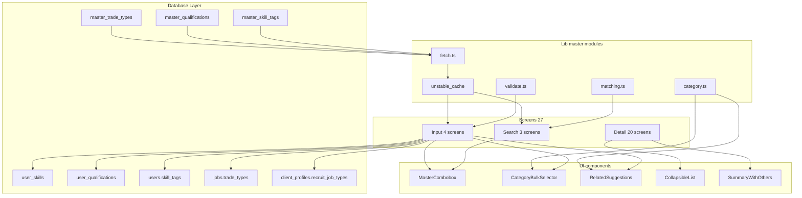
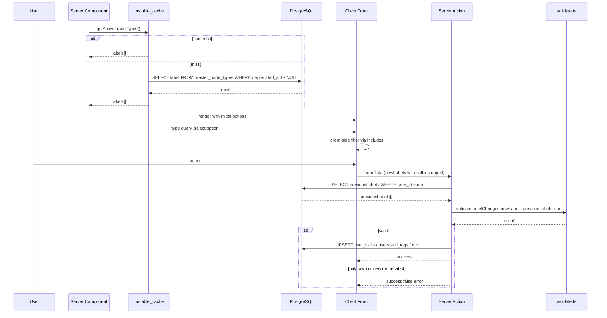
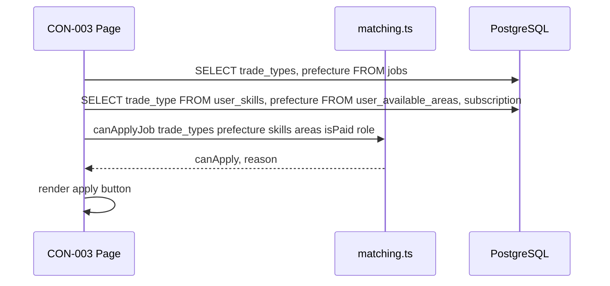
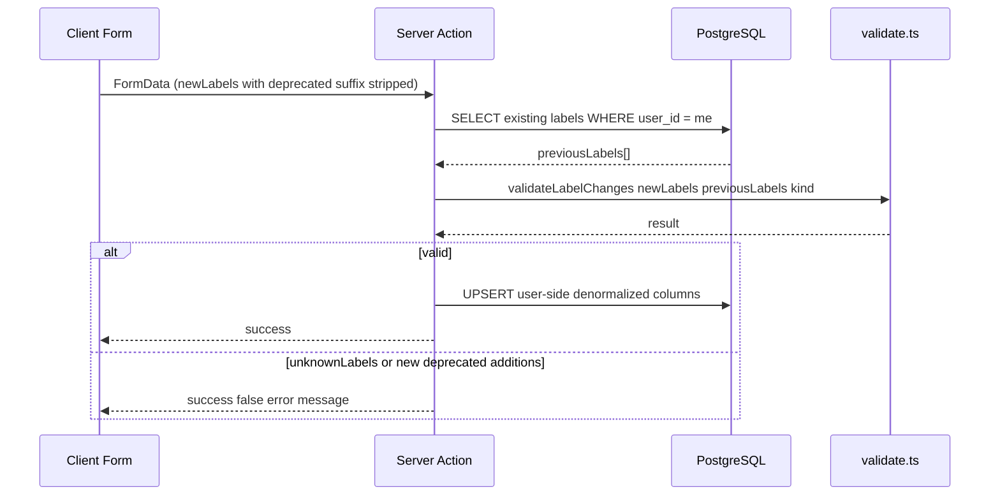
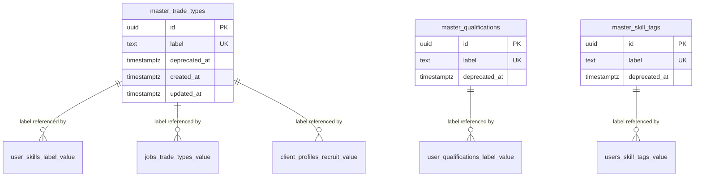
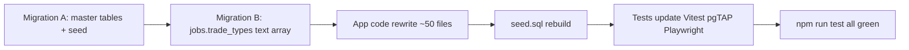

# Technical Design — master-skills

## Overview

**Purpose**: 受注者プロフィールの 3 マスタ（対応職種 113 件 / 保有資格 599 件 / 保有スキル 244 件）を DB テーブル化し、入力 UI を「単一入力枠 + インクリメンタル検索（combobox）」に統一する。発注者プロフィールの募集職種、案件投稿の募集職種、ユーザー・案件・発注者検索フィルター、応募・スカウト・メッセージの表示も同じマスタに揃え、CLI-005 等の TRADE_TYPES 誤用バグを根本解決する。

**Users**: 受注者・発注者・担当者（staff）・運営。受注者は 956 件の正本選択肢から自分の能力を正確に登録でき、発注者は同じ粒度で「うちが募集する仕事」を表明できる。検索は複数選択 OR で実態に即した絞り込みになる。

**Impact**: 27 画面 / 約 50 ファイル / 新規マイグレーション 2 本。`label 保存方式（denormalization）` により表示系は無修正で済み、改修は「入力系・検索系・バリデーション層・seed・テスト」に集中する。`jobs.trade_type TEXT` → `jobs.trade_types TEXT[]` のスキーマ変更（1 案件複数職種化）と、`canApplyJob` のシグネチャ拡張（`string` → `string[]`）を伴う。

### Goals

- マスタ 3 テーブル（`master_trade_types` / `master_qualifications` / `master_skill_tags`）を最小スキーマ `(id, label, deprecated_at)` で導入
- 入力系 4 画面（COM-002 / register/profile / CLI-021 / job-form）と検索系 3 画面（CLI-005 / CON-002 / CON-005）の combobox を `MasterCombobox` 1 部品に集約
- CLI-005 の「保有スキル/保有資格に TRADE_TYPES を誤用」バグを構造的に解消
- 1 案件複数職種（`jobs.trade_types text[]`）対応
- 廃止項目（`deprecated_at`）の表示ルールを編集画面限定の「（廃止）」サフィックスに統一

### Non-Goals

- マスタ管理画面（ADM-マスタ管理）— 別 spec で対応、当面は Supabase ダッシュボード運用
- ユーザー側「マスタ追加リクエスト」機能 — `contacts` で代替
- ピン留め・人気度ベース並び替え — 運用データ蓄積後に再評価（R14）
- 既存ユーザーデータの移行戦略 — プレリリース前提（R12）
- ユーザー側カラムの id (uuid FK) 化 — denormalization 方式を維持
- 多言語化、画像・説明文の付加

## Architecture

### Existing Architecture Analysis

**保持する既存パターン**:

- Next.js App Router + Server Components デフォルト、変更操作は Server Actions
- shadcn/ui + Radix UI（`radix-ui` パッケージ）+ Tailwind v4
- Zod スキーマでクライアント/サーバ二重バリデーション
- RLS で全テーブル `SELECT/INSERT/UPDATE/DELETE` 制御。SECURITY DEFINER 関数は `SET search_path = public`
- 配列カラム検索は `.overlaps()` + `!inner` ジョイン
- URL `searchParams` を検索状態の Single Source of Truth とする

**置き換える既存資産**:

- `TRADE_TYPES`（13 値 const）— 削除
- `src/components/ui/multi-select.tsx`（検索枠なし dropdown）— combobox に置換（コンポーネント自体は他用途で残る可能性あり）
- `src/lib/validations/profile.ts` の `skills.max(3)` 等の上限制約 — 撤廃
- `canApplyJob(jobTradeType: string, …)` — `jobTradeTypes: string[]` シグネチャに拡張

**新規依存**:

- `cmdk@^1` — shadcn/ui 公式の Command コンポーネント。`radix-ui` Popover と組み合わせて使う

### Architecture Pattern & Boundary Map



**Architecture Integration**:

- **Selected pattern**: 「マスタ参照は lib 層に局所化、UI は再利用 1 部品」。表示系は `label 保存方式` により完全に既存パターン継続
- **Domain/feature boundaries**: `src/lib/master/` がマスタ I/O の単一窓口。UI 層（`MasterCombobox`）と検証層（`validate.ts`）が両方ここを参照
- **Existing patterns preserved**: Server Component → Supabase server client、Zod スキーマ、Server Actions `{ success, error, data }`、RLS 二重防御、URL searchParams ベース検索状態管理
- **New components rationale**: `MasterCombobox`（cmdk 統合の単一窓口）/ `CategoryBulkSelector`（CLI-021 専用、R7 AC-8）/ `RelatedSuggestions`（COM-002/register/profile、R3 AC-14）/ `CollapsibleList`（CLI-006/COM-001、R4 AC-1）/ `SummaryWithOthers`（リストカード共通、R4 AC-4）
- **Steering compliance**: `database-schema.md`「マスタテーブル移行時の方針」/ `tech.md`「サーバーコンポーネント優先」/ `security.md`「RLS ファースト」/ `implementation-notes.md` の各落とし穴ルールを遵守

### Technology Stack

| Layer | Choice / Version | Role in Feature | Notes |
|-------|------------------|-----------------|-------|
| Frontend | Next.js 16 (App Router) | Server Component で初期表示、Server Actions で書き込み | 既存スタック |
| UI | shadcn/ui + `radix-ui` + Tailwind v4 | フォーム / ダイアログ / Popover | 既存 |
| Combobox | `cmdk@^1`（新規依存） | Command + 検索フィルター | shadcn 公式パターン |
| Forms | React Hook Form + Zod | 入力 4 画面のフォーム管理 | 既存 |
| Caching | `unstable_cache` + `revalidateTag` | マスタ全件のサーバキャッシュ（TTL 3600s） | 新規導入 |
| Backend | Server Actions | 入力検証 + DB 書き込み | 既存 |
| Data | PostgreSQL（Supabase）+ RLS | 3 マスタテーブル + `jobs.trade_types text[]` | 拡張 |
| Index | B-tree on `label`, GIN on `jobs.trade_types`, partial idx on `deprecated_at IS NULL` | 検索高速化 | 新規 |
| Tests | Vitest / Playwright / pgTAP | 各層のテスト | 既存 |

`pg_trgm` は採用しない（マスタは全件クライアント保持で `String.includes()` フィルター。詳細は `research.md` セクション 8-2）。

## System Flows

### マスタ取得 + Combobox 入力フロー（書き込みパス）



### 応募可否判定フロー（読み取りパス）



## Requirements Traceability

| Requirement | Summary | Components | Interfaces | Flows |
|-------------|---------|------------|------------|-------|
| 1.1–1.9 | マスタ 3 テーブル DB 基盤 | Migration A / `master/fetch.ts` / `master/validate.ts` | `getActiveTradeTypes/Qualifications/SkillTags()` / `validateLabelChanges()` | 書き込みパス |
| 2.1–2.9 | 初期データ投入 | `scripts/build-master-inserts.ts` / Migration A | スクリプト → SQL | — |
| 3.1–3.17 | 受注者プロフィール入力 UI | `MasterCombobox` / `RelatedSuggestions` / `profile-edit-form.tsx` / `register/profile/page.tsx` | combobox Props / suggester Props | 書き込みパス |
| 4.1–4.10 | 表示「主要 N 件 + 折りたたみ」 | `CollapsibleList` / `SummaryWithOthers` | `<CollapsibleList limit={N} items />` / `<SummaryWithOthers max={M} items />` | — |
| 5.1–5.12 | 検索画面の新マスタ参照化 | `contractor-search-filter.tsx` / `client-search-form.tsx` / `job-search-filter.tsx` + `MasterCombobox` | searchParams 配列パース | — |
| 6.1–6.8 | 案件投稿 trade_type 複数化 | Migration B / `job-form.tsx` / `MasterCombobox` | `jobs.trade_types text[]` | 書き込みパス |
| 7.1–7.11 | 発注者 recruit_job_types + カテゴリ一括 | `client-profile-edit-form.tsx` / `CategoryBulkSelector` | bulk add API | — |
| 8.1–8.9 | 応募・スカウト表示更新 | 12 画面 + `SummaryWithOthers` | display props | — |
| 9.1–9.9 | 廃止項目運用 | `master/deprecated.ts` / 編集画面 5 個 | `applyDeprecatedSuffix()` | — |
| 10.1–10.3 | スコープ外固定（追加リクエスト機能なし） | — | — | — |
| 11.1–11.8 | バリデーション・テスト・型整合 | `validations/profile.ts` / `validations/client-profile.ts` / `seed.sql` / E2E | Zod schemas | — |
| 12.1–12.6 | プレリリースデータ刷新 | Migration B / `seed.sql` | — | — |
| 13.1–13.5 | マッチング厳密一致（配列対応） | `matching.ts`（旧 `can-apply-job.ts`） | `canApplyJob({ jobTradeTypes, … })` | 応募可否判定 |
| 14.1–14.4 | ピン留め MVP 範囲外 | — | — | — |
| 15.1–15.5 | ステアリング・他 spec 更新 | `.kiro/steering/*`、他 spec の requirements.md | grep ベース | — |

## Components and Interfaces

| Component | Domain/Layer | Intent | Req Coverage | Key Dependencies | Contracts |
|-----------|--------------|--------|--------------|-------------------|-----------|
| `supabase/anon.ts` | Lib / Infra | cookieless な公開読取専用 Supabase client（unstable_cache 内で使う） | 1.5 | `@supabase/supabase-js` (P0) | Service |
| `master/fetch.ts` | Lib / Data | マスタ 3 種を unstable_cache で取得 | 1.1, 1.4, 1.5 | `supabase/anon.ts` (P0) | Service |
| `master/category.ts` | Lib / Domain | trade-types の label からカテゴリパース | 3.14, 3.17, 7.8 | — | Service |
| `master/validate.ts` | Lib / Validation | 新規追加 label の存在 + 非 deprecated チェック（既存保有は保持許可） | 1.9, 3.13, 9.3, 11.1 | `master/fetch.ts` (P0) | Service |
| `master/deprecated.ts` | Lib / Display | 「（廃止）」サフィックス付与（編集画面用） | 9.3, 9.9 | `master/fetch.ts` (P1) | Service |
| `matching.ts`（旧 `can-apply-job.ts`） | Lib / Domain | 配列 vs 配列の OR 一致判定 | 13.1, 8.9 | — | Service |
| `MasterCombobox` | UI / Input | cmdk ベースの単一/複数選択 combobox | 3.1, 5.1, 6.1, 7.1 | cmdk (P0), Radix Popover (P0) | State |
| `CategoryBulkSelector` | UI / Input | CLI-021 のカテゴリ一括選択ダイアログ | 7.8, 7.9, 7.10 | Radix Dialog (P0), `master/category.ts` (P0) | State |
| `RelatedSuggestions` | UI / Input | 同カテゴリの関連候補をサジェスト | 3.14, 3.15, 3.16, 3.17 | `master/category.ts` (P0) | State |
| `CollapsibleList` | UI / Display | 「主要 N 件 + もっと見る」 | 4.1, 4.3 | — | State |
| `SummaryWithOthers` | UI / Display | 「2 件 + 他」 / 「3 件 + 他」 | 4.4, 4.8, 4.9, 4.10 | — | — |
| `scripts/build-master-inserts.ts` | Tools | `cleaned/*.txt` → SQL INSERT | 2.9 | Node.js fs | Batch |
| Migration A | DB | マスタ 3 テーブル + RLS + index + 初期データ | 1.x, 2.x | PostgreSQL | — |
| Migration B | DB | `jobs.trade_type` → `trade_types text[]` + GIN | 12.5, 12.6 | PostgreSQL | — |

### Lib

#### master/fetch.ts

| Field | Detail |
|-------|--------|
| Intent | 3 マスタの label[] を `unstable_cache` でサーバキャッシュ提供 |
| Requirements | 1.1, 1.4, 1.5 |

**Responsibilities & Constraints**
- マスタ取得の唯一の窓口。Server Component / Server Action 両方から呼ばれる
- `deprecated_at IS NULL` のみ返す（表示候補専用 API）
- 編集画面で旧値の廃止判定に使う「全件版」API も別途提供

**Dependencies**
- Outbound: **Cookieless Supabase client**（`@supabase/supabase-js` の `createClient(SUPABASE_URL, SUPABASE_ANON_KEY)` を `src/lib/supabase/anon.ts` 等に新規追加。`@supabase/ssr` の `createServerClient` は使わない）— (P0)
- Outbound: Next.js `unstable_cache`、`revalidateTag`（将来用） — (P0)

**Contracts**: Service [x]

**重要制約（unstable_cache の使用条件）**
- `unstable_cache` 内部の関数は **`cookies()` / `headers()` / `auth.getUser()` 等のリクエスト依存 API を呼んではならない**。呼ぶとランタイムで throw する
- マスタは RLS で anon SELECT 開放済みのため、ログイン情報なしの anon クライアントで取得できる。`@supabase/ssr` の `createServerClient` を使うとデフォルトで cookies を読みに行くため不適格
- 新規ヘルパー `src/lib/supabase/anon.ts` を 1 ファイル追加し、`master/fetch.ts` 内ではこのヘルパーだけを使う（書き込み権限ゼロ、cookies 非依存）

##### Service Interface

```typescript
export type MasterKind = "trade_type" | "qualification" | "skill_tag";

export interface MasterRow {
  id: string;
  label: string;
  deprecatedAt: string | null;
}

// 表示候補（deprecated_at IS NULL のみ）
export function getActiveTradeTypes(): Promise<string[]>;
export function getActiveQualifications(): Promise<string[]>;
export function getActiveSkillTags(): Promise<string[]>;

// 廃止判定用（全件、deprecated_at 含む）
export function getAllMasterRows(kind: MasterKind): Promise<MasterRow[]>;
```

- Preconditions: なし
- Postconditions: 返却配列は label 昇順
- Invariants: キャッシュキーは `['master-skills', kind, 'active' | 'all']`、TTL 3600s、tag `master-skills`

##### State Management

- Persistence: PostgreSQL の 3 マスタテーブル
- Consistency: 書き込み（admin 経由 = MVP 外）後に `revalidateTag('master-skills')` で全画面に伝播

**Implementation Notes**
- Integration: Server Component から直接 await。Client Component に渡す場合は親 Server Component から props 注入
- Validation: クエリは固定 SELECT。SQL injection 余地なし
- 失敗時フォールバック: 取得失敗時は空配列を返し、UI 側で「候補を取得できませんでした」を表示（Combobox は disabled 状態）
- Risks:
  - cache の TTL 設定変更時は本ファイルだけ書き換えれば全画面に伝播する
  - `createServerClient`（cookie ベース）を誤用すると初回キャッシュミス時にランタイム throw。ESLint カスタムルールで `master/fetch.ts` 内の `createServerClient` import を禁止することを検討

#### master/category.ts

| Field | Detail |
|-------|--------|
| Intent | trade-types `label` から「大カテ / 中カテ」をランタイムパース |
| Requirements | 3.14, 3.17, 7.8 |

**Responsibilities & Constraints**
- DB スキーマには階層情報を持たない（R1 AC-3）。label の prefix で 100% 復元
- `撮影・クリエイティブ｜カメラマン` のような 1 階層 label にも対応（big === mid）

##### Service Interface

```typescript
export interface TradeTypeCategory {
  big: string;   // 例: "建築"
  mid: string;   // 例: "建築/躯体"（1 階層 label の場合は big と同じ）
  leaf: string;  // 例: "大工"
}

export function parseTradeTypeCategory(label: string): TradeTypeCategory;

// 大カテ / 中カテのユニーク一覧（一括選択用）
export function listBigCategories(allLabels: string[]): string[];
export function listMidCategories(allLabels: string[]): string[];

// 同じ中カテに属する label 一覧
export function siblingsInSameMidCategory(
  baseLabel: string,
  allLabels: string[],
): string[];
```

- Preconditions: `label` は `(<big>/<mid>)?<leaf>` 形式（｜区切り）
- Postconditions: `siblingsInSameMidCategory(label, all).includes(label) === false`

**Implementation Notes**
- Integration: `RelatedSuggestions` と `CategoryBulkSelector` が両方利用
- Validation: 113 件の trade-types 全件パースをユニットテストで担保
- Risks: マスタ追加時に `label` 規約（`大カテ/中カテ｜末端`）を逸脱したエントリが混入すると mid 判定がぶれる。Migration A の INSERT 時に正規表現で検証する CHECK 制約は付与しない（過剰）、admin 運用の責任とする

#### master/validate.ts

| Field | Detail |
|-------|--------|
| Intent | Server Action 層で「新規追加 label が master_xxx に存在し非 deprecated」を検証。既存保有の廃止 label は保持を許可 |
| Requirements | 1.9, 3.13, 9.3, 11.1 |

##### Service Interface

```typescript
export type ValidateLabelChangesResult =
  | { valid: true }
  | {
      valid: false;
      unknownLabels: string[];     // master に存在しない（typo / 不正入力）
      deprecatedLabels: string[];  // master にあるが deprecated_at IS NOT NULL（新規追加分のみ報告）
    };

/**
 * 編集保存時のラベル変更を検証する。
 *
 *  - `added = newLabels − previousLabels` を計算し、added のみを active 必須でチェック
 *  - `previousLabels` に含まれていた deprecated は保持を許可する（R3 AC-13 / R9 AC-3）
 *  - 重複は内部で除外する（new Set ベース）
 *
 * @param newLabels       フォーム送信値（suffix 除去済み・trim 済み）
 * @param previousLabels  保存直前に DB から SELECT した現値（新規登録時は空配列）
 * @param kind            'trade_type' | 'qualification' | 'skill_tag'
 */
export function validateLabelChanges(
  newLabels: string[],
  previousLabels: string[],
  kind: MasterKind,
): Promise<ValidateLabelChangesResult>;
```

- Preconditions: `newLabels` / `previousLabels` は trim 済み、`stripDeprecatedSuffix` で素の label に戻し済み、空文字除外済み
- Postconditions: `valid === false` のとき、UI 表示メッセージは Server Action 側で組み立てる（例: `対応職種「○○」が見つかりません`）

##### Server Action 呼び出しシーケンス

保存系 Server Action（profile / register-profile / client-profile / job create-edit）は以下のシーケンスで `validateLabelChanges` を呼ぶ：



**Implementation Notes**
- Integration: 保存系 5 件の Server Action（COM-002 / register/profile / CLI-021 / job create / job edit）が submit 時に呼ぶ
- delta 計算は `Array.from(new Set(newLabels)).filter(l => !previousLabels.includes(l))` で simple-set difference
- 内部実装は `getAllMasterRows(kind)` の `unstable_cache` を使った in-memory チェックで、1 トランザクション中の DB ラウンドトリップ追加はゼロ
- Risks: `previousLabels` の取得忘れで「新規登録ルート（previousLabels=[]）として扱われ既存廃止値が拒否される」事故 → Server Action テンプレートに「保存直前 SELECT」を強制するコメントブロックを置き、Vitest で「廃止値を持つユーザーの再保存が通る」ケースを High リスクで必須化

#### master/deprecated.ts

| Field | Detail |
|-------|--------|
| Intent | 編集画面でユーザー保有値に「（廃止）」サフィックスを付与 |
| Requirements | 9.3, 9.9 |

##### Service Interface

```typescript
export function applyDeprecatedSuffix(
  labels: string[],
  deprecatedLabels: Set<string>,
): string[];
// 例: applyDeprecatedSuffix(['大工', '旧職'], new Set(['旧職'])) → ['大工', '旧職（廃止）']

export function isDeprecated(label: string): boolean; // suffix の有無で判定
export function stripDeprecatedSuffix(label: string): string;
```

**Implementation Notes**
- 表示画面（プロフィール詳細、検索結果カード、応募一覧等）では呼ばない（R9 AC-9）
- 保存時は `stripDeprecatedSuffix` で素の label に戻してから validate.ts に渡す

#### matching.ts（旧 src/lib/utils/can-apply-job.ts を改名 + 拡張）

| Field | Detail |
|-------|--------|
| Intent | 配列 vs 配列の OR 一致で応募可否判定 |
| Requirements | 13.1, 13.2, 8.9 |

##### Service Interface

```typescript
export interface CanApplyJobParams {
  userRole: "contractor" | "client" | "staff";
  isPaidUser: boolean;
  jobTradeTypes: string[];   // 旧 jobTradeType: string から拡張
  jobPrefecture: string;
  userSkills: Array<{ tradeType: string }>;
  userAvailableAreas: Array<{ prefecture: string }>;
}

export interface CanApplyJobResult {
  canApply: boolean;
  reason?: string;
}

export function canApplyJob(params: CanApplyJobParams): CanApplyJobResult;
```

- Preconditions: `jobTradeTypes` は空配列を許容しない（job side の必須項目）
- Postconditions: `jobTradeTypes.some(j => userSkills.some(s => s.tradeType === j))` かつ prefecture 一致のとき canApply
- Invariants: `isPaidUser === true` なら無条件 canApply

**Implementation Notes**
- 呼び出し元 3 ファイル（CON-002 検索 Server Action / CON-003 案件詳細 / CON-004 応募 Server Action）を同時更新
- 配列 OR 一致なので、staff は別途 UI 側で応募ボタン非表示（実装ノート参照）

### UI

#### MasterCombobox

| Field | Detail |
|-------|--------|
| Intent | cmdk + Radix Popover ベースの単一/複数選択 combobox 1 部品 |
| Requirements | 3.1, 3.2, 3.3, 3.4, 3.9, 3.12, 5.1, 5.2, 5.3, 5.4, 5.5, 6.1, 7.1 |

**Responsibilities & Constraints**
- 入力系（受注者プロフィール、案件投稿、発注者プロフィール）と検索系（CLI-005 / CON-002 / CON-005）で共用
- multi モードは chips 表示 + Backspace で末尾 chip 削除
- 候補は `options` props で受け取る（Server Component から注入）→ クライアント側で `includes` フィルター
- 既選択分は候補から除外
- 廃止判定 / サフィックスは呼び出し側が事前に組み立てて props で渡す

##### Component Props

```typescript
export interface MasterComboboxProps {
  options: string[];                  // 表示候補
  value: string[];                    // 選択済み label
  onChange: (next: string[]) => void;
  mode: "single" | "multi";
  placeholder?: string;
  disabled?: boolean;
  id?: string;
  emptyLabel?: string;                // 候補 0 件時のメッセージ
}
```

- Preconditions: `mode === "single"` のとき `value.length <= 1`
- Postconditions: `onChange` 後の `value` は重複なし

##### Form Integration Map（画面ごとの使い方）

新マスタを扱う全 7 画面に対して、Combobox の `mode` と親フォームとの接続パターンを次表で固定する。実装者の判断分岐を排除するために必ず参照すること。

| 画面 ID | 画面名 | フィールド | mode | value の意味 | onChange の処理 | 補足 |
|---------|--------|----------|------|------------|---------------|------|
| COM-002 / AUTH-006 | プロフィール編集 / 新規登録 | 対応職種 | `single` | **常に `[]`**（次に追加する 1 件の transient buffer） | 親が `useFieldArray<{tradeType, experienceYears}>` に row を append し、combobox の value を `[]` にリセット。経験年数欄が同時表示される（R3 AC-7） | RelatedSuggestions も同じ append フローを呼ぶ |
| COM-002 / AUTH-006 | プロフィール編集 / 新規登録 | 保有スキル | `multi` | フォーム state の `skillTags: string[]` と直結 | `setValue('skillTags', next)` | chip 表示・Backspace 削除は Combobox 内部で完結 |
| COM-002 / AUTH-006 | プロフィール編集 / 新規登録 | 保有資格 | `multi` | フォーム state の `qualifications: string[]` と直結 | `setValue('qualifications', next)` | 同上 |
| CLI-021 | 発注者情報編集 | 募集職種 | `multi` | `recruit_job_types: string[]` と直結 | `setValue('recruitJobTypes', next)` | `CategoryBulkSelector` の bulk add とマージ |
| CLI-003 / CLI-004 | 案件編集 / 新規登録 | 募集職種 | `multi` | `tradeTypes: string[]` と直結 | `setValue('tradeTypes', next)` | min(1) 必須 |
| CLI-005 | 職人検索 popup | 対応職種 / 保有スキル / 保有資格 | `multi` | URL searchParams から復元した `string[]` | `router.push` で URL searchParams を同名キー繰り返しで書き込み（`?tradeType=大工&tradeType=塗装`） | フィルター上限なし |
| CON-002 | 案件検索 popup | 募集職種 | `multi` | 同上 | 同上 | |
| CON-005 | 発注者検索 popup | 募集職種 | `multi` | 同上 | 同上 | |

**`mode: "single"` の特殊扱い（受注者対応職種だけ）**
- combobox の value は常に `[]` を維持し、ピック直後に親が **append + clear** する責任を持つ
- 親の `useFieldArray` 行が trade-type の真の State。combobox は「次の 1 件の選択窓口」に徹する
- 既選択の filter は親が `fieldArray.map(f => f.tradeType)` を `MasterCombobox.options` から `Array.prototype.filter` で除外して props 渡し（既選択分は候補に出ない、R3 AC-9）

**`mode: "multi"` の動作**
- value は親フォームの string[] と双方向バインド
- 既選択 chip は combobox 内部で描画。Backspace で末尾 chip 削除
- 候補は `options` から `value` を除いたもの

**Implementation Notes**
- Integration: react-hook-form の `Controller` で包んで使う（`multi` の場合）。`single` の場合は素の `useState` でも可
- Validation: 候補に存在しない値は internal で reject（UI レベル）。最終検証は Server Action `validateLabelChanges`
- IME: cmdk の `<CommandInput>` が日本語確定前の Enter で誤確定しないことを E2E で必ず確認（Playwright で `page.keyboard.type('だいく')` → `page.keyboard.press('Enter')` の挙動検証）
- Accessibility: `aria-haspopup="listbox"`、選択時のフォーカス維持
- Risks: shadcn の Select / Popover と CSS トークンが整合するよう `bg-background` / `rounded-[8px]` 等 design-rule に揃える

#### CategoryBulkSelector

| Field | Detail |
|-------|--------|
| Intent | CLI-021 で大カテ / 中カテ単位の trade-types を一括追加するダイアログ |
| Requirements | 7.8, 7.9, 7.10 |

**Responsibilities & Constraints**
- combobox の隣に「カテゴリで一括選択」ボタンを置き、押下でダイアログを開く
- ダイアログ内は「建築」配下に「建築/躯体」「建築/内装」… の 2 段ネストツリー（チェックボックス）
- 「追加する」ボタンで対象カテゴリ配下の全 trade-types を value に push（既選択分はスキップ、`deprecated_at IS NULL` のみ）
- 個別解除は通常の combobox chips で行う（一括選択後の調整が自由）

##### Component Props

```typescript
export interface CategoryBulkSelectorProps {
  allLabels: string[];                // 全 trade-types（active のみ）
  currentValue: string[];
  onAddBulk: (added: string[]) => void;
  trigger?: React.ReactNode;
}
```

**Implementation Notes**
- Integration: CLI-021 の `client-profile-edit-form.tsx` のみで使用（R7 AC-11 により受注者プロフィールには載せない）
- Validation: 大カテ全選択時に「該当 N 件を追加します」確認モーダル
- Risks: 1 大カテ（例: 「建築」70 件超）を一括選択すると一気に保有数が増える。UI で「○件追加」と件数を明示

#### RelatedSuggestions

| Field | Detail |
|-------|--------|
| Intent | COM-002 / register/profile で対応職種を選んだ直後に、同じ中カテ配下の他 trade-types を「関連候補」として下に出す |
| Requirements | 3.14, 3.15, 3.16, 3.17 |

##### Component Props

```typescript
export interface RelatedSuggestionsProps {
  baseLabel: string;                  // 直前に選んだ trade_type
  allLabels: string[];                // 全 trade-types（active のみ）
  alreadySelected: string[];
  onPick: (label: string) => void;    // ピック時、親の追加処理（経験年数欄も同時表示）
  onDismiss: () => void;
}
```

- 表示条件: `baseLabel` が変更された後、`siblingsInSameMidCategory()` の返り値から `alreadySelected` を引いた件数が 1 以上のときだけ表示
- 閉じる/スキップで非表示

**Implementation Notes**
- Integration: 受注者プロフィールのみ（R3 AC-17 により qualifications / skill_tags 側には載せない）
- UX: 1 件ピック → 経験年数欄が自動的に追加表示（R3 AC-15）

#### CollapsibleList / SummaryWithOthers

```typescript
export interface CollapsibleListProps {
  items: string[];
  initialLimit: number;               // R4 AC-7 デフォルト値: 対応職種=5, 保有資格=5, 保有スキル=8
  expandLabel?: string;               // default "もっと見る"
}

export interface SummaryWithOthersProps {
  items: string[];
  maxVisible: number;                 // 例: 2 / 3
  separator?: string;                 // default "、"
  othersLabel?: string;               // default "他"
}
```

- `CollapsibleList`: 0 件のとき null を返す（R4 AC-6）
- `SummaryWithOthers`: `items.length <= maxVisible` のとき「他」を出さない（R4 AC-9 / AC-10）

**Implementation Notes**
- 表示画面が 20 ファイル以上あるため、必ずこの 2 部品に統一する（手書きで `slice(0,2).join('、')` を散らさない）

### Server Actions

| Action | File | Changes |
|--------|------|---------|
| Profile save | `profile/edit/actions.ts` | Zod から `.max(3)` 撤去。保存直前に `user_skills` / `user_qualifications` / `users.skill_tags` を SELECT して previousLabels を取得 → `validateLabelChanges` で 3 マスタ分を検証 → 既存 RPC（`p_skill_tags` / `p_qualifications` 等）に新値を渡す |
| Register profile | `(auth)/register/profile/actions.ts` | 同上（`previousLabels = []` の新規登録ルート）+ trade_type 必須 1 件チェック |
| Client profile save | `mypage/client-profile/actions.ts` | 保存直前に `client_profiles.recruit_job_types` を SELECT → `validateLabelChanges` で検証 |
| Job create / edit | `jobs/actions.ts` | `tradeType: string` → `tradeTypes: string[]`、Zod スキーマ更新、編集時は `jobs.trade_types` を SELECT して previousLabels に渡す（新規作成時は `[]`） |
| Apply job | `jobs/search-actions.ts` | `canApplyJob` 呼び出し時に `jobTradeTypes: job.trade_types` を渡す（保存系ではないので `validateLabelChanges` は呼ばない） |

### DB Migrations

| Migration | File（命名規約） | 役割 |
|-----------|-----------------|------|
| **A** | `YYYYMMDDhhmmss_master_skills_tables.sql` | `master_trade_types` / `master_qualifications` / `master_skill_tags` 作成 + RLS + index + 113/599/244 件初期データ INSERT |
| **B** | `YYYYMMDDhhmmss_jobs_trade_types_array.sql` | `jobs.trade_type` → `trade_types text[]` 変換、既存値は `ARRAY[trade_type]` で配列化、`idx_jobs_search` を再作成 |

詳細は「Data Models」「Migration Strategy」を参照。

## Data Models

### Domain Model



注: マスタとユーザー側カラム間に FK は張らない（denormalization = label コピー）。「label referenced by」は論理的整合性のみ。

### Logical Data Model

**Structure**:

| Table | Column | Type | Constraints | Notes |
|-------|--------|------|-------------|-------|
| `master_trade_types` | id | uuid | PK, default `gen_random_uuid()` | |
| | label | text | NOT NULL, UNIQUE | 例: `建築/躯体｜大工` |
| | deprecated_at | timestamptz | NULL | NULL = active |
| | created_at | timestamptz | NOT NULL, default now() | |
| | updated_at | timestamptz | NOT NULL, default now() | trigger で自動更新 |
| `master_qualifications` | （同上） | | | 例: `1級建築士` |
| `master_skill_tags` | （同上） | | | 例: `型枠設置` |

**Indexes**:

| Table | Index | Type | Purpose |
|-------|-------|------|---------|
| `master_*` | `(label)` | B-tree（UNIQUE） | 重複防止 + 完全一致検索 |
| `master_*` | `(label) WHERE deprecated_at IS NULL` | 部分 B-tree | active のみの一覧抽出を高速化 |
| `jobs` | `(status, prefecture)` | 複合 B-tree（既存改修） | 検索基本軸 |
| `jobs` | `(trade_types)` | GIN | 配列 overlaps 検索 |

**Consistency & Integrity**:

- Transaction boundary: 入力 Server Action は「label 検証 → user_skills 等への書き込み」を 1 トランザクション内で完結
- Cascading: マスタは物理削除しない（R9 AC-1）。論理削除のため CASCADE は無し
- Temporal: `deprecated_at` でソフトデリート

**RLS**:

| Table | SELECT | INSERT/UPDATE/DELETE |
|-------|--------|----------------------|
| `master_trade_types` | anon + authenticated | service_role のみ |
| `master_qualifications` | 同上 | 同上 |
| `master_skill_tags` | 同上 | 同上 |

ポリシー名は `master_xxx_select_all_anon` / `master_xxx_write_service_role` で統一。

### Physical Data Model

**Migration A — 3 マスタテーブル + 初期データ**

```sql
CREATE TABLE master_trade_types (
  id uuid PRIMARY KEY DEFAULT gen_random_uuid(),
  label text NOT NULL UNIQUE,
  deprecated_at timestamptz,
  created_at timestamptz NOT NULL DEFAULT now(),
  updated_at timestamptz NOT NULL DEFAULT now()
);

CREATE INDEX idx_master_trade_types_active
  ON master_trade_types (label)
  WHERE deprecated_at IS NULL;

CREATE TRIGGER set_updated_at BEFORE UPDATE ON master_trade_types
  FOR EACH ROW EXECUTE FUNCTION update_updated_at();

ALTER TABLE master_trade_types ENABLE ROW LEVEL SECURITY;

CREATE POLICY "master_trade_types_select_all_anon"
  ON master_trade_types FOR SELECT
  USING (true);

-- ※ INSERT/UPDATE/DELETE はポリシー未定義のため service_role 以外拒否

-- 同じパターンで master_qualifications / master_skill_tags を作成

-- 初期データ投入（scripts で生成）
INSERT INTO master_trade_types (label) VALUES
  ('建築/測量｜測量工'),
  ('建築/地盤｜地盤調査・改良工'),
  -- ... 113 行
  ON CONFLICT (label) DO NOTHING;

INSERT INTO master_qualifications (label) VALUES
  ('1級建築士'),
  -- ... 599 行
  ON CONFLICT (label) DO NOTHING;

INSERT INTO master_skill_tags (label) VALUES
  ('型枠設置'),
  -- ... 244 行
  ON CONFLICT (label) DO NOTHING;

-- 投入件数確認
DO $$
DECLARE
  trade_count int; qual_count int; skill_count int;
BEGIN
  SELECT count(*) INTO trade_count FROM master_trade_types;
  SELECT count(*) INTO qual_count FROM master_qualifications;
  SELECT count(*) INTO skill_count FROM master_skill_tags;
  RAISE NOTICE 'master_trade_types=% master_qualifications=% master_skill_tags=%',
    trade_count, qual_count, skill_count;
END;
$$;
```

**Migration B — `jobs.trade_type` → `trade_types text[]`**

```sql
-- 旧: jobs.trade_type text
-- 新: jobs.trade_types text[] NOT NULL DEFAULT '{}'

-- Step 1: 新カラム追加 + 既存値の配列化
ALTER TABLE jobs ADD COLUMN trade_types text[] NOT NULL DEFAULT '{}';

UPDATE jobs
SET trade_types = CASE
  WHEN trade_type IS NULL OR length(trim(trade_type)) = 0 THEN '{}'::text[]
  ELSE ARRAY[trade_type]
END;

-- Step 2: 旧カラムに依存する既存複合インデックスを先に削除（後続 DROP COLUMN の前提）
DROP INDEX IF EXISTS idx_jobs_search;

-- Step 3: 旧カラム削除
ALTER TABLE jobs DROP COLUMN trade_type;

-- Step 4: 新インデックスを作成
CREATE INDEX idx_jobs_search ON jobs (status, prefecture);
CREATE INDEX idx_jobs_trade_types_gin ON jobs USING GIN (trade_types);
```

`supabase gen types typescript --local > src/types/database.ts` を migration 後に必ず実行（CI でも `npm run build` がコケるため強制的に気づける）。

### Data Contracts & Integration

- Server Action 戻り値: `{ success: boolean; error?: string; data?: T }` 既存パターン
- マスタ取得: Server Component → `getActiveTradeTypes()` → `Promise<string[]>`
- 検索 URL searchParams: 配列は同名キー繰り返し（`?tradeType=大工&tradeType=電気工`）。Server Component で `Array.isArray(sp.tradeType) ? sp.tradeType : [sp.tradeType]` パターンで読み取り

## Error Handling

### Error Strategy

| 層 | エラー種別 | 対応 |
|----|----------|------|
| UI（MasterCombobox） | 候補に存在しない値の手動入力 | 自動的に reject（候補からの選択のみ許可） |
| Server Action | Zod バリデーション失敗 | `{ success: false, error: firstError }` で日本語メッセージ |
| Server Action | `validateLabelChanges` で unknown（added 内） | `"対応職種「○○」が見つかりません。再度選び直してください"` |
| Server Action | `validateLabelChanges` で deprecated（added 内のみ報告。既存保有は対象外） | `"対応職種「○○」は廃止されたため新規選択できません"` |
| DB | label UNIQUE 制約違反（Migration A の初期データ投入時） | `ON CONFLICT (label) DO NOTHING` で衝突は無視、RAISE NOTICE で投入件数を出力して手動チェック |
| Migration B | 既存 `trade_type` の配列化失敗 | プレリリースのため UPDATE で全件強制上書き、ROLLBACK 検討は不要 |

### Monitoring

- Server Action 実行ログは既存パターン踏襲（`console.error` で本番のみ）
- マスタフェッチエラーは `unstable_cache` 内でキャッチし、空配列にフォールバック → UI に「候補を取得できませんでした」と表示

## Testing Strategy

### Unit Tests（Vitest）

| 対象 | テストケース | リスク |
|------|-----------|------|
| `parseTradeTypeCategory` | 113 件全件のパース、1 階層 label、2 階層 label、エッジケース（区切り文字なし） | Low |
| `siblingsInSameMidCategory` | 中カテ内のソート、自身除外、deprecated 除外 | Low |
| `validateLabelChanges` | added のみ active 必須、既存保有 deprecated は保持許可、unknown 検出、空 previousLabels（新規登録）| High |
| `canApplyJob` (matching.ts) | 配列 OR 一致の全パターン、paid bypass、空配列 | High |
| `MasterCombobox` | 候補絞り込み、複数選択、Backspace 削除、disabled | Medium |
| `CategoryBulkSelector` | 大カテ一括追加、既選択スキップ、deprecated 除外 | Medium |

### Integration Tests（Vitest + Supabase Mock）

| Action | テストケース |
|--------|-----------|
| `updateProfileAction` | added のみ unknown / deprecated reject、既存保有 deprecated は保持して通過、新規登録（previousLabels=[]）でも動作 |
| `saveClientProfileAction` | recruit_job_types の delta チェック、bulk 追加後の保存、既存保有 deprecated を保持 |
| `createJob / updateJob` | `trade_types: string[]` の Zod 検証、min(1) チェック、編集時は previousLabels 取得経路あり |
| `applyJobAction` | 配列 OR 一致 → apply 成功、不一致 → 応募拒否 |

### RLS Tests（pgTAP）

| テスト | 期待 |
|--------|------|
| anon が `SELECT master_*` 可能 | 113/599/244 行返る |
| authenticated が `SELECT master_*` 可能 | 同上 |
| authenticated が `INSERT master_*` 拒否 | RLS で reject |
| service_role が `INSERT master_*` 成功 | レコード追加可能 |

### E2E Tests（Playwright）

| シナリオ | 対象 spec |
|---------|---------|
| 受注者 SignUp 経路: register/profile → 対応職種 cmdk 選択 → 関連候補ピック → 経験年数入力 → 保存 | 受注者 |
| COM-002 編集経路: 対応職種 3 件登録 → 保有スキル 5 件登録 → 保有資格 2 件登録 → 保存 → COM-001 で「主要 N 件 + もっと見る」確認 | 受注者 |
| 上限なし大量登録: 保有スキル 10 件 + 保有資格 12 件を 1 回の保存で投入 → COM-001 で「もっと見る」展開 → 全件表示。R11 AC-5 / R3 AC-10 の上限なし保証 | 受注者 |
| CLI-021 経路: 募集職種 combobox + カテゴリ一括選択「建築」追加 → 保存 | 発注者 Owner |
| CLI-004 案件作成: `trade_types` を 2 件登録 → 公開 → CON-002 検索ヒット | 発注者 |
| CON-002 検索: 募集職種 combobox で 2 件選択 → URL searchParams 反映 → 結果が OR 一致 | 受注者 |
| CLI-005 検索: 対応職種 + 保有スキル + 保有資格で複数選択 → 結果絞り込み確認 | 発注者 |
| 廃止項目: admin で 1 件 `deprecated_at` 設定 → 受注者編集画面で「（廃止）」表示、検索候補から消える | 受注者 |
| Staff の応募ボタン非表示確認 | 担当者 |

### Migration Tests

| 検証 | 方法 |
|------|------|
| Migration A 投入後の件数 | `SELECT count(*)` で 113/599/244 を確認 |
| Migration B 後の `jobs.trade_types` の中身 | seed 案件が全件 array 化されている |
| `idx_jobs_trade_types_gin` の効きを EXPLAIN 確認 | optional |

## Migration Strategy



**Phase 1 — DB**: Migration A + B を一気に流す。`supabase db reset` で local 検証。
**Phase 2 — Lib 層**: `src/lib/master/` 作成、`matching.ts` リネーム + 配列化、Zod スキーマ更新。
**Phase 3 — UI 層**: `MasterCombobox` / `CategoryBulkSelector` / `RelatedSuggestions` / `CollapsibleList` / `SummaryWithOthers` 実装。
**Phase 4 — 画面差し替え**: 入力 4 画面 → 検索 3 画面 → 表示 20 画面の順に差し替え。表示 20 画面は `SummaryWithOthers` 注入のみで基本的に既存クエリのまま動く。
**Phase 5 — seed.sql 書き直し**: 新マスタの label と新 `trade_types` 配列形に整合。テストユーザー 4 名（contractor/client/staff/admin）のフィクスチャを刷新。
**Phase 6 — テスト更新**: pgTAP の RLS テストに 3 マスタを追加。Vitest の Zod テスト期待値を更新。Playwright 全 spec の `selectOption` パターンを `MasterCombobox` 操作に置き換え。

**Rollback triggers**: Migration A/B の検証で件数不一致 / `idx_jobs_search` が削除されない → ROLLBACK。app 層は git revert で対応。
**Validation checkpoints**: 各 Phase 完了後に `npm run test && supabase test db && npm run test:e2e`。

## Security Considerations

- マスタは公開情報（職種・資格・スキル名）なので `anon` SELECT 開放で問題なし
- service_role 以外で `INSERT/UPDATE/DELETE` を一切受け付けない構成
- Server Action は既存パターンどおり `auth.getUser()` で認証チェック + role チェック
- `validateLabelChanges` で「ユーザー入力 label が master に存在する」ことを担保し、SQL injection 余地を排除（label は string、PostgREST 経由のため）

## Performance & Scalability

- マスタ取得は `unstable_cache` TTL 3600s で 1 リクエスト/時間まで圧縮
- Server Component 描画時の追加 HTML サイズは ~30 KB（gzip ~10 KB）
- インクリメンタル検索は client-side `String.includes()`、平均 1 ms / クエリ（599 件想定）
- `jobs.trade_types` GIN インデックスで `overlaps()` 検索を O(log N) 維持
- `master_*` の部分 B-tree（`WHERE deprecated_at IS NULL`）で表示候補抽出を高速化

## Supporting References

- `research.md` セクション 8 — Architecture Pattern Evaluation / Design Decisions / Risks / References
- `cleaned/cleaning-notes.md` — マスタ素材の整理判断記録
- `.kiro/steering/database-schema.md` — マイグレーション規約、RLS パターン、インデックス基準
- `design-assets/screens/{COM-002,CLI-005-popup-a,CLI-021}.png` — 入力 UI / 検索ポップアップの正本デザイン
- `src/components/ui/multi-select.tsx` — 旧パターン（参照用、本仕様では基本的に使わない）
- `src/lib/utils/can-apply-job.ts` — `matching.ts` に移動・拡張する元実装
