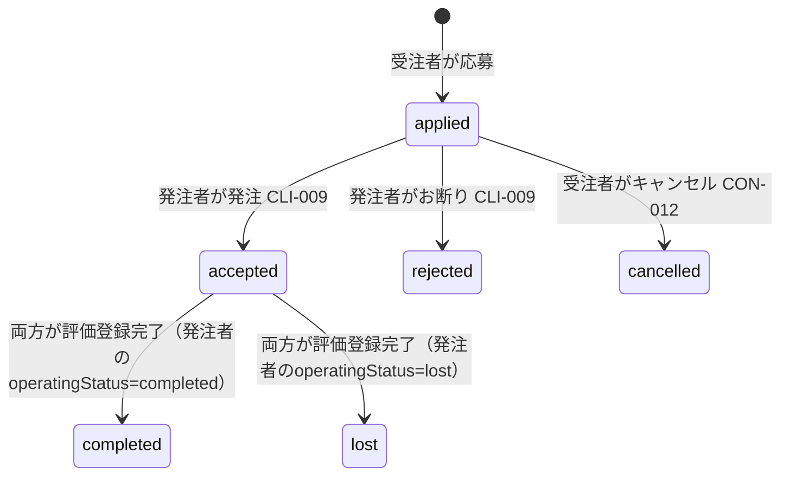
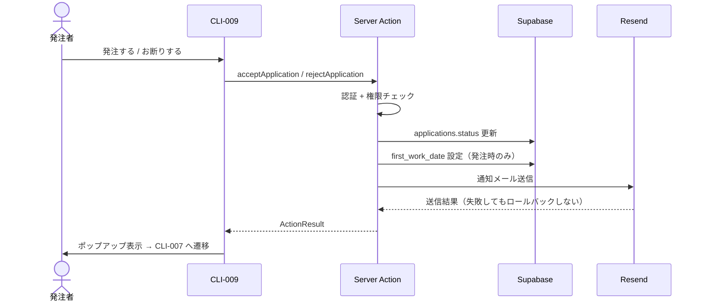
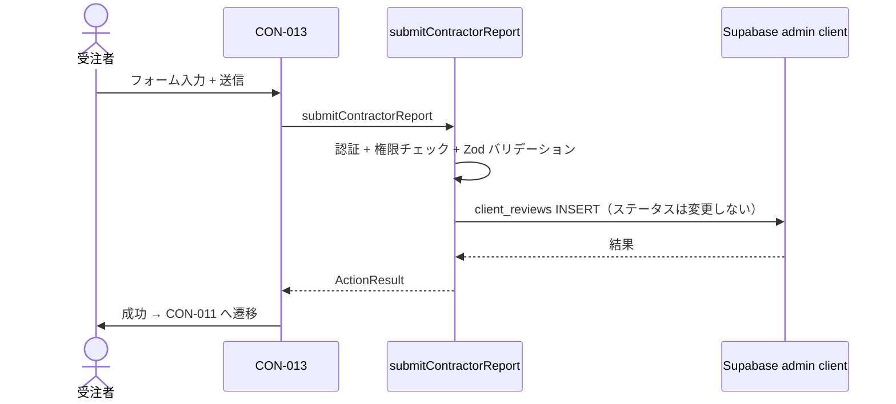
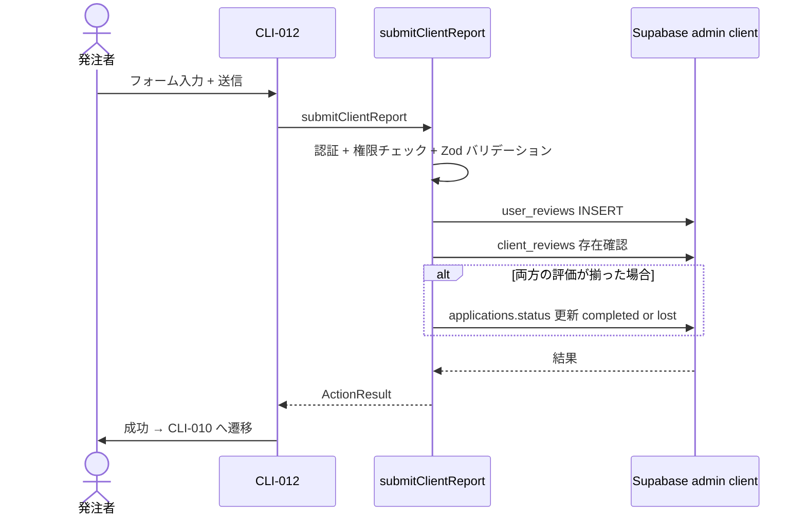
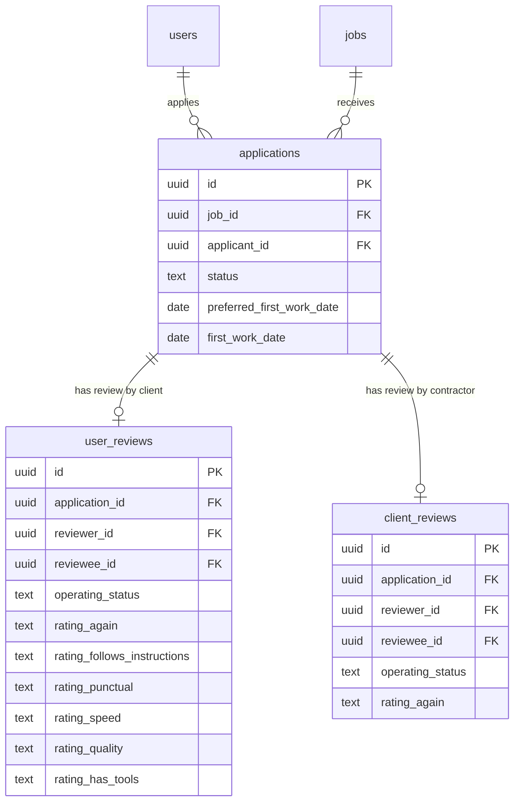

# マッチング機能（matching）— 技術設計

## Overview

**Purpose**: 応募から発注可否判断、作業完了/失注報告、相互評価までの一連のワークフローを管理する機能を提供する。受注者側の応募履歴管理と、発注者側の応募管理・発注履歴管理・評価機能を含む。

**Users**: 受注者（Contractor）は自分の応募履歴の確認・キャンセル・完了報告・発注者評価を行う。発注者（Client）・担当者（Staff）は案件への応募者の確認・発注可否判断・発注履歴管理・完了報告・受注者評価を行う。

**Impact**: 既存の applications テーブル（job-search spec で応募投入済み）に対し、ステータス管理・完了報告・相互評価のワークフローを追加する。新規画面 10 画面（CON-011〜013, CLI-007〜012, CLI-028）を実装する。

### Goals
- 受注者が応募履歴を一覧・詳細で確認し、条件付きでキャンセルできる
- 発注者が応募者を確認し、発注または断りの判断を行い、結果をメール通知できる
- 受注者・発注者双方が作業完了/失注の報告と相互評価を登録できる
- 発注者の評価履歴（受注者→発注者）を一覧表示できる

### Non-Goals
- 応募の投入処理（job-search spec で実装済み）
- メッセージ送受信機能（messaging spec で実装）
- 管理者による応募履歴管理（admin spec で実装）
- 評価の編集・削除（仕様上不可）

## Architecture

### Existing Architecture Analysis

job-search spec で確立されたパターンを踏襲する:
- Server Component + searchParams によるフィルター・ページネーション
- Server Action + `ActionResult<T>` による書き込み操作
- Zod スキーマによるバリデーション（クライアント + サーバー）
- Supabase `.select()` リレーション JOIN + `.range()` ページネーション
- applications テーブル、user_reviews テーブル、client_reviews テーブルは既にマイグレーション済み（002_core_tables.sql）
- RLS ポリシーも定義済み（003_rls_policies.sql）。ただし受注者によるキャンセル用 UPDATE ポリシーの追加が必要

### Architecture Pattern & Boundary Map

```mermaid
graph TB
    subgraph ContractorPages
        CON011[CON-011 応募履歴一覧]
        CON012[CON-012 応募詳細]
        CON013[CON-013 完了報告 評価]
    end

    subgraph ClientPages
        CLI007[CLI-007 応募一覧・未対応]
        CLI007B[CLI-007B 案件応募者一覧・全ステータス]
        CLI008[CLI-008 応募詳細]
        CLI009[CLI-009 発注可否]
        CLI010[CLI-010 発注履歴一覧・決定以降]
        CLI011[CLI-011 発注履歴詳細]
        CLI012[CLI-012 完了報告 評価]
        CLI028[CLI-028 発注者評価]
    end

    subgraph ServerActions
        CancelAction[cancelApplication]
        DecideAction[acceptApplication rejectApplication]
        ContractorReportAction[submitContractorReport]
        ClientReportAction[submitClientReport]
    end

    subgraph ExternalServices
        Resend[Resend メール送信]
    end

    subgraph Database
        Applications[applications]
        UserReviews[user_reviews]
        ClientReviews[client_reviews]
    end

    CON011 --> Applications
    CON012 --> CancelAction
    CON013 --> ContractorReportAction
    CLI007 --> Applications
    CLI007B --> Applications
    CLI008 --> Applications
    CLI009 --> DecideAction
    CLI010 --> Applications
    CLI011 --> Applications
    CLI012 --> ClientReportAction
    CLI028 --> ClientReviews

    CancelAction --> Applications
    DecideAction --> Applications
    DecideAction --> Resend
    ContractorReportAction --> Applications
    ContractorReportAction --> ClientReviews
    ClientReportAction --> Applications
    ClientReportAction --> UserReviews
```



**Architecture Integration**:
- Selected pattern: Next.js App Router Server Components + Server Actions（既存パターン踏襲）
- Domain boundaries: 受注者系（/applications/history/）と発注者系（/applications/received/, /applications/orders/）をサブパスで分離。**案件スコープの応募者一覧（CLI-007B）は `/jobs/[id]/applicants/` に配置**（CLI-002 からの導線で、案件単位で全ステータスを俯瞰するため）
- 発注者系の役割分離: **CLI-007（/applications/received/）= status='applied' のみ**、**CLI-010（/applications/orders/）= status≠'applied'**、**CLI-007B（/jobs/[id]/applicants/）= 全ステータス（案件スコープ）**
- Existing patterns preserved: ActionResult<T>、Zod バリデーション、Supabase Server Client
- New components rationale: 各画面は独立した RSC ページ。Server Actions は操作種別ごとに分離
- Steering compliance: 三重防御（Middleware + Server Action + RLS）、メール送信失敗時の非ロールバック方針を遵守

### Technology Stack

| Layer | Choice / Version | Role in Feature | Notes |
|-------|------------------|-----------------|-------|
| Frontend | Next.js App Router + React Server Components | 10 画面のページレンダリング | 既存パターン踏襲 |
| UI | shadcn/ui + Tailwind CSS | フォーム、テーブル、バッジ、ページネーション | design-rule.md に準拠 |
| Backend | Next.js Server Actions | 書き込み操作（キャンセル、発注可否、完了報告、評価） | ActionResult<T> パターン |
| Validation | Zod | フォームバリデーション（クライアント + サーバー） | |
| Data | Supabase (PostgreSQL) + RLS | applications, user_reviews, client_reviews | 既存テーブル活用 |
| Email | Resend + React Email | 発注/お断り通知メール | 2 テンプレート新規作成 |

## System Flows

### 応募ステータスライフサイクル



- `applied → cancelled`: 受注者のみ。初回稼働希望日の 5 日前まで。Server Action で日付チェック
- `applied → accepted`: 発注者のみ。first_work_date を設定し、メール通知を送信
- `applied → rejected`: 発注者のみ。メール通知を送信
- `accepted → completed / lost`: 受注者（CON-013）と発注者（CLI-012）の**両方が評価を登録した時点**で遷移する。どちらが先に評価してもよい。片方のみ登録した時点では `accepted` のまま維持し、画面表示上は自分が評価済みなら「評価登録済み」、相手が先に評価済みなら「評価登録未入力」とする。最終ステータスは発注者側の `operatingStatus` を `mapOperatingStatusToApplicationStatus()` でマッピングした値（「問題なく稼働完了」「一部欠席〜」→ completed、それ以外 → lost）を採用する

**表示ステータスの対応（受注者側）**:
- 応募結果待ち: status = 'applied'
- 稼働予定: status = 'accepted' かつ client_reviews なし・user_reviews なし（どちらも未評価）
- 評価登録未入力: status = 'accepted' かつ client_reviews なし・user_reviews あり（発注者は評価済み、自分はまだ）
- 評価登録済み: status = 'accepted' かつ client_reviews あり・user_reviews なし（自分は評価済み、発注者はまだ）
- 落選・キャンセル: status IN ('rejected', 'cancelled')
- 取引完了: status IN ('completed', 'lost')

**表示ステータスの対応（発注者側）**:
- 応募あり（未対応）: status = 'applied'
- 発注済み: status = 'accepted' かつ user_reviews なし・client_reviews なし（どちらも未評価）
- 評価登録未入力: status = 'accepted' かつ user_reviews なし・client_reviews あり（受注者は評価済み、自分はまだ）
- 評価登録済み: status = 'accepted' かつ user_reviews あり・client_reviews なし（自分は評価済み、受注者はまだ）
- キャンセル・お断り: status IN ('rejected', 'cancelled')
- 取引完了: status IN ('completed', 'lost')

### 発注可否フロー（CLI-009）



### 受注者の作業報告フロー（CON-013）



- CON-013 は client_reviews の INSERT を行い、user_reviews が既に存在する場合のみ applications.status を更新する
- これにより表示ステータスが「稼働予定」→「評価登録済み」に遷移する

### 発注者の完了報告 + 評価フロー（CLI-012）



- admin client（service_role）を使用し、評価登録と条件付きステータス更新を実行
- ステータスの completed/lost 遷移は、受注者・発注者の両方の評価が揃った時点で行う（どちらが先に評価してもよい）
- 権限チェックは Server Action 内で実施（応募の当事者であることを検証）

## Requirements Traceability

| Requirement | Summary | Components | Interfaces | Flows |
|-------------|---------|------------|------------|-------|
| 1 (REQ-MT-001) | 応募履歴一覧 | ApplicationHistoryPage | — | — |
| 2 (REQ-MT-002) | 応募詳細 + キャンセル | ApplicationDetailPage, cancelApplicationAction | Service | ステータスライフサイクル |
| 3 (REQ-MT-003) | 受注者 完了報告・評価 | ContractorReportPage, submitContractorReportAction | Service | 完了報告フロー |
| 4 (REQ-MT-004) | 応募一覧（発注者・未対応） | ReceivedApplicationsPage | — | — |
| 4B (REQ-MT-004B) | 案件応募者一覧（案件スコープ・全ステータス） | JobApplicantsPage | — | — |
| 5 (REQ-MT-005) | 応募詳細（発注者） | ReceivedApplicationDetailPage | — | — |
| 6 (REQ-MT-006) | 発注可否 | DecisionPage, acceptApplicationAction, rejectApplicationAction | Service | 発注可否フロー |
| 7 (REQ-MT-007) | 発注履歴一覧（発注可否決定以降） | OrderHistoryPage | — | — |
| 8 (REQ-MT-008) | 発注履歴詳細 | OrderDetailPage | — | — |
| 9 (REQ-MT-009) | 発注者 完了報告・評価 | ClientReportPage, submitClientReportAction | Service | 完了報告フロー |
| 10 (REQ-MT-010) | 発注者評価表示 | ClientReviewsPage | — | — |

## Components and Interfaces

| Component | Domain/Layer | Intent | Req Coverage | Key Dependencies | Contracts |
|-----------|-------------|--------|--------------|------------------|-----------|
| ApplicationHistoryPage | UI/受注者 | 応募履歴一覧表示 | 1 | Supabase (P0) | — |
| ApplicationDetailPage | UI/受注者 | 応募詳細 + キャンセル | 2 | cancelApplicationAction (P0) | — |
| ContractorReportPage | UI/受注者 | 完了報告 + 発注者評価 | 3 | submitContractorReportAction (P0) | — |
| ReceivedApplicationsPage | UI/発注者 | 応募一覧表示（status='applied' のみ・未対応インボックス） | 4 | Supabase (P0) | — |
| JobApplicantsPage | UI/発注者 | 案件スコープの全ステータス応募者一覧（CLI-007B, /jobs/[id]/applicants） | 4B | Supabase (P0), StatusFilter/SortButton 共有 | — |
| ReceivedApplicationDetailPage | UI/発注者 | 応募詳細 + 評価履歴 | 5 | Supabase (P0) | — |
| DecisionPage | UI/発注者 | 発注/お断り画面 | 6 | accept/rejectApplicationAction (P0) | — |
| OrderHistoryPage | UI/発注者 | 発注履歴一覧（status≠'applied'・決定以降） | 7 | Supabase (P0) | — |
| OrderDetailPage | UI/発注者 | 発注履歴詳細 | 8 | Supabase (P0) | — |
| ClientReportPage | UI/発注者 | 完了報告 + 受注者評価 | 9 | submitClientReportAction (P0) | — |
| ContractorReviewsPage | UI/共通 | 受注者への評価（6項目）集計表示 | 10 | Supabase (P0) | — |
| cancelApplicationAction | Action | 応募キャンセル | 2 | Supabase (P0) | Service |
| acceptApplicationAction | Action | 発注承認 + メール通知 | 6 | Supabase (P0), Resend (P1) | Service |
| rejectApplicationAction | Action | お断り + メール通知 | 6 | Supabase (P0), Resend (P1) | Service |
| submitContractorReportAction | Action | 受注者 完了報告 + 発注者評価 | 3 | Supabase admin (P0) | Service |
| submitClientReportAction | Action | 発注者 完了報告 + 受注者評価 | 9 | Supabase admin (P0) | Service |

### UI Layer — 受注者系

#### ApplicationHistoryPage (CON-011)

| Field | Detail |
|-------|--------|
| Intent | 受注者の応募履歴を一覧表示する |
| Requirements | 1 |

**Responsibilities & Constraints**
- Server Component で RSC データフェッチ。searchParams によるページネーション（20件）
- applications テーブルから `applicant_id = current_user` のレコードを取得
- jobs リレーション JOIN で案件情報（タイトル、発注者名）を取得
- ソート: `created_at` のデフォルト DESC。searchParams `sort=asc|desc` でトグル可能

**Implementation Notes**
- ファイル: `src/app/(authenticated)/applications/history/page.tsx`
- デザインカンプ: design-assets/screens/CON-011.png
- 「戻る」ボタン: router.back() で前の画面に戻る
- ページネーション: searchParams `page` パラメータ + `.range()` クエリ
- 各行クリックで `/applications/history/[id]` に遷移
- ステータスフィルター: プルダウン選択時に即時フィルタリング（検索ボタン不要）。プルダウンの状態は URL searchParams を Single Source of Truth とする
- ソートボタン: 検索結果件数の右に配置。クリックで `sort` searchParam を `asc` ↔ `desc` にトグル。現在のソート順（「新しい順」/「古い順」）をアイコン横にテキスト表示。フィルター条件は維持される
- ステータスカテゴリ分岐: `client_reviews` と `user_reviews` の両テーブルとの LEFT JOIN で accepted を「稼働予定」（両方なし）/「評価登録未入力」（相手のみあり）/「評価登録済み」（自分のみあり）に分岐
- ステータスバッジ配色ルール（全体的に薄いトーン、カプセル型 `rounded-full`）:
  - 応募結果待ち: 青系（`bg-blue-50 text-blue-400`）— 待機中
  - 応募あり（未対応）: 赤系（`bg-red-50 text-red-400`）— 発注者側、対応必要
  - 稼働予定: 紫系（`bg-[rgba(146,7,131,0.05)] text-primary/60`）— アクティブ
  - 発注済み: 紫系（同上）— 発注者側、アクティブ
  - 評価登録未入力: 黄系（`bg-yellow-50 text-yellow-500`）— 自分の評価が必要
  - 評価登録済み: オレンジ系（`bg-orange-50 text-orange-400`）— 相手の評価待ち
  - 落選・キャンセル / キャンセル・お断り: 薄グレー（`bg-muted/50 text-muted-foreground/60`）— 非アクティブ
  - 取引完了: 緑系（`bg-green-50 text-green-400`）— 成功

#### ApplicationDetailPage (CON-012)

| Field | Detail |
|-------|--------|
| Intent | 応募詳細を表示し、条件付きでキャンセルを提供する |
| Requirements | 2 |

**Responsibilities & Constraints**
- 案件情報（タイトル、職種、報酬、勤務地、工期）と応募情報（人数、日程、初回稼働希望日、申し送り）を表示
- ステータスが `applied` の場合のみ「応募をキャンセルする」ボタンを表示
- キャンセル可否判定: `preferred_first_work_date - 5日 > NOW()` → 可能。超過時はボタン非活性 + 注意文言:「初回稼働日の5日前を過ぎたため、システムからはキャンセルできません。キャンセルが必要な場合は、発注者にメッセージでご連絡ください。」
- ステータスが `accepted` の場合は「作業完了/失注報告」ボタンを表示。キャンセルボタンは非表示（発注済みの応募は受注者からキャンセル不可。発注者に連絡して対応してもらう）
- ステータスが `rejected`/`completed`/`cancelled`/`lost` の場合は操作ボタンなし（閲覧のみ）
- ステータスが `rejected` または `cancelled` の場合: ステータスバッジ直下に注意書きテキストを表示（`text-body-sm text-red-500`、枠なし）
  - rejected: 「この応募はお断りとなりました。稼働は行われていません。」
  - cancelled: 「この応募はキャンセルしました。稼働は行われていません。」

**Implementation Notes**
- ファイル: `src/app/(authenticated)/applications/history/[id]/page.tsx`
- デザインカンプ: design-assets/screens/CON-012.png
- 「戻る」ボタン: router.back() で前の画面に戻る
- キャンセル確認: shadcn AlertDialog を使用
- キャンセル成功後: `/applications/history` に遷移（router.push）
- 5日前判定はサーバー側（Server Component）で計算し、props として渡す
- 「勤務についての詳細」セクション（status='accepted' のみ表示）:
  - Card ではなくボーダー付き div（`border border-border rounded-[8px] p-4`）
  - セクション見出しはボックスの外（上）に太字配置
  - 全8項目を常に表示（null の場合は「—」）:
    - 【勤務地】jobs.prefecture + jobs.address
    - 【勤務日・稼働時間】jobs.work_start_date〜work_end_date + jobs.work_hours
    - 【持ち物】jobs.items
    - 【必須スキル】jobs.required_skills
    - 【業務に関する書類】job_images（image_type='document'）+ applications.document_urls（応募レベルの追加書類、`createSignedUrl()` で Signed URL を生成して表示）を統合表示
    - 【その他】applications.client_notes（CLI-009-B で発注者が入力）
    - 【初回稼働日】applications.first_work_date
    - ※【申し送り】は「以下の内容で応募済みです。」セクションで表示済みのため含めない
- 「募集案件詳細」ボタン: ピル型（`rounded-full`）、中央寄せ、テキスト幅
- 「評価を入力する」ボタン: ピル型、中央寄せ、`text-white` 明示
- 「もどる」ボタン: ピル型、中央寄せ、`variant="outline"`

#### ContractorReportPage (CON-013)

| Field | Detail |
|-------|--------|
| Intent | 受注者が完了/失注報告と発注者評価を同時に登録する |
| Requirements | 3 |

**Responsibilities & Constraints**
- 入力フィールド: 稼働状況（必須）、補足（任意）、また仕事を受けたいか（必須）、評価補足コメント（任意）
- client_reviews テーブルにデータを INSERT
- INSERT 後に user_reviews（発注者の評価）が既に存在するか確認し、存在する場合は applications.status を発注者の operatingStatus に基づいて completed/lost に更新する。存在しない場合は `accepted` のまま維持する
- 保存成功後: `/mypage?success=report` に遷移し、マイページトップでトースト通知を表示

**Implementation Notes**
- ファイル: `src/app/(authenticated)/applications/history/[id]/report/page.tsx`
- デザインカンプ: design-assets/screens/CON-013.png
- 「戻る」ボタン: router.back() で前の画面に戻る
- Client Component（フォーム操作のため `"use client"`）
- 事前チェック: 応募の applicant_id が current_user と一致し、status が `accepted` であること
- 保存成功後: `router.push('/mypage?success=report')` で遷移。マイページの SuccessToast コンポーネントが `?success=report` を検知し sonner トーストを表示後、`router.replace` で URL パラメータを除去する

### UI Layer — 発注者系

#### ReceivedApplicationsPage (CLI-007) — 未対応インボックス

| Field | Detail |
|-------|--------|
| Intent | 自社案件への **未対応応募（status='applied'）のみ** を表示する未対応インボックス |
| Requirements | 4 |

**Responsibilities & Constraints**
- Server Component。案件ごとのフィルタリング可能
- WHERE 句: `jobs.owner_id = current_user AND applications.status = 'applied'`（唯一の条件）。発注可否が決まった応募は CLI-010 側の役割なのでここには出ない
- users リレーション JOIN で応募者情報を取得。user_skills, user_available_areas も JOIN して対応可能エリア・経験年数を表示
- ステータスバッジは常に「応募あり」（applied 固定）
- カードリスト: `max-w-6xl mx-auto` で中央寄せ。レスポンシブグリッド（`grid grid-cols-1 md:grid-cols-2 lg:grid-cols-3 gap-4`）
- ソート: searchParams `sort=asc|desc` で created_at の昇順/降順トグル。`icon-sort.png` アイコンをクリックでトグル
- 空メッセージ: 「未対応の応募はありません」
- ページネーション: 20件

**Implementation Notes**
- ファイル: `src/app/(authenticated)/applications/received/page.tsx`
- デザインカンプ: design-assets/screens/CLI-007.png
- 「戻る」ボタン: router.back() で前の画面に戻る
- 案件フィルター: searchParams `jobId` パラメータ
- ソートアイコン: `<Link>` で `sort` searchParam をトグル
- Middleware: 発注者（client）・担当者（staff）のみアクセス可能
- 各カードの「応募詳細をみる」ボタンで `/applications/received/[id]` に遷移
- アイコン使い分け: 対応可能エリア=`icon-globe.png`、経験年数=`icon-briefcase.png`
- 案件単位で全ステータスを俯瞰したい場合は CLI-007B（JobApplicantsPage）を使う

#### JobApplicantsPage (CLI-007B) — 案件スコープの全ステータス表示

| Field | Detail |
|-------|--------|
| Intent | 指定案件に紐づく **全ステータスの応募者** を俯瞰する案件スコープ画面。CLI-002 の「応募者をみる」からの導線 |
| Requirements | 4B |

**Responsibilities & Constraints**
- Server Component。URL: `/jobs/[id]/applicants`
- WHERE 句: `applications.job_id = :id`（案件単位、status 制限なし = 全ステータス）
- 認可: 対象案件の owner_id、または案件の organization の組織メンバーのみ閲覧可。それ以外は `notFound()`
- 案件情報を上部バナーに **1 回だけ**表示。カード内では案件情報を重複表示しない
- ステータスフィルタ: StatusFilter 共有コンポーネント（`includeApplied={true}` variant）。「応募あり（未対応）」を含む全カテゴリ選択可
- アクションボタン: ステータスで出し分け
  - `status === 'applied'` → 「応募詳細をみる」→ `/applications/received/[id]`（CLI-008）
  - それ以外 → 「発注内容詳細をみる」→ `/applications/orders/[id]`（CLI-011）
- 「ユーザー詳細をみる」ボタンは CLI-010 と同じ
- スカウト経由バッジ: `scout_message_id IS NOT NULL` のとき表示
- デフォルトソート: updated_at DESC
- ページネーション: 20件

**Implementation Notes**
- ファイル: `src/app/(authenticated)/jobs/[id]/applicants/page.tsx`
- デザインカンプ: 無し（CLI-010 の UI を流用）
- 「戻る」ボタン: `<BackButton href="/jobs/[id]?manage=true" />` で CLI-002 に戻る
- 権限チェックは CLI-002 管理ビューと同じパターン（isOwner || isOrganizationMember）
- StatusFilter / SortButton は CLI-010 と共有（`basePath`, `includeApplied` props でバリアント化）

#### ReceivedApplicationDetailPage (CLI-008)

| Field | Detail |
|-------|--------|
| Intent | 応募者のプロフィールと応募内容を表示する |
| Requirements | 5 |

**Responsibilities & Constraints**
- レスポンシブ: `max-w-2xl mx-auto` で中央寄せ
- 案件情報セクション: アイコン付き（icon-coin, icon-pin, icon-calendar, Clock）で報酬・エリア・募集期間・稼働時間を表示
- 「募集案件詳細」ボタン: primary 塗りつぶしピル型（`text-white`）、CON-003 に遷移
- 区切り線 + 「以下の内容で応募があります。」テキスト
- ユーザー情報セクション: 氏名（年齢）、職種、バッジ、対応可能エリア・経験年数・保有スキル・保有資格は全て CheckCircle2 アイコンで統一
- 「ユーザー詳細」ボタン: primary 塗りつぶしピル型（`text-white`）、ユーザー詳細に遷移
- 応募内容セクション: 人数・日程・希望初回稼働日・申し送りを CheckCircle2 アイコン付きで表示
- 「発注可否」ボタン: status === 'applied' のみ表示。CLI-009 へ遷移
- 全ボタン幅: `w-full max-w-xs` で統一、中央寄せ

**Implementation Notes**
- ファイル: `src/app/(authenticated)/applications/received/[id]/page.tsx`
- デザインカンプ: design-assets/screens/CLI-008.png
- 「戻る」ボタン: router.back() で前の画面に戻る。`w-full max-w-xs` で他ボタンと幅統一
- データ取得: applicant の users に加え、user_skills, user_available_areas, user_qualifications も並列取得
- 退会済みユーザー: getUserDisplayName() で表示名を処理

#### DecisionPage (CLI-009)

| Field | Detail |
|-------|--------|
| Intent | 応募に対する発注承認またはお断りを実行する |
| Requirements | 6 |

**Responsibilities & Constraints**
- 「発注する」: applications.status → `accepted`、first_work_date 設定、メール通知
- 「お断りする」: applications.status → `rejected`、メール通知
- 完了後: ポップアップ「ユーザーへ結果を送信しました」→ CLI-007 へ遷移

**Implementation Notes**
- ファイル: `src/app/(authenticated)/applications/received/[id]/decide/page.tsx` + `decision-form.tsx`（Client Component）
- デザインカンプ: design-assets/screens/CLI-009.png（バリエーション: CLI-009-b.png = 発注選択時、CLI-009-c.png = お断り選択時）
- レスポンシブ: `max-w-2xl mx-auto` で中央寄せ
- 「戻る」ボタン: router.back() で前の画面に戻る
- 応募内容セクション: 人数・日程・希望初回稼働日・申し送りの各項目に CircleCheck アイコン（`text-primary/70`）を付与。ラベルとコロンなし
- **段階的フォーム表示**: `useState<'accept' | 'reject' | null>` で状態管理。プルダウン onChange で state 更新のみ。送信はボタンクリック時
- CLI-009-B（`decision === 'accept'` 時に条件レンダリング）:
  - 入力フィールド: 勤務地（必須、jobs 住所で初期値プリフィル）、業務に関する書類（既存 job_images 表示 + 追加アップロード）、その他（テキストエリア）、初回稼働日（必須、日付入力）
  - 書類アップロード: `application-documents` バケットに Storage アップロード → `applications.document_urls` にファイルパス配列保存（非公開バケットのため URL ではなくパスを保存。表示時に `createSignedUrl()` で Signed URL を生成）
  - acceptApplicationAction で client_notes, first_work_date, document_urls を更新
- CLI-009-C（`decision === 'reject'` 時に条件レンダリング）:
  - 入力フィールド: お断りの理由（任意、テキストエリア）
  - rejectApplicationAction で rejection_reason を更新
  - rejection_reason は受注者には非公開
- 送信成功後: AlertDialog「ユーザーへ結果を送信しました」→ OK → `/applications/received` へ遷移

#### OrderHistoryPage (CLI-010) — 発注可否決定以降の管理ダッシュボード

| Field | Detail |
|-------|--------|
| Intent | 発注可否決定以降（status ≠ 'applied'）の応募一覧を表示する。未対応応募は CLI-007 側 |
| Requirements | 7 |

**Responsibilities & Constraints**
- applications から `status IN ('accepted', 'completed', 'lost', 'cancelled', 'rejected')` のレコードを取得。**`applied` は含めない**（CLI-007 側の役割）
- 自社案件（jobs.owner_id = current_user）に限定
- ステータスフィルター: プルダウン変更時に即座にフィルタリング（検索ボタンなし、CON-011 と同じ方式）。StatusFilter 共有コンポーネント（`includeApplied={false}` variant）
  - すべて / 発注済み / 評価登録未入力 / 評価登録済み / キャンセル・お断り / 取引完了
  - 「応募あり（未対応）」は CLI-010 では選択肢から**除外**（CLI-007 側の役割）
  - 「発注済み」= accepted + 両方なし、「評価登録未入力」= accepted + client_reviews あり + user_reviews なし、「評価登録済み」= accepted + user_reviews あり + client_reviews なし
- フィルター状態: URL searchParams（`status`, `sort`, `page`）を Single Source of Truth とする
- 並び替え: `icon-sort.png` クリックで updated_at DESC ↔ ASC トグル
- カード表示項目:
  - ステータスバッジ（発注済み=紫、評価登録未入力=黄、評価登録済み=オレンジ、キャンセル・お断り=グレー、取引完了=緑）
  - 受注者情報: アバター、氏名（年齢）、職種タグ、本人確認/CCUSバッジ、対応可能エリア、経験年数
  - 「このユーザーは以下の案件に応募済みです」テキスト
  - 内側カード: 案件タイトル、募集職種・人数、締め切り
  - アクションボタン: 「ユーザー詳細をみる」（outline）/ 「発注内容詳細をみる」（primary → CLI-011）
- ページネーション: 20件
- クライアントコンポーネント: `status-filter.tsx`（`basePath`, `includeApplied` props を持つ共有）、`sort-button.tsx`（`basePath` props を持つ共有）

**Implementation Notes**
- ファイル: `src/app/(authenticated)/applications/orders/page.tsx`
- デザインカンプ: design-assets/screens/CLI-010.png
- 「戻る」ボタン: router.back() で前の画面に戻る
- ソート: updated_at DESC（デフォルト）

#### OrderDetailPage (CLI-011)

| Field | Detail |
|-------|--------|
| Intent | 発注済み案件の詳細とステータスを表示する |
| Requirements | 8 |

**Responsibilities & Constraints**
- CON-012（ApplicationDetailPage）と同一のレイアウト・アイコンパターンを使用する
- セクション構成（Card ラッパーなし、フラットレイアウト）:
  1. 案件情報: タイトル、募集職種・人数、報酬（icon-coin）、エリア（icon-pin）、募集期間（icon-calendar）、稼働時間（CheckCircle2）
     - 「募集案件詳細」ボタン → `/jobs/[id]`（CON-003）
  2. ユーザー情報: アバター、氏名（年齢 = calculateAge(birth_date)）、職種一覧、本人確認/CCUSバッジ（icon-tag）、対応可能エリア、経験年数、保有スキル、保有資格（各 CheckCircle2）
     - 「ユーザー詳細」ボタン → `/users/contractors/[id]`
  3. 応募内容: 人数、日程、希望初回稼働日、申し送り（各 CheckCircle2）
- ステータスバッジ: getOrderDisplayCategory() で表示カテゴリを判定
- ステータスが `rejected` または `cancelled` の場合: ステータスバッジ直下に注意書きテキストを表示（`text-body-sm text-red-500`、枠なし）
  - rejected: 「この応募はお断りしています。稼働は行われていません。」
  - cancelled: 「この応募は応募者によりキャンセルされました。稼働は行われていません。」
- ステータスが `accepted` かつ評価未登録の場合は「評価入力」ボタン → CLI-012 へ遷移
- データ取得: applications（jobs, users 結合）+ user_skills, user_available_areas, user_qualifications を並列取得。ステータスフィルター: `["applied", "accepted", "completed", "lost", "cancelled", "rejected"]`（全ステータス対応）

**Implementation Notes**
- ファイル: `src/app/(authenticated)/applications/orders/[id]/page.tsx`
- デザインカンプ: design-assets/screens/CLI-011.png
- 「戻る」ボタン: BackButton コンポーネント（router.back()）
- 退会済みユーザー: getUserDisplayName() で表示名を処理

#### ClientReportPage (CLI-012)

| Field | Detail |
|-------|--------|
| Intent | 発注者が完了/失注報告と受注者評価（6項目）を同時に登録する |
| Requirements | 9 |

**Responsibilities & Constraints**
- 入力フィールド: 稼働状況（必須、受注者側 CON-013 と同じ6選択肢）、補足（任意）、評価6項目（各必須、good/bad、lucide-react の ThumbsUp/ThumbsDown アイコンで表示）、評価補足コメント（任意）
- user_reviews テーブルにデータを INSERT
- INSERT 後に client_reviews（受注者の評価）が既に存在するか確認し、存在する場合は applications.status を mapOperatingStatusToApplicationStatus() でマッピングした値（'completed' / 'lost'）に更新する。存在しない場合は `accepted` のまま維持する
- 保存成功後: `/applications/orders` に遷移

**Implementation Notes**
- ファイル: `src/app/(authenticated)/applications/orders/[id]/report/page.tsx`
- デザインカンプ: design-assets/screens/CLI-012.png
- 「戻る」ボタン: router.back() で前の画面に戻る
- Client Component（フォーム操作のため）
- 事前チェック: 案件の owner_id が current_user（or 同一組織メンバー）と一致し、status が `accepted`

#### ContractorReviewsPage (CLI-028)

| Field | Detail |
|-------|--------|
| Intent | 発注者→受注者の評価（6項目）の集計一覧を表示する |
| Requirements | 10 |

**Responsibilities & Constraints**
- user_reviews から reviewee_id = 対象受注者 のレコードを取得
- ユーザープロフィールセクション: users テーブルから avatar_url, last_name, first_name, birth_date, identity_verified, ccus_verified を取得して表示。favorites テーブルからお気に入り状態も取得
- 6項目（rating_again, rating_punctual, rating_follows_instructions, rating_speed, rating_quality, rating_has_tools）の Good 集計を `good数/総件数案件中` の形式で表示
- 「稼働状況の補足」セクション: user_reviews.status_supplement の一覧を表示（20件ごとにページネーション、searchParams `sp`）
- 「評価の補足」セクション: user_reviews.comment の一覧を表示（20件ごとにページネーション、searchParams `cp`）
- 両セクションとも薄紫（bg-primary/10）ヘッダー + 白背景のカードレイアウト

**Implementation Notes**
- ファイル: `src/app/(authenticated)/users/[id]/reviews/page.tsx`
- デザインカンプ: design-assets/screens/CLI-028.png
- 「戻る」ボタン: BackButton コンポーネント（router.back()）
- Server Component（読み取りのみ）。ただし FavoriteButton は Client Component として埋め込み

### Action Layer

#### cancelApplicationAction

| Field | Detail |
|-------|--------|
| Intent | 受注者が応募をキャンセルする |
| Requirements | 2 |

**Dependencies**
- Inbound: ApplicationDetailPage — キャンセルボタン押下 (P0)
- External: Supabase — applications テーブル更新 (P0)

**Contracts**: Service [x]

##### Service Interface
```typescript
// src/app/(authenticated)/applications/actions.ts

async function cancelApplicationAction(
  applicationId: string
): Promise<ActionResult>
```
- Preconditions: ユーザーが認証済み、applicant_id = current_user、status = 'applied'、preferred_first_work_date - 5日 > NOW()
- Postconditions: applications.status = 'cancelled'
- Invariants: キャンセル済みの応募は再キャンセル不可

**Implementation Notes**
- 認証チェック → 応募の所有者チェック → ステータスチェック → 5日前制限チェック → status 更新
- RLS: 受注者用 UPDATE ポリシーが必要（マイグレーション追加）

#### acceptApplicationAction

| Field | Detail |
|-------|--------|
| Intent | 発注者が応募を承認し、メール通知を送信する |
| Requirements | 6 |

**Dependencies**
- Inbound: DecisionPage — 発注ボタン押下 (P0)
- External: Supabase — applications 更新 (P0)
- External: Resend — メール通知 (P1)

**Contracts**: Service [x]

##### Service Interface
```typescript
async function acceptApplicationAction(
  formData: FormData
): Promise<ActionResult>
// FormData: applicationId (string), firstWorkDate (string: YYYY-MM-DD)
```
- Preconditions: ユーザーが認証済み、案件の owner_id = current_user（or 同一組織）、status = 'applied'
- Postconditions: applications.status = 'accepted'、first_work_date 設定、受注者へメール通知
- Invariants: 既に accepted/rejected の応募は変更不可

**Implementation Notes**
- Zod バリデーション: firstWorkDate は有効な日付であること
- メール送信失敗は catch してログ記録。本体処理はロールバックしない
- メールテンプレート: `src/lib/email/templates/application-accepted.tsx`
- **clientName の名前解決**: ハードコード `"発注者"` ではなく、`resolveParticipantName()` で動的に解決。全プラン共通: 案件オーナーの `client_profiles.display_name`（CLI-021 で入力した社名・氏名）→ `users.last_name + first_name`（フォールバック）。法人プランの Staff が操作した場合は Owner の `client_profiles.display_name` を使用
- **applicantName の名前解決**: `users.company_name → users.last_name + first_name`

#### rejectApplicationAction

| Field | Detail |
|-------|--------|
| Intent | 発注者が応募を拒否し、メール通知を送信する |
| Requirements | 6 |

**Dependencies**
- Inbound: DecisionPage — お断りボタン押下 (P0)
- External: Supabase — applications 更新 (P0)
- External: Resend — メール通知 (P1)

**Contracts**: Service [x]

##### Service Interface
```typescript
async function rejectApplicationAction(
  applicationId: string
): Promise<ActionResult>
```
- Preconditions: ユーザーが認証済み、案件の owner_id = current_user（or 同一組織）、status = 'applied'
- Postconditions: applications.status = 'rejected'、受注者へメール通知

**Implementation Notes**
- メールテンプレート: `src/lib/email/templates/application-rejected.tsx`
- **clientName / applicantName の名前解決**: acceptApplicationAction と同じルール

#### submitContractorReportAction

| Field | Detail |
|-------|--------|
| Intent | 受注者が完了/失注報告と発注者評価を登録する |
| Requirements | 3 |

**Dependencies**
- Inbound: ContractorReportPage — フォーム送信 (P0)
- External: Supabase admin client — applications 更新 + client_reviews INSERT (P0)

**Contracts**: Service [x]

##### Service Interface
```typescript
async function submitContractorReportAction(
  formData: FormData
): Promise<ActionResult>
// FormData: applicationId, operatingStatus ('completed'|'lost'),
//   statusSupplement?, ratingAgain ('good'|'bad'), comment?
```
- Preconditions: ユーザーが認証済み、applicant_id = current_user、status = 'accepted'、client_reviews に未登録
- Postconditions: client_reviews に 1 レコード INSERT。user_reviews が既に存在する場合は applications.status を発注者の operatingStatus に基づいて更新
- Invariants: UNIQUE (application_id) 制約により二重登録防止

**Implementation Notes**
- admin client（service_role）を使用して原子的に実行
- 権限チェックは Server Action 内で実施（通常クライアントで応募を取得して所有者検証後、admin client で書き込み）
- Zod スキーマ: operatingStatus, ratingAgain は必須。statusSupplement, comment は任意

#### submitClientReportAction

| Field | Detail |
|-------|--------|
| Intent | 発注者が完了/失注報告と受注者評価（6項目）を登録する |
| Requirements | 9 |

**Dependencies**
- Inbound: ClientReportPage — フォーム送信 (P0)
- External: Supabase admin client — applications 更新 + user_reviews INSERT (P0)

**Contracts**: Service [x]

##### Service Interface
```typescript
async function submitClientReportAction(
  formData: FormData
): Promise<ActionResult>
// FormData: applicationId, operatingStatus ('completed'|'lost'),
//   statusSupplement?, ratingAgain ('good'|'bad'),
//   ratingFollowsInstructions ('good'|'bad'),
//   ratingPunctual ('good'|'bad'), ratingSpeed ('good'|'bad'),
//   ratingQuality ('good'|'bad'), ratingHasTools ('good'|'bad'),
//   comment?
```
- Preconditions: ユーザーが認証済み、案件の owner_id = current_user（or 同一組織）、status = 'accepted'、user_reviews に未登録
- Postconditions: applications.status 更新、user_reviews に 1 レコード INSERT
- Invariants: UNIQUE (application_id) 制約により二重登録防止

**Implementation Notes**
- admin client（service_role）を使用して原子的に実行
- 6 つの評価項目すべて必須。Zod スキーマで検証

## Data Models

### Domain Model



- applications : user_reviews = 1:0..1（発注者が評価を登録するまでは 0）
- applications : client_reviews = 1:0..1（受注者が評価を登録するまでは 0）
- 評価は一度登録すると更新・削除不可（UNIQUE 制約 + UPDATE/DELETE RLS 不可）

### Physical Data Model

テーブル定義は database-schema.md を参照。既にマイグレーション済み（002_core_tables.sql）。

**追加マイグレーション**: applications テーブルの UPDATE 用 RLS ポリシーの置き換え

既存の UPDATE ポリシー（003_rls_policies.sql で作成済み）は WITH CHECK 制約がなく、
任意のステータスに変更できてしまう。マッチング機能ではステータス遷移を厳密に制御するため、
既存ポリシーを DROP してから制限付きポリシーを新規作成する。

```sql
-- 既存の UPDATE ポリシーを削除（003_rls_policies.sql で作成されたもの）
-- ※ ポリシー名は 003_rls_policies.sql の実装に合わせること
DROP POLICY IF EXISTS "applications_update" ON applications;

-- 1. 受注者が自分の応募をキャンセルできる UPDATE ポリシー
CREATE POLICY "applicants_can_cancel_own_applications"
  ON applications FOR UPDATE
  USING (applicant_id = auth.uid() AND status = 'applied')
  WITH CHECK (status = 'cancelled');

-- 2. 発注者（案件オーナー or 同一組織メンバー）が応募を accepted/rejected に変更できる UPDATE ポリシー
CREATE POLICY "job_owners_can_decide_applications"
  ON applications FOR UPDATE
  USING (
    EXISTS (
      SELECT 1 FROM jobs
      WHERE jobs.id = applications.job_id
      AND (jobs.owner_id = auth.uid() OR jobs.organization_id IN (
        SELECT organization_id FROM organization_members WHERE user_id = auth.uid()
      ))
    )
    AND status = 'applied'
  )
  WITH CHECK (status IN ('accepted', 'rejected'));
```

注意: DROP するポリシーの名前は、003_rls_policies.sql の実際の実装を確認して合わせること。
完了報告によるステータス変更（accepted → completed/lost）は admin client（サービスロール = RLS を迂回する管理者権限）を使うため、追加の UPDATE ポリシーは不要。

**client_reviews の SELECT ポリシー**: `can_view_client_review(reviewee_id)` 関数で制御。以下の条件のいずれかを満たす場合に閲覧可能:
1. 被評価者本人（reviewee_id = auth.uid()）
2. 評価投稿者本人（reviewer_id = auth.uid()）— 受注者が自分の書いた評価を確認するために必要
3. 同一組織メンバー

## Error Handling

### Error Strategy

| Error | Category | Response | Recovery |
|-------|----------|----------|----------|
| 未認証 | User 401 | ログイン画面にリダイレクト | Middleware で処理 |
| 権限不足（他人の応募） | User 403 | 「この操作を実行する権限がありません」 | 一覧画面に戻す |
| ステータス不正（キャンセル不可） | Business 422 | 「この応募はキャンセルできません」 | 詳細画面に留まる |
| 5日前制限超過 | Business 422 | 注意文言を表示（CON-012 参照） | ボタン非活性 |
| 評価二重登録 | Business 409 | 「既に評価を登録済みです」 | 一覧画面に戻す |
| メール送信失敗 | System 500 | ログ記録のみ。ユーザーには成功を返す | Resend 自動リトライに委任 |
| DB エラー | System 500 | 「処理中にエラーが発生しました」 | ログ記録。ユーザーにリトライを促す |

## Testing Strategy

### Unit Tests
- Zod バリデーションスキーマ（contractorReportSchema, clientReportSchema, acceptApplicationSchema）
- 5日前制限の判定ロジック（canCancelApplication 関数）
- ステータス遷移の妥当性判定

### Integration Tests（高リスク: 書き込み + 権限）
- cancelApplicationAction: 本人のみキャンセル可、5日前制限、ステータスチェック
- acceptApplicationAction: 案件所有者のみ、ステータス遷移、メール送信呼び出し
- rejectApplicationAction: 案件所有者のみ、ステータス遷移、メール送信呼び出し
- submitContractorReportAction: 応募者のみ、accepted ステータスチェック、client_reviews INSERT
- submitClientReportAction: 案件所有者のみ、accepted ステータスチェック、user_reviews INSERT、6項目バリデーション

### RLS Tests（pgTAP）
- 受注者が自分の応募のみ閲覧可能
- 発注者が自社案件への応募のみ閲覧可能
- 受注者が自分の応募を cancelled に変更可能
- 受注者が他人の応募を変更不可
- 評価は全ユーザーが閲覧可能
- 評価の UPDATE/DELETE は不可

### E2E Tests（Playwright）
- 受注者: 応募履歴一覧 → 詳細 → キャンセル
- 発注者: 応募一覧（CLI-007・applied のみ）→ 詳細 → 発注 → 発注履歴（CLI-010）に表示を確認
- 発注者: 応募一覧（CLI-007）→ 詳細 → お断り
- 発注者: 発注履歴詳細 → 完了報告 + 評価登録
- 発注者: CLI-007/CLI-010 の役割分離（CLI-010 のフィルタに「応募あり（未対応）」が無い、CLI-007 の空メッセージ表記）
- 発注者: CLI-002（募集現場詳細）→「応募者をみる」→ CLI-007B（案件応募者一覧・全ステータス）の導線
- CLI-007B の権限チェック（他社ユーザーは 404）
- CLI-007B のステータスフィルタに「応募あり（未対応）」が含まれる

## Security Considerations

- **Middleware**: 受注者系画面（/applications/history/）は受注者（contractor）・発注者（client）のみアクセス可。担当者（staff）はブロック（staffは応募できないのでデータなし）。発注者系画面（/applications/received/, /applications/orders/）は発注者（client）・担当者（staff）のみ。**実装時に src/middleware.ts で "/applications/history" を staff ブロック対象に、"/applications/received", "/applications/orders" を CLIENT_ONLY_PREFIXES に追加すること。**
- **CLI-007B（/jobs/[id]/applicants）**: Middleware ではブロックしない（`/jobs/[id]` は CON-003 として全ロール閲覧可のため）。権限制御は **ページ内で `notFound()`** により実施（isOwner || isOrganizationMember でない場合は 404）。`notFound()` に到達する前に RLS も二重防御として働く
- **Server Action**: 全アクションで認証チェック + 所有権チェック（applicant_id or job.owner_id）を実施
- **RLS**: 既存ポリシー + 受注者キャンセル用 UPDATE ポリシー + 発注者 accept/reject 用 UPDATE ポリシーの追加
- **admin client 使用箇所**: 完了報告 + 評価の原子的実行のみ。通常の CRUD は通常クライアントを使用
- **メール通知**: Resend 経由。送信失敗時はログ記録のみでロールバックしない（security.md 準拠）

## File Structure

```
src/app/(authenticated)/applications/
├── actions.ts                              # Server Actions（5つ）
├── history/
│   ├── page.tsx                            # CON-011 応募履歴一覧
│   └── [id]/
│       ├── page.tsx                        # CON-012 応募詳細
│       └── report/
│           └── page.tsx                    # CON-013 完了報告・評価
├── received/
│   ├── page.tsx                            # CLI-007 応募一覧（status='applied' のみ）
│   └── [id]/
│       ├── page.tsx                        # CLI-008 応募詳細
│       └── decide/
│           └── page.tsx                    # CLI-009 発注可否
└── orders/
    ├── page.tsx                            # CLI-010 発注履歴一覧（status≠'applied'）
    ├── status-filter.tsx                   # 共有コンポーネント（basePath/includeApplied props）
    ├── sort-button.tsx                     # 共有コンポーネント（basePath props）
    └── [id]/
        ├── page.tsx                        # CLI-011 発注履歴詳細
        └── report/
            └── page.tsx                    # CLI-012 完了報告・評価

src/app/(authenticated)/jobs/[id]/applicants/
└── page.tsx                                # CLI-007B 案件応募者一覧（案件スコープ・全ステータス）

src/app/(authenticated)/users/[id]/reviews/
└── page.tsx                                # CLI-028 発注者評価

src/lib/validations/
└── matching.ts                             # Zod スキーマ

src/lib/email/templates/
├── application-accepted.tsx                # マッチング成立通知
└── application-rejected.tsx                # お断り通知

supabase/migrations/
├── YYYYMMDDHHMMSS_012_application_update_policies.sql  # 受注者キャンセル + 発注者 accept/reject RLS
└── YYYYMMDDHHMMSS_scout_message_id.sql                 # applications.scout_message_id カラム追加
```

## スカウト経由応募の連携（REQ-MT-011）

### 概要

messaging spec のスカウト受諾フローから CON-004（応募情報入力）に遷移する際に `scout_message_id` が渡される。
matching spec 側でこの値を applications テーブルに保存し、各一覧・詳細画面でスカウト経由の応募を識別できるようにする。

### マイグレーション

```sql
-- applications テーブルに scout_message_id カラムを追加
ALTER TABLE applications
  ADD COLUMN scout_message_id uuid REFERENCES messages(id);

-- 部分インデックス（scout_message_id IS NOT NULL の応募のみ）
CREATE INDEX idx_applications_scout_message_id
  ON applications (scout_message_id)
  WHERE scout_message_id IS NOT NULL;
```

### Zod スキーマ変更

`src/lib/validations/application.ts` の `applicationSchema` に追加:
```typescript
scoutMessageId: z.string().uuid().optional(),
```

### Server Action 変更（applyJobAction）

`src/app/(authenticated)/jobs/search-actions.ts`:
1. FormData から `scoutMessageId` を取得
2. 指定時: messages テーブルで該当メッセージの存在 + `is_scout = true` を検証
3. INSERT に `scout_message_id` を含める

### UI 変更

**CON-004 応募フォーム**:
- `page.tsx`: searchParams から `scout_message_id` を取得し、ApplicationForm に props として渡す
- `application-form.tsx`: `scoutMessageId` prop を受け取り、FormData に含める。スカウト経由の場合は「スカウト経由の応募です」テキストを表示

**バッジ表示（6画面共通）**:
- SELECT クエリに `scout_message_id` を含める
- `scout_message_id IS NOT NULL` の応募に「スカウト経由」バッジを表示
- バッジスタイル: `bg-[rgba(146,7,131,0.08)] text-primary/70 text-xs rounded-full px-2 py-0.5`
- 対象画面: CON-011, CON-012, CLI-007, CLI-007B, CLI-008, CLI-010, CLI-011（発注確定後の CLI-010/011 でも受発注双方のライフサイクル全体でスカウト由来であることが識別できるようにする）
