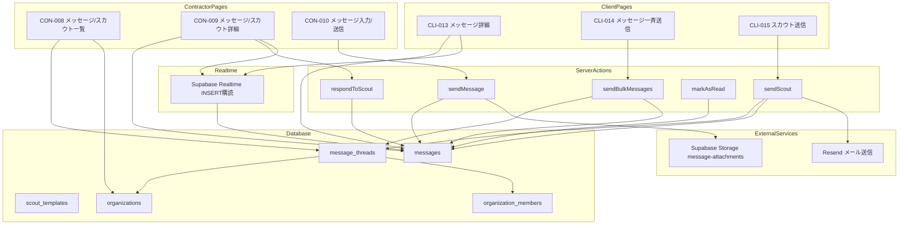
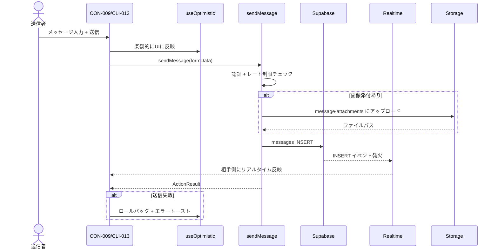
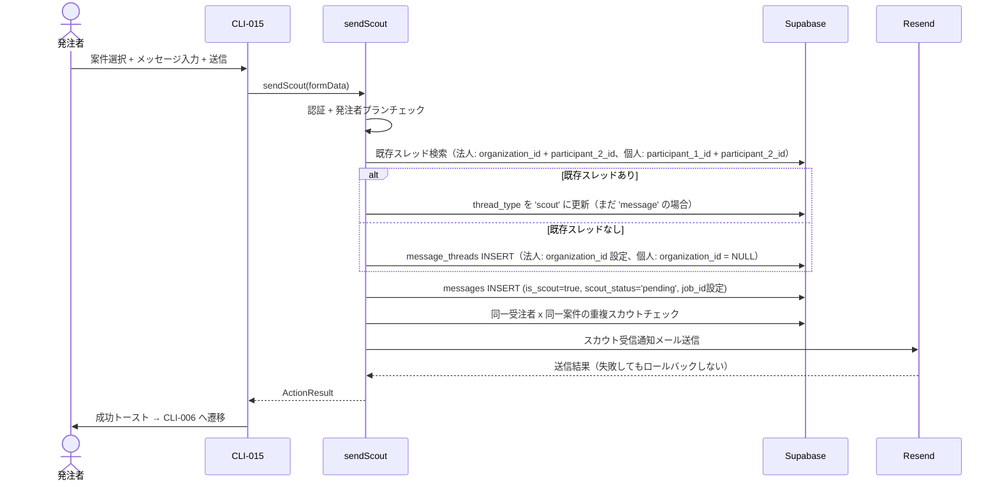
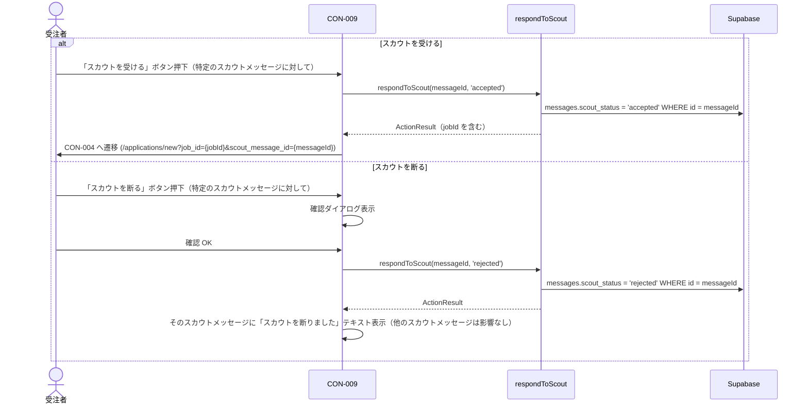
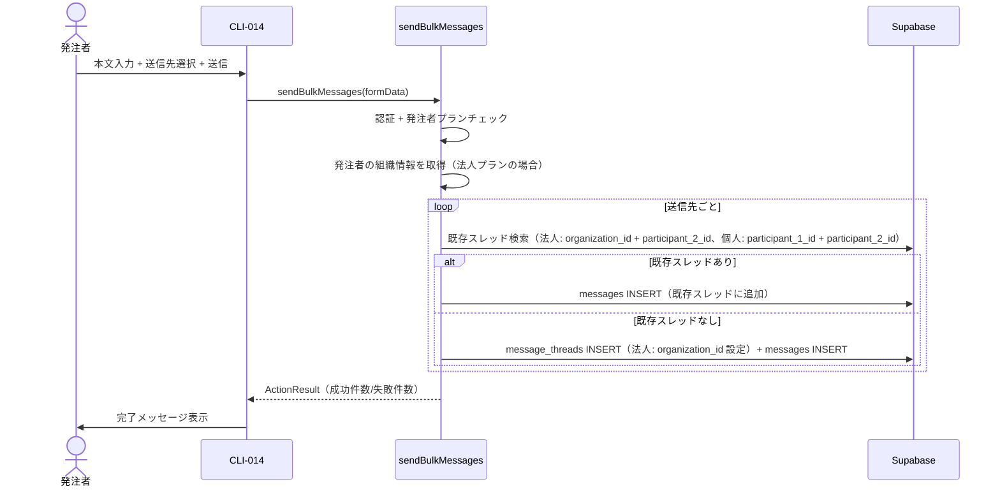
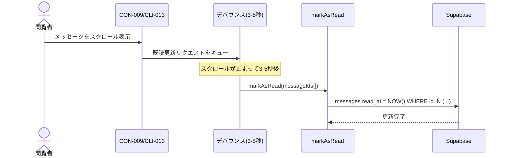
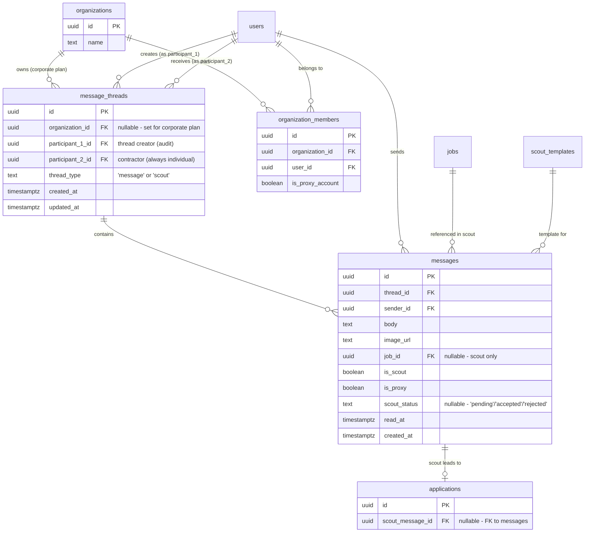

# メッセージ機能（messaging）— 技術設計

## Overview

**Purpose**: 受注者と発注者間の1対1メッセージ、スカウト送信（受諾/拒否フロー含む）、一斉送信を提供する機能。Supabase Realtime を使用したリアルタイム通信と楽観的UIにより、即時性のあるメッセージ体験を実現する。

**Users**: 受注者（Contractor）はメッセージの送受信とスカウトへの応答（受諾/拒否）を行う。発注者（Client）・担当者（Staff）はメッセージ送受信に加え、一斉送信・スカウト送信を行う。代理アカウント（`is_proxy_account = true` の担当者。実際にはビジ友の運営スタッフがログインして操作する）は発注者名義での代理送信も行う。

**Impact**: 新規テーブル（message_threads, messages）と Storage バケット（message-attachments）を使用し、新規画面 6 画面（CON-008〜010, CLI-013〜015）を実装する。Supabase Realtime による初のリアルタイム機能を導入する。

**スレッドモデル**: 組織ベーススレッドモデルを採用。法人プランでは organization_id を使って1組織 x 1受注者 = 1スレッドとし、組織メンバー全員がスレッドを共有する。個人プランでは organization_id = NULL で participant_1_id + participant_2_id の2者間スレッド。スカウトメッセージも通常メッセージと同じスレッド内に入り、scout_status はメッセージレベルで管理する。

### Goals
- 受注者・発注者間で1対1のリアルタイムメッセージを送受信できる
- スカウトメッセージの送信、受諾/拒否フローを提供する（1スレッド内に複数スカウトが共存可能）
- 発注者が複数の職人に一斉送信できる
- 法人プランの代理アカウント（ビジ友運営スタッフがログインする担当者アカウント）を通じて、発注者名義の代理メッセージ送信ができる
- 楽観的UIによる即時フィードバックで快適な送信体験を提供する
- 組織ベーススレッドにより、法人プランの全担当者がスレッドを共有閲覧・送信できる

### Non-Goals
- メッセージの削除・編集（建設業マッチングサービスにおける業務連絡の証跡保全のため、意図的に対象外）
- スカウトテンプレートの CRUD（CLI-016〜019）（organization spec で実装。CLI-015 からの「テンプレートから選択」は scout_templates テーブルの SELECT のみ）
- グループチャット（1対1のみ対応）
- 音声・動画メッセージ

## Architecture

### Existing Architecture Analysis

matching spec で確立されたパターンを踏襲する:
- Server Component + searchParams によるフィルター
- Server Action + `ActionResult<T>` による書き込み操作
- Zod スキーマによるバリデーション（クライアント + サーバー）
- message_threads, messages テーブルは既にマイグレーション済み（002_core_tables.sql）
- RLS ポリシーも定義済み（003_rls_policies.sql）。ただし messages の UPDATE ポリシー（スカウト応答用 scout_status 更新）の追加が必要
- 新規要素: Supabase Realtime（INSERT イベント購読）、楽観的UI（`useOptimistic`）、既読管理（デバウンス）
- 組織ベーススレッドモデル: organization_id による組織スレッド + is_same_org() によるアクセス制御

### Architecture Pattern & Boundary Map



**Architecture Integration**:
- Selected pattern: Next.js App Router Server Components + Client Components（Realtime + 楽観的UI）
- Domain boundaries: メッセージ系（/messages/）配下に統合。CON-009 と CLI-013 は同一 route で表示データの送受を逆転
- Existing patterns preserved: ActionResult<T>、Zod バリデーション、Supabase Server Client
- New patterns introduced: Supabase Realtime（`createBrowserClient` で Client Component から購読）、`useOptimistic` による楽観的UI
- Organization-based access: message_threads.organization_id + is_same_org() で組織メンバー全員のアクセスを制御
- Steering compliance: 三重防御（Middleware + Server Action + RLS）、メール送信失敗時の非ロールバック方針を遵守

### Technology Stack

| Layer | Choice / Version | Role in Feature | Notes |
|-------|------------------|-----------------|-------|
| Frontend | Next.js App Router + RSC + Client Components | 6 画面のページレンダリング + リアルタイム更新 | Realtime 部分は Client Component |
| UI | shadcn/ui + Tailwind CSS | メッセージバブル、入力フォーム、スレッドリスト | design-rule.md に準拠 |
| Backend | Next.js Server Actions | 書き込み操作（送信、既読、スカウト応答） | ActionResult<T> パターン |
| Validation | Zod | メッセージ入力バリデーション（クライアント + サーバー） | |
| Data | Supabase (PostgreSQL) + RLS | message_threads, messages | 組織ベーススレッドモデル |
| Realtime | Supabase Realtime | メッセージ受信のリアルタイム更新 | INSERT イベントのみ購読 |
| Storage | Supabase Storage | message-attachments バケット（private） | Signed URL で表示 |
| Email | Resend + React Email | スカウト受信通知、新着メッセージ通知 | 2 テンプレート新規作成 |

## System Flows

### メッセージ送信フロー（CON-010 / CLI-013）



### スカウト送信フロー（CLI-015）



### スカウト受諾/拒否フロー（CON-009）



**応答後のスレッド状態**: `messages.scout_status = 'accepted'` または `'rejected'` のスカウトメッセージでもスレッド自体はそのまま存続。メッセージの送受信は引き続き可能。ボタンの代わりにステータステキスト（「スカウトを受けました」/「スカウトを断りました」）が受注者・発注者の両方に表示される。1スレッド内に複数のスカウトメッセージが存在する場合、各スカウトメッセージごとに独立した scout_status を持つため、あるスカウトを拒否しても別の案件のスカウトには影響しない。

### 一斉送信フロー（CLI-014）



### 既読管理フロー



## Requirements Traceability

| Requirement | Summary | Components | Interfaces | Flows |
|-------------|---------|------------|------------|-------|
| 1 (REQ-MSG-001) | メッセージ/スカウト一覧（組織スレッド対応） | ThreadListPage | — | — |
| 2 (REQ-MSG-002) | メッセージ/スカウト詳細 + メッセージレベルスカウト応答 | ThreadDetailPage, respondToScoutAction | Service | スカウト受諾/拒否フロー |
| 3 (REQ-MSG-003) | メッセージ入力/送信 | MessageInput, sendMessageAction | Service | メッセージ送信フロー |
| 4 (REQ-MSG-004) | メッセージ詳細（発注者、組織スレッド検索） | ThreadDetailPage（送受逆転） | — | — |
| 5 (REQ-MSG-005) | メッセージ一斉送信（組織スレッド対応） | BulkSendPage, sendBulkMessagesAction | Service | 一斉送信フロー |
| 6 (REQ-MSG-006) | スカウト送信（既存スレッド再利用、メッセージレベル scout_status） | ScoutSendPage, sendScoutAction | Service | スカウト送信フロー |

## Components and Interfaces

| Component | Domain/Layer | Intent | Req Coverage | Key Dependencies | Contracts |
|-----------|-------------|--------|--------------|------------------|-----------|
| ThreadListPage | UI/共通 | スレッド一覧表示（組織スレッド対応） | 1 | Supabase (P0) | — |
| ThreadDetailPage | UI/共通 | メッセージ詳細 + メッセージレベルスカウト応答 | 2, 4 | Supabase (P0), Realtime (P0) | — |
| MessageInput | UI/共通 | メッセージ入力フォーム | 3 | sendMessageAction (P0) | — |
| BulkSendPage | UI/発注者 | 一斉送信画面 | 5 | sendBulkMessagesAction (P0) | — |
| ScoutSendPage | UI/発注者 | スカウト送信画面 | 6 | sendScoutAction (P0) | — |
| sendMessageAction | Action | メッセージ送信 | 3 | Supabase (P0), Storage (P1) | Service |
| sendScoutAction | Action | スカウト送信（既存スレッド再利用 + メッセージレベル scout_status） | 6 | Supabase (P0), Resend (P1) | Service |
| sendBulkMessagesAction | Action | 一斉送信（組織スレッド対応） | 5 | Supabase (P0) | Service |
| markAsReadAction | Action | 既読更新 | 2, 4 | Supabase (P0) | Service |
| respondToScoutAction | Action | メッセージレベルのスカウト受諾/拒否 | 2 | Supabase (P0) | Service |

### UI Layer

#### ThreadListPage (CON-008)

| Field | Detail |
|-------|--------|
| Intent | 自分が参加しているスレッド、および自分の組織のスレッドの一覧を表示する |
| Requirements | 1 |

**Responsibilities & Constraints**
- Server Component で RSC データフェッチ
- message_threads テーブルから以下の条件でレコードを取得:
  - `participant_1_id = current_user OR participant_2_id = current_user`（個人参加スレッド）
  - `OR (organization_id IS NOT NULL AND is_same_org(current_user, organization_id))`（組織スレッド）
- 法人プラン: 組織メンバー全員のスレッドが表示される（organization_id で紐づく全スレッド）
- 個人プラン: 自分が participant のスレッドのみ表示される（従来型）
- messages リレーション JOIN で最新メッセージ（body プレビュー、created_at）を取得
- users リレーション JOIN で相手の名前（`company_name`, `last_name`, `first_name`）・アイコンを取得
- **相手の名前解決**: requirements.md「名前表示ルール」に従う。受注者が見る発注者名: `organizations.name → users.company_name → users.last_name + first_name`。発注者が見る受注者名: `users.company_name → users.last_name + first_name`
- ソート: 最新メッセージ日時の降順（updated_at DESC）
- タブまたはフィルターで thread_type（'message' / 'scout'）を切り替え
- 未読バッジ: messages の read_at IS NULL かつ sender_id != current_user のカウント表示
- **一斉送信ボタン**: 発注者（client）・担当者（staff）のみ表示。受注者（contractor）の場合は非表示。ロールによる条件分岐で同一コンポーネントを共用
- **スカウトのテンプレートボタン**: 発注者（client）・担当者（staff）のみ表示

**Implementation Notes**
- ファイル: `src/app/(authenticated)/messages/page.tsx`
- デザインカンプ: design-assets/screens/CON-008.png
- 「戻る」ボタン: router.back() で前の画面に戻る
- レイアウト（デザインカンプ準拠）:
  - ページタイトル「メッセージ」（`heading-lg` 太字、中央寄せ）
  - タイトル下に2つのボタン横並び: 「一斉送信」（`bg-primary text-white rounded-full`）+ 「スカウトのテンプレート」（`variant="outline" rounded-full`）
  - 受注者の場合は2つのボタンとも非表示
  - スレッドリスト: 各行は左にアバター（丸型）、中央に相手名 + メッセージプレビュー、右に日時
  - スカウトスレッドには「スカウト」バッジ（`bg-muted text-muted-foreground rounded-full text-body-xs px-2`）を名前の右に表示
  - 各行の区切りはボーダー（`border-b border-border`）
  - 日時フォーマット: 当日は `HH:mm`、当年は `MM/DD`、それ以外は `YYYY/MM/DD`
- 各スレッドクリックで `/messages/[threadId]` に遷移

#### ThreadDetailPage (CON-009 / CLI-013)

| Field | Detail |
|-------|--------|
| Intent | 個別スレッドのメッセージ一覧を時系列で表示し、各スカウトメッセージごとに受諾/拒否を提供する |
| Requirements | 2, 4 |

**Responsibilities & Constraints**
- Server Component（初期データフェッチ）+ Client Component（Realtime + 楽観的UI）
- messages テーブルから thread_id でフィルタリングし、created_at ASC で表示
- **送受逆転ルール**（CSS spec CLI-013-sp.css 冒頭コメント準拠）:
  - CON-009（受注者側）: 左寄せ・白背景（#FFFFFF）= 発注者からの受信、右寄せ・ピンク背景（#F0E2EF）= 受注者の送信
  - CLI-013（発注者側）: 左寄せ・白背景 = 受注者からの受信、右寄せ・ピンク背景 = 発注者の送信
  - レイアウト・スタイルは同一。sender_id が自分かどうかで左右・色を切り替える
- **スカウトメッセージの表示**（is_scout = true のメッセージ）:
  - メッセージバブル内にスカウト案件情報カード（job_id に紐づく案件タイトル、募集職種・人数、報酬、エリア、募集期間）をインライン表示
  - **各スカウトメッセージごとに** `messages.scout_status` に応じた受諾/拒否ボタンを表示（1スレッド内に複数のスカウトメッセージが存在可能）
- 代理メッセージ: is_proxy = true のメッセージに「代理」バッジを表示（**発注者側の画面のみ**。受注者側には表示しない）
- **既読マーク**: 送信メッセージバブルの下に小さく「既読」テキスト表示（`text-body-xs text-muted-foreground`）。read_at IS NOT NULL の場合に表示
- **スカウト受諾/拒否ボタンとステータス表示**:
  - 各スカウトメッセージ（is_scout = true）に対して個別に表示:
    - `messages.scout_status = 'pending'`: 「スカウトを断る」「スカウトを受ける」ボタンを表示（CON-009 受注者側のみ）
    - `messages.scout_status = 'accepted'`: 「スカウトを受けました」テキストを表示（紫テキスト、受注者・発注者の両方）
    - `messages.scout_status = 'rejected'`: 「スカウトを断りました」テキストを表示（グレーテキスト、受注者・発注者の両方）
  - 同一スレッド内に複数のスカウトメッセージがある場合、各スカウトメッセージのボタン/ステータスは独立して動作する
- Supabase Realtime:
  - 購読チャネル: `messages:thread_id={スレッドID}`（INSERT イベントのみ）
  - `createBrowserClient` を使用して Client Component で購読
  - 画面アンマウント時に購読解除（`useEffect` の cleanup）
  - 接続断→自動再接続後、最後の受信タイムスタンプ以降の差分メッセージを取得
- 既読管理: デバウンス処理（3〜5秒）。スクロールが止まってからまとめて1回だけ markAsRead を呼び出す
- メッセージ入力エリア: 画面下部に固定（CON-010 と統合）
- **法人プラン**: 同一組織の担当者全員がスレッドを閲覧・メッセージ送信可能（RLS の organization_id + is_same_org() で制御）

**Implementation Notes**
- ファイル: `src/app/(authenticated)/messages/[threadId]/page.tsx`
- デザインカンプ: CON-009.png（ワイヤーフレーム）、CON-009-design-sp.png（SP）、CON-009-design-pc.png（PC）
- CSS spec: CON-009-sp.css、CON-009-pc.css、CLI-013-sp.css、CLI-013-pc.css
- ヘッダー: 戻るボタン（左）、相手の名前（中央左寄せ、requirements.md「名前表示ルール」に従う）、ロゴ + メニュー（右）
- メッセージバブル:
  - 受信（左寄せ）: アバター（丸型、左上）+ 白背景バブル（`bg-white rounded-[8px] p-3`）+ タイムスタンプ下部
  - 送信（右寄せ）: ピンク背景バブル（`bg-[#F0E2EF] rounded-[8px] p-3`）+ タイムスタンプ下部 + 既読マーク
  - スカウトメッセージ: 「スカウト」バッジをバブル内上部に表示
- 案件情報カード（is_scout = true のメッセージ内にインライン表示）:
  - ボーダー付きカード（`border border-border rounded-[8px] p-4`）
  - タイトル（太字）+ 右矢印（ChevronRight）→ `/jobs/[id]` へのリンク、募集職種・人数 + 締め切り
  - 報酬（`/images/icons/icon-coin.png`）、エリア（`/images/icons/icon-pin.png`）、募集期間（`/images/icons/icon-calendar.png`）各プロジェクト専用アイコン付き
- スカウトボタン配置: 案件情報カード内に配置。SP: 横並び（`flex-row`、均等幅）、PC: 案件情報の右側に縦並び（`flex-row md:flex-col` + 親要素 `md:flex-row md:items-end md:justify-between`）。各スカウトメッセージごとに独立して表示・非表示が切り替わる
- CLI-013 でのスカウトボタン非表示: props `showScoutActions={false}` で制御（ただしステータステキストは表示される）
- 入力エリア（CON-010 統合）: 画面最下部に固定、左にカメラアイコン（画像添付）、中央にテキスト入力、右に送信ボタン（紫矢印アイコン）
- タイムスタンプフォーマット: `MM/DD HH:mm`（CSS spec 準拠）

#### MessageInput (CON-010)

| Field | Detail |
|-------|--------|
| Intent | メッセージの入力・送信・画像添付を提供する |
| Requirements | 3 |

**Responsibilities & Constraints**
- Client Component（`"use client"`）
- 入力フィールド: メッセージ本文（必須）、画像添付（任意、JPEG/PNG、最大10MB）
- 楽観的UI: `useOptimistic` で即時 UI 反映 → Server Action 実行 → 失敗時ロールバック + エラートースト
- **代理アカウントからの送信**（法人プラン、is_proxy_account = true の担当者。ビジ友の運営スタッフがこのアカウントにログインして操作する）:
  - 通常の担当者と同じフローで送信。sender_id = ログイン中のアカウント（代理アカウント自身）
  - Server Action がsender の is_proxy_account を参照し、true なら is_proxy = true を自動設定
  - 「代理」バッジは発注者側の画面でのみ表示（受注者側には非表示）
- **無料ユーザー送信制限**:
  - 新規メッセージ（新規スレッド作成）: 月5通（カレンダー月、JST基準）
  - 返信（既存スレッド）: 制限なし
  - 超過時: 「今月の新規メッセージ上限に達しました。有料プランにアップグレードすると無制限で送信できます」
- **レート制限**: 同一ユーザーから1分間に3通まで。Server Action 内で `(sender_id, created_at)` インデックスを使ってカウント

**Implementation Notes**
- ファイル: `src/components/messaging/message-input.tsx`
- デザインカンプ: CON-009.png 下部の入力エリア
- レイアウト: 画面下部固定（`sticky bottom-0`）
  - 左: カメラアイコン（画像添付トリガー、`assets/icons/` に該当なしのため lucide-react Camera、`className="w-4 h-4 text-primary/70"`）
  - 中央: テキスト入力（`bg-background rounded-full border border-border px-4 py-2`）、プレースホルダー「メッセージ」
  - 右: 送信ボタン（紫丸 `bg-primary rounded-full p-2` + 白矢印アイコン）
- 画像添付: `<input type="file" accept="image/jpeg,image/png">` を hidden で配置、カメラアイコンクリックでトリガー
- 画像プレビュー: 添付後に入力エリア上部にサムネイル表示 + 削除ボタン

#### BulkSendPage (CLI-014)

| Field | Detail |
|-------|--------|
| Intent | 複数の職人に同一メッセージを一括送信する |
| Requirements | 5 |

**Responsibilities & Constraints**
- Client Component（フォーム操作のため `"use client"`）
- 送信先: これまでメッセージをやりとりしたユーザー（既存スレッドの相手）一覧をチェックボックスで複数選択
- 入力フィールド: メッセージ本文（必須）
- 送信先ごとにスレッドを検索（法人: organization_id + participant_2_id、個人: participant_1_id + participant_2_id）し、既存スレッドに追加 or 新規作成してメッセージを保存
- 一斉送信の進捗表示
- 発注者（client）・担当者（staff）のみアクセス可能

**Implementation Notes**
- ファイル: `src/app/(authenticated)/messages/bulk-send/page.tsx`
- デザインカンプ: design-assets/screens/CLI-014.png
- 「戻る」ボタン: router.back() で前の画面に戻る
- レイアウト（デザインカンプ準拠）:
  - ページタイトル「一斉送信」（`heading-lg` 太字、中央寄せ）
  - 「本文」ラベル + Textarea（`bg-background`、複数行）
  - 「送信先選択」ラベル（左寄せ）+ 「全選択」/「全解除」トグルボタン（右寄せ、`text-sm text-primary hover:underline`）+ チェックボックスリスト（各行: チェックボックス + ユーザー氏名）。全員選択済みなら「全解除」、それ以外なら「全選択」と表示
  - 「送信する」ボタン（`bg-primary text-white rounded-full w-full max-w-xs mx-auto`）
  - 「もどる」ボタン（`variant="outline" rounded-full w-full max-w-xs mx-auto`）
  - ボタンの親要素: `flex flex-col items-center gap-3`
- Middleware: 発注者（client）・担当者（staff）のみアクセス可能

#### ScoutSendPage (CLI-015)

| Field | Detail |
|-------|--------|
| Intent | 職人にスカウトメッセージを送信する |
| Requirements | 6 |

**Responsibilities & Constraints**
- Server Component（`page.tsx`）でデータ取得 + Client Component（`scout-send-form.tsx`）でフォーム操作
- ユーザー詳細（CLI-006）から遷移。searchParams `userId` で対象職人を指定
- ユーザープロフィールセクション: アバター、氏名（年齢）、対応職種、経験年数、本人確認/CCUS バッジ
- 入力フィールド:
  - 募集する案件を選択（自社の掲載中案件、Select プルダウン）
  - スカウトテンプレートを選択（scout_templates から読み込み、Select プルダウン、選択時に本文をプリフィル）
  - タイトル（テキスト入力）
  - 本文（必須、Textarea）
- **スレッドの作成/再利用**:
  - 対象受注者との既存スレッドを検索（法人: organization_id + participant_2_id、個人: participant_1_id + participant_2_id）
  - 既存スレッドがある場合: そのスレッドにスカウトメッセージを追加、thread_type を 'scout' に更新（まだ 'message' の場合）
  - 既存スレッドがない場合: 新規スレッド作成（法人プランでは organization_id を設定）
- messages テーブルに is_scout = true、scout_status = 'pending'、job_id 設定で保存
- 同一受注者 x 同一案件で既にスカウトメッセージ（messages の is_scout = true かつ同一 job_id）がある場合はエラー（重複防止）
- 受注者へメール通知（スカウト受信通知）
- 発注者（client）・担当者（staff）のみアクセス可能

**Implementation Notes**
- ファイル構成:
  - `src/app/(authenticated)/messages/scout-send/page.tsx` — Server Component（データ取得）
  - `src/app/(authenticated)/messages/scout-send/scout-send-form.tsx` — Client Component（フォーム操作）
- page.tsx でサーバー側でユーザープロフィール・案件一覧・テンプレート一覧を取得し、scout-send-form.tsx に props で渡す
- 案件一覧の取得: 組織メンバーの場合は `organization_id` で組織全体の掲載中案件を表示、個人の場合は `owner_id` で自分の案件のみ表示（CLI-001 の案件管理と同じロジック）
- デザインカンプ: design-assets/screens/CLI-015.png
- 「戻る」ボタン: router.back() で前の画面に戻る
- レイアウト（デザインカンプ準拠）:
  - ページタイトル「スカウト送信」（`heading-lg` 太字、中央寄せ）
  - ユーザープロフィール: アバター（丸型、左）+ 氏名（年齢）+ 職種ピル型バッジ（紫） + 経験年数 + 本人確認・CCUSバッジ（icon-tag）
  - 「募集する案件を選択」ラベル + Select（`bg-background`）
  - 「スカウトテンプレートを選択」ラベル + Select（`bg-background`）
  - 「タイトル」ラベル + Input（`bg-background`）
  - 「本文」ラベル + Textarea（`bg-background`）
  - 「送信する」ボタン（`bg-primary text-white rounded-full w-full`）
  - 「もどる」ボタン（共通 BackButton コンポーネント使用）
  - ボタンの親要素: `flex flex-col items-center gap-3`
- Middleware: 発注者（client）・担当者（staff）のみアクセス可能

### Action Layer

#### sendMessageAction

| Field | Detail |
|-------|--------|
| Intent | メッセージを送信する（テキスト + 画像添付） |
| Requirements | 3 |

**Dependencies**
- Inbound: MessageInput — 送信ボタン押下 (P0)
- External: Supabase — messages テーブル INSERT (P0)
- External: Supabase Storage — message-attachments バケット (P1)

**Contracts**: Service [x]

##### Service Interface
```typescript
// src/app/(authenticated)/messages/[threadId]/actions.ts

async function sendMessageAction(
  formData: FormData
): Promise<ActionResult>
// FormData: threadId (string), body (string), image? (File)
```
- Preconditions: ユーザーが認証済み、スレッドの参加者または同一組織メンバーである、レート制限内（1分3通）。新規スレッド作成の場合は月5通制限内（無料ユーザーのみ）
- Postconditions: messages テーブルに 1 レコード INSERT。画像添付時は message-attachments バケットにアップロード
- Invariants: sender_id は認証ユーザー（代理アカウントの場合も代理アカウント自身のID）

**Implementation Notes**
- 認証チェック → スレッド参加者チェック（participant_1_id, participant_2_id, または organization_id + is_same_org()）→ レート制限チェック（直近1分間の送信数カウント）→ is_proxy_account チェック（organization_members を参照し is_proxy フラグを自動設定）→ 画像アップロード（あれば）→ messages INSERT
- 画像アップロード: `message-attachments` バケットに `{user_id}/{uuid}.{ext}` で保存。`image_url` にファイルパスを保存（表示時は `createSignedUrl()` で Signed URL 生成）

#### sendScoutAction

| Field | Detail |
|-------|--------|
| Intent | スカウトメッセージを送信し、メール通知する。既存スレッドがあればそこに追加、なければ新規作成 |
| Requirements | 6 |

**Dependencies**
- Inbound: ScoutSendPage — 送信ボタン押下 (P0)
- External: Supabase — message_threads UPSERT + messages INSERT (P0)
- External: Resend — メール通知 (P1)

**Contracts**: Service [x]

##### Service Interface
```typescript
// src/app/(authenticated)/messages/scout-send/actions.ts

async function sendScoutAction(
  formData: FormData
): Promise<ActionResult>
// FormData: targetUserId (string), jobId (string), title (string), body (string)
```
- Preconditions: ユーザーが認証済み、発注者プラン（client or staff）。同一受注者 x 同一案件で既存スカウトメッセージがないこと
- Postconditions:
  - 既存スレッドがある場合: thread_type を 'scout' に更新（まだ 'message' の場合）、messages に 1 レコード INSERT（is_scout=true, scout_status='pending', job_id設定）
  - 既存スレッドがない場合: message_threads に 1 レコード INSERT（法人: organization_id 設定、thread_type='scout'）、messages に 1 レコード INSERT
  - 受注者にメール通知
- Invariants: 同一受注者 x 同一案件で重複スカウトメッセージ不可（messages テーブルで is_scout = true かつ同一 job_id + 同一スレッド内で重複チェック）

**Implementation Notes**
- 認証チェック → 発注者プランチェック → 重複スカウトチェック（messages テーブルで thread の participant_2_id = targetUserId かつ is_scout = true かつ job_id = jobId のレコードを検索）→ 既存スレッド検索（法人: organization_id + participant_2_id、個人: participant_1_id + participant_2_id）→ スレッド作成/更新 → メッセージ INSERT → メール送信
- 法人プランの場合: 発注者の organization_id を取得し、message_threads.organization_id に設定
- 個人プランの場合: organization_id = NULL、participant_1_id = current_user
- メール送信失敗は catch してログ記録。本体処理はロールバックしない
- メールテンプレート: `src/lib/email/templates/scout-notification.ts`
- **メール送信時の名前解決**: `senderName` は requirements.md「名前表示ルール」に従う（法人: `organizations.name`、個人: `users.company_name → users.last_name + first_name`）。`recipientName` は `users.last_name + first_name`。現在の実装はインライン HTML で送信者名なし → テンプレート使用 + 名前解決に修正が必要

#### sendBulkMessagesAction

| Field | Detail |
|-------|--------|
| Intent | 複数の職人に同一メッセージを一括送信する（組織スレッド対応） |
| Requirements | 5 |

**Dependencies**
- Inbound: BulkSendPage — 送信ボタン押下 (P0)
- External: Supabase — message_threads + messages INSERT (P0)

**Contracts**: Service [x]

##### Service Interface
```typescript
// src/app/(authenticated)/messages/bulk-send/actions.ts

async function sendBulkMessagesAction(
  formData: FormData
): Promise<ActionResult<{ sent: number; failed: number }>>
// FormData: body (string), recipientIds (string[] JSON)
```
- Preconditions: ユーザーが認証済み、発注者プラン（client or staff）
- Postconditions: 各送信先に対して既存スレッドにメッセージ追加 or 新規スレッド + メッセージ作成
- Invariants: 一部の送信が失敗しても他の送信は継続（部分成功を許容）

**Implementation Notes**
- 認証チェック → 発注者プランチェック → 発注者の組織情報取得（法人プランの場合）→ 送信先ループ:
  - 既存スレッド検索: 法人の場合は `organization_id + participant_2_id` で、個人の場合は `participant_1_id + participant_2_id` で検索
  - 既存スレッドあり: そのスレッドに messages INSERT
  - 既存スレッドなし: message_threads INSERT（法人: organization_id 設定）+ messages INSERT
- 各送信先の処理を try-catch で囲み、失敗件数をカウント
- 結果: `{ sent: 成功件数, failed: 失敗件数 }` を返す

#### markAsReadAction

| Field | Detail |
|-------|--------|
| Intent | メッセージの既読状態を更新する |
| Requirements | 2, 4 |

**Dependencies**
- Inbound: ThreadDetailPage — デバウンス処理後 (P0)
- External: Supabase — messages テーブル UPDATE (P0)

**Contracts**: Service [x]

##### Service Interface
```typescript
// src/app/(authenticated)/messages/[threadId]/actions.ts

async function markAsReadAction(
  messageIds: string[]
): Promise<ActionResult>
```
- Preconditions: ユーザーが認証済み、対象メッセージが自分宛（sender_id != current_user）、スレッドの参加者または同一組織メンバーである
- Postconditions: messages.read_at = NOW() WHERE id IN (messageIds) AND read_at IS NULL
- Invariants: 既に既読のメッセージは更新しない

**Implementation Notes**
- read_at の更新は RLS の UPDATE ポリシーが「不可」のため、admin client（service_role）を使用
- Server Action 内で認証 + スレッド参加者チェック（participant_1_id, participant_2_id, または organization_id + is_same_org()）を実施してから admin client で更新

#### respondToScoutAction

| Field | Detail |
|-------|--------|
| Intent | 特定のスカウトメッセージに対する受諾または拒否を実行する |
| Requirements | 2 |

**Dependencies**
- Inbound: ThreadDetailPage — スカウトボタン押下 (P0)
- External: Supabase — messages UPDATE (P0)

**Contracts**: Service [x]

##### Service Interface
```typescript
// src/app/(authenticated)/messages/[threadId]/actions.ts

async function respondToScoutAction(
  messageId: string,
  response: 'accepted' | 'rejected'
): Promise<ActionResult<{ jobId?: string }>>
```
- Preconditions: ユーザーが認証済み、対象メッセージの所属スレッドで participant_2_id = current_user（スカウト受信者）、messages.is_scout = true、messages.scout_status = 'pending'
- Postconditions: messages.scout_status = 'accepted' or 'rejected'。受諾時は関連する job_id を返す。`revalidatePath` でスレッドページのキャッシュを無効化
- Invariants: 応答済み（accepted/rejected）のスカウトメッセージは再変更不可（RLS の WITH CHECK で保証）

**Implementation Notes**
- RLS ポリシーで保護: messages の UPDATE ポリシー `is_scout = true AND scout_status = 'pending' AND sender_id <> auth.uid()`、さらにスレッドの participant_2_id = auth.uid() を検証。WITH CHECK: `scout_status IN ('accepted', 'rejected')`
- 受諾時: ActionResult の data に jobId を含めて返す。フロントエンドで `/applications/new?job_id={jobId}&scout_message_id={messageId}` に遷移
- 拒否時: 確認ダイアログはフロントエンド側で表示。Server Action は確認後に呼ばれる
- 1スレッド内に複数のスカウトメッセージがある場合、指定された messageId のメッセージのみを更新する

## Data Models

### Domain Model



- message_threads : messages = 1:N（1スレッドに複数メッセージ）
- message_threads.organization_id: 法人プランの場合に設定。is_same_org() で組織メンバー全員にアクセスを許可
- messages.scout_status はメッセージレベルで管理（is_scout = true のメッセージのみ使用）。1スレッド内に複数のスカウトメッセージが共存可能で、それぞれ独立した scout_status を持つ
- applications.scout_message_id はスカウト経由の応募の場合のみ設定。1スレッド内に複数スカウトが存在しうるため、スレッドIDではなくメッセージIDで特定する（messaging → matching の連携ポイント）
- message_threads の UNIQUE 制約: `UNIQUE (organization_id, participant_2_id) WHERE organization_id IS NOT NULL`（1組織 x 1受注者で常に1スレッド）。個人スレッドの一意性は Server Action 内で検証

### Physical Data Model

テーブル定義は database-schema.md を参照。message_threads, messages は既にマイグレーション済み（002_core_tables.sql）。

**追加マイグレーション 1**: messages に scout_status カラム追加 + UPDATE RLS ポリシー

```sql
-- scout_status カラム追加（メッセージレベルでスカウト応答ステータスを管理）
ALTER TABLE messages
  ADD COLUMN scout_status text;

-- CHECK 制約: is_scout = true のメッセージのみ scout_status を持つ
ALTER TABLE messages
  ADD CONSTRAINT messages_scout_status_check
  CHECK (
    (is_scout = false AND scout_status IS NULL)
    OR (is_scout = true AND scout_status IN ('pending', 'accepted', 'rejected'))
  );

-- スカウト受信者がスカウトメッセージに応答できる UPDATE ポリシー
CREATE POLICY "scout_recipient_can_respond"
  ON messages FOR UPDATE
  USING (
    is_scout = true
    AND scout_status = 'pending'
    AND sender_id <> auth.uid()
    AND EXISTS (
      SELECT 1 FROM message_threads
      WHERE id = messages.thread_id
      AND participant_2_id = auth.uid()
    )
  )
  WITH CHECK (
    scout_status IN ('accepted', 'rejected')
  );
```

**追加マイグレーション 2**: applications に scout_message_id カラム追加

```sql
-- scout_message_id カラム追加（スレッドIDではなくメッセージIDで特定）
ALTER TABLE applications
  ADD COLUMN scout_message_id uuid REFERENCES messages(id);

-- 部分インデックス（scout_message_id IS NOT NULL の応募のみ）
CREATE INDEX idx_applications_scout_message_id
  ON applications (scout_message_id)
  WHERE scout_message_id IS NOT NULL;
```

注意: このマイグレーションは applications テーブルへの変更のため、matching spec との調整が必要。messaging spec の実装時に同時に実行する。

**追加マイグレーション 3**: message_threads に organization_id カラム追加 + 部分ユニーク制約

```sql
-- organization_id カラム追加（法人プランの組織スレッド対応）
ALTER TABLE message_threads
  ADD COLUMN organization_id uuid REFERENCES organizations(id);

-- 部分ユニーク制約: 1組織 x 1受注者で常に1スレッド
CREATE UNIQUE INDEX idx_message_threads_org_participant2
  ON message_threads (organization_id, participant_2_id)
  WHERE organization_id IS NOT NULL;

-- thread_type の UPDATE ポリシー（スカウトメッセージ追加時に 'message' → 'scout' に変更）
CREATE POLICY "thread_participant_can_update_type"
  ON message_threads FOR UPDATE
  USING (
    participant_1_id = auth.uid()
    OR participant_2_id = auth.uid()
    OR (organization_id IS NOT NULL AND is_same_org(auth.uid(), organization_id))
  )
  WITH CHECK (
    thread_type IN ('message', 'scout')
  );
```

**追加マイグレーション 4**: message-attachments Storage バケット作成

```sql
-- message-attachments バケット作成（private）
INSERT INTO storage.buckets (id, name, public)
VALUES ('message-attachments', 'message-attachments', false);

-- INSERT ポリシー: 認証ユーザーが自分のフォルダにアップロード
CREATE POLICY "users_can_upload_message_attachments"
  ON storage.objects FOR INSERT
  WITH CHECK (
    bucket_id = 'message-attachments'
    AND auth.role() = 'authenticated'
    AND (storage.foldername(name))[1] = auth.uid()::text
  );

-- SELECT ポリシー: スレッド参加者または同一組織メンバーのみ閲覧可能
CREATE POLICY "thread_participants_can_view_message_attachments"
  ON storage.objects FOR SELECT
  USING (
    bucket_id = 'message-attachments'
    AND auth.role() = 'authenticated'
    AND EXISTS (
      SELECT 1 FROM message_threads
      WHERE (
        participant_1_id = auth.uid()
        OR participant_2_id = auth.uid()
        OR (organization_id IS NOT NULL AND is_same_org(auth.uid(), organization_id))
      )
    )
  );
```

**read_at 更新用ポリシー**: messages テーブルの UPDATE は「不可」だが、read_at の更新が必要。admin client（service_role）を使用して markAsReadAction 内で更新するため、追加の UPDATE RLS ポリシーは不要。

## Error Handling

### Error Strategy

| Error | Category | Response | Recovery |
|-------|----------|----------|----------|
| 未認証 | User 401 | ログイン画面にリダイレクト | Middleware で処理 |
| 権限不足（発注者限定操作） | User 403 | 「この操作を実行する権限がありません」 | 一覧画面に戻す |
| スレッド非参加者（組織外） | User 403 | 「このスレッドにアクセスする権限がありません」 | メッセージ一覧に戻す |
| レート制限超過 | Business 429 | 「送信頻度が高すぎます。しばらく待ってから再送信してください」 | 入力内容を保持、再送信を促す |
| 月間送信制限超過（無料） | Business 429 | 「今月の新規メッセージ上限に達しました。有料プランにアップグレードすると無制限で送信できます」 | アップグレード導線を表示 |
| スカウト応答済み | Business 409 | 「このスカウトには既に応答済みです」 | そのスカウトメッセージにステータステキストを表示 |
| 重複スカウト | Business 409 | 「この職人には既にこの案件でスカウトを送信済みです」 | 入力画面に留まる |
| 画像サイズ超過 | Validation 422 | 「画像は10MB以下にしてください」 | ファイル選択をリセット |
| 楽観的UI失敗 | System 500 | ロールバック + エラートースト「メッセージの送信に失敗しました」 | 入力内容を保持、再送信を促す |
| メール送信失敗 | System 500 | ログ記録のみ。ユーザーには成功を返す | Resend 自動リトライに委任 |
| Realtime 接続断 | System | 自動再接続 + 差分メッセージ取得 | 最後の受信タイムスタンプ以降を再取得 |
| DB エラー | System 500 | 「処理中にエラーが発生しました」 | ログ記録。ユーザーにリトライを促す |

## Testing Strategy

### Unit Tests
- Zod バリデーションスキーマ（messageSchema, scoutSchema, bulkMessageSchema）
- レート制限判定ロジック（isRateLimited 関数）
- 月間送信制限判定ロジック（isMonthlyLimitExceeded 関数）
- タイムスタンプフォーマット（formatMessageTime 関数）

### Integration Tests（高リスク: 書き込み + 権限）
- sendMessageAction: スレッド参加者（個人 + 組織メンバー）のみ送信可、レート制限チェック、画像添付、is_proxy 自動設定
- sendScoutAction: 発注者のみ、既存スレッド再利用 + 新規作成、メッセージレベル scout_status='pending' 設定、重複チェック（同一 job_id + 同一受注者）、thread_type 更新
- sendBulkMessagesAction: 発注者のみ、組織スレッド検索（organization_id + participant_2_id）、個人スレッド検索、複数送信先の処理、部分成功
- markAsReadAction: スレッド参加者（個人 + 組織メンバー）のみ、自分宛メッセージのみ既読更新
- respondToScoutAction: スレッドの participant_2_id のみ応答可、messages.scout_status の pending → accepted/rejected 状態遷移、応答済みメッセージの再変更不可、同一スレッド内の他のスカウトメッセージに影響しないこと

### RLS Tests（pgTAP）
- ユーザーが自分が参加しているスレッド（participant_1_id or participant_2_id）のみ閲覧可能
- 組織メンバーが organization_id で紐づくスレッドを閲覧可能（is_same_org）
- 組織外のユーザーが organization_id 付きスレッドを閲覧不可
- ユーザーが自分がアクセス可能なスレッドのメッセージのみ閲覧可能（個人 + 組織）
- ユーザーが自分がアクセス可能なスレッドにのみメッセージ送信可能
- スカウト受信者（participant_2_id）のみ messages.scout_status を更新可能（pending → accepted/rejected のみ）
- スカウト送信者は messages.scout_status を更新不可
- メッセージの UPDATE は scout_status 以外不可（read_at 更新は admin client 経由）
- thread_type の UPDATE はスレッド参加者（個人 + 組織メンバー）のみ可能
- Storage: ユーザーが自分のフォルダにのみアップロード可能
- Storage: スレッド参加者または同一組織メンバーのみ添付画像を閲覧可能

### E2E Tests（Playwright）
- 受注者: メッセージ一覧 → 詳細 → メッセージ送信 → 送信確認
- 受注者: スカウト詳細 → 特定のスカウトメッセージに対して「スカウトを受ける」→ CON-004 への遷移確認（scout_message_id パラメータ付き）
- 受注者: スカウト詳細 → 特定のスカウトメッセージに対して「スカウトを断る」→ そのメッセージに「スカウトを断りました」テキスト表示確認（他のスカウトメッセージのボタンは残る）
- 発注者: スカウト送信後、受注者が応答 → CLI-013 で「スカウトを受けました」/「スカウトを断りました」テキストが表示されることを確認
- 発注者: メッセージ一覧 → 一斉送信 → 送信完了確認
- 発注者: CLI-006 → スカウト送信 → 送信完了確認（既存スレッドへの追加ケース含む）
- 発注者: CLI-013 でスカウトボタンが表示されないことを確認
- 法人プラン: 担当者が組織の既存スレッドを閲覧できることを確認

## Security Considerations

- **Middleware**: CON-008/009/010 は全認証済みユーザーがアクセス可能（CON 系画面のため、contractor に限定しない）。CLI-013 はユーザー詳細からの遷移で全認証済みユーザーがアクセス可能。CLI-014（一斉送信）・CLI-015（スカウト送信）は発注者（client）・担当者（staff）のみ。**実装時に src/middleware.ts の CLIENT_ONLY_PREFIXES に "/messages/bulk-send", "/messages/scout-send" を追加すること。**
- **Server Action**: 全アクションで認証チェック + スレッド参加者チェック（participant_1_id, participant_2_id, または organization_id + is_same_org()）を実施。代理アカウント（is_proxy_account = true）からの送信時は is_proxy フラグを自動設定（特別な権限チェックは不要）
- **RLS**:
  - message_threads の SELECT: `participant_1_id = auth.uid() OR participant_2_id = auth.uid() OR (organization_id IS NOT NULL AND is_same_org(auth.uid(), organization_id))`
  - message_threads の INSERT: 認証済みユーザー（Server Action で制限チェック）
  - message_threads の UPDATE: thread_type の更新のみ。スレッド参加者（個人 + 組織メンバー）が可能
  - messages の SELECT: スレッドのアクセス権に基づく（EXISTS サブクエリで message_threads を参照、organization_id + is_same_org() 含む）
  - messages の INSERT: アクセス可能なスレッドにのみ送信可
  - messages の UPDATE（read_at, scout_status）: **RLS ポリシーなし**。PERMISSIVE ポリシーの OR 結合による意図しない権限昇格を防ぐため、全て admin client（service_role）で実行。Server Action 内で権限チェックを実施
- **admin client 使用箇所**: markAsRead（read_at 更新）、respondToScout（scout_status 更新）、`/messages/new` でのスレッド作成（受注者が相手の organization_id 付きスレッドを作成する場合、organization_members の RLS を通過できないため）。通常のメッセージ送受信は通常クライアントを使用
- **organizations SELECT ポリシー追加**: `organizations_select_thread_participant` — メッセージスレッドの受注者側参加者が組織名を表示するために必要。`EXISTS (SELECT 1 FROM message_threads WHERE organization_id = organizations.id AND participant_2_id = auth.uid())`
- **Storage**: message-attachments バケットは private。アップロードは自分のフォルダのみ、閲覧はスレッド参加者または同一組織メンバーのみ（RLS）。表示時は `createSignedUrl()` で Signed URL を生成
- **XSS 防止**: メッセージ本文内の URL をサニタイズ。外部 URL 表示時は警告を表示
- **メール通知**: Resend 経由。送信失敗時はログ記録のみでロールバックしない（security.md 準拠）
- **監査ログ**: 代理アカウントからの送信時は is_proxy = true で記録される（sender_id が代理アカウントのIDなので、誰が送ったかはそのまま追跡可能）

## File Structure

```
src/app/(authenticated)/messages/
├── page.tsx                              # CON-008 メッセージ/スカウト一覧（組織スレッド対応）
├── new/
│   └── page.tsx                          # CLI-013 入り口（/messages/new?to={userId}）。相手の組織を検索し、スレッドを検索 or 作成して /messages/[threadId] にリダイレクト。admin client 使用
├── [threadId]/
│   ├── page.tsx                          # CON-009 / CLI-013 メッセージ詳細（メッセージレベルスカウト応答）
│   └── actions.ts                        # Server Actions（sendMessage, markAsRead, respondToScout）
├── bulk-send/
│   ├── page.tsx                          # CLI-014 一斉送信（組織スレッド対応）
│   └── actions.ts                        # Server Actions（sendBulkMessages）
└── scout-send/                          # CLI-015 スカウト送信
    ├── page.tsx                          # CLI-015 Server Component（データ取得）
    ├── scout-send-form.tsx               # CLI-015 Client Component（フォーム操作）
    └── actions.ts                        # Server Actions（sendScout）

src/components/messaging/
├── message-thread-view.tsx               # メッセージリスト + 入力の統合 Client Component（Realtime + 楽観的UI + onSendComplete）
├── message-list.tsx                      # 型定義（Message, ScoutJobInfo）のエクスポート用
├── message-input.tsx                     # CON-010 メッセージ入力フォーム（Enter=改行、テキストエリア自動拡張）
├── message-bubble.tsx                    # 吹き出し型メッセージバブル（送信/受信、既読マーク、スカウトカードインライン表示）
├── message-header.tsx                    # メッセージ詳細ヘッダー（戻る矢印 + 相手名）
├── thread-list-item.tsx                  # スレッド一覧の各行
├── scout-info-card.tsx                   # スカウト案件情報カード + 受諾/拒否ボタン内包
└── scout-action-buttons.tsx              # スカウト受諾/拒否ボタン（messageId ベース）

src/lib/validations/
└── message.ts                            # Zod スキーマ（scoutSchema, bulkMessageSchema）。messageSchema は Server Action 内でインラインバリデーション

src/lib/utils/
└── format-message-time.ts                # メッセージ用タイムスタンプフォーマット

src/lib/email/templates/
├── scout-notification.ts                 # スカウト受信通知
└── message-notification.ts               # 新着メッセージ通知

supabase/migrations/
├── 20260406100000_messaging_scout_status.sql         # organization_id + scout_status(messages) + RLS + Realtime + organizations ポリシー
└── 20260406100001_message_attachments_bucket.sql     # Storage バケット + RLS（組織メンバー対応）
```
