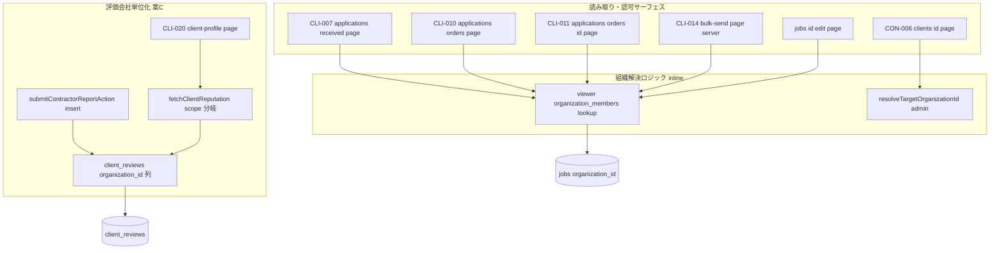
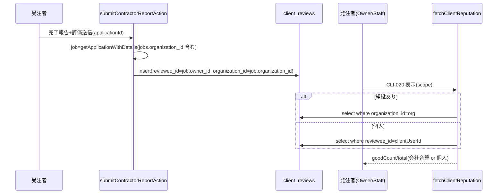
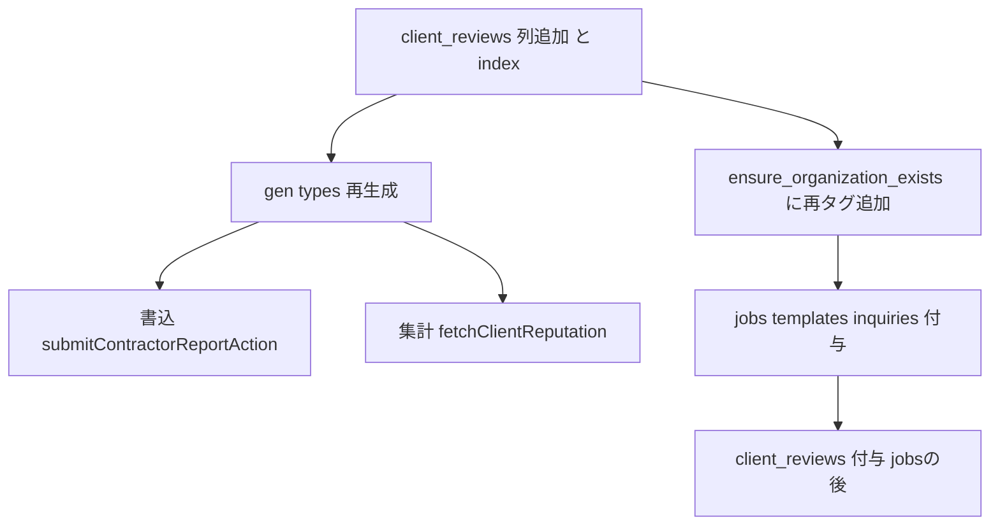

# Technical Design — organization-scoping-consistency

## Overview

**Purpose**: 法人プランで「会社単位で扱うべきデータ／操作」を個人（`owner_id` / `user.id`）単独で引いている横断バグを塞ぎ、担当者・管理者が立てた案件ぶんを Owner・他メンバーの視点に集約する。

**Users**: 発注者（Owner / Org Admin / Staff）が応募一覧・発注履歴・発注内容詳細・評判・一斉送信・発注者詳細で会社全体のデータを正しく扱える。受注者は CON-006 で会社の掲載案件を取りこぼさず閲覧できる。

**Impact**: 読み取り側を既存の正準パターン（`jobs/manage` の orgMember 分岐）に揃える横展開が主体。`owner_id` / `reviewee_id`（作成者）と RLS は不変。DB 変更は2つ: ①`client_reviews` に nullable `organization_id` 新設（案C）②昇格処理 `ensure_organization_exists` に「その発注者の既存データへの組織ID自動付与」を追加（Req 11・冪等・不可逆操作なし）。

### Goals
- 会社単位で扱うべき6サーフェス（CON-006 / CLI-007 / CLI-010 / CLI-011 / CLI-014 / jobs edit）のスコープを会社単位／組織メンバー認可に統一。
- 発注者評価を会社単位で集計可能にするデータ基盤（`client_reviews.organization_id`）を整備し、CLI-020 評判を会社合算化。
- 個人発注者（組織なし）の挙動を完全に現状維持（非回帰）。
- 昇格時にその発注者の既存データへ組織IDを自動付与し、昇格前データも会社単位の表示・共有から漏れないようにする（恒久・不可逆操作なし。jobs/scout_templates/job_inquiries/client_reviews の**4対象**。message_threads はスコープ外＝後述）。

### Non-Goals
- 「発注者ごと評価ページ」の新規画面実装。本設計はそのデータ基盤のみ用意（公開/自分専用の別と RLS 緩和は将来）。
- 案件作成者を組織Ownerに正規化する書き込み側の大改修（`owner_id` の意味変更）。
- スコープ外項目: sendScout の job_id 所有チェック、`is_urgent_option` フラグ整理、スカウト送信上限、video_workplace の past_due 扱い。

## Architecture

### Existing Architecture Analysis
- **正準パターン（読み取り）**: `jobs/manage/page.tsx:36-72` —「`organization_members` を引いて orgMember あれば `.eq("organization_id", org)`、無ければ `.eq("owner_id", user.id)`」。`scout-send`/`billing` ピッカーも同形。
- **認可フォールバック**: `applications/received/[id]/page.tsx:63-86`、`acceptApplicationAction:273-289` —「`isOwner || isOrganizationMember`」。
- **他者組織の解決**: `resolveTargetOrganizationId(adminClient, id)`（`lib/job-inquiry/resolve-context.ts`）。CON-006 で算出済み。
- **保持すべき不変条件**: jobs / message_threads / messages の RLS（既に `is_same_org` 組織対応）を変更しない。`owner_id` / `reviewee_id` を変更しない。
- **対応する技術的負債**: 評価が `reviewee_id=案件作成者` に分散し会社の鍵が無い点を `organization_id` 列で解消。

### Architecture Pattern & Boundary Map



**Architecture Integration**:
- Selected pattern: 既存「orgMember 分岐」と「isOwner||isOrganizationMember」認可の横展開。例外は評価の列新設（案C）。
- Domain boundaries: 読み取り/認可（ページ層）、評価集計（`lib/client-review`）、評価書き込み（`applications/actions.ts`）、永続化（migration）。
- Existing patterns preserved: Server Component 直フェッチ、Server Action 変更、RLS 三重防御。
- New components rationale: `client_reviews.organization_id` のみ新規（会社の鍵が他に無いため）。`bulk-send` は Server Component 化＋client フォーム分離（org 解決をサーバーに集約）。
- Steering compliance: roles-and-permissions「組織の応募/発注履歴を管理」「所有権チェックと組織メンバー判定」、database-schema の RLS 方針に整合。

### Technology Stack

| Layer | Choice / Version | Role in Feature | Notes |
|-------|------------------|-----------------|-------|
| Frontend | Next.js 16 (App Router) / React Server Components | 読み取り画面のスコープ切替、bulk-send の server 化 | 既存スタックのまま |
| Backend | Server Actions（`submitContractorReportAction`） | 評価作成時に `organization_id` 保存 | 既存値 `job.organization_id` を流用 |
| Data | Supabase Postgres / migration SQL | `client_reviews.organization_id` 追加＋index、`ensure_organization_exists` に昇格時の組織ID自動付与（4対象・message_threads は対象外）を追加 | `ON DELETE SET NULL`；冪等・不可逆操作なし |
| Types | `supabase gen types`（`src/types/database.ts`） | 列追加に伴う型再生成 | 移行とセット |

## Requirements Traceability

| Requirement | Summary | Components | Interfaces | Flows |
|-------------|---------|------------|------------|-------|
| 1.1–1.6 | 不変条件・非回帰 | 全コンポーネント横断 | owner_id/reviewee_id 不変、else 分岐 | — |
| 2.1–2.4 | CON-006 掲載案件 会社単位 | `clients/[id]/page.tsx` | targetOrg 分岐 | 読み取り |
| 3.1–3.4 | CLI-007 応募一覧 会社単位 | `applications/received/page.tsx` | viewerOrg 分岐（count+data） | 読み取り |
| 4.1–4.3 | CLI-010 発注履歴 会社単位 | `applications/orders/page.tsx` | viewerOrg 分岐 | 読み取り |
| 5.1–5.4 | CLI-011 発注内容詳細 認可 | `applications/orders/[id]/page.tsx` | isOwner\|\|orgMember | 認可 |
| 6.1–6.5 | CLI-014 一斉送信 宛先 会社単位 | `bulk-send/page.tsx`(server)+`bulk-send-form.tsx` | recipient 収集（participant_2 固定） | 読み取り |
| 7.1–7.7 | 評価データ基盤（案C） | migration, `submitContractorReportAction`, `client_reviews` | organization_id 列・insert・backfill | データ移行 |
| 8.1–8.5 | CLI-020 評判 会社合算 | `fetchClientReputation`, `mypage/client-profile/page.tsx` | ReputationScope 分岐 | 集計 |
| 9.1–9.3 | jobs edit 認可ハードニング | `jobs/[id]/edit/page.tsx` | isOwner\|\|orgMember | 認可 |
| 10.1–10.7 | seed/テスト/多ロール | `supabase/seed.sql`, Vitest, pgTAP, E2E | — | 検証 |
| 11.1–11.6 | 昇格前データの組織ID補正(backfill) | migration | 4対象(jobs/templates/inquiries/reviews)付与・チャットは対象外 | データ移行 |

## System Flows

### 評価作成と会社集計（案C）



組織ありの場合、`organization_id` は案件固定のため、評価寄与者（担当者）が CLI-023 で削除されても会社合計に残る（Req 8.3）。ただし読み取りは admin クライアントで行う（削除済み担当者は `organization_members` 行が消え、`can_view_client_review` の同一組織判定をすり抜けるため。詳細は fetchClientReputation の注記参照）。

## Components and Interfaces

| Component | Domain/Layer | Intent | Req Coverage | Key Dependencies (P0/P1) | Contracts |
|-----------|--------------|--------|--------------|--------------------------|-----------|
| clients/[id]/page.tsx (CON-006) | UI/読み取り | 掲載案件を会社単位表示 | 2.1–2.4 | resolveTargetOrganizationId (P0) | State |
| applications/received/page.tsx (CLI-007) | UI/読み取り | 未対応応募を会社単位表示 | 3.1–3.4 | organization_members (P0) | State |
| applications/orders/page.tsx (CLI-010) | UI/読み取り | 発注履歴を会社単位表示 | 4.1–4.3 | organization_members (P0) | State |
| applications/orders/[id]/page.tsx (CLI-011) | UI/認可 | 発注内容詳細の組織認可 | 5.1–5.4 | organization_members (P0) | State |
| bulk-send（page.tsx server + bulk-send-form.tsx client） | UI/読み取り | 宛先を会社単位収集 | 6.1–6.5 | message_threads (P0) | State |
| jobs/[id]/edit/page.tsx | UI/認可 | 編集フォームの組織認可 | 9.1–9.3 | organization_members (P0) | State |
| 組織ID移行＋昇格時付与 | Data | client_reviews 列追加／`ensure_organization_exists` に既存データ再タグ追加 | 7.1, 7.4, 11.1, 11.2, 11.3, 11.4, 11.5, 11.6 | ensure_organization_exists/jobs/applications (P0) | Batch |
| submitContractorReportAction | Backend | 作成時に organization_id 保存 | 7.2, 7.3, 7.5 | getApplicationWithDetails (P0) | Service |
| fetchClientReputation | Backend/lib | org/個人で評判集計分岐 | 8.1–8.5 | client_reviews (P0) | Service |

### lib / Backend（新規ボーダリを含む詳細ブロック）

#### fetchClientReputation（拡張）

| Field | Detail |
|-------|--------|
| Intent | 発注者評判を「組織なら organization_id 軸、個人なら reviewee_id 軸」で集計 |
| Requirements | 8.1, 8.2, 8.3, 8.5 |

**Responsibilities & Constraints**
- 集計スコープを判別可能な discriminated union で受け取り、誤用を型で防ぐ。
- 純粋関数 `summarizeReputation` は不変（`rating_again` 配列 → good/total）。
- 取得失敗・0件は `{goodCount:0, total:0}`（fail-safe 既存踏襲）。

**Dependencies**
- Inbound: `mypage/client-profile/page.tsx` — 評判表示（P0）
- Outbound: `client_reviews`（SELECT `rating_again`）（P0）

**Contracts**: Service [x]

##### Service Interface
```typescript
type ReputationScope =
  | { kind: "organization"; organizationId: string }
  | { kind: "individual"; clientUserId: string };

interface ClientReputationSummary {
  goodCount: number;
  total: number;
}

declare function fetchClientReputation(
  supabase: SupabaseClient<Database>,
  scope: ReputationScope,
): Promise<ClientReputationSummary>;
```
- Preconditions: `kind="organization"` の読み取りは **admin（service-role）クライアント**を渡す（理由は下記）。`kind="individual"` は被評価者本人=自分のためセッションクライアントで可。
- Postconditions: `kind="organization"` は `.eq("organization_id", organizationId)`、`kind="individual"` は `.eq("reviewee_id", clientUserId)` で集計。
- Invariants: `0 <= goodCount <= total`。

> **RLS と Req 8.3 の整合（重要・設計レビューで検出）**: 既存の SELECT ポリシーは `can_view_client_review(reviewee_id)` で、被評価者の**現在の** `organization_members` 所属を見て同一組織判定する。担当者は CLI-023 削除で `organization_members` 行が**物理削除**されるため、`organization_id = org` で引いても**辞めた担当者の評価行がセッションクライアントでは RLS に弾かれる** → Req 8.3（辞めた担当者ぶんも会社合計に残す）を満たせない。対策として組織スコープの読み取りのみ **admin クライアント**を用いる（自分の所属組織の評判という正当な自己参照で情報漏洩なし）。これにより **RLS は変更しない**（Req 1.3 / 7.7 を維持）。書き込み側 `submitContractorReportAction` は既に admin クライアント使用済みのため追加対応不要。

**Implementation Notes**
- Integration: `mypage/client-profile/page.tsx` は既に `organizationId`/`profileUserId` を保持。`organizationId` 非null時は `createAdminClient()` を生成して `{kind:"organization", organizationId}` を渡す（同ページに admin client import を追加）。null時はセッションクライアントで `{kind:"individual", clientUserId: profileUserId}` を渡す。
- Validation: 既存ユニットテスト（`src/__tests__/client-review/aggregate.test.ts`）を新シグネチャに更新（Req 8.5）。org 分岐が `organization_id` でフィルタすることを検証。
- Risks: 旧シグネチャ `(supabase, string)` の呼び出し残存をビルドで検出（本番呼び出しは1箇所）。admin クライアントの用途は「自組織評判の閲覧」に限定する。

#### submitContractorReportAction（拡張）

| Field | Detail |
|-------|--------|
| Intent | 受注者→発注者評価の作成時に案件の会社IDを保存 |
| Requirements | 7.2, 7.3, 7.5 |

**Contracts**: Service [x]

**Implementation Notes**
- Integration: `getApplicationWithDetails` の `jobs` に `organization_id` が含まれるため、insert に `organization_id: job.organization_id ?? null` を1フィールド追加するのみ。
- Validation: `reviewee_id`（=`job.owner_id`）は従来どおり保持（Req 7.5）。個人発注者の案件は `organization_id` NULL（Req 7.3）。
- Risks: なし（既存値の流用）。

### UI / 読み取り・認可（Summary-only + Implementation Note）

各ページは新規ボーダリを導入しない。共通方針:
- **読み取り（CON-006 / CLI-007 / CLI-010）**: 組織解決後、`if (org) スコープ=organization_id else スコープ=owner_id`。CLI-007 は **count と data の両クエリ**に同一スコープを適用（Req 1.4 / 3.3）。CON-006 は `resolveTargetOrganizationId` の `targetOrgId` を **jobs クエリ前へ移動**して分岐（Req 2.1–2.3）。
- **認可（CLI-011 / jobs edit）**: job 取得列に `organization_id` を含め、`isOwner || isOrganizationMember` 判定。満たさなければ `notFound()`（Req 5.3 / 9.2）。CLI-011 は姉妹 `received/[id]` と同一ロジック（Req 5.4）。
- **`!inner` 結合**: applications↔jobs は to-one のため `.eq("jobs.organization_id", org)` で nested 取りこぼし無し。

#### bulk-send（Server Component 化）

| Field | Detail |
|-------|--------|
| Intent | 宛先候補を会社単位でサーバー収集し、client フォームへ props 伝播 |
| Requirements | 6.1–6.5 |

**Implementation Notes**
- Integration: `page.tsx` を Server Component 化。①viewer org を `organization_members` で解決 ②`org` あれば `message_threads.organization_id = org` のスレッド、無ければ `participant_1=user OR participant_2=user` のスレッドを取得 ③**相手の特定: org スレッドは `participant_2`（職人）固定、個人スレッドは自分でない側** ④`Map` で重複排除（Req 6.4）。既存の対話部分（useState/useTransition/Checkbox/送信）を `bulk-send-form.tsx`（client）へ抽出し `recipients`/`currentUserId` を props で受領。
- Validation: 送信側 `sendBulkMessagesAction` は既に org 単位でスレッド検索済み（変更不要）。RLS（`is_same_org`）は不変（Req 6.5）。
- Risks: client/server 分割時の `"use client"` 境界。送信フォームの挙動回帰を E2E で確認。

## Data Models

### Logical Data Model
- `client_reviews` に `organization_id uuid NULL REFERENCES organizations(id) ON DELETE SET NULL` を追加。
- 意味論: 評価対象案件の会社（`jobs.organization_id`）。個人発注者の案件は NULL。`reviewee_id`（案件作成者）は不変で併存し、会社集計の作成者別内訳を可能にする（Req 7.5）。
- 参照整合: `client_reviews.application_id`(UNIQUE) → `applications.id` → `jobs.organization_id`（backfill 経路）。

### Physical Data Model（migration）
DB 変更は2つ: (A) `client_reviews` 列追加、(B) 昇格処理 `ensure_organization_exists` への組織ID自動付与の追加。

**(A) client_reviews 列追加**:
- `ALTER TABLE client_reviews ADD COLUMN organization_id uuid REFERENCES organizations(id) ON DELETE SET NULL;`
- 部分 index `CREATE INDEX ... ON client_reviews (organization_id) WHERE organization_id IS NOT NULL;`

**(B) 昇格時の組織ID自動付与（Req 11）**。`CREATE OR REPLACE FUNCTION ensure_organization_exists(uid)`（SECURITY DEFINER・既存）に、組織 `v_org_id` 確定後の再タグ UPDATE を追加。**冪等（`org_id IS NULL` の行のみ）・不可逆操作なし**。個人発注者はこの関数が呼ばれない（組織が作られない）ため NULL 維持＝誤紐付け防止。
- jobs: `UPDATE jobs SET organization_id = v_org_id WHERE owner_id = uid AND organization_id IS NULL;`
- scout_templates: `... WHERE owner_id = uid AND organization_id IS NULL;`
- job_inquiries: `... SET target_organization_id = v_org_id WHERE target_client_id = uid AND target_organization_id IS NULL;`（列は `target_client_id`。`target_user_id` という列は存在しない）
- message_threads: **対象外（昇格時の組織ID付与を行わない）**。個人スレッドは participant_1/participant_2 の位置が役割（発注者/受注者）を表さない（発注者・受注者のどちらからも `messages/new` 経由でスレッドを開始でき、位置は「先に開始した側」で決まる）ため、「発注者側スレッドだけ」を安全に選別できない。昇格後に作成される新規スレッドは作成時点で `organization_id` が付与され会社共有されるため、実運用上の欠落は生じない。これにより UNIQUE 衝突を考慮した統合・スキップ処理自体が不要になる（2026-06-04 決定）。
- client_reviews（**jobs 付与の後**）: `UPDATE client_reviews cr SET organization_id = v_org_id FROM applications a JOIN jobs j ON j.id = a.job_id WHERE a.id = cr.application_id AND j.organization_id = v_org_id AND cr.organization_id IS NULL;`

RLS は変更しない。組織スコープの集計読み取りは admin クライアントで行う（`can_view_client_review` は被評価者の現在所属で判定し削除済み担当者を弾くため。fetchClientReputation 注記参照）。

**なぜ「昇格時付与」か（1回限り移行ではなく）**: 1回限りの一括 backfill は実行時点のデータしか直せず、**将来の昇格で同じ NULL が再発**する（恒久解決にならない）。昇格処理に組み込めば全ての昇格で自動・恒久に正しくなる。新規ローンチは既存レガシーデータが無いため一括移行も不要。なお最大リスクだった message_threads の「統合＋削除」は、チャットを付与対象から外したことで原理的に発生しない。

### Migration Strategy


- 順序の肝: 関数内で client_reviews 付与は jobs 付与の後（付与済み案件 org を拾う）。
- ロールバック: client_reviews 列は nullable・RLS 不変で列 DROP 可。再タグは冪等（NULL 行のみ）で**不可逆操作なし**。
- 検証: pgTAP（`BEGIN/ROLLBACK`・専用UUID）で「個人ユーザーに jobs/scout_templates/job_inquiries/client_reviews を作る → `ensure_organization_exists` 呼び出し → 4対象に org_id が付く／個人発注者は NULL のまま」を自動回帰検証し、加えて代表データで手動確認する（Req 11.6）。message_threads は対象外のため付与・衝突確認は行わない。
- **seed**: `supabase db reset` の seed は会社が既に設定済みの状態を表現する（`client_reviews` 各行に org id 明示）。昇格の再タグは live 経路のため、pgTAP（専用UUIDで関数を直接呼ぶ）と手動シナリオで再現する。

## Error Handling

### Error Strategy
- 認可不一致（CLI-011 / jobs edit）: `notFound()`（404）で統一（既存パターン）。
- 集計取得失敗: `fetchClientReputation` は fail-safe で `{0,0}` を返し画面を壊さない（既存踏襲）。
- 個人発注者・組織未解決: else 分岐で従来挙動（`owner_id`/`reviewee_id`）。エラーではなく正常系の分岐。

### Monitoring
- 既存のサーバーログ方針を踏襲（新規の機微ログ無し）。

## Testing Strategy

### Unit Tests (Vitest)
- `fetchClientReputation`: `kind="organization"` で `organization_id` フィルタ、`kind="individual"` で `reviewee_id` フィルタ、0件 fail-safe（`aggregate.test.ts` 更新）。
- `summarizeReputation`: 既存（good/bad/null）が不変であること。

### Integration / DB Tests
- migration backfill: `client_reviews→applications→jobs.organization_id` が正しく埋まること（個人発注者は NULL）。
- seed: `seed.sql` の `client_reviews` 各行が organization_id を明示保持（法人案件=org id、個人案件=NULL）。db reset 後、Owner の組織スコープ集計が Owner+staff 全員ぶんになること。
- pgTAP: `client_reviews` への列追加で既存 RLS テスト（`matching_rls.test.sql`）が壊れないこと（nullable・既存 insert は列省略で互換）。
- pgTAP: `ensure_organization_exists` の昇格時付与を回帰検証（専用UUIDの個人ユーザーに org_id=NULL の jobs/scout_templates/job_inquiries/client_reviews を用意 → 関数呼び出し → 4対象に org_id 付与・個人発注者は NULL を `is()` で確認。`BEGIN/ROLLBACK`。message_threads は対象外）。

### E2E (Playwright)
- Owner ログイン → CLI-007 / CLI-010 / CLI-011 / CLI-020 / CON-006 で**担当者作成案件ぶんを含む会社全体**が見えること（seed に staff 案件→応募→accepted→評価を追加: Req 10.1/10.2）。
- Staff / Admin 視点で会社全体が閲覧可（Req 1.5 / 10.3）。
- 個人発注者ログインで従来どおり（会社単位化されない）こと（Req 10.5）。
- bulk-send: 会社の全スレッド相手が宛先に出る／送信フォームが従来どおり動く（shadcn/ui・Select 操作の既知罠に留意）。
- 既存アサーション更新: seed の評判データ変更で `e2e/client-profile.spec.ts` の評判件数（「3／4件」）等が変わるため、依存する既存テストを新値へ更新する（CLAUDE.md の seed/表示ロジック変更時の同時更新ルール）。

## Security Considerations
- RLS は変更しない。会社集計の組織スコープ読み取りは admin（service-role）クライアントで行う（`can_view_client_review` は被評価者の現在所属で判定し削除済み担当者を弾くため。Req 8.3 を RLS 変更なしで満たす）。用途は「自組織の評判閲覧」に限定し、他組織のデータは参照しない。
- `client_reviews.organization_id` の第三者公開（公開評価ページ）は本設計のスコープ外。将来ページ実装時に RLS 緩和を別途設計する（Req 7.7）。
- 認可ハードニング（CLI-011 / jobs edit）は「過小権限化」ではなく、組織メンバーへの正当な開放＋無関係者の遮断で UX と安全性を両立。
