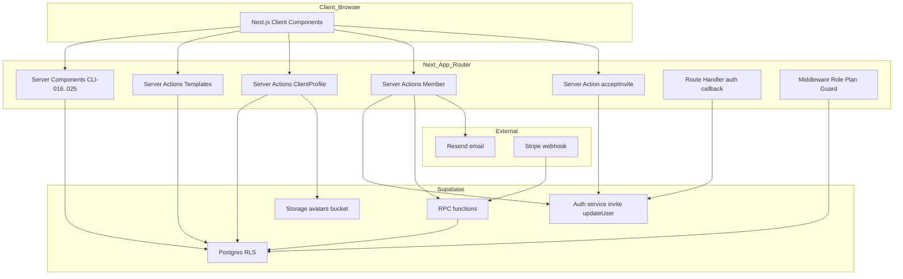
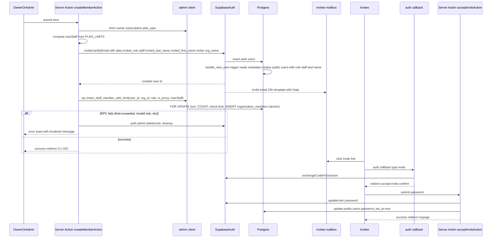
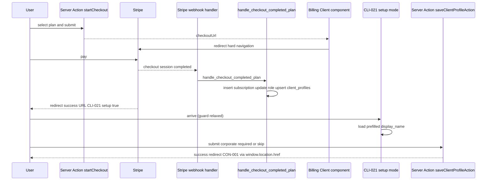
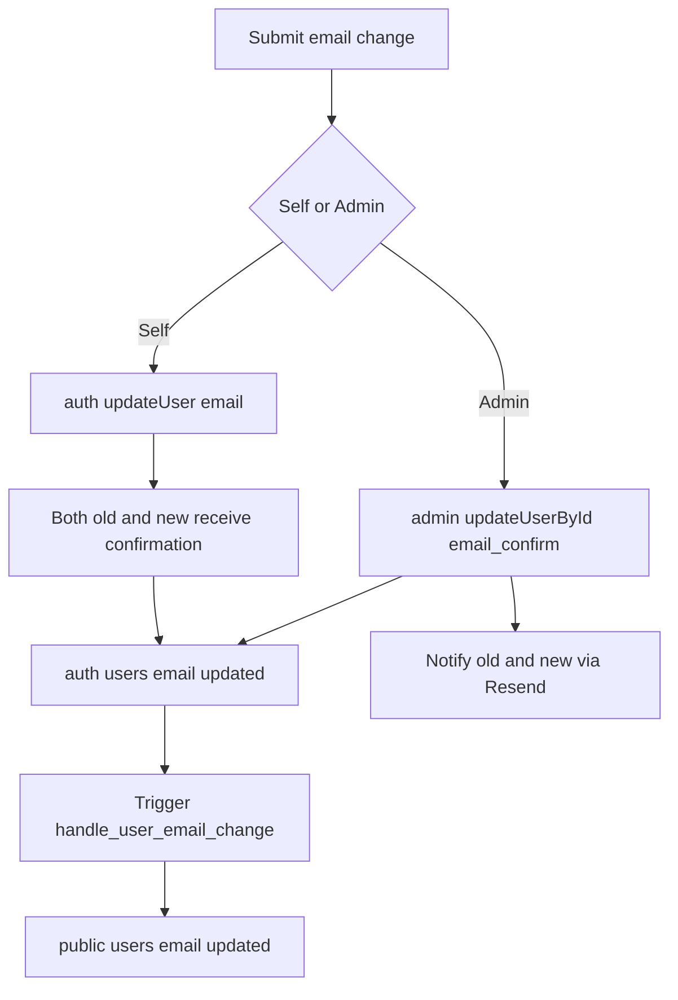
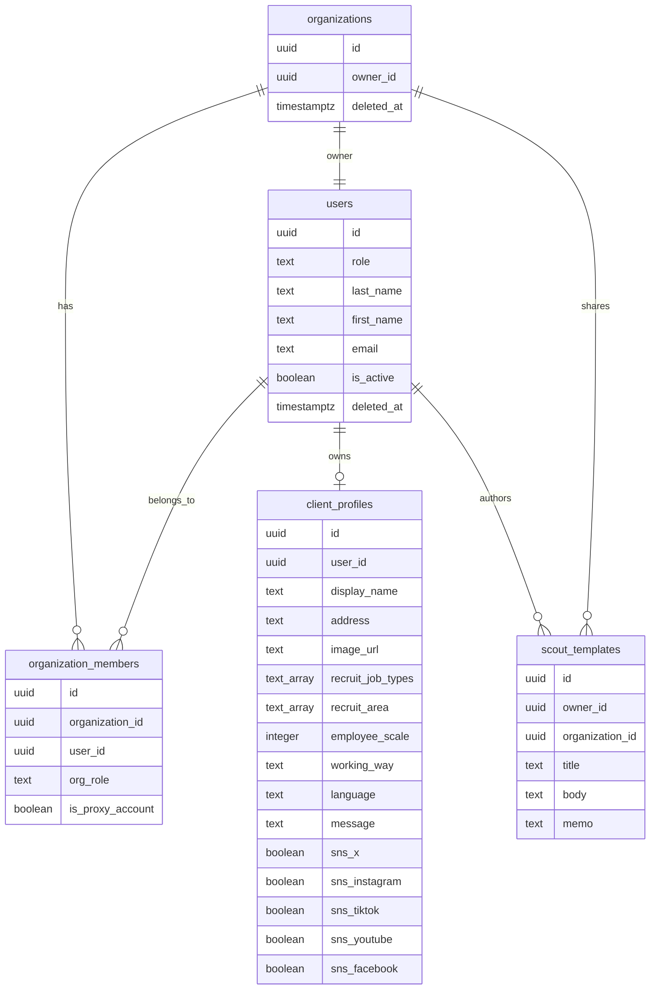
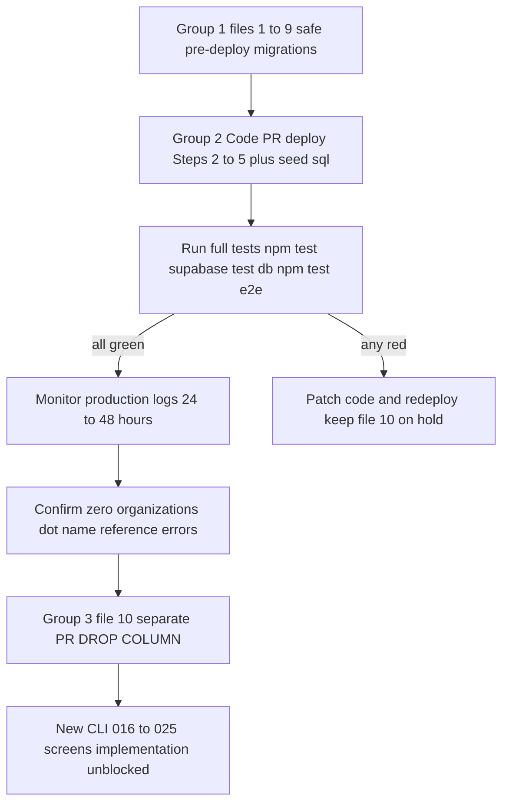

# 組織管理機能（organization）— 技術設計

## Overview

**Purpose**: 法人プラン向けの組織管理機能（スカウトテンプレート、発注者プロフィール、担当者管理）と、発注者表示名を `client_profiles.display_name` に一本化する横断リファクタリングを提供する。

**Users**:
- 発注者（Client: 個人発注者 / 小規模事業主 / 法人プラン）: CLI-020/021 で自社プロフィールを管理、CLI-016〜019 でスカウトテンプレを作成・利用
- 法人プランの Owner / Admin / Staff: CLI-022〜025 で組織メンバーを管理し、招待フローで新メンバーを受け入れる
- 受注者（Contractor）: CLI-016〜025 は使わないが、本機能の副産物として「発注者名の一貫した表示」の恩恵を受ける（メッセージ・案件カード等で `client_profiles.display_name` が正になる）

**Impact**: `organizations.name` カラムを廃止し、発注者表示名の Single Source of Truth を `client_profiles.display_name` に移す。既存の `getActiveCorporateOrgNames()` ヘルパーと `/mypage/organization-setup` 暫定画面を廃止し、CLI-021 の `?setup=true` モードに統合する。新規画面 11 枚（AUTH-008 + CLI-016〜025）を追加する。

### Goals
- 発注者表示名を `client_profiles.display_name` に一本化し、メッセージ / 一覧 / 案件カード / メール通知で一貫させる
- 法人プランの Owner / Admin が担当者を招待・編集・削除できる一連のフロー（招待メール 24h TTL、パスワード初回設定、権限階層チェック、人数制限トランザクション）を提供する
- スカウトテンプレートを組織共有資産として CRUD 可能にする（既存 RLS migration を UI と Server Action で支える）
- 発注者プロフィール編集画面（CLI-021）を全プラン共通の初回セットアップ導線として統合し、再加入時も編集済みデータを保持する

### Non-Goals
- 管理責任者（Owner）の別人への交代フロー（運営が管理画面で対応、COM-008 経由）
- 退会済みアカウントの復活 UI（COM-008 経由の個別運用）
- アカウント全情報の物理削除 UI（GDPR 要望は COM-008 運営対応）
- Supabase Auth の招待 TTL 延長や独自トークン管理（標準 24h を採用）
- `scout_templates` の下書き保存・利用回数トラッキング・バージョン履歴

## Requirements Traceability

| Requirement | Summary | Components | Interfaces | Flows |
|-------------|---------|------------|------------|-------|
| 1.1 (REQ-ORG-001) | テンプレ一覧（CLI-016） | ScoutTemplateListPage | `listScoutTemplates()` RSC クエリ | — |
| 1.2 (REQ-ORG-002) | テンプレ詳細（CLI-017） | ScoutTemplateDetailPage, DeleteTemplateAction | `deleteScoutTemplateAction()` | Template CRUD |
| 1.3 (REQ-ORG-003) | テンプレ編集（CLI-018） | ScoutTemplateEditForm | `updateScoutTemplateAction()` | Template CRUD |
| 1.4 (REQ-ORG-004) | テンプレ新規作成（CLI-019） | ScoutTemplateNewForm | `createScoutTemplateAction()` | Template CRUD |
| 1.5 (REQ-ORG-004-B) | スカウト送信でのテンプレ利用 | ScoutSendForm（既存修正） | `listScoutTemplates()` | Scout send |
| 2.1 (REQ-ORG-005) | 発注者情報詳細（CLI-020） | ClientProfileDetailPage | `getClientProfileByUserId()` | — |
| 2.2 (REQ-ORG-006) | 発注者情報編集（CLI-021） | ClientProfileEditForm, ClientProfileSetupMode | `saveClientProfileAction()`, `uploadClientProfileImageAction()` | Client profile edit, Post-checkout setup |
| 2.3 (REQ-ORG-006-B) | ダウングレード・再加入時の保持 | 既存 Webhook RPC（変更なし） | `handle_checkout_completed_plan` | Subscription lifecycle |
| 3.1 (REQ-ORG-007) | 担当者一覧（CLI-022） | MemberListPage, MemberSearchBar | `listOrganizationMembers()` | — |
| 3.2 (REQ-ORG-008) | 担当者詳細（CLI-023） | MemberDetailPage, DeleteMemberAction, ResendInviteAction, `delete_staff_member` RPC | `deleteMemberAction()`, `resendInviteAction()` | Member delete |
| 3.3 (REQ-ORG-009) | 担当者編集（CLI-024） | MemberEditForm | `updateMemberAction()` | Member edit, Email change |
| 3.4 (REQ-ORG-010) | 担当者新規作成（CLI-025） + 招待 | MemberCreateForm, `insert_staff_member_with_limit` RPC | `createMemberAction()` | Member invite |
| 4.1 (共通仕様 / 招待メール) | 招待承諾画面（AUTH-008） | AcceptInviteConfirmPage | `acceptInviteAction()` | Invite accept |
| 5.1 (非機能 / セキュリティ) | Middleware / RLS / 権限階層 | organizationMiddlewareGuards, RLS policies | — | — |
| 5.2 (非機能 / pgTAP) | scout_templates RLS 10 パターンテスト | pgTAP テストファイル | — | — |
| 6.1 (付録 A Step 2) | `resolveParticipantName()` 再設計 | `src/lib/utils/display-name.ts` | `resolveParticipantName({displayName, …})` | — |
| 6.2 (付録 A Step 3-A) | 14 ファイルのクエリ書き換え | ContractorFacingClientNameQueries | — | — |
| 6.3 (付録 A Step 3-B) | 発注者アバターを `client_profiles.image_url` に統一 | MessagesPage, ThreadDetailPage | — | — |
| 6.4 (付録 A Step 4) | `/mypage/organization-setup` → CLI-021 統合 | `buildSuccessUrl()`, CLI-021 SetupMode | `saveClientProfileAction({mode:'setup'})` | Post-checkout setup |
| 6.5 (付録 A Step 1) | 10 ファイル migration（Group 1: 9 ファイル先行配布 / Group 3: 1 ファイル別 PR） | DB Migrations (M1-M10) | — | Migration |

## Architecture

### Existing Architecture Analysis

- **現行スタック**: Next.js 14 App Router + Supabase (Postgres + Auth + Storage) + Stripe + Resend。Server Components + Server Actions が基本。RLS は全テーブルで ENABLE、ヘルパー関数 `is_admin()` / `is_paid_user()` / `is_same_org()` を経由する。
- **既存ドメイン境界**:
  - `src/app/(authenticated)/mypage/*` = 受注者/発注者共通のマイページ。本機能では `client-profile/`, `members/`, 既存 `organization-setup/`（廃止）を追加・削除する。
  - `src/app/(authenticated)/messages/*` = メッセージ関連。本機能は `templates/` サブツリーを追加し、`[threadId]/page.tsx` と `page.tsx` のクエリを改修する。
  - `src/app/(auth)/*` = 未認証 UI（新規 `accept-invite/confirm` を追加）。
  - `src/app/auth/callback/route.ts` = 既存 OAuth/Magic Link コールバック（`type === 'invite'` 分岐を追加）。
- **保持する統合点**:
  - Supabase Auth の標準メール（パスワード初期化・リセット）経路
  - 既存 Webhook RPC `handle_checkout_completed_plan` の `client_profiles` INSERT ロジック（`ON CONFLICT (user_id) DO NOTHING` による再加入時の保持）
  - `resolveParticipantName()` の命名（シグネチャは変更、呼び出し箇所は 14 ファイル）
  - `buildSuccessUrl()` の呼び出し元（全プラン共通の戻り先に統一する）
- **技術的負債の扱い**:
  - `organizations.name` + 複数テーブル解決の廃止（本 spec の主目的）
  - `getActiveCorporateOrgNames()` 廃止（admin client バイパスの削減）
  - `/mypage/organization-setup` 暫定画面を撤去

### Architecture Pattern & Boundary Map



**Architecture Integration**:
- Selected pattern: 既存 Server Component + Server Action 基盤の踏襲。担当者の作成・削除はマルチテーブル更新の原子性が必要なため、PostgreSQL `SECURITY DEFINER` 関数（`insert_staff_member_with_limit` / `delete_staff_member`）に集約する。Supabase Auth 呼び出し（`inviteUserByEmail` / `auth.admin.deleteUser`）は外部 HTTP なので RPC の外。人数チェックは RPC 内で `FOR UPDATE` ロック + COUNT + INSERT を原子実行し、TOCTOU を構造的に排除する（2026-04-18 レビュー決定 1-C/D/G 再検討）。
- Domain boundaries: `scout_templates`（共有資産）、`client_profiles`（発注者表示情報・画像・会社属性）、`organizations` + `organization_members`（構造とメンバーシップ）を独立ドメインとし、Server Action もそれぞれに分離。
- Existing patterns preserved: `ActionResult<T>` 形式（`{success,error,data?}`）、Zod バリデーション二重化、admin client の最小利用、`resolveParticipantName()` 一本化、ソフトデリート + `deleted_at IS NULL` RLS。
- New components rationale: AUTH-008 と `/accept-invite/confirm` は招待完了用の未認証→認証間の橋渡し。`/mypage/client-profile` と `/mypage/members` は新規ドメインの UI。
- Steering compliance: `roles-and-permissions.md` の権限マトリクス、`authentication.md` の招待フロー、`database-schema.md` の RLS 指針を踏襲。Staff の受注者アクション禁止 / Owner の `/profile/edit` 誘導を守る。

### Technology Stack & Alignment

| Layer | Choice / Version | Role in Feature | Notes |
|-------|------------------|-----------------|-------|
| Frontend | Next.js 14 App Router (RSC) + shadcn/ui + React Hook Form + Zod | CLI-016〜025 / AUTH-008 の UI と Server Action 呼び出し | 既存パターン踏襲、新規依存なし |
| Backend / Services | Next.js Server Actions + Supabase JS client + Supabase Auth Admin SDK | `create`/`update`/`delete` 系と招待メール送信 | admin client は担当者作成・強制メール変更・ファイル削除補助のみで使用 |
| Data / Storage | PostgreSQL 15 (Supabase) + Supabase Storage (`avatars` public bucket) | 追加カラム `address`, `sns_*`。画像は既存バケット流用 | 10 ファイルの段階的 migration（9 先行 + 1 別 PR）で `organizations.name` 廃止 |
| Messaging / Events | Resend (React Email) | 管理者強制メール変更通知、招待メールの代替経路 | 招待メール本体は Supabase Auth のテンプレート |
| Infrastructure / Runtime | Vercel + Supabase + Stripe Webhook（既存） | 課金成功 → Webhook RPC → CLI-021 ?setup=true 遷移 | 既存インフラのまま |

詳細な代替案比較は `research.md` の「Architecture Pattern Evaluation」参照。

## System Flows

### 担当者招待フロー（レビュー決定 1-C/D/G、1-E/2-A、1-B を反映）



**Key Decisions**:
- Server Action は (a) `inviteUserByEmail` で auth.users 作成（メタデータ `invited_role='staff'` + 姓名同梱） → (b) `handle_new_user` トリガーがメタデータを読み取り `public.users` を `role='staff'` + 姓名入りで自動 INSERT → (c) `insert_staff_member_with_limit` RPC で人数チェック + membership INSERT を atomic 実行、の 3 段構え（D 採用、2026-04-19 改訂）
- 人数チェックは RPC 内で `FOR UPDATE` 組織行ロック + COUNT で行うため TOCTOU レースなし
- RPC 失敗時（`STAFF_LIMIT_EXCEEDED` 等）は `auth.admin.deleteUser` で auth.users をクリーンアップし「幽霊アカウント」を防ぐ
- 招待メール送信は `inviteUserByEmail` の 1 コールに含まれる。メール送信失敗時のみトーストで再送案内
- `password_set_at` は `public.users` 列に記録（`auth.users.user_metadata` ではない）
- **Admin/Staff は最初から `users.role = 'staff'` で作成**（D 採用）。contractor を経由せず、孤児 auth.users が「無料受注者」として残るリスク（design.md L887 旧記述）も解消

### 課金直後の CLI-021 セットアップフロー



**Key Decisions**:
- `buildSuccessUrl()` を全プランで `/mypage/client-profile/edit?setup=true` に統一。個人・小規模プランは「スキップ」ボタンあり。
- `?setup=true` はミドルウェアガードを緩和し、Webhook 未着でも到達可。保存 Server Action は `subscriptions.plan_type` 未確定時「数秒後に再試行」エラーを返す。
- **Webhook race condition 対策（CLAUDE.md「Webhook タイミング対策」準拠）**: 本 spec で新しく先行 UPDATE を追加しない。Checkout を起点とする Server Action（`start-checkout-action.ts` / `plan-actions.ts`）で既に `subscriptions.plan_type` 先行 UPDATE + `ensure_organization_exists` 先行 RPC を実行済みのため、通常フローでは Webhook より先に DB が整っている状態で CLI-021 ?setup=true に到達する。Webhook ハンドラが同じ UPDATE を後続で再実行するが冪等に設計されている。本 spec は「例外的な遅延時のフォールバック」として `subscriptions.plan_type IS NULL` の検出と日本語エラー表示のみを担当する（リトライ処理はユーザー再操作に委ねる）。
- 保存成功後の画面遷移はクライアント側で `window.location.href` を使い Router Cache による旧リダイレクト結果の再利用を避ける。

### メール変更フロー（CLI-024）



**Key Decisions**:
- 既存 `handle_user_email_change` トリガー（`20260415100000_auth_email_sync_trigger.sql`）で `public.users.email` が自動同期される。本 spec は新トリガーを追加しない。
- 管理者変更時のみ旧新メールへ Resend で通知（テンプレ新規作成）。

## Components and Interfaces

### Component Summary

| Component | Domain/Layer | Intent | Req Coverage | Key Dependencies (P0/P1) | Contracts |
|-----------|--------------|--------|--------------|--------------------------|-----------|
| ScoutTemplateListPage | RSC / UI | CLI-016 一覧表示 | 1.1, 6.2 | Supabase (P0) | State |
| ScoutTemplateDetailPage | RSC / UI | CLI-017 詳細表示 + 削除 | 1.2 | Supabase (P0), DeleteScoutTemplateAction (P0) | — |
| ScoutTemplateEditForm | Client UI | CLI-018 編集フォーム | 1.3 | updateScoutTemplateAction (P0) | — |
| ScoutTemplateNewForm | Client UI | CLI-019 新規作成フォーム | 1.4 | createScoutTemplateAction (P0) | — |
| ScoutSendForm (既存) | Client UI 修正 | REQ-ORG-004-B 対応（confirm 上書き + updated_at ソート） | 1.5 | listScoutTemplates (P0) | — |
| scoutTemplateServerActions | Server Action | create/update/delete テンプレ | 1.1〜1.4 | Supabase (P0) | Service |
| ClientProfileDetailPage | RSC / UI | CLI-020 発注者情報表示 | 2.1 | Supabase (P0) | — |
| ClientProfileEditForm | Client UI | CLI-021 編集 + setup mode | 2.2 | saveClientProfileAction (P0), uploadClientProfileImageAction (P0) | — |
| clientProfileServerActions | Server Action | save + upload image | 2.2 | Supabase Storage (P0) | Service |
| MemberListPage | RSC / UI | CLI-022 一覧 + 検索 | 3.1 | Supabase (P0) | — |
| MemberDetailPage | RSC / UI | CLI-023 詳細 + 削除 + 招待再送 | 3.2 | deleteMemberAction (P0), resendInviteAction (P0) | — |
| MemberEditForm | Client UI | CLI-024 編集 | 3.3 | updateMemberAction (P0) | — |
| MemberCreateForm | Client UI | CLI-025 新規作成 | 3.4 | createMemberAction (P0) | — |
| memberServerActions | Server Action | create/update/delete/resend | 3.1〜3.4 | Supabase Auth Admin (P0), `insert_staff_member_with_limit` RPC (P0), `delete_staff_member` RPC (P0), Resend (P1) | Service |
| AcceptInviteConfirmPage | Client UI | AUTH-008 パスワード設定 | 4.1 | acceptInviteAction (P0) | — |
| acceptInviteAction | Server Action | パスワード設定 + password_set_at 記録 | 4.1 | Supabase Auth (P0) | Service |
| authCallbackRoute (既存) | Route Handler | `type === 'invite'` 分岐追加 | 4.1 | Supabase Auth (P0) | API |
| OrganizationMiddlewareGuards | Middleware | CLI-024 redirect / CLIENT_ONLY_PREFIXES 拡張 / setup=true 緩和 | 5.1 | Supabase Auth (P0) | — |
| MigrationsOrganizationPhase | Migration | 10 ファイル（Group 1: 9 ファイル先行 / Group 3: 1 ファイル別 PR）— DB 構造変更 + 新 RPC + 新カラム + RLS + Storage policy + 関数本体更新 + handle_new_user トリガー拡張（D 対応） | 6.5, 2.2 | Supabase CLI (P0) | Batch |
| resolveParticipantNameV2 | Utility | 発注者表示名再設計 | 6.1 | — | Service |
| ContractorFacingClientNameQueries | RSC クエリ修正 | 14 ファイルのクエリ書き換え | 6.2 | Supabase (P0) | — |
| MessagesAvatarSwitch | RSC 修正 | 2 ファイル（messages/page, [threadId]/page） | 6.3 | Supabase (P0) | — |
| BuildSuccessUrlUpdate | Server Action 修正 | `/mypage/client-profile/edit?setup=true` に統一 | 6.4 | Stripe (P0) | — |
| EmailChangedByAdminEmail | Template | Resend 通知メール | 3.3 | React Email (P1) | — |
| ScoutTemplatesPgTap | Test | RLS 10 パターン検証 | 5.2 | pgTAP (P0) | — |

### Scout Templates Domain

#### scoutTemplateServerActions

| Field | Detail |
|-------|--------|
| Intent | CLI-016〜019 の CRUD を 1 つのモジュールで提供 |
| Requirements | 1.1, 1.2, 1.3, 1.4 |

**Responsibilities & Constraints**
- 本人のテンプレ（`organization_id IS NULL`）と組織共有テンプレ（`organization_id = 所属組織`）の CRUD を扱う
- `owner_id` は常に `auth.uid()`。`organization_id` は作成者の所属組織（`organization_members` を Server Action 内で参照して自動設定）
- 編集・削除は RLS（`scout_templates_update` / `scout_templates_delete` ポリシー、既存 migration `20260415100100_*`）で組織メンバー全員に許可。
- 文字数上限 `title ≤ 50`, `body ≤ 2000`, `memo ≤ 500` を Zod で検証

**Dependencies**
- Outbound: Supabase クライアント `scout_templates` (P0)
- External: なし

**Contracts**: [x] Service

##### Service Interface
```typescript
type ActionResult<T = void> =
  | { success: true; data?: T }
  | { success: false; error: string };

interface ScoutTemplateServerActions {
  createScoutTemplateAction(
    input: { title: string; body: string; memo: string | null }
  ): Promise<ActionResult<{ id: string }>>;

  updateScoutTemplateAction(
    id: string,
    input: { title: string; body: string; memo: string | null }
  ): Promise<ActionResult>;

  deleteScoutTemplateAction(id: string): Promise<ActionResult>;
}
```
- Preconditions: 認証済み、`users.role IN ('client','staff')` またはサブスク active/past_due。
- Postconditions: 成功時 `revalidatePath('/messages/templates')` を呼び、詳細画面にも反映。
- Invariants: 他組織の `organization_id` を埋めない。

**Implementation Notes**
- Integration: 一覧表示の並び順は `updated_at DESC`。既存 `scout-send/page.tsx` も同じ並び順に変更（付録 A Step 4-A）。
- Validation: Zod で空白トリム、上限超過時は日本語メッセージ。
- Risks: 組織切り替え（万が一 Admin が別組織に移されるケース）では `organization_id` の整合性に注意。仕様上発生しないが、担当者作成 Server Action（`createMemberAction`）以外では `organization_id` を更新しない。

### Client Profile Domain

#### clientProfileServerActions

| Field | Detail |
|-------|--------|
| Intent | CLI-021 の保存と画像アップロードを提供し、setup モードを制御 |
| Requirements | 2.2, 6.4 |

**Responsibilities & Constraints**
- `client_profiles` の UPSERT。`user_id` は常にログイン中ユーザーが属する組織の Owner（法人プラン）またはログイン中ユーザー本人（個人・小規模プラン）
- 権限: Owner / Admin のみ。Staff は Middleware + Server Action で 403
- Setup モード: 課金直後（`?setup=true`）で Webhook 未着の場合は DB 状態が `subscriptions.plan_type IS NULL` → エラー「プラン情報を反映中です。数秒後にもう一度お試しください」
- 画像: `avatars` バケット、パス `{owner_user_id}/client-profile.{ext}`、MIME `image/jpeg|image/png`、サイズ 5MB 以下

**Dependencies**
- Outbound: `client_profiles` (P0), Storage `avatars` (P0), `organization_members` / `organizations` 参照 (P1)
- External: なし

**Contracts**: [x] Service

##### Service Interface
```typescript
type ClientProfileInput = {
  displayName: string;
  address: string | null;
  recruitJobTypes: string[];
  recruitArea: string[];
  employeeScale: number | null;
  workingWay: string | null;
  language: string | null;
  message: string | null;
  snsX: boolean;
  snsInstagram: boolean;
  snsTiktok: boolean;
  snsYoutube: boolean;
  snsFacebook: boolean;
};

interface ClientProfileServerActions {
  saveClientProfileAction(
    input: ClientProfileInput,
    opts: { mode: "edit" | "setup"; skip?: boolean }
  ): Promise<ActionResult<{ redirectTo: string }>>;

  uploadClientProfileImageAction(
    formData: FormData
  ): Promise<ActionResult<{ imageUrl: string }>>;
}
```
- Preconditions: 認証済み + `role IN ('client')` + 対象の `client_profiles.user_id` に対する権限（自分 or 同一組織 Owner/Admin）。
- Postconditions: `setup` モード + 法人プランで `displayName` 必須 / 非法人プランでスキップ可。成功時 `redirectTo` を返し、フロントで `window.location.href` に遷移。
- Invariants: `client_profiles.display_name` の空文字保存可否は**プラン種別で決まる**（setup モードか edit モードかではなく）。法人プラン（`subscriptions.plan_type = 'corporate'`）のみ空文字を Zod で拒否。個人・小規模プランは空文字保存可。

**Implementation Notes**
- Integration: CLI-021 の「設計案内バナー」は `mode` によって文言を切り替える。スキップは UI 側で `opts.skip = true` を渡し、Server Action は DB 書き込み無しに `redirectTo = '/mypage'` を返す。
- Validation: Zod スキーマの分岐軸は**プラン種別**（法人 vs 非法人）、setup / edit モードではない。setup モードは DB 書き込みのスキップ（`opts.skip = true`）と「Webhook 未着時のガード緩和」のみを担当し、バリデーションルール自体は setup/edit で変えない。具体的には以下のいずれかで実装する（要件は満たす）:
  - **案A**: プラン種別を引数に取るファクトリ関数 `clientProfileSchemaFor(planType)` で 1 本化
  - **案B**: `clientProfileSchema`（法人用、displayName 必須）と `clientProfilePersonalSchema`（非法人用、displayName 任意）の 2 本を用意し、Server Action 内でプラン種別に応じて選択
  - 変数名は実装時に決定してよい。`clientProfileSetupSchema` のように「setup モード専用」という命名は**避ける**（モードとスキーマの責務が混線するため）
- Risks: Admin が Owner の画像を更新する場合、Storage パスは Owner の user_id。Server Action 内で所有 Owner の user_id を解決してから upload する。

### Organization Member Domain

#### memberServerActions

| Field | Detail |
|-------|--------|
| Intent | CLI-022〜025 の担当者 CRUD と招待メール再送 |
| Requirements | 3.1, 3.2, 3.3, 3.4 |

**Responsibilities & Constraints**
- Owner / Admin のみが CLI-025 / CLI-024（他者編集）を実行可能。Staff は自己編集のみ（氏名・メール）
- 人数制限: **`insert_staff_member_with_limit` RPC 内で atomic チェック**（2026-04-18 レビュー決定 1-C/D/G 再検討）。Server Action は Owner の `subscriptions.plan_type` から `PLAN_LIMITS[plan_type].maxStaff` を算出して RPC に渡すのみ。RPC 内の `FOR UPDATE` + COUNT で TOCTOU を構造的に排除
- メール変更: 本人→ `auth.updateUser`、管理者→ `auth.admin.updateUserById`（即時 + Resend 通知）
- 代理アカウント UNIQUE 違反時は **R4 対応**: `insert_staff_member_with_limit` RPC 内の事前チェックで `PROXY_ACCOUNT_ALREADY_EXISTS` を raise（既存 RPC 例外パターンと一貫）。Server Action は message パターンで判定し日本語化。`updateMemberAction`（CLI-024 で `is_proxy_account` を ON 切替）でも同パターンの事前 SELECT チェックを行う
- 削除: `delete_staff_member` RPC でテンプレ移譲 / 所属削除 / ソフト削除を atomic 実行。RPC 失敗時は try/catch で日本語メッセージに変換
- Owner 自身は CLI-024 で削除不可 / 自己編集不可（Middleware で `/profile/edit` へリダイレクト）

**Dependencies**
- Inbound: CLI-022/023/024/025 ページ (P0)
- Outbound: `organization_members` (P0), `users` (P0), `subscriptions` (P0, admin client 経由), `scout_templates` (P1), `insert_staff_member_with_limit` RPC (P0), `delete_staff_member` RPC (P0)
- External: Supabase Auth Admin API (P0, `inviteUserByEmail` / `admin.updateUserById` / `admin.deleteUser`), Resend (P1)

**Contracts**: [x] Service

##### Service Interface
```typescript
interface MemberServerActions {
  createMemberAction(input: {
    lastName: string;
    firstName: string;
    email: string;
    orgRole: "admin" | "staff";
    isProxyAccount: boolean;
  }): Promise<ActionResult<{ userId: string }>>;

  updateMemberAction(
    targetUserId: string,
    input: {
      lastName?: string;
      firstName?: string;
      email?: string;
      orgRole?: "admin" | "staff";
      isProxyAccount?: boolean;
    }
  ): Promise<ActionResult<{ emailChangeMode: "self" | "admin" | null }>>;

  deleteMemberAction(
    targetUserId: string
  ): Promise<ActionResult>;

  resendInviteAction(targetUserId: string): Promise<ActionResult>;
}
```
- Preconditions: 認証済み + 権限マトリクス（対象ロール表）を満たす。
- Postconditions: 成功時 `revalidatePath('/mypage/members')`。createMember は `auth.admin.inviteUserByEmail` → RPC → 成功なら招待メール送信済み。
- Invariants: 代理アカウントは 1 法人 1 つ（DB 部分 UNIQUE）。Admin は他 Admin / Owner を編集・削除できない。

**Implementation Notes**
- Integration: `inviteUserByEmail`（メタデータに `invited_role='staff'` + 姓名同梱）で auth.users 作成 → `handle_new_user` トリガー（Migration ファイル 9、D 対応）が `public.users` を `role='staff'` + 姓名入りで自動 INSERT → `insert_staff_member_with_limit` RPC で人数チェック + R4 proxy 事前チェック + membership INSERT を atomic 実行（RPC は `public.users` 行を一切触らない、D 採用）。RPC 失敗時は `auth.admin.deleteUser(userId)` で auth.users をクリーンアップ。削除は `delete_staff_member` RPC で atomic 実行。
- Validation: Zod で以下の制約をチェック（要件 3.3 / 3.4 準拠）:
  ```typescript
  // 作成用
  const memberCreateSchema = z.object({
    lastName: z.string().trim().min(1, '姓を入力してください').max(50, '姓は50文字以内で入力してください'),
    firstName: z.string().trim().min(1, '名を入力してください').max(50, '名は50文字以内で入力してください'),
    email: z.string().trim().toLowerCase().email('メールアドレスの形式が正しくありません').max(254),
    orgRole: z.enum(['admin', 'staff']),
    isProxyAccount: z.boolean(),
  });
  // 更新用（全フィールド任意、実装時は部分更新）
  const memberUpdateSchema = memberCreateSchema.partial();
  ```
  - 権限階層チェックは Server Action 側で実施（Admin は `orgRole='admin'` での作成不可、Staff は自己編集のみ、Owner / Admin が他 Admin を編集する際のロール制限など）。Zod 内では「形式」のみを検証し、「誰がどの操作を許されるか」は Server Action で。
  - 代理アカウント UNIQUE は **R4 対応**: createMemberAction → RPC 内事前チェックで `PROXY_ACCOUNT_ALREADY_EXISTS` raise、updateMemberAction → 直接 UPDATE 前に `select id from organization_members where organization_id = ? and is_proxy_account = true and user_id != ?` で事前 SELECT、いずれも DB の部分 UNIQUE 制約が最終ガード（2 段防御）。
  - メール重複チェックは Zod 外: `public.users.email` を `idx_users_email` 経由で `maybeSingle()` し、ヒット時は Zod エラーではなく `ActionResult.error` で日本語化する（R2 対応、requirements.md REQ-ORG-010 フロー a 参照）。
- Risks: 重複 INSERT は `organization_members (org_id, user_id)` UNIQUE で防止。人数上限 TOCTOU は RPC 内 `FOR UPDATE` で構造的に排除済み。残存リスクは「RPC 失敗 + `auth.admin.deleteUser` も失敗」の二重失敗ケースのみで、発生時は auth.users に孤児が残る（`audit_logs` + 運営通知で検知、手動復旧）。

### Auth / Invite Acceptance Domain

#### AuthCallbackRoute（既存修正）

| Field | Detail |
|-------|--------|
| Intent | `type === 'invite'` 分岐を追加し `/accept-invite/confirm` にリダイレクト |
| Requirements | 4.1 |

**Responsibilities & Constraints**
- 既存の `type === 'recovery'` / デフォルト分岐を保ったまま、新規 `flowType === 'invite'` を追加
- セッション確立失敗時は `/login?error=...` のまま

**Dependencies**
- Outbound: Supabase Auth `exchangeCodeForSession` (P0)

**Contracts**: [x] API

##### API Contract
| Method | Endpoint | Request | Response | Errors |
|--------|----------|---------|----------|--------|
| GET | `/auth/callback` | `?code=...&type=invite|recovery|...` | 302 redirect | code 無し / exchange 失敗 → `/login?error=...` |

#### AcceptInviteConfirmPage + acceptInviteAction

| Field | Detail |
|-------|--------|
| Intent | AUTH-008。招待で確立されたセッションを使いパスワードを設定 |
| Requirements | 4.1 |

**Responsibilities & Constraints**
- AUTH-004 と同一レイアウト。`h1 = 「ビジ友へようこそ」`、本文に組織名 prefilled（RSC で `client_profiles.display_name` を読み取る）
- Server Action は **2 段階で実行**（B2 対応: レビュー決定 1-B と requirements.md L515-521 / tasks.md Task 12 に揃える）:
  1. `supabase.auth.updateUser({ password: newPassword })` でパスワード保存
  2. admin client で `UPDATE public.users SET password_set_at = now() WHERE id = auth.uid()` を実行
- **保存先は `public.users.password_set_at` 列（自前テーブル）に統一**。`auth.users.user_metadata` には書き込まない（CLI-022 等の一覧クエリで N+1 を避けるため、通常の SQL JOIN で読み出せる場所に置く）
- 期限切れ時は `{ success: false, error: 'リンクの有効期限が切れています。招待元に再送を依頼してください' }` を返し、フロントで「ログイン画面へ戻る」ボタンに切り替え
- 認証済みかつ `password_set_at` 既セットのユーザーが直打ちした場合はページ冒頭で `/mypage` に redirect

**Contracts**: [x] Service

##### Service Interface
```typescript
interface AcceptInviteAction {
  acceptInviteAction(input: {
    password: string;
    confirmPassword: string;
  }): Promise<ActionResult>;
}
```

**Implementation Notes**
- Integration: AUTH-004 のコードを複製して文言 5 箇所を差し替える（AUTH-008 専用に分離して将来の変更を容易に）。Zod は `updatePasswordSchema`（既存 `src/lib/validations/auth.ts`）を再利用。
- Validation: パスワード 8〜16 文字、一致必須。
- Risks: Supabase Auth の TTL 24h は `config.toml` に既定値あり。設定変更は本 spec 範囲外。

### Infrastructure / Middleware

#### OrganizationMiddlewareGuards（既存 `src/middleware.ts` 修正）

| Field | Detail |
|-------|--------|
| Intent | CLI-020〜025 / CLI-024 / `/mypage/client-profile/edit?setup=true` / `/mypage/organization-setup` の扱いを更新 |
| Requirements | 5.1, 6.4 |

**Responsibilities & Constraints**
- `CLIENT_ONLY_PREFIXES` に `/messages/templates`, `/mypage/client-profile`, `/mypage/members` を追加
- `/mypage/client-profile/edit?setup=true` は認証済みなら plan / role 未確定でも通過させる（Webhook 未着対策）
- `/mypage/organization-setup` への GET は `/mypage/client-profile/edit?setup=true` に 308 リダイレクト
- CLI-024: `users.role = 'staff'` または Admin/Owner が自己編集モードで開いた場合のみ通過。Owner が `id = 自分` でアクセスした場合は `/profile/edit` にリダイレクト（Middleware で URL の `id` と `auth.uid()` を比較）
- `/profile/edit`: `users.role = 'staff'` のアクセスを `/mypage/members/[自分ID]/edit`（CLI-024 自己編集モード）にリダイレクト

**Contracts**: なし（Middleware）

**Implementation Notes**
- 既存の分岐順序（public → unauthenticated → role check → role-specific）を維持し、新しい分岐を追加。
- Middleware の `?setup=true` 緩和は `pathname === '/mypage/client-profile/edit' && searchParams.get('setup') === 'true'` で判定し、通常分岐より前に `return finalize(supabaseResponse)` する（`/edit` 抜けで判定すると CLI-021 の実 URL とマッチしないため注意）。

### Utilities / Shared

#### resolveParticipantNameV2

| Field | Detail |
|-------|--------|
| Intent | 発注者表示名の 2 段階解決（displayName → 姓名）を提供 |
| Requirements | 6.1 |

**Contracts**: [x] Service

##### Service Interface
```typescript
interface ResolveParticipantName {
  (participant: {
    displayName: string | null;
    lastName: string | null;
    firstName: string | null;
    deletedAt: string | null;
  }): string;
}

interface GetUserDisplayName {
  (user: {
    lastName?: string | null;
    firstName?: string | null;
    companyName?: string | null;
    deletedAt?: string | null;
  }, mode?: "full" | "company" | "prefer-company"): string;
}
// Mode behavior:
// - "full" (default): personal name (`${last}${first}`) のみ、空なら "未設定"
// - "company": companyName のみ、無ければ "未設定"（既存挙動、破壊変更なし）
// - "prefer-company": companyName があればそれを返す、無ければ personal name にフォールバック、両方無ければ "未設定"
//   用途: 受注者表示で屋号があれば屋号、なければ個人名（resolveParticipantName が companyName 引数を失ったため、その代替として追加）
```
- Preconditions: `displayName` は `client_profiles.display_name` の値または null。Staff の場合は Owner の `client_profiles.display_name` を呼び出し側で解決してから渡す。
- Postconditions: 退会済み（`deletedAt` != null）は `"退会済みユーザー"`。空白のときは姓名フォールバック、全て空なら `"未設定"`。
- Invariants: 姓名結合は **スペース無し**（`${last}${first}`）で統一。

**Implementation Notes**
- Integration（発注者表示）: 付録 A Step 3-A の 14 ファイルでは、まず後述「ClientProfileResolutionForRow（B3 対応）」の **standard query pattern** で `client_profiles` を埋め込み取得し、`resolveClientProfileForRow(row)` で正しい profile を選んでから本関数 `resolveParticipantName({ displayName, lastName, firstName, deletedAt })` に渡して表示名を確定する。`client_profiles!inner(display_name)` の単純 embed は Staff 作成案件（`jobs.owner_id = Staff` で `client_profiles` 不在）で NULL になるため使わない。
- Integration（受注者表示）: 本関数の新シグネチャから `companyName` 引数が削除されるため、受注者の屋号表示には `getUserDisplayName(user, 'prefer-company')` を使う（屋号があれば屋号、無ければ姓名、両方無ければ "未設定"）。該当箇所は Task 4.3（applicant 名）/ Task 4.4（messages の participant2 ブランチ）で明示。
- Validation: ユニットテスト（`src/__tests__/utils/display-name.test.ts`）で 4 シナリオ（通常 / 退会済み / 未設定 / 姓名のみ）をカバー。Staff → Owner 解決の検証は `resolveClientProfileForRow()` 側のユニットテストで行う。`getUserDisplayName(user, 'prefer-company')` 用に追加 4 シナリオ（屋号あり / 屋号なし＋姓名 / 全空 / 退会済み）。
- Risks: `getUserDisplayName()` L24 のスペース有り不整合を同時修正（`CLAUDE.md`「名前表示・姓名結合のルール」）。

#### ClientProfileResolutionForRow（B3 対応）

| Field | Detail |
|-------|--------|
| Intent | `jobs` / `message_threads` / `applications` 等で「発注者の client_profiles を正しく解決する」共通ルール。Staff 作成案件で display_name が NULL になる B3 を構造的に防ぐ |
| Requirements | 6.2 |

**Resolution Rule**:

| 行の状態 | 参照する user_id | 経路 |
|---|---|---|
| `organization_id IS NULL`（個人/小規模プラン） | 行の `owner_id` | `client_profiles.user_id = owner_id` を直接 |
| `organization_id IS NOT NULL`（法人プラン、Owner 作 / Staff 作 問わず） | `organizations.owner_id`（=その組織の社長） | 組織経由で社長の `client_profiles` を取得 |

**Why**: 法人プランでは `client_profiles` を持つのは Owner 1 人のみ。Staff には profile が無いため、`jobs.owner_id` から直接 JOIN すると Staff 作成案件で `display_name` が NULL になる（B3 の中核）。

**Standard query pattern**（PostgREST ネスト埋め込み）:

```typescript
.select(`
  *,
  owner:users!owner_id(
    last_name, first_name, deleted_at,
    client_profiles(display_name, image_url, deleted_at)
  ),
  organization:organizations(
    owner_user:users!owner_id(
      last_name, first_name, deleted_at,
      client_profiles(display_name, image_url, deleted_at)
    )
  )
`)
```

- `users!owner_id(...)` の `!owner_id` ヒントで FK を明示すること（`users` への incoming FK が複数あるため省略すると "曖昧な FK" エラーが出る）
- `client_profiles` のネストは配列で返る（`[0]` で先頭を取る）
- `organization` が NULL の行 = 個人/小規模プラン、`organization.owner_user` がある行 = 法人プラン

**Standard helper signature**（`src/lib/utils/display-name.ts` に追加）:

```typescript
type RowWithOrgContext = {
  organization_id: string | null;
  owner?: {
    last_name: string | null;
    first_name: string | null;
    deleted_at: string | null;
    client_profiles: Array<{
      display_name: string | null;
      image_url: string | null;
    }> | null;
  } | null;
  organization?: {
    owner_user?: {
      last_name: string | null;
      first_name: string | null;
      deleted_at: string | null;
      client_profiles: Array<{
        display_name: string | null;
        image_url: string | null;
      }> | null;
    } | null;
  } | null;
};

export function resolveClientProfileForRow(row: RowWithOrgContext): {
  displayName: string | null;
  imageUrl: string | null;
  lastName: string | null;
  firstName: string | null;
  deletedAt: string | null;
};
```

ロジック:
- `row.organization_id` が NULL → `row.owner` の姓名・deleted_at と `row.owner.client_profiles[0]` を返す
- `row.organization_id` が NOT NULL → `row.organization.owner_user` の姓名・deleted_at と `row.organization.owner_user.client_profiles[0]` を返す
- 該当する source が無ければ全 null を返す

返値を `resolveParticipantName({ displayName, lastName, firstName, deletedAt })` に渡して最終表示名を確定する。

**Where to apply**:
- 付録 A Step 3-A の 14 ファイルすべて（受注者から発注者を見るクエリ）
- メッセージスレッド系（付録 A Step 3-B 含む）でも `message_threads.organization_id` を使った同パターンで解決
- 例外: CLI-020 / CLI-021 等「自分自身（または所属組織 Owner）の `client_profiles` を編集する画面」は対象外（`auth.uid()` から直接 SELECT で足りる）

**Implementation Notes**
- Integration: 一覧クエリ（CON-002 / CON-005 / CON-007 / 案件管理 など）と詳細クエリ（CON-003 / CON-006 / CLI-002 など）で同じ select pattern を使う。embed のためバルクでも N+1 にならない
- Validation: ユニットテスト（`src/__tests__/utils/display-name.test.ts`）— (a) `organization_id NULL` で owner.client_profiles を返す (b) `organization_id` 有で `organization.owner_user.client_profiles` を返す (c) Staff 作案件（owner != organization.owner_user）で社長 profile を返す (d) Owner 退会済みで deletedAt を返す
- Risks: ネスト 3 層になるため Supabase CLI 型生成（`supabase gen types`）の再実行が必要。型崩れを早期検出するため Task 4 着手前に型再生成を行うこと

### Messaging UI 修正（既存）

#### MessagesAvatarSwitch

| Field | Detail |
|-------|--------|
| Intent | 受注者 → 発注者方向のアバターを `client_profiles.image_url` に切り替え |
| Requirements | 6.3 |

**Responsibilities & Constraints**
- `messages/page.tsx`: スレッド一覧で相手アバターを取得する際、相手が発注者側（= スレッドの `organization_id IS NOT NULL` かつ自分が `participant_2_id`）なら Owner の `client_profiles.image_url` を使う。NULL ならデフォルト
- `messages/[threadId]/page.tsx`: `isContractorSide` が true のとき `clientProfile?.image_url` を使用。逆方向は従来どおり `users.avatar_url`

**Implementation Notes**
- Integration: 追加の SELECT は `client_profiles!left(user_id, image_url)` でネスト。`organization_id` 経由でない場合（個人プラン）は `client_profiles.user_id = participant_1_id` で JOIN。

## Data Models

### Domain Model



**Invariants**:
- `organizations.owner_id` は UNIQUE。1 ユーザーは 1 組織のみ所有。
- `organization_members (organization_id, user_id)` UNIQUE。同一組織への二重登録不可。
- `organization_members (organization_id) WHERE is_proxy_account = true` 部分 UNIQUE。1 法人 1 代理アカウント。
- `client_profiles (user_id)` UNIQUE。1 ユーザー 1 プロフィール。
- `scout_templates` の `organization_id IS NULL` は個人プラン。`IS NOT NULL` は法人プラン。

### Logical Data Model

本 spec で追加・変更される列とポリシーのみ記載する。

#### `client_profiles` 追加列

| Column | Type | Nullable | Default | Notes |
|--------|------|----------|---------|-------|
| `address` | `text` | ✓ | NULL | 200 字上限（Zod）、CLI-020 で表示 |
| `sns_x` / `sns_instagram` / `sns_tiktok` / `sns_youtube` / `sns_facebook` | `boolean` | ✗ | `false` | 受注者非公開、運営集計用 |

#### `public.users` 追加列（レビュー決定 1-B）

| Column | Type | Nullable | Default | Notes |
|--------|------|----------|---------|-------|
| `password_set_at` | `timestamptz` | ✓ | NULL | 招待担当者がパスワード設定完了した時刻。CLI-022/023 の「招待中」バッジ判定と招待再送ボタン表示に使用 |

#### `organizations` RLS 変更（レビュー決定 1-A）

**変更前**（現行）:
- `organizations_select` = `is_same_org(auth.uid(), id)`（同一組織メンバーのみ）
- `organizations_select_admin` = `is_admin(auth.uid())`（システム管理者）
- `organizations_select_thread_participant` = メッセージスレッドの受注者側（messaging spec で追加した例外）

**変更後**:
- 上記 3 ポリシーのうち `organizations_select` と `organizations_select_thread_participant` を撤去
- 新規 `organizations_select_public` を追加: `USING (deleted_at IS NULL)`（全 authenticated ユーザーが生存組織を SELECT 可）
- `organizations_select_admin` は残す（ソフト削除された組織も admin は閲覧可）

**変更理由**: `jobs.owner_id` と `jobs.organization_id` が既に公開されているため、`organizations.owner_id` を公開しても新たな情報漏洩はない。一方で受注者が Staff 経由の案件で発注者名を解決する経路が確立される。

**残存する保護**: `organization_members` の RLS は無変更（同一組織メンバーのみ閲覧可）。「田中工務店の担当者一覧」は引き続き非公開。

#### `organizations` 列変更

| Step | Migration | Action |
|------|-----------|--------|
| A | `{ts}_organizations_name_drop_not_null.sql` | `ALTER TABLE organizations ALTER COLUMN name DROP NOT NULL;` |
| B | `{ts}_migrate_org_name_to_client_profiles.sql` | `UPDATE client_profiles SET display_name = o.name FROM organizations o WHERE ...`（既存空文字を除外） |
| C | `{ts}_billing_rpc_drop_org_name.sql` | `ensure_organization_exists` 再定義（`name` 引数なし）/ `organizations` INSERT から `name` 列を外す |
| D | `{ts}_organizations_drop_name.sql` | `ALTER TABLE organizations DROP COLUMN name;` |

- A〜B はコード配布の前でも安全、C は `resolveParticipantName()` とクエリ書き換え PR と同時配布、D は C の反映確認後。
- `supabase/seed.sql` の 3 箇所（organizations INSERT）から `name` を外し、対応する `client_profiles` INSERT / UPDATE で `display_name` を設定する。

#### 担当者作成・削除は RPC に集約する（2026-04-18 レビュー決定 1-C/D/G を再検討）

担当者作成・削除はマルチテーブル更新の原子性が必要なため、**2 つの `SECURITY DEFINER` 関数を導入**する。Supabase Auth API 呼び出し（`inviteUserByEmail` / `auth.admin.deleteUser`）は外部サービスのため RPC 外に残すが、DB 側の操作はすべて RPC 内の 1 トランザクションにまとめる。

**方針変更の理由**: 当初の「Server Action 内で順次処理 + 事前人数チェックのみ」案は、(A)「数のずれ（TOCTOU）」と (B)「部分失敗による幽霊ユーザー」の 2 リスクを運用カバーで許容する設計だった。規模感から (A) は軽微だが、(B) は「被招待者が壊れた状態でログインする」実害があり、CLAUDE.md の Stripe 二重課金防止ルール（DB レースを運用でごまかさない姿勢）とも方針不整合。RPC 導入コスト（~60 行 SQL + pgTAP テスト、実装 2〜4 時間）は許容範囲と判断し、原子性を構造的に担保する方針へ切り替える。

##### RPC `insert_staff_member_with_limit`

組織行ロックで同時 INSERT を直列化した上で、人数チェック + role UPDATE + membership INSERT を atomic 実行する。

```sql
CREATE OR REPLACE FUNCTION insert_staff_member_with_limit(
  p_user_id uuid,
  p_organization_id uuid,
  p_org_role text,
  p_is_proxy_account boolean,
  p_max_staff integer
) RETURNS void
LANGUAGE plpgsql
SECURITY DEFINER
SET search_path = public
AS $$
DECLARE
  v_current_count integer;
BEGIN
  IF p_org_role NOT IN ('admin', 'staff') THEN
    RAISE EXCEPTION 'INVALID_ORG_ROLE: %', p_org_role;
  END IF;

  PERFORM 1 FROM organizations WHERE id = p_organization_id FOR UPDATE;

  SELECT COUNT(*) INTO v_current_count
  FROM organization_members
  WHERE organization_id = p_organization_id AND org_role != 'owner';

  IF v_current_count >= p_max_staff THEN
    RAISE EXCEPTION 'STAFF_LIMIT_EXCEEDED: current=% max=%', v_current_count, p_max_staff;
  END IF;

  -- R4 対応: 代理アカウント追加時、組織内に既存の代理がないか事前確認。
  -- FOR UPDATE で organizations をロック済みのためレースなし。
  -- DB の部分 UNIQUE (organization_id) WHERE is_proxy_account = true は最終ガードとして残し 2 段防御。
  -- Server Action は PROXY_ACCOUNT_ALREADY_EXISTS を message パターンで判定して日本語化する。
  IF p_is_proxy_account AND EXISTS (
    SELECT 1 FROM organization_members
    WHERE organization_id = p_organization_id AND is_proxy_account = true
  ) THEN
    RAISE EXCEPTION 'PROXY_ACCOUNT_ALREADY_EXISTS: org=%', p_organization_id;
  END IF;

  -- D 対応: handle_new_user トリガー（Migration ファイル 9）が INSERT 時に
  -- メタデータから role='staff' + last_name + first_name を直接設定するため、
  -- ここで UPDATE は行わない。RPC は人数チェックと membership INSERT のみに専念し、
  -- 既存ユーザーのロール・氏名を破壊する R3 リスクを構造的に排除する。
  IF NOT EXISTS (SELECT 1 FROM public.users WHERE id = p_user_id) THEN
    RAISE EXCEPTION 'USER_NOT_FOUND: %', p_user_id;
  END IF;

  INSERT INTO organization_members (organization_id, user_id, org_role, is_proxy_account)
  VALUES (p_organization_id, p_user_id, p_org_role, p_is_proxy_account);
END;
$$;

REVOKE ALL ON FUNCTION insert_staff_member_with_limit FROM PUBLIC;
GRANT EXECUTE ON FUNCTION insert_staff_member_with_limit TO service_role;
```

**この関数の解決範囲**:
- `FOR UPDATE` で組織行ロック → 同時 INSERT が直列化 → TOCTOU 問題 (A) を構造的に排除
- カウント + membership INSERT が 1 トランザクション → 部分失敗問題 (B) を構造的に排除
- `SECURITY DEFINER` + `service_role` GRANT → フロントエンドから直接呼び出し不可
- **role / name の UPDATE は行わない**（D 採用、2026-04-19）。メタデータ駆動のトリガー（Migration ファイル 9）が INSERT 時に正しい値で作成するため、RPC は `public.users` 行を一切触らない。これにより既存ユーザーのデータ破壊リスク（R3）も構造的に消滅

##### RPC `delete_staff_member`

テンプレ移譲 / 所属削除 / ソフト削除の 3 操作を atomic 実行する。

```sql
CREATE OR REPLACE FUNCTION delete_staff_member(
  p_target_user_id uuid,
  p_organization_id uuid,
  p_owner_user_id uuid
) RETURNS void
LANGUAGE plpgsql
SECURITY DEFINER
SET search_path = public
AS $$
BEGIN
  UPDATE scout_templates SET owner_id = p_owner_user_id
  WHERE owner_id = p_target_user_id AND organization_id = p_organization_id;

  DELETE FROM organization_members
  WHERE user_id = p_target_user_id AND organization_id = p_organization_id;

  UPDATE users SET deleted_at = now() WHERE id = p_target_user_id;
END;
$$;

REVOKE ALL ON FUNCTION delete_staff_member FROM PUBLIC;
GRANT EXECUTE ON FUNCTION delete_staff_member TO service_role;
```

##### `createMemberAction` Server Action 手順

1. Zod バリデーション、権限チェック（Owner / Admin のみ）
2. **メール重複チェック（R2 対応）**: admin client で `from('users').select('id').eq('email', input.email).maybeSingle()` を実行し、ヒットしたら `{ success: false, error: 'このメールアドレスは既に登録されています' }` を即返す。`auth.admin.listUsers()` は **使わない**（O(N) のネットワーク往復で本番劣化するため）。`public.users.email` は `handle_user_email_change` トリガーで `auth.users.email` と同期され、`idx_users_email` インデックスで O(log N) 照会可能（migration ファイル 3 で同梱追加）
3. admin client で自分の `organization_id` と Owner の `user_id` を取得
4. admin client で Owner の `subscriptions.plan_type` を取得 → `PLAN_LIMITS[plan_type].maxStaff` を算出
5. `supabase.auth.admin.inviteUserByEmail(email, { redirectTo, data: { invited_role: 'staff', invited_last_name: input.lastName, invited_first_name: input.firstName, inviter_name, organization_name } })` を呼び auth.users を作成 + 招待メール送信。**D 対応**: トリガー（Migration ファイル 9）がメタデータの `invited_role='staff'` / `invited_last_name` / `invited_first_name` を読み取り、`public.users` を最初から `role='staff'` + 氏名入りで INSERT する。これにより contractor 経由の中間状態が消え、孤児 auth.users が「無料受注者」として残るリスクも消滅。**孤児 auth.users が事前チェックを抜けた場合のフォールバック**として、ここで `inviteUserByEmail` の email 重複エラーも掴む（2 段防御）
6. admin client 経由で `insert_staff_member_with_limit(new_user_id, org_id, org_role, is_proxy, max_staff)` RPC を呼び出し（D 採用により name/role 引数は不要。RPC は人数チェック + organization_members INSERT のみ実行し、既存ユーザーのデータ破壊を構造的に排除）
7. RPC 失敗時（`STAFF_LIMIT_EXCEEDED` / `PROXY_ACCOUNT_ALREADY_EXISTS` / `INVALID_ORG_ROLE` / `USER_NOT_FOUND` / その他）は `auth.admin.deleteUser(new_user_id)` で auth.users をクリーンアップし、エラーコードに応じた日本語メッセージを返却
8. 成功時は `revalidatePath('/mypage/members')` して CLI-022 にリダイレクト

##### `deleteMemberAction` Server Action 手順

1. Zod バリデーション、権限チェック（Owner / Admin のみ。Staff は自己削除不可 = Middleware + 本チェック）
2. admin client で対象ユーザーの `organization_id` と Owner の `user_id` を取得
3. admin client 経由で `delete_staff_member(target_user_id, org_id, owner_user_id)` RPC を呼び出し
4. try/catch で失敗時は日本語エラーを返却
5. 成功時は `revalidatePath('/mypage/members')` して CLI-022 にリダイレクト

##### 追加の RPC は作らない

当初検討していた `get_user_plan_type` RPC は追加しない。`subscriptions.plan_type` 取得は Server Action 内の単発 SELECT で十分で、原子性は不要。

#### Storage RLS（追加）

| Policy | Bucket | Operation | USING / WITH CHECK |
|--------|--------|-----------|--------------------|
| `avatars_client_profile_write` | `avatars` | INSERT, UPDATE, DELETE | `is_org_admin_or_owner_of(auth.uid(), ((storage.foldername(name))[1])::uuid)` |

**実装方針**: 既存「自分のフォルダに INSERT/UPDATE/DELETE 可」（`(storage.foldername(name))[1] = auth.uid()::text`）の単一ポリシーは**そのまま残す**。本表の `avatars_client_profile_write` は**追加で**作成する単独ポリシー。PostgreSQL の PERMISSIVE ポリシーは複数あれば自動で OR 結合されるため、結果として「自分のフォルダ OR 同一組織 Owner のフォルダ」のいずれかにマッチすれば許可される 2 段階アクセス権が成立する（既存ポリシーを書き換えない）。

**RLS 再帰回避（必須）**: ポリシー内で `organization_members` を直接サブクエリすると、`organization_members` 自身の RLS が再帰し PostgreSQL の再帰検出でエラーになる（既存マイグレーション `20260402100000_fix_org_members_rls_recursion.sql` で確認済みのパターン）。このため以下の新規 SECURITY DEFINER 関数を Migration ファイル 6（本 Task 2.5 と同一 migration）で定義し、ポリシーから呼ぶ:

```sql
CREATE OR REPLACE FUNCTION is_org_admin_or_owner_of(uid uuid, target_owner_user_id uuid)
RETURNS boolean
LANGUAGE sql
STABLE
SECURITY DEFINER
SET search_path = public
AS $$
  SELECT EXISTS (
    SELECT 1
    FROM organization_members m
    JOIN organizations o ON o.id = m.organization_id
    WHERE m.user_id = uid
      AND m.org_role IN ('owner','admin')
      AND o.owner_id = target_owner_user_id
  );
$$;
REVOKE ALL ON FUNCTION is_org_admin_or_owner_of FROM PUBLIC;
GRANT EXECUTE ON FUNCTION is_org_admin_or_owner_of TO authenticated;
```

これにより RLS からの再帰が発生しない（SECURITY DEFINER が RLS をバイパスする、既存の `is_same_org()` と同じパターン）。

既存 SELECT ポリシー（public）は変更しない。

#### `scout_templates` RLS

既存マイグレーション `20260415100100_scout_templates_org_shared_crud.sql` を使用。追加変更なし。pgTAP テスト `supabase/tests/scout_templates_rls.test.sql` を新規追加し、10 シナリオを検証する。

### Data Contracts & Integration

**Server Action 戻り値**: `ActionResult<T>` 共通型（`{success:true,data?}` または `{success:false,error:string}`）。

**Zod スキーマ**（`src/lib/validations/` 配下に追加）:
- `scoutTemplateSchema` — title/body/memo 上限・改行ルール
- `clientProfileSchema`（実装は案 A/B から選択。`clientProfileSchemaFor(planType)` ファクトリ、または `clientProfileSchema`（法人、displayName 必須）と `clientProfilePersonalSchema`（非法人、displayName 任意）の 2 本構成。**分岐軸はプラン種別**であり setup/edit モードではない。詳細は `ClientProfile Domain` セクションの Validation 注記参照）
- `memberCreateSchema`, `memberUpdateSchema` — `org_role` 列挙、`is_proxy_account`、姓名/メール長上限バリデーション（具体形は `Organization Member Domain` セクションの Validation 注記参照）
- `acceptInviteSchema` — 既存 `updatePasswordSchema` を再利用

**メール通知**:
- 招待メール: Supabase Auth `inviteUserByEmail` → Supabase Dashboard のテンプレ（Invite）を日本語文言に差し替え（`authentication.md` に設定方針明記済み）
- 管理者強制メール変更通知: Resend + React Email `src/lib/email/templates/email-changed-by-admin.tsx`。旧・新メール両方に送信
- 担当者作成成功通知（招待メールと同時）はテンプレ 1 通で完結

## Error Handling

### Error Strategy
- Server Action は `ActionResult<T>` で返却。例外は `try/catch` でラップし、ユーザー向けは日本語、ログは英語（Supabase / Stripe コード含む）で記録。
- RPC 例外（`STAFF_LIMIT_EXCEEDED` / `PROXY_ACCOUNT_ALREADY_EXISTS` / `INVALID_ORG_ROLE` / `USER_NOT_FOUND` 等）は Server Action がメッセージパターンで判定し、日本語メッセージに変換。
- Middleware リダイレクトは安全側に倒す（不明状態は `/mypage` に逃がす）。

### Error Categories and Responses
- **User Errors (4xx)**
  - 権限不足: `{success:false, error:'この操作を行う権限がありません'}` + Server Action 内ログ
  - Zod 失敗: 各フィールド単位のメッセージ
  - 代理アカウント重複（R4 対応）: RPC 例外 `PROXY_ACCOUNT_ALREADY_EXISTS`（createMemberAction 経由）または事前 SELECT ヒット（updateMemberAction 経由）で検出。`{success:false, error:'代理アカウントは既に登録されています。既存の代理アカウントを解除してから再度お試しください'}` を返す。23505 の汎用文字列マッチではなく専用の例外コードで判定し、`(organization_id, user_id)` UNIQUE 違反と区別する
  - 担当者上限: `{success:false, error:'担当者の上限（{maxStaff}人）に達しています。現在{現在数}人登録済みです。プランのアップグレードをご検討ください'}`
- **System Errors (5xx)**
  - Supabase 接続失敗 / RPC 例外 unknown: `{success:false, error:'時間をおいて再度お試しください'}` + `console.error` に詳細
  - Resend 送信失敗: 本体処理は成功扱い、トーストに「招待メールの送信に失敗しました…」
- **Business Logic Errors (422)**
  - Webhook 未着時の CLI-021 保存: `{success:false, error:'プラン情報を反映中です。数秒後にもう一度お試しください'}`
  - 自己削除試行: `{success:false, error:'自分自身を削除することはできません'}`

### Monitoring
- 既存 `audit_logs` に以下のエントリを **Server Action の catch ブロックから**（RPC 内ではなく）INSERT する。RPC はトランザクション境界のため、失敗時には自動ロールバックされ audit_log も消えてしまう。Server Action 側で成功・失敗を分岐して記録することで、失敗記録が確実に残る:
  - `member_created`: createMemberAction 成功時
  - `member_deleted`: deleteMemberAction 成功時
  - `email_changed_by_admin`: 管理者強制メール変更時
  - `member_create_failed_cleanup_pending`: RPC 失敗直後、`auth.admin.deleteUser` 試行前
  - `member_create_failed_cleanup_failed`: cleanup も失敗した場合（`user_id`, `organization_id`, `error_message`, `stripe_event_id?` 等を格納）
- 失敗 RPC は `console.error('[createMemberAction]', err)` でサーバーログにも残す。
- pgTAP テストを CI に組み込み、RLS リグレッションを検出。

### 孤児 auth.users の検出と復旧

**発生条件**: `insert_staff_member_with_limit` RPC 失敗 かつ `auth.admin.deleteUser` による cleanup も失敗、という**二重稀少**ケース。`public.users` が未紐付けのまま `auth.users` だけが残る。放置されると被招待者がアカウントを作成できるのに所属組織がない「壊れた状態」でログイン可能になる。

**即時通知（自動）**: `member_create_failed_cleanup_failed` audit_log エントリ発生時、Server Action の catch ブロックから Resend で運営宛（`ops@bijiyu.co.jp`、環境変数 `OPS_NOTIFICATION_EMAIL`）に即時通知メールを送る。件名「【要対応】担当者作成のクリーンアップ失敗」、本文に該当 `user_id` / `email` / `organization_id` / エラーメッセージを記載。送信失敗時は audit_log に追加記録のみ。

**定期検出（週次運用）**: 運営が週 1 回以下のクエリを手動実行、または CI で週次 cron ジョブとして走らせる（Supabase Edge Function / GitHub Actions 等）:
```sql
-- 孤児 auth.users を検出: public.users に同じ id が存在しないレコード
SELECT au.id, au.email, au.created_at, au.raw_user_meta_data
FROM auth.users au
LEFT JOIN public.users pu ON pu.id = au.id
WHERE pu.id IS NULL
  AND au.created_at < now() - interval '1 hour'  -- トリガー反映のバッファ
ORDER BY au.created_at DESC;
```

**復旧手順**:
1. 上記クエリで孤児を検出
2. `auth.users.email` から被招待者を特定し、運営が該当者に連絡
3. `supabase.auth.admin.deleteUser(orphan_user_id)` で削除
4. 必要ならば組織 Admin に「再招待してください」と通知
5. `audit_logs` に `orphan_cleaned_up` エントリを追加

**検出漏れの影響**: 孤児が AUTH-008 でパスワード設定してログインすると、`role = 'staff'`（D 対応のトリガー拡張により、招待時メタデータから初期化済み）かつ `organization_members` 未所属の状態で接続する。**受注者機能は Middleware の `staff` ブロックにより使えない**（CLAUDE.md「担当者（staff）の受注者アクション制限」参照）。発注者機能も `client` ロール必須のため使えない。実質的に「**何の操作もできないアカウント**」となり、悪用リスクはほぼゼロ。運営は週次クエリで検出して `auth.admin.deleteUser` で物理削除する。

## Testing Strategy

### Unit Tests（Vitest）
- `resolveParticipantName()` 4 シナリオ（通常 / 退会済み / 未設定 / 姓名のみ）
- `resolveClientProfileForRow()` 4 シナリオ（個人プラン / 法人プラン Owner 作 / 法人プラン Staff 作で社長 profile / Owner 退会済み）— B3 対応
- `getUserDisplayName(user, 'prefer-company')` 4 シナリオ（屋号あり → 屋号 / 屋号なし＋姓名あり → 姓名 / 全空 → "未設定" / 退会済み → "退会済みユーザー"）— 受注者屋号維持の追加発見対応
- `scoutTemplateSchema` 各上限・改行禁止
- `clientProfileSetupSchema` の法人プラン必須 / 非法人任意分岐
- `memberCreateSchema` の権限列挙 + 代理フラグ
- `acceptInviteAction` のパスワード強度 + 期限切れエラー

### Integration Tests（Vitest + Supabase mock）
- `createMemberAction` — (a) `inviteUserByEmail` 失敗時に RPC を呼ばない (b) RPC が `STAFF_LIMIT_EXCEEDED` を返した場合に `auth.admin.deleteUser` でクリーンアップ (c) RPC 成功ハッピーパス + **`inviteUserByEmail` 呼び出しメタデータに `invited_role='staff'` / `invited_last_name` / `invited_first_name` が含まれていること**（D 対応: Vitest モックで呼び出し引数をアサート） (d) クリーンアップ自体が失敗した場合にエラーログを残す
- `updateMemberAction` — 本人メール変更（`auth.updateUser`）/ 管理者メール変更（admin API + Resend）
- `deleteMemberAction` — `delete_staff_member` RPC 呼び出し / RPC 例外時の日本語メッセージ変換
- `saveClientProfileAction` — Setup モード（法人必須、個人任意）+ Webhook 未着エラー
- `uploadClientProfileImageAction` — MIME / サイズ / RLS 違反

### RLS Tests（pgTAP）
- `supabase/tests/scout_templates_rls.test.sql`（10 シナリオ、requirements.md の表に準拠）
- `supabase/tests/organizations_rls.test.sql` — `organizations.name` 廃止後の RLS 刷新を検証:
  (1) 認証済みユーザーが新ポリシー `organizations_select_public` で生存組織（`deleted_at IS NULL`）を SELECT できる
  (2) 同ポリシーではソフト削除済み組織（`deleted_at IS NOT NULL`）は返されない
  (3) システム admin が `organizations_select_admin` でソフト削除済みを含む全組織を SELECT できる
  (4) 旧ポリシー `organizations_select` と `organizations_select_thread_participant` が DROP されていること（`pg_policies` で確認）
  (5) 関数 `is_same_org()` は残存し、`organization_members` / `client_profiles` 等の他テーブルの RLS ポリシーから継続利用できる
- `supabase/tests/client_profiles_rls.test.sql`（任意）— Owner/Admin の UPDATE、Staff の UPDATE 不可、公開 SELECT
- `supabase/tests/insert_staff_member_with_limit.test.sql` — (1) 上限内 INSERT 成功 (2) `STAFF_LIMIT_EXCEEDED` 例外発生 (3) 並行呼び出しで `FOR UPDATE` が直列化し count がずれないこと (4) `INVALID_ORG_ROLE` / `USER_NOT_FOUND` 例外 (5) `authenticated` ロールからの EXECUTE が拒否されること (6) **既存ユーザー行のロール・氏名が変更されないこと**（D 採用: RPC は organization_members INSERT のみ実行、`public.users` 行は触らない） (7) **R4 対応: 既存代理がある組織で `p_is_proxy_account = true` を渡すと `PROXY_ACCOUNT_ALREADY_EXISTS` 例外** (8) `p_is_proxy_account = false` なら既存代理の有無に関わらず INSERT 成功（代理チェックは `false` 時にスキップされる）
- `supabase/tests/handle_new_user_invite_metadata.test.sql` — **D 対応の新規テスト**: (1) `raw_user_meta_data->>'invited_role' = 'staff'` で `auth.users` INSERT すると `public.users.role = 'staff'` で作成される (2) `invited_last_name` / `invited_first_name` メタデータが `public.users` の対応列に保存される (3) メタデータ無し（AUTH-001 経路）では `role = 'contractor'`、氏名 NULL で作成される（既存挙動の互換性確認） (4) `invited_role` に `'admin'` や `'client'` 等の不正値が入っていても `'contractor'` フォールバックで作成される（メタデータ汚染防止）
- `supabase/tests/delete_staff_member.test.sql` — (1) テンプレ移譲 + 所属削除 + ソフト削除が atomic に実行される (2) 存在しない user_id でも例外を返さず冪等（ON CONFLICT 不要） (3) `authenticated` ロールからの EXECUTE が拒否されること

### E2E Tests（Playwright）
- テンプレ CRUD の通しフロー（Owner 作成 → Staff 編集 → Admin 削除）
- 担当者作成 → 招待メール → パスワード設定 → CON-001 到達（Inbucket 経由で招待リンクを取得）
- CLI-021 Setup モード（法人プラン必須 / 個人プラン スキップ）
- Owner が `CLI-024?id=自分` にアクセスして `/profile/edit` にリダイレクトされる
- 代理アカウント UNIQUE 違反時のトースト表示

### Performance / Load
- `listOrganizationMembers` 20 件ページネーション + `?q=` 検索は既存インデックスで十分（`(user_id, organization_id)` UNIQUE）
- `scout_templates` 一覧は `(organization_id, updated_at DESC)` 複合インデックス追加を検討（任意、100 件未満なら不要）

## Security Considerations

- `CLIENT_ONLY_PREFIXES` に `/messages/templates`, `/mypage/client-profile`, `/mypage/members` を追加し Middleware で Contractor をブロック
- CLI-024 の URL 直打ち対策を Middleware と Server Action の二重で実施（「対象ロール」表に従う）
- `auth.admin.*` API は memberServerActions の中でのみ使用。フロント直接呼び出しは禁止
- Supabase Secure email change（`double_confirm_changes=true`）は既に設定済み
- 強制メール変更時の通知メールは旧新両方に必ず送信。送信失敗時は `audit_logs` に記録するが本体処理はロールバックしない
- admin client（`createAdminClient()`）は memberServerActions / clientProfileServerActions の内部でのみ使用。フロントエンドから直接参照しない
- `insert_staff_member_with_limit` / `delete_staff_member` RPC は `SECURITY DEFINER` + `service_role` GRANT のみ。authenticated ロールからは実行不可。呼び出し側（Server Action）で Owner / Admin 権限チェックを必ず先行させる
- RPC が返す例外コード（`STAFF_LIMIT_EXCEEDED` / `PROXY_ACCOUNT_ALREADY_EXISTS` / `USER_NOT_FOUND` / `INVALID_ORG_ROLE`）は Server Action でメッセージパターン判定し、日本語のユーザー向けメッセージに変換する
- Storage RLS 追加ポリシーで「自分のフォルダ or 同一組織 Owner のフォルダ」に限定。他組織の Owner フォルダは拒否

## Migration Strategy

本 spec は **10 つの migration ファイル**を配布する。`organizations.name` 列は最終的に物理削除するが、既存コードがこの列を読んでいるため段階的に移行する（2026-04-18 刷新 → 2026-04-18 再更新で `ensure_organization_exists` 用ファイル 8 を Group 1 に統合 → 2026-04-19 で R3/D 対応として `handle_new_user` トリガー拡張を Group 1 file 9 に追加、Group 3 の DROP COLUMN を file 10 に再番号化）。

### Migration ファイル一覧

ファイル名はタイムスタンプ（例: `20260420100000_`）を先頭に付け、タイムスタンプ順に適用される。

#### グループ①: 既存コードを壊さない追加・緩和・関数本体更新（9 ファイル、先行配布可能）

| # | ファイル名 | 役割 |
|---|---|---|
| 1 | `organizations_drop_name_not_null.sql` | `ALTER TABLE organizations ALTER COLUMN name DROP NOT NULL` |
| 2 | `client_profiles_add_columns.sql` | `address text NULL` + `sns_x / sns_instagram / sns_tiktok / sns_youtube / sns_facebook boolean NOT NULL DEFAULT false` を追加 |
| 3 | `users_add_password_set_at.sql` | `public.users.password_set_at timestamptz NULL` 列追加 + `CREATE INDEX idx_users_email ON public.users(email)`（R2 対応: メール重複チェックの O(log N) 化） |
| 4 | `organizations_relax_select_rls.sql` | 旧 `organizations_select` / `organizations_select_thread_participant` を DROP、新 `organizations_select_public` (`USING (deleted_at IS NULL)`) を CREATE |
| 5 | `avatars_storage_rls_org_upload.sql` | Storage RLS: Admin が Owner フォルダに画像アップロード可能にする WITH CHECK 追加 |
| 6 | `staff_member_rpcs.sql` | `SECURITY DEFINER` 関数 `insert_staff_member_with_limit`（5 引数、role/name UPDATE なし）/ `delete_staff_member` を CREATE、`service_role` に GRANT |
| 7 | `migrate_org_name_to_client_profiles.sql` | `organizations.name` の既存値を `client_profiles.display_name` にコピー（`client_profiles` が未存在の組織は INSERT） |
| 8 | `ensure_organization_exists_body_refactor.sql` | `CREATE OR REPLACE FUNCTION ensure_organization_exists(uid uuid)` で**本体のみ**書き換え。`INSERT INTO organizations (owner_id, name) VALUES (uid, '')` → `INSERT INTO organizations (owner_id) VALUES (uid)` に変更。**シグネチャは不変**（1 引数 `(uid uuid)` のまま） |
| 9 | `update_handle_new_user_for_invite_metadata.sql` | **D 対応**: `handle_new_user` トリガーを `CREATE OR REPLACE` で本体書き換え。`raw_user_meta_data->>'invited_role'` が `'staff'` のとき `role='staff'`、それ以外は `'contractor'` フォールバック。同時に `last_name` / `first_name` もメタデータから INSERT。**AUTH-001 等メタデータ無し経路は完全互換**（COALESCE で contractor + 氏名 NULL）。これにより CLI-025 招待は contractor を経由せず、孤児が「無料受注者として残る」リスクが消滅 |

**グループ①の特徴**: いずれも「列・関数の追加」「既存ポリシーの緩和」「関数本体の置換（シグネチャ不変）」系で、**既存コードを一切壊さない**。コード PR デプロイの前にまとめて適用して安全。

**ファイル 8 に関する重要メモ**:
- `ensure_organization_exists(uid uuid)` は現行版（`supabase/migrations/20260411100100_billing_rpc_functions.sql:22`）で**既に 1 引数**。シグネチャ変更は発生しない
- 呼び出し側（`src/app/(authenticated)/billing/plan-actions.ts:200` / `src/lib/billing/webhook/handle-checkout-completed.ts` / `handle_checkout_completed_plan` RPC 内部）はいずれも `ensure_organization_exists(uid)` で 1 引数のまま。**変更不要**
- `CREATE OR REPLACE` で本体のみ差し替えるため、deploy 窓中にシグネチャ不一致は発生しない。本件で atomic 同時デプロイ不要

#### グループ②: コード PR デプロイ（migration なし）

グループ①適用後、付録 A Step 2〜5 の**コード変更一式を含む単一 PR** を通常フローでデプロイする。追加 migration は発生しない（ファイル 8 はグループ①で先行投入済み）。

含まれる作業:
- Step 2: 共通関数の書き換え（`resolve-org-names.ts` / `display-name.ts`）+ `getUserDisplayName` への `'prefer-company'` モード追加（受注者屋号維持の追加発見対応）
- Step 3-A: 14 ファイルのクエリ書き換え（`organizations.name` → `client_profiles.display_name`、B3 対応の standard query pattern + `resolveClientProfileForRow()` ヘルパー使用）
- Step 3-B: 2 ファイルの発注者アバター切替（`users.avatar_url` → `client_profiles.image_url`）
- Step 4-A: `/mypage/organization-setup` 削除と CLI-021 統合（8 ファイル）
- Step 4-B: CLI-016〜025 + AUTH-008 新規実装
- Task 4.5: `handle-subscription-lifecycle.ts` の `fetchRecipient()` を `client_profiles.display_name` 経由に修正（追加発見、新仕様準拠）
- Task 13.5: `/profile/edit` に法人プラン Owner 向け注意バナーを追加（Server Component ラッパー方式、R1 対応）
- Step 5: テスト修正（Vitest 6 ファイル: `resolve-org-names.test.ts` 削除 / `save-org-name-action.test.ts` 削除 / `start-checkout-action.test.ts` 書き換え / `plan-actions.test.ts` コメント更新 / `job-search/display-name.test.ts` スペース修正対応 / `billing/webhook/handle-subscription-lifecycle.test.ts` Task 4.5 対応 + Playwright 2 ファイル: `billing.spec.ts` / `display-name.spec.ts`）
- `supabase/seed.sql` 更新（`organizations` INSERT から `name` 除去、`client_profiles.display_name` へ移植、`address` サンプル値追加）

**備考**: ファイル 8（`ensure_organization_exists` の本体書き換え）はシグネチャ不変なので deploy 窓中のミスマッチは発生しない。Vercel + Supabase の通常デプロイで安全に本番反映可能。

#### グループ③: 別 PR で単独配布、24〜48 時間の観察期間後（1 ファイル）

| # | ファイル名 | 役割 |
|---|---|---|
| 10 | `organizations_drop_name_column.sql` | `ALTER TABLE organizations DROP COLUMN name`（**破壊的・取り返しが付きにくい**） |

**グループ③の注意**: グループ①②のデプロイ後、本番ログで `organizations.name` 参照エラーがゼロであることを 24〜48 時間確認してから**別 PR** で投入する。**同一 PR に含めてはならない**。

理由: 14 ファイルのクエリ書き換えで 1 箇所でも漏れがあると、ファイル 10 適用直後にサイトの当該機能が 500 エラーになる。観察期間を設けてから切り離し PR で投入することで、(a) 漏れの検出機会を作り、(b) 問題発生時のロールバックを「ファイル 10 の revert」だけに閉じ込められる。

### デプロイフロー



### Rollback Triggers

| 発生タイミング | 対応 |
|---|---|
| グループ①のいずれか適用で失敗 | 該当ファイルのみ revert（各ファイル独立なので影響範囲限定）。原因調査後に再適用 |
| グループ②配布後に `ensure_organization_exists` 経由エラー | billing コードの差分を再確認し hotfix デプロイ。`organizations.name` 列はまだ残存しているので切り戻しも容易 |
| グループ②配布後 E2E `display-name.spec.ts` が失敗 | クエリ書き換え漏れを調査・修正 PR。**ファイル 10 は投入しない**（observation period を延長） |
| ファイル 10 適用後に本番で `organizations.name` 参照エラー | `ALTER TABLE organizations ADD COLUMN name text` で緊急復旧 + 該当コードを hotfix（`name` には空文字を埋める） |

### Validation Checkpoints

- **ファイル 7 適用後**: `SELECT COUNT(*) FROM client_profiles WHERE display_name IS NOT NULL AND display_name <> ''` が期待値（seed + 本番の全法人組織数）と一致すること
- **ファイル 8 適用後**: `SELECT pg_get_functiondef(oid) FROM pg_proc WHERE proname = 'ensure_organization_exists'` で関数本体に `INSERT INTO organizations (owner_id) VALUES (uid)` が含まれ、`(owner_id, name)` および `''` が含まれていないことを確認。シグネチャは `(uid uuid)` のまま変わらないことも合わせて確認
- **ファイル 9 適用後**: `SELECT pg_get_functiondef(oid) FROM pg_proc WHERE proname = 'handle_new_user'` で本体に `raw_user_meta_data->>'invited_role'` を参照する CASE 式が含まれていることを確認。AUTH-001 経路（メタデータ無し）で signup → `public.users.role = 'contractor'` で作成されることも `supabase test db` で確認
- **ファイル 10 適用後**: `SELECT column_name FROM information_schema.columns WHERE table_name = 'organizations' AND column_name = 'name'` が **0 行**（= 列が存在しない）を確認

### 備考: pgTAP テストは migration ではない

`supabase/tests/` 配下のファイル（`scout_templates_rls.test.sql` / `organizations_rls.test.sql` / `insert_staff_member_with_limit.test.sql` / `delete_staff_member.test.sql` / `handle_new_user_invite_metadata.test.sql`）は `supabase test db` で実行するテスト資産であり、migration には含まれない。テスト追加はコード PR の一部として扱う。

## Supporting References

- 既存 migration `20260411100100_billing_rpc_functions.sql`（L37-50, L78-209）
- 既存 migration `20260415100000_auth_email_sync_trigger.sql` / `20260415100100_scout_templates_org_shared_crud.sql`
- `.kiro/specs/billing/design.md` — buildSuccessUrl / Webhook RPC / Stripe 二重課金防止
- `.kiro/specs/messaging/design.md` — 代理メッセージ設計 / スレッド一覧クエリ
- `.kiro/specs/organization/research.md` — 詳細な discovery ログと代替案比較
- `requirements.md` 付録 A — 実装前提リファクタリング手順のファイル一覧（tasks.md 生成時にそのまま移植する）
