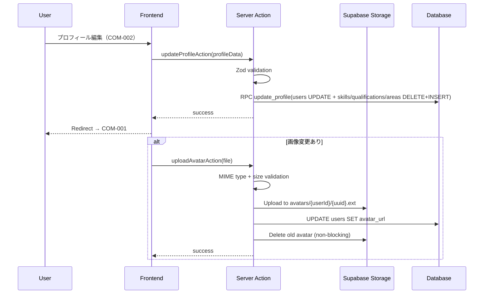
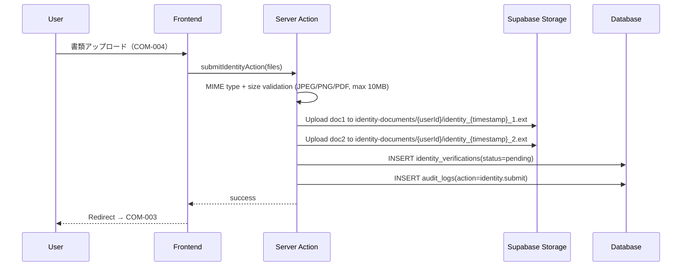
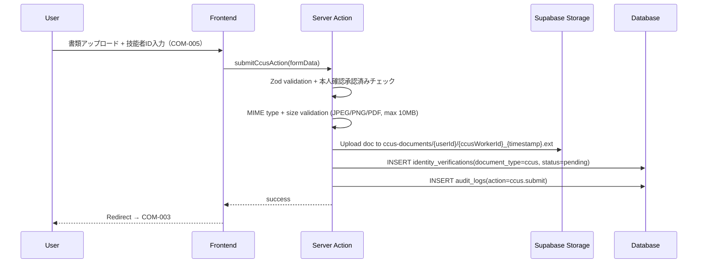
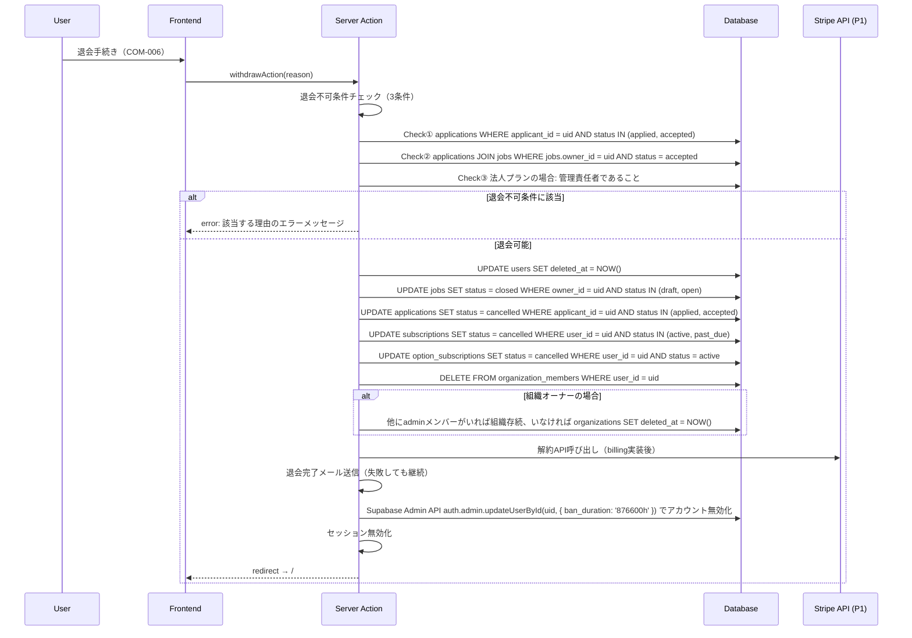
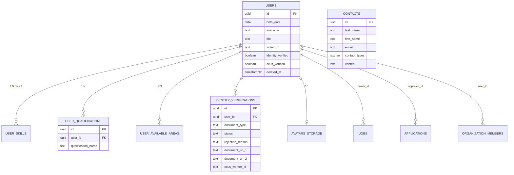

# プロフィール機能（profile）— 技術設計書

## Overview

**Purpose**: ユーザーのプロフィール管理（閲覧・編集）、本人確認・CCUS登録申請、退会手続き、静的サポートページを提供する。auth 機能で構築した認証基盤の上に、ユーザー情報管理のフルサイクルを実現する。

**Users**: 受注者（全機能）、発注者（全機能、退会は管理責任者のみ）、担当者（プロフィール閲覧・編集のみ）。

**Impact**: auth の users テーブルと関連テーブル（user_skills, user_qualifications, user_available_areas）を拡張。identity_verifications テーブルと Supabase Storage（avatars, identity-documents, ccus-documents）を新規活用。

### Goals
- プロフィール情報の閲覧・編集（画像アップロード含む）
- 本人確認・CCUS登録申請の申請・ステータス管理
- 安全な退会処理（ソフトデリート + Auth アカウント無効化 + セッション無効化）
- 静的サポートページ（FAQ、お問い合わせ、利用規約等）

### Non-Goals
- 本人確認の承認・否認（admin spec で実装）
- 他ユーザーのプロフィール閲覧（公開プロフィール — job-search / user-search spec で実装）
- Stripe サブスクリプション管理（billing spec で実装）
- メールアドレスの部分マスク表示（他ユーザー向けの PII 保護。公開プロフィール表示時に job-search / user-search spec で実装）

## Architecture

### Architecture Pattern & Boundary Map

```mermaid
graph TB
    subgraph AuthenticatedPages
        ProfileDetail[COM-001 Profile Detail]
        ProfileEdit[COM-002 Profile Edit]
        VerificationTop[COM-003 Verification Top]
        IdentityUpload[COM-004 Identity Upload]
        CcusUpload[COM-005 CCUS Upload]
        Withdrawal[COM-006 Withdrawal]
    end

    subgraph PublicPages
        FAQ[COM-007 FAQ]
        Contact[COM-008 Contact]
        Terms[COM-009 Terms]
        Privacy[COM-010 Privacy]
        Legal[COM-011 Legal]
    end

    subgraph ServerActions
        UpdateProfileAction[updateProfileAction]
        UploadAvatarAction[uploadAvatarAction]
        SubmitIdentityAction[submitIdentityAction]
        SubmitCcusAction[submitCcusAction]
        WithdrawAction[withdrawAction]
        ContactAction[submitContactAction]
    end

    subgraph Storage
        Avatars[avatars bucket]
        IdentityDocs[identity-documents bucket]
        CcusDocs[ccus-documents bucket]
    end

    subgraph Database
        Users[public.users]
        Skills[user_skills]
        Qualifications[user_qualifications]
        Areas[user_available_areas]
        Verifications[identity_verifications]
        Contacts[contacts]
        AuditLogs[audit_logs]
        Jobs[jobs]
        Applications[applications]
        Subscriptions[subscriptions]
        OptionSubs[option_subscriptions]
        OrgMembers[organization_members]
    end

    ProfileEdit --> UpdateProfileAction
    ProfileEdit --> UploadAvatarAction
    UploadAvatarAction --> Avatars
    IdentityUpload --> SubmitIdentityAction
    SubmitIdentityAction --> IdentityDocs
    SubmitIdentityAction --> Verifications
    CcusUpload --> SubmitCcusAction
    SubmitCcusAction --> CcusDocs
    SubmitCcusAction --> Verifications
    Withdrawal --> WithdrawAction
    WithdrawAction --> Users
    WithdrawAction --> Jobs
    WithdrawAction --> Applications
    WithdrawAction --> Subscriptions
    WithdrawAction --> OptionSubs
    WithdrawAction --> OrgMembers
    Contact --> ContactAction
    ContactAction --> Contacts
    UpdateProfileAction --> Users
    UpdateProfileAction --> Skills
    UpdateProfileAction --> Qualifications
    UpdateProfileAction --> Areas
```



**Architecture Integration**:
- Selected pattern: Server Actions + RSC（auth と同一パターン）
- Domain boundaries: プロフィール CRUD（Server Actions → DB）、ファイルアップロード（Server Actions → Storage）、本人確認申請（Server Actions → Storage + DB）
- Existing patterns preserved: ActionResult 型、Zod バリデーション、createClient ヘルパー
- Steering compliance: 三重防御（Middleware + Server Action + RLS）、メール送信失敗時の非ロールバック方針

### Technology Stack

| Layer | Choice / Version | Role in Feature | Notes |
|-------|------------------|-----------------|-------|
| Frontend | Next.js App Router + React | プロフィール画面の Server/Client Components | shadcn/ui でフォーム UI |
| Form | React Hook Form + Zod | フォームバリデーション | auth と同一パターン |
| Storage | Supabase Storage | 画像・書類ファイルの保管 | 3バケット使用 |
| Database | PostgreSQL（Supabase） | ユーザーデータ・申請データ永続化 | RLS 有効 |
| Email | Resend | 退会完了メール | 送信失敗時は非ロールバック |

## System Flows

### プロフィール編集フロー



### 本人確認申請フロー



### CCUS登録申請フロー



### 退会フロー



## Requirements Traceability

| Requirement | Summary | Components | Interfaces | Flows |
|-------------|---------|------------|------------|-------|
| 1.1 (REQ-PF-001) | プロフィール詳細 | ProfileDetailPage | — | — |
| 2.1 (REQ-PF-002) | プロフィール編集 | ProfileEditPage, updateProfileAction, uploadAvatarAction, update_profile RPC | ProfileEditSchema, ActionResult | プロフィール編集フロー |
| 3.1 (REQ-PF-003) | 本人確認トップ | VerificationTopPage | — | — |
| 4.1 (REQ-PF-004) | 本人確認書類送付 | IdentityUploadPage, submitIdentityAction | IdentityUploadSchema, ActionResult | 本人確認申請フロー |
| 5.1 (REQ-PF-005) | CCUS登録申請 | CcusUploadPage, submitCcusAction | CcusUploadSchema, ActionResult | — |
| 6.1 (REQ-PF-006) | 退会手続き | WithdrawalPage, withdrawAction | WithdrawalSchema, ActionResult | 退会フロー |
| 7.1 (REQ-PF-007) | よくある質問 | FaqPage | — | — |
| 8.1 (REQ-PF-008) | お問い合わせ | ContactPage, submitContactAction | ContactSchema, ActionResult | — |
| 9.1 (REQ-PF-009) | 利用規約 | TermsPage | — | — |
| 10.1 (REQ-PF-010) | プライバシーポリシー | PrivacyPage | — | — |
| 11.1 (REQ-PF-011) | 特定商取引法 | LegalPage | — | — |

## Components and Interfaces

| Component | Domain/Layer | Intent | Req Coverage | Key Dependencies | Contracts |
|-----------|--------------|--------|--------------|------------------|-----------|
| ProfileDetailPage | UI/Profile | プロフィール情報表示（birth_date から年齢を算出して表示） | 1.1 | Supabase DB (P0) | — |
| ProfileEditPage | UI/Profile | プロフィール編集フォーム | 2.1 | updateProfileAction (P0), uploadAvatarAction (P1) | — |
| UpdateProfileAction | Action/Profile | プロフィール情報更新 | 2.1 | Supabase DB RPC (P0) | Service |
| UploadAvatarAction | Action/Profile | プロフィール画像アップロード | 2.1 | Supabase Storage (P0) | Service |
| VerificationTopPage | UI/Profile | 本人確認・CCUSステータス表示 | 3.1 | Supabase DB (P0) | — |
| IdentityUploadPage | UI/Profile | 本人確認書類アップロード | 4.1 | submitIdentityAction (P0) | — |
| SubmitIdentityAction | Action/Profile | 本人確認申請処理 | 4.1 | Supabase Storage + DB (P0) | Service |
| CcusUploadPage | UI/Profile | CCUS書類アップロード | 5.1 | submitCcusAction (P0) | — |
| SubmitCcusAction | Action/Profile | CCUS登録申請処理 | 5.1 | Supabase Storage + DB (P0) | Service |
| WithdrawalPage | UI/Profile | 退会手続きフォーム | 6.1 | withdrawAction (P0) | — |
| WithdrawAction | Action/Profile | 退会処理 | 6.1 | Supabase DB (P0), Resend (P2) | Service |
| FaqPage | UI/Support | よくある質問 | 7.1 | — | — |
| ContactPage | UI/Support | お問い合わせフォーム | 8.1 | submitContactAction (P0) | — |
| SubmitContactAction | Action/Support | お問い合わせ送信（認証不要） | 8.1 | Supabase DB (P0) | Service |
| TermsPage | UI/Support | 利用規約 | 9.1 | — | — |
| PrivacyPage | UI/Support | プライバシーポリシー | 10.1 | — | — |
| LegalPage | UI/Support | 特定商取引法 | 11.1 | — | — |

### Server Actions Layer

#### UpdateProfileAction

| Field | Detail |
|-------|--------|
| Intent | プロフィール情報の一括更新（users + skills + qualifications + areas） |
| Requirements | 2.1 |

**Responsibilities & Constraints**
- 認証チェック: セッションからユーザー ID を取得
- Zod バリデーション（全フィールド）
- PostgreSQL 関数 `update_profile` を RPC で呼び出し、トランザクション内で4テーブルを更新
- メールアドレス変更: Supabase Auth の `updateUser({ email })` を呼び出し、認証メールを送信

**Dependencies**
- External: Supabase DB RPC `update_profile` (P0)
- External: Supabase Auth `updateUser` — メールアドレス変更時 (P1)

**Contracts**: Service [x]

##### Service Interface
```typescript
// src/app/(authenticated)/profile/edit/actions.ts

interface ProfileEditInput {
  lastName: string;
  firstName: string;
  gender: string;
  email?: string;
  prefecture: string;
  companyName?: string;
  bio?: string;
  skills: Array<{ tradeType: string; experienceYears: number }>;
  qualifications: string[];
  availableAreas: string[];
}

function updateProfileAction(input: ProfileEditInput): Promise<ActionResult>;
```
- Preconditions: ユーザーが認証済み
- Postconditions: users, user_skills, user_qualifications, user_available_areas が更新される
- Invariants: メールアドレス変更時は Supabase Auth の認証フローを経由する

**「スキル」フィールドに関する設計判断**:

REQ-PF-002 では「職種」「資格」とは別に「スキル（任意、追加可能）」を記載しているが、現行の database-schema.md にはスキル専用テーブルが存在しない。現時点では以下の方針とする:

1. 「スキル」は user_qualifications テーブルの qualification_name カラムで管理する（資格とスキルを同一テーブルで扱う）
2. UI 上では「資格・スキル」として1つのセクションにまとめ、自由入力 + 選択肢の併用とする
3. 将来、検索・マッチングで職種とスキルを厳密に区別する必要が出た場合は、user_skills テーブルに skill_tags カラムを追加するか、専用テーブル（user_skill_tags）を新設する
4. この判断は MVP スコープの簡素化を優先しており、データ移行が必要になった場合のコストは低い（qualification_name のデータを新テーブルに移すだけ）

#### UploadAvatarAction

| Field | Detail |
|-------|--------|
| Intent | プロフィール画像のアップロード + DB 更新 |
| Requirements | 2.1 |

**Contracts**: Service [x]

##### Service Interface
```typescript
// src/app/(authenticated)/profile/edit/actions.ts

function uploadAvatarAction(formData: FormData): Promise<ActionResult<{ avatarUrl: string }>>;
```
- Preconditions: ファイルが JPEG/PNG、最大5MB
- Postconditions: avatars バケットにファイルが保存され、users.avatar_url が更新される。旧画像は削除される（失敗時はログ記録のみ）

#### SubmitIdentityAction

| Field | Detail |
|-------|--------|
| Intent | 本人確認書類のアップロード + 申請レコード作成 |
| Requirements | 4.1 |

**Contracts**: Service [x]

##### Service Interface
```typescript
// src/app/(authenticated)/profile/verification/identity/actions.ts

function submitIdentityAction(formData: FormData): Promise<ActionResult>;
```
- Preconditions: ファイル2点が JPEG/PNG/PDF、各最大10MB。pending 状態の申請がないこと
- Postconditions: identity-documents バケットにファイルが保存され、identity_verifications に新規レコードが INSERT される（再提出時も新規 INSERT。既存の rejected レコードは履歴として残す）。audit_logs に記録

#### SubmitCcusAction

| Field | Detail |
|-------|--------|
| Intent | CCUS書類のアップロード + 申請レコード作成 |
| Requirements | 5.1 |

**Contracts**: Service [x]

##### Service Interface
```typescript
// src/app/(authenticated)/profile/verification/ccus/actions.ts

function submitCcusAction(formData: FormData): Promise<ActionResult>;
```
- Preconditions: 本人確認が承認済み。ファイルが JPEG/PNG/PDF、最大10MB。CCUS技能者IDが入力済み
- Postconditions: ccus-documents バケットに `ccus-documents/{userId}/{ccusWorkerId}_{timestamp}.ext` のパス形式でファイルが保存され、identity_verifications にレコードが作成される（再提出時も新規 INSERT）。audit_logs に記録（本人確認と同様、書類提出の監査証跡）

#### WithdrawAction

| Field | Detail |
|-------|--------|
| Intent | 退会処理（ソフトデリート + Auth アカウント無効化 + セッション無効化） |
| Requirements | 6.1 |

**Contracts**: Service [x]

##### Service Interface
```typescript
// src/app/(authenticated)/profile/withdrawal/actions.ts

interface WithdrawalInput {
  reason: string;
  details?: string;
  confirmed: boolean;
}

function withdrawAction(input: WithdrawalInput): Promise<ActionResult>;
```
- Preconditions:
  - Check①: 応募者として進行中の案件がないこと（applications WHERE applicant_id = userId AND status IN ('applied', 'accepted')）
  - Check②: 発注者として進行中の案件がないこと（applications INNER JOIN jobs ON jobs.id = applications.job_id WHERE jobs.owner_id = userId AND applications.status = 'accepted'）
  - Check③: 法人プランの場合は管理責任者（org_role = 'owner'）であること（担当者・組織管理者は退会不可）
  - confirmed = true
- Postconditions:（database-schema.md「ユーザーソフトデリート時の連鎖処理ルール」に準拠）
  - 1. users.deleted_at にタイムスタンプが設定される
  - 2. jobs.status = 'closed' に更新される（owner_id = userId AND status IN ('draft', 'open') の案件）
  - 3. applications.status = 'cancelled' に更新される（applicant_id = userId AND status IN ('applied', 'accepted') の応募）
  - 4. subscriptions.status = 'cancelled' に更新される（user_id = userId AND status IN ('active', 'past_due')）
  - 5. option_subscriptions.status = 'cancelled' に更新される（user_id = userId AND status = 'active'）
  - 6. organization_members から物理削除される（DELETE FROM organization_members WHERE user_id = userId）※ このテーブルに deleted_at カラムは存在しない
  - 7. 組織オーナーの場合: 他に admin メンバーがいれば組織存続、いなければ organizations.deleted_at を設定
  - 8. Stripe 解約 API が呼び出される（billing 実装後）
  - 9. 退会完了メールが送信される（失敗時は非ロールバック）
  - 10. Supabase Admin API（auth.admin.updateUserById(uid, { ban_duration: '876600h' })）で auth.users のアカウントが無効化（ban）される。これにより deleted_at 設定後の再ログインを確実に防止する
  - 11. セッションが無効化される
  - 注意: user_skills, user_qualifications, user_available_areas, favorites, available_schedules, identity_verifications はそのまま残す（RLS の deleted_at IS NULL 条件により他ユーザーからは自動的に非表示）

#### SubmitContactAction

| Field | Detail |
|-------|--------|
| Intent | お問い合わせフォーム送信（認証不要） |
| Requirements | 8.1 |

**Responsibilities & Constraints**
- 認証チェックをスキップする（未認証ユーザーからの送信を許可）
- Supabase クライアントは service_role ではなく anon key を使用する（contacts テーブルの RLS で anon + authenticated の INSERT を許可済み）
- Zod バリデーション後に contacts テーブルに INSERT
- スパム対策: IP ベースのレート制限（同一 IP から短時間に大量送信を防止）。実装は Middleware または Server Action 内で IP ごとの送信回数をチェックする（例: 同一 IP から1時間に5件まで）

**Contracts**: Service [x]

##### Service Interface
```typescript
// src/app/(support)/contact/actions.ts

interface ContactInput {
  lastName: string;
  firstName: string;
  email: string;
  contactTypes: string[];
  content: string;
}

function submitContactAction(input: ContactInput): Promise<ActionResult>;
```
- Preconditions: 全必須フィールドが入力済み。認証は不要
- Postconditions: contacts テーブルにレコードが作成される。送信成功時は画面上に完了メッセージを表示する

### UI Layer（Summary-only）

| Component | File Path | Notes |
|-----------|-----------|-------|
| ProfileDetailPage | `src/app/(authenticated)/profile/page.tsx` | Server Component。users + skills + qualifications + areas を JOIN 取得。video_url が存在し動画掲載オプションが有効な場合は PR 動画を表示。ページ下部に「退会する」リンク（→ COM-006）を配置 |
| ProfileEditPage | `src/app/(authenticated)/profile/edit/page.tsx` | Client Component。画像アップロード + フォーム |
| VerificationTopPage | `src/app/(authenticated)/profile/verification/page.tsx` | Server Component。identity_verifications の最新ステータスをバッジで表示。否認時は rejection_reason をアラートボックスで表示し「再提出する」ボタンを表示。「本人確認書類を提出する」ボタンは未申請/否認時のみ活性。「CCUS登録申請する」ボタンは本人確認承認済みの場合のみ活性 |
| IdentityUploadPage | `src/app/(authenticated)/profile/verification/identity/page.tsx` | Client Component。ファイル2点アップロード |
| CcusUploadPage | `src/app/(authenticated)/profile/verification/ccus/page.tsx` | Client Component。ファイル1点 + 技能者ID入力 |
| WithdrawalPage | `src/app/(authenticated)/profile/withdrawal/page.tsx` | Client Component。退会理由 + 確認ダイアログ |
| FaqPage | `src/app/(support)/faq/page.tsx` | Server Component。アコーディオン UI。認証不要（ログイン前後両方からアクセス可） |
| ContactPage | `src/app/(support)/contact/page.tsx` | Client Component。お問い合わせフォーム。認証不要ページ |
| TermsPage | `src/app/(support)/terms/page.tsx` | Server Component。静的テキスト。認証不要（ログイン前後両方からアクセス可） |
| PrivacyPage | `src/app/(support)/privacy/page.tsx` | Server Component。静的テキスト。認証不要（ログイン前後両方からアクセス可） |
| LegalPage | `src/app/(support)/legal/page.tsx` | Server Component。静的テキスト。認証不要（ログイン前後両方からアクセス可） |

## Data Models

### Domain Model



### Physical Data Model

既存のマイグレーション（001〜006）のテーブルを使用。追加が必要なのは `update_profile` PostgreSQL 関数のみ。

```sql
-- 新規マイグレーション: update_profile 関数
CREATE OR REPLACE FUNCTION update_profile(
  p_user_id uuid,
  p_last_name text,
  p_first_name text,
  p_gender text,
  p_prefecture text,
  p_company_name text DEFAULT NULL,
  p_bio text DEFAULT NULL,
  p_skills jsonb DEFAULT '[]'::jsonb,
  p_qualifications text[] DEFAULT '{}'::text[],
  p_areas text[] DEFAULT '{}'::text[]
) RETURNS void AS $$
BEGIN
  -- [修正①] 本人確認: RPC を直接呼ばれた場合の不正アクセスを防止
  IF p_user_id != auth.uid() THEN
    RAISE EXCEPTION 'Unauthorized: user_id does not match authenticated user';
  END IF;

  -- Update users (updated_at は set_updated_at トリガーが自動設定)
  UPDATE public.users SET
    last_name = p_last_name,
    first_name = p_first_name,
    gender = p_gender,
    prefecture = p_prefecture,
    company_name = p_company_name,
    bio = p_bio
  WHERE id = p_user_id;

  -- Replace skills (delete all + insert new)
  DELETE FROM public.user_skills WHERE user_id = p_user_id;
  INSERT INTO public.user_skills (id, user_id, trade_type, experience_years)
  SELECT
    gen_random_uuid(),
    p_user_id,
    (skill->>'trade_type')::text,
    (skill->>'experience_years')::integer
  FROM jsonb_array_elements(p_skills) AS skill
  LIMIT 3;

  -- Replace qualifications
  DELETE FROM public.user_qualifications WHERE user_id = p_user_id;
  INSERT INTO public.user_qualifications (id, user_id, qualification_name)
  SELECT gen_random_uuid(), p_user_id, unnest(p_qualifications);

  -- Replace available areas
  DELETE FROM public.user_available_areas WHERE user_id = p_user_id;
  INSERT INTO public.user_available_areas (id, user_id, prefecture)
  SELECT gen_random_uuid(), p_user_id, unnest(p_areas);
END;
$$ LANGUAGE plpgsql SECURITY DEFINER;
```

### Data Contracts

**Zod Validation Schemas**:

```typescript
// src/lib/validations/profile.ts

const skillSchema = z.object({
  tradeType: z.string().min(1, "職種を選択してください"),
  experienceYears: z.number().int().min(0, "経験年数を入力してください"),
});

export const profileEditSchema = z.object({
  lastName: z.string().min(1, "姓を入力してください"),
  firstName: z.string().min(1, "名を入力してください"),
  gender: z.string().min(1, "性別を選択してください"),
  email: z.string().email("正しいメールアドレスを入力してください").optional(),
  prefecture: z.string().min(1, "都道府県を選択してください"),
  companyName: z.string().optional(),
  bio: z.string().optional(),
  skills: z.array(skillSchema).min(1).max(3),
  qualifications: z.array(z.string()).optional().default([]),
  availableAreas: z.array(z.string()).min(1, "対応エリアを1つ以上選択してください"),
});

const ALLOWED_DOCUMENT_MIME_TYPES = ["image/jpeg", "image/png", "application/pdf"] as const;
const ALLOWED_AVATAR_MIME_TYPES = ["image/jpeg", "image/png"] as const;

const documentFileSchema = z.instanceof(File)
  .refine(f => f.size <= 10_000_000, "ファイルサイズは10MB以下にしてください")
  .refine(
    f => (ALLOWED_DOCUMENT_MIME_TYPES as readonly string[]).includes(f.type),
    "JPEG、PNG、PDF形式のファイルをアップロードしてください"
  );

export const identityUploadSchema = z.object({
  document1: documentFileSchema,
  document2: documentFileSchema,
});

export const ccusUploadSchema = z.object({
  document: documentFileSchema,
  ccusWorkerId: z.string().min(1, "CCUS技能者IDを入力してください"),
});

export const withdrawalSchema = z.object({
  reason: z.string().min(1, "退会理由を選択してください"),
  details: z.string().optional(),
  confirmed: z.literal(true, { message: "同意チェックが必要です" }),
});

export const contactSchema = z.object({
  lastName: z.string().min(1, "姓を入力してください"),
  firstName: z.string().min(1, "名を入力してください"),
  email: z.string().email("正しいメールアドレスを入力してください"),
  contactTypes: z.array(z.string()).min(1, "お問い合わせ項目を選択してください"),
  content: z.string().min(1, "内容を入力してください"),
});
```

## Error Handling

### Error Categories and Responses

**User Errors**:
- 無効なフォーム入力 → Zod バリデーションエラー（フィールドごと日本語メッセージ）
- 退会不可条件（応募者として進行中案件あり）→ 「応募中または進行中の案件があるため退会できません。応募の取り下げまたは完了後に再度お試しください」
- 退会不可条件（発注者として進行中案件あり）→ 「受注者が作業中の案件があるため退会できません。案件の完了後に再度お試しください」
- 退会不可条件（法人プラン非オーナー）→ 「法人プランの管理責任者のみ退会手続きが可能です。管理責任者にお問い合わせください」
- ファイル形式不正 → 「JPEG、PNG、PDF形式のファイルをアップロードしてください」
- ファイルサイズ超過 → 「ファイルサイズは10MB以下にしてください」

**System Errors**:
- Storage アップロード失敗 → ログ記録 + 「アップロードに失敗しました。しばらくしてから再度お試しください」
- 旧画像削除失敗 → ログ記録のみ（エラーをユーザーに見せない）
- メール送信失敗 → ログ記録のみ（退会処理はロールバックしない）

## Testing Strategy

### Unit Tests（中リスク: データ書き込みあり）
- Zod バリデーションスキーマのテスト（profileEditSchema, withdrawalSchema, contactSchema）
- ファイルバリデーション（MIMEタイプ、サイズ制限）
- 退会不可条件の判定ロジックテスト（応募者として/発注者として/法人プランの3パターン）
- birth_date からの年齢算出ロジックのテスト（誕生日前後の境界値テスト含む）

### Integration Tests（高リスク: ファイルアップロード + 権限）
- RLS: 自分の identity_verifications のみ INSERT/SELECT 可能
- RLS: 他ユーザーの users レコードを UPDATE できないこと
- `update_profile` RPC のトランザクションテスト
- `update_profile` RPC に他ユーザーの user_id を渡した場合にエラーになること（セキュリティテスト）
- 退会カスケードの統合テスト（users, jobs, applications, subscriptions, option_subscriptions, organization_members の各テーブルが正しく更新されること）
- 退会不可条件テスト（応募者として進行中 / 発注者として進行中 / 法人プランの非オーナー）
- お問い合わせの非認証送信テスト（anon ユーザーが contacts に INSERT できること）
- メールアドレス変更テスト（Supabase Auth の updateUser が呼び出されること）

## Security Considerations

- **ファイルアップロード**: MIMEタイプ + 拡張子の両方を Server Action で検証（security.md 準拠）。ファイル名は UUID に変換
- **非公開バケット**: identity-documents, ccus-documents は RLS で本人 + 管理者のみアクセス可
- **公開バケット**: avatars は公開読み取り可。アップロードは本人のみ
- **退会処理**: ソフトデリート + カスケード処理（database-schema.md「ユーザーソフトデリート時の連鎖処理ルール」に準拠）+ Supabase Admin API で auth.users アカウントを無効化（ban）+ セッション無効化。auth.users レコード自体は保持（auth.uid() ↔ public.users.id の参照整合性を維持するため）。display-name.ts で「退会済みユーザー」として表示
- **`update_profile` の SECURITY DEFINER**: complete_registration と同じ理由。4テーブル跨ぎのトランザクションで RLS バイパスが必要。入力検証は Server Action 側で実施。関数内で auth.uid() との一致を検証し、不正な user_id での呼び出しを拒否する
- **お問い合わせ（contacts）**: 未認証ユーザーからの INSERT を許可（RLS で anon + authenticated の INSERT を許可済み）
- **監査ログ**: 本人確認書類・CCUS書類の提出を audit_logs に記録
- **お問い合わせスパム対策**: 未認証ユーザーからの送信を許可しているため、IP ベースのレート制限で大量送信を防止
