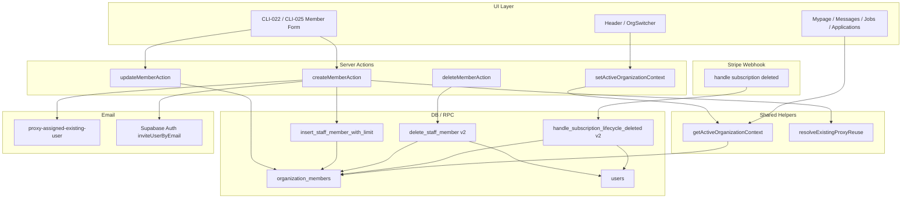
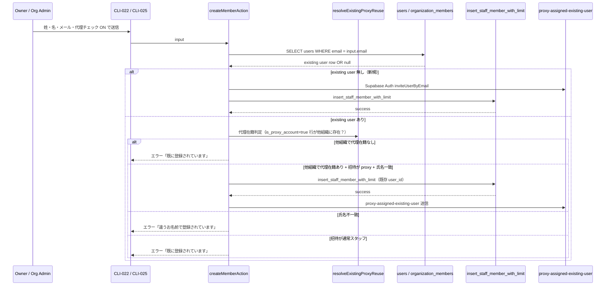
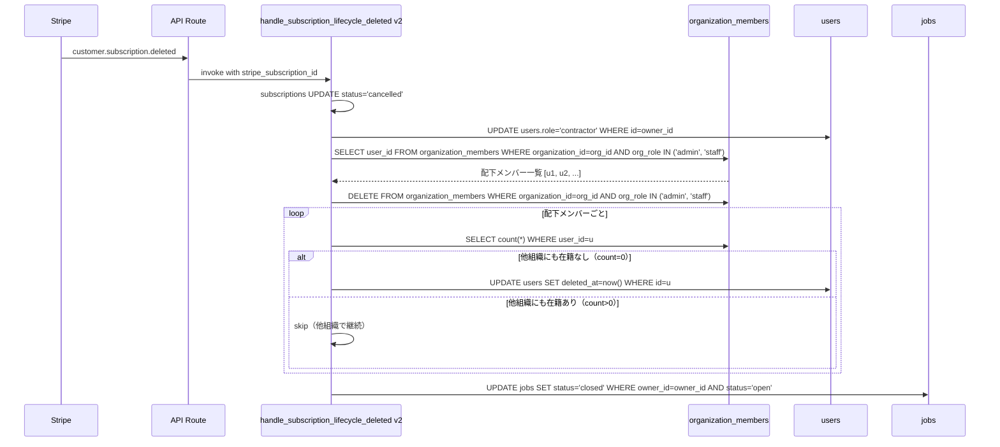
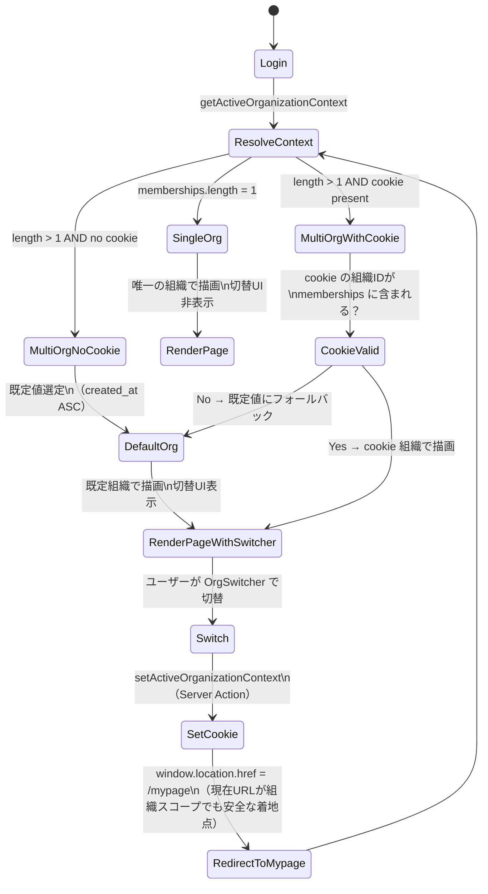
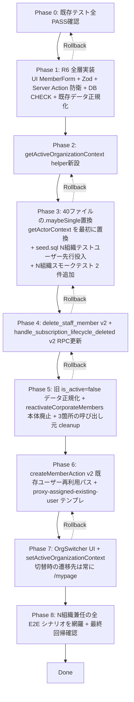

# Technical Design — proxy-account-multi-org-support

## Overview

**Purpose**: 1 名のビジ友運営スタッフが複数法人の代理アカウントを兼任できるように、招待・削除・解約・組織コンテキストの主要パスを改修する。

**Users**: 法人プランの Owner / Org Admin（代理スタッフの招待・削除を実施）と、ビジ友運営スタッフ（N 組織の代理として日常業務を遂行）が直接の利用者。間接的には全ロールが影響を受ける（メッセージ・案件表示の組織コンテキスト切替）。

**Impact**: 「Staff は 1 組織」を暗黙前提とする 40 ファイル超のクエリパターンを共通ヘルパー経由に集中化する。R3（CLI 削除）と R4（解約）を「`organization_members` 行削除」で統一し、`users.is_active = false` による法人プラン凍結ロジックは廃止する。

### Goals

- 同一 `users.id` が複数 `organization_members` 行を保持し、各組織で独立した代理として機能する（R1）
- 既存ユーザー再利用パスで「メール重複」「氏名不一致」「代理 + admin 組み合わせ」を多層防衛で遮断（R2, R6）
- 解約・削除時の権限失効を「行削除統一」で単純化（R3, R4）
- N 組織兼任スタッフのログイン後 UI に組織コンテキスト切替を提供（R7）
- 既存単一組織データへの影響をゼロに保つ（R1-4, R9）

### Non-Goals

- admin アカウント追加 UI（招待 / 一覧 / 編集）の新規実装は対象外（R10、SQL 運用維持）
- メール通知の最終文面確定は notifications spec §5.6 / §5.7 で本 spec 完了後に実施（R12）
- 代理スタッフの引き継ぎ用「名前 / メアド上書き機能」は対象外（Out of Scope）
- `users.role` enum のマルチロール化は対象外
- 代理メッセージ通数（年36通 / 年300通）のシステム制御は対象外（運用管理）

## Architecture

### Existing Architecture Analysis

- **暗黙の「1 組織前提」**: `.from("organization_members").select("organization_id").eq("user_id", user.id).maybeSingle()` パターンが mypage / messages / jobs / applications / client-profile / members / admin の 40 ファイルに散在。Staff は 1 組織との前提のため、N 組織化すると全箇所で「どの組織のコンテキストか」が曖昧化する
- **クリティカルパス: `getActorContext`**: `src/app/(authenticated)/mypage/members/actions.ts:24-51` の内部ヘルパー `getActorContext` が **member-form 機能の 4 Server Action（create / update / delete / resend）すべてで共通利用** されている。N 組織化対応では、この `getActorContext` の `.maybeSingle()` パターン置換を **Phase 3 の最優先（最初に着手すべきファイル）** として扱う。1 ファイルでの修正で 4 つの Server Action 全てが新しいコンテキスト解決に乗るため、影響範囲が広い割に作業効率が高い。逆に置換漏れがあると member-form 全体が壊れるため早期検証が必須
- **既存の RPC 集中化方針**: 担当者追加（`insert_staff_member_with_limit`）と削除（`delete_staff_member`）が SECURITY DEFINER RPC として実装済。Webhook 経由の解約処理（`handle_subscription_lifecycle_deleted`）も RPC。今回の修正はこれら既存 RPC の挙動拡張を中心とする
- **法人プラン凍結 / 再加入**: 解約時に `users.is_active = false` を一括セットし、再加入時に `reactivateCorporateMembers` で一括 `true` に戻す対称ロジック。これを「行削除」で代替するため、`reactivateCorporateMembers` は廃止する
- **代理アカウント設計**: `organization_members.is_proxy_account` フラグ。送信者の代理判定 → メッセージ `is_proxy = true` 自動設定（受注者には透明化、発注者には「代理」バッジ表示）

### Architecture Pattern & Boundary Map



**Architecture Integration**:
- Selected pattern: **Helper-Centralized Refactor + Layered Defense**（共通ヘルパー集中化 + 多層防衛）
- Domain boundaries: 組織コンテキスト解決は `src/lib/organization/` 配下の Helper 層に集約。Member 管理ロジックは既存 `mypage/members/actions.ts` / SECURITY DEFINER RPC に閉じる
- Existing patterns preserved: RPC atomicity（`FOR UPDATE` ロック）、Server Action `ActionResult` 型、Resend テンプレート構造、Supabase RLS による行レベルアクセス制御
- New components rationale:
  - `getActiveOrganizationContext` ヘルパー: 40 ファイルに散在する `.maybeSingle()` パターンを 1 箇所に集約
  - `OrgSwitcher` UI: N 組織兼任スタッフ専用、単一組織ユーザーには非表示
  - `proxy-assigned-existing-user` メールテンプレ: 既存ユーザー再利用パス専用通知
- Steering compliance: `tech.md`（RSC + Server Actions + Resend）、`security.md`（Middleware + Server Action + RLS の三重防御）、`structure.md`（`src/lib/` 配下のドメイン別配置）

### Technology Stack

| Layer | Choice / Version | Role in Feature | Notes |
|---|---|---|---|
| Frontend | Next.js App Router + React Server Components | OrgSwitcher / マイページ等の UI 層 | 既存スタックそのまま |
| Backend | Next.js Server Actions | createMember / deleteMember / setActiveOrg 等 | `ActionResult` 型継承 |
| Data | Supabase Postgres + RLS | `organization_members` の CHECK 制約追加、SECURITY DEFINER RPC 拡張 | 新規テーブルなし |
| Cookie | Next.js `cookies()` API + HTTP-only Cookie `bizyu_active_org` | 組織コンテキスト永続化 | SameSite=Lax、`__Host-` prefix は単一ドメイン運用のため不要 |
| Email | Resend + React Email | `proxy-assigned-existing-user` 新規テンプレ | 既存 `src/lib/email/` 配下 |
| Webhook | Stripe → Next.js API Route → RPC | 解約時の行削除実行 | `handle_subscription_lifecycle_deleted` v2 |

詳細な技術選定根拠は `research.md` の「Architecture Pattern Evaluation」セクション参照。

## System Flows

### Flow 1: 既存ユーザー再利用パス（招待）



### Flow 2: 法人プラン解約時の行削除（R4）



### Flow 3: N 組織兼任スタッフの組織コンテキスト切替（R7）



**Flow 3 の重要な決定**:
- 切替成功後の遷移先は **常に `/mypage`** に固定する。現在 URL（例: `/jobs/[id]/applicants`、`/applications/orders/[id]`）が切替前組織のリソースだった場合、同 URL のままリロードすると新組織で権限エラーや 404 になるため、組織非依存のマイページに統一する
- 同一 URL リロード方式は採用しない。マイページ着地で UX を安定化する

## Requirements Traceability

| Requirement | Summary | Components | Interfaces | Flows |
|---|---|---|---|---|
| 1.1, 1.2, 1.3, 1.4 | N 法人兼任 schema 許容 | DB（既存 `organization_members`） | `(organization_id, user_id)` 複合 UNIQUE | — |
| 2.1, 2.4, 2.5, 2.6 | 既存ユーザー再利用パス | `createMemberAction`, `resolveExistingProxyReuse` | Server Action / Helper | Flow 1 |
| 2.2, 2.3 | 拒否分岐（既存非代理 / 通常スタッフ招待） | `createMemberAction` | Server Action | Flow 1 |
| 2.7, 2.8 | 氏名突合 + プライバシー | `createMemberAction` | Server Action | Flow 1 |
| 3.1, 3.2, 3.3, 3.4 | 削除スコープ | `delete_staff_member` v2 RPC | RPC | Flow 2 と同様 |
| 4.1-4.9 | 解約時の行削除 + 移行 | `handle_subscription_lifecycle_deleted` v2 RPC + Migration | RPC + Migration Script | Flow 2 |
| 5.1, 5.2, 5.3 | 組織内代理一意性 | `insert_staff_member_with_limit`（既存）+ `organization_members_proxy_unique` 部分 UNIQUE | RPC / Index | — |
| 6.1, 6.2, 6.7 | UI 制約（代理 + admin 禁止） | `member-form.tsx` | UI コンポーネント | — |
| 6.3, 6.4 | Server Action / Zod 拒否 | `createMemberAction`, `updateMemberAction`, `memberCreateSchema`, `memberUpdateSchema` | Validation / Server Action | — |
| 6.5, 6.6 | DB CHECK 制約 + 既存データ正規化 | Migration | Migration Script | — |
| 7.1-7.6 | 組織コンテキスト切替 | `OrgSwitcher`, `getActiveOrganizationContext`, `setActiveOrganizationContext`, 40 ファイル touch | UI / Helper / Server Action | Flow 3 |
| 8.1, 8.2, 8.3, 8.4 | 既存ユーザー再利用時メール | `proxy-assigned-existing-user` テンプレ + `createMemberAction` 呼び出し | Email Template | Flow 1 |
| 9.1, 9.2, 9.3, 9.4 | 通常スタッフ単一組織制限 | `createMemberAction`, `delete_staff_member` v2, `handle_subscription_lifecycle_deleted` v2 | Server Action / RPC | — |
| 10.1-10.4 | admin 関連 spec 対象外 | — | — | — |
| 11.1-11.5 | テスト網羅 | Vitest / pgTAP / Playwright | — | — |
| 12.1-12.3 | メール spec への戻し作業前提 | — | — | — |

## Components and Interfaces

### Summary Table

| Component | Domain/Layer | Intent | Req Coverage | Key Dependencies | Contracts |
|---|---|---|---|---|---|
| `getActiveOrganizationContext` | Helper / SSR | 現在組織を解決（Cookie + 既定値） | 7.1-7.6 | Supabase クライアント (P0) | Service |
| `setActiveOrganizationContext` | Server Action | Cookie 更新 + `/mypage` 遷移指示 | 7.4, 7.5 | Cookie API (P0) | Service |
| `resolveExistingProxyReuse` | Helper | 既存ユーザーが代理再利用パスに該当するか判定 | 2.1, 2.2, 2.3 | DB (P0) | Service |
| `createMemberAction` v2 | Server Action | 招待 + 既存ユーザー再利用 + 氏名突合 + 代理権限固定 | 2.1-2.8, 6.3, 9.1, 9.2 | `resolveExistingProxyReuse` (P0), RPC (P0), Email (P0) | Service |
| `updateMemberAction` v2 | Server Action | 編集時の代理権限固定 | 6.3 | DB (P0) | Service |
| `deleteMemberAction` | Server Action | CLI 経由の削除（変更なし、RPC が拡張） | 3.1-3.4 | `delete_staff_member` RPC v2 (P0) | Service |
| `delete_staff_member` v2 RPC | DB / RPC | 行削除 + 残存判定 + 条件付き `deleted_at` セット | 3.1, 3.2, 3.3, 9.3 | `organization_members`, `users`, `scout_templates` (P0) | Service |
| `handle_subscription_lifecycle_deleted` v2 RPC | DB / RPC | 解約時に配下メンバーの行削除 + 残存判定 | 4.1-4.5, 4.7, 9.4 | `organization_members`, `users`, `jobs`, `subscriptions` (P0) | Service |
| `OrgSwitcher` | UI | 組織選択ドロップダウン | 7.2, 7.3 | `getActiveOrganizationContext`, `setActiveOrganizationContext` (P0) | UI |
| `MemberForm` v2 | UI | 代理 ON 時の権限固定 + admin オプション非表示 | 6.1, 6.2, 6.7 | `memberCreateSchema` v2 (P0) | UI |
| `memberCreateSchema` v2 / `memberUpdateSchema` v2 | Validation | 代理 + admin 拒否 | 6.4 | Zod (P0) | Validation |
| `proxy-assigned-existing-user` | Email Template | 既存ユーザー再利用時の通知メール | 8.1, 8.2 | Resend / React Email (P0) | Email |
| Migration `r6_proxy_admin_full_defense.sql` | DB | R6 既存データ正規化 + CHECK 制約追加（UI / Zod / Server Action と同 Phase で投入） | 6.5, 6.6 | `organization_members` (P0) | Migration |
| Migration `lifecycle_v2_data_migration.sql` | DB | 旧 `is_active=false` データを `deleted_at` + 行削除に正規化 | 4.9 | `users`, `organization_members` (P0) | Migration |

### Helper Layer

#### `getActiveOrganizationContext`

| Field | Detail |
|---|---|
| Intent | 現在組織コンテキストを Cookie + 既定値ロジックで解決し、SSR / RSC / Server Action で共通利用 |
| Requirements | 7.1, 7.2, 7.3, 7.4, 7.5, 7.6, 1.3 |

**Responsibilities & Constraints**
- ユーザーの全 `organization_members` を 1 回の SELECT で取得
- Cookie `bizyu_active_org` の組織 ID が memberships に含まれていれば採用
- 単一組織の場合は Cookie を無視して唯一の組織を返す（既存挙動と等価）
- N 組織で Cookie 未設定 / 無効の場合は `created_at ASC` で最古の組織を既定とする
- 組織未所属の場合は `null` を返す（呼び出し側で type レベルでハンドリング強制）

**Dependencies**
- Inbound: 40 ファイル超の RSC / Server Action / Page（P0）
- Outbound: Supabase `organization_members` SELECT（P0）、Next.js `cookies()` API（P0）
- External: なし

**Contracts**: Service [x] / API [ ] / Event [ ] / Batch [ ] / State [ ]

##### Service Interface

```typescript
export interface ActiveOrgContext {
  organizationId: string;
  orgRole: 'owner' | 'admin' | 'staff';
  isProxyAccount: boolean;
  orgOwnerId: string;
  isCorporate: boolean;
}

export interface MembershipSummary {
  organizationId: string;
  orgRole: 'owner' | 'admin' | 'staff';
  isProxyAccount: boolean;
  displayName: string; // resolved from client_profiles.display_name
  createdAt: string;
}

export type MembershipListResult = {
  active: ActiveOrgContext | null;
  all: MembershipSummary[];
};

export function getActiveOrganizationContext(
  supabase: SupabaseServerClient,
): Promise<MembershipListResult>;
```

- Preconditions: `supabase` クライアントは getUser() 済みのセッションを保持していること
- Postconditions: `active` が `null` のとき `all` も空配列（または all は非空だが組織未所属の Owner 候補等の例外ケース）
- Invariants: 同一ユーザーで `all[].organizationId` は重複しない

##### State Management
- State model: Cookie `bizyu_active_org`（HTTP-only, SameSite=Lax, Path=/, Max-Age=1年）
- Persistence: ブラウザ Cookie。サーバー側保持なし
- Concurrency: 複数タブ同時操作時は最後の切替が全タブで採用される（割り切り）

**Implementation Notes**
- Integration: 40 ファイル touch は Phase 3 で機械的に置換。既存テスト全 PASS に加え、Phase 3 で N 組織スモークテスト 2 件（マイページ + メッセージ一覧）を先行投入して移行漏れ・誤組織返却バグを早期検出する
- Validation: Cookie の組織 ID が memberships に含まれない場合（権限剥奪等で組織から外れた後の古い Cookie）は既定値にフォールバック
- Risks: 移行漏れがあると当該画面で「組織コンテキストが切り替わらない」バグ。Phase 3 で N 組織スモーク先行投入 + Phase 8 で全主要画面の Playwright E2E 網羅

#### `resolveExistingProxyReuse`

| Field | Detail |
|---|---|
| Intent | 入力 email の既存 `users` 行を取得し、代理再利用パスに該当するか判定 |
| Requirements | 2.1, 2.2, 2.3, 2.7 |

**Responsibilities & Constraints**
- email で `users` を SELECT（`role`, `last_name`, `first_name`, `deleted_at` 含む）
- 既存ユーザーの `organization_members` で `is_proxy_account = true` の行が 1 件以上あるか判定
- 氏名突合の結果と合わせて `ReuseDecision` を返す

**Dependencies**
- Inbound: `createMemberAction`（P0）
- Outbound: Supabase admin SELECT（P0、RLS バイパスで全組織横断確認のため）
- External: なし

**Contracts**: Service [x]

##### Service Interface

```typescript
export type ReuseDecision =
  | { kind: 'new_user' }
  | { kind: 'reuse_existing_proxy'; userId: string }
  | { kind: 'reject_email_taken' }
  | { kind: 'reject_name_mismatch' };

export interface ReuseInput {
  email: string;
  lastName: string;
  firstName: string;
  isProxyAccount: boolean;
}

export function resolveExistingProxyReuse(
  admin: SupabaseAdminClient,
  input: ReuseInput,
): Promise<ReuseDecision>;
```

- Preconditions: `email` は Zod バリデーション通過済み
- Postconditions: `ReuseDecision` の値はディスクリミネートユニオン、呼び出し側で網羅性チェック可能
- Invariants: 同じ入力で複数回呼んでも結果が変わらない（既存 DB 状態が変わらない限り）

**Implementation Notes**
- Integration: `createMemberAction` 内の email チェックブロックを置換
- Validation: 既存ユーザーの `deleted_at` がセット済の場合は `reuse_existing_proxy` ではなく `new_user` 扱い（退会後の再登録は別アカウント）
- Risks: `users.email` がトリガーで更新される場合の整合性。CHANGE EMAIL フローでは現状通り `auth.users` 側を正にする運用

### UI Layer

#### `OrgSwitcher`

| Field | Detail |
|---|---|
| Intent | N 組織兼任スタッフ向けの組織選択ドロップダウン |
| Requirements | 7.1, 7.2, 7.3 |

**Responsibilities & Constraints**
- ヘッダー右側に配置（マイページ・案件管理・応募管理・メッセージ等の全スタッフ向け画面で表示）
- `memberships.length <= 1` の場合は完全に非表示（DOM にも出さない）
- 選択時は `setActiveOrganizationContext(orgId)` Server Action を呼び、Server Action 内で `window.location.href = '/mypage'` 相当のハードナビゲーションを発火（直接のリダイレクト指示は Server Action の応答に含める）
- **遷移先は常に `/mypage` に固定**。現在 URL が組織スコープのリソース（`/jobs/[id]/applicants`、`/applications/orders/[id]`、`/messages/[threadId]` 等）の場合、切替後の組織で当該リソースが存在しないため、同一 URL リロードはしない

##### 暫定 UI スペック（デザインカンプ不在のため design.md で確定）

OrgSwitcher は新規 UI コンポーネントだが、`design-assets/screens/` に該当 PNG が存在しないため、以下の暫定スペックで実装する。Phase 7 実装後にユーザー目視確認 → 必要なら微調整 → デザインカンプは実装後追加（事後）。

| 項目 | 仕様 |
|---|---|
| 配置 | ヘッダー（全 (authenticated) layout）の右側、`/mypage` リンクの左隣 |
| 表示条件 | `memberships.length > 1` のときのみレンダリング。1 件以下は DOM 出力なし |
| コンポーネント | shadcn/ui `<Select>` ベース（既存パターンと一貫） |
| 幅 | `w-[240px]`（モバイルでは `w-full`） |
| トリガーラベル | 選択中の組織名（`client_profiles.display_name` 解決済）+ 右側に下向き chevron |
| 選択肢項目 | `client_profiles.display_name`（解決失敗時は組織 owner の `users.last_name + first_name`）。並び順は `organization_members.created_at ASC` で安定化 |
| プレフィックス | トリガー左上に「現在: 」の小ラベル（`text-body-xs text-muted-foreground`） |
| アイコン | 必要なし（shadcn デフォルト chevron のみ） |
| アクセシビリティ | `aria-label="所属組織を切り替える"`、Select の標準キーボード操作対応 |
| 切替時の挙動 | 選択直後に `setActiveOrganizationContext(orgId)` 実行 → 成功なら `/mypage` へハードナビゲーション、失敗ならトーストでエラー表示 |

**Dependencies**
- Inbound: Header コンポーネント（P0）
- Outbound: `setActiveOrganizationContext`（P0）

**Contracts**: UI（presentational）

**Implementation Notes**
- Integration: Header に `<OrgSwitcher memberships={...} activeOrgId={...} />` として埋め込み
- Validation: shadcn/ui `Select` コンポーネントベース。RSC から membership 一覧を受け取る Client Component
- Risks:
  - Router Cache 問題（既知）→ `window.location.href` でのハードナビゲーションで回避
  - 同一 URL リロード方式の落とし穴（組織スコープリソースで権限エラー）→ `/mypage` 固定遷移で回避

##### Service Interface（補足: setActiveOrganizationContext）

```typescript
export type SetActiveOrgResult =
  | { success: true; redirectTo: '/mypage' }
  | { success: false; error: 'invalid_org_id' | 'not_a_member' };

export async function setActiveOrganizationContext(
  orgId: string,
): Promise<SetActiveOrgResult>;
```

- Preconditions: 呼び出し時の actor がログイン済、`orgId` がその actor の `organization_members` に含まれること
- Postconditions: 成功時に Cookie `bizyu_active_org` が更新され、レスポンスに `redirectTo: '/mypage'` が含まれる。OrgSwitcher 側でこれを受けて `window.location.href = '/mypage'` を実行
- Invariants: 不正な `orgId`（actor が in しない組織）の場合は Cookie 更新せず `not_a_member` エラー

#### `MemberForm` v2

| Field | Detail |
|---|---|
| Intent | 代理アカウントチェックの ON/OFF に応じて権限プルダウンを動的制御 |
| Requirements | 6.1, 6.2, 6.7 |

**Responsibilities & Constraints**
- `values.isProxyAccount === true` のとき:
  - 権限 select の `admin` オプションを DOM から除外
  - `values.orgRole` を `staff` に固定（user 操作不能）
- OFF → ON の切替瞬間に `orgRole` が `admin` だった場合、自動で `staff` に変更（`setValue` で書き換え）
- CLI-024 編集モードでも同じ制約

**Dependencies**
- Inbound: CLI-022 / CLI-025 ページ（P0）
- Outbound: `createMemberAction`, `updateMemberAction`（P0）

**Implementation Notes**
- Integration: 既存 `member-form.tsx:285-292` の select オプション部分を `values.isProxyAccount` 条件分岐
- Validation: クライアント側は presentation only。実バリデーションは `memberCreateSchema` / `memberUpdateSchema` v2 で実施
- Risks: 既存 admin メンバーを「代理に変更」しようとした場合の UX。チェック ON で自動 staff 化する旨を Toast で警告

### Server Action Layer

#### `createMemberAction` v2

| Field | Detail |
|---|---|
| Intent | 招待フロー全体を制御（新規 / 既存ユーザー再利用 / 拒否 / メール送信） |
| Requirements | 2.1, 2.2, 2.3, 2.4, 2.5, 2.6, 2.7, 2.8, 6.3, 8.1, 8.3, 9.1, 9.2 |

**Responsibilities & Constraints**
- アクター認証 + 権限チェック（`orgRole` が `owner` / `admin` のみ許可、既存挙動）
- 入力バリデーション（`memberCreateSchema` v2、代理 + admin 拒否含む）
- `resolveExistingProxyReuse` を呼び、結果に応じて 4 経路に分岐
- 新規ユーザー: Supabase Auth `inviteUserByEmail` → `insert_staff_member_with_limit` RPC
- 既存ユーザー再利用: RPC のみ → `proxy-assigned-existing-user` メール送信
- 拒否（email taken / name mismatch）: エラー応答（既存氏名を含めない）

**Dependencies**
- Inbound: CLI-022 / CLI-025 フォーム送信（P0）
- Outbound: `resolveExistingProxyReuse`（P0）、`insert_staff_member_with_limit` RPC（P0）、Supabase Auth `inviteUserByEmail`（P1、新規時のみ）、Resend（P0、既存時のみ）
- External: Supabase Auth API、Resend API

**Contracts**: Service [x]

##### Service Interface

```typescript
export type CreateMemberInput = {
  email: string;
  lastName: string;
  firstName: string;
  orgRole: 'admin' | 'staff';
  isProxyAccount: boolean;
};

export type CreateMemberError =
  | 'unauthorized'
  | 'invalid_input'
  | 'email_already_registered'
  | 'name_mismatch'
  | 'proxy_admin_combination'
  | 'staff_limit_exceeded'
  | 'proxy_already_exists'
  | 'invite_send_failed';

export type ActionResult<T> =
  | { success: true; data?: T }
  | { success: false; error: string; code?: CreateMemberError };

export async function createMemberAction(
  input: CreateMemberInput,
): Promise<ActionResult<{ userId: string }>>;
```

- Preconditions: actor は `owner` または `admin`、組織は `deleted_at IS NULL`
- Postconditions: 成功時は `organization_members` 行が追加され、`audit_logs` に記録、適切なメールが送信される
- Invariants: RPC 失敗時は `auth.users` をクリーンアップ（新規ユーザー作成済の場合のみ）

**Implementation Notes**
- Integration: 既存の `createMemberAction:107-118` の email チェックを `resolveExistingProxyReuse` 呼び出しに置換
- Validation: Zod superRefine で代理 + admin 拒否、Server Action 内で `ReuseDecision` 分岐
- Risks:
  - 既存ユーザー再利用パスで RPC が `STAFF_LIMIT_EXCEEDED` / `PROXY_ACCOUNT_ALREADY_EXISTS` を返した場合のクリーンアップは不要（`auth.users` 作成していないため）
  - 既存ユーザー再利用時にメール送信が失敗しても、DB の登録は成功している（メールは別途運用通知）

### Data / DB Layer

#### `delete_staff_member` v2 RPC

| Field | Detail |
|---|---|
| Intent | CLI 経由の削除で、削除後に残存メンバーシップが 0 件の場合のみ `users.deleted_at` をセット |
| Requirements | 3.1, 3.2, 3.3, 3.4, 9.3 |

**Responsibilities & Constraints**
- 当該組織内の `scout_templates.owner_id` を Owner に移譲（既存挙動維持）
- 当該組織の `organization_members` 行を物理削除
- 削除後に対象 `user_id` の `organization_members` 行が 0 件なら `users.deleted_at = now()`
- 1 件以上残るなら `users.deleted_at` をセットしない

**Dependencies**
- Inbound: `deleteMemberAction`（P0）
- Outbound: `organization_members`, `users`, `scout_templates`（P0）

**Contracts**: Service [x]

##### Service Interface

```sql
delete_staff_member(
  p_target_user_id    uuid,
  p_organization_id   uuid,
  p_owner_user_id     uuid
) RETURNS void
```

- Preconditions: 呼び出し前に Server Action 側で actor の権限チェックを完了
- Postconditions: トランザクション内で 3 つの UPDATE/DELETE が atomic 実行
- Invariants: 削除後の `users.deleted_at` セット判定は同一トランザクション内の SELECT で評価

#### `handle_subscription_lifecycle_deleted` v2 RPC

| Field | Detail |
|---|---|
| Intent | 法人プラン解約時に配下 `admin` / `staff` メンバーの行削除 + 残存判定による `deleted_at` セット |
| Requirements | 4.1, 4.2, 4.3, 4.4, 4.5, 4.7, 9.4 |

**Responsibilities & Constraints**
- subscriptions UPDATE status='cancelled'（既存）
- `users.role` を `contractor` にダウングレード（client のみ、既存）
- 配下メンバー（`org_role IN ('admin', 'staff')`）の `organization_members` 行を一括 DELETE
- 各削除対象 `user_id` について残存メンバーシップを判定し、0 件なら `users.deleted_at = now()`
- 旧 `users.is_active = false` セットは廃止
- `jobs` の `status = 'closed'` 更新は既存挙動維持
- audit_logs 記録は既存挙動維持

**Dependencies**
- Inbound: Stripe Webhook → API Route（P0）
- Outbound: `subscriptions`, `users`, `organization_members`, `jobs`, `audit_logs`（P0）

**Contracts**: Service [x]

##### Service Interface

```sql
handle_subscription_lifecycle_deleted(event_data jsonb)
RETURNS jsonb
```

- Preconditions: `event_data.stripe_subscription_id` が必須
- Postconditions: 冪等性を保証（同一 stripe_subscription_id で複数回呼ばれても DB 状態が同一）
- Invariants: Owner 退会済（`users.deleted_at IS NOT NULL`）の場合の早期 return（既存挙動）は維持

**Implementation Notes**
- Integration: 既存 RPC を `CREATE OR REPLACE FUNCTION` で置換
- Validation: 配下メンバーが 0 名の場合（個人プラン等）でも安全に NO-OP
- Risks:
  - `reactivateCorporateMembers` ヘルパー廃止に伴い、`handle-checkout-completed.ts` の再アップグレード処理も簡素化必要
  - 削除対象が多数（30 名規模）の場合の DELETE パフォーマンス。`organization_id` インデックス済のため通常問題ない

### Email Layer

#### `proxy-assigned-existing-user`

| Field | Detail |
|---|---|
| Intent | 既存ユーザー再利用パスで代理として組織に追加された本人宛の通知メール |
| Requirements | 8.1, 8.2, 8.3 |

**Responsibilities & Constraints**
- 件名: 「○○法人の代理アカウントとして設定されました」（組織名を可変埋め込み）
- 本文: 本人宛、組織名、設定日時、サインインリンク（既存セッション用）。パスワード設定リンクは含めない
- React Email テンプレートとして `src/lib/email/templates/proxy-assigned-existing-user.ts` に新規追加

**Dependencies**
- Inbound: `createMemberAction` v2（P0、既存ユーザー再利用パスのみ）
- Outbound: Resend API（P0）

**Contracts**: Email [x]

##### Email Contract

| Field | Value |
|---|---|
| Trigger | `createMemberAction` 内の既存ユーザー再利用パス成功時 |
| Recipient | 既存 user の `email` |
| Sender | Resend のデフォルト送信元（既存設定流用） |
| Subject | `{organizationName}の代理アカウントとして設定されました` |
| Body keys | `organizationName`, `assignedAt`, `signInUrl` |
| Idempotency | Server Action 側で 1 回のみ送信。送信失敗時はエラー応答だが DB 登録は完了済（運用通知） |

**Implementation Notes**
- Integration: 文面方針は notifications spec §5.6.C 確定済、確定文面は本 spec 完了後に最終調整
- Validation: 組織名は `client_profiles.display_name` を resolved
- Risks: 文面が暫定版になるため、本番デプロイ前に notifications spec §5.6 完了確認必須

### Validation Layer

#### `memberCreateSchema` v2 / `memberUpdateSchema` v2

| Field | Detail |
|---|---|
| Intent | Zod スキーマで代理 + admin 組み合わせを拒否 |
| Requirements | 6.4 |

**Implementation Notes**
- Integration: 既存スキーマに `superRefine` を追加
- Validation: `data.isProxyAccount === true && data.orgRole === 'admin'` のとき issue を追加
- Risks: `path` 指定で UI フィールドエラーに正しく載るか確認（既存 master-area-multi-select の path 戦略に準拠）

## Data Models

### Domain Model

主要な aggregate boundary は変更なし:
- `Organization` aggregate root: `organizations` + `organization_members` + `client_profiles`
- `User` aggregate root: `users` + `user_skills` + `user_qualifications` + `user_available_areas`

本 spec の修正は `Organization` aggregate 内の `organization_members` の N:N 関係を活性化する。

### Logical Data Model

**変更箇所**:

```
organization_members
├─ (organization_id, user_id) — 複合 UNIQUE（既存）
├─ is_proxy_account boolean — 既存
├─ org_role enum('owner', 'admin', 'staff') — 既存
└─ NEW CHECK: NOT (is_proxy_account = true AND org_role = 'admin')

users
├─ deleted_at timestamptz — 既存。R3 / R4 の判定基準
├─ is_active boolean — 既存。global ログインゲート用に維持（法人プラン凍結用途からは切り離す）
└─ R4-9 移行: 旧挙動 `is_active = false` のレコードは `deleted_at` セット + organization_members 行削除に正規化
```

### Physical Data Model

#### Migration 順序

1. **`add_proxy_admin_check_constraint.sql`**（R6-5, R6-6）:
   ```sql
   -- Step 1: 既存データを正規化
   UPDATE organization_members
   SET org_role = 'staff'
   WHERE is_proxy_account = true AND org_role = 'admin';

   -- Step 2: CHECK 制約を NOT VALID で投入
   ALTER TABLE organization_members
   ADD CONSTRAINT organization_members_proxy_role_check
   CHECK (NOT (is_proxy_account = true AND org_role = 'admin'))
   NOT VALID;

   -- Step 3: 検証
   ALTER TABLE organization_members
   VALIDATE CONSTRAINT organization_members_proxy_role_check;
   ```

2. **`delete_staff_member_v2.sql`**（R3）: `CREATE OR REPLACE FUNCTION` で残存判定を追加

3. **`handle_subscription_lifecycle_deleted_v2.sql`**（R4）: `CREATE OR REPLACE FUNCTION` で行削除統一

4. **`lifecycle_legacy_data_migration.sql`**（R4-9）:
   ```sql
   -- 旧 is_active=false で凍結されている staff/admin を新方式に正規化
   -- ① 該当ユーザーの全 organization_members 行を削除
   -- ② users.deleted_at = now() をセット
   -- 詳細手順は run-book で別途定義（影響行数を事前カウント）
   ```

5. **TS 側 cleanup（SQL マイグレーションなし）**（R4-7）: `reactivateCorporateMembers` ヘルパー本体と呼び出し元の TS コードを削除（Task 5.2 / 5.3 で実施）。`handle_subscription_lifecycle_updated` SQL RPC は `subscriptions` UPDATE + `ensure_organization_exists` 呼び出しのみで `is_active` も `reactivateCorporateMembers` も触っていないため、SQL マイグレーションは不要。

#### `reactivateCorporateMembers` 廃止に伴う呼び出し元 cleanup（必ず含めること）

Phase 5 では本体（`src/lib/billing/webhook/handle-subscription-lifecycle.ts:651-680`）の削除だけでなく、**3 箇所すべての呼び出し元** を同 Phase で cleanup する。本体削除のみだと TypeScript build エラーで Phase 5 が中断する。

| ファイル | 行 | 対応 |
|---|---|---|
| `src/lib/billing/webhook/handle-checkout-completed.ts` | 139 | `reactivateCorporateMembers(admin, userId)` 呼び出し削除 + 周辺コメント整理 |
| `src/lib/billing/webhook/handle-subscription-lifecycle.ts` | 120 | 同上 |
| `src/lib/billing/webhook/handle-subscription-lifecycle.ts` | 371 | 同上 |

加えて alias `reactivateCorporateStaff`（同ファイル 683 行）も削除する。

詳細な migration script は実装フェーズで作成。

### Data Contracts & Integration

- 既存の Supabase 自動生成型（`src/types/database.ts`）は migration 後に再生成（`supabase gen types`）
- メールテンプレートのデータ契約は `proxy-assigned-existing-user` セクションに記載

## Error Handling

### Error Strategy

- **User Errors（4xx 相当）**: バリデーション失敗 / 権限不足 → `ActionResult<T>` の `success: false` + 日本語エラーメッセージ + コード
- **System Errors（5xx 相当）**: DB エラー / メール送信失敗 → ログ記録 + 汎用エラーメッセージ
- **Business Logic Errors**: 既存ユーザー再利用パスの判定結果 → 各分岐ごとに固有のエラーメッセージ

### Error Categories and Responses

| 種別 | 例 | レスポンス |
|---|---|---|
| 認証エラー | 未ログイン | 「認証が必要です」 |
| 権限エラー | actor が Owner / Org Admin でない | 「担当者の作成権限がありません」 |
| バリデーション | email 形式不正 | Zod のフィールドエラー |
| 代理 + admin | UI バイパスで投稿 | 「代理アカウントは担当者権限でのみ作成・編集できます」 |
| email 既存 | 一般受注者 / 通常スタッフ等 | 「このメールアドレスは既に登録されています」 |
| 氏名不一致 | 既存ユーザー再利用パス | 「このメールアドレスは既に違うお名前で登録されています。お名前をご確認の上、再度お試しください」 |
| 上限超過 | 担当者数 max 到達 | 「担当者の上限（{N}人）に達しています」 |
| 組織内代理重複 | 既に組織内に代理あり | 「代理アカウントは既に登録されています」 |
| 招待メール送信失敗 | Supabase Auth API エラー | 「招待メールの送信に失敗しました」 |

### Monitoring

- 既存 `audit_logs` を活用し、`member_created` / `member_deleted` / `subscription_cancelled` イベントを記録
- 既存ユーザー再利用パスでは `audit_logs.metadata` に `'reuse_existing_user': true` を追記
- ログレベル: `console.error` で技術的エラー、`audit_logs` で業務イベント

## Testing Strategy

### Unit Tests（Vitest）

1. `resolveExistingProxyReuse` の判定マトリクス（new_user / reuse / reject_email_taken / reject_name_mismatch）
2. `createMemberAction` の各分岐（4 経路）+ Zod superRefine（代理 + admin 拒否）
3. `getActiveOrganizationContext` の Cookie 解決ロジック（単一 / N 組織 / 不正 Cookie / null）
4. `setActiveOrganizationContext` の Cookie 設定
5. `memberCreateSchema` / `memberUpdateSchema` v2 のバリデーション

### Integration Tests（Vitest）

1. `createMemberAction` v2: 既存ユーザー再利用パスで `inviteUserByEmail` が呼ばれない（モック検証）
2. `createMemberAction` v2: 既存ユーザー再利用パスで `proxy-assigned-existing-user` が送信される（モック検証）
3. `handle_subscription_lifecycle_deleted` v2: 配下メンバーの行削除 + 残存判定

### pgTAP Tests

1. `delete_staff_member` v2 で他組織在籍時に `users.deleted_at` をセットしない
2. `delete_staff_member` v2 で残存 0 件のとき `users.deleted_at` をセット
3. `handle_subscription_lifecycle_deleted` v2 で配下メンバーの行が削除される
4. `handle_subscription_lifecycle_deleted` v2 で他組織にも在籍するユーザーの `deleted_at` がセットされない
5. `organization_members_proxy_role_check` CHECK 制約が INSERT / UPDATE を正しく拒否
6. `insert_staff_member_with_limit` の組織内一意性チェックが維持される（既存テスト更新）

### E2E（Playwright）

1. 法人 A の Owner が代理スタッフを招待 → 法人 B の Owner が同じ email で代理招待 → 法人 B にも追加される
2. 法人 A が代理を削除 → スタッフは法人 B で引き続き代理として動作
3. 法人 A が解約 → スタッフは法人 B で引き続き代理として動作
4. N 組織兼任スタッフがログイン → `OrgSwitcher` で組織切替 → マイページのデータが切り替わる
5. CLI-022 で代理チェック ON にすると `admin` オプションが消える
6. 既存ユーザー再利用パスで氏名を間違えると汎用エラーが表示される（既存氏名を含まない）
7. 既存ユーザーで通常スタッフ招待が拒否される（代理在籍中でも）

### seed.sql 拡張

- N 組織兼任の代理スタッフ（`proxy-multi@test.local`）を法人 X と法人 Y の両方に投入
- 切替シナリオ用の組織コンテキスト初期状態を Playwright から利用可能に
- **Phase 3 で先行投入**（Phase 8 まで遅延させない）。40 ファイル置換のスモークテストでこのテストユーザーを使用し、誤組織返却バグを早期検出する

### Phase 3 スモークテスト（先行投入）

40 ファイル置換完了直後の検証として、最低 2 件を必須化:
1. N 組織兼任スタッフがマイページにアクセスし、既定組織（Phase 3 では `created_at ASC` 最古）のデータが表示されることを確認（OrgSwitcher UI 未投入のため Cookie 操作は手動 / モック）
2. 同スタッフがメッセージ一覧 `/messages` にアクセスし、既定組織のスレッドのみが表示されることを確認（他組織のスレッドが混ざらない）

これらが Phase 3 で PASS することを Phase 4 移行の必須条件にする。

## Migration Strategy



**Phase 設計の要点**:
- **Phase 1 で R6 の 4 層（UI / Zod / Server Action 防衛 / DB CHECK）を同時投入**: いずれかを後回しにすると「UI では選べるが DB が拒否する」等の中間矛盾が発生するため、必ず 1 Phase で完結させる
- **Phase 3 で N 組織テストユーザーを先行投入**: `getActiveOrganizationContext` 移行漏れ・誤組織返却バグを Phase 3 時点で検出可能にする。Phase 8 まで N 組織検証を遅延させない
- **Phase 7 で切替時の遷移先を `/mypage` 固定**: 組織スコープのリソース URL（`/jobs/[id]/applicants` 等）に居る状態で切り替えると権限なし／404 になるため、`setActiveOrganizationContext` 成功時は常に `/mypage` にハードナビゲーションする

**Rollback Triggers**:
- Phase 1: CHECK 制約違反データが残存 / Zod 改修で既存テスト破壊 → 全層を rollback して順次再実装
- Phase 3: 40 ファイル置換後の N 組織スモークが落ちる → 該当ファイルの置換を rollback、ヘルパー側で再調整
- Phase 4-5: Webhook RPC エラー / 旧データの正規化失敗 → migration rollback
- Phase 7: OrgSwitcher の UI バグ → feature flag で無効化（切替なしでも単一組織ユーザーは透過動作する）

**Validation Checkpoints**:
- 各 Phase 後に `npm run test` / `supabase test db` / `npm run test:e2e` 全 PASS
- Phase 1 後: `organization_members` に `is_proxy_account = true AND org_role = 'admin'` の行が 0 件であることを SQL で確認
- Phase 3 後: N 組織兼任スタッフがマイページ / メッセージ一覧 / 案件管理で組織コンテキストに応じたデータを表示する（スモーク 2 件で確認）
- Phase 5 前: 本番環境の `is_active = false` レコード件数を事前カウント
- Phase 7 後: `/jobs/[id]/applicants` 等の組織スコープ URL で組織を切り替えても 404 や権限エラーに到達せず `/mypage` に着地することを E2E で確認
- Phase 8 完了後: メール通知 spec §5.6 / §5.7 の再開条件を満たす

## Security Considerations

- **既存ユーザー再利用パスのプライバシー**: 既存氏名を絶対にエラー応答に含めない（漏洩防止）。`resolveExistingProxyReuse` が返す `ReuseDecision` も呼び出し側で氏名情報を含まない設計
- **CHECK 制約による最終防衛**: SQL 直接操作・migration スクリプトでの代理 + admin の混入を物理的に拒否
- **代理アカウントの権限スコープ**: 代理は `org_role = 'staff'` 固定のため、法人の社員管理権限を持たない（既存の RLS + Server Action 権限チェックがそのまま機能）
- **組織コンテキスト Cookie の改竄耐性**: Cookie に組織 ID を入れるが、`getActiveOrganizationContext` で必ず membership 確認を経るため、不正な組織 ID は既定値にフォールバック
- **メアド変更時の波及**: 代理スタッフのメアドを Owner が強制変更した場合、他組織でも変わる仕様。実運用では発生しない想定（Out of Scope）

## Performance & Scalability

- **40 ファイル touch のクエリ最適化**: `getActiveOrganizationContext` は 1 ユーザー / リクエストで 1 回呼ぶ。`organization_members` の SELECT は通常 1〜数行のため軽量
- **解約時の DELETE パフォーマンス**: 配下 30 名規模でも `organization_id` インデックス済のため通常問題ない
- **Cookie のサイズ**: 組織 ID 1 個分（UUID 36 文字）+ HTTP-only header → 軽量

## Supporting References

詳細な背景調査・トレードオフ比較は `research.md` 参照:
- 「Architecture Pattern Evaluation」セクション: 4 つのクラスタごとの選択肢比較
- 「Open Questions / Risks」セクション: 設計フェーズで持ち越された未決事項
