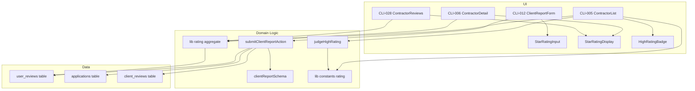
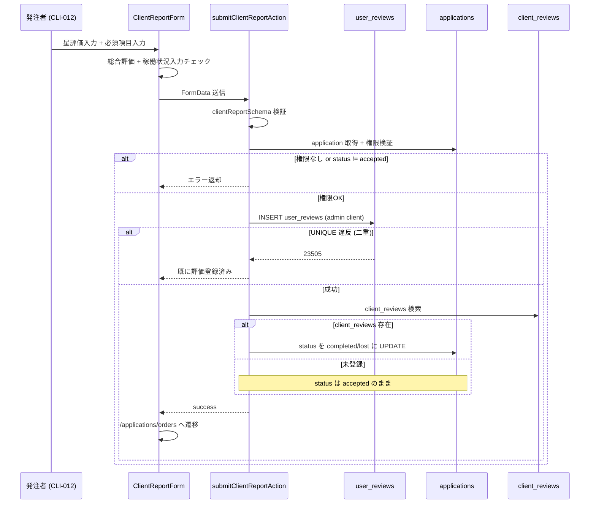

# Technical Design — rating-redesign

## Overview

**Purpose**: 発注者→受注者の評価機能を「6項目 Good/Bad」から「7項目 ★×5」に作り直し、評価入力（CLI-012）の負担を抑えつつ、表示画面（CLI-005 / CLI-006 / CLI-028）で総合評価を可視化する。
**Users**: 発注者（client / staff）が評価を入力し、全認証ユーザー（contractor / client / staff）が評価結果を閲覧する。
**Impact**: `user_reviews` テーブルのスキーマを全置換、関連 Server Action / バリデーション / 3画面の表示ロジックを書き換え、星評価コンポーネントと閾値定数を新規追加する。

### Goals

- 7項目★×5（総合のみ必須）の評価フォームを CLI-012 に提供
- CLI-006 に総合評価サマリー、CLI-028 に7項目集計、CLI-005 に動的「高評価」バッジを表示
- 集計値（★平均・件数）の取得を **リアルタイム SQL 集計**で一元化（denormalize なし）
- 既存テスト 4ファイル（Vitest 2 / pgTAP 1 / seed.sql 1）を新スキーマに合わせ、デグレ防止ゲート 3層通過を満たす

### Non-Goals

- `client_reviews`（受注者→発注者の評価、CON-013）の刷新
- 稼働状況6択の選択肢変更（`applications.status` 連動ロジック維持）
- 「殿堂入り」等の上位バッジ（将来拡張余地として残す）
- 評価編集・削除機能（仕様上不可、UI 非配置を維持）
- 「高評価のみ表示」のような評価ベース検索フィルタ

## Architecture

### Existing Architecture Analysis

- **データアクセス**: Server Component で `createClient` 直接 SELECT、Server Action で書き込み — 本機能はこのパターンを踏襲
- **RLS**: `user_reviews` は SELECT 公開 / INSERT は `reviewer_id = auth.uid()` 縛り / UPDATE・DELETE はポリシー未定義（デフォルト拒否）。Server Action 層で追加の発注者/同一組織メンバー検証が走る — 既存防御層を維持
- **集計の前例なし**: DB に AVG() 利用箇所・denormalized counter なし。本 spec が初導入
- **`user_reviews(id)` NULL チェック**: 6+ 画面で「評価提出済みか？」判定として使われている。スキーマ変更で破壊しないことを確認済
- **CLI-006 既存バグコード**: `rating_again === "yes"` を数える dead code が存在（実値は `'good'/'bad'`）。本刷新で撤去

### Architecture Pattern & Boundary Map



**Architecture Integration**:

- **採用パターン**: Server Component + Server Action（既存）、純粋関数化された判定ロジック、リアルタイム SQL 集計
- **ドメイン境界**:
  - **UI 層**: 表示・入力。集計結果と判定結果を受け取って描画するだけ（ロジック非含有）
  - **ドメイン層**: 集計クエリ・判定関数・バリデーション・Server Action
  - **データ層**: `user_reviews` テーブル単一が真実の源（denormalize なし）
- **新規コンポーネントの根拠**:
  - `StarRatingInput` / `StarRatingDisplay`: プロジェクトに星評価コンポーネント前例なし → 新規必須
  - `lib/rating/aggregate.ts`: CLI-005/006/028 で同じ集計を行う → 一箇所に集約
  - `lib/rating/judge-high-rating.ts`: 純粋関数で単体テスト容易（Req 5.6）
  - `lib/constants/rating.ts`: 閾値変更時の単一修正点（Req 5.3）
- **既存パターン維持**: Server Action の `getApplicationWithDetails` ヘルパ、`mapOperatingStatusToApplicationStatus`、admin client による特権操作

### Technology Stack

| Layer | Choice / Version | Role in Feature | Notes |
|-------|------------------|-----------------|-------|
| Frontend | Next.js 16 / React 19（既存） | サーバーコンポーネント + クライアント星評価入力 | 既存 |
| UI Library | shadcn/ui Card・Button・Label（既存） / lucide-react `Star`（新規利用） | 星アイコン描画 | lucide は既存 `ThumbsUp/Down` 利用箇所と同じパッケージ |
| Form | React Hook Form は **使わない**（useState ベースで継続） | 7項目の星評価を controlled state で管理 | 既存 ClientReportForm の useState パターン踏襲 |
| Validation | Zod v4（既存） | smallint 1〜5 / nullable / 総合必須を表現 | `z.coerce.number().int().min(1).max(5).nullable()` |
| Backend | Server Action（既存 `submitClientReportAction`） | Insert + status 連動更新 | 既存ロジック骨格維持、評価カラム部分のみ差し替え |
| Data | Supabase PostgreSQL（既存） | user_reviews 全置換 | smallint + CHECK 制約 + 新 index |
| Test | Vitest / Playwright / pgTAP（既存） | 既存テスト書き換え + 新規 E2E 3本 + 純粋関数 unit | デグレ防止ゲート 3層通過 |

## System Flows

### 評価提出と status 連動更新フロー



**主要決定**:

- INSERT は admin client（既存 PERMISSIVE ポリシー回避）
- status 更新は client_reviews 存在チェック後（Req 2.6 / 2.7）
- UNIQUE 違反は専用エラーメッセージ（既存挙動踏襲）

## Requirements Traceability

| 要件 ID | 概要 | コンポーネント | インターフェース | フロー |
|---------|------|----------------|------------------|--------|
| 1.1〜1.4 | 7項目★×5、総合必須・任意項目クリア可 | ClientReportForm, StarRatingInput | `StarRatingInputProps` | 評価提出フロー |
| 1.5〜1.7 | 稼働状況6択 + 補足、必須/任意分岐 | ClientReportForm, clientReportSchema | `clientReportSchema` | 評価提出フロー |
| 1.8 | 提出後遷移 | ClientReportForm | `router.push("/applications/orders")` | 評価提出フロー |
| 2.1〜2.5 | user_reviews 物理スキーマ | user_reviews migration | DDL | — |
| 2.6, 2.7 | applications.status 条件付き更新 | submitClientReportAction | `submitClientReportAction(FormData)` | 評価提出フロー |
| 3.1〜3.5 | CLI-006 総合評価サマリー | ContractorDetailPage, fetchOverallSummary, StarRatingDisplay | `fetchOverallSummary(supabase, userId)` | — |
| 4.1〜4.7 | CLI-028 7項目集計 | ContractorReviewsPage, fetchPerItemSummary | `fetchPerItemSummary(supabase, userId)` | — |
| 5.1〜5.6 | CLI-005 高評価バッジ | ContractorListPage, fetchBulkOverallSummary, judgeHighRating, HighRatingBadge | `judgeHighRating(avg, count): boolean` | — |
| 6.1〜6.4 | 集計の性能と一貫性 | lib rating aggregate | 集計ヘルパ群 | — |
| 7.1〜7.6 | RLS / UNIQUE / 不変性 | RLS policies, UNIQUE 制約, pgTAP | DDL | — |
| 8.1〜8.8 | 旧スキーマ撤去 + テスト同期 | migration, seed.sql, テスト群 | DDL + テストコード | マイグレーションフロー |
| 9.1〜9.5 | matching spec / steering 整合 | matching/requirements.md, steering/screen-map.md | ドキュメント | — |

## Components and Interfaces

### 概要

| コンポーネント | 層 | 目的 | 要件 | 主要依存 | 契約 |
|---------------|-----|------|------|---------|------|
| `user_reviews` テーブル | DB | 評価データ永続化 | 2.1〜2.5, 7.1〜7.4 | applications, users | State |
| `clientReportSchema` | Validation | 入力検証 | 1.1〜1.7 | Zod (P0) | Service |
| `submitClientReportAction` | Server Action | 評価登録 + status 連動 | 1.7, 1.8, 2.6, 2.7, 7.1 | Supabase admin client (P0), applications (P0), client_reviews (P0) | Service |
| `lib/rating/aggregate.ts` | Backend | 集計ヘルパ群 | 6.1〜6.4 | Supabase server client (P0) | Service |
| `lib/rating/judge-high-rating.ts` | Pure Fn | バッジ判定 | 5.1, 5.2, 5.6 | rating 定数 (P0) | Service |
| `lib/constants/rating.ts` | Constants | 閾値 + 項目定義 | 5.3 | なし | State |
| `StarRatingInput` | UI Client | ★×5 入力 | 1.1〜1.4 | lucide Star (P1) | State |
| `StarRatingDisplay` | UI Server | ★平均表示 | 3.1, 3.3, 4.1, 4.7, 5.4 | lucide Star (P1) | State |
| `HighRatingBadge` | UI Server | バッジ描画 | 5.1, 5.4 | shadcn Badge (P1), judgeHighRating (P0) | State |
| `ClientReportForm` | UI Client | フォーム全体 | 1.x | StarRatingInput (P0), submitClientReportAction (P0) | State |
| CLI-005/006/028 各 page.tsx | UI Server | 表示画面 | 3.x, 4.x, 5.x | aggregate / display / badge (P0) | State |

### Data Layer

#### user_reviews テーブル（スキーマ全置換）

| Field | Detail |
|-------|--------|
| Intent | 発注者→受注者の評価を永続化 |
| Requirements | 2.1, 2.2, 2.3, 2.4, 2.5, 7.1, 7.2, 7.3, 7.4 |

**Responsibilities & Constraints**

- 単一トランザクション内で1応募1評価を保証（UNIQUE）
- rating_overall は NOT NULL、他6項目は NULL 許可（Req 2.2）
- すべての星評価カラムは CHECK で 1〜5 範囲制限（Req 2.3）
- UPDATE / DELETE は RLS 非配置 = デフォルト拒否（Req 7.3）

**Contracts**: State ✓

詳細 DDL は [Data Models](#data-models) セクション参照。

#### RLS ポリシー

| ポリシー | 種別 | 条件 | 要件 |
|---------|------|------|------|
| `user_reviews_select` | SELECT | `USING (true)` 全認証ユーザー公開 | 7.2 |
| `user_reviews_insert` | INSERT | `WITH CHECK (reviewer_id = auth.uid())` 自己発行のみ | 7.1（Server Action 層で追加発注者/組織メンバー検証） |
| （UPDATE / DELETE） | — | ポリシー非配置 = 拒否 | 7.3 |

**Implementation Notes**
- Integration: 既存 RLS と同一構造を新スキーマで再作成（DROP/CREATE）
- Validation: pgTAP で当事者外 INSERT 拒否・全ユーザー UPDATE/DELETE 拒否・二重 INSERT 拒否を検証（Req 7.6）
- Risks: マイグレーション時に古いポリシーを DROP し忘れると残存 → migration 冒頭で明示 DROP

### Validation Layer

#### clientReportSchema

| Field | Detail |
|-------|--------|
| Intent | CLI-012 フォーム入力を型安全に検証 |
| Requirements | 1.1, 1.2, 1.3, 1.5, 1.6, 1.7 |

**Contracts**: Service ✓

##### Service Interface

```typescript
const starRatingSchema = z.coerce
  .number()
  .int()
  .min(1, "1〜5で評価してください")
  .max(5, "1〜5で評価してください");

const optionalStarRatingSchema = z
  .preprocess(
    (v) => (v === "" || v === null || v === undefined ? null : v),
    starRatingSchema.nullable(),
  );

export const clientReportSchema = z.object({
  applicationId: z.string().regex(uuidRegex, "応募IDが不正です"),
  operatingStatus: clientOperatingStatusEnum,
  statusSupplement: z.string().optional(),
  ratingOverall: starRatingSchema,
  ratingPunctual: optionalStarRatingSchema,
  ratingFollowsInstructions: optionalStarRatingSchema,
  ratingSpeed: optionalStarRatingSchema,
  ratingQuality: optionalStarRatingSchema,
  ratingHasTools: optionalStarRatingSchema,
  ratingHasSpecialEquipment: optionalStarRatingSchema,
  comment: z.string().optional(),
});

export type ClientReportInput = z.infer<typeof clientReportSchema>;
```

- Preconditions: FormData の値が string で渡る（数値文字列も可）
- Postconditions: 検証成功時は `StarRating | null` 型の各項目が確定
- Invariants: `ratingOverall` は null 不可

### Server Action Layer

#### submitClientReportAction（書き換え）

| Field | Detail |
|-------|--------|
| Intent | 発注者の評価を user_reviews へ insert し、両者評価が揃った時点で applications.status を遷移 |
| Requirements | 1.7, 1.8, 2.6, 2.7, 7.1 |

**Responsibilities & Constraints**

- 認証 → 入力検証 → application 取得 → 権限検証（job owner or org member）→ status='accepted' 検証 → INSERT → status 条件付き更新
- 旧 6 Good/Bad カラムへの書き込みを廃止、新 7 smallint カラムへ書き込み
- status 更新は client_reviews 存在時のみ実行（Req 2.6 / 2.7）

**Dependencies**

- Inbound: ClientReportForm — フォーム送信 (P0)
- Outbound: `user_reviews` テーブル — INSERT (P0)、`applications` テーブル — UPDATE (P0)、`client_reviews` テーブル — SELECT (P0)
- External: `supabase admin client` — RLS バイパス INSERT/UPDATE (P0)

**Contracts**: Service ✓

##### Service Interface

```typescript
export async function submitClientReportAction(
  formData: FormData,
): Promise<ActionResult>;
```

`ActionResult` の形は既存（`{ success: true } | { success: false, error: string }`）を踏襲。

**Implementation Notes**

- Integration: 既存 `getApplicationWithDetails` ヘルパ、`mapOperatingStatusToApplicationStatus`、admin client 利用パターンを維持
- Validation: Zod が 1〜5 整数を強制。FormData 値の数値変換は `z.coerce.number()` で扱う
- Risks: FormData の string `""` を `null` 扱いにする preprocess を忘れると Zod がエラーを出す → schema に preprocess 必須

### Aggregation Layer

#### lib/rating/aggregate.ts（新規）

| Field | Detail |
|-------|--------|
| Intent | CLI-005/006/028 の集計クエリを一箇所に集約。リアルタイム SQL 集計を採用（Option A）|
| Requirements | 6.1, 6.2, 6.3, 6.4 |

**Responsibilities & Constraints**

- 単一ユーザー / 複数ユーザー / 7項目別 の3パターンの集計を提供
- bulk 集計は `IN (...) GROUP BY` で N+1 を回避（Req リスク R2）
- 0件の受注者は NULL avg / 0 count として返す

**Contracts**: Service ✓

##### Service Interface

```typescript
import type { SupabaseClient } from "@supabase/supabase-js";
import type { Database } from "@/types/database";

export interface OverallSummary {
  avg: number | null;     // 1.00〜5.00、未評価は null
  count: number;          // 0以上の整数
}

export interface PerItemSummary {
  overall: OverallSummary;
  punctual: OverallSummary;
  followsInstructions: OverallSummary;
  speed: OverallSummary;
  quality: OverallSummary;
  hasTools: OverallSummary;
  hasSpecialEquipment: OverallSummary;
}

export async function fetchOverallSummary(
  supabase: SupabaseClient<Database>,
  userId: string,
): Promise<OverallSummary>;

export async function fetchPerItemSummary(
  supabase: SupabaseClient<Database>,
  userId: string,
): Promise<PerItemSummary>;

export async function fetchBulkOverallSummary(
  supabase: SupabaseClient<Database>,
  userIds: ReadonlyArray<string>,
): Promise<Map<string, OverallSummary>>;
```

##### State Management

- 永続状態を持たない（純粋関数 + DB アクセス）
- 集計結果はリクエスト単位でメモリ保持（Server Component スコープ）
- 一貫性: 同一リクエスト内で複数回呼び出すと別クエリが走る（プロジェクトとして許容）

**Implementation Notes**

- Integration: Supabase の RPC は使わず、PostgREST の `.select()` + JS 側 reduce で集計。理由: 評価件数が当面少なく、RPC 化のコストに見合わない
- Validation: `userId` が UUID 形式である前提（呼び出し元責任）
- Risks:
  - `fetchPerItemSummary` の任意項目 avg を `AVG(col) FILTER (WHERE col IS NOT NULL)` 相当のロジックで実装 → PostgreSQL の AVG() は NULL を自動除外するので JS 側で `values.filter(v => v !== null)` のみで OK
  - 大規模時は RPC 化で1往復に圧縮可能（design 変更不要、内部実装の最適化）
- **RPC 化への切り替えトリガー（明示的な再評価条件）**:
  - **トリガー1**: 単一受注者の `user_reviews` 件数が **50件** を超えた時点で `fetchOverallSummary` / `fetchPerItemSummary` の RPC 化を検討（行転送コストが顕在化し始める目安）
  - **トリガー2**: CLI-005 の1ページ表示（contractor 20名分の bulk 集計含む）が **p95 で 500ms** を超えた時点で `fetchBulkOverallSummary` の RPC 化を検討
  - **トリガー3**: contractor 総数が **1万人** を超え、運用上の負荷監視で集計クエリが top 5 slow query に入った時点で全面 RPC 化
  - いずれも DB 集計関数（PostgreSQL `AVG(rating_overall) FILTER (WHERE ...)`）を使った RPC で1往復に圧縮可能。design.md のコンポーネント契約（`OverallSummary` / `PerItemSummary`）は不変なので、移行コストは内部実装のみに閉じる

#### lib/rating/judge-high-rating.ts（新規・純粋関数）

| Field | Detail |
|-------|--------|
| Intent | バッジ表示条件の判定（純粋関数化で単体テスト容易） |
| Requirements | 5.1, 5.2, 5.6 |

**Contracts**: Service ✓

##### Service Interface

```typescript
import type { OverallSummary } from "@/lib/rating/aggregate";

export function judgeHighRating(summary: OverallSummary): boolean;
```

- Preconditions: `summary.count >= 0`、`summary.avg` は null または 1.0〜5.0
- Postconditions: `count >= HIGH_RATING_BADGE_MIN_COUNT && avg >= HIGH_RATING_BADGE_MIN_AVG` の真偽値
- Invariants: 副作用なし。同じ入力で必ず同じ出力

### Constants Layer

#### lib/constants/rating.ts（新規）

```typescript
export const HIGH_RATING_BADGE_MIN_COUNT = 3 as const;
export const HIGH_RATING_BADGE_MIN_AVG = 4.0 as const;

export const RATING_ITEMS = [
  { key: "rating_overall",                label: "総合評価",                  required: true  },
  { key: "rating_punctual",               label: "稼働予定日にくる",          required: false },
  { key: "rating_follows_instructions",   label: "指示通りに動ける",          required: false },
  { key: "rating_speed",                  label: "作業の速さ",                required: false },
  { key: "rating_quality",                label: "作業の丁寧さ",              required: false },
  { key: "rating_has_tools",              label: "作業に関する道具を持っている", required: false },
  { key: "rating_has_special_equipment",  label: "特別な道具/重機等を持っている", required: false },
] as const satisfies ReadonlyArray<{
  key: string;
  label: string;
  required: boolean;
}>;

export type RatingItemKey = (typeof RATING_ITEMS)[number]["key"];
```

**Implementation Notes**
- Integration: CLI-005 バッジ判定 / CLI-012 フォーム / CLI-028 集計表示 / Vitest テストで共有
- Validation: 閾値変更時はこのファイル1箇所のみ修正、DB マイグレーション不要

### UI Layer

#### StarRatingInput（新規・client component）

| Field | Detail |
|-------|--------|
| Intent | クリックで 1〜5 を選択、再クリックや「クリア」ボタンで未評価に戻せる ★×5 入力 |
| Requirements | 1.1, 1.4 |

**Contracts**: State ✓

##### Component Props

```typescript
export interface StarRatingInputProps {
  value: number | null;                  // 1〜5 または null
  onChange: (value: number | null) => void;
  ariaLabel: string;
  size?: "sm" | "md" | "lg";              // 既定 md
}
```

**Responsibilities & Constraints**

- value が `null` → 全星グレーアウト
- ホバー時のプレビュー表示（任意 — design として推奨だが MVP では省略可）
- 同じ星を再クリック → null に戻す（クリアボタン代替）
- キーボード: ← → で星を移動、Space/Enter で確定、Backspace/Delete で null 化（アクセシビリティ最小限）
- **モバイル誤タップ防止**: 各星のタップ領域は最低 **44px × 44px**（Apple HIG / Material Design 推奨値）、星間スペース **4px 以上**を確保する。理由: ビジ友の主要ユーザーは現場の職人でスマホ操作が主、誤タップで評価が1段ズレると CLI-005 バッジ判定にも影響するため
- size variants の目安: `sm` = 36px star + 44px tap area / `md` = 40px star + 44px tap area（既定）/ `lg` = 48px star + 48px tap area

##### State Management

- 完全 controlled（親が `value` と `onChange` を保持）
- ローカル state は hover プレビューのみ

**Implementation Notes**
- Integration: lucide-react `Star` icon（fill 切替で塗りつぶし/輪郭）
- Validation: 親の Zod 検証任せ。コンポーネント自身は範囲外 value を受け取ったら全星グレーで描画
- Risks: 「同じ星クリックで null」と「クリア専用ボタン」のどちらが直感的か → MVP は「同じ星クリックで null」を採用し、視覚補助として「未評価に戻す」テキストリンクをコンポーネント右端に配置

#### StarRatingDisplay（新規・server component）

| Field | Detail |
|-------|--------|
| Intent | ★平均値（小数点第一位）+ 件数の読み取り専用表示 |
| Requirements | 3.1, 3.3, 4.1, 4.7, 5.4 |

##### Component Props

```typescript
export interface StarRatingDisplayProps {
  avg: number | null;
  count: number;
  layout?: "stars-with-text" | "text-only"; // 既定 stars-with-text
  size?: "sm" | "md" | "lg";
}
```

**Responsibilities & Constraints**

- 5つの星アイコンを描画し、平均値を四捨五入して fill 状態を決定（half-star は不採用、整数四捨五入）
- `avg === null || count === 0` → 「まだ評価がありません」を表示
- `layout === "text-only"` で `★平均 X.X（N件）` のテキスト形式に切り替え（CLI-005 バッジ用）

**Implementation Notes**
- Integration: lucide-react `Star`、Tailwind の `fill-foreground` / `fill-none` 切替
- Validation: 描画前に `Math.round(avg * 10) / 10` で表示値を確定
- Risks: 四捨五入境界（例 4.45）の見え方差 → 表示値と star fill が乖離する可能性。仕様として明確化: 「fill は Math.round(avg)、テキストは Math.round(avg * 10) / 10」

#### HighRatingBadge（新規・server component）

| Field | Detail |
|-------|--------|
| Intent | CLI-005 カード上部の「高評価」バッジ + 補足テキスト |
| Requirements | 5.1, 5.2, 5.4, 5.5 |

##### Component Props

```typescript
export interface HighRatingBadgeProps {
  summary: OverallSummary;  // count >= 3 && avg >= 4.0 のとき描画
}
```

**Responsibilities & Constraints**

- `judgeHighRating(summary)` が false の場合は `null` を返して非表示
- 黒地白文字 Badge「高評価」 + グレー補足テキスト「★平均 X.X（N件）」の2要素構造

**Implementation Notes**
- Integration: shadcn `Badge` + `StarRatingDisplay layout="text-only"`
- Risks: なし

#### ClientReportForm（CLI-012・既存書き換え）

| Field | Detail |
|-------|--------|
| Intent | 7項目★×5 評価入力 + 稼働状況6択 + 補足テキスト |
| Requirements | 1.1〜1.8 |

##### Component Props

```typescript
export interface ClientReportFormProps {
  applicationId: string;
}
```

##### State Management

```typescript
// 内部 state（useState）
const [operatingStatus, setOperatingStatus] = useState<string>("");
const [statusSupplement, setStatusSupplement] = useState<string>("");
const [ratings, setRatings] = useState<Record<RatingItemKey, number | null>>(
  Object.fromEntries(
    RATING_ITEMS.map((item) => [item.key, null]),
  ) as Record<RatingItemKey, number | null>,
);
const [comment, setComment] = useState<string>("");
```

**Responsibilities & Constraints**

- 7項目を `RATING_ITEMS` で map し、各項目に `StarRatingInput` を配置
- 送信ボタン無効化条件: `operatingStatus === ""` または `ratings.rating_overall === null`
- フォーム内ボタンは `type="button"` 明示（CLAUDE.md ルール準拠、「もどる」「クリア」等）

**Implementation Notes**
- Integration: `submitClientReportAction(FormData)` 既存呼び出しパターン維持
- Validation: クライアント側は無効化のみ。Zod 検証は Server Action 内で実行
- Risks: 既存 `allRatingsFilled`（全 6 項目必須）チェックを撤去し忘れない

#### CLI-005 ContractorListPage（書き換え）

| Field | Detail |
|-------|--------|
| Intent | 既存ハードコードバッジを動的バッジに置き換え |
| Requirements | 5.1, 5.2, 5.4, 5.5 |

**Implementation Notes**
- 既存クエリ後、`fetchBulkOverallSummary(supabase, contractorIds)` を1回呼ぶ
- 各 contractor カードで `<HighRatingBadge summary={summaryMap.get(c.id) ?? { avg: null, count: 0 }} />` を描画
- 旧ハードコード文字列「発注者の再発注希望80%！」を撤去（Req 5.5）
- リスク R2: bulk 集計1回のみ。**ループ内で fetchOverallSummary を呼ばない**

#### CLI-006 ContractorDetailPage（書き換え）

| Field | Detail |
|-------|--------|
| Intent | 総合評価サマリー + 「詳しく見る」リンクを追加。既存 broken コード撤去 |
| Requirements | 3.1, 3.2, 3.3, 3.4, 3.5 |

**Implementation Notes**
- **撤去対象（リスク R4）**:
  - 既存 L123-126 の `supabase.from("user_reviews").select("id, rating_again")...` フェッチ
  - L136-137 の `reviewCount` / `againCount` 計算（`againCount` は dead code）
- **追加**:
  - `fetchOverallSummary(supabase, id)` 呼び出し
  - 総合評価カード = `<StarRatingDisplay avg={summary.avg} count={summary.count} />` + `<Link href={`/users/${id}/reviews`}>詳しく見る</Link>`
  - 0件時は「まだ評価がありません」テキストのみ（Req 3.5）

#### CLI-028 ContractorReviewsPage（書き換え）

| Field | Detail |
|-------|--------|
| Intent | 7項目★平均集計 + 補足一覧（既存ページネーション維持） |
| Requirements | 4.1, 4.2, 4.3, 4.4, 4.5, 4.6, 4.7 |

**Implementation Notes**
- 既存 `RATING_ITEMS` 配列を `lib/constants/rating.ts` の同名 export に差し替え
- 既存 `countGood` を撤去、`fetchPerItemSummary(supabase, id)` 呼び出しに変更
- 各項目を `<StarRatingDisplay avg={summary[key].avg} count={summary[key].count} />` で描画
- 任意項目で `count === 0` の場合は「未評価」表示（Req 4.4）
- 既存の補足ページネーション（status_supplement / comment）はロジック流用、`select` カラムだけ調整

## Data Models

### Domain Model

- **集約**: 1応募（application）= 1評価（user_review）が UNIQUE。評価は不変（INSERT のみ）
- **ドメインイベント**: 評価提出時、両者評価が揃えば application が `completed` または `lost` に遷移
- **不変条件**:
  - rating_overall は必ず1〜5
  - 他6項目は NULL または 1〜5
  - 評価更新・削除は禁止

### Logical Data Model

```mermaid
erDiagram
    applications ||--o| user_reviews : "1:0..1"
    applications ||--o| client_reviews : "1:0..1"
    users ||--o{ user_reviews : "reviewer or reviewee"

    user_reviews {
        uuid id PK
        uuid application_id FK_UNIQUE
        uuid reviewer_id FK
        uuid reviewee_id FK
        text operating_status
        text status_supplement
        smallint rating_overall "NOT NULL 1..5"
        smallint rating_punctual "NULL 1..5"
        smallint rating_follows_instructions "NULL 1..5"
        smallint rating_speed "NULL 1..5"
        smallint rating_quality "NULL 1..5"
        smallint rating_has_tools "NULL 1..5"
        smallint rating_has_special_equipment "NULL 1..5"
        text comment
        timestamptz created_at
    }
```

### Physical Data Model

新規マイグレーション: `supabase/migrations/20260528120000_rating_redesign.sql`

```sql
-- ============================================================================
-- rating-redesign: user_reviews schema replacement
-- WARNING: This migration TRUNCATES user_reviews data. Test environment only.
-- See .kiro/specs/rating-redesign/ for context.
-- ============================================================================

-- 1. Drop existing RLS policies (will recreate at the end)
DROP POLICY IF EXISTS "user_reviews_select" ON user_reviews;
DROP POLICY IF EXISTS "user_reviews_insert" ON user_reviews;

-- 2. Truncate test data (CASCADE not needed: no inbound FK to user_reviews)
TRUNCATE TABLE user_reviews;

-- 3. Drop old columns
ALTER TABLE user_reviews
  DROP COLUMN rating_again,
  DROP COLUMN rating_follows_instructions,
  DROP COLUMN rating_punctual,
  DROP COLUMN rating_speed,
  DROP COLUMN rating_quality,
  DROP COLUMN rating_has_tools;

-- 4. Add new 7 columns
ALTER TABLE user_reviews
  ADD COLUMN rating_overall              smallint NOT NULL CHECK (rating_overall              BETWEEN 1 AND 5),
  ADD COLUMN rating_punctual             smallint     NULL CHECK (rating_punctual             BETWEEN 1 AND 5),
  ADD COLUMN rating_follows_instructions smallint     NULL CHECK (rating_follows_instructions BETWEEN 1 AND 5),
  ADD COLUMN rating_speed                smallint     NULL CHECK (rating_speed                BETWEEN 1 AND 5),
  ADD COLUMN rating_quality              smallint     NULL CHECK (rating_quality              BETWEEN 1 AND 5),
  ADD COLUMN rating_has_tools            smallint     NULL CHECK (rating_has_tools            BETWEEN 1 AND 5),
  ADD COLUMN rating_has_special_equipment smallint    NULL CHECK (rating_has_special_equipment BETWEEN 1 AND 5);

-- 5. Add index for aggregation queries (FK does not auto-create index in PostgreSQL)
CREATE INDEX user_reviews_reviewee_id_idx ON user_reviews(reviewee_id);

-- 6. Recreate RLS policies (identical to original behavior)
CREATE POLICY "user_reviews_select" ON user_reviews
  FOR SELECT TO authenticated
  USING (true);

CREATE POLICY "user_reviews_insert" ON user_reviews
  FOR INSERT TO authenticated
  WITH CHECK (reviewer_id = auth.uid());

-- No UPDATE / DELETE policies → denied by default
```

**Index Strategy**:
- `user_reviews_reviewee_id_idx` (新規): CLI-005 bulk 集計 + CLI-006 / CLI-028 単一ユーザー集計の WHERE 句を高速化
- `application_id` の UNIQUE 制約は既に index を兼ねる（既存）
- `reviewer_id` は集計クエリで使わないため index 不要

### Data Contracts & Integration

- FormData → Server Action: 既存パターン踏襲（FormData の各 key は camelCase で送信、Server Action 内で snake_case の DB カラムに変換）
- Server → Client（集計結果）: `OverallSummary` / `PerItemSummary` インターフェース（[Components](#components-and-interfaces) 参照）
- 既存 6+ 画面の `user_reviews(id)` NULL チェック: スキーマ変更後も `id` カラムは存続するため互換性維持（リスク R5）

## Error Handling

### Error Strategy

| エラー種別 | 原因 | ユーザー側応答 | システム側応答 |
|-----------|------|---------------|---------------|
| ユーザー入力エラー | 総合評価未入力 / 稼働状況未選択 | フォームの該当項目に赤メッセージ + 送信ボタン非活性 | フォーム submit を阻止 |
| 認証エラー | セッション切れ | 「認証が必要です」トースト | `redirect("/login")` |
| 権限エラー | 自分の案件でない / 組織メンバーでない | 「この応募に対する権限がありません」 | Server Action が `success: false` 返却 |
| ステータスエラー | status !== 'accepted' | 「発注済みの応募のみ完了報告できます」 | Server Action が `success: false` 返却 |
| 二重提出エラー | UNIQUE 違反（既に評価登録済み） | 「既に評価を登録済みです」 | PostgreSQL `23505` → 専用エラーメッセージ |
| 書き込み失敗 | Supabase 一時障害 | 「評価の登録に失敗しました」 | Server Action が generic エラーを返却 |
| 集計クエリ失敗 | DB 一時障害 | 表示画面で「評価情報を取得できませんでした」 | 空状態相当として描画継続（fail-soft） |

### Monitoring

- Server Action のエラーは既存 `ActionResult` パターンで返却（ログは将来追加）
- 集計クエリは Server Component で実行されるため、エラー時は Next.js の error boundary に委ねる（既存挙動）

## Testing Strategy

### Unit Tests（Vitest）

- **`judgeHighRating` 境界値**: count=2/3/4 × avg=3.9/4.0/4.1 の組み合わせを全列挙（Req 5.6）
- **`clientReportSchema`**: `rating_overall` 必須 / 他6項目 null 許可 / 1〜5 範囲外で reject / 文字列 "3" の coerce / 空文字 → null preprocess（Req 1.x）
- **`submitClientReportAction`** 書き換え:
  - 正常系: 7項目正常 → INSERT + (client_reviews 既存なら) status 更新
  - 異常系: 認証なし / 権限なし / status≠accepted / UNIQUE 違反
  - **既存テストファイル（`src/__tests__/matching/actions.test.ts` / `validations.test.ts`）の旧スキーマ参照を全件書き換え** （Req 8.7）

### Integration Tests（pgTAP）

- **`user_reviews` CHECK 制約**: 0 / 6 / -1 など範囲外値の INSERT が拒否されること
- **`user_reviews` UNIQUE 制約**: 同一 application_id への二重 INSERT が拒否されること
- **`user_reviews` RLS**:
  - 他人の `reviewer_id` での INSERT が拒否されること
  - UPDATE / DELETE が全ユーザーで拒否されること
  - SELECT が全認証ユーザーで通ること
- **`supabase/tests/matching_rls.test.sql` L166 の INSERT を新スキーマに書き換え** （Req 8.7）

### E2E Tests（Playwright）

- **CLI-012 評価提出 正常系**: 発注者ログイン → /applications/orders/[id]/report → 総合評価のみ入力 → 送信成功 → /applications/orders 遷移
- **CLI-012 評価提出 任意項目入力**: 7項目全部入力 → 送信成功
- **CLI-012 評価提出 必須漏れ**: 総合評価未入力 → 送信ボタン非活性
- **CLI-005 高評価バッジ**: seed.sql で「3件以上+★4以上の受注者」「2件のみ」「★平均3.9」を用意 → 該当受注者のみバッジ表示
- **CLI-006 総合評価サマリー**: 評価あり受注者 → サマリー表示 + 「詳しく見る」リンク動作 / 評価なし受注者 → 「まだ評価がありません」
- **CLI-028 7項目集計**: 評価あり受注者 → 7項目それぞれ ★平均 + 件数表示 / 任意項目 0 件 → 「未評価」

### Performance / Load

- **CLI-005 bulk 集計**: 20受注者を1ページ表示する際、user_reviews への問い合わせが1回のみ（N+1 検出。リスク R2）
- **基準**: 受注者100名規模では集計クエリ 100ms 以内（経験則ベース、本番計測後に再評価）

## Migration Strategy

```mermaid
flowchart LR
    Start[移行開始] --> Backup[既存 user_reviews TRUNCATE 可確認]
    Backup --> Drop[DROP RLS + DROP COLUMNS]
    Drop --> Add[ADD COLUMNS + CHECK + INDEX]
    Add --> Recreate[Recreate RLS]
    Recreate --> Types[supabase gen types 実行]
    Types --> CodeUpdate[Server Action / フォーム / 3画面 / seed.sql 書き換え]
    CodeUpdate --> TestUpdate[既存 Vitest 2 + pgTAP 1 書き換え]
    TestUpdate --> Gate[3層テスト通過確認]
    Gate --> Spec[matching / steering 同期更新]
    Spec --> End[完了]
```



**Phase Breakdown**:

1. **DB**: マイグレーション作成 + apply（`supabase db reset` で検証）
2. **型再生成**: `supabase gen types typescript --local > src/types/database.ts`
3. **定数・純粋関数**: `lib/constants/rating.ts` + `lib/rating/judge-high-rating.ts` + Vitest
4. **集計ヘルパ**: `lib/rating/aggregate.ts` + Vitest
5. **コンポーネント**: `StarRatingInput` / `StarRatingDisplay` / `HighRatingBadge`
6. **バリデーション + Server Action**: `clientReportSchema` 書き換え + `submitClientReportAction` 書き換え + Vitest
7. **CLI-012 フォーム** 書き換え
8. **CLI-006 / CLI-028 / CLI-005** 順に書き換え
9. **seed.sql**（L783, L799）書き換え
10. **既存テスト**（actions.test.ts / validations.test.ts / matching_rls.test.sql）書き換え
11. **E2E** 追加（CLI-005/006/012/028）
12. **デグレ防止ゲート**: `npm run test` / `supabase test db` / `npm run test:e2e` 全通過
13. **matching/requirements.md REQ-MT-009/010 更新 + 新 REQ-MT 項目追加**
14. **steering/screen-map.md CLI-005/006/012/028 行更新**

**Rollback Triggers**:
- マイグレーション apply 後に既存テストが復活せず修復困難 → マイグレーションを revert（テストデータのみのため安全）

**Validation Checkpoints**:
- 各 Phase 完了後に `npm run test`（または該当する 3層）でデグレ無しを確認
- Phase 12 が最終ゲート

---

## Design Self-Check（research.md の懸念事項チェックリスト）

| # | 懸念事項 | design.md 内の対応箇所 |
|---|---------|---------------------|
| 1 | 集計戦略 🅰🅱🅲 | [Architecture / Aggregation Layer] で Option A 採用を明記。`fetchBulkOverallSummary` で N+1 回避 |
| 2 | 星評価 UI 挙動詳細 | [StarRatingInput] で Props・state・キーボード操作・「同じ星クリックで null」採用を明記 |
| 3 | DB index `user_reviews(reviewee_id)` | [Physical Data Model] に `CREATE INDEX user_reviews_reviewee_id_idx` を含めるマイグレーション SQL を記載 |
| 4 | デザインカンプ整合 | 各 UI コンポーネントで PNG 参照に言及。実装時にカンプと比較するルールは CLAUDE.md ガイドラインで担保 |
| 5 | CLI-005 デザインカンプの「高評価バッジ」描画有無 | [HighRatingBadge] で「現状実装の見た目を踏襲」と明記。実装時にカンプと突き合わせ |
| 6 | 0件評価の扱い | [StarRatingDisplay] で `avg === null \|\| count === 0` 時の表示仕様、CLI-006 / CLI-028 各セクションでも明記 |
| 7 | CLI-028 各任意項目の0件「未評価」表示 | [CLI-028] 実装ノートに記載 |
| R1 | テスト書き換え漏れ | [Testing Strategy] Unit + Integration セクションで既存4ファイルの書き換えを明示 |
| R2 | 集計クエリの N+1 | [fetchBulkOverallSummary] で bulk クエリを契約に組み込み、Performance で N+1 検出を明示 |
| R3 | TRUNCATE 安全性 | マイグレーション SQL 冒頭コメントで「Test environment only」と警告 |
| R4 | CLI-006 dead code 撤去 | [CLI-006] 実装ノートで「撤去対象」リストを明示 |
| R5 | 既存6画面の `user_reviews(id)` 互換 | [Data Contracts & Integration] で互換性維持を明記 |

**自己チェック結果**: research.md の Research Items 7項目 + Risks 5項目すべて design.md 内で扱い済み。
