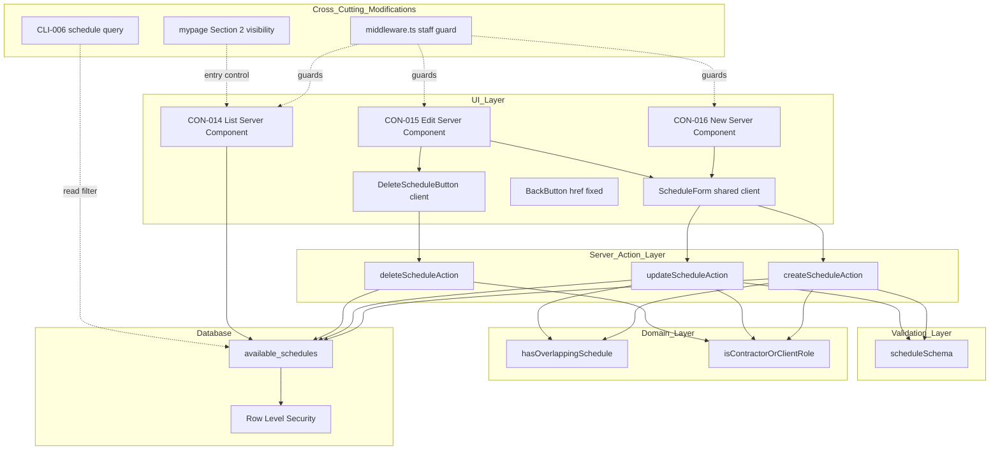
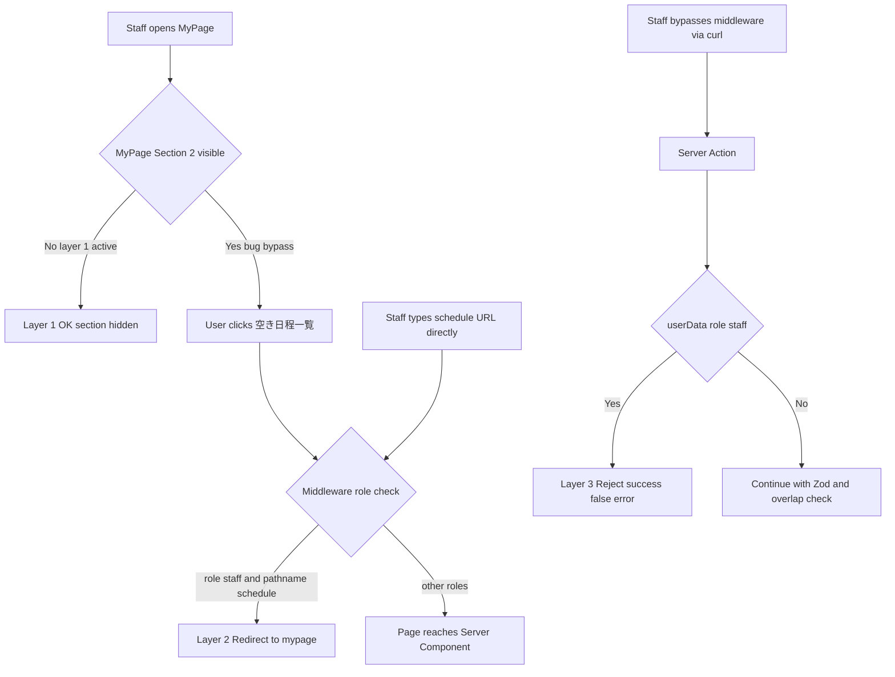
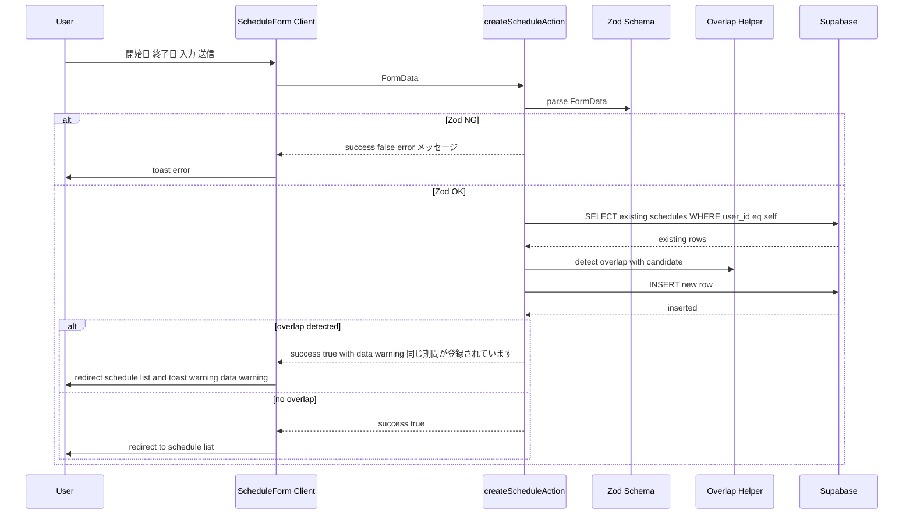
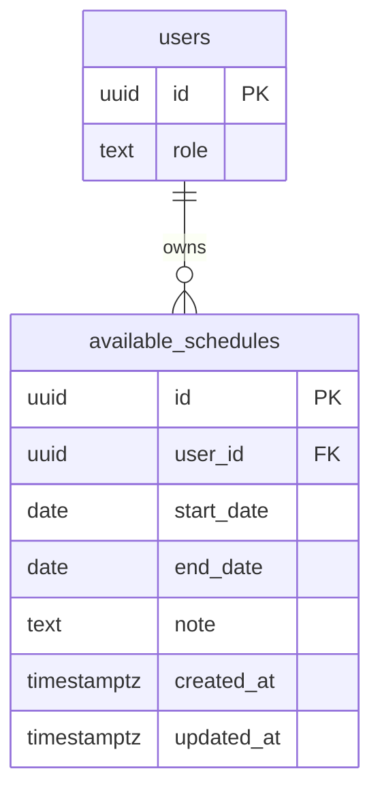
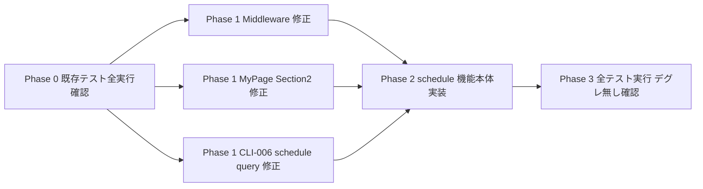

# 空き日程機能（schedule）— 技術設計書

## Overview

**Purpose**: 受注者（および契約主体である法人 Owner）が自分の空き日程（受注可能期間）を登録・更新・削除できるようにし、その情報を発注者が職人プロフィール画面（CLI-006）で確認できるようにする。

**Users**: 受注者（contractor）と発注者本人（client、法人 Owner を含む）。受注者プロフィール画面（CLI-006）から閲覧する側は全認証ユーザー。担当者（staff）は CON-014〜016 にアクセス不可（三層防御）。

**Impact**: 既存の `available_schedules` テーブルと RLS をそのまま流用し、3 画面（CON-014〜016）と 3 つの Server Action を追加する。同時に Middleware の Staff ガード誤記（`/availability` → `/schedule`）とマイページのセクション可視性を修正する。マイグレーションの追加は不要。

### Goals

- 受注者が自分の空き日程を CRUD（一覧・登録・更新・削除）できる
- 期間が重複した場合、登録/更新時にソフト警告（toast.warning）で通知し、登録自体は許可する
- 過去の日程は灰色文字で視覚的に区別、並びは時系列のまま
- Staff（`users.role = 'staff'`）から空き日程関連の経路を完全に閉鎖（UI / Middleware / Server Action の三層防御）
- 既存 Middleware バグ（`/availability` ガード誤記）を解消する

### Non-Goals

- 検索フィルター（「この期間に空いている職人を絞る」など）の追加
- カレンダー UI（月単位ビュー等）の導入
- メモ欄の UI 提供（DB の `note` カラムは将来拡張用に保持）
- 空き日程からの直接スカウト導線（既存の CLI-006 経由のスカウトを利用）
- CLI-006（職人詳細）の **空き日程セクション以外** の変更（基本情報・能力・発注者評価等は触らない。空き日程セクションのクエリのみ修正対象 — REQ-SC-004 参照）

## Architecture

### Existing Architecture Analysis

- **テーブルと RLS**: `available_schedules` テーブルとそれに対する RLS（SELECT 全員可 / INSERT・UPDATE・DELETE は `user_id = auth.uid()` のみ）はマイグレーション 002 / 003 で適用済み。schedule 機能ではこれをそのまま流用する
- **既存パターン**: Server Components + Server Actions を中心とした構成（プロジェクト全体）。フォームは react-hook-form + Zod、トースト通知は sonner、削除確認は shadcn AlertDialog という既存ライブラリ群が確立されている
- **既存バグ（schedule で同時修正）**:
  - `src/middleware.ts:443` で staff ブロック対象が `/availability`（存在しないパス）になっており、`/schedule` がノーガード状態
  - `src/app/(authenticated)/mypage/page.tsx:574-580` で staff にも「予定を確認する」セクションが無条件表示

### Architecture Pattern & Boundary Map



**Architecture Integration**:

- **Selected pattern**: Next.js Server Components + Server Actions（プロジェクト全体の既定パターン）
- **Domain boundaries**: UI（プレゼンテーション）/ Server Action（書き込みオーケストレーション）/ Validation（Zod）/ Domain（純粋関数）/ Database（RLS で最終防御）
- **Existing patterns preserved**: react-hook-form + Zod、Server Action 戻り値 `{ success, error?, data? }`（既存共通の `ActionResult<T>` を流用、`warning` は `data` 内に格納）、shadcn AlertDialog、`<Input type="date">`、`<BackButton href="..." />`、既存 `formatDate` の流用
- **New components rationale**: 3 画面 + 共通 ScheduleForm + DeleteScheduleButton + 3 Server Action + 1 Zod スキーマ + 重複判定ヘルパー + ロールガード（表示は既存 `formatDate` を流用するため新規ヘルパーなし）
- **Steering compliance**: `roles-and-permissions.md`（Staff の三層防御）、`design-rule.md`（CTA `bg-primary` ピル型 + outline サブ）、`design-system.md`（角丸 8px / ピル 47px）、CLAUDE.md（BackButton href 明示）

### Technology Stack

| Layer | Choice / Version | Role in Feature | Notes |
|-------|------------------|-----------------|-------|
| Frontend | Next.js 16 App Router (RSC) + React 19 + Tailwind v4 + shadcn/ui | CON-014/015/016 の Server Component と shared form / dialog | 既存スタックを踏襲。新規依存なし |
| Form & Validation | react-hook-form + zod（既存） | クライアント側バリデーション + Server Action 連携 | スキーマ `src/lib/validations/schedule.ts` を新設 |
| Toast | sonner（既存） | 重複ソフト警告 / 操作結果通知 | 既存の `toast.warning()` / `toast.error()` 経路を踏襲 |
| Backend | Next.js Server Actions + Supabase JS Client（既存） | createScheduleAction / updateScheduleAction / deleteScheduleAction | `src/app/(authenticated)/schedule/actions.ts` に集約 |
| Data | Supabase PostgreSQL `available_schedules` + 既存 RLS | データ永続化と最終防御 | マイグレーション追加なし |
| Routing Guard | Next.js Middleware（既存） | Staff ロールの `/schedule*` ブロック | `/availability` 誤記の修正で機能化 |

> 詳細な技術選定の根拠（特に重複判定ロジックを Application レイヤに置いた理由）は `research.md` の Design Decisions 参照。

## System Flows

### 三層防御フロー（Staff の `/schedule` 直叩きと UI バイパスの全経路）



第 1 層が機能していれば第 2 層 / 第 3 層は通常呼ばれないが、いずれかが破られた場合の保険として三層を維持する。

### 登録時の重複ソフト警告フロー



更新時は同じフローだが、Overlap Helper に「自分自身の `id` を除外」する `excludeId` 引数を渡す。

## Requirements Traceability

| Requirement | Summary | Components | Interfaces | Flows |
|-------------|---------|------------|------------|-------|
| 1.1 (REQ-SC-001) | CON-014 一覧表示（既存 formatDate で `YYYY/MM/DD` 形式、開始日昇順、過去日程は灰色） | SchedulePage, 既存 formatDate | Server Component | — |
| 1.2 (REQ-SC-001) | CON-014 から登録/更新画面への遷移と /mypage への戻り | SchedulePage, BackButton href fixed | — | — |
| 2.1 (REQ-SC-002) | CON-015 既存日程の編集と更新後リダイレクト | EditSchedulePage, ScheduleForm, updateScheduleAction | Service | 重複ソフト警告フロー |
| 2.2 (REQ-SC-002) | CON-015 削除ボタンと AlertDialog 確認 | DeleteScheduleButton, deleteScheduleAction | Service | — |
| 2.3 (REQ-SC-002) | CON-015 「もどる」固定遷移 + 編集対象除外の重複判定 | BackButton, hasOverlappingSchedule excludeId | — | 重複ソフト警告フロー |
| 3.1 (REQ-SC-003) | CON-016 新規登録 + Zod 検証 | NewSchedulePage, ScheduleForm, scheduleSchema, createScheduleAction | Service | 重複ソフト警告フロー |
| 3.2 (REQ-SC-003) | 重複検出と toast.warning ソフト通知 | hasOverlappingSchedule, ScheduleForm onSubmit | Service | 重複ソフト警告フロー |
| 3.3 (REQ-SC-003) | 過去日入力の防止（HTML min + Zod） | ScheduleForm date input min, scheduleSchema refine | — | — |
| 4.1 (非機能・セキュリティ) | 三層防御 第 1 層: マイページ Section 2 を staff で非表示 | MyPage Section 2 visibility patch | — | 三層防御フロー |
| 4.2 (非機能・セキュリティ) | 三層防御 第 2 層: Middleware の `/availability` → `/schedule` 修正 | Middleware staff guard patch | — | 三層防御フロー |
| 4.3 (非機能・セキュリティ) | 三層防御 第 3 層: Server Action 内のロール拒否 | createScheduleAction / updateScheduleAction / deleteScheduleAction の冒頭ロール検査, isContractorOrClientRole | Service | 三層防御フロー |
| 5.1 (REQ-SC-004) | CLI-006 の空き日程セクションを直近の未来 3 件のみ表示（過去日程除外） | CLI-006 schedule query patch | — | — |
| 5.2 (REQ-SC-004) | 登録件数の上限なし（CON-014 は全件表示で受注者が自己管理 — REQ-SC-001 と整合） | SchedulePage（CON-014）, scheduleSchema | — | — |

## Components and Interfaces

### サマリ表

| Component | Domain/Layer | Intent | Req Coverage | Key Dependencies (P0/P1) | Contracts |
|-----------|--------------|--------|--------------|--------------------------|-----------|
| SchedulePage | UI / RSC | CON-014 自分の空き日程を一覧表示 | 1.1, 1.2 | Supabase server client (P0), formatDate from @/lib/utils/format-date (P1) | — |
| NewSchedulePage | UI / RSC | CON-016 登録フォームの container | 3.1 | ScheduleForm (P0) | — |
| EditSchedulePage | UI / RSC | CON-015 編集フォームの container（既存値プリフィル） | 2.1 | ScheduleForm (P0), Supabase (P0) | — |
| ScheduleForm | UI / Client | 登録・更新共通のフォーム + onSubmit で Server Action 呼び出し | 2.1, 3.1, 3.2, 3.3 | createScheduleAction / updateScheduleAction (P0), zodResolver (P0), sonner (P1) | — |
| DeleteScheduleButton | UI / Client | 削除ボタン + AlertDialog + Server Action | 2.2 | deleteScheduleAction (P0), shadcn AlertDialog (P0) | — |
| BackButton (existing) | UI / Client | 「もどる」固定遷移（`href` 必須） | 1.2, 2.3 | next/navigation (P0) | — |
| createScheduleAction | Server Action | 新規登録（バリデーション・ロール・重複・INSERT） | 3.1, 3.2, 3.3, 4.3 | scheduleSchema (P0), hasOverlappingSchedule (P0), isContractorOrClientRole (P0), Supabase (P0) | Service |
| updateScheduleAction | Server Action | 更新（バリデーション・ロール・所有権・重複・UPDATE） | 2.1, 2.3, 4.3 | scheduleSchema (P0), hasOverlappingSchedule (P0), isContractorOrClientRole (P0), Supabase (P0) | Service |
| deleteScheduleAction | Server Action | 物理削除（ロール・所有権・DELETE） | 2.2, 4.3 | isContractorOrClientRole (P0), Supabase (P0) | Service |
| scheduleSchema | Validation | start_date / end_date の Zod スキーマ | 3.1, 3.3 | zod (P0) | — |
| hasOverlappingSchedule | Domain | 純粋関数の期間重複判定 | 2.3, 3.2 | — | — |
| isContractorOrClientRole | Domain | Server Action の許可ロール判定（staff 拒否） | 4.3 | — | — |
| Middleware staff guard patch | Cross-cutting | `/availability` → `/schedule` 修正で staff の直叩きを `/mypage` にリダイレクト | 4.2 | next/server (P0) | — |
| MyPage Section 2 visibility patch | Cross-cutting | staff には「予定を確認する」セクションを非表示 | 4.1 | mypage page.tsx (P0) | — |
| CLI-006 schedule query patch | Cross-cutting | 過去日程除外 + 直近 3 件 LIMIT で発注者画面の空き日程をコンパクト化 | 5.1, 5.2 | users/contractors/[id] page (P0) | — |

以下、新規境界を持つコンポーネント（Server Action / Validation / Domain / 共通フォーム）について詳細ブロックを記載する。プレゼンテーション層の page.tsx は実装ノートで足りるため Summary のみ。

---

### Server Action Layer

#### createScheduleAction

| Field | Detail |
|-------|--------|
| Intent | 新規空き日程を登録する。バリデーション → ロール検査 → 重複判定 → INSERT までを実行 |
| Requirements | 3.1, 3.2, 3.3, 4.3 |

**Responsibilities & Constraints**
- FormData から `startDate` / `endDate` を抽出し scheduleSchema で検証
- ログインユーザーの role が `'contractor'` または `'client'` であることを検査（`'staff'` は早期 return）
- 同ユーザーの既存日程と重複するかを判定（`excludeId` なし）
- INSERT 後、`ActionResult<{ warning?: string }>` を返却（重複時は `data.warning` に通知文言を格納）

**Dependencies**
- Inbound: ScheduleForm onSubmit（UI / P0）
- Outbound: Supabase server client（Data / P0）, scheduleSchema（Validation / P0）, hasOverlappingSchedule（Domain / P0）, isContractorOrClientRole（Domain / P0）
- External: なし

**Contracts**: Service [x] / API [ ] / Event [ ] / Batch [ ] / State [ ]

##### Service Interface

戻り値の型は既存プロジェクト共通の `ActionResult<T>`（`@/lib/types/action-result`）を流用する。`warning`（重複検知時の通知文言）は `data` 内に格納し、CLAUDE.md「Server Actions」ルール（`{ success, error?, data? }` 形式）と整合させる。

```typescript
import type { ActionResult } from "@/lib/types/action-result";

type ScheduleSuccessData = { warning?: string };

async function createScheduleAction(
  formData: FormData,
): Promise<ActionResult<ScheduleSuccessData>>;
```

- Preconditions: ログイン済みであること（Middleware で保証）。FormData に `startDate` / `endDate` が含まれること
- Postconditions: 成功時、`available_schedules` に 1 行追加。`warning` を含む場合、新規行は他の日程と期間が重複している
- Invariants: `start_date <= end_date`（Zod 不変条件）、`start_date >= today`（Zod 不変条件）、`user_id = auth.uid()`（RLS で保証）

**Implementation Notes**
- **ロール検査の標準シーケンス（三層防御の第 3 層、必ず守る順序）**:
  1. `await createClient()` で Supabase server client を取得
  2. `const { data: { user } } = await supabase.auth.getUser()` で `user.id` を取得（Middleware で認証は保証されるが、null なら `{ success: false, error: "..." }` で早期 return）
  3. `await supabase.from("users").select("role").eq("id", user.id).single()` で `role` を取得
  4. `isContractorOrClientRole(role)` が `false` なら `{ success: false, error: "この操作は実行できません" }` を即時 return
  この 4 ステップは Zod / 重複判定 / INSERT より **前** に実行する（無駄な検証コストを避けるため）
- **キャッシュ整合性**: INSERT 成功後、`return { success: true, data: { warning: ... } }`（または `data` 省略）の **直前**に必ず `revalidatePath("/schedule")` を呼ぶ（CLAUDE.md「Next.js Router Cache とリダイレクトキャッシュ」既知問題の対処。一覧画面でクライアント遷移後に新しい行が反映されるための必須処理）
- **エラー全体ラッピング**: 処理全体を `try { ... } catch { ... }` で囲み、catch 内では `{ success: false, error: "予期しないエラーが発生しました" }` を return する（既存 Server Action の標準パターン。`src/app/(authenticated)/applications/actions.ts` 等を参照）
- Integration: ScheduleForm から FormData 経由で呼び出し。`{ success: false }` のとき `toast.error(result.error)` を必ず表示（CLAUDE.md ルール）
- Validation: scheduleSchema の `safeParse` で field-level エラーを検出
- Risks: race condition なし（単一テーブルへの単一 INSERT）。重複判定 SELECT と INSERT の間に新規挿入される可能性は理論上あるが、運用上ほぼ発生しない

#### updateScheduleAction

| Field | Detail |
|-------|--------|
| Intent | 既存空き日程を編集する。重複判定では編集対象 `id` を除外する |
| Requirements | 2.1, 2.3, 4.3 |

**Responsibilities & Constraints**
- 入力（`id` + FormData）から scheduleSchema 検証
- ロール検査（contractor / client のみ許可）
- 既存行の所有権検証（`user_id = auth.uid()`、RLS により自動だが防御として明示チェック）
- 重複判定で `excludeId` に `id` を指定（自分自身を除外）
- UPDATE 実行 → `ActionResult<{ warning?: string }>` を返却（重複時は `data.warning` に通知文言を格納）

**Dependencies**: createScheduleAction とほぼ同じ + 既存行の所有権チェックのため SELECT 1 件追加

**Contracts**: Service [x]

##### Service Interface

```typescript
async function updateScheduleAction(
  id: string,
  formData: FormData,
): Promise<ActionResult<ScheduleSuccessData>>;
```

- Preconditions: `id` は UUID 形式。対象行が `user_id = auth.uid()` であること
- Postconditions: 成功時、対象行の `start_date` / `end_date` / `updated_at` が更新される
- Invariants: createScheduleAction と同じ + `id` 不変

**Implementation Notes**
- **ロール検査の標準シーケンス**: createScheduleAction と同一の 4 ステップ（`auth.getUser` → `users.role` SELECT → `isContractorOrClientRole` で早期 return）
- **キャッシュ整合性**: UPDATE 成功後の return 直前に必ず `revalidatePath("/schedule")` を呼ぶ
- **エラー全体ラッピング**: createScheduleAction と同じく処理全体を `try/catch` で囲み、catch 内では `{ success: false, error: "予期しないエラーが発生しました" }` を return
- Integration: ScheduleForm から `mode === "edit"` のとき呼び出し
- Validation: 所有権チェックは「他人の id を入力しても RLS でエラーになる」前提に依らず明示チェック（多層防御）。手順は `await supabase.from("available_schedules").select("user_id").eq("id", id).single()` で対象行を取得し、`user_id !== auth.uid()` または取得不可なら `{ success: false, error: "この空き日程は編集できません" }` を return
- Risks: 同時編集によるロストアップデートは現状想定外（1 ユーザー 1 セッション想定）

#### deleteScheduleAction

| Field | Detail |
|-------|--------|
| Intent | 物理削除（soft delete なし） |
| Requirements | 2.2, 4.3 |

**Responsibilities & Constraints**
- ロール検査
- 所有権チェック（RLS による最終防御 + 明示チェック）
- DELETE 実行

**Contracts**: Service [x]

##### Service Interface

`deleteScheduleAction` は warning を返さないため `ActionResult`（型パラメータなし）を使う。

```typescript
async function deleteScheduleAction(id: string): Promise<ActionResult>;
```

- Preconditions: `id` は UUID 形式 + 自分の所有
- Postconditions: 該当行が DB から削除される（履歴は残らない）
- Invariants: 他者の行は削除されない

**Implementation Notes**
- **ロール検査の標準シーケンス**: createScheduleAction と同一の 4 ステップ（`auth.getUser` → `users.role` SELECT → `isContractorOrClientRole` で早期 return）
- **キャッシュ整合性**: DELETE 成功後の return 直前に必ず `revalidatePath("/schedule")` を呼ぶ。Server Action から `redirect` は呼ばず、クライアント（DeleteScheduleButton）側で `router.push("/schedule")` する（責務分担を ScheduleForm と統一して、Server Action は DB 更新 + revalidate のみ、UI 遷移は Client が担当）
- **エラー全体ラッピング**: createScheduleAction と同じく処理全体を `try/catch` で囲み、catch 内では `{ success: false, error: "予期しないエラーが発生しました" }` を return
- Integration: DeleteScheduleButton の AlertDialog 確定で呼び出し
- Validation: 所有権チェックは updateScheduleAction と同じく明示。AlertDialog の確認文言「この空き日程を削除します。よろしいですか？」、確定ラベル「削除する」、キャンセルラベル「キャンセル」
- Risks: 誤操作時の復旧不可（物理削除）。AlertDialog で担保

---

### Validation Layer

#### scheduleSchema

| Field | Detail |
|-------|--------|
| Intent | 開始日 / 終了日の Zod スキーマ。クライアント・サーバー両方で同一スキーマを使用 |
| Requirements | 3.1, 3.3 |

**Contracts**: Service [ ]（純粋スキーマ定義）

```typescript
import { z } from "zod";

export const scheduleSchema = z
  .object({
    startDate: z
      .string()
      .regex(/^\d{4}-\d{2}-\d{2}$/, "開始日を入力してください"),
    endDate: z
      .string()
      .regex(/^\d{4}-\d{2}-\d{2}$/, "終了日を入力してください"),
  })
  .refine((v) => v.endDate >= v.startDate, {
    message: "終了日は開始日以降の日付を選択してください",
    path: ["endDate"],
  })
  .refine(
    (v) => {
      const today = new Date();
      today.setHours(0, 0, 0, 0);
      return new Date(v.startDate) >= today;
    },
    { message: "開始日は今日以降の日付を選択してください", path: ["startDate"] },
  );

export type ScheduleInput = z.infer<typeof scheduleSchema>;
```

**Implementation Notes**
- Integration: ScheduleForm で `zodResolver(scheduleSchema)`、Server Action 内で `scheduleSchema.safeParse(...)` を呼ぶ
- Validation: クライアント側の `min` 属性 + サーバー側の Zod refine で二重防御
- Risks: タイムゾーン差で「今日」が前日扱いされる可能性 → `setHours(0, 0, 0, 0)` でローカル日付に正規化

---

### Domain Layer

#### hasOverlappingSchedule

| Field | Detail |
|-------|--------|
| Intent | 候補期間が既存日程と重複するかを純粋関数で判定（閉区間 `[start_date, end_date]`）|
| Requirements | 2.3, 3.2 |

**Contracts**: Service [ ]（純粋関数）

```typescript
type ScheduleRow = { id: string; start_date: string; end_date: string };

export function hasOverlappingSchedule(
  existing: readonly ScheduleRow[],
  candidate: { start_date: string; end_date: string },
  options?: { excludeId?: string },
): boolean {
  return existing.some((row) => {
    if (options?.excludeId && row.id === options.excludeId) return false;
    return !(
      row.end_date < candidate.start_date ||
      row.start_date > candidate.end_date
    );
  });
}
```

- Preconditions: 日付は ISO 8601（`YYYY-MM-DD`）文字列。日付比較は文字列辞書順で正確（同一フォーマットで保証）
- Postconditions: `true` なら少なくとも 1 件の既存日程と期間が重複（閉区間判定）
- Invariants: 副作用なし、入力配列を変更しない

**Implementation Notes**
- Integration: createScheduleAction / updateScheduleAction で SELECT 結果に対して呼び出す
- Validation: 単体で Vitest テスト容易（境界値: 完全一致 / 1 日重なり / 隣接 1 日空き / `excludeId` 動作）
- Risks: 範囲が膨大な場合のパフォーマンス（1 ユーザー数件想定なので非問題）

#### isContractorOrClientRole

```typescript
import type { Database } from "@/types/database";
type UserRole = Database["public"]["Enums"]["user_role"];

export function isContractorOrClientRole(role: UserRole): boolean {
  return role === "contractor" || role === "client";
}
```

- Server Action の冒頭で `if (!isContractorOrClientRole(role)) return { success: false, error: "この操作は実行できません" }`
- 単一責任、Vitest 1 ケースで網羅（contractor / client / staff / admin の 4 値）

#### 日付表示は既存 formatDate を流用

`@/lib/utils/format-date` の `formatDate(dateStr: string | null | undefined, fallback?: string): string` をそのまま使用する。

- 出力: `"2024/11/24"` 形式（曜日なし）
- 一覧表示: `${formatDate(s.start_date)}〜${formatDate(s.end_date)}` の形で結合（CLI-006 と完全一致）
- 新規ヘルパーの作成・テストは不要

---

### UI Layer

#### ScheduleForm（共通フォーム、Client Component）

| Field | Detail |
|-------|--------|
| Intent | CON-015 / CON-016 で共通利用するフォーム。`mode` に応じて create / update を切り替え |
| Requirements | 2.1, 3.1, 3.2, 3.3 |

**Props**

ScheduleForm は新規モードと編集モードで「必須引数が異なる」ため、discriminated union で型レベルに分離する（`mode` と `defaultValues` の依存関係を TypeScript に保証させ、`defaultValues` の渡し忘れをコンパイル時に検出する）。

```typescript
type ScheduleEditValues = { id: string; startDate: string; endDate: string };

type ScheduleFormProps =
  | { mode: "create"; submitLabel: string }
  | { mode: "edit"; defaultValues: ScheduleEditValues; submitLabel: string };
```

この型により、`mode === "edit"` のときに `defaultValues` を渡し忘れるとビルド失敗する（実行時の `undefined` 参照エラーを未然防止）。`mode === "create"` のときは `defaultValues` を **渡せない**（型エラー）。

**Implementation Notes**
- Integration: react-hook-form + `zodResolver(scheduleSchema)`。`<Input type="date" min={todayIso} />` を 2 つ。送信時に `mode` で `createScheduleAction` / `updateScheduleAction` を分岐（discriminated union により `mode === "edit"` の場合のみ `defaultValues.id` を引数に渡せる）
- 結果ハンドリング: `result.success === false` なら `toast.error(result.error)`。`result.success === true && result.data?.warning` なら `toast.warning(result.data.warning)`。最後に `router.push("/schedule")`（Server Action 側で `revalidatePath("/schedule")` 済みなので一覧の最新化は保証される）
- 万一の Router Cache 問題のフォールバック: 開発・本番で「登録したのに一覧に出ない」現象が発生したら、`router.push` を `window.location.href = "/schedule"` に置き換える（CLAUDE.md「Next.js Router Cache とリダイレクトキャッシュ」既知問題への対処）
- ローカルバリデーション: `startDate` 入力後に `endDate` の `min` 属性を動的更新（react-hook-form の `watch` で）
- スタイル: design-system.md の 8px 角丸 / フォーム要素は `bg-background` / CTA は `bg-primary rounded-pill text-white`、サブは `outline rounded-pill`

#### DeleteScheduleButton（Client Component）

| Field | Detail |
|-------|--------|
| Intent | 削除ボタン + AlertDialog + 削除実行 |
| Requirements | 2.2 |

**Props**

```typescript
interface DeleteScheduleButtonProps {
  scheduleId: string;
}
```

**Implementation Notes**
- shadcn `<AlertDialog>` を使用。トリガーは `<Button variant="destructive" className="rounded-pill">削除する</Button>`
- 確定時に `deleteScheduleAction(scheduleId)` を呼び、`result.success === true` なら `router.push("/schedule")`、`false` なら `toast.error(result.error)`（Server Action 側で `revalidatePath("/schedule")` 済みのため一覧最新化は保証）
- AlertDialog 本文: 「この空き日程を削除します。よろしいですか？」/ 確定ラベル「削除する」/ キャンセルラベル「キャンセル」

#### SchedulePage / NewSchedulePage / EditSchedulePage（RSC）

これらは Server Component で、サーバー側で Supabase からデータ取得 → ScheduleForm or 一覧 UI に渡すコンテナ。詳細は実装ノートで足りる。

- **SchedulePage** (`src/app/(authenticated)/schedule/page.tsx`):
  - 画面タイトル（h1）: **「空き日程」**
  - タイトル直下の説明文: **「予定が空いている日程を登録すると、発注者からスカウトが届きやすくなります。」**（CON-014/015/016 共通文言。`text-body-md text-muted-foreground` 程度のスタイル）
  - `supabase.from("available_schedules").select("id, start_date, end_date").eq("user_id", user.id).order("start_date", { ascending: true })`
  - 各行: 既存 `formatDate` で `${formatDate(start)}〜${formatDate(end)}` 形式で日付範囲表示 + クリックで `/schedule/[id]/edit`
  - 過去日程: `row.end_date < todayIso` のとき `text-muted-foreground` を付与
  - 「空き日程を追加する」ボタン → `/schedule/new`
  - `<BackButton href="/mypage" />`
- **NewSchedulePage** (`src/app/(authenticated)/schedule/new/page.tsx`):
  - 画面タイトル（h1）: **「空き日程登録」**
  - タイトル直下の説明文: **「予定が空いている日程を登録すると、発注者からスカウトが届きやすくなります。」**
  - `<ScheduleForm mode="create" submitLabel="空き日程を登録する" />`
  - `<BackButton href="/schedule" />`
- **EditSchedulePage** (`src/app/(authenticated)/schedule/[id]/edit/page.tsx`):
  - 画面タイトル（h1）: **「空き日程更新」**
  - タイトル直下の説明文: **「予定が空いている日程を登録すると、発注者からスカウトが届きやすくなります。」**
  - `params.id` で対象行を SELECT。なければ `notFound()`。所有者でなければ `notFound()`
  - `<ScheduleForm mode="edit" defaultValues={{ id, startDate, endDate }} submitLabel="空き日程を更新する" />`
  - `<DeleteScheduleButton scheduleId={id} />`
  - `<BackButton href="/schedule" />`

---

### Cross-Cutting Modifications

#### Middleware staff guard patch

- **修正対象**: `src/middleware.ts:441-446` の staff ガード
- **変更内容**: `pathname.startsWith("/availability")` を `pathname.startsWith("/schedule")` に置換
- **影響**: staff（`role = 'staff'`）が `/schedule` または `/schedule/...` にアクセスすると `/mypage` にリダイレクトされる
- **テスト**: Playwright で staff ロールのリダイレクト検証 / Vitest で middleware ユニットテスト
- **注意**: CLAUDE.md「テストファイル内で本体ロジックの定数をコピーしてはならない」ルールに従い、`CLIENT_ONLY_PREFIXES` 等を import する形でテストを書く

#### MyPage Section 2 visibility patch

- **修正対象**: `src/app/(authenticated)/mypage/page.tsx:574-580` の Section 2「予定を確認する」
- **変更内容**: 現状の `<section className="mt-8">...<MenuList items={CHECK_SCHEDULE_MENU} /></section>` を `{!isStaff && (<section>...</section>)}` で囲む
- **影響**:
  - staff: 「予定を確認する」見出しごと非表示。応募履歴・空き日程一覧の両方が消える
  - contractor / client: 既存挙動維持（応募履歴 + 空き日程一覧の 2 メニューが見える）
- **テスト**: E2E でロール別マイページの見え方を検証（既存 `e2e/mypage-navigation.spec.ts` に staff ロール導線を追加）

#### CLI-006 schedule query patch

- **修正対象**: `src/app/(authenticated)/users/contractors/[id]/page.tsx` の `available_schedules` SELECT 部分（既存実装の Promise.all 内）
- **変更内容**: 現状のクエリに `.gte("end_date", todayIso)` と `.limit(3)` を追加
  - 過去日程（`end_date < today`）を除外
  - `start_date` 昇順で最大 3 件のみ取得
- **影響**:
  - 発注者が CLI-006 で見る「空き日程」セクションが常に直近 3 件以下にコンパクト化
  - 受注者の登録件数自体は無制限のまま（CON-014 では全件表示で自己管理）
  - 未来 3 件未満（0 / 1 / 2 件）の場合はその件数で表示。0 件なら既存実装の `schedules.length > 0` 条件によりセクション自体非表示
  - 「もっと見る」リンクは設けない（デザインカンプ CLI-006.png 準拠）
- **テスト**:
  - Vitest: モック上で `.gte("end_date", ...)` と `.limit(3)` が呼ばれることを確認
  - E2E: 受注者で 5 件以上の空き日程（過去・未来混在）を登録 → 別ユーザー（発注者）でログインして CLI-006 を開く → 「空き日程」セクションに直近の未来 3 件のみ表示されることを検証
- **要件**: REQ-SC-004 を満たす

## Data Models

### Domain Model



- **Aggregate root**: `users`
- **Aggregate member**: `available_schedules`（ユーザー削除時に `ON DELETE CASCADE`）
- **Invariants**: `start_date <= end_date`（Zod スキーマで保証、DB レベルの CHECK 制約は導入しない。理由: 過去データ移行時の柔軟性、運用コスト）

### Logical Data Model

スキーマは既存マイグレーション 002 のとおり変更なし。

| Column | Type | Note |
|--------|------|------|
| id | uuid PK | `gen_random_uuid()` |
| user_id | uuid FK → users | `ON DELETE CASCADE` |
| start_date | date | NOT NULL |
| end_date | date | NOT NULL |
| note | text | NULL のまま運用（UI 非対応、将来拡張用） |
| created_at | timestamptz | `DEFAULT now()` |
| updated_at | timestamptz | trigger `set_updated_at` で自動更新 |

### Physical Data Model

- インデックス: 既存に `(user_id)` の暗黙インデックス（FK）。schedule 機能の典型クエリは `WHERE user_id = ?` のみなので追加不要
- 容量: 1 ユーザーあたり数件〜数十件想定。テーブル全体でも数十万行を超える見込みなし

### Data Contracts & Integration

ScheduleRow（読み取り）と ScheduleInput（書き込み）の 2 種:

```typescript
type ScheduleRow = {
  id: string;
  user_id: string;
  start_date: string;  // YYYY-MM-DD
  end_date: string;    // YYYY-MM-DD
  note: string | null;
  created_at: string;
  updated_at: string;
};

type ScheduleInput = z.infer<typeof scheduleSchema>;  // { startDate, endDate }
```

外部 API / イベントなし。

## Error Handling

### Error Strategy

| エラー種別 | 検出層 | 対処 |
|-----------|--------|------|
| Zod バリデーションエラー | Server Action | `{ success: false, error: フィールド名 + メッセージ }` を返却 → クライアントで `toast.error` |
| ロール不整合（staff） | Server Action 冒頭 | `{ success: false, error: "この操作は実行できません" }` を返却 |
| 所有権エラー（他人の id） | Server Action + RLS | Server Action 側で `notFound()` 相当の早期 return → 404、または RLS による silent zero rows |
| Supabase エラー（INSERT/UPDATE/DELETE 失敗）| Server Action | `{ success: false, error: "保存に失敗しました。時間をおいて再度お試しください" }` + `console.error` でログ |
| 重複検出（ソフト警告）| Server Action | `{ success: true, data: { warning: "同じ期間が登録されています" } }` → `toast.warning(result.data.warning)`（登録は成功） |
| Middleware ブロック | Middleware | `/mypage` リダイレクト（staff のみ） |

### Error Categories and Responses

- **User Errors（4xx 相当）**: 入力不正・他人の id・staff の操作 → クライアントに対応指示
- **System Errors（5xx 相当）**: Supabase ダウン・DB エラー → 「時間をおいて再試行」メッセージ + ログ
- **Business Logic Errors（422 相当）**: 重複（ソフト警告のため拒否ではなく通知のみ）

### Monitoring

- `console.error` でサーバーログに出力。Stripe や外部サービスとの連携がないためエラー追跡は最小限で足りる
- Sentry 等の外部監視は本機能スコープ外（既存導入済みなら自動的にカバー）

## Testing Strategy

### Unit Tests（Vitest）

1. `hasOverlappingSchedule`: 完全一致 / 隙間あり / 1 日重なり / 隣接 1 日空き / `excludeId` 動作 の 5 ケース以上
2. `scheduleSchema`: 正常 / startDate 過去 / endDate < startDate / 不正フォーマット
3. `isContractorOrClientRole`: contractor / client / staff / admin の 4 ケース
4. `createScheduleAction`: 正常 / Zod NG / staff 拒否 / 重複時 warning / Supabase エラー
5. `updateScheduleAction`: 正常 / 他人の id（所有権 NG）/ 自分自身を除外した重複判定 / staff 拒否
6. `deleteScheduleAction`: 正常 / staff 拒否 / Supabase エラー
CLAUDE.md「Vitest モックのルール」に従い、Server Action 自体は mock しない（Supabase クライアントだけ mock）。`mockReset()` で onceValues queue 漏れに注意。日付表示は既存 `formatDate` を流用するため schedule 専用のフォーマッタテストは不要。

### Database / RLS Tests（pgTAP）

1. 認証済みユーザー A が他ユーザー B の `available_schedules` を SELECT できる（公開閲覧）
2. 認証済みユーザー A が他ユーザー B の `available_schedules` を INSERT できない
3. 認証済みユーザー A が自分の `available_schedules` を UPDATE できる
4. 認証済みユーザー A が他ユーザー B の `available_schedules` を UPDATE できない
5. 認証済みユーザー A が自分の `available_schedules` を DELETE できる
6. 認証済みユーザー A が他ユーザー B の `available_schedules` を DELETE できない

CLAUDE.md ルールに従い、テスト用 UUID は `seed.sql` と重複させない（`a000...` 等の未使用範囲）。

### E2E Tests（Playwright）

1. **受注者フルフロー**: ログイン → マイページ「空き日程一覧」クリック → 一覧表示 → 「空き日程を追加する」→ 登録 → 一覧反映 → 行クリックで編集 → 更新 → 一覧反映 → 削除確認 → 一覧から消える
2. **ソフト警告**: 既存日程と重複する期間を登録 → `toast.warning` 表示 + 一覧に 2 件並ぶ
3. **過去日防止**: 過去日付を入力 → エラー表示で送信不可
4. **過去日程の灰色表示**: seed の過去日程が灰色で表示される（`text-muted-foreground` クラスの存在確認）
5. **Staff 三層防御**:
   - staff でログイン → マイページに「予定を確認する」見出しが無い
   - staff が `/schedule` 直叩き → `/mypage` にリダイレクト
6. **Owner（client ロール）の登録可**: 法人 Owner でログイン → `/schedule` にアクセス → 登録できる
7. **CLI-006 表示制限（REQ-SC-004）**: 受注者で 5 件以上の空き日程（過去・未来混在）を登録 → 別ユーザー（発注者）でログインして CLI-006 を開く → 「空き日程」セクションに直近の未来 3 件のみ表示され、過去日程は表示されないことを検証。受注者の登録件数自体は無制限のまま（CON-014 では全件表示）

CLAUDE.md ルールに従い、`page.goto` 直接遷移だけでなく「マイページ → クリック → /schedule」の経路も最低 1 ケース含む（メニューリンクのリグレッション検出）。

## Security Considerations

### Threat Modeling

| 脅威 | 対策 |
|------|------|
| Staff が空き日程を登録（ライフサイクル不整合） | 三層防御（UI 非表示 + Middleware ブロック + Server Action 拒否） |
| 他ユーザーの日程を改ざん | RLS の `WITH CHECK (user_id = auth.uid())` + Server Action の所有権チェック |
| 削除誤操作 | shadcn AlertDialog の確認ダイアログ |
| 過去日付登録（運用上の混乱） | HTML `min` 属性 + Zod refine の二重防御 |
| 大量自動投稿（DoS） | 既存のレートリミット（Supabase デフォルト）+ 認証必須 |

### Authentication and Authorization

- 認証: Supabase Auth セッション（既存）
- 認可: RLS（行レベル） + Middleware（ルートレベル） + Server Action（操作レベル）の三層

## Migration Strategy

新規マイグレーション不要。既存マイグレーション 002（テーブル定義）と 003（RLS）をそのまま流用。

ただし既存コードの修正は schedule 機能と同一スコープで行う:



Phase 1 の 3 修正は独立ファイルのため並列実行可能（並列マーカー `(P)` 付き、tasks.md 参照）。

ロールバック: schedule 関連ファイル（`src/app/(authenticated)/schedule/*`、`src/lib/validations/schedule.ts` 等）を削除すれば元に戻る（DB 変更なし）。Phase 1 の 3 つの既存修正部分（Middleware / MyPage / CLI-006 schedule query）はそれぞれ独立してリバートコミットで対応可能。
