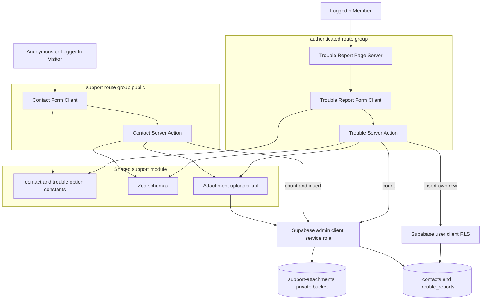
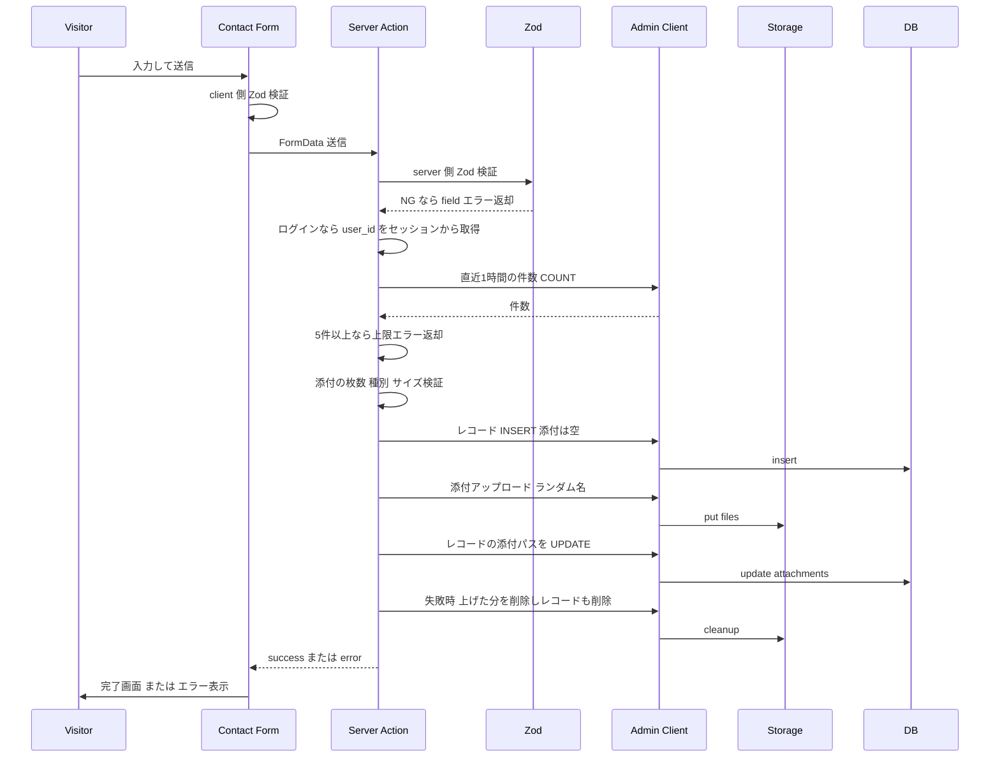

# Technical Design — support（問い合わせ・トラブル報告）

## Overview

本機能は、ユーザー向け「お問い合わせ」フォーム（COM-008）を全面改修し、新規「トラブル報告」フォーム（COM-012）を追加する。お問い合わせはログインの有無を問わず送信でき、トラブル報告はログイン必須とする。両者の送信データは管理者（admin）のみ閲覧できる構造で蓄積し、添付ファイルは非公開バケットに保管する。

**Users**: お問い合わせは未ログインの見込み客と既存ユーザー、トラブル報告はログイン済みの受注者・発注者・担当者が利用する。

**Impact**: 既存の `contacts` テーブル（姓名・5択・本文）を業務問い合わせ向けの構造へ組み替え、新規 `trouble_reports` テーブルと共通添付バケット `support-attachments` を追加する。管理画面（一覧・詳細）は本 spec の対象外であり、データの器までを構築する。

### Goals
- お問い合わせの 13 項目（基本情報・選択・案件情報・詳細・添付）をセクション化して収集する
- トラブル報告（氏名・相手・連絡先・種類・内容・添付）をログイン必須で収集し本人に紐付ける
- 添付（画像/PDF・最大5枚・各5MB）を安全に検証・保存する共通基盤を作る
- すべてのデータを admin 読み取り可・default deny の RLS で蓄積する（将来の admin 画面が乗る器）

### Non-Goals
- お問い合わせ／トラブル報告の **管理画面（admin 一覧・詳細）**（将来の admin spec）
- 添付ファイルの **閲覧 UI・署名付きURL 生成**（閲覧者が本 spec に存在しないため保存のみ）
- 管理者への新着通知メール
- 選択肢の管理画面編集（master テーブル化）。当面はコード定数

## Architecture

### Existing Architecture Analysis
- **保持する境界**: `(support)` ルートグループ（公開）、`(authenticated)` ルートグループ（要認証）、Server Action + Zod + RLS の三重防御、`createClient`（RLS 準拠）と `createAdminClient`（service role）の使い分け
- **維持する統合点**: middleware の `PUBLIC_PAGES`（`/contact` は公開済み・維持）。`/trouble-report` は未登録のため自動的に認証必須となる
- **対処する技術的負債**: 現行 `contact/actions.ts` のレート制限は admin 限定 SELECT の RLS により機能していない（research R2）。本設計で admin クライアント集計に修正する

### Architecture Pattern & Boundary Map



**Architecture Integration**:
- Selected pattern: **ハイブリッド**（既存お問い合わせを拡張＋トラブル報告/添付基盤を新規）。共通の `support` モジュール（定数・Zod・アップローダ）を両フォームで共有
- Domain boundaries: 公開フォーム（contacts）と認証フォーム（trouble_reports）を別ルートグループ・別テーブルに分離。書き込みクライアントを境界に応じて使い分け（research R3）
- Existing patterns preserved: Server Action + ActionResult、Zod client/server 検証、`createAdminClient` の server 専用利用、storage upload→`text[]` 保存
- New components rationale: トラブル報告は独立ライフサイクル・新テーブル。共通アップローダは厳格検証＋ランダム命名＋service role 保存を一箇所に集約
- Steering compliance: security.md（三重防御・許可リスト・ファイル名ランダム化・非公開バケット・PII の電話番号非公開）、CLAUDE.md（ボタン type 明示・shadcn Select・RHF 初期値同期）

### Technology Stack

| Layer | Choice / Version | Role in Feature | Notes |
|-------|------------------|-----------------|-------|
| Frontend | Next.js App Router / React（既存） | フォーム UI（client component）・サーバーページでのプリフィル取得 | shadcn Select × react-hook-form |
| Backend | Next.js Server Actions（既存） | 送信処理・検証・レート制限・アップロード | ActionResult 形式 |
| Data / Storage | Supabase Postgres + Storage（既存） | `contacts`・`trouble_reports`・`support-attachments` | RLS default deny |
| Validation | Zod（既存） | client/server 二重検証・許可リスト | 選択肢はラベル enum |
| Infra / Runtime | `next.config` serverActions | `bodySizeLimit` を `6mb`→`30mb` | 添付25MB対応（②） |

## System Flows

お問い合わせ送信フロー（トラブル報告も同型。差分は後述）:



**Key Decisions**:
- レート制限 COUNT は admin クライアント（RLS バイパス）。通常クライアントでは admin 限定 SELECT により常に 0 件となり機能しないため（research R2）
- 添付は「**レコード保存（添付空）→ アップロード → 添付パスを UPDATE**」の順（Issue2）。早期失敗では『添付なしレコード』が残るだけで**ファイルだけの孤児を避ける**。アップロード失敗時は上げた分の削除＋当該レコード削除で中断する（7.7）。添付パス UPDATE は service role で実施（`trouble_reports` は一般 UPDATE 禁止のため admin クライアントが必要）
- ステップ間のクラッシュ等による残余の孤児は稀・低影響として許容し、必要なら将来の回収ジョブで対応（design は best-effort を明記）
- **トラブル報告の差分**: 未ログインは middleware で `/login` へ。レコード INSERT は通常クライアント（RLS `WITH CHECK (user_id = auth.uid())` で本人強制）。COUNT・アップロード・クリーンアップ・添付パス UPDATE は admin クライアント

## Requirements Traceability

| Requirement | Summary | Components | Flows |
|-------------|---------|------------|-------|
| 1.1-1.5 | お問い合わせ送信（匿名/ログイン） | ContactForm, ContactAction | 送信フロー |
| 2.1-2.8 | 入力項目・セクション・検証・許可リスト | ContactForm, contactSchema, contact-options | 送信フロー |
| 3.1-3.4 | user_id をセッションから記録（⑥） | ContactAction | 送信フロー |
| 4.1-4.3 | レート制限（admin 集計）（①） | ContactAction, AdminClient | 送信フロー |
| 5.1-5.6 | トラブル報告 送信・本人紐付け・連投防止 | TroubleReportPage, TroubleForm, TroubleAction | 送信フロー（差分） |
| 6.1-6.4 | プリフィル・必須/任意・検証 | TroubleReportPage, troubleReportSchema | 送信フロー（差分） |
| 7.1-7.7 | 添付 検証・保存・命名・孤児防止（②③） | AttachmentUploader | 送信フロー |
| 8.1-8.7 | RLS・バケット admin 専用（④） | Migration, RLS | — |
| 9.1-9.3 | 選択肢ラベル保存・定数管理 | contact-options, trouble-options | — |
| 10.1-10.4 | 導線・戻る・画面ID | mypage SUPPORT_MENU, BackButton, screen-map | — |

## Components and Interfaces

| Component | Layer | Intent | Req | Key Dependencies | Contracts |
|-----------|-------|--------|-----|------------------|-----------|
| AttachmentUploader | Shared/Service | 添付の検証・service role 保存・クリーンアップ | 7.1-7.7 | createAdminClient (P0) | Service |
| contact-options / trouble-options | Shared/Const | 選択肢ラベル定義 | 9.1-9.3 | — | State |
| contactSchema / troubleReportSchema | Shared/Validation | client/server 二重検証 | 2.x,6.x | Zod (P0) | Service |
| ContactAction | Backend | 検証・レート制限・保存（admin） | 1,2,3,4,7 | AttachmentUploader(P0), createAdminClient(P0) | Service |
| ContactForm | UI | 公開フォーム（セクション/Select/添付） | 1,2 | contactSchema, options | State |
| TroubleReportPage | UI(Server) | プリフィル取得（氏名・メール） | 6.1 | createClient(P0) | — |
| TroubleForm | UI | 認証フォーム | 5,6 | troubleReportSchema, options | State |
| TroubleAction | Backend | 検証・連投防止・本人 INSERT・保存 | 5,6,7 | AttachmentUploader(P0), createClient(P0), createAdminClient(P1) | Service |
| Migration | Data | contacts 組み替え・trouble_reports・bucket・RLS | 8 | — | — |

### Shared / Service

#### AttachmentUploader

| Field | Detail |
|-------|--------|
| Intent | 添付ファイルを検証し service role で非公開バケットへ保存、失敗時はクリーンアップ |
| Requirements | 7.1, 7.2, 7.3, 7.4, 7.5, 7.6, 7.7 |

**Responsibilities & Constraints**
- 枚数（≤5）・種別（image/jpeg, image/png, application/pdf）・サイズ（≤5MB/file）・MIME と拡張子の両検証
- ファイル名を `randomUUID().ext` に変換（元名を保存しない）。パス接頭辞は呼び出し側指定（`contact` / `trouble/{userId}`）
- 保存は `createAdminClient()`（バケットは公開ポリシー無し＝service role のみ）
- 部分保存を残さない（アップロード途中失敗時は成功分を削除）

**Dependencies**
- Outbound: `createAdminClient` — Storage への put/remove（P0）

**Contracts**: Service ✓

##### Service Interface
```typescript
const SUPPORT_ATTACHMENT_RULES = {
  maxFiles: 5,
  maxBytesPerFile: 5 * 1024 * 1024,
  allowedMimeTypes: ["image/jpeg", "image/png", "application/pdf"],
  allowedExtensions: ["jpg", "jpeg", "png", "pdf"],
} as const;

type UploadResult =
  | { success: true; paths: string[] }
  | { success: false; error: string };

interface AttachmentUploader {
  // files から空ファイルを除外し検証→アップロード。失敗時は内部でクリーンアップ
  upload(files: File[], pathPrefix: string): Promise<UploadResult>;
  // レコード保存失敗時に呼ぶ明示クリーンアップ
  remove(paths: string[]): Promise<void>;
}
```
- Preconditions: `files` は FormData 由来の `File[]`。`pathPrefix` は信頼できるサーバー生成値
- Postconditions: success 時は保存済みパス配列を返す。failure 時はバケットに本呼び出し由来のファイルを残さない
- Invariants: 元ファイル名を保存パスに含めない

**Implementation Notes**
- Integration: 両 Server Action から呼ぶ。`createAdminClient` は server 専用（漏洩禁止）
- Validation: `file.size`/`file.type` を直接検査（`z.instanceof(File)` は使わない）＋拡張子照合
- Risks: 匿名大容量（公開フォーム固有・残余許容）。`bodySizeLimit` 引き上げが前提（②）

### Backend

#### ContactAction

| Field | Detail |
|-------|--------|
| Intent | お問い合わせを検証・レート制限・admin クライアントで保存 |
| Requirements | 1.3, 1.5, 2.7, 2.8, 3.1, 3.2, 3.4, 4.1, 4.2, 4.3, 7.x |

**Responsibilities & Constraints**
- FormData をパース → `contactSchema` で server 検証 → ログイン中なら `user_id` を **セッションから**取得（FormData からは取らない）
- レート制限: admin クライアントで同一 email の直近1時間 COUNT、5件以上で拒否
- 添付は AttachmentUploader で保存。レコード INSERT は admin クライアント。INSERT 失敗時はアップロード済みを remove
- `contacts` の公開 INSERT ポリシーは削除済みのため、書き込みは本 Action（service role）のみ

**Dependencies**
- Outbound: AttachmentUploader（P0）, `createAdminClient`（P0）, `createClient`（P1: getUser でログイン判定）

**Contracts**: Service ✓
```typescript
function submitContactAction(formData: FormData): Promise<ActionResult>;
// ActionResult = { success: true } | { success: false; error: string }
```
- Preconditions: なし（匿名可）
- Postconditions: success 時 `contacts` に1行追加（添付ありなら attachments にパス）
- Invariants: `user_id` はセッション由来のみ。レコードと添付が常に整合

**Implementation Notes**
- Integration: 既存 `contact/actions.ts` を置き換え
- Validation: client/server で `contactSchema`。選択肢は許可リスト enum
- Risks: レート制限を必ず admin クライアントで集計（①の再発防止）

#### TroubleAction

| Field | Detail |
|-------|--------|
| Intent | トラブル報告を検証・連投防止・本人として保存 |
| Requirements | 5.3, 5.4, 5.6, 6.2, 6.4, 7.x |

**Responsibilities & Constraints**
- `getUser()` で認証必須を確認（未ログインは拒否。middleware と二重）
- `troubleReportSchema` で server 検証。`user_id` は `auth.uid()`（本人）固定
- 連投防止: admin クライアントで同一 user_id の直近1時間 COUNT、5件以上で拒否
- 添付は AttachmentUploader（prefix=`trouble/{userId}`）。**レコード INSERT は通常クライアント**（RLS `WITH CHECK user_id = auth.uid()` で本人強制）。INSERT 失敗時はアップロード済みを remove

**Dependencies**
- Outbound: `createClient`（P0: getUser + insert）, AttachmentUploader（P0）, `createAdminClient`（P1: count）

**Contracts**: Service ✓
```typescript
function submitTroubleReportAction(formData: FormData): Promise<ActionResult>;
```
- Preconditions: ログイン済み
- Postconditions: success 時 `trouble_reports` に本人 user_id で1行追加
- Invariants: 他人の user_id では保存不可（RLS）。レコードと添付が整合

### UI

#### ContactForm（client）/ TroubleForm（client）/ TroubleReportPage（server）
- ContactForm: 5セクション（基本情報／お問い合わせについて／案件情報／動画掲載の相談／詳細・添付）。選択は shadcn Select（単一）。送信ボタンは `type="submit"`、その他は `type="button"`
- TroubleReportPage（server component）: `getUser()` と `users` から氏名・メールを取得し、TroubleForm へ初期値として渡す
- TroubleForm: 氏名・相手氏名・メール（初期値編集可）・種類（任意 Select）・内容・添付。RHF の初期値は `useForm({ defaultValues })`
- 両フォーム: BackButton を設置。`success: false` 時は `toast.error(result.error)`。完了時は受付メッセージ画面

**Implementation Notes（共通）**
- **添付ファイルの扱い（Issue3）**: File は react-hook-form の管理外（`useState` または uncontrolled input）で保持し、onSubmit で FormData に手動 append する（RHF は File を扱わないため。既存 `contact/page.tsx` の FormData 手組みを踏襲）。枚数・種別・サイズは client でも軽く検証してフィードバックする（最終判定はサーバーの AttachmentUploader）
- Validation: 送信時 `handleSubmit`。プリフィル項目（トラブル報告の氏名・メール）は E2E で `toHaveValue` 同期待ち後に `.clear()` してから操作
- Risks: shadcn Select の E2E は 2段クリック。フォーム内ボタンの `type` 明示（送信は submit、その他は button）

## Data Models

### Physical Data Model

**`contacts`（ALTER：旧 `last_name`/`first_name`/`contact_types`/`content` を DROP、以下を ADD）**

| Column | Type | Null | Note |
|--------|------|------|------|
| id | uuid PK | NO | 既存 |
| created_at | timestamptz | NO | 既存 default now() |
| user_id | uuid FK→users(id) ON DELETE SET NULL | YES | ログイン中のみ記録（⑥） |
| company_name | text | NO | 会社名／屋号 |
| name | text | NO | 氏名（1欄） |
| phone | text | NO | 電話番号（admin のみ閲覧） |
| email | text | NO | 既存 |
| address | text | YES | 所在地 |
| inquiry_type | text | NO | お問い合わせ内容（ラベル） |
| purpose | text | NO | 利用目的（ラベル） |
| industry | text | NO | 業種・職種（ラベル。`user_skills.trade_type` と区別） |
| project_description | text | YES | 工事内容 |
| project_area | text | YES | 工事エリア |
| video_consultation | text | YES | 動画掲載の相談（ラベル） |
| detail | text | NO | 問い合わせ詳細 |
| attachments | text[] | YES | 添付パス |

**`trouble_reports`（新規）**

| Column | Type | Null | Note |
|--------|------|------|------|
| id | uuid PK default gen_random_uuid() | NO | |
| user_id | uuid FK→users(id) ON DELETE SET NULL | YES | 報告者（本人）。ユーザー削除時は null 化し記録は残す（contacts と整合）。INSERT 時は RLS で本人必須 |
| reporter_name | text | NO | 氏名 |
| counterparty_name | text | NO | トラブル相手の氏名 |
| email | text | NO | 連絡先 |
| category | text | YES | トラブル種類（ラベル・任意） |
| content | text | NO | 内容 |
| attachments | text[] | YES | 添付パス |
| created_at | timestamptz | NO | default now() |

### RLS / Storage（Consistency & Integrity）

| 対象 | SELECT | INSERT | UPDATE/DELETE |
|------|--------|--------|----------------|
| contacts | admin のみ（`contacts_select_admin` 維持） | **公開ポリシー削除**（service role 経由のみ） | なし |
| trouble_reports | admin のみ（`is_admin(auth.uid())`） | authenticated `WITH CHECK (user_id = auth.uid())` | なし |
| support-attachments (bucket, public=false) | storage.objects に本バケット向けポリシー無し＝default deny（service role のみアクセス） | 同左 | 同左 |

- 全テーブル・バケットで RLS 有効・default deny（8.1）
- `contacts` の公開 INSERT 削除により直接書き込み口を塞ぐ（research R3）

### Data Contracts（API Data Transfer）
- 入力は `multipart/form-data`（FormData）。選択肢フィールドは許可リスト enum（Zod）。添付は `File[]`
- 出力は `ActionResult`（`{ success, error? }`）。エラーメッセージは日本語・内部情報を含めない

## Error Handling

### Error Strategy
- **User Errors（入力）**: Zod による field 単位エラー（client/server 両方）。未入力・メール形式不正は該当項目に日本語表示し送信中断
- **Business Logic Errors**: レート制限超過 → 上限到達メッセージ。トラブル報告の未認証 → 拒否（middleware と二重）
- **System Errors**: 添付アップロード失敗・DB 保存失敗 → 日本語の汎用エラー＋技術詳細は非表示。保存失敗時はアップロード済みファイルをクリーンアップ

### Monitoring
- 保存・アップロード失敗は `console.error` でログ（パスワード等の機密は出さない）。監査ログ・添付アクセスログは admin 画面実装時（将来）に追加

## Testing Strategy

### Unit Tests（Vitest・Supabase クライアントをモック、{data,error} 形状を再現、成功/異常 両系）
- ContactAction: 匿名送信成功 / ログイン時に user_id を記録 / レート制限が admin 集計で発火 / Zod 検証エラー / 添付の種別・サイズ拒否 / アップロード失敗時に remove 呼び出し（部分保存なし）
- TroubleAction: 成功時 user_id=本人 / 未ログイン拒否 / 連投防止 / Zod 検証 / 添付クリーンアップ
- AttachmentUploader: 枚数超過・MIME 不一致・拡張子不一致・サイズ超過の各拒否 / ランダム命名

### Integration / RLS Tests（pgTAP・seed と重複しない専用 UUID）
- contacts: 非 admin は SELECT 0 件 / 公開 INSERT 不可（service role 以外）/ admin は SELECT 可
- trouble_reports: admin のみ SELECT / 本人は INSERT 可・他人 user_id は不可 / UPDATE・DELETE はデータ不変を `is()` で検証
- **support-attachments バケット（Issue1）**: `storage.buckets.public = false` を assert し、本バケットを許可する `storage.objects` ポリシーが存在しないこと（＝ default deny で service role のみアクセス）を `pg_policies` の照合で assert する

### E2E Tests（Playwright・shadcn Select は2段クリック・プリフィルは toHaveValue 後に操作）
- お問い合わせ: 匿名で全項目入力＋添付＋送信→完了画面 / ログイン中でも送信可
- トラブル報告: ログイン→フォームに氏名・メールがプリフィル→入力＋添付＋送信→完了
- 導線: マイページ→「トラブル報告」クリックで到達（ロール別導線スモーク）

## Security Considerations
- 公開フォームの添付は service role 代行・厳格検証・ランダム命名・非公開バケットで保護。`bodySizeLimit` を 30mb に引き上げ（②）
- `user_id` はセッション由来のみ（なりすまし防止・⑥）。トラブル報告は RLS で本人 INSERT を強制
- 電話番号は admin のみ閲覧（公開しない・security.md PII 方針）
- 匿名大容量・連投の残余リスクは枚数/サイズ/種別制限＋レート制限で許容範囲に抑制（Req 非機能⑤）

## Migration Strategy
- 新 migration 1本: `contacts` ALTER（旧4列 DROP・新規列 ADD）→ `trouble_reports` CREATE → `support-attachments` バケット CREATE → RLS（contacts 公開 INSERT 削除・trouble_reports ポリシー作成）。直後に `supabase gen types` で型再生成し、旧 contacts 参照（action/page/validations/tests）を同一タスクで更新
- `db reset` 後は空テーブルへの ALTER のため安全。**本番にデータ投入後は NOT NULL 追加に DEFAULT/backfill が必要**（現状は本番データ無し・将来の注意点）
