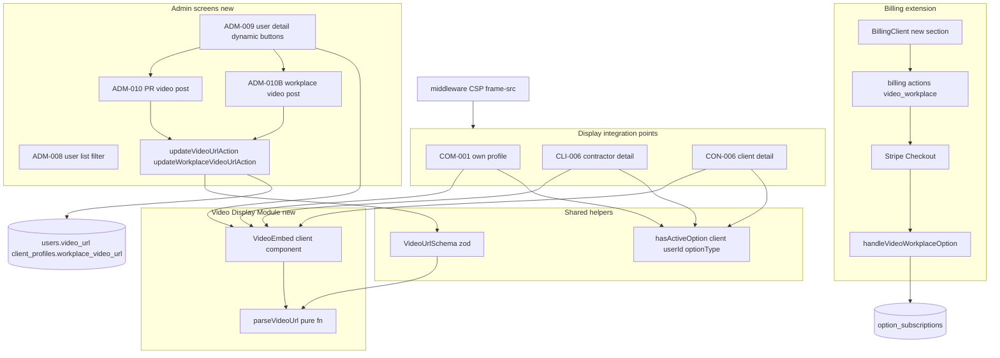
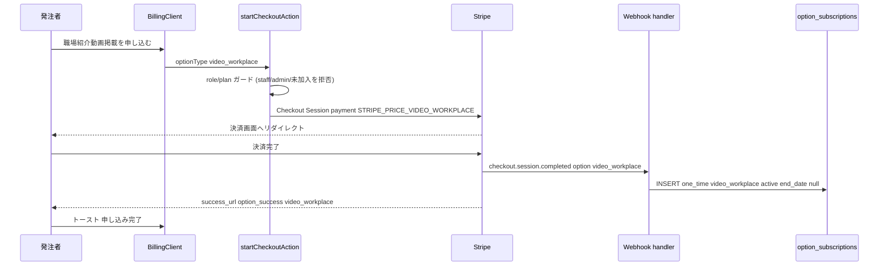
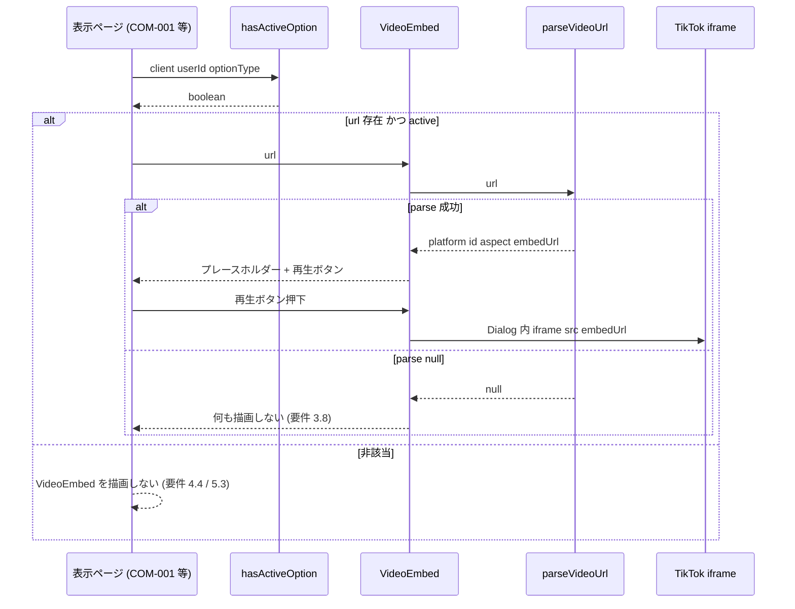

# Technical Design — video-display

## Overview

**Purpose**: ビジ友の動画掲載体験を、(1) 発注者向け新商品「職場紹介動画掲載」の追加、(2) 既存「動画掲載」(受注者PR動画) の外部リンク → ページ内 iframe 埋込再生への刷新、(3) 動画埋込の共通抽象化レイヤー `parseVideoUrl()` + `<VideoEmbed>` の導入、の 3 軸で改善する。

**Users**: 発注者（個人/小規模/法人 Owner）はオプション購入で職場紹介動画を CON-006 に掲載でき、受注者は PR 動画を各プロフィール画面でページ内再生される。運営担当者は ADM-009/010/010B で TikTok URL を代理登録する。

**Impact**: 既存 `option_subscriptions.option_type='video'`（受注者PR）の意味論は据置のまま `'video_workplace'`（職場紹介）を新規追加。`client_profiles.workplace_video_url` カラムを新設。動画表示を「URL 存在のみ」から「URL 存在 **かつ** active option」の AND 条件へ変更（過去購入・解約済ユーザーは非表示になる仕様準拠の挙動変更）。CSP `frame-src` を新規付与。管理者画面 4 枚（ADM-008/009/010/010B）を新規実装する。

### Goals
- TikTok 動画をページ内ライトボックスで埋込再生する共通コンポーネントを提供し、受注者PR動画と職場紹介動画の表示を統一する
- 職場紹介動画オプションを既存課金パターンの最小拡張（分岐追加）で実装し、受注者PR動画の課金・運用に影響を与えない
- 将来のプラットフォーム追加（YouTube/Vimeo 等）を `parseVideoUrl` の PATTERNS エントリ 1 行で対応可能にする

### Non-Goals
- TikTok 短縮 URL（`vt.tiktok.com`）/ 共有 URL（`tiktok.com/t/`）/ モバイル URL の対応（Phase 1 は標準閲覧 URL のみ）
- oEmbed API による動画サムネの動的取得（Phase 1 は静的プレースホルダー）
- YouTube / Vimeo 等の実プラットフォーム追加（抽象化の器のみ用意）
- 職場紹介動画の解約 UI / ユーザー自身による URL 編集 UI（買い切り + 運営代理投稿運用）
- 管理者機能全体の実装（本 spec は動画投稿に必要な ADM-008/009/010/010B のみ）
- 完全な Content-Security-Policy（`default-src` 等）の導入（本機能は `frame-src` のみ）

## Architecture

### Existing Architecture Analysis

本機能は既存システムへの拡張であり、以下の既存パターン・境界を尊重する:

- **課金フロー**: `billing/actions.ts`（Checkout Session 生成）→ Stripe → `webhook/handle-checkout-completed.ts`（`option_subscriptions` INSERT）。option は `metadata.option_type` で分岐する確立済パターン。`option_type` は CHECK 制約なしの `text` のため新値は DB 変更不要
- **発注者表示名/プロフィール**: `client_profiles` に一元化（CLAUDE.md 準拠）。SELECT は公開（`USING (true)`）
- **RLS 二重防御**: `option_subscriptions` の SELECT は `user_id = auth.uid()` OR `is_admin()`。cross-user 参照は admin client 必須（CLAUDE.md「組織テーブルの RLS と admin client」と同型）
- **管理者ルート**: middleware が `/admin/*` を `role='admin'` に制限済（gap-analysis 1.6）。route group 自体は未実装
- **shadcn/ui Dialog** を既存資産として流用（`src/components/ui/dialog.tsx`）

addressed technical debt: COM-001 の「`video_url` 存在のみで描画」を spec（active 判定）に同期する。

### Architecture Pattern & Boundary Map

採用パターン: **Hybrid（gap-analysis Option C）**。課金周辺は既存パターン拡張、表示層は独立した新規共通モジュール、管理者画面は新規実装。



**Architecture Integration**:
- 選択パターン: Hybrid（課金=拡張 / 表示=新規独立モジュール / 管理者=新規）
- ドメイン境界: 「動画 URL 解析・埋込」(`src/lib/video-embed.ts` + `src/components/video-embed/`) と「課金」「管理者投稿」「active 判定」を分離。表示モジュールは課金を知らず、URL 文字列のみを入力にとる
- 既存パターン保持: option 課金分岐、`client_profiles` 一元化、RLS + admin client、shadcn Dialog
- 新規コンポーネント根拠: `parseVideoUrl`/`VideoEmbed`（要件 3）、`hasActiveOption`（4 画面の重複排除）、`VideoUrlSchema`（二重防御）、管理者画面（既存資産ゼロ）
- Steering 準拠: Server Component デフォルト、Server Actions、`@/` import、Tailwind のみ、フォーム内ボタン `type` 明示、admin client での cross-user 読取

### Technology Stack

| Layer | Choice / Version | Role in Feature | Notes |
|-------|------------------|-----------------|-------|
| Frontend | Next.js 16 (App Router) / React Server Components | 表示画面・管理者画面 | `<VideoEmbed>` のみ `"use client"`（Dialog/state） |
| UI | shadcn/ui `Dialog`（Radix UI） / Tailwind v4 | ライトボックス埋込 | 既存資産流用 |
| 動画埋込 | TikTok 公式 iframe プレイヤー `player/v1/{id}` | 埋込再生 | **embed.js 不要**（research.md 参照） |
| Backend | Server Actions / Stripe Node SDK | 課金・URL 更新 | 既存 `billing/actions.ts` 拡張 |
| Validation | Zod v4 | URL 検証（client+server 二重） | 新規 `src/lib/validations/video.ts` |
| Data | Supabase Postgres | `client_profiles.workplace_video_url` 追加 | migration 1 本、CHECK 制約変更なし |
| Security | middleware response header | CSP `frame-src` | `default-src` 無しのスコープ限定 |

新規依存ライブラリは**なし**（TikTok iframe はスクリプトロード不要）。

## Requirements Traceability

| Requirement | Summary | Components | Interfaces | Flows |
|-------------|---------|------------|------------|-------|
| 1.1–1.6 | 職場紹介動画オプション購入 | Billing extension, Webhook | `startCheckoutAction`, `priceIdForOption`, `handleVideoWorkplaceOption` | Purchase flow |
| 2.1–2.8 | 管理者 URL 登録・更新 | ADM-009/010/010B, AdminActions | `updateVideoUrlAction`, `updateWorkplaceVideoUrlAction`, `VideoUrlSchema` | Admin post flow |
| 3.1–3.10 | VideoEmbed 共通コンポーネント + CSP | VideoEmbed module, middleware | `parseVideoUrl`, `<VideoEmbed>`, `PATTERNS` | Playback flow |
| 4.1–4.6 | 受注者PR動画表示（refactor） | COM-001, CLI-006, ADM-009, hasActiveOption | `hasActiveOption`, `<VideoEmbed>` | Playback flow |
| 5.1–5.4 | 職場紹介動画表示 | CON-006, hasActiveOption | `hasActiveOption`, `<VideoEmbed>` | Playback flow |
| 6.1–6.4 | ADM-008 フィルター更新 | ADM-008 | option_subscriptions サーバー側フィルタ | — |
| 7.1–7.5 | CLI-026 オプション表示 | BillingClient | 発注者プラン判定 | Purchase flow |
| 8.1–8.7 | 既存運用・データ整合性 | 全般 | `option_type` 据置, status 連動非表示 | — |

## System Flows

### 職場紹介動画オプション購入フロー（要件 1, 7）



ゲーティング: `startCheckoutAction` は staff/admin（既存 `actions.ts:154` 拒否）に加え、発注者プラン未加入（`subscriptions` に active な発注者 plan が無い）を拒否。UI 側でもボタン非活性（要件 7.3/7.4）。

### 動画表示・再生フロー（要件 3, 4, 5）



gating 条件: 表示判定は `video_url != null && hasActiveOption(...)` の AND（要件 4.1/5.1）。`parseVideoUrl` が null の場合フォールバックリンクを出さずサイレント非表示（要件 3.8）。

## Components and Interfaces

| Component | Domain/Layer | Intent | Req Coverage | Key Dependencies (P0/P1) | Contracts |
|-----------|--------------|--------|--------------|--------------------------|-----------|
| `parseVideoUrl` | Lib (pure) | URL → 埋込メタ抽出 or null | 3.1–3.3, 8.5 | なし | Service |
| `<VideoEmbed>` | UI (client) | プレースホルダー + Dialog iframe 再生 | 3.4–3.8, 4, 5 | parseVideoUrl (P0), Dialog (P1) | State |
| `hasActiveOption` | Lib (billing) | active option 判定（cross-user は admin client） | 4.1–4.4, 5.1, 5.3 | Supabase client (P0) | Service |
| `VideoUrlSchema` | Lib (validation) | サーバー側 URL 検証（二重防御） | 2.3–2.5, 8.6 | parseVideoUrl (P0) | Service |
| Billing extension | Server Action | video_workplace 購入分岐 | 1.1, 7.x | Stripe (P0), 既存 actions (P0) | Service |
| `handleVideoWorkplaceOption` | Webhook | option_subscriptions INSERT | 1.3 | admin client (P0) | Event |
| `updateVideoUrlAction` / `updateWorkplaceVideoUrlAction` | Server Action | URL 登録/更新/空更新 | 2.3–2.6 | VideoUrlSchema (P0), admin client (P0) | Service |
| ADM-008/009/010/010B | UI (admin) | 一覧フィルタ / 動的ボタン / 投稿フォーム | 2.1–2.2, 2.7–2.8, 6 | AdminActions (P0), VideoEmbed (P1) | — |
| CSP frame-src | middleware | TikTok iframe 許可 | 3.9, 3.10 | 既存 middleware (P0) | — |
| DB migration | Data | workplace_video_url 追加 | 5.1, 8.x | — | — |

### Video Display Module（新規独立モジュール）

#### parseVideoUrl

| Field | Detail |
|-------|--------|
| Intent | 動画 URL からプラットフォーム判別し埋込メタを抽出、未対応/不正は null |
| Requirements | 3.1, 3.2, 3.3, 8.5 |
| Location | `src/lib/video-embed.ts`（pure function, server/client 両用） |

**Responsibilities & Constraints**
- 入力 URL を `PATTERNS` 配列に線形マッチし、最初に一致したエントリで `{ platform, id, aspect, embedUrl }` を構築
- ネットワーク I/O を行わない（純粋関数）。短縮/共有 URL は非対応（research.md / 要件 8.5）
- Phase 1 は TikTok 標準閲覧 URL のみ通過（`www.` 有無・末尾クエリ許容）

**Dependencies**
- Inbound: `<VideoEmbed>`, `VideoUrlSchema` — URL 解析 (P0)
- Outbound: なし
- External: なし

**Contracts**: Service [x]

##### Service Interface
```typescript
type VideoPlatform = "tiktok"; // 将来 "youtube" | "vimeo" を union 追加
type VideoAspect = "9/16" | "video"; // 縦長 | 16:9

interface ParsedVideo {
  platform: VideoPlatform;
  id: string;
  aspect: VideoAspect;
  embedUrl: string;
}

interface PlatformPattern {
  platform: VideoPlatform;
  /** new URL().hostname の完全一致判定（host 偽装を排除） */
  hostMatch: (hostname: string) => boolean;
  /** pathname から動画 id をキャプチャする正規表現 */
  pathMatch: RegExp;
  aspect: VideoAspect;
  buildEmbedUrl: (id: string) => string;
}

// hostMatch: new URL().hostname に対する判定（host 偽装を構造的に排除）
// pathMatch: pathname から id をキャプチャ
// 要件 3.2: 新規プラットフォーム対応 = この配列に 1 エントリ追加のみ
const PATTERNS: readonly PlatformPattern[] = [
  {
    platform: "tiktok",
    hostMatch: (h) => h === "tiktok.com" || h === "www.tiktok.com", // www 有/無を許容
    pathMatch: /^\/@[^/]+\/video\/(\d+)/,                            // 標準閲覧 URL
    aspect: "9/16",
    buildEmbedUrl: (id) => `https://www.tiktok.com/player/v1/${id}`,
  },
];

function parseVideoUrl(url: string): ParsedVideo | null;
```
- Preconditions: `url` は任意文字列（null/空も可。空は null を返す）
- Postconditions: 一致すれば `ParsedVideo`、未対応/不正は `null`
- Invariants: 同一 URL に対し常に同一結果（冪等・副作用なし）

**Implementation Notes**
- Integration: `<VideoEmbed>`（client）と `VideoUrlSchema`（server）の両方から import される唯一の解析源。client/server 二重防御を 1 関数で担保（要件 8.6）
- Validation: `new URL(url)` を try/catch で parse し、`hostname` を `hostMatch` で、`pathname` を `pathMatch` で検証する。host を hostname 完全一致で見ることで `evil.com/.tiktok.com/...` や query 文字列内 URL の誤許可を構造的に排除（regex を URL 文字列全体に当てる方式より堅牢）。さらに `embedUrl` は捕捉 id から常に `tiktok.com` ドメインで再構築するため、万一の誤許可でも埋込先は TikTok 固定で安全
- Risks: TikTok が URL 体系を変えると `hostMatch` / `pathMatch` が外れる → 単体テストで標準 URL 形を固定

#### VideoEmbed

| Field | Detail |
|-------|--------|
| Intent | プレースホルダー + 三角再生ボタン → Dialog ライトボックスで iframe 埋込再生 |
| Requirements | 3.4, 3.5, 3.6, 3.7, 3.8, 4.x, 5.x |
| Location | `src/components/video-embed/video-embed.tsx`（`"use client"`） |

**Responsibilities & Constraints**
- `parseVideoUrl(url)` が null なら **何も描画しない**（要件 3.8、外部リンクフォールバック無し）
- 静的プレースホルダー画像 + 中央の三角再生ボタンを描画（要件 3.4。Phase 1 はサムネ動的取得しない）
- 再生ボタン押下で shadcn `Dialog` を開き `<iframe src={parsed.embedUrl}>` を描画（要件 3.5）
- `aspect`=`"9/16"` は `aspect-[9/16]`、`"video"` は `aspect-video` でプレイヤー領域確保（要件 3.6/3.7）
- 自身は active 判定を**行わない**。表示可否は呼び出し側ページが `video_url && hasActiveOption(...)` で制御し、true のときのみ `<VideoEmbed>` をレンダリングする（関心分離）

**Dependencies**
- Inbound: COM-001/CLI-006/CON-006/ADM-009 — 動画描画 (P0)
- Outbound: `parseVideoUrl` (P0), shadcn `Dialog` (P1)
- External: TikTok iframe player（再生時のみ・CSP `frame-src` 必須） (P0)

**Contracts**: State [x]

##### Component Props
```typescript
interface VideoEmbedProps {
  /** users.video_url または client_profiles.workplace_video_url */
  url: string;
  /** プレースホルダーの aria-label / 見出し用（任意） */
  label?: string;
}
```

##### State Management
- State model: `open: boolean`（Dialog 開閉）のみ。`useState`
- Persistence & consistency: なし（揮発 UI 状態）
- Concurrency strategy: 単一 Dialog、同時再生考慮不要

**Implementation Notes**
- Integration: フォーム内に置かれる可能性に備え、再生ボタン・Dialog のトリガーは `<button type="button">` を明示（CLAUDE.md フォーム内ボタンルール）
- Validation: `iframe` に `allow="fullscreen"`、`title`/`aria-label` を付与（gap-analysis Unknown #4: Esc 閉じ・Tab トラップは Radix Dialog が標準提供）
- Risks: モバイル in-app browser で iframe 再生制限の可能性（要件 8.7 で TikTok 挙動に委ねる）。`dangerouslySetInnerHTML` は使用しない（src 構築のみ）

### Shared Helpers

#### hasActiveOption

| Field | Detail |
|-------|--------|
| Intent | 指定ユーザーが指定 option_type の active レコードを持つか判定 |
| Requirements | 4.1, 4.4, 5.1, 5.3 |
| Location | `src/lib/billing/options.ts`（新規） |

**Responsibilities & Constraints**
- `option_subscriptions` を `user_id` + `option_type` + `status='active'` で存在チェック
- **client を引数化**: COM-001/ADM-009 は通常 or admin、**CLI-006/CON-006 は admin（service-role）client を渡す**（RLS の cross-user 制約。research.md 参照）
- status は `'active'` のみ true。`'cancelled'`/`'expired'` は false（要件 8.3）

**Dependencies**
- Inbound: COM-001/CLI-006/CON-006/ADM-009 (P0)
- Outbound: Supabase client（呼び出し側が選択） (P0)
- External: なし

**Contracts**: Service [x]

##### Service Interface
```typescript
// 正準 option_type union（single source of truth, 要件 8.1）。
// 既存リテラルを 1 箇所に集約し、priceIdForOption / 各 schema / webhook 分岐が再利用する。
export type OptionType =
  | "video"            // 受注者PR動画（据置）
  | "video_workplace"  // 職場紹介動画（新規）
  | "urgent"
  | "compensation_5000"
  | "compensation_9800";

// 動画オプションのみのサブセット（表示判定で使用）
export type VideoOptionType = Extract<OptionType, "video" | "video_workplace">;

async function hasActiveOption(
  client: SupabaseClient<Database>,
  userId: string,
  optionType: VideoOptionType,
): Promise<boolean>;
```
- Preconditions: `userId` は対象ユーザー。cross-user の場合 `client` は admin client
- Postconditions: active レコード 1 件以上で `true`
- Invariants: 読み取り専用、副作用なし

**Implementation Notes**
- Integration: 4 画面の重複 SELECT を排除。`.eq("user_id", userId).eq("option_type", optionType).eq("status", "active").limit(1)` 相当
- Validation: cross-user 呼び出しで通常 client を渡すと RLS で常に空 → false の静かなバグ。design + E2E で client 種別を固定
- Risks: 同上。型 `VideoOptionType` で typo 防止

#### VideoUrlSchema

| Field | Detail |
|-------|--------|
| Intent | サーバー側 URL 検証（`parseVideoUrl` 通過 or 空文字許容） |
| Requirements | 2.3, 2.4, 2.5, 8.6 |
| Location | `src/lib/validations/video.ts`（新規） |

**Contracts**: Service [x]

##### Service Interface
```typescript
// 空文字 = 掲載停止（NULL 更新, 要件 2.6） / 非空 = parseVideoUrl 必須通過
const VideoUrlSchema = z
  .string()
  .trim()
  .refine((v) => v === "" || parseVideoUrl(v) !== null, {
    message: "対応プラットフォームの URL を入力してください",
  });
```
- Postconditions: 空文字 or 解析可能 URL のみ通過。それ以外は `message` でエラー（要件 2.5）
- Invariants: client（フォーム）と server（action）が同一 schema を共有 → 二重防御（要件 8.6）

### Billing Extension（既存パターン拡張）

#### Checkout Action（`billing/actions.ts` 拡張）

| Field | Detail |
|-------|--------|
| Intent | `video_workplace` 購入分岐を既存3箇所に追加 |
| Requirements | 1.1, 1.6, 7.3, 7.4 |

**Implementation Notes**（既存契約への delta のみ）
- **型集約（必須）**: 既存 `priceIdForOption` の独自 union・各 option schema・webhook の生文字列リテラルを、正準 `OptionType`（`src/lib/billing/options.ts` で定義、上記 `hasActiveOption` 参照）の再利用に統一する。これにより `video_workplace` 追加・将来の option 追加・リテラル typo がコンパイルで捕捉される（CLAUDE.md 型安全方針 / gap-analysis 10）
- `priceIdForOption` の引数型を `OptionType` にし、switch に `"video_workplace" → process.env.STRIPE_PRICE_VIDEO_WORKPLACE ?? ""` を追加（要件 1.1, 8.2）
- `buildSuccessUrl` に `case "video_workplace": return ${base}/billing?option_success=video_workplace`（要件 1.4）
- option 入力 schema を `videoOptionInputSchema` と並列に `videoWorkplaceOptionInputSchema`（`optionType: z.literal("video_workplace")`）追加、union に合流
- 発注者プラン未加入ガード: Checkout 前に `subscriptions` を確認し `plan_type IN ('individual','small','corporate','corporate_premium') AND status='active'` を満たさなければ拒否（要件 7.3）。staff/admin は既存 `actions.ts:154` で拒否（要件 1.2/7.4）
- Risks: `STRIPE_PRICE_VIDEO_WORKPLACE` 未設定で空文字 → Stripe エラー。`.env.local.example` に追記（CLAUDE.md 設定ファイルルール）

#### handleVideoWorkplaceOption（`handle-checkout-completed.ts` 拡張）

**Contracts**: Event [x]

- `handleOptionCheckout` の switch に `if (optionType === "video_workplace") { await handleVideoWorkplaceOption(admin, session, userId); return; }` を追加（要件 1.3）
- `handleVideoWorkplaceOption` は既存 `handleVideoOption` の clone。INSERT 値は `option_type: "video_workplace"` のみ差し替え（`payment_type:"one_time"`, `status:"active"`, `end_date:null`, `start_date` は DB default）
- Event Contract: Subscribed = `checkout.session.completed`（`metadata.type='option'`, `metadata.option_type='video_workplace'`）。冪等性は既存 webhook の event dedupe（`stripe_webhook_events`）に委ねる

#### BillingClient 新セクション（CLI-026, 要件 7）

Summary-only（presentational）。既存「動画掲載」セクション（`BillingClient.tsx:473-493`）を複製し、文言・`handleOptionCheckout("video_workplace")`・`disabled` 条件を差し替えた「職場紹介動画掲載」行を直下に追加。

**Implementation Note**: 既存「動画掲載」行は一切変更しない（要件 7.5）。新行は金額「100,000円/動画」・説明「現場や会社の雰囲気を伝える動画を、発注者詳細画面に掲載します。」・ボタン「職場紹介動画掲載を申し込む」。`disabled` は `pending || isStaff || !isClientPlanActive`。`isClientPlanActive` は BillingClient が既に受け取る props から導出する: `currentPlan` が `PAID_PLAN_TYPES`（`individual/small/corporate/corporate_premium`）に含まれ **かつ `!isPastDue`**（past_due は延滞解消まで購入不可、要件 7.3）。新規 prop 追加は不要。

### Admin Screens（新規実装、要件 2, 6）

#### Admin シェルとスコープ境界（必読）

admin route group 自体が未実装（gap-analysis 1.6）のため、本 spec では以下を**新規作成タスク**として明示する:
- `src/app/admin/`（または既存 route group 規約に合わせた）**route group + layout + 共通ナビ**の新設
- **role ガード**: middleware は `/admin/*` を `role='admin'` に制限済（gap-analysis 1.6）。各 admin page でも `role='admin'` を再チェック（三重防御）
- **エントリルートの整合（必須・現状 404 リスク）**: middleware は admin を `/admin/dashboard` へ redirect する（`src/middleware.ts:354/365/377`）が、このページは未実装。admin ログイン直後に 404 になるため、本 spec で **`/admin/dashboard` の最小ランディング**（ADM-008 への導線を置くだけで可）を作るか、middleware の redirect 先を `/admin/users`（ADM-008）に変更するか、いずれかを admin シェルタスクに含める

**スコープ境界（決定事項）**: ADM-008/009 は汎用管理画面だが、本 spec は**「動画運用に必要な最小サーフェスのみ」**を実装する video-scoped スタブとする。
- ADM-008: ユーザー一覧 + 「オプションプラン加入者」フィルタ（要件 6）。各行の表示列は screen-map.md ADM-008 定義（氏名・年齢・メールアドレス・退会済み表示、20 件ページネーション、氏名/メール キーワード検索）に従う。フィルタ以外の高度な管理機能は将来の admin spec で拡張
- ADM-009: ユーザー詳細のうち、動画投稿ボタン動的表示（要件 2.1/2.2）+ PR動画表示（要件 4.3）に必要な範囲。screen-map.md ADM-009 定義の他項目（基本情報・能力・評価等）は将来 admin spec で拡張
- 本 spec で作る admin シェル・画面は将来の admin 全体 spec が拡張する前提で、過剰な作り込みをしない（YAGNI）。逆に「動画に必要な導線（ログイン→`/admin/dashboard`→ADM-008→009→010/010B）」は完結させる

#### ADM-008 ユーザーアカウント一覧（フィルター）

Summary-only。「オプションプラン加入者」プルダウンを 4 単一選択（動画掲載(受注者PR) / 職場紹介動画掲載 / 補償¥5,000 / 補償¥9,800）で実装。

**Implementation Note**: 絞り込みは**サーバー側**で適用（CLAUDE.md「一覧の検索フィルタはサーバー側」）。`option_subscriptions` で active な対象 option_type を持つ user_id 集合を取り、メインクエリに `.in("id", ids)`。未選択は絞り込みなし（要件 6.4）。URL searchParams を SSOT に（CLAUDE.md router.back 不整合対策）。

#### ADM-009 ユーザーアカウント詳細（動的ボタン + PR動画表示）

| Field | Detail |
|-------|--------|
| Intent | 購入オプションに応じ 0/1/2 個の投稿ボタンを動的表示、PR動画を VideoEmbed 描画 |
| Requirements | 2.1, 2.2, 4.3 |

**Implementation Note**: 対象ユーザーの active option を判定（admin 画面なので通常 client でも admin ポリシーで読めるが、一貫性のため admin client 使用可）。active `'video'` あれば「受注者PR動画を投稿する」→ ADM-010 リンク、active `'video_workplace'` あれば「職場紹介動画を投稿する」→ ADM-010B リンクを表示（要件 2.1）。どちらも無ければボタン 0 個（要件 2.2）。PR動画は `video_url && hasActiveOption('video')` で `<VideoEmbed>` 描画（要件 4.3）。

#### ADM-010 / ADM-010B 動画投稿フォーム

| Field | Detail |
|-------|--------|
| Intent | TikTok URL 入力 → 検証 → 対応カラム更新（空更新で掲載停止） |
| Requirements | 2.3–2.8 |

両画面は**同一レイアウト**（URL 入力 + 更新ボタン + 現在の登録 URL 表示 + もどる、要件 2.8）。差分は対象カラムと Server Action のみ。

##### updateVideoUrlAction / updateWorkplaceVideoUrlAction（Server Action）

**Contracts**: Service [x]
```typescript
// 戻り値は steering 標準形
type ActionResult = { success: true } | { success: false; error: string };

async function updateVideoUrlAction(
  formData: FormData,
): Promise<ActionResult>;          // users.video_url を更新

async function updateWorkplaceVideoUrlAction(
  formData: FormData,
): Promise<ActionResult>;          // client_profiles.workplace_video_url を更新
```
- 検証: `VideoUrlSchema` で `parseVideoUrl` 通過 or 空文字を判定（要件 2.3/2.4）。失敗時 `success:false` + 日本語メッセージ（要件 2.5、CLAUDE.md toast ルール）
- 空文字 → 対応カラムを `NULL` 更新（要件 2.6）
- 認可: admin role（middleware `/admin/*` ガード + action 内 role 再チェック）。**admin（service-role）client** で UPDATE（RLS バイパス、gap-analysis 1.3）
- Implementation Note: フォーム送信ボタンは `type="submit"`、もどるは `type="button"`。現在の登録 URL 表示・未登録時「未登録」（要件 2.7）

### Cross-cutting: CSP（middleware, 要件 3.9, 3.10）

Summary-only。既存 `src/middleware.ts` の response に `Content-Security-Policy: frame-src 'self' https://www.tiktok.com` を付与。

**Implementation Note**: `default-src` 等は付けず `frame-src` のみ（他リソース無制限維持で回帰ゼロ。research.md 参照）。既存ページは iframe 未使用のため影響なし（gap-analysis 1.5）。将来プラットフォーム追加時はドメインを追記（要件 3.10）。

### Display Integration（要件 4, 5）

| Screen | File | 変更 | client 種別 |
|--------|------|------|-------------|
| COM-001 | `profile/page.tsx:305-319` | テキストリンク → `<VideoEmbed>` 全置換 + active 判定追加（要件 4.5/4.1） | 通常（自分） |
| CLI-006 | `users/contractors/[id]/page.tsx` | PR動画セクション新規（要件 4.6/4.2） | **admin**（cross-user） |
| CON-006 | `clients/[id]/page.tsx` | アクションボタン直下・募集職種より上に職場紹介動画（要件 5.2） | **admin**（cross-user） |
| ADM-009 | 新規 | PR動画セクション（要件 4.3） | admin |

CON-006 の SELECT に `client_profiles(... , workplace_video_url)` を追加（要件 5.1、対象は `.eq("role","client")` の Owner 単一、要件 5.4）。

## Data Models

### Physical Data Model

**Migration（1 本）**: `client_profiles` にカラム追加
```sql
ALTER TABLE client_profiles ADD COLUMN workplace_video_url text;
-- NULL 許容、default なし、index 不要、CHECK なし（URL 検証はアプリ層）
```
- 既存 RLS（SELECT 公開 `USING (true)` / 書き込みは own）で十分。運営更新は admin client（RLS バイパス）
- `users.video_url` は既存・据置（受注者PR用）

**option_subscriptions（スキーマ変更なし）**: `option_type text` は CHECK 制約なしのため `'video_workplace'` 文字列 INSERT に DDL 不要（gap-analysis 1.2）。INSERT 列は既存 `'video'` と同一形（`payment_type:'one_time'`, `stripe_payment_intent_id`, `status:'active'`, `end_date:NULL`）。

### Data Contracts & Integration
- **active 判定の意味論**: 表示は `url != NULL AND status='active'` の AND。解約/期限切れは URL を保持しつつ非表示（要件 8.3）。`option_subscriptions` は物理削除しない（要件 8.4、status 変更のみ）。この「URL 保持 + オプション有効判定で非表示」は steering で既定済（`database-schema.md:413`）であり、本実装は既存ステアリングへの準拠（COM-001 が現状 `video_url` 存在のみで描画している実装上の乖離を解消する）。なお one_time の `'video'` は `end_date=NULL` で自動失効しないため、実害は admin 主導の cancel / URL 直書きレガシーに限定（血流範囲は小）
- **option_type 据置**: 既存 `'video'` の意味（受注者PR）を rename/migration しない（要件 8.1）

## Error Handling

### Error Strategy
- **URL 検証失敗**（ADM-010/010B）: `VideoUrlSchema` で client+server 二重弾き → `success:false` + 「対応プラットフォームの URL を入力してください」を toast（要件 2.5/8.6）
- **未対応/不正 URL の表示**（`<VideoEmbed>`）: `parseVideoUrl` null → サイレント非表示（要件 3.8、フォールバックリンク無し）
- **TikTok 非公開/削除動画**: ビジ友側は捕捉せず TikTok iframe のエラー表示に委ねる（要件 8.7）
- **発注者プラン未加入での購入試行**: Server Action が `success:false` で拒否、UI はボタン非活性で予防（要件 7.3）

### Error Categories and Responses
- User Errors (4xx): 無効 URL → フィールドエラー toast / 未加入購入 → ボタン非活性 + action 拒否
- System Errors (5xx): Stripe/Supabase 失敗 → 技術詳細はログ、ユーザーには日本語汎用メッセージ（steering 準拠）

### Monitoring
- Webhook 失敗は既存 `stripe_webhook_events` + ログ機構に委ねる（本機能で新規監視追加なし）

## Testing Strategy

### Unit Tests
- `parseVideoUrl`: 標準 TikTok URL（www有/無・末尾クエリ有）で `{platform,id,aspect,embedUrl}` 抽出 / 短縮・共有 URL・host 偽装・空文字で null
- `VideoUrlSchema`: 空文字通過（NULL 更新）/ 不正 URL でエラーメッセージ
- `hasActiveOption`: active あり=true / cancelled・expired=false / 該当 option_type 無し=false（Supabase モックは `{data,error}` 形状再現、異常系含む）
- `priceIdForOption`/`buildSuccessUrl`: `video_workplace` 分岐が正しい env/URL を返す

### Integration Tests
- `handleVideoWorkplaceOption`: `checkout.session.completed`(option/video_workplace) で `option_subscriptions` に正しい列で INSERT（admin client モック、error ケース含む）
- `updateVideoUrlAction`/`updateWorkplaceVideoUrlAction`: FormData 経由で URL 更新 / 空文字で NULL 更新 / 不正 URL で拒否（Server Action 自体はモックせず内部ロジックを実行、CLAUDE.md Vitest ルール）
- ADM-008 サーバー側フィルタ: 各 option_type で対象 user_id 集合に正しく絞り込み

### E2E/UI Tests（Playwright）
- 発注者: CLI-026 で職場紹介動画購入フロー（ボタン → Stripe）/ 未加入・staff でボタン非活性
- 表示: COM-001 で自分の PR動画が `<VideoEmbed>` 描画・再生ボタン → `iframe[src*="tiktok.com/player/v1"]` 存在（再生検証はせず src のみ assert、gap-analysis #9）
- **cross-user**: CLI-006（client/staff 視点）/ CON-006 で対象ユーザーの動画が表示される（admin client 経路の回帰防止）
- **非表示回帰**: 「video_url あり + active option なし」ユーザーで `<VideoEmbed>` 非描画（要件 4.4 の挙動変更検証。seed に該当ユーザー用意）
- 管理者: ADM-009 で購入状況に応じたボタン数（0/1/2）/ ADM-010・010B で URL 登録・空更新（掲載停止）
- 導線: admin ログイン → `/admin/dashboard` → ADM-008 → ADM-009 → ADM-010/010B のクリック遷移（CLAUDE.md ロール別導線スモーク。エントリ 404 の回帰防止を兼ねる）

## Security Considerations
- **CSP frame-src**: TikTok ドメインのみ許可。`default-src` 無しで既存挙動維持。XSS 全面防御は本機能スコープ外（research.md）
- **cross-user 読取**: `option_subscriptions` の RLS を admin client で意図的にバイパスするのは表示判定のみ。URL カラム値（`client_profiles` 公開 / `users.video_url`）の漏洩リスクは元々公開プロフィール情報で許容範囲
- **管理者投稿の認可**: 三重防御（middleware `/admin/*` + action role 再チェック + admin client）。一般ユーザー・staff は URL 更新不可
- **入力検証**: URL は client+server 二重で `parseVideoUrl` 通過必須（要件 8.6）。`dangerouslySetInnerHTML` 不使用

## Migration Strategy
単一カラム追加のみ（破壊的変更なし、ロールバックは `DROP COLUMN workplace_video_url`）。データ移行不要。既存 `'video'` option レコードは無変更。デプロイ後に `STRIPE_PRICE_VIDEO_WORKPLACE` 環境変数設定が前提（未設定だと新規購入のみ失敗、既存機能は無影響）。

## 関連 spec / steering の更新
requirements.md「関連 spec / steering の更新方針」に列挙の billing / profile / job-search / admin spec と screen-map / screen-navigation / database-schema / product / roles-and-permissions steering の更新を spec-tasks で個別タスク展開する（本 design はコード設計に集中）。
